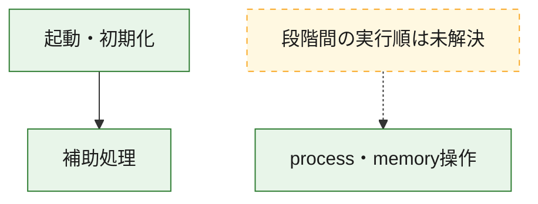
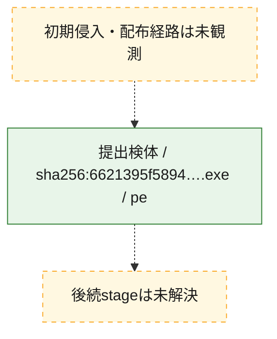
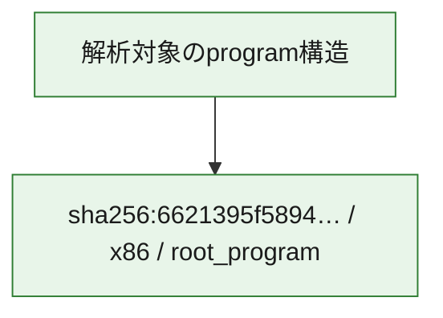

# 全体ロジック：6621395f58949936ac6801c6e3ef3817bf6f564fd1378acae42328d95659ab8b

代表関数の静的証跡から、起動・初期化、process・memory操作の処理群を確認しました。

## 読み方

- phaseの掲載順は解析上の整理順です。observed_call_edgesがない段階間の実行順を断定しません。
- 図の実線は静的に観測した関係、点線と黄色のノードは未観測・未解決の関係を示します。
- 図は静的な要約であり、動的実行を再現するものではありません。
- 詳細な関数解説とfingerprintは[STATIC-LOGIC.md](STATIC-LOGIC.md)を参照してください。

## 静的可視化

### 実行フロー

### 感染チェーン

### モジュール関係

## 処理段階

### 1. 起動・初期化

entry pointから初期化と後続処理への移行を確認します。
確度: `confirmed_static_function_evidence`

- `6621395f58949936ac6801c6e3ef3817bf6f564fd1378acae42328d95659ab8b:ghidra:2c0013e0` — 初期化と主要処理への分岐を行う入口関数です。 状態: `succeeded`、選定理由: `entry_point`, `meaningful_symbol_name`, `reviewed_call_centrality:1`, `role:entrypoint`

### 2. process・memory操作

process、thread、module、memory操作と実行移行を確認します。
確度: `confirmed_static_function_evidence`

- `6621395f58949936ac6801c6e3ef3817bf6f564fd1378acae42328d95659ab8b:ghidra:2c001840` — process、thread、module、またはmemory操作に関係する関数です。 状態: `succeeded`、選定理由: `context_representative`, `reviewed_call_centrality:16`, `role:process_or_memory_operation`
- `6621395f58949936ac6801c6e3ef3817bf6f564fd1378acae42328d95659ab8b:ghidra:2c0018b0` — process、thread、module、またはmemory操作に関係する関数です。 状態: `succeeded`、選定理由: `context_representative`, `reviewed_call_centrality:12`, `role:process_or_memory_operation`

### 3. 補助処理

主要処理を支える一般内部関数またはlibrary処理を確認します。
確度: `confirmed_static_function_evidence_with_limits`

- `6621395f58949936ac6801c6e3ef3817bf6f564fd1378acae42328d95659ab8b:ghidra:2c001000` — 検体内部の一般処理を実装する関数です。 状態: `succeeded`、選定理由: `context_representative`
- `6621395f58949936ac6801c6e3ef3817bf6f564fd1378acae42328d95659ab8b:ghidra:2c001010` — 検体内部の一般処理を実装する関数です。 状態: `succeeded`、選定理由: `context_representative`, `reviewed_call_centrality:6`
- `6621395f58949936ac6801c6e3ef3817bf6f564fd1378acae42328d95659ab8b:ghidra:2c001140` — 検体内部の一般処理を実装する関数です。 状態: `succeeded`、選定理由: `context_representative`, `reviewed_call_centrality:1`
- `6621395f58949936ac6801c6e3ef3817bf6f564fd1378acae42328d95659ab8b:ghidra:2c001190` — 検体内部の一般処理を実装する関数です。 状態: `succeeded`、選定理由: `context_representative`, `reviewed_call_centrality:21`
- `6621395f58949936ac6801c6e3ef3817bf6f564fd1378acae42328d95659ab8b:ghidra:2c001410` — 検体内部の一般処理を実装する関数です。 状態: `succeeded`、選定理由: `context_representative`, `reviewed_call_centrality:1`
- `6621395f58949936ac6801c6e3ef3817bf6f564fd1378acae42328d95659ab8b:ghidra:2c001440` — 検体内部の一般処理を実装する関数です。 状態: `succeeded`、選定理由: `context_representative`, `reviewed_call_centrality:1`
- `6621395f58949936ac6801c6e3ef3817bf6f564fd1378acae42328d95659ab8b:ghidra:2c001460` — 検体内部の一般処理を実装する関数です。 状態: `succeeded`、選定理由: `context_representative`, `reviewed_call_centrality:1`
- `6621395f58949936ac6801c6e3ef3817bf6f564fd1378acae42328d95659ab8b:ghidra:2c001470` — 検体内部の一般処理を実装する関数です。 状態: `succeeded`、選定理由: `context_representative`
- `6621395f58949936ac6801c6e3ef3817bf6f564fd1378acae42328d95659ab8b:ghidra:2c001480` — 検体内部の一般処理を実装する関数です。 状態: `succeeded`、選定理由: `context_representative`
- `6621395f58949936ac6801c6e3ef3817bf6f564fd1378acae42328d95659ab8b:ghidra:2c001490` — 検体内部の一般処理を実装する関数です。 状態: `succeeded`、選定理由: `context_representative`
- `6621395f58949936ac6801c6e3ef3817bf6f564fd1378acae42328d95659ab8b:ghidra:2c001560` — 検体内部の一般処理を実装する関数です。 状態: `succeeded`、選定理由: `context_representative`
- `6621395f58949936ac6801c6e3ef3817bf6f564fd1378acae42328d95659ab8b:ghidra:2c0015b0` — 検体内部の一般処理を実装する関数です。 状態: `succeeded`、選定理由: `context_representative`, `reviewed_call_centrality:1`
- `6621395f58949936ac6801c6e3ef3817bf6f564fd1378acae42328d95659ab8b:ghidra:2c001630` — 検体内部の一般処理を実装する関数です。 状態: `succeeded`、選定理由: `context_representative`, `reviewed_call_centrality:2`
- `6621395f58949936ac6801c6e3ef3817bf6f564fd1378acae42328d95659ab8b:ghidra:2c001650` — 検体内部の一般処理を実装する関数です。 状態: `succeeded`、選定理由: `context_representative`, `reviewed_call_centrality:1`
- `6621395f58949936ac6801c6e3ef3817bf6f564fd1378acae42328d95659ab8b:ghidra:2c001660` — compiler生成処理または汎用library処理とみられる関数です。 状態: `succeeded`、選定理由: `entry_point`, `meaningful_symbol_name`, `reviewed_call_centrality:1`
- `6621395f58949936ac6801c6e3ef3817bf6f564fd1378acae42328d95659ab8b:ghidra:2c001690` — compiler生成処理または汎用library処理とみられる関数です。 状態: `succeeded`、選定理由: `entry_point`, `meaningful_symbol_name`, `reviewed_call_centrality:3`
- `6621395f58949936ac6801c6e3ef3817bf6f564fd1378acae42328d95659ab8b:ghidra:2c001720` — 検体内部の一般処理を実装する関数です。 状態: `succeeded`、選定理由: `context_representative`
- `6621395f58949936ac6801c6e3ef3817bf6f564fd1378acae42328d95659ab8b:ghidra:2c001730` — 検体内部の一般処理を実装する関数です。 状態: `succeeded`、選定理由: `context_representative`, `reviewed_call_centrality:2`
- `6621395f58949936ac6801c6e3ef3817bf6f564fd1378acae42328d95659ab8b:ghidra:2c001830` — 検体内部の一般処理を実装する関数です。 状態: `succeeded`、選定理由: `context_representative`, `reviewed_call_centrality:3`
- `6621395f58949936ac6801c6e3ef3817bf6f564fd1378acae42328d95659ab8b:ghidra:2c001a20` — 検体内部の一般処理を実装する関数です。 状態: `succeeded`、選定理由: `context_representative`, `reviewed_call_centrality:4`
- `6621395f58949936ac6801c6e3ef3817bf6f564fd1378acae42328d95659ab8b:ghidra:2c001d80` — 検体内部の一般処理を実装する関数です。 状態: `succeeded`、選定理由: `context_representative`
- `6621395f58949936ac6801c6e3ef3817bf6f564fd1378acae42328d95659ab8b:ghidra:2c001dc0` — 検体内部の一般処理を実装する関数です。 状態: `limited_bad_instruction_or_flow`、選定理由: `context_representative`, `reviewed_call_centrality:3`
- `6621395f58949936ac6801c6e3ef3817bf6f564fd1378acae42328d95659ab8b:ghidra:2c001dd0` — 検体内部の一般処理を実装する関数です。 状態: `limited_bad_instruction_or_flow`、選定理由: `context_representative`, `reviewed_call_centrality:2`
- `6621395f58949936ac6801c6e3ef3817bf6f564fd1378acae42328d95659ab8b:ghidra:2c001f90` — 検体内部の一般処理を実装する関数です。 状態: `limited_bad_instruction_or_flow`、選定理由: `context_representative`, `reviewed_call_centrality:9`
- `6621395f58949936ac6801c6e3ef3817bf6f564fd1378acae42328d95659ab8b:ghidra:2c002010` — 検体内部の一般処理を実装する関数です。 状態: `succeeded`、選定理由: `context_representative`, `reviewed_call_centrality:5`
- `6621395f58949936ac6801c6e3ef3817bf6f564fd1378acae42328d95659ab8b:ghidra:2c002090` — 検体内部の一般処理を実装する関数です。 状態: `succeeded`、選定理由: `context_representative`, `reviewed_call_centrality:5`
- `6621395f58949936ac6801c6e3ef3817bf6f564fd1378acae42328d95659ab8b:ghidra:2c002130` — 検体内部の一般処理を実装する関数です。 状態: `succeeded`、選定理由: `context_representative`, `reviewed_call_centrality:9`
- `6621395f58949936ac6801c6e3ef3817bf6f564fd1378acae42328d95659ab8b:ghidra:2c002230` — 検体内部の一般処理を実装する関数です。 状態: `succeeded`、選定理由: `context_representative`
- `6621395f58949936ac6801c6e3ef3817bf6f564fd1378acae42328d95659ab8b:ghidra:2c002260` — 検体内部の一般処理を実装する関数です。 状態: `succeeded`、選定理由: `context_representative`

## 観測したcall関係

- `6621395f58949936ac6801c6e3ef3817bf6f564fd1378acae42328d95659ab8b:ghidra:2c001010` → `6621395f58949936ac6801c6e3ef3817bf6f564fd1378acae42328d95659ab8b:ghidra:2c001650` （`support` → `support`）
- `6621395f58949936ac6801c6e3ef3817bf6f564fd1378acae42328d95659ab8b:ghidra:2c001010` → `6621395f58949936ac6801c6e3ef3817bf6f564fd1378acae42328d95659ab8b:ghidra:2c001dc0` （`support` → `support`）
- `6621395f58949936ac6801c6e3ef3817bf6f564fd1378acae42328d95659ab8b:ghidra:2c001190` → `6621395f58949936ac6801c6e3ef3817bf6f564fd1378acae42328d95659ab8b:ghidra:2c001630` （`support` → `support`）
- `6621395f58949936ac6801c6e3ef3817bf6f564fd1378acae42328d95659ab8b:ghidra:2c001190` → `6621395f58949936ac6801c6e3ef3817bf6f564fd1378acae42328d95659ab8b:ghidra:2c001690` （`support` → `support`）
- `6621395f58949936ac6801c6e3ef3817bf6f564fd1378acae42328d95659ab8b:ghidra:2c001190` → `6621395f58949936ac6801c6e3ef3817bf6f564fd1378acae42328d95659ab8b:ghidra:2c001830` （`support` → `support`）
- `6621395f58949936ac6801c6e3ef3817bf6f564fd1378acae42328d95659ab8b:ghidra:2c001190` → `6621395f58949936ac6801c6e3ef3817bf6f564fd1378acae42328d95659ab8b:ghidra:2c001a20` （`support` → `support`）
- `6621395f58949936ac6801c6e3ef3817bf6f564fd1378acae42328d95659ab8b:ghidra:2c0013e0` → `6621395f58949936ac6801c6e3ef3817bf6f564fd1378acae42328d95659ab8b:ghidra:2c001190` （`startup` → `support`）
- `6621395f58949936ac6801c6e3ef3817bf6f564fd1378acae42328d95659ab8b:ghidra:2c001410` → `6621395f58949936ac6801c6e3ef3817bf6f564fd1378acae42328d95659ab8b:ghidra:2c001190` （`support` → `support`）
- `6621395f58949936ac6801c6e3ef3817bf6f564fd1378acae42328d95659ab8b:ghidra:2c001660` → `6621395f58949936ac6801c6e3ef3817bf6f564fd1378acae42328d95659ab8b:ghidra:2c002130` （`support` → `support`）
- `6621395f58949936ac6801c6e3ef3817bf6f564fd1378acae42328d95659ab8b:ghidra:2c001690` → `6621395f58949936ac6801c6e3ef3817bf6f564fd1378acae42328d95659ab8b:ghidra:2c002130` （`support` → `support`）
- `6621395f58949936ac6801c6e3ef3817bf6f564fd1378acae42328d95659ab8b:ghidra:2c0018b0` → `6621395f58949936ac6801c6e3ef3817bf6f564fd1378acae42328d95659ab8b:ghidra:2c001840` （`execution` → `execution`）
- `6621395f58949936ac6801c6e3ef3817bf6f564fd1378acae42328d95659ab8b:ghidra:2c001dd0` → `6621395f58949936ac6801c6e3ef3817bf6f564fd1378acae42328d95659ab8b:ghidra:2c001830` （`support` → `support`）
- `6621395f58949936ac6801c6e3ef3817bf6f564fd1378acae42328d95659ab8b:ghidra:2c002130` → `6621395f58949936ac6801c6e3ef3817bf6f564fd1378acae42328d95659ab8b:ghidra:2c001830` （`support` → `support`）
- `6621395f58949936ac6801c6e3ef3817bf6f564fd1378acae42328d95659ab8b:ghidra:2c002130` → `6621395f58949936ac6801c6e3ef3817bf6f564fd1378acae42328d95659ab8b:ghidra:2c001f90` （`support` → `support`）
- `ghidra-function:082b457f6c849935f7b36289` → `ghidra-external:3e0149134a8a4090a98c5e96` （`unclassified` → `unclassified`）
- `ghidra-function:1c81b54b971ae2080824f169` → `ghidra-external:339d9028d182c922cdd54b6a` （`unclassified` → `unclassified`）
- `ghidra-function:1c81b54b971ae2080824f169` → `ghidra-external:d16aac238c3a0cc157cee5ec` （`unclassified` → `unclassified`）
- `ghidra-function:1c81b54b971ae2080824f169` → `ghidra-function:1a48465d6b015bff211935e0` （`unclassified` → `unclassified`）
- `ghidra-function:1c81b54b971ae2080824f169` → `ghidra-function:70f11c03567eeeea5af026fc` （`unclassified` → `unclassified`）
- `ghidra-function:1c81b54b971ae2080824f169` → `ghidra-function:9605a19559aa23c64e369160` （`unclassified` → `unclassified`）
- `ghidra-function:1c81b54b971ae2080824f169` → `ghidra-function:ab00756e75576ee017f2811d` （`unclassified` → `unclassified`）
- `ghidra-function:246b0bb1bacc32a13ccbd93a` → `ghidra-function:2664476fc2b5a7dc49b3375a` （`unclassified` → `unclassified`）
- `ghidra-function:25520ddc23944e9c09ebbc90` → `ghidra-external:0bfc9df35e025c2b25dcca92` （`unclassified` → `unclassified`）
- `ghidra-function:25520ddc23944e9c09ebbc90` → `ghidra-external:108945c8e91352455b6ae3c9` （`unclassified` → `unclassified`）
- `ghidra-function:25520ddc23944e9c09ebbc90` → `ghidra-external:1eac3635d929a1e25fe826c4` （`unclassified` → `unclassified`）
- `ghidra-function:25520ddc23944e9c09ebbc90` → `ghidra-external:2972a1fa6d96f25768d065b9` （`unclassified` → `unclassified`）
- `ghidra-function:25520ddc23944e9c09ebbc90` → `ghidra-external:4d26cb7f75318b07f591eae2` （`unclassified` → `unclassified`）
- `ghidra-function:25520ddc23944e9c09ebbc90` → `ghidra-external:5c2b5836cdb9a5a1cf8a7ea5` （`unclassified` → `unclassified`）
- `ghidra-function:25520ddc23944e9c09ebbc90` → `ghidra-external:795c47c3fdb9f95cbea338b0` （`unclassified` → `unclassified`）
- `ghidra-function:25520ddc23944e9c09ebbc90` → `ghidra-external:a03a65cd79110933e42cb874` （`unclassified` → `unclassified`）
- `ghidra-function:25520ddc23944e9c09ebbc90` → `ghidra-external:f03d303b1de7f96b737ba0a8` （`unclassified` → `unclassified`）
- `ghidra-function:25520ddc23944e9c09ebbc90` → `ghidra-function:185a3185df7c33ddc820c979` （`unclassified` → `unclassified`）
- `ghidra-function:25520ddc23944e9c09ebbc90` → `ghidra-function:8338ef7b1325254d252f761a` （`unclassified` → `unclassified`）
- `ghidra-function:25520ddc23944e9c09ebbc90` → `ghidra-function:8a5922ac4cdb9699ef63f956` （`unclassified` → `unclassified`）
- `ghidra-function:25520ddc23944e9c09ebbc90` → `ghidra-function:9d0d6b56996d700132019b87` （`unclassified` → `unclassified`）
- `ghidra-function:25520ddc23944e9c09ebbc90` → `ghidra-function:a8443ecd7562fbdb23831dfb` （`unclassified` → `unclassified`）
- `ghidra-function:25520ddc23944e9c09ebbc90` → `ghidra-function:acaf5b3e4dbc3d650092f523` （`unclassified` → `unclassified`）
- `ghidra-function:25520ddc23944e9c09ebbc90` → `ghidra-function:b52a19da958fe273ef65cfd9` （`unclassified` → `unclassified`）
- `ghidra-function:25520ddc23944e9c09ebbc90` → `ghidra-function:e330e65246e8135762acc0da` （`unclassified` → `unclassified`）
- `ghidra-function:2664476fc2b5a7dc49b3375a` → `ghidra-external:1661727b869f29e5c41cff55` （`unclassified` → `unclassified`）
- `ghidra-function:2664476fc2b5a7dc49b3375a` → `ghidra-function:185a3185df7c33ddc820c979` （`unclassified` → `unclassified`）
- `ghidra-function:2664476fc2b5a7dc49b3375a` → `ghidra-function:293bced9d20c3f3330fdca17` （`unclassified` → `unclassified`）
- `ghidra-function:2664476fc2b5a7dc49b3375a` → `ghidra-function:4b008546fbc0ee9cf304eae3` （`unclassified` → `unclassified`）
- `ghidra-function:2664476fc2b5a7dc49b3375a` → `ghidra-function:d7546965dbb782940628e0c0` （`unclassified` → `unclassified`）
- `ghidra-function:293bced9d20c3f3330fdca17` → `ghidra-function:3753e8c6f6f4716fe31e52fc` （`unclassified` → `unclassified`）
- `ghidra-function:293bced9d20c3f3330fdca17` → `ghidra-function:7024c58a0a574d1eb393faed` （`unclassified` → `unclassified`）
- `ghidra-function:293bced9d20c3f3330fdca17` → `ghidra-function:8fbd82f8b7d232398d224dda` （`unclassified` → `unclassified`）
- `ghidra-function:293bced9d20c3f3330fdca17` → `ghidra-function:f4ff76e0b4a1b65d2af08077` （`unclassified` → `unclassified`）
- `ghidra-function:60b17daa3908861bd7a8e343` → `ghidra-external:96fe0d1d73dc10929bd14c92` （`unclassified` → `unclassified`）
- `ghidra-function:60b17daa3908861bd7a8e343` → `ghidra-function:7024c58a0a574d1eb393faed` （`unclassified` → `unclassified`）
- `ghidra-function:60b17daa3908861bd7a8e343` → `ghidra-function:8fbd82f8b7d232398d224dda` （`unclassified` → `unclassified`）
- `ghidra-function:68e394afce6afabe0d7af29a` → `ghidra-external:1661727b869f29e5c41cff55` （`unclassified` → `unclassified`）
- `ghidra-function:68e394afce6afabe0d7af29a` → `ghidra-function:7024c58a0a574d1eb393faed` （`unclassified` → `unclassified`）
- `ghidra-function:68e394afce6afabe0d7af29a` → `ghidra-function:8fbd82f8b7d232398d224dda` （`unclassified` → `unclassified`）
- `ghidra-function:70f11c03567eeeea5af026fc` → `ghidra-function:601fa422b508d399677f4687` （`unclassified` → `unclassified`）
- `ghidra-function:8338ef7b1325254d252f761a` → `ghidra-external:d16aac238c3a0cc157cee5ec` （`unclassified` → `unclassified`）
- `ghidra-function:8338ef7b1325254d252f761a` → `ghidra-function:2664476fc2b5a7dc49b3375a` （`unclassified` → `unclassified`）
- `ghidra-function:8f1c27e51272225b0827198a` → `ghidra-external:0077d031324789f486f66bc9` （`unclassified` → `unclassified`）
- `ghidra-function:8f1c27e51272225b0827198a` → `ghidra-function:494d5e2889a3cea986e566e9` （`unclassified` → `unclassified`）
- `ghidra-function:a8443ecd7562fbdb23831dfb` → `ghidra-external:8c3070bcea883fc2416d261f` （`unclassified` → `unclassified`）
- `ghidra-function:b7371370b6f185625ff43063` → `ghidra-function:25520ddc23944e9c09ebbc90` （`unclassified` → `unclassified`）
- `ghidra-function:bbad722b29e368a9a99c1c29` → `ghidra-external:47c343e78ec54a8af7265629` （`unclassified` → `unclassified`）
- `ghidra-function:bbad722b29e368a9a99c1c29` → `ghidra-external:b4483e04ed6e4f430f68cd00` （`unclassified` → `unclassified`）
- `ghidra-function:bbad722b29e368a9a99c1c29` → `ghidra-external:cc56b2c77d44d93e2676c3a5` （`unclassified` → `unclassified`）
- `ghidra-function:bbad722b29e368a9a99c1c29` → `ghidra-external:d16aac238c3a0cc157cee5ec` （`unclassified` → `unclassified`）
- `ghidra-function:bbad722b29e368a9a99c1c29` → `ghidra-external:e918122a5aeb364964edfe88` （`unclassified` → `unclassified`）
- `ghidra-function:bbad722b29e368a9a99c1c29` → `ghidra-function:1b667892e59953fcd91eabb5` （`unclassified` → `unclassified`）
- `ghidra-function:bbad722b29e368a9a99c1c29` → `ghidra-function:2c78ffdafadf26bd2fa1b2df` （`unclassified` → `unclassified`）
- `ghidra-function:bbad722b29e368a9a99c1c29` → `ghidra-function:3753e8c6f6f4716fe31e52fc` （`unclassified` → `unclassified`）
- `ghidra-function:bbad722b29e368a9a99c1c29` → `ghidra-function:3d28c3c69daabad729e90656` （`unclassified` → `unclassified`）
- `ghidra-function:bbad722b29e368a9a99c1c29` → `ghidra-function:494d5e2889a3cea986e566e9` （`unclassified` → `unclassified`）
- `ghidra-function:bbad722b29e368a9a99c1c29` → `ghidra-function:862633cac06699d4c9514a49` （`unclassified` → `unclassified`）
- `ghidra-function:bbad722b29e368a9a99c1c29` → `ghidra-function:d418f322dc1636a8ad3570d0` （`unclassified` → `unclassified`）
- `ghidra-function:bf63ecfd5aae8c0c293ffa69` → `ghidra-external:0d1e147efdf1beb0c7f02e19` （`unclassified` → `unclassified`）
- `ghidra-function:bf63ecfd5aae8c0c293ffa69` → `ghidra-function:185a3185df7c33ddc820c979` （`unclassified` → `unclassified`）
- `ghidra-function:c4ab4ca445ce79e666e8fa39` → `ghidra-external:8c3070bcea883fc2416d261f` （`unclassified` → `unclassified`）
- `ghidra-function:c664f5675ce46cacec2730e1` → `ghidra-function:25520ddc23944e9c09ebbc90` （`unclassified` → `unclassified`）
- `ghidra-function:cc35fab89fe6aaecddc5a202` → `ghidra-external:8c3070bcea883fc2416d261f` （`unclassified` → `unclassified`）
- `ghidra-function:d0d3b4d540824d1fe34a6203` → `ghidra-external:8c3070bcea883fc2416d261f` （`unclassified` → `unclassified`）
- `ghidra-function:e330e65246e8135762acc0da` → `ghidra-external:d16aac238c3a0cc157cee5ec` （`unclassified` → `unclassified`）
- `ghidra-function:e330e65246e8135762acc0da` → `ghidra-external:e918122a5aeb364964edfe88` （`unclassified` → `unclassified`）
- `ghidra-function:e330e65246e8135762acc0da` → `ghidra-function:3d28c3c69daabad729e90656` （`unclassified` → `unclassified`）
- `ghidra-function:f84f44fe00a8c3b6e4fb620e` → `ghidra-external:d16aac238c3a0cc157cee5ec` （`unclassified` → `unclassified`）
- `ghidra-function:f84f44fe00a8c3b6e4fb620e` → `ghidra-external:e918122a5aeb364964edfe88` （`unclassified` → `unclassified`）
- `ghidra-function:f84f44fe00a8c3b6e4fb620e` → `ghidra-function:1b667892e59953fcd91eabb5` （`unclassified` → `unclassified`）
- `ghidra-function:f84f44fe00a8c3b6e4fb620e` → `ghidra-function:2c78ffdafadf26bd2fa1b2df` （`unclassified` → `unclassified`）
- `ghidra-function:f84f44fe00a8c3b6e4fb620e` → `ghidra-function:3753e8c6f6f4716fe31e52fc` （`unclassified` → `unclassified`）
- `ghidra-function:f84f44fe00a8c3b6e4fb620e` → `ghidra-function:3d28c3c69daabad729e90656` （`unclassified` → `unclassified`）
- `ghidra-function:f84f44fe00a8c3b6e4fb620e` → `ghidra-function:862633cac06699d4c9514a49` （`unclassified` → `unclassified`）
- `ghidra-function:f84f44fe00a8c3b6e4fb620e` → `ghidra-function:bbad722b29e368a9a99c1c29` （`unclassified` → `unclassified`）
- `ghidra-function:f84f44fe00a8c3b6e4fb620e` → `ghidra-function:d418f322dc1636a8ad3570d0` （`unclassified` → `unclassified`）

## 解析範囲と制約

- 選定外関数は全体inventoryへ残しますが、関数本体の個別解説対象にはしていません。
- indirect call、難読化、packer、VM、壊れたcontrol flowによりcall関係が欠落する場合があります。
- 文書は静的解析に基づき、検体実行や外部通信による動的確認は行っていません。
