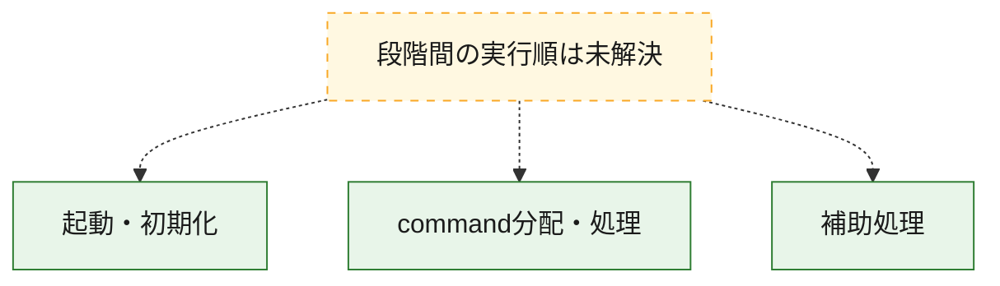
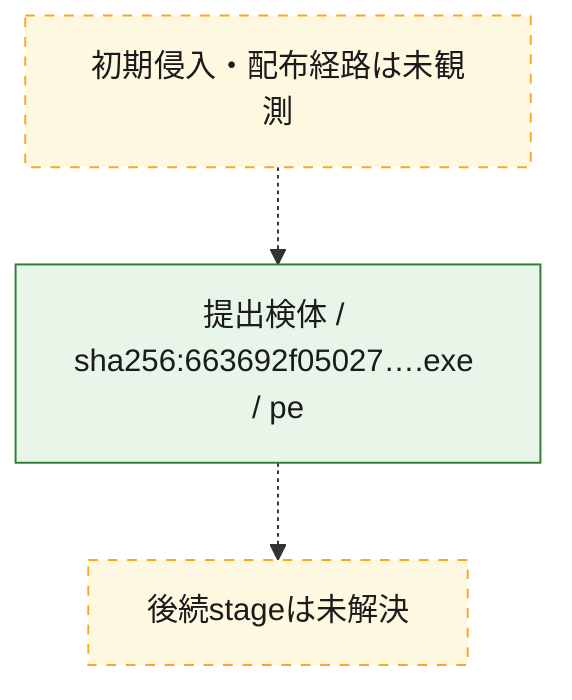
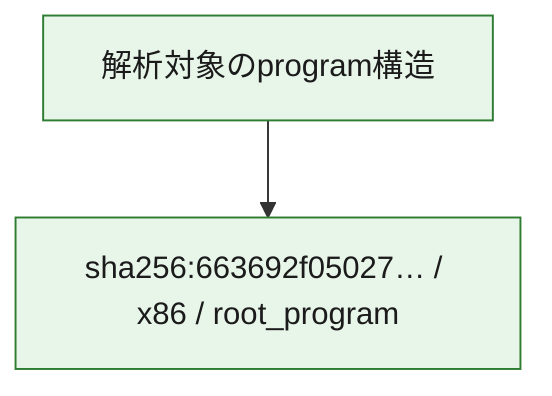

# 全体ロジック：663692f0502786a59fd4d30bc0d552cc9dffadb008ff1c5079191eb2ffdb2f57

代表関数の静的証跡から、起動・初期化、command分配・処理の処理群を確認しました。

## 読み方

- phaseの掲載順は解析上の整理順です。observed_call_edgesがない段階間の実行順を断定しません。
- 図の実線は静的に観測した関係、点線と黄色のノードは未観測・未解決の関係を示します。
- 図は静的な要約であり、動的実行を再現するものではありません。
- 詳細な関数解説とfingerprintは[STATIC-LOGIC.md](STATIC-LOGIC.md)を参照してください。

## 静的可視化

### 実行フロー

### 感染チェーン

### モジュール関係

## 処理段階

### 1. 起動・初期化

entry pointから初期化と後続処理への移行を確認します。
確度: `confirmed_static_function_evidence`

- `663692f0502786a59fd4d30bc0d552cc9dffadb008ff1c5079191eb2ffdb2f57:ghidra:1401da25c` — 初期化と主要処理への分岐を行う入口関数です。 状態: `succeeded`、選定理由: `entry_point`, `meaningful_symbol_name`, `reviewed_call_centrality:21`, `role:entrypoint`

### 2. command分配・処理

受信commandやtaskの解釈、分配、個別handlerへの移行を確認します。
確度: `confirmed_static_function_evidence_with_limits`

- `663692f0502786a59fd4d30bc0d552cc9dffadb008ff1c5079191eb2ffdb2f57:ghidra:140206e40` — commandの解釈、分配、または個別処理を担当する関数です。 状態: `limited_bad_instruction_or_flow`、選定理由: `meaningful_symbol_name`, `role:command_dispatch_or_handler`

### 3. 補助処理

主要処理を支える一般内部関数またはlibrary処理を確認します。
確度: `confirmed_static_function_evidence`

- `663692f0502786a59fd4d30bc0d552cc9dffadb008ff1c5079191eb2ffdb2f57:ghidra:140001000` — 検体内部の一般処理を実装する関数です。 状態: `succeeded`、選定理由: `context_representative`, `reviewed_call_centrality:6`
- `663692f0502786a59fd4d30bc0d552cc9dffadb008ff1c5079191eb2ffdb2f57:ghidra:140001090` — 検体内部の一般処理を実装する関数です。 状態: `succeeded`、選定理由: `context_representative`, `reviewed_call_centrality:2`
- `663692f0502786a59fd4d30bc0d552cc9dffadb008ff1c5079191eb2ffdb2f57:ghidra:1400010e4` — 検体内部の一般処理を実装する関数です。 状態: `succeeded`、選定理由: `context_representative`, `reviewed_call_centrality:6`
- `663692f0502786a59fd4d30bc0d552cc9dffadb008ff1c5079191eb2ffdb2f57:ghidra:140001138` — 検体内部の一般処理を実装する関数です。 状態: `succeeded`、選定理由: `context_representative`, `reviewed_call_centrality:2`
- `663692f0502786a59fd4d30bc0d552cc9dffadb008ff1c5079191eb2ffdb2f57:ghidra:14000118c` — 検体内部の一般処理を実装する関数です。 状態: `succeeded`、選定理由: `context_representative`, `reviewed_call_centrality:2`
- `663692f0502786a59fd4d30bc0d552cc9dffadb008ff1c5079191eb2ffdb2f57:ghidra:1400011e4` — 検体内部の一般処理を実装する関数です。 状態: `succeeded`、選定理由: `context_representative`, `reviewed_call_centrality:12`
- `663692f0502786a59fd4d30bc0d552cc9dffadb008ff1c5079191eb2ffdb2f57:ghidra:140001338` — 検体内部の一般処理を実装する関数です。 状態: `succeeded`、選定理由: `context_representative`, `reviewed_call_centrality:16`
- `663692f0502786a59fd4d30bc0d552cc9dffadb008ff1c5079191eb2ffdb2f57:ghidra:1400015d0` — 検体内部の一般処理を実装する関数です。 状態: `succeeded`、選定理由: `context_representative`, `reviewed_call_centrality:7`
- `663692f0502786a59fd4d30bc0d552cc9dffadb008ff1c5079191eb2ffdb2f57:ghidra:140001640` — 検体内部の一般処理を実装する関数です。 状態: `succeeded`、選定理由: `context_representative`, `reviewed_call_centrality:7`
- `663692f0502786a59fd4d30bc0d552cc9dffadb008ff1c5079191eb2ffdb2f57:ghidra:1400016b4` — 検体内部の一般処理を実装する関数です。 状態: `succeeded`、選定理由: `context_representative`, `reviewed_call_centrality:14`
- `663692f0502786a59fd4d30bc0d552cc9dffadb008ff1c5079191eb2ffdb2f57:ghidra:1400017e4` — 検体内部の一般処理を実装する関数です。 状態: `succeeded`、選定理由: `context_representative`, `reviewed_call_centrality:13`
- `663692f0502786a59fd4d30bc0d552cc9dffadb008ff1c5079191eb2ffdb2f57:ghidra:1400019f0` — 検体内部の一般処理を実装する関数です。 状態: `succeeded`、選定理由: `context_representative`, `reviewed_call_centrality:10`
- `663692f0502786a59fd4d30bc0d552cc9dffadb008ff1c5079191eb2ffdb2f57:ghidra:140001a9c` — 検体内部の一般処理を実装する関数です。 状態: `succeeded`、選定理由: `context_representative`, `reviewed_call_centrality:3`
- `663692f0502786a59fd4d30bc0d552cc9dffadb008ff1c5079191eb2ffdb2f57:ghidra:140001b1c` — 検体内部の一般処理を実装する関数です。 状態: `succeeded`、選定理由: `context_representative`, `reviewed_call_centrality:10`
- `663692f0502786a59fd4d30bc0d552cc9dffadb008ff1c5079191eb2ffdb2f57:ghidra:140001d34` — 検体内部の一般処理を実装する関数です。 状態: `succeeded`、選定理由: `context_representative`, `reviewed_call_centrality:1`
- `663692f0502786a59fd4d30bc0d552cc9dffadb008ff1c5079191eb2ffdb2f57:ghidra:140001d50` — 検体内部の一般処理を実装する関数です。 状態: `succeeded`、選定理由: `context_representative`, `reviewed_call_centrality:16`
- `663692f0502786a59fd4d30bc0d552cc9dffadb008ff1c5079191eb2ffdb2f57:ghidra:140001f04` — 検体内部の一般処理を実装する関数です。 状態: `succeeded`、選定理由: `context_representative`, `reviewed_call_centrality:6`
- `663692f0502786a59fd4d30bc0d552cc9dffadb008ff1c5079191eb2ffdb2f57:ghidra:140001f64` — 検体内部の一般処理を実装する関数です。 状態: `succeeded`、選定理由: `context_representative`, `reviewed_call_centrality:3`
- `663692f0502786a59fd4d30bc0d552cc9dffadb008ff1c5079191eb2ffdb2f57:ghidra:140001fa8` — 検体内部の一般処理を実装する関数です。 状態: `succeeded`、選定理由: `context_representative`, `reviewed_call_centrality:17`
- `663692f0502786a59fd4d30bc0d552cc9dffadb008ff1c5079191eb2ffdb2f57:ghidra:1400021e8` — 検体内部の一般処理を実装する関数です。 状態: `succeeded`、選定理由: `context_representative`, `reviewed_call_centrality:12`
- `663692f0502786a59fd4d30bc0d552cc9dffadb008ff1c5079191eb2ffdb2f57:ghidra:140002358` — 検体内部の一般処理を実装する関数です。 状態: `succeeded`、選定理由: `context_representative`, `reviewed_call_centrality:5`
- `663692f0502786a59fd4d30bc0d552cc9dffadb008ff1c5079191eb2ffdb2f57:ghidra:1400023a4` — 検体内部の一般処理を実装する関数です。 状態: `succeeded`、選定理由: `context_representative`, `reviewed_call_centrality:6`
- `663692f0502786a59fd4d30bc0d552cc9dffadb008ff1c5079191eb2ffdb2f57:ghidra:14000242c` — 検体内部の一般処理を実装する関数です。 状態: `succeeded`、選定理由: `context_representative`, `reviewed_call_centrality:4`
- `663692f0502786a59fd4d30bc0d552cc9dffadb008ff1c5079191eb2ffdb2f57:ghidra:140002480` — 検体内部の一般処理を実装する関数です。 状態: `succeeded`、選定理由: `context_representative`, `reviewed_call_centrality:4`
- `663692f0502786a59fd4d30bc0d552cc9dffadb008ff1c5079191eb2ffdb2f57:ghidra:1400024d8` — 検体内部の一般処理を実装する関数です。 状態: `succeeded`、選定理由: `context_representative`, `reviewed_call_centrality:4`
- `663692f0502786a59fd4d30bc0d552cc9dffadb008ff1c5079191eb2ffdb2f57:ghidra:14000252c` — 検体内部の一般処理を実装する関数です。 状態: `succeeded`、選定理由: `context_representative`, `reviewed_call_centrality:3`
- `663692f0502786a59fd4d30bc0d552cc9dffadb008ff1c5079191eb2ffdb2f57:ghidra:140002574` — 検体内部の一般処理を実装する関数です。 状態: `succeeded`、選定理由: `context_representative`, `reviewed_call_centrality:5`
- `663692f0502786a59fd4d30bc0d552cc9dffadb008ff1c5079191eb2ffdb2f57:ghidra:1400025d0` — 検体内部の一般処理を実装する関数です。 状態: `succeeded`、選定理由: `context_representative`, `reviewed_call_centrality:11`
- `663692f0502786a59fd4d30bc0d552cc9dffadb008ff1c5079191eb2ffdb2f57:ghidra:140002724` — 検体内部の一般処理を実装する関数です。 状態: `succeeded`、選定理由: `context_representative`, `reviewed_call_centrality:4`
- `663692f0502786a59fd4d30bc0d552cc9dffadb008ff1c5079191eb2ffdb2f57:ghidra:140004780` — 検体内部の一般処理を実装する関数です。 状態: `succeeded`、選定理由: `meaningful_symbol_name`

## 観測したcall関係

- `663692f0502786a59fd4d30bc0d552cc9dffadb008ff1c5079191eb2ffdb2f57:ghidra:140001338` → `663692f0502786a59fd4d30bc0d552cc9dffadb008ff1c5079191eb2ffdb2f57:ghidra:1400010e4` （`support` → `support`）
- `663692f0502786a59fd4d30bc0d552cc9dffadb008ff1c5079191eb2ffdb2f57:ghidra:1400016b4` → `663692f0502786a59fd4d30bc0d552cc9dffadb008ff1c5079191eb2ffdb2f57:ghidra:140001000` （`support` → `support`）
- `663692f0502786a59fd4d30bc0d552cc9dffadb008ff1c5079191eb2ffdb2f57:ghidra:140001b1c` → `663692f0502786a59fd4d30bc0d552cc9dffadb008ff1c5079191eb2ffdb2f57:ghidra:140001000` （`support` → `support`）
- `663692f0502786a59fd4d30bc0d552cc9dffadb008ff1c5079191eb2ffdb2f57:ghidra:140002574` → `663692f0502786a59fd4d30bc0d552cc9dffadb008ff1c5079191eb2ffdb2f57:ghidra:1400010e4` （`support` → `support`）
- `663692f0502786a59fd4d30bc0d552cc9dffadb008ff1c5079191eb2ffdb2f57:ghidra:1400025d0` → `663692f0502786a59fd4d30bc0d552cc9dffadb008ff1c5079191eb2ffdb2f57:ghidra:1400010e4` （`support` → `support`）
- `ghidra-function:00505615a4f8ff812b348f1d` → `ghidra-external:043eab57e333fb5c10320720` （`unclassified` → `unclassified`）
- `ghidra-function:00505615a4f8ff812b348f1d` → `ghidra-external:3545d5dd98835451cecb6a19` （`unclassified` → `unclassified`）
- `ghidra-function:00505615a4f8ff812b348f1d` → `ghidra-external:4fe8850c40b20a1b547f4948` （`unclassified` → `unclassified`）
- `ghidra-function:00505615a4f8ff812b348f1d` → `ghidra-external:a0c3fc2a7169e717146ef01f` （`unclassified` → `unclassified`）
- `ghidra-function:00505615a4f8ff812b348f1d` → `ghidra-external:ad2b0ee6a7c9c5130f2f0aee` （`unclassified` → `unclassified`）
- `ghidra-function:00505615a4f8ff812b348f1d` → `ghidra-external:be2f43727d7d5140e577825e` （`unclassified` → `unclassified`）
- `ghidra-function:00505615a4f8ff812b348f1d` → `ghidra-external:d23c530712dc9e98b13fb0e6` （`unclassified` → `unclassified`）
- `ghidra-function:00505615a4f8ff812b348f1d` → `ghidra-external:f6be6f11074c728cef8ade2f` （`unclassified` → `unclassified`）
- `ghidra-function:00505615a4f8ff812b348f1d` → `ghidra-function:036e9c449b4433bb3fa10afe` （`unclassified` → `unclassified`）
- `ghidra-function:00505615a4f8ff812b348f1d` → `ghidra-function:34976f6da98ea6631d9a6ebd` （`unclassified` → `unclassified`）
- `ghidra-function:00505615a4f8ff812b348f1d` → `ghidra-function:35bd1e2cbf49a788c7c8126f` （`unclassified` → `unclassified`）
- `ghidra-function:00505615a4f8ff812b348f1d` → `ghidra-function:3f6d1e86450ea61672f39d24` （`unclassified` → `unclassified`）
- `ghidra-function:00505615a4f8ff812b348f1d` → `ghidra-function:4329c79747b9570767969d3f` （`unclassified` → `unclassified`）
- `ghidra-function:00505615a4f8ff812b348f1d` → `ghidra-function:49faeda1b58eb3386090b4a1` （`unclassified` → `unclassified`）
- `ghidra-function:00505615a4f8ff812b348f1d` → `ghidra-function:59e3525000e83b51a9091cc1` （`unclassified` → `unclassified`）
- `ghidra-function:00505615a4f8ff812b348f1d` → `ghidra-function:629b78db684d0d877cd0a8f4` （`unclassified` → `unclassified`）
- `ghidra-function:00505615a4f8ff812b348f1d` → `ghidra-function:8c20d9f3e7ac47d74b9c9ff3` （`unclassified` → `unclassified`）
- `ghidra-function:00505615a4f8ff812b348f1d` → `ghidra-function:a5779fce5c84f8c42d8c80a7` （`unclassified` → `unclassified`）
- `ghidra-function:00505615a4f8ff812b348f1d` → `ghidra-function:b7a66f9d1eaa2242c5c3d7d9` （`unclassified` → `unclassified`）
- `ghidra-function:00505615a4f8ff812b348f1d` → `ghidra-function:c23a78dcda67c8a1a95a7e79` （`unclassified` → `unclassified`）
- `ghidra-function:00505615a4f8ff812b348f1d` → `ghidra-function:e2b0de3119fab409e1c20189` （`unclassified` → `unclassified`）
- `ghidra-function:0800ca4fd2dd33c6faa626ed` → `ghidra-external:34de073f3cbbb22a8ce5e43d` （`unclassified` → `unclassified`）
- `ghidra-function:0800ca4fd2dd33c6faa626ed` → `ghidra-function:4dbfd86fbcb5e4e67fbf79f1` （`unclassified` → `unclassified`）
- `ghidra-function:0800ca4fd2dd33c6faa626ed` → `ghidra-function:9b199bd850df0305bcafc431` （`unclassified` → `unclassified`）
- `ghidra-function:0800ca4fd2dd33c6faa626ed` → `ghidra-function:e6ade7ad39fef1af2e121655` （`unclassified` → `unclassified`）
- `ghidra-function:0b43f0f3098586e613c27945` → `ghidra-function:0374527206d3347de32930bb` （`unclassified` → `unclassified`）
- `ghidra-function:0b43f0f3098586e613c27945` → `ghidra-function:7771fbb8a6a7427f9726ef4a` （`unclassified` → `unclassified`）
- `ghidra-function:0b43f0f3098586e613c27945` → `ghidra-function:9b199bd850df0305bcafc431` （`unclassified` → `unclassified`）
- `ghidra-function:0dad47543c0c22aeee6b9d30` → `ghidra-external:455a43c66e074763e87a1cb4` （`unclassified` → `unclassified`）
- `ghidra-function:0dad47543c0c22aeee6b9d30` → `ghidra-external:5c48f9780b6feb747952e296` （`unclassified` → `unclassified`）
- `ghidra-function:0dad47543c0c22aeee6b9d30` → `ghidra-external:f7e9772d1bfa6fab01910486` （`unclassified` → `unclassified`）
- `ghidra-function:0dad47543c0c22aeee6b9d30` → `ghidra-function:03fc67c5748383132c8088b0` （`unclassified` → `unclassified`）
- `ghidra-function:0dad47543c0c22aeee6b9d30` → `ghidra-function:2d76b8f2a45d68b27dc29dbe` （`unclassified` → `unclassified`）
- `ghidra-function:0dad47543c0c22aeee6b9d30` → `ghidra-function:39c90ea6a2233ada71edef4b` （`unclassified` → `unclassified`）
- `ghidra-function:0dad47543c0c22aeee6b9d30` → `ghidra-function:535b9b7da85d051a529dd9cf` （`unclassified` → `unclassified`）
- `ghidra-function:0dad47543c0c22aeee6b9d30` → `ghidra-function:61b63cd99f9d109b885178b3` （`unclassified` → `unclassified`）
- `ghidra-function:0dad47543c0c22aeee6b9d30` → `ghidra-function:9371b4c0d635ff0b0d74e49a` （`unclassified` → `unclassified`）
- `ghidra-function:0dad47543c0c22aeee6b9d30` → `ghidra-function:969d3e8b02ec3af2859ab050` （`unclassified` → `unclassified`）
- `ghidra-function:0dad47543c0c22aeee6b9d30` → `ghidra-function:c0605b4a4f5ddc957648687e` （`unclassified` → `unclassified`）
- `ghidra-function:0dad47543c0c22aeee6b9d30` → `ghidra-function:ccc3837073408bf76ae4e022` （`unclassified` → `unclassified`）
- `ghidra-function:0dad47543c0c22aeee6b9d30` → `ghidra-function:d2305b3dd0d62052a848f1ea` （`unclassified` → `unclassified`）
- `ghidra-function:0dad47543c0c22aeee6b9d30` → `ghidra-function:dace12354db5ebf084bbfed7` （`unclassified` → `unclassified`）
- `ghidra-function:0dad47543c0c22aeee6b9d30` → `ghidra-function:e5b7d8831a8a5d52b3c76ad1` （`unclassified` → `unclassified`）
- `ghidra-function:0dad47543c0c22aeee6b9d30` → `ghidra-function:ed1d000e4b8555fffe3390f1` （`unclassified` → `unclassified`）
- `ghidra-function:1374725bd36a77b2cebdb049` → `ghidra-external:34de073f3cbbb22a8ce5e43d` （`unclassified` → `unclassified`）
- `ghidra-function:1374725bd36a77b2cebdb049` → `ghidra-external:e36819c66bacbe9c28efe4e8` （`unclassified` → `unclassified`）
- `ghidra-function:1374725bd36a77b2cebdb049` → `ghidra-function:03fc67c5748383132c8088b0` （`unclassified` → `unclassified`）
- `ghidra-function:1374725bd36a77b2cebdb049` → `ghidra-function:214da2003be595ca22bd642a` （`unclassified` → `unclassified`）
- `ghidra-function:1374725bd36a77b2cebdb049` → `ghidra-function:3cc492e960eaf33687a74f80` （`unclassified` → `unclassified`）
- `ghidra-function:1374725bd36a77b2cebdb049` → `ghidra-function:4dbfd86fbcb5e4e67fbf79f1` （`unclassified` → `unclassified`）
- `ghidra-function:1374725bd36a77b2cebdb049` → `ghidra-function:6182de385e9b9b794c84d2cb` （`unclassified` → `unclassified`）
- `ghidra-function:1374725bd36a77b2cebdb049` → `ghidra-function:7756c35e05d6530c0e0095b7` （`unclassified` → `unclassified`）
- `ghidra-function:1374725bd36a77b2cebdb049` → `ghidra-function:9b199bd850df0305bcafc431` （`unclassified` → `unclassified`）
- `ghidra-function:1374725bd36a77b2cebdb049` → `ghidra-function:b045fd5693cd16197cb71625` （`unclassified` → `unclassified`）
- `ghidra-function:1374725bd36a77b2cebdb049` → `ghidra-function:d2305b3dd0d62052a848f1ea` （`unclassified` → `unclassified`）
- `ghidra-function:1374725bd36a77b2cebdb049` → `ghidra-function:fe24a443a9c702a89bf3d4f5` （`unclassified` → `unclassified`）
- `ghidra-function:1404d17240f76524ae98b7a9` → `ghidra-external:043eab57e333fb5c10320720` （`unclassified` → `unclassified`）
- `ghidra-function:1404d17240f76524ae98b7a9` → `ghidra-external:34de073f3cbbb22a8ce5e43d` （`unclassified` → `unclassified`）
- `ghidra-function:1404d17240f76524ae98b7a9` → `ghidra-function:0efdd9fc99981316b0b0f22e` （`unclassified` → `unclassified`）
- `ghidra-function:1404d17240f76524ae98b7a9` → `ghidra-function:4dbfd86fbcb5e4e67fbf79f1` （`unclassified` → `unclassified`）
- `ghidra-function:1404d17240f76524ae98b7a9` → `ghidra-function:84ba79d3ae35bee76906e54d` （`unclassified` → `unclassified`）
- `ghidra-function:1404d17240f76524ae98b7a9` → `ghidra-function:a4eb38ad51beddbede3355b5` （`unclassified` → `unclassified`）
- `ghidra-function:1404d17240f76524ae98b7a9` → `ghidra-function:cd2530e4613b46c985737016` （`unclassified` → `unclassified`）
- `ghidra-function:1404d17240f76524ae98b7a9` → `ghidra-function:ce831d52af897125c920e8f7` （`unclassified` → `unclassified`）
- `ghidra-function:1404d17240f76524ae98b7a9` → `ghidra-function:d66148d821c926c62d1f479a` （`unclassified` → `unclassified`）
- `ghidra-function:1404d17240f76524ae98b7a9` → `ghidra-function:f245b9c6bbd75c98c156d2cd` （`unclassified` → `unclassified`）
- `ghidra-function:2d76b8f2a45d68b27dc29dbe` → `ghidra-external:ae3b93933df8a50e71601671` （`unclassified` → `unclassified`）
- `ghidra-function:2d76b8f2a45d68b27dc29dbe` → `ghidra-external:f908cf731c71c6c374d3f34c` （`unclassified` → `unclassified`）
- `ghidra-function:2d76b8f2a45d68b27dc29dbe` → `ghidra-function:e2dedf312fd6541a5a3bf98c` （`unclassified` → `unclassified`）
- `ghidra-function:2dc7272ed7b3a716ca228747` → `ghidra-external:34de073f3cbbb22a8ce5e43d` （`unclassified` → `unclassified`）
- `ghidra-function:2dc7272ed7b3a716ca228747` → `ghidra-function:1f7cb3ad72adafaf1298ccf0` （`unclassified` → `unclassified`）
- `ghidra-function:2dc7272ed7b3a716ca228747` → `ghidra-function:25adefb8808205a79bad74c0` （`unclassified` → `unclassified`）
- `ghidra-function:2dc7272ed7b3a716ca228747` → `ghidra-function:9b199bd850df0305bcafc431` （`unclassified` → `unclassified`）
- `ghidra-function:2dc7272ed7b3a716ca228747` → `ghidra-function:b045fd5693cd16197cb71625` （`unclassified` → `unclassified`）
- `ghidra-function:2dc7272ed7b3a716ca228747` → `ghidra-function:edd15fd3bc07487c9311d750` （`unclassified` → `unclassified`）
- `ghidra-function:30a4d7136ef9db8263385e61` → `ghidra-external:34de073f3cbbb22a8ce5e43d` （`unclassified` → `unclassified`）
- `ghidra-function:30a4d7136ef9db8263385e61` → `ghidra-function:4dbfd86fbcb5e4e67fbf79f1` （`unclassified` → `unclassified`）
- `ghidra-function:30a4d7136ef9db8263385e61` → `ghidra-function:9b199bd850df0305bcafc431` （`unclassified` → `unclassified`）
- `ghidra-function:30a4d7136ef9db8263385e61` → `ghidra-function:a364b72d5a8599e5546b9a09` （`unclassified` → `unclassified`）
- `ghidra-function:3f56277d263ed591b238944c` → `ghidra-function:25075601db709aeb1c74af19` （`unclassified` → `unclassified`）
- `ghidra-function:3f56277d263ed591b238944c` → `ghidra-function:502102dc7a3cf75725f9a306` （`unclassified` → `unclassified`）
- `ghidra-function:3f56277d263ed591b238944c` → `ghidra-function:f7bf5db2750da2d344696401` （`unclassified` → `unclassified`）
- `ghidra-function:4233252044503175a14b78a9` → `ghidra-external:34de073f3cbbb22a8ce5e43d` （`unclassified` → `unclassified`）
- `ghidra-function:4233252044503175a14b78a9` → `ghidra-external:5c48f9780b6feb747952e296` （`unclassified` → `unclassified`）
- `ghidra-function:4233252044503175a14b78a9` → `ghidra-function:2256d0fde1f151dea73ac32f` （`unclassified` → `unclassified`）
- `ghidra-function:4233252044503175a14b78a9` → `ghidra-function:25adefb8808205a79bad74c0` （`unclassified` → `unclassified`）
- `ghidra-function:4233252044503175a14b78a9` → `ghidra-function:321efebcd7d6e6087b575ade` （`unclassified` → `unclassified`）
- `ghidra-function:4233252044503175a14b78a9` → `ghidra-function:36e7492d982a65ee015d86cd` （`unclassified` → `unclassified`）
- `ghidra-function:4233252044503175a14b78a9` → `ghidra-function:4dbfd86fbcb5e4e67fbf79f1` （`unclassified` → `unclassified`）
- `ghidra-function:4233252044503175a14b78a9` → `ghidra-function:662b5f7018bdd1abb3a91357` （`unclassified` → `unclassified`）
- `ghidra-function:4233252044503175a14b78a9` → `ghidra-function:78d8ebaab01ae0665f765b80` （`unclassified` → `unclassified`）
- `ghidra-function:4233252044503175a14b78a9` → `ghidra-function:8188a9db21a9b84fe7d78092` （`unclassified` → `unclassified`）
- `ghidra-function:4233252044503175a14b78a9` → `ghidra-function:9b199bd850df0305bcafc431` （`unclassified` → `unclassified`）
- `ghidra-function:4233252044503175a14b78a9` → `ghidra-function:d34e892660ea7d3adbfa61c6` （`unclassified` → `unclassified`）
- `ghidra-function:4233252044503175a14b78a9` → `ghidra-function:db1967e3923fefdba13b00d7` （`unclassified` → `unclassified`）
- `ghidra-function:5363c3b3af252bad0f71c769` → `ghidra-function:06d1a2dcb8e5002af8513fa1` （`unclassified` → `unclassified`）
- `ghidra-function:5363c3b3af252bad0f71c769` → `ghidra-function:0efdd9fc99981316b0b0f22e` （`unclassified` → `unclassified`）
- `ghidra-function:5363c3b3af252bad0f71c769` → `ghidra-function:2256d0fde1f151dea73ac32f` （`unclassified` → `unclassified`）
- `ghidra-function:5363c3b3af252bad0f71c769` → `ghidra-function:25075601db709aeb1c74af19` （`unclassified` → `unclassified`）
- `ghidra-function:5363c3b3af252bad0f71c769` → `ghidra-function:4dbfd86fbcb5e4e67fbf79f1` （`unclassified` → `unclassified`）
- `ghidra-function:5363c3b3af252bad0f71c769` → `ghidra-function:6182de385e9b9b794c84d2cb` （`unclassified` → `unclassified`）
- `ghidra-function:5363c3b3af252bad0f71c769` → `ghidra-function:664aa27588a2fc671b4219b3` （`unclassified` → `unclassified`）
- `ghidra-function:5363c3b3af252bad0f71c769` → `ghidra-function:772f15f38ad31112cf7e6f74` （`unclassified` → `unclassified`）
- `ghidra-function:5363c3b3af252bad0f71c769` → `ghidra-function:a4eb38ad51beddbede3355b5` （`unclassified` → `unclassified`）
- `ghidra-function:5363c3b3af252bad0f71c769` → `ghidra-function:a6194e57cfb99a26669d4abc` （`unclassified` → `unclassified`）
- `ghidra-function:5363c3b3af252bad0f71c769` → `ghidra-function:c932c3e3a3fa22ce05f03b1f` （`unclassified` → `unclassified`）
- `ghidra-function:5363c3b3af252bad0f71c769` → `ghidra-function:cc8d6b907662f49ee7b34532` （`unclassified` → `unclassified`）
- `ghidra-function:5363c3b3af252bad0f71c769` → `ghidra-function:ce831d52af897125c920e8f7` （`unclassified` → `unclassified`）
- `ghidra-function:5363c3b3af252bad0f71c769` → `ghidra-function:d690f00acc06f8eea86c6c55` （`unclassified` → `unclassified`）
- `ghidra-function:5363c3b3af252bad0f71c769` → `ghidra-function:f245b9c6bbd75c98c156d2cd` （`unclassified` → `unclassified`）
- `ghidra-function:5b7cbdc78ffc535a7094366a` → `ghidra-function:01dfdc39003a0b67dd777b9f` （`unclassified` → `unclassified`）
- `ghidra-function:5b7cbdc78ffc535a7094366a` → `ghidra-function:576427a22a9efd6e8ddb43e3` （`unclassified` → `unclassified`）
- `ghidra-function:5b7cbdc78ffc535a7094366a` → `ghidra-function:64a4fb01d789ee217e6c3a43` （`unclassified` → `unclassified`）
- `ghidra-function:5b7cbdc78ffc535a7094366a` → `ghidra-function:772f15f38ad31112cf7e6f74` （`unclassified` → `unclassified`）
- `ghidra-function:644abdccbdebd5d74baf8e9d` → `ghidra-external:34de073f3cbbb22a8ce5e43d` （`unclassified` → `unclassified`）
- `ghidra-function:644abdccbdebd5d74baf8e9d` → `ghidra-function:4dbfd86fbcb5e4e67fbf79f1` （`unclassified` → `unclassified`）
- `ghidra-function:644abdccbdebd5d74baf8e9d` → `ghidra-function:9b199bd850df0305bcafc431` （`unclassified` → `unclassified`）
- `ghidra-function:644abdccbdebd5d74baf8e9d` → `ghidra-function:e6ade7ad39fef1af2e121655` （`unclassified` → `unclassified`）
- `ghidra-function:68f1a5b8c2ff31e7c7c2273f` → `ghidra-external:455a43c66e074763e87a1cb4` （`unclassified` → `unclassified`）
- `ghidra-function:68f1a5b8c2ff31e7c7c2273f` → `ghidra-function:03fc67c5748383132c8088b0` （`unclassified` → `unclassified`）
- `ghidra-function:68f1a5b8c2ff31e7c7c2273f` → `ghidra-function:2d76b8f2a45d68b27dc29dbe` （`unclassified` → `unclassified`）
- `ghidra-function:68f1a5b8c2ff31e7c7c2273f` → `ghidra-function:71ef0ce46f0e879ccbfcc6a9` （`unclassified` → `unclassified`）
- `ghidra-function:68f1a5b8c2ff31e7c7c2273f` → `ghidra-function:9d1b48f7daba927653e81e07` （`unclassified` → `unclassified`）
- `ghidra-function:68f1a5b8c2ff31e7c7c2273f` → `ghidra-function:a9a86a35061840ea2ef2b4f0` （`unclassified` → `unclassified`）
- `ghidra-function:68f1a5b8c2ff31e7c7c2273f` → `ghidra-function:cc8d6b907662f49ee7b34532` （`unclassified` → `unclassified`）
- `ghidra-function:68f1a5b8c2ff31e7c7c2273f` → `ghidra-function:ce831d52af897125c920e8f7` （`unclassified` → `unclassified`）
- `ghidra-function:68f1a5b8c2ff31e7c7c2273f` → `ghidra-function:d2305b3dd0d62052a848f1ea` （`unclassified` → `unclassified`）
- `ghidra-function:68f1a5b8c2ff31e7c7c2273f` → `ghidra-function:d868605782d5fe82cc73489a` （`unclassified` → `unclassified`）
- `ghidra-function:68f1a5b8c2ff31e7c7c2273f` → `ghidra-function:eca616aa728d501b9b2b3873` （`unclassified` → `unclassified`）
- `ghidra-function:7006a271e813a0c90f3d146f` → `ghidra-external:f908cf731c71c6c374d3f34c` （`unclassified` → `unclassified`）
- `ghidra-function:7006a271e813a0c90f3d146f` → `ghidra-function:b38ff94901511a8d8e9eae01` （`unclassified` → `unclassified`）
- `ghidra-function:750492afa025695463a6f007` → `ghidra-external:34de073f3cbbb22a8ce5e43d` （`unclassified` → `unclassified`）
- `ghidra-function:750492afa025695463a6f007` → `ghidra-function:4dbfd86fbcb5e4e67fbf79f1` （`unclassified` → `unclassified`）
- `ghidra-function:750492afa025695463a6f007` → `ghidra-function:7771fbb8a6a7427f9726ef4a` （`unclassified` → `unclassified`）
- `ghidra-function:750492afa025695463a6f007` → `ghidra-function:9b199bd850df0305bcafc431` （`unclassified` → `unclassified`）
- `ghidra-function:7e195a1805e5641d5b765a25` → `ghidra-external:f908cf731c71c6c374d3f34c` （`unclassified` → `unclassified`）
- `ghidra-function:7e195a1805e5641d5b765a25` → `ghidra-function:82bda84f7f7cbc6d01ecdaba` （`unclassified` → `unclassified`）
- `ghidra-function:8732664870e11c628193fcbc` → `ghidra-external:455a43c66e074763e87a1cb4` （`unclassified` → `unclassified`）
- `ghidra-function:8732664870e11c628193fcbc` → `ghidra-function:220e61d07408e6bbece93b17` （`unclassified` → `unclassified`）
- `ghidra-function:8732664870e11c628193fcbc` → `ghidra-function:6b49939466aa205c60192f8c` （`unclassified` → `unclassified`）
- `ghidra-function:8732664870e11c628193fcbc` → `ghidra-function:7756c35e05d6530c0e0095b7` （`unclassified` → `unclassified`）
- `ghidra-function:8732664870e11c628193fcbc` → `ghidra-function:b045fd5693cd16197cb71625` （`unclassified` → `unclassified`）
- `ghidra-function:892a3bb2ef5f7b0643e9641f` → `ghidra-function:0448bde89999414fcd74c883` （`unclassified` → `unclassified`）
- `ghidra-function:892a3bb2ef5f7b0643e9641f` → `ghidra-function:3426305863a56129030a2994` （`unclassified` → `unclassified`）
- `ghidra-function:9be3c88ff273b9bb3d703788` → `ghidra-external:043eab57e333fb5c10320720` （`unclassified` → `unclassified`）
- `ghidra-function:9be3c88ff273b9bb3d703788` → `ghidra-external:34de073f3cbbb22a8ce5e43d` （`unclassified` → `unclassified`）
- `ghidra-function:9be3c88ff273b9bb3d703788` → `ghidra-external:455a43c66e074763e87a1cb4` （`unclassified` → `unclassified`）
- `ghidra-function:9be3c88ff273b9bb3d703788` → `ghidra-function:36e7492d982a65ee015d86cd` （`unclassified` → `unclassified`）
- `ghidra-function:9be3c88ff273b9bb3d703788` → `ghidra-function:472b0e8f4d74cf5e12a29cb6` （`unclassified` → `unclassified`）
- `ghidra-function:9be3c88ff273b9bb3d703788` → `ghidra-function:4881b739cc84fd3d3f4419be` （`unclassified` → `unclassified`）
- `ghidra-function:9be3c88ff273b9bb3d703788` → `ghidra-function:4dbfd86fbcb5e4e67fbf79f1` （`unclassified` → `unclassified`）
- `ghidra-function:9be3c88ff273b9bb3d703788` → `ghidra-function:5b7cbdc78ffc535a7094366a` （`unclassified` → `unclassified`）
- `ghidra-function:9be3c88ff273b9bb3d703788` → `ghidra-function:60e0f370152a2b426d55f3c2` （`unclassified` → `unclassified`）
- `ghidra-function:9be3c88ff273b9bb3d703788` → `ghidra-function:73c135324a44f7019bf05cbc` （`unclassified` → `unclassified`）
- `ghidra-function:9be3c88ff273b9bb3d703788` → `ghidra-function:9b199bd850df0305bcafc431` （`unclassified` → `unclassified`）
- `ghidra-function:9be3c88ff273b9bb3d703788` → `ghidra-function:cc8d6b907662f49ee7b34532` （`unclassified` → `unclassified`）
- `ghidra-function:9be3c88ff273b9bb3d703788` → `ghidra-function:cf7364051cf299885083bdbe` （`unclassified` → `unclassified`）
- `ghidra-function:9be3c88ff273b9bb3d703788` → `ghidra-function:d97dbe688e9db844a9a7e053` （`unclassified` → `unclassified`）
- `ghidra-function:9bf5fba1fb04c67906333b43` → `ghidra-external:34de073f3cbbb22a8ce5e43d` （`unclassified` → `unclassified`）
- `ghidra-function:9bf5fba1fb04c67906333b43` → `ghidra-function:1f7cb3ad72adafaf1298ccf0` （`unclassified` → `unclassified`）
- `ghidra-function:9bf5fba1fb04c67906333b43` → `ghidra-function:236840da0750fcae3d8cb20b` （`unclassified` → `unclassified`）
- `ghidra-function:9bf5fba1fb04c67906333b43` → `ghidra-function:36e7492d982a65ee015d86cd` （`unclassified` → `unclassified`）
- `ghidra-function:9bf5fba1fb04c67906333b43` → `ghidra-function:4d8f907422041f67d85d43be` （`unclassified` → `unclassified`）
- `ghidra-function:9bf5fba1fb04c67906333b43` → `ghidra-function:4dbfd86fbcb5e4e67fbf79f1` （`unclassified` → `unclassified`）
- `ghidra-function:9bf5fba1fb04c67906333b43` → `ghidra-function:60e0f370152a2b426d55f3c2` （`unclassified` → `unclassified`）
- `ghidra-function:9bf5fba1fb04c67906333b43` → `ghidra-function:69aaa534a4c1e3666bd5dce2` （`unclassified` → `unclassified`）
- `ghidra-function:9bf5fba1fb04c67906333b43` → `ghidra-function:772f15f38ad31112cf7e6f74` （`unclassified` → `unclassified`）
- `ghidra-function:9bf5fba1fb04c67906333b43` → `ghidra-function:8806bdac30784e6338cadb9a` （`unclassified` → `unclassified`）
- `ghidra-function:9bf5fba1fb04c67906333b43` → `ghidra-function:9b199bd850df0305bcafc431` （`unclassified` → `unclassified`）
- `ghidra-function:9bf5fba1fb04c67906333b43` → `ghidra-function:c6f4afd2f436bbff594d2f7a` （`unclassified` → `unclassified`）
- `ghidra-function:9bf5fba1fb04c67906333b43` → `ghidra-function:ce831d52af897125c920e8f7` （`unclassified` → `unclassified`）
- `ghidra-function:9bf5fba1fb04c67906333b43` → `ghidra-function:d690f00acc06f8eea86c6c55` （`unclassified` → `unclassified`）
- `ghidra-function:9bf5fba1fb04c67906333b43` → `ghidra-function:db1967e3923fefdba13b00d7` （`unclassified` → `unclassified`）
- `ghidra-function:9bf5fba1fb04c67906333b43` → `ghidra-function:e6ade7ad39fef1af2e121655` （`unclassified` → `unclassified`）
- `ghidra-function:9bf5fba1fb04c67906333b43` → `ghidra-function:fab9a7eec38d9f6abee82476` （`unclassified` → `unclassified`）
- `ghidra-function:a213a1a69910af28bb327124` → `ghidra-function:10df29ce75b071cfa857c709` （`unclassified` → `unclassified`）
- `ghidra-function:a213a1a69910af28bb327124` → `ghidra-function:2d76b8f2a45d68b27dc29dbe` （`unclassified` → `unclassified`）
- `ghidra-function:a213a1a69910af28bb327124` → `ghidra-function:74fb5e92dbabae1b5e05af0e` （`unclassified` → `unclassified`）
- `ghidra-function:a213a1a69910af28bb327124` → `ghidra-function:a6194e57cfb99a26669d4abc` （`unclassified` → `unclassified`）
- `ghidra-function:a213a1a69910af28bb327124` → `ghidra-function:d34e892660ea7d3adbfa61c6` （`unclassified` → `unclassified`）
- `ghidra-function:ab9063b612ecf0e4678193c8` → `ghidra-external:f908cf731c71c6c374d3f34c` （`unclassified` → `unclassified`）
- `ghidra-function:ab9063b612ecf0e4678193c8` → `ghidra-function:71889a9256124607abbdb4e1` （`unclassified` → `unclassified`）
- `ghidra-function:b62da1df2072600c0383977f` → `ghidra-external:4d42731ff3737f07070eedca` （`unclassified` → `unclassified`）
- `ghidra-function:b62da1df2072600c0383977f` → `ghidra-function:06d1a2dcb8e5002af8513fa1` （`unclassified` → `unclassified`）
- `ghidra-function:b62da1df2072600c0383977f` → `ghidra-function:25075601db709aeb1c74af19` （`unclassified` → `unclassified`）
- `ghidra-function:b62da1df2072600c0383977f` → `ghidra-function:5b7cbdc78ffc535a7094366a` （`unclassified` → `unclassified`）
- `ghidra-function:b62da1df2072600c0383977f` → `ghidra-function:8806bdac30784e6338cadb9a` （`unclassified` → `unclassified`）
- `ghidra-function:b62da1df2072600c0383977f` → `ghidra-function:a364b72d5a8599e5546b9a09` （`unclassified` → `unclassified`）
- `ghidra-function:b62da1df2072600c0383977f` → `ghidra-function:cb2b81008c2b11643e7b2cdd` （`unclassified` → `unclassified`）
- `ghidra-function:b62da1df2072600c0383977f` → `ghidra-function:d086895f764424b9ded4f664` （`unclassified` → `unclassified`）
- `ghidra-function:b62da1df2072600c0383977f` → `ghidra-function:f7bf5db2750da2d344696401` （`unclassified` → `unclassified`）
- `ghidra-function:bfde3d6914027d73b7b94752` → `ghidra-external:6791981b9beabe6f7995cd3e` （`unclassified` → `unclassified`）
- `ghidra-function:bfde3d6914027d73b7b94752` → `ghidra-function:4dbfd86fbcb5e4e67fbf79f1` （`unclassified` → `unclassified`）
- `ghidra-function:bfde3d6914027d73b7b94752` → `ghidra-function:9b199bd850df0305bcafc431` （`unclassified` → `unclassified`）
- `ghidra-function:bfde3d6914027d73b7b94752` → `ghidra-function:c261d53be8a060b91f8bf5a5` （`unclassified` → `unclassified`）
- 残り29件は`static-logic.json`に記録しています。

## 解析範囲と制約

- 選定外関数は全体inventoryへ残しますが、関数本体の個別解説対象にはしていません。
- indirect call、難読化、packer、VM、壊れたcontrol flowによりcall関係が欠落する場合があります。
- 文書は静的解析に基づき、検体実行や外部通信による動的確認は行っていません。
