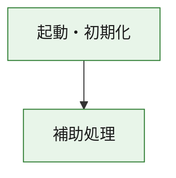
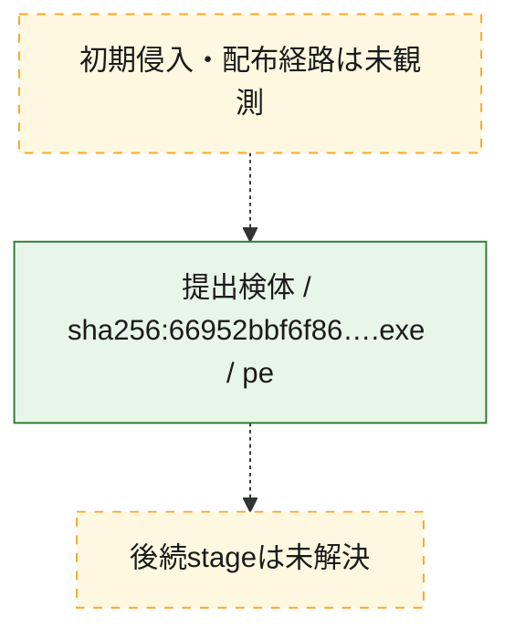
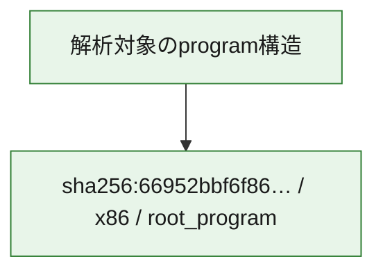

# 全体ロジック：66952bbf6f86d3bc3a4cb546c4812ab55b44e2b2bf38e9483393a15619050994

代表関数の静的証跡から、起動・初期化の処理群を確認しました。

## 読み方

- phaseの掲載順は解析上の整理順です。observed_call_edgesがない段階間の実行順を断定しません。
- 図の実線は静的に観測した関係、点線と黄色のノードは未観測・未解決の関係を示します。
- 図は静的な要約であり、動的実行を再現するものではありません。
- 詳細な関数解説とfingerprintは[STATIC-LOGIC.md](STATIC-LOGIC.md)を参照してください。

## 静的可視化

### 実行フロー

### 感染チェーン

### モジュール関係

## 処理段階

### 1. 起動・初期化

entry pointから初期化と後続処理への移行を確認します。
確度: `confirmed_static_function_evidence`

- `66952bbf6f86d3bc3a4cb546c4812ab55b44e2b2bf38e9483393a15619050994:ghidra:180001010` — 初期化と主要処理への分岐を行う入口関数です。 状態: `succeeded`、選定理由: `entry_point`, `meaningful_symbol_name`, `reviewed_call_centrality:22`, `role:entrypoint`, `small_program_complete_context`

### 2. 補助処理

主要処理を支える一般内部関数またはlibrary処理を確認します。
確度: `confirmed_static_function_evidence`

- `66952bbf6f86d3bc3a4cb546c4812ab55b44e2b2bf38e9483393a15619050994:ghidra:180001240` — 検体内部の一般処理を実装する関数です。 状態: `succeeded`、選定理由: `context_representative`, `reviewed_call_centrality:2`, `small_program_complete_context`
- `66952bbf6f86d3bc3a4cb546c4812ab55b44e2b2bf38e9483393a15619050994:ghidra:180001350` — 検体内部の一般処理を実装する関数です。 状態: `succeeded`、選定理由: `context_representative`, `reviewed_call_centrality:25`, `small_program_complete_context`
- `66952bbf6f86d3bc3a4cb546c4812ab55b44e2b2bf38e9483393a15619050994:ghidra:180003780` — 検体内部の一般処理を実装する関数です。 状態: `succeeded`、選定理由: `context_representative`, `reviewed_call_centrality:2`, `small_program_complete_context`
- `66952bbf6f86d3bc3a4cb546c4812ab55b44e2b2bf38e9483393a15619050994:ghidra:1800038e0` — 検体内部の一般処理を実装する関数です。 状態: `succeeded`、選定理由: `context_representative`, `reviewed_call_centrality:2`, `small_program_complete_context`

## 観測したcall関係

- `66952bbf6f86d3bc3a4cb546c4812ab55b44e2b2bf38e9483393a15619050994:ghidra:180001010` → `66952bbf6f86d3bc3a4cb546c4812ab55b44e2b2bf38e9483393a15619050994:ghidra:180001240` （`startup` → `support`）
- `66952bbf6f86d3bc3a4cb546c4812ab55b44e2b2bf38e9483393a15619050994:ghidra:180001010` → `66952bbf6f86d3bc3a4cb546c4812ab55b44e2b2bf38e9483393a15619050994:ghidra:180001350` （`startup` → `support`）
- `66952bbf6f86d3bc3a4cb546c4812ab55b44e2b2bf38e9483393a15619050994:ghidra:180001350` → `66952bbf6f86d3bc3a4cb546c4812ab55b44e2b2bf38e9483393a15619050994:ghidra:180001240` （`support` → `support`）
- `66952bbf6f86d3bc3a4cb546c4812ab55b44e2b2bf38e9483393a15619050994:ghidra:180001350` → `66952bbf6f86d3bc3a4cb546c4812ab55b44e2b2bf38e9483393a15619050994:ghidra:180003780` （`support` → `support`）
- `66952bbf6f86d3bc3a4cb546c4812ab55b44e2b2bf38e9483393a15619050994:ghidra:180001350` → `66952bbf6f86d3bc3a4cb546c4812ab55b44e2b2bf38e9483393a15619050994:ghidra:1800038e0` （`support` → `support`）
- `66952bbf6f86d3bc3a4cb546c4812ab55b44e2b2bf38e9483393a15619050994:ghidra:180003780` → `66952bbf6f86d3bc3a4cb546c4812ab55b44e2b2bf38e9483393a15619050994:ghidra:1800038e0` （`support` → `support`）
- `ghidra-function:1a5f5a228749e62b5a9a7f13` → `ghidra-function:273ab682b0936ffeec602546` （`unclassified` → `unclassified`）
- `ghidra-function:1a5f5a228749e62b5a9a7f13` → `ghidra-function:2d95d7968aa21db18483f946` （`unclassified` → `unclassified`）
- `ghidra-function:1a5f5a228749e62b5a9a7f13` → `ghidra-function:514d630941d2527d869c7e22` （`unclassified` → `unclassified`）
- `ghidra-function:1a5f5a228749e62b5a9a7f13` → `ghidra-function:5fb54d47b1663ee816b0abb2` （`unclassified` → `unclassified`）
- `ghidra-function:1a5f5a228749e62b5a9a7f13` → `ghidra-function:7220a595ba86f9d5cb372788` （`unclassified` → `unclassified`）
- `ghidra-function:1a5f5a228749e62b5a9a7f13` → `ghidra-function:7fa3de46fad1cd168bc1cfc9` （`unclassified` → `unclassified`）
- `ghidra-function:1a5f5a228749e62b5a9a7f13` → `ghidra-function:9c2f60f188ef073ddb541dc5` （`unclassified` → `unclassified`）
- `ghidra-function:1a5f5a228749e62b5a9a7f13` → `ghidra-function:9c9828c1c29ec6da8b6a3d28` （`unclassified` → `unclassified`）
- `ghidra-function:1a5f5a228749e62b5a9a7f13` → `ghidra-function:d1df27922fd766767619ed1c` （`unclassified` → `unclassified`）
- `ghidra-function:1a5f5a228749e62b5a9a7f13` → `ghidra-function:da744af3223dfea5e0120c14` （`unclassified` → `unclassified`）
- `ghidra-function:1a5f5a228749e62b5a9a7f13` → `ghidra-function:e4f7678b082bb62910417008` （`unclassified` → `unclassified`）
- `ghidra-function:1a5f5a228749e62b5a9a7f13` → `ghidra-function:fcc585f203a13737dd551d26` （`unclassified` → `unclassified`）
- `ghidra-function:5fb54d47b1663ee816b0abb2` → `ghidra-external:2822c98a3c5c005bbd0cf852` （`unclassified` → `unclassified`）
- `ghidra-function:5fb54d47b1663ee816b0abb2` → `ghidra-external:350213345503d68d5e822f3b` （`unclassified` → `unclassified`）
- `ghidra-function:5fb54d47b1663ee816b0abb2` → `ghidra-external:36037f2507c3100b9cb521bb` （`unclassified` → `unclassified`）
- `ghidra-function:5fb54d47b1663ee816b0abb2` → `ghidra-external:55c781c14670426d483b2cbb` （`unclassified` → `unclassified`）
- `ghidra-function:5fb54d47b1663ee816b0abb2` → `ghidra-external:577024c6612142a1b7172885` （`unclassified` → `unclassified`）
- `ghidra-function:5fb54d47b1663ee816b0abb2` → `ghidra-external:698110f1e5401ffbe51be150` （`unclassified` → `unclassified`）
- `ghidra-function:5fb54d47b1663ee816b0abb2` → `ghidra-external:7032c28ae65a4b191759373a` （`unclassified` → `unclassified`）
- `ghidra-function:5fb54d47b1663ee816b0abb2` → `ghidra-external:8d5a36ad1157f79d927d276f` （`unclassified` → `unclassified`）
- `ghidra-function:5fb54d47b1663ee816b0abb2` → `ghidra-external:9e60d8d281d88584334c78f5` （`unclassified` → `unclassified`）
- `ghidra-function:5fb54d47b1663ee816b0abb2` → `ghidra-external:b5e69a50ffcdee9c6309242b` （`unclassified` → `unclassified`）
- `ghidra-function:5fb54d47b1663ee816b0abb2` → `ghidra-external:cf46d3e610b77187ed0529e3` （`unclassified` → `unclassified`）
- `ghidra-function:5fb54d47b1663ee816b0abb2` → `ghidra-external:d1df6e515ab48d2744688a84` （`unclassified` → `unclassified`）
- `ghidra-function:5fb54d47b1663ee816b0abb2` → `ghidra-external:d6a8635dcf1ec0915a2a3741` （`unclassified` → `unclassified`）
- `ghidra-function:5fb54d47b1663ee816b0abb2` → `ghidra-external:db0594bd56619f1367d2c0cd` （`unclassified` → `unclassified`）
- `ghidra-function:5fb54d47b1663ee816b0abb2` → `ghidra-external:de417345ac2f0ce4fccda34c` （`unclassified` → `unclassified`）
- `ghidra-function:5fb54d47b1663ee816b0abb2` → `ghidra-external:e4c85f991e90cefcae9fd8f5` （`unclassified` → `unclassified`）
- `ghidra-function:5fb54d47b1663ee816b0abb2` → `ghidra-external:e4c8d424713165e61a8600a3` （`unclassified` → `unclassified`）
- `ghidra-function:5fb54d47b1663ee816b0abb2` → `ghidra-external:f12cf1adb3a5e241d3fcf1a2` （`unclassified` → `unclassified`）
- `ghidra-function:5fb54d47b1663ee816b0abb2` → `ghidra-external:f8618ae4a624ed7f9f4641aa` （`unclassified` → `unclassified`）
- `ghidra-function:5fb54d47b1663ee816b0abb2` → `ghidra-external:f93dcc930a44289ba3ba66c8` （`unclassified` → `unclassified`）
- `ghidra-function:5fb54d47b1663ee816b0abb2` → `ghidra-external:ff43fc1d4f1a504277e3f2d3` （`unclassified` → `unclassified`）
- `ghidra-function:5fb54d47b1663ee816b0abb2` → `ghidra-function:7b5b2932516b4d385858b7b6` （`unclassified` → `unclassified`）
- `ghidra-function:5fb54d47b1663ee816b0abb2` → `ghidra-function:ad655dddedebd55ef32264be` （`unclassified` → `unclassified`）
- `ghidra-function:5fb54d47b1663ee816b0abb2` → `ghidra-function:e4f7678b082bb62910417008` （`unclassified` → `unclassified`）
- `ghidra-function:7b5b2932516b4d385858b7b6` → `ghidra-function:ad655dddedebd55ef32264be` （`unclassified` → `unclassified`）

## 解析範囲と制約

- 選定外関数は全体inventoryへ残しますが、関数本体の個別解説対象にはしていません。
- indirect call、難読化、packer、VM、壊れたcontrol flowによりcall関係が欠落する場合があります。
- 文書は静的解析に基づき、検体実行や外部通信による動的確認は行っていません。
