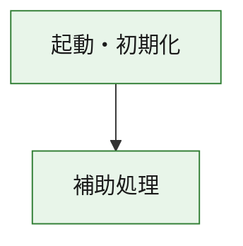
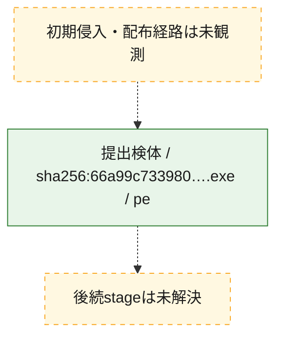
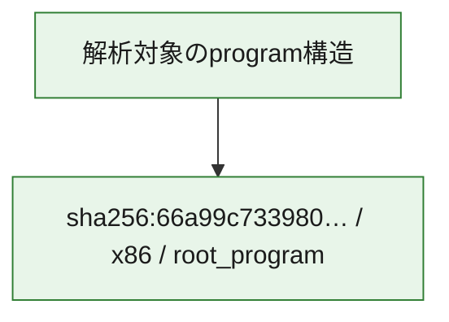

# 全体ロジック：66a99c73398040b11ce75f839ba2ff705aa12df7405006bf8328e00204beaf1b

代表関数の静的証跡から、起動・初期化の処理群を確認しました。

## 読み方

- phaseの掲載順は解析上の整理順です。observed_call_edgesがない段階間の実行順を断定しません。
- 図の実線は静的に観測した関係、点線と黄色のノードは未観測・未解決の関係を示します。
- 図は静的な要約であり、動的実行を再現するものではありません。
- 詳細な関数解説とfingerprintは[STATIC-LOGIC.md](STATIC-LOGIC.md)を参照してください。

## 静的可視化

### 実行フロー

### 感染チェーン

### モジュール関係

## 処理段階

### 1. 起動・初期化

entry pointから初期化と後続処理への移行を確認します。
確度: `confirmed_static_function_evidence`

- `66a99c73398040b11ce75f839ba2ff705aa12df7405006bf8328e00204beaf1b:ghidra:180001010` — 初期化と主要処理への分岐を行う入口関数です。 状態: `succeeded`、選定理由: `entry_point`, `meaningful_symbol_name`, `reviewed_call_centrality:22`, `role:entrypoint`, `small_program_complete_context`

### 2. 補助処理

主要処理を支える一般内部関数またはlibrary処理を確認します。
確度: `confirmed_static_function_evidence`

- `66a99c73398040b11ce75f839ba2ff705aa12df7405006bf8328e00204beaf1b:ghidra:180001240` — 検体内部の一般処理を実装する関数です。 状態: `succeeded`、選定理由: `context_representative`, `reviewed_call_centrality:2`, `small_program_complete_context`
- `66a99c73398040b11ce75f839ba2ff705aa12df7405006bf8328e00204beaf1b:ghidra:180001350` — 検体内部の一般処理を実装する関数です。 状態: `succeeded`、選定理由: `context_representative`, `reviewed_call_centrality:25`, `small_program_complete_context`
- `66a99c73398040b11ce75f839ba2ff705aa12df7405006bf8328e00204beaf1b:ghidra:180003780` — 検体内部の一般処理を実装する関数です。 状態: `succeeded`、選定理由: `context_representative`, `reviewed_call_centrality:2`, `small_program_complete_context`
- `66a99c73398040b11ce75f839ba2ff705aa12df7405006bf8328e00204beaf1b:ghidra:1800038e0` — 検体内部の一般処理を実装する関数です。 状態: `succeeded`、選定理由: `context_representative`, `reviewed_call_centrality:2`, `small_program_complete_context`

## 観測したcall関係

- `66a99c73398040b11ce75f839ba2ff705aa12df7405006bf8328e00204beaf1b:ghidra:180001010` → `66a99c73398040b11ce75f839ba2ff705aa12df7405006bf8328e00204beaf1b:ghidra:180001240` （`startup` → `support`）
- `66a99c73398040b11ce75f839ba2ff705aa12df7405006bf8328e00204beaf1b:ghidra:180001010` → `66a99c73398040b11ce75f839ba2ff705aa12df7405006bf8328e00204beaf1b:ghidra:180001350` （`startup` → `support`）
- `66a99c73398040b11ce75f839ba2ff705aa12df7405006bf8328e00204beaf1b:ghidra:180001350` → `66a99c73398040b11ce75f839ba2ff705aa12df7405006bf8328e00204beaf1b:ghidra:180001240` （`support` → `support`）
- `66a99c73398040b11ce75f839ba2ff705aa12df7405006bf8328e00204beaf1b:ghidra:180001350` → `66a99c73398040b11ce75f839ba2ff705aa12df7405006bf8328e00204beaf1b:ghidra:180003780` （`support` → `support`）
- `66a99c73398040b11ce75f839ba2ff705aa12df7405006bf8328e00204beaf1b:ghidra:180001350` → `66a99c73398040b11ce75f839ba2ff705aa12df7405006bf8328e00204beaf1b:ghidra:1800038e0` （`support` → `support`）
- `66a99c73398040b11ce75f839ba2ff705aa12df7405006bf8328e00204beaf1b:ghidra:180003780` → `66a99c73398040b11ce75f839ba2ff705aa12df7405006bf8328e00204beaf1b:ghidra:1800038e0` （`support` → `support`）
- `ghidra-function:4ddebcab2e7929031f26d456` → `ghidra-function:1e98e79d461c831d9a51f804` （`unclassified` → `unclassified`）
- `ghidra-function:645e0346afad8f098da848dd` → `ghidra-function:0b1cb2f9b40378f3fab7d76f` （`unclassified` → `unclassified`）
- `ghidra-function:645e0346afad8f098da848dd` → `ghidra-function:18f8fba7020f3ed6564201df` （`unclassified` → `unclassified`）
- `ghidra-function:645e0346afad8f098da848dd` → `ghidra-function:236e74385382cceaa2c5ec74` （`unclassified` → `unclassified`）
- `ghidra-function:645e0346afad8f098da848dd` → `ghidra-function:42ad25f91936af523bb61f16` （`unclassified` → `unclassified`）
- `ghidra-function:645e0346afad8f098da848dd` → `ghidra-function:5211ae00d0a74dc16cb95d24` （`unclassified` → `unclassified`）
- `ghidra-function:645e0346afad8f098da848dd` → `ghidra-function:723b6128a13c33f224f66c62` （`unclassified` → `unclassified`）
- `ghidra-function:645e0346afad8f098da848dd` → `ghidra-function:78063f1fd3643eea46595015` （`unclassified` → `unclassified`）
- `ghidra-function:645e0346afad8f098da848dd` → `ghidra-function:97229dc88d6df9bcbdba57b4` （`unclassified` → `unclassified`）
- `ghidra-function:645e0346afad8f098da848dd` → `ghidra-function:daa5952cc890c33bbf8008c6` （`unclassified` → `unclassified`）
- `ghidra-function:645e0346afad8f098da848dd` → `ghidra-function:dec2baca0ace6776da36acc8` （`unclassified` → `unclassified`）
- `ghidra-function:645e0346afad8f098da848dd` → `ghidra-function:eb91d8d3d7b9fd5ba15f57e3` （`unclassified` → `unclassified`）
- `ghidra-function:645e0346afad8f098da848dd` → `ghidra-function:eda932406a111ab96a0b6a88` （`unclassified` → `unclassified`）
- `ghidra-function:eda932406a111ab96a0b6a88` → `ghidra-external:0399c968e7da55433553be62` （`unclassified` → `unclassified`）
- `ghidra-function:eda932406a111ab96a0b6a88` → `ghidra-external:03bd2bc9d33912be04833887` （`unclassified` → `unclassified`）
- `ghidra-function:eda932406a111ab96a0b6a88` → `ghidra-external:0e0d278fd3e1b148f2d9c206` （`unclassified` → `unclassified`）
- `ghidra-function:eda932406a111ab96a0b6a88` → `ghidra-external:16aa06263e8e4f9289d8874f` （`unclassified` → `unclassified`）
- `ghidra-function:eda932406a111ab96a0b6a88` → `ghidra-external:1a166a896068dad171ef66ff` （`unclassified` → `unclassified`）
- `ghidra-function:eda932406a111ab96a0b6a88` → `ghidra-external:1b72db8f3c56dc3163bb886f` （`unclassified` → `unclassified`）
- `ghidra-function:eda932406a111ab96a0b6a88` → `ghidra-external:2b5e5d2150a37f423b3a12e0` （`unclassified` → `unclassified`）
- `ghidra-function:eda932406a111ab96a0b6a88` → `ghidra-external:2ef8226907f161ec67dd1794` （`unclassified` → `unclassified`）
- `ghidra-function:eda932406a111ab96a0b6a88` → `ghidra-external:30d8d46b16346f8bb90985e7` （`unclassified` → `unclassified`）
- `ghidra-function:eda932406a111ab96a0b6a88` → `ghidra-external:327debf1aad6bc8b567224a5` （`unclassified` → `unclassified`）
- `ghidra-function:eda932406a111ab96a0b6a88` → `ghidra-external:3a4a77863264c6a236f3b1f9` （`unclassified` → `unclassified`）
- `ghidra-function:eda932406a111ab96a0b6a88` → `ghidra-external:3b59d75d887a9187286307cf` （`unclassified` → `unclassified`）
- `ghidra-function:eda932406a111ab96a0b6a88` → `ghidra-external:4830d118dc5f67a2ab798ed5` （`unclassified` → `unclassified`）
- `ghidra-function:eda932406a111ab96a0b6a88` → `ghidra-external:54d3993e85339c0c49af9c9a` （`unclassified` → `unclassified`）
- `ghidra-function:eda932406a111ab96a0b6a88` → `ghidra-external:7f47dcbe8be826596a7fc20a` （`unclassified` → `unclassified`）
- `ghidra-function:eda932406a111ab96a0b6a88` → `ghidra-external:907f1651803ec58a8c7f1a5e` （`unclassified` → `unclassified`）
- `ghidra-function:eda932406a111ab96a0b6a88` → `ghidra-external:ab59ba509efb42051e2b1bcd` （`unclassified` → `unclassified`）
- `ghidra-function:eda932406a111ab96a0b6a88` → `ghidra-external:d9ef81b66cdeb11cef29b3ab` （`unclassified` → `unclassified`）
- `ghidra-function:eda932406a111ab96a0b6a88` → `ghidra-external:e519a79c01b374177eca4404` （`unclassified` → `unclassified`）
- `ghidra-function:eda932406a111ab96a0b6a88` → `ghidra-external:ec8a2c73a92cd1cdaa42246d` （`unclassified` → `unclassified`）
- `ghidra-function:eda932406a111ab96a0b6a88` → `ghidra-external:f8e11f0fcf1aa6a02ccefd86` （`unclassified` → `unclassified`）
- `ghidra-function:eda932406a111ab96a0b6a88` → `ghidra-function:1e98e79d461c831d9a51f804` （`unclassified` → `unclassified`）
- `ghidra-function:eda932406a111ab96a0b6a88` → `ghidra-function:4ddebcab2e7929031f26d456` （`unclassified` → `unclassified`）
- `ghidra-function:eda932406a111ab96a0b6a88` → `ghidra-function:5211ae00d0a74dc16cb95d24` （`unclassified` → `unclassified`）

## 解析範囲と制約

- 選定外関数は全体inventoryへ残しますが、関数本体の個別解説対象にはしていません。
- indirect call、難読化、packer、VM、壊れたcontrol flowによりcall関係が欠落する場合があります。
- 文書は静的解析に基づき、検体実行や外部通信による動的確認は行っていません。
