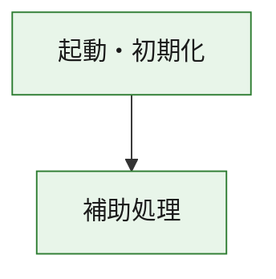
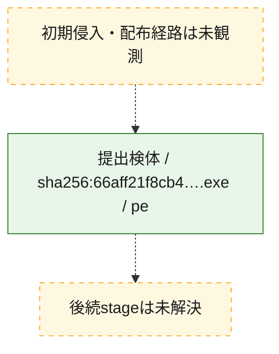
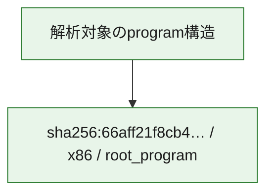

# 全体ロジック：66aff21f8cb4e323beb6b66242ab504c5fe74746c451b9ba1a8f1059d8d07b9b

代表関数の静的証跡から、起動・初期化の処理群を確認しました。

## 読み方

- phaseの掲載順は解析上の整理順です。observed_call_edgesがない段階間の実行順を断定しません。
- 図の実線は静的に観測した関係、点線と黄色のノードは未観測・未解決の関係を示します。
- 図は静的な要約であり、動的実行を再現するものではありません。
- 詳細な関数解説とfingerprintは[STATIC-LOGIC.md](STATIC-LOGIC.md)を参照してください。

## 静的可視化

### 実行フロー

### 感染チェーン

### モジュール関係

## 処理段階

### 1. 起動・初期化

entry pointから初期化と後続処理への移行を確認します。
確度: `confirmed_static_function_evidence`

- `66aff21f8cb4e323beb6b66242ab504c5fe74746c451b9ba1a8f1059d8d07b9b:ghidra:180001010` — 初期化と主要処理への分岐を行う入口関数です。 状態: `succeeded`、選定理由: `entry_point`, `meaningful_symbol_name`, `reviewed_call_centrality:22`, `role:entrypoint`, `small_program_complete_context`

### 2. 補助処理

主要処理を支える一般内部関数またはlibrary処理を確認します。
確度: `confirmed_static_function_evidence`

- `66aff21f8cb4e323beb6b66242ab504c5fe74746c451b9ba1a8f1059d8d07b9b:ghidra:180001240` — 検体内部の一般処理を実装する関数です。 状態: `succeeded`、選定理由: `context_representative`, `reviewed_call_centrality:2`, `small_program_complete_context`
- `66aff21f8cb4e323beb6b66242ab504c5fe74746c451b9ba1a8f1059d8d07b9b:ghidra:180001350` — 検体内部の一般処理を実装する関数です。 状態: `succeeded`、選定理由: `context_representative`, `reviewed_call_centrality:25`, `small_program_complete_context`
- `66aff21f8cb4e323beb6b66242ab504c5fe74746c451b9ba1a8f1059d8d07b9b:ghidra:180003780` — 検体内部の一般処理を実装する関数です。 状態: `succeeded`、選定理由: `context_representative`, `reviewed_call_centrality:2`, `small_program_complete_context`
- `66aff21f8cb4e323beb6b66242ab504c5fe74746c451b9ba1a8f1059d8d07b9b:ghidra:1800038e0` — 検体内部の一般処理を実装する関数です。 状態: `succeeded`、選定理由: `context_representative`, `reviewed_call_centrality:2`, `small_program_complete_context`

## 観測したcall関係

- `66aff21f8cb4e323beb6b66242ab504c5fe74746c451b9ba1a8f1059d8d07b9b:ghidra:180001010` → `66aff21f8cb4e323beb6b66242ab504c5fe74746c451b9ba1a8f1059d8d07b9b:ghidra:180001240` （`startup` → `support`）
- `66aff21f8cb4e323beb6b66242ab504c5fe74746c451b9ba1a8f1059d8d07b9b:ghidra:180001010` → `66aff21f8cb4e323beb6b66242ab504c5fe74746c451b9ba1a8f1059d8d07b9b:ghidra:180001350` （`startup` → `support`）
- `66aff21f8cb4e323beb6b66242ab504c5fe74746c451b9ba1a8f1059d8d07b9b:ghidra:180001350` → `66aff21f8cb4e323beb6b66242ab504c5fe74746c451b9ba1a8f1059d8d07b9b:ghidra:180001240` （`support` → `support`）
- `66aff21f8cb4e323beb6b66242ab504c5fe74746c451b9ba1a8f1059d8d07b9b:ghidra:180001350` → `66aff21f8cb4e323beb6b66242ab504c5fe74746c451b9ba1a8f1059d8d07b9b:ghidra:180003780` （`support` → `support`）
- `66aff21f8cb4e323beb6b66242ab504c5fe74746c451b9ba1a8f1059d8d07b9b:ghidra:180001350` → `66aff21f8cb4e323beb6b66242ab504c5fe74746c451b9ba1a8f1059d8d07b9b:ghidra:1800038e0` （`support` → `support`）
- `66aff21f8cb4e323beb6b66242ab504c5fe74746c451b9ba1a8f1059d8d07b9b:ghidra:180003780` → `66aff21f8cb4e323beb6b66242ab504c5fe74746c451b9ba1a8f1059d8d07b9b:ghidra:1800038e0` （`support` → `support`）
- `ghidra-function:41223f511eb67df238734c0a` → `ghidra-function:073b3a49a030e0259f20aa93` （`unclassified` → `unclassified`）
- `ghidra-function:41223f511eb67df238734c0a` → `ghidra-function:32040e1a7762e24c9341cbb0` （`unclassified` → `unclassified`）
- `ghidra-function:41223f511eb67df238734c0a` → `ghidra-function:4fcafc4de35bdbac8f37266d` （`unclassified` → `unclassified`）
- `ghidra-function:41223f511eb67df238734c0a` → `ghidra-function:62a10af362779b8039976de7` （`unclassified` → `unclassified`）
- `ghidra-function:41223f511eb67df238734c0a` → `ghidra-function:731075a9e3acbf21ee90d8ae` （`unclassified` → `unclassified`）
- `ghidra-function:41223f511eb67df238734c0a` → `ghidra-function:7b002b52a612666b5ec9fbfb` （`unclassified` → `unclassified`）
- `ghidra-function:41223f511eb67df238734c0a` → `ghidra-function:7e16d02163474db30892557a` （`unclassified` → `unclassified`）
- `ghidra-function:41223f511eb67df238734c0a` → `ghidra-function:832e4582421bc5859fa33b86` （`unclassified` → `unclassified`）
- `ghidra-function:41223f511eb67df238734c0a` → `ghidra-function:9acd991c6bcb4bf69b84fd57` （`unclassified` → `unclassified`）
- `ghidra-function:41223f511eb67df238734c0a` → `ghidra-function:af52658a0103d1a6949cca42` （`unclassified` → `unclassified`）
- `ghidra-function:41223f511eb67df238734c0a` → `ghidra-function:de350c2623f4887c0279294f` （`unclassified` → `unclassified`）
- `ghidra-function:41223f511eb67df238734c0a` → `ghidra-function:e8d9b72f84b7798efeccf553` （`unclassified` → `unclassified`）
- `ghidra-function:832e4582421bc5859fa33b86` → `ghidra-external:0485ea604c80cfc1fdf16a84` （`unclassified` → `unclassified`）
- `ghidra-function:832e4582421bc5859fa33b86` → `ghidra-external:1329bc6365eb7ae6a203c36d` （`unclassified` → `unclassified`）
- `ghidra-function:832e4582421bc5859fa33b86` → `ghidra-external:1ada6b5aa4c429f83b58d6b4` （`unclassified` → `unclassified`）
- `ghidra-function:832e4582421bc5859fa33b86` → `ghidra-external:2390b55590a1cdc9b52a0099` （`unclassified` → `unclassified`）
- `ghidra-function:832e4582421bc5859fa33b86` → `ghidra-external:2f14b940c4a831d0297adab6` （`unclassified` → `unclassified`）
- `ghidra-function:832e4582421bc5859fa33b86` → `ghidra-external:62b2bf2d87c83b6280c115f5` （`unclassified` → `unclassified`）
- `ghidra-function:832e4582421bc5859fa33b86` → `ghidra-external:6f1170b6dfd5e061ea0c9a16` （`unclassified` → `unclassified`）
- `ghidra-function:832e4582421bc5859fa33b86` → `ghidra-external:7054885eda366ac733eac85e` （`unclassified` → `unclassified`）
- `ghidra-function:832e4582421bc5859fa33b86` → `ghidra-external:9b46809fedb750aa9c41af70` （`unclassified` → `unclassified`）
- `ghidra-function:832e4582421bc5859fa33b86` → `ghidra-external:a26b1952eb5649b08becc94d` （`unclassified` → `unclassified`）
- `ghidra-function:832e4582421bc5859fa33b86` → `ghidra-external:b12b34b3d0b4b10036851f2a` （`unclassified` → `unclassified`）
- `ghidra-function:832e4582421bc5859fa33b86` → `ghidra-external:b561ec1dbcf3e5884b837e11` （`unclassified` → `unclassified`）
- `ghidra-function:832e4582421bc5859fa33b86` → `ghidra-external:be449c04032153512dd1ec7a` （`unclassified` → `unclassified`）
- `ghidra-function:832e4582421bc5859fa33b86` → `ghidra-external:c23c449b5038fead876362f0` （`unclassified` → `unclassified`）
- `ghidra-function:832e4582421bc5859fa33b86` → `ghidra-external:cf5480cbfeb830a7ba4e9034` （`unclassified` → `unclassified`）
- `ghidra-function:832e4582421bc5859fa33b86` → `ghidra-external:d2d773a7698777b7205b7599` （`unclassified` → `unclassified`）
- `ghidra-function:832e4582421bc5859fa33b86` → `ghidra-external:da01e0de21c581f4af081ceb` （`unclassified` → `unclassified`）
- `ghidra-function:832e4582421bc5859fa33b86` → `ghidra-external:dc3ffd6dc15aedcd17089742` （`unclassified` → `unclassified`）
- `ghidra-function:832e4582421bc5859fa33b86` → `ghidra-external:dd3cb6cd69ca6978c5103fcf` （`unclassified` → `unclassified`）
- `ghidra-function:832e4582421bc5859fa33b86` → `ghidra-external:ec2766ba7072d1daebde8a4e` （`unclassified` → `unclassified`）
- `ghidra-function:832e4582421bc5859fa33b86` → `ghidra-external:f6a69f297c5dcea6a22c3c28` （`unclassified` → `unclassified`）
- `ghidra-function:832e4582421bc5859fa33b86` → `ghidra-function:743994b2dbb7061c1568ae47` （`unclassified` → `unclassified`）
- `ghidra-function:832e4582421bc5859fa33b86` → `ghidra-function:853d87166173311dc4cc27db` （`unclassified` → `unclassified`）
- `ghidra-function:832e4582421bc5859fa33b86` → `ghidra-function:e8d9b72f84b7798efeccf553` （`unclassified` → `unclassified`）
- `ghidra-function:853d87166173311dc4cc27db` → `ghidra-function:743994b2dbb7061c1568ae47` （`unclassified` → `unclassified`）

## 解析範囲と制約

- 選定外関数は全体inventoryへ残しますが、関数本体の個別解説対象にはしていません。
- indirect call、難読化、packer、VM、壊れたcontrol flowによりcall関係が欠落する場合があります。
- 文書は静的解析に基づき、検体実行や外部通信による動的確認は行っていません。
