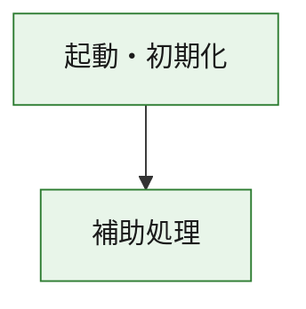
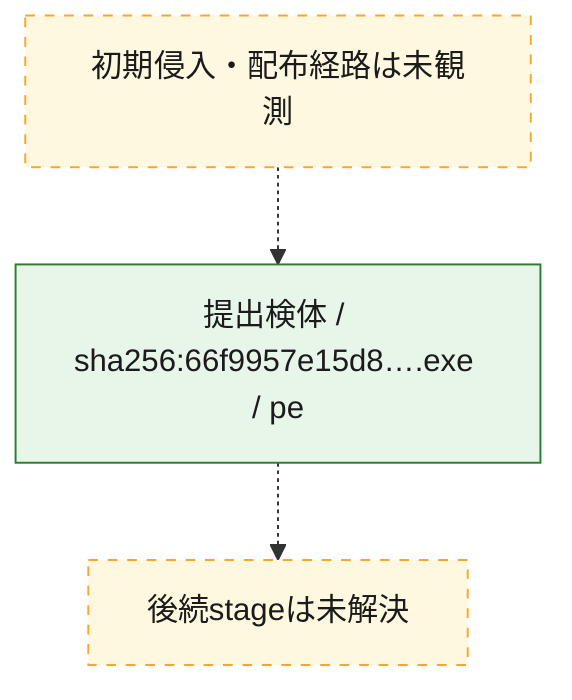
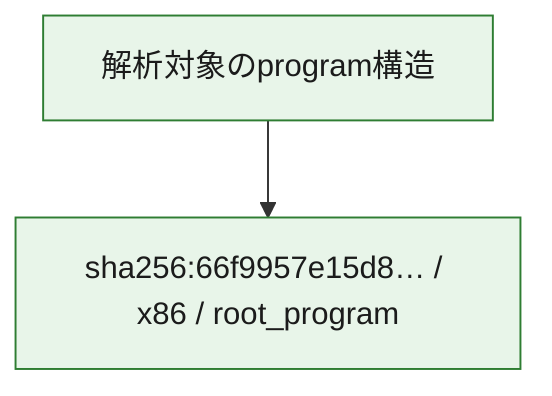

# 全体ロジック：66f9957e15d8e718ac91df42b798d3d726f87fa4cfc3b8cdfaac57ad593f7c99

代表関数の静的証跡から、起動・初期化の処理群を確認しました。

## 読み方

- phaseの掲載順は解析上の整理順です。observed_call_edgesがない段階間の実行順を断定しません。
- 図の実線は静的に観測した関係、点線と黄色のノードは未観測・未解決の関係を示します。
- 図は静的な要約であり、動的実行を再現するものではありません。
- 詳細な関数解説とfingerprintは[STATIC-LOGIC.md](STATIC-LOGIC.md)を参照してください。

## 静的可視化

### 実行フロー

### 感染チェーン

### モジュール関係

## 処理段階

### 1. 起動・初期化

entry pointから初期化と後続処理への移行を確認します。
確度: `confirmed_static_function_evidence`

- `66f9957e15d8e718ac91df42b798d3d726f87fa4cfc3b8cdfaac57ad593f7c99:ghidra:180001010` — 初期化と主要処理への分岐を行う入口関数です。 状態: `succeeded`、選定理由: `entry_point`, `meaningful_symbol_name`, `reviewed_call_centrality:22`, `role:entrypoint`, `small_program_complete_context`

### 2. 補助処理

主要処理を支える一般内部関数またはlibrary処理を確認します。
確度: `confirmed_static_function_evidence`

- `66f9957e15d8e718ac91df42b798d3d726f87fa4cfc3b8cdfaac57ad593f7c99:ghidra:180001240` — 検体内部の一般処理を実装する関数です。 状態: `succeeded`、選定理由: `context_representative`, `reviewed_call_centrality:2`, `small_program_complete_context`
- `66f9957e15d8e718ac91df42b798d3d726f87fa4cfc3b8cdfaac57ad593f7c99:ghidra:180001350` — 検体内部の一般処理を実装する関数です。 状態: `succeeded`、選定理由: `context_representative`, `reviewed_call_centrality:25`, `small_program_complete_context`
- `66f9957e15d8e718ac91df42b798d3d726f87fa4cfc3b8cdfaac57ad593f7c99:ghidra:180003780` — 検体内部の一般処理を実装する関数です。 状態: `succeeded`、選定理由: `context_representative`, `reviewed_call_centrality:2`, `small_program_complete_context`
- `66f9957e15d8e718ac91df42b798d3d726f87fa4cfc3b8cdfaac57ad593f7c99:ghidra:1800038e0` — 検体内部の一般処理を実装する関数です。 状態: `succeeded`、選定理由: `context_representative`, `reviewed_call_centrality:2`, `small_program_complete_context`

## 観測したcall関係

- `66f9957e15d8e718ac91df42b798d3d726f87fa4cfc3b8cdfaac57ad593f7c99:ghidra:180001010` → `66f9957e15d8e718ac91df42b798d3d726f87fa4cfc3b8cdfaac57ad593f7c99:ghidra:180001240` （`startup` → `support`）
- `66f9957e15d8e718ac91df42b798d3d726f87fa4cfc3b8cdfaac57ad593f7c99:ghidra:180001010` → `66f9957e15d8e718ac91df42b798d3d726f87fa4cfc3b8cdfaac57ad593f7c99:ghidra:180001350` （`startup` → `support`）
- `66f9957e15d8e718ac91df42b798d3d726f87fa4cfc3b8cdfaac57ad593f7c99:ghidra:180001350` → `66f9957e15d8e718ac91df42b798d3d726f87fa4cfc3b8cdfaac57ad593f7c99:ghidra:180001240` （`support` → `support`）
- `66f9957e15d8e718ac91df42b798d3d726f87fa4cfc3b8cdfaac57ad593f7c99:ghidra:180001350` → `66f9957e15d8e718ac91df42b798d3d726f87fa4cfc3b8cdfaac57ad593f7c99:ghidra:180003780` （`support` → `support`）
- `66f9957e15d8e718ac91df42b798d3d726f87fa4cfc3b8cdfaac57ad593f7c99:ghidra:180001350` → `66f9957e15d8e718ac91df42b798d3d726f87fa4cfc3b8cdfaac57ad593f7c99:ghidra:1800038e0` （`support` → `support`）
- `66f9957e15d8e718ac91df42b798d3d726f87fa4cfc3b8cdfaac57ad593f7c99:ghidra:180003780` → `66f9957e15d8e718ac91df42b798d3d726f87fa4cfc3b8cdfaac57ad593f7c99:ghidra:1800038e0` （`support` → `support`）
- `ghidra-function:4eb25226660b0e604e45de80` → `ghidra-external:1580019cc4a296d72414ab49` （`unclassified` → `unclassified`）
- `ghidra-function:4eb25226660b0e604e45de80` → `ghidra-external:1a070ac5dbdc74a7f2e3e54a` （`unclassified` → `unclassified`）
- `ghidra-function:4eb25226660b0e604e45de80` → `ghidra-external:1a20d879e04acf7bab8c5034` （`unclassified` → `unclassified`）
- `ghidra-function:4eb25226660b0e604e45de80` → `ghidra-external:1b03b5de1305792c8876e624` （`unclassified` → `unclassified`）
- `ghidra-function:4eb25226660b0e604e45de80` → `ghidra-external:1bd367d8db4f378fe9fb288c` （`unclassified` → `unclassified`）
- `ghidra-function:4eb25226660b0e604e45de80` → `ghidra-external:2f23bb8a4d8d73bf5e90d11f` （`unclassified` → `unclassified`）
- `ghidra-function:4eb25226660b0e604e45de80` → `ghidra-external:32447584121463259c207f49` （`unclassified` → `unclassified`）
- `ghidra-function:4eb25226660b0e604e45de80` → `ghidra-external:42c39945bf6e0dc13ae4c0ee` （`unclassified` → `unclassified`）
- `ghidra-function:4eb25226660b0e604e45de80` → `ghidra-external:45e9ba9a4462bd2a0f324d15` （`unclassified` → `unclassified`）
- `ghidra-function:4eb25226660b0e604e45de80` → `ghidra-external:4a7df2cef41dad321bca292d` （`unclassified` → `unclassified`）
- `ghidra-function:4eb25226660b0e604e45de80` → `ghidra-external:577bddb1dd40e95ae2f1d704` （`unclassified` → `unclassified`）
- `ghidra-function:4eb25226660b0e604e45de80` → `ghidra-external:7d4d7a6c7b25e3fb967932fc` （`unclassified` → `unclassified`）
- `ghidra-function:4eb25226660b0e604e45de80` → `ghidra-external:8f16622d77880c56cdde0721` （`unclassified` → `unclassified`）
- `ghidra-function:4eb25226660b0e604e45de80` → `ghidra-external:91ab3a2f73098d536161a6ef` （`unclassified` → `unclassified`）
- `ghidra-function:4eb25226660b0e604e45de80` → `ghidra-external:9452253e717cd4fb499a8517` （`unclassified` → `unclassified`）
- `ghidra-function:4eb25226660b0e604e45de80` → `ghidra-external:b4d14063a43ad6f2a8c08505` （`unclassified` → `unclassified`）
- `ghidra-function:4eb25226660b0e604e45de80` → `ghidra-external:c7243447c6370f3042546769` （`unclassified` → `unclassified`）
- `ghidra-function:4eb25226660b0e604e45de80` → `ghidra-external:c8ac80230ab59dbbca11e187` （`unclassified` → `unclassified`）
- `ghidra-function:4eb25226660b0e604e45de80` → `ghidra-external:cf305d0325072c4bc8ff2eb3` （`unclassified` → `unclassified`）
- `ghidra-function:4eb25226660b0e604e45de80` → `ghidra-external:f8c289a69dbe4dbfc8e8ac54` （`unclassified` → `unclassified`）
- `ghidra-function:4eb25226660b0e604e45de80` → `ghidra-external:ffea280a47339a21211337cd` （`unclassified` → `unclassified`）
- `ghidra-function:4eb25226660b0e604e45de80` → `ghidra-function:058223085277ceb727b2bce2` （`unclassified` → `unclassified`）
- `ghidra-function:4eb25226660b0e604e45de80` → `ghidra-function:9a28de3ec51e918e9fd7a6de` （`unclassified` → `unclassified`）
- `ghidra-function:4eb25226660b0e604e45de80` → `ghidra-function:a15bff55911c102ff1e986ae` （`unclassified` → `unclassified`）
- `ghidra-function:a15bff55911c102ff1e986ae` → `ghidra-function:9a28de3ec51e918e9fd7a6de` （`unclassified` → `unclassified`）
- `ghidra-function:e60963614bea7093ed8e02db` → `ghidra-function:034ca4560fe8984e4aceddb1` （`unclassified` → `unclassified`）
- `ghidra-function:e60963614bea7093ed8e02db` → `ghidra-function:058223085277ceb727b2bce2` （`unclassified` → `unclassified`）
- `ghidra-function:e60963614bea7093ed8e02db` → `ghidra-function:16fcb8f29a9506183d81beda` （`unclassified` → `unclassified`）
- `ghidra-function:e60963614bea7093ed8e02db` → `ghidra-function:1fb67c36fcbfa3b64595013c` （`unclassified` → `unclassified`）
- `ghidra-function:e60963614bea7093ed8e02db` → `ghidra-function:2123fbba3a030e1824bfd35e` （`unclassified` → `unclassified`）
- `ghidra-function:e60963614bea7093ed8e02db` → `ghidra-function:3b9af1118761709de8d11dde` （`unclassified` → `unclassified`）
- `ghidra-function:e60963614bea7093ed8e02db` → `ghidra-function:4eb25226660b0e604e45de80` （`unclassified` → `unclassified`）
- `ghidra-function:e60963614bea7093ed8e02db` → `ghidra-function:6b41b6d6d88bae3230fd0c17` （`unclassified` → `unclassified`）
- `ghidra-function:e60963614bea7093ed8e02db` → `ghidra-function:7ffc1e7a134bf2c5d8c542b7` （`unclassified` → `unclassified`）
- `ghidra-function:e60963614bea7093ed8e02db` → `ghidra-function:9cb655f3761456b2e177fdc3` （`unclassified` → `unclassified`）
- `ghidra-function:e60963614bea7093ed8e02db` → `ghidra-function:ed07d11723617698d03f72b5` （`unclassified` → `unclassified`）
- `ghidra-function:e60963614bea7093ed8e02db` → `ghidra-function:f29987b8acbac1890bb6e258` （`unclassified` → `unclassified`）

## 解析範囲と制約

- 選定外関数は全体inventoryへ残しますが、関数本体の個別解説対象にはしていません。
- indirect call、難読化、packer、VM、壊れたcontrol flowによりcall関係が欠落する場合があります。
- 文書は静的解析に基づき、検体実行や外部通信による動的確認は行っていません。
