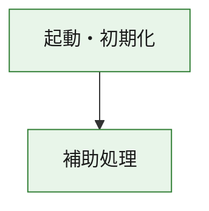
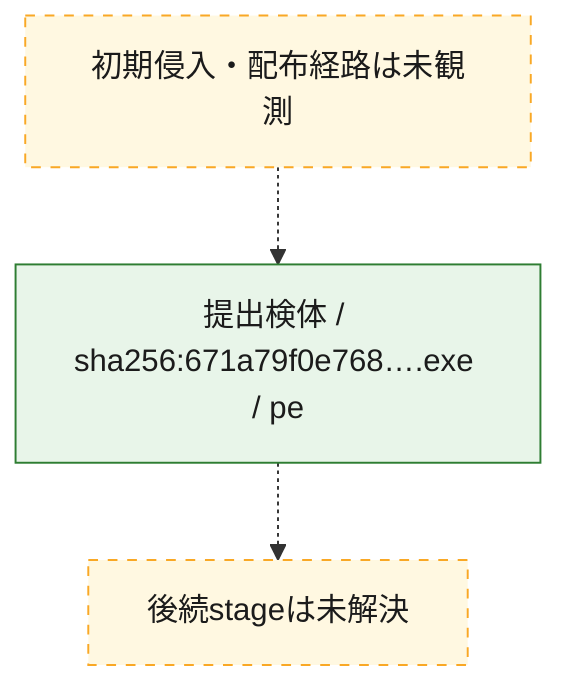
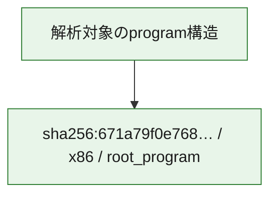

# 全体ロジック：671a79f0e768023e30400db7d3c87458898733ac5e9b082ae90ad2107caf5026

代表関数の静的証跡から、起動・初期化の処理群を確認しました。

## 読み方

- phaseの掲載順は解析上の整理順です。observed_call_edgesがない段階間の実行順を断定しません。
- 図の実線は静的に観測した関係、点線と黄色のノードは未観測・未解決の関係を示します。
- 図は静的な要約であり、動的実行を再現するものではありません。
- 詳細な関数解説とfingerprintは[STATIC-LOGIC.md](STATIC-LOGIC.md)を参照してください。

## 静的可視化

### 実行フロー

### 感染チェーン

### モジュール関係

## 処理段階

### 1. 起動・初期化

entry pointから初期化と後続処理への移行を確認します。
確度: `confirmed_static_function_evidence`

- `671a79f0e768023e30400db7d3c87458898733ac5e9b082ae90ad2107caf5026:ghidra:180001010` — 初期化と主要処理への分岐を行う入口関数です。 状態: `succeeded`、選定理由: `entry_point`, `meaningful_symbol_name`, `reviewed_call_centrality:22`, `role:entrypoint`, `small_program_complete_context`

### 2. 補助処理

主要処理を支える一般内部関数またはlibrary処理を確認します。
確度: `confirmed_static_function_evidence`

- `671a79f0e768023e30400db7d3c87458898733ac5e9b082ae90ad2107caf5026:ghidra:180001240` — 検体内部の一般処理を実装する関数です。 状態: `succeeded`、選定理由: `context_representative`, `reviewed_call_centrality:2`, `small_program_complete_context`
- `671a79f0e768023e30400db7d3c87458898733ac5e9b082ae90ad2107caf5026:ghidra:180001350` — 検体内部の一般処理を実装する関数です。 状態: `succeeded`、選定理由: `context_representative`, `reviewed_call_centrality:25`, `small_program_complete_context`
- `671a79f0e768023e30400db7d3c87458898733ac5e9b082ae90ad2107caf5026:ghidra:180003780` — 検体内部の一般処理を実装する関数です。 状態: `succeeded`、選定理由: `context_representative`, `reviewed_call_centrality:2`, `small_program_complete_context`
- `671a79f0e768023e30400db7d3c87458898733ac5e9b082ae90ad2107caf5026:ghidra:1800038e0` — 検体内部の一般処理を実装する関数です。 状態: `succeeded`、選定理由: `context_representative`, `reviewed_call_centrality:2`, `small_program_complete_context`

## 観測したcall関係

- `671a79f0e768023e30400db7d3c87458898733ac5e9b082ae90ad2107caf5026:ghidra:180001010` → `671a79f0e768023e30400db7d3c87458898733ac5e9b082ae90ad2107caf5026:ghidra:180001240` （`startup` → `support`）
- `671a79f0e768023e30400db7d3c87458898733ac5e9b082ae90ad2107caf5026:ghidra:180001010` → `671a79f0e768023e30400db7d3c87458898733ac5e9b082ae90ad2107caf5026:ghidra:180001350` （`startup` → `support`）
- `671a79f0e768023e30400db7d3c87458898733ac5e9b082ae90ad2107caf5026:ghidra:180001350` → `671a79f0e768023e30400db7d3c87458898733ac5e9b082ae90ad2107caf5026:ghidra:180001240` （`support` → `support`）
- `671a79f0e768023e30400db7d3c87458898733ac5e9b082ae90ad2107caf5026:ghidra:180001350` → `671a79f0e768023e30400db7d3c87458898733ac5e9b082ae90ad2107caf5026:ghidra:180003780` （`support` → `support`）
- `671a79f0e768023e30400db7d3c87458898733ac5e9b082ae90ad2107caf5026:ghidra:180001350` → `671a79f0e768023e30400db7d3c87458898733ac5e9b082ae90ad2107caf5026:ghidra:1800038e0` （`support` → `support`）
- `671a79f0e768023e30400db7d3c87458898733ac5e9b082ae90ad2107caf5026:ghidra:180003780` → `671a79f0e768023e30400db7d3c87458898733ac5e9b082ae90ad2107caf5026:ghidra:1800038e0` （`support` → `support`）
- `ghidra-function:5ad576854ee756c474c0972c` → `ghidra-function:0a1dc5e000246554e97036fb` （`unclassified` → `unclassified`）
- `ghidra-function:5ad576854ee756c474c0972c` → `ghidra-function:14c8f71cb23652a19e7fba42` （`unclassified` → `unclassified`）
- `ghidra-function:5ad576854ee756c474c0972c` → `ghidra-function:1c11799a409177b0192c6dd2` （`unclassified` → `unclassified`）
- `ghidra-function:5ad576854ee756c474c0972c` → `ghidra-function:54db4382af2154897a5448d3` （`unclassified` → `unclassified`）
- `ghidra-function:5ad576854ee756c474c0972c` → `ghidra-function:5d47dd4e70a90f7c48c738bc` （`unclassified` → `unclassified`）
- `ghidra-function:5ad576854ee756c474c0972c` → `ghidra-function:979d7e033f8e75e5dc250288` （`unclassified` → `unclassified`）
- `ghidra-function:5ad576854ee756c474c0972c` → `ghidra-function:a9ba064a3204552e5aeab72e` （`unclassified` → `unclassified`）
- `ghidra-function:5ad576854ee756c474c0972c` → `ghidra-function:b89ec33cdd61907e2d009f16` （`unclassified` → `unclassified`）
- `ghidra-function:5ad576854ee756c474c0972c` → `ghidra-function:ba5ba087501984f4acfa0bf6` （`unclassified` → `unclassified`）
- `ghidra-function:5ad576854ee756c474c0972c` → `ghidra-function:c84f87d37d369fbeeccf37fd` （`unclassified` → `unclassified`）
- `ghidra-function:5ad576854ee756c474c0972c` → `ghidra-function:e885f1cc6d0c0c6554a2e89d` （`unclassified` → `unclassified`）
- `ghidra-function:5ad576854ee756c474c0972c` → `ghidra-function:ea1d550ad689e3a9e7e44726` （`unclassified` → `unclassified`）
- `ghidra-function:78311e5f024ed7e28a398639` → `ghidra-function:619f525bea24e08c9f7f6c20` （`unclassified` → `unclassified`）
- `ghidra-function:a9ba064a3204552e5aeab72e` → `ghidra-external:04da8f5f34b748f3b2093453` （`unclassified` → `unclassified`）
- `ghidra-function:a9ba064a3204552e5aeab72e` → `ghidra-external:0b0a554e9d0b34a497851dfc` （`unclassified` → `unclassified`）
- `ghidra-function:a9ba064a3204552e5aeab72e` → `ghidra-external:25a2bbd763bd9594d71e851f` （`unclassified` → `unclassified`）
- `ghidra-function:a9ba064a3204552e5aeab72e` → `ghidra-external:2d4f73c0b99dd913360b9280` （`unclassified` → `unclassified`）
- `ghidra-function:a9ba064a3204552e5aeab72e` → `ghidra-external:3d1ecb54c21279704939de45` （`unclassified` → `unclassified`）
- `ghidra-function:a9ba064a3204552e5aeab72e` → `ghidra-external:5e33b11676b3bb4649cc7684` （`unclassified` → `unclassified`）
- `ghidra-function:a9ba064a3204552e5aeab72e` → `ghidra-external:67c5e9c2c08b01563ed0f2e3` （`unclassified` → `unclassified`）
- `ghidra-function:a9ba064a3204552e5aeab72e` → `ghidra-external:682c64565b8a3d035b87c82a` （`unclassified` → `unclassified`）
- `ghidra-function:a9ba064a3204552e5aeab72e` → `ghidra-external:76484f7373372ec607b72487` （`unclassified` → `unclassified`）
- `ghidra-function:a9ba064a3204552e5aeab72e` → `ghidra-external:92d00f39954ca31dea5f7535` （`unclassified` → `unclassified`）
- `ghidra-function:a9ba064a3204552e5aeab72e` → `ghidra-external:97737a5d77a35dcfae7be101` （`unclassified` → `unclassified`）
- `ghidra-function:a9ba064a3204552e5aeab72e` → `ghidra-external:9c79e698c6d5e4c02b58172f` （`unclassified` → `unclassified`）
- `ghidra-function:a9ba064a3204552e5aeab72e` → `ghidra-external:a0ccf1cd139ed374323bd9e2` （`unclassified` → `unclassified`）
- `ghidra-function:a9ba064a3204552e5aeab72e` → `ghidra-external:c4156c6a6bc0a384804b3f7f` （`unclassified` → `unclassified`）
- `ghidra-function:a9ba064a3204552e5aeab72e` → `ghidra-external:c639753b1c9c17b056142d29` （`unclassified` → `unclassified`）
- `ghidra-function:a9ba064a3204552e5aeab72e` → `ghidra-external:cbf47fc265a399ba0326eb95` （`unclassified` → `unclassified`）
- `ghidra-function:a9ba064a3204552e5aeab72e` → `ghidra-external:d2cbf186bc9e89751996cd1e` （`unclassified` → `unclassified`）
- `ghidra-function:a9ba064a3204552e5aeab72e` → `ghidra-external:df608234593d2aa68601ddb8` （`unclassified` → `unclassified`）
- `ghidra-function:a9ba064a3204552e5aeab72e` → `ghidra-external:ee32006d0575561cdb895073` （`unclassified` → `unclassified`）
- `ghidra-function:a9ba064a3204552e5aeab72e` → `ghidra-external:f221db241dcf12fe0085ed1d` （`unclassified` → `unclassified`）
- `ghidra-function:a9ba064a3204552e5aeab72e` → `ghidra-external:f46d68ca753a2060973034f7` （`unclassified` → `unclassified`）
- `ghidra-function:a9ba064a3204552e5aeab72e` → `ghidra-function:619f525bea24e08c9f7f6c20` （`unclassified` → `unclassified`）
- `ghidra-function:a9ba064a3204552e5aeab72e` → `ghidra-function:78311e5f024ed7e28a398639` （`unclassified` → `unclassified`）
- `ghidra-function:a9ba064a3204552e5aeab72e` → `ghidra-function:979d7e033f8e75e5dc250288` （`unclassified` → `unclassified`）

## 解析範囲と制約

- 選定外関数は全体inventoryへ残しますが、関数本体の個別解説対象にはしていません。
- indirect call、難読化、packer、VM、壊れたcontrol flowによりcall関係が欠落する場合があります。
- 文書は静的解析に基づき、検体実行や外部通信による動的確認は行っていません。
