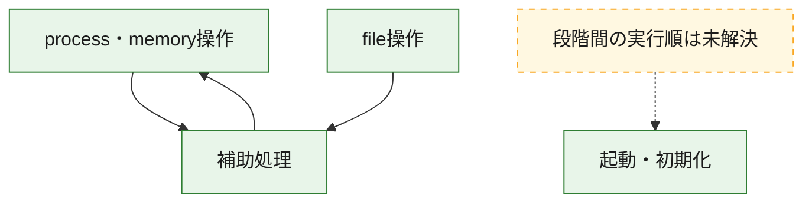
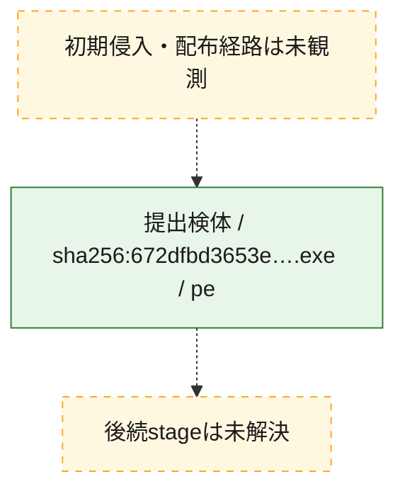
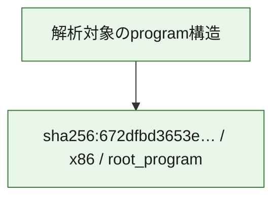

# 全体ロジック：672dfbd3653ee6406d24117b942ae928deaf18006238fcb3a96fb86e28775aaf

代表関数の静的証跡から、起動・初期化、process・memory操作、file操作の処理群を確認しました。

## 読み方

- phaseの掲載順は解析上の整理順です。observed_call_edgesがない段階間の実行順を断定しません。
- 図の実線は静的に観測した関係、点線と黄色のノードは未観測・未解決の関係を示します。
- 図は静的な要約であり、動的実行を再現するものではありません。
- 詳細な関数解説とfingerprintは[STATIC-LOGIC.md](STATIC-LOGIC.md)を参照してください。

## 静的可視化

### 実行フロー

### 感染チェーン

### モジュール関係

## 処理段階

### 1. 起動・初期化

entry pointから初期化と後続処理への移行を確認します。
確度: `confirmed_static_function_evidence`

- `672dfbd3653ee6406d24117b942ae928deaf18006238fcb3a96fb86e28775aaf:ghidra:14000cd70` — 初期化と主要処理への分岐を行う入口関数です。 状態: `succeeded`、選定理由: `entry_point`, `meaningful_symbol_name`, `reviewed_call_centrality:22`, `role:entrypoint`

### 2. process・memory操作

process、thread、module、memory操作と実行移行を確認します。
確度: `confirmed_static_function_evidence_with_limits`

- `672dfbd3653ee6406d24117b942ae928deaf18006238fcb3a96fb86e28775aaf:ghidra:14000590c` — process、thread、module、またはmemory操作に関係する関数です。 状態: `limited_bad_instruction_or_flow`、選定理由: `context_representative`, `reviewed_call_centrality:28`, `role:process_or_memory_operation`

### 3. file操作

fileやdirectoryの作成、読書き、削除を確認します。
確度: `confirmed_static_function_evidence`

- `672dfbd3653ee6406d24117b942ae928deaf18006238fcb3a96fb86e28775aaf:ghidra:140006c75` — fileまたはdirectoryの読書き・管理に関係する関数です。 状態: `succeeded`、選定理由: `context_representative`, `reviewed_call_centrality:25`, `role:file_operation`

### 4. 補助処理

主要処理を支える一般内部関数またはlibrary処理を確認します。
確度: `confirmed_static_function_evidence_with_limits`

- `672dfbd3653ee6406d24117b942ae928deaf18006238fcb3a96fb86e28775aaf:ghidra:140001000` — 検体内部の一般処理を実装する関数です。 状態: `succeeded`、選定理由: `context_representative`, `reviewed_call_centrality:4`
- `672dfbd3653ee6406d24117b942ae928deaf18006238fcb3a96fb86e28775aaf:ghidra:14000106e` — 検体内部の一般処理を実装する関数です。 状態: `succeeded`、選定理由: `context_representative`, `reviewed_call_centrality:9`
- `672dfbd3653ee6406d24117b942ae928deaf18006238fcb3a96fb86e28775aaf:ghidra:14000110f` — 検体内部の一般処理を実装する関数です。 状態: `succeeded`、選定理由: `context_representative`, `reviewed_call_centrality:3`
- `672dfbd3653ee6406d24117b942ae928deaf18006238fcb3a96fb86e28775aaf:ghidra:140001382` — 検体内部の一般処理を実装する関数です。 状態: `succeeded`、選定理由: `context_representative`, `reviewed_call_centrality:1`
- `672dfbd3653ee6406d24117b942ae928deaf18006238fcb3a96fb86e28775aaf:ghidra:14000139c` — 検体内部の一般処理を実装する関数です。 状態: `succeeded`、選定理由: `context_representative`, `reviewed_call_centrality:1`
- `672dfbd3653ee6406d24117b942ae928deaf18006238fcb3a96fb86e28775aaf:ghidra:1400013f8` — 検体内部の一般処理を実装する関数です。 状態: `succeeded`、選定理由: `context_representative`, `reviewed_call_centrality:4`
- `672dfbd3653ee6406d24117b942ae928deaf18006238fcb3a96fb86e28775aaf:ghidra:140001458` — 検体内部の一般処理を実装する関数です。 状態: `limited_bad_instruction_or_flow`、選定理由: `context_representative`, `reviewed_call_centrality:4`
- `672dfbd3653ee6406d24117b942ae928deaf18006238fcb3a96fb86e28775aaf:ghidra:1400014bc` — 検体内部の一般処理を実装する関数です。 状態: `succeeded`、選定理由: `context_representative`, `reviewed_call_centrality:6`
- `672dfbd3653ee6406d24117b942ae928deaf18006238fcb3a96fb86e28775aaf:ghidra:14000207d` — 検体内部の一般処理を実装する関数です。 状態: `limited_bad_instruction_or_flow`、選定理由: `context_representative`, `reviewed_call_centrality:12`
- `672dfbd3653ee6406d24117b942ae928deaf18006238fcb3a96fb86e28775aaf:ghidra:1400020b1` — 検体内部の一般処理を実装する関数です。 状態: `succeeded`、選定理由: `context_representative`, `reviewed_call_centrality:2`
- `672dfbd3653ee6406d24117b942ae928deaf18006238fcb3a96fb86e28775aaf:ghidra:140002101` — compiler生成処理または汎用library処理とみられる関数です。 状態: `limited_bad_instruction_or_flow`、選定理由: `entry_point`, `meaningful_symbol_name`, `reviewed_call_centrality:7`
- `672dfbd3653ee6406d24117b942ae928deaf18006238fcb3a96fb86e28775aaf:ghidra:14000221a` — 検体内部の一般処理を実装する関数です。 状態: `succeeded`、選定理由: `context_representative`, `reviewed_call_centrality:1`
- `672dfbd3653ee6406d24117b942ae928deaf18006238fcb3a96fb86e28775aaf:ghidra:140002317` — 検体内部の一般処理を実装する関数です。 状態: `limited_bad_instruction_or_flow`、選定理由: `context_representative`, `reviewed_call_centrality:4`
- `672dfbd3653ee6406d24117b942ae928deaf18006238fcb3a96fb86e28775aaf:ghidra:140002346` — 検体内部の一般処理を実装する関数です。 状態: `succeeded`、選定理由: `context_representative`, `reviewed_call_centrality:1`
- `672dfbd3653ee6406d24117b942ae928deaf18006238fcb3a96fb86e28775aaf:ghidra:140002454` — 検体内部の一般処理を実装する関数です。 状態: `succeeded`、選定理由: `context_representative`, `reviewed_call_centrality:11`
- `672dfbd3653ee6406d24117b942ae928deaf18006238fcb3a96fb86e28775aaf:ghidra:14000269f` — 検体内部の一般処理を実装する関数です。 状態: `succeeded`、選定理由: `context_representative`, `reviewed_call_centrality:9`
- `672dfbd3653ee6406d24117b942ae928deaf18006238fcb3a96fb86e28775aaf:ghidra:14000276a` — 検体内部の一般処理を実装する関数です。 状態: `succeeded`、選定理由: `context_representative`, `reviewed_call_centrality:5`
- `672dfbd3653ee6406d24117b942ae928deaf18006238fcb3a96fb86e28775aaf:ghidra:1400027d5` — 検体内部の一般処理を実装する関数です。 状態: `limited_bad_instruction_or_flow`、選定理由: `context_representative`, `reviewed_call_centrality:32`
- `672dfbd3653ee6406d24117b942ae928deaf18006238fcb3a96fb86e28775aaf:ghidra:140006af3` — 検体内部の一般処理を実装する関数です。 状態: `succeeded`、選定理由: `context_representative`, `reviewed_call_centrality:2`
- `672dfbd3653ee6406d24117b942ae928deaf18006238fcb3a96fb86e28775aaf:ghidra:140006bfc` — 検体内部の一般処理を実装する関数です。 状態: `succeeded`、選定理由: `context_representative`, `reviewed_call_centrality:4`
- `672dfbd3653ee6406d24117b942ae928deaf18006238fcb3a96fb86e28775aaf:ghidra:140006c34` — 検体内部の一般処理を実装する関数です。 状態: `succeeded`、選定理由: `context_representative`, `reviewed_call_centrality:7`
- `672dfbd3653ee6406d24117b942ae928deaf18006238fcb3a96fb86e28775aaf:ghidra:140007905` — 検体内部の一般処理を実装する関数です。 状態: `limited_bad_instruction_or_flow`、選定理由: `context_representative`
- `672dfbd3653ee6406d24117b942ae928deaf18006238fcb3a96fb86e28775aaf:ghidra:140007dbe` — 検体内部の一般処理を実装する関数です。 状態: `succeeded`、選定理由: `context_representative`, `reviewed_call_centrality:6`
- `672dfbd3653ee6406d24117b942ae928deaf18006238fcb3a96fb86e28775aaf:ghidra:140007e4b` — 検体内部の一般処理を実装する関数です。 状態: `succeeded`、選定理由: `context_representative`, `reviewed_call_centrality:3`
- `672dfbd3653ee6406d24117b942ae928deaf18006238fcb3a96fb86e28775aaf:ghidra:140007e7b` — 検体内部の一般処理を実装する関数です。 状態: `limited_bad_instruction_or_flow`、選定理由: `context_representative`, `reviewed_call_centrality:26`
- `672dfbd3653ee6406d24117b942ae928deaf18006238fcb3a96fb86e28775aaf:ghidra:14000865e` — 検体内部の一般処理を実装する関数です。 状態: `succeeded`、選定理由: `context_representative`, `reviewed_call_centrality:8`
- `672dfbd3653ee6406d24117b942ae928deaf18006238fcb3a96fb86e28775aaf:ghidra:140008736` — 検体内部の一般処理を実装する関数です。 状態: `succeeded`、選定理由: `context_representative`, `reviewed_call_centrality:26`
- `672dfbd3653ee6406d24117b942ae928deaf18006238fcb3a96fb86e28775aaf:ghidra:140008da7` — 検体内部の一般処理を実装する関数です。 状態: `succeeded`、選定理由: `context_representative`, `reviewed_call_centrality:2`
- `672dfbd3653ee6406d24117b942ae928deaf18006238fcb3a96fb86e28775aaf:ghidra:140008df0` — 検体内部の一般処理を実装する関数です。 状態: `succeeded`、選定理由: `context_representative`, `reviewed_call_centrality:6`

## 観測したcall関係

- `672dfbd3653ee6406d24117b942ae928deaf18006238fcb3a96fb86e28775aaf:ghidra:140001000` → `672dfbd3653ee6406d24117b942ae928deaf18006238fcb3a96fb86e28775aaf:ghidra:14000207d` （`support` → `support`）
- `672dfbd3653ee6406d24117b942ae928deaf18006238fcb3a96fb86e28775aaf:ghidra:14000110f` → `672dfbd3653ee6406d24117b942ae928deaf18006238fcb3a96fb86e28775aaf:ghidra:140006c34` （`support` → `support`）
- `672dfbd3653ee6406d24117b942ae928deaf18006238fcb3a96fb86e28775aaf:ghidra:140001382` → `672dfbd3653ee6406d24117b942ae928deaf18006238fcb3a96fb86e28775aaf:ghidra:140008736` （`support` → `support`）
- `672dfbd3653ee6406d24117b942ae928deaf18006238fcb3a96fb86e28775aaf:ghidra:1400013f8` → `672dfbd3653ee6406d24117b942ae928deaf18006238fcb3a96fb86e28775aaf:ghidra:14000207d` （`support` → `support`）
- `672dfbd3653ee6406d24117b942ae928deaf18006238fcb3a96fb86e28775aaf:ghidra:1400014bc` → `672dfbd3653ee6406d24117b942ae928deaf18006238fcb3a96fb86e28775aaf:ghidra:14000865e` （`support` → `support`）
- `672dfbd3653ee6406d24117b942ae928deaf18006238fcb3a96fb86e28775aaf:ghidra:1400020b1` → `672dfbd3653ee6406d24117b942ae928deaf18006238fcb3a96fb86e28775aaf:ghidra:140007e7b` （`support` → `support`）
- `672dfbd3653ee6406d24117b942ae928deaf18006238fcb3a96fb86e28775aaf:ghidra:14000221a` → `672dfbd3653ee6406d24117b942ae928deaf18006238fcb3a96fb86e28775aaf:ghidra:140006c34` （`support` → `support`）
- `672dfbd3653ee6406d24117b942ae928deaf18006238fcb3a96fb86e28775aaf:ghidra:140002454` → `672dfbd3653ee6406d24117b942ae928deaf18006238fcb3a96fb86e28775aaf:ghidra:14000207d` （`support` → `support`）
- `672dfbd3653ee6406d24117b942ae928deaf18006238fcb3a96fb86e28775aaf:ghidra:140002454` → `672dfbd3653ee6406d24117b942ae928deaf18006238fcb3a96fb86e28775aaf:ghidra:140006bfc` （`support` → `support`）
- `672dfbd3653ee6406d24117b942ae928deaf18006238fcb3a96fb86e28775aaf:ghidra:1400027d5` → `672dfbd3653ee6406d24117b942ae928deaf18006238fcb3a96fb86e28775aaf:ghidra:14000110f` （`support` → `support`）
- `672dfbd3653ee6406d24117b942ae928deaf18006238fcb3a96fb86e28775aaf:ghidra:1400027d5` → `672dfbd3653ee6406d24117b942ae928deaf18006238fcb3a96fb86e28775aaf:ghidra:1400013f8` （`support` → `support`）
- `672dfbd3653ee6406d24117b942ae928deaf18006238fcb3a96fb86e28775aaf:ghidra:1400027d5` → `672dfbd3653ee6406d24117b942ae928deaf18006238fcb3a96fb86e28775aaf:ghidra:14000207d` （`support` → `support`）
- `672dfbd3653ee6406d24117b942ae928deaf18006238fcb3a96fb86e28775aaf:ghidra:1400027d5` → `672dfbd3653ee6406d24117b942ae928deaf18006238fcb3a96fb86e28775aaf:ghidra:14000590c` （`support` → `execution`）
- `672dfbd3653ee6406d24117b942ae928deaf18006238fcb3a96fb86e28775aaf:ghidra:1400027d5` → `672dfbd3653ee6406d24117b942ae928deaf18006238fcb3a96fb86e28775aaf:ghidra:140007e4b` （`support` → `support`）
- `672dfbd3653ee6406d24117b942ae928deaf18006238fcb3a96fb86e28775aaf:ghidra:1400027d5` → `672dfbd3653ee6406d24117b942ae928deaf18006238fcb3a96fb86e28775aaf:ghidra:140007e7b` （`support` → `support`）
- `672dfbd3653ee6406d24117b942ae928deaf18006238fcb3a96fb86e28775aaf:ghidra:14000590c` → `672dfbd3653ee6406d24117b942ae928deaf18006238fcb3a96fb86e28775aaf:ghidra:14000207d` （`execution` → `support`）
- `672dfbd3653ee6406d24117b942ae928deaf18006238fcb3a96fb86e28775aaf:ghidra:14000590c` → `672dfbd3653ee6406d24117b942ae928deaf18006238fcb3a96fb86e28775aaf:ghidra:140006af3` （`execution` → `support`）
- `672dfbd3653ee6406d24117b942ae928deaf18006238fcb3a96fb86e28775aaf:ghidra:14000590c` → `672dfbd3653ee6406d24117b942ae928deaf18006238fcb3a96fb86e28775aaf:ghidra:140006c34` （`execution` → `support`）
- `672dfbd3653ee6406d24117b942ae928deaf18006238fcb3a96fb86e28775aaf:ghidra:14000590c` → `672dfbd3653ee6406d24117b942ae928deaf18006238fcb3a96fb86e28775aaf:ghidra:140007dbe` （`execution` → `support`）
- `672dfbd3653ee6406d24117b942ae928deaf18006238fcb3a96fb86e28775aaf:ghidra:140006bfc` → `672dfbd3653ee6406d24117b942ae928deaf18006238fcb3a96fb86e28775aaf:ghidra:140007dbe` （`support` → `support`）
- `672dfbd3653ee6406d24117b942ae928deaf18006238fcb3a96fb86e28775aaf:ghidra:140006c34` → `672dfbd3653ee6406d24117b942ae928deaf18006238fcb3a96fb86e28775aaf:ghidra:140007dbe` （`support` → `support`）
- `672dfbd3653ee6406d24117b942ae928deaf18006238fcb3a96fb86e28775aaf:ghidra:140006c75` → `672dfbd3653ee6406d24117b942ae928deaf18006238fcb3a96fb86e28775aaf:ghidra:140001000` （`file_activity` → `support`）
- `672dfbd3653ee6406d24117b942ae928deaf18006238fcb3a96fb86e28775aaf:ghidra:140006c75` → `672dfbd3653ee6406d24117b942ae928deaf18006238fcb3a96fb86e28775aaf:ghidra:14000207d` （`file_activity` → `support`）
- `672dfbd3653ee6406d24117b942ae928deaf18006238fcb3a96fb86e28775aaf:ghidra:140006c75` → `672dfbd3653ee6406d24117b942ae928deaf18006238fcb3a96fb86e28775aaf:ghidra:140007dbe` （`file_activity` → `support`）
- `672dfbd3653ee6406d24117b942ae928deaf18006238fcb3a96fb86e28775aaf:ghidra:140007e4b` → `672dfbd3653ee6406d24117b942ae928deaf18006238fcb3a96fb86e28775aaf:ghidra:14000207d` （`support` → `support`）
- `672dfbd3653ee6406d24117b942ae928deaf18006238fcb3a96fb86e28775aaf:ghidra:140007e7b` → `672dfbd3653ee6406d24117b942ae928deaf18006238fcb3a96fb86e28775aaf:ghidra:14000207d` （`support` → `support`）
- `672dfbd3653ee6406d24117b942ae928deaf18006238fcb3a96fb86e28775aaf:ghidra:140007e7b` → `672dfbd3653ee6406d24117b942ae928deaf18006238fcb3a96fb86e28775aaf:ghidra:140006bfc` （`support` → `support`）
- `672dfbd3653ee6406d24117b942ae928deaf18006238fcb3a96fb86e28775aaf:ghidra:140008736` → `672dfbd3653ee6406d24117b942ae928deaf18006238fcb3a96fb86e28775aaf:ghidra:14000106e` （`support` → `support`）
- `672dfbd3653ee6406d24117b942ae928deaf18006238fcb3a96fb86e28775aaf:ghidra:140008da7` → `672dfbd3653ee6406d24117b942ae928deaf18006238fcb3a96fb86e28775aaf:ghidra:140006c34` （`support` → `support`）
- `672dfbd3653ee6406d24117b942ae928deaf18006238fcb3a96fb86e28775aaf:ghidra:140008df0` → `672dfbd3653ee6406d24117b942ae928deaf18006238fcb3a96fb86e28775aaf:ghidra:14000269f` （`support` → `support`）
- `672dfbd3653ee6406d24117b942ae928deaf18006238fcb3a96fb86e28775aaf:ghidra:140008df0` → `672dfbd3653ee6406d24117b942ae928deaf18006238fcb3a96fb86e28775aaf:ghidra:140006c34` （`support` → `support`）
- `ghidra-function:068cd20bc35ad965218d6d50` → `ghidra-function:52d6d2e5923e3e661f05dd8c` （`unclassified` → `unclassified`）
- `ghidra-function:0d2d354586f7e5593817a6e5` → `ghidra-function:1887576ae430036b03de20c5` （`unclassified` → `unclassified`）
- `ghidra-function:0d2d354586f7e5593817a6e5` → `ghidra-function:a219823157754e9d2c6c0a11` （`unclassified` → `unclassified`）
- `ghidra-function:2a57ef959e37d5705945f5ad` → `ghidra-function:fa1585491843e2f1ec8c1cb6` （`unclassified` → `unclassified`）
- `ghidra-function:2f22b178730ff6726afe8870` → `ghidra-function:63aafa47e069af009f6c32b2` （`unclassified` → `unclassified`）
- `ghidra-function:2f22b178730ff6726afe8870` → `ghidra-function:9c2fedf9bdb43d3c7b351e1a` （`unclassified` → `unclassified`）
- `ghidra-function:333486d00af88f420719fef7` → `ghidra-external:2571154fb4b3d6a6144cd9e5` （`unclassified` → `unclassified`）
- `ghidra-function:333486d00af88f420719fef7` → `ghidra-external:382989028809499aed2a2cc2` （`unclassified` → `unclassified`）
- `ghidra-function:333486d00af88f420719fef7` → `ghidra-external:3cf7f8846a8194f9b32e9a9b` （`unclassified` → `unclassified`）
- `ghidra-function:333486d00af88f420719fef7` → `ghidra-function:ac74fc11fc8a2977598a3639` （`unclassified` → `unclassified`）
- `ghidra-function:33513641c3b5895bee58e828` → `ghidra-external:382989028809499aed2a2cc2` （`unclassified` → `unclassified`）
- `ghidra-function:33513641c3b5895bee58e828` → `ghidra-external:6daf9bce09fcde00a968b4b9` （`unclassified` → `unclassified`）
- `ghidra-function:33513641c3b5895bee58e828` → `ghidra-external:b942f04d1b8c1ef86de4e971` （`unclassified` → `unclassified`）
- `ghidra-function:33513641c3b5895bee58e828` → `ghidra-function:5656301a489abea1305132e8` （`unclassified` → `unclassified`）
- `ghidra-function:33513641c3b5895bee58e828` → `ghidra-function:61a015cebc4db29d106d4d97` （`unclassified` → `unclassified`）
- `ghidra-function:33513641c3b5895bee58e828` → `ghidra-function:6c37af954dfc3d49a59913d8` （`unclassified` → `unclassified`）
- `ghidra-function:3738d1180045e214ee312b08` → `ghidra-function:ccc840bcb77bc86dd593ded1` （`unclassified` → `unclassified`）
- `ghidra-function:5656301a489abea1305132e8` → `ghidra-external:08464af0ed9f9236a75f5f7b` （`unclassified` → `unclassified`）
- `ghidra-function:5656301a489abea1305132e8` → `ghidra-external:359bef1b5d0865a056ba7caf` （`unclassified` → `unclassified`）
- `ghidra-function:5656301a489abea1305132e8` → `ghidra-external:394662ae60f0b6c958c0524f` （`unclassified` → `unclassified`）
- `ghidra-function:5656301a489abea1305132e8` → `ghidra-external:999774546a17622935c07641` （`unclassified` → `unclassified`）
- `ghidra-function:5656301a489abea1305132e8` → `ghidra-external:b91dc1c21a04ee3705a180ac` （`unclassified` → `unclassified`）
- `ghidra-function:5656301a489abea1305132e8` → `ghidra-external:bd7a6b99c7289901d276fe2c` （`unclassified` → `unclassified`）
- `ghidra-function:5656301a489abea1305132e8` → `ghidra-external:ca8665c02a644085c6e1ec15` （`unclassified` → `unclassified`）
- `ghidra-function:5e565f2ebecf33177e2487e8` → `ghidra-function:52d6d2e5923e3e661f05dd8c` （`unclassified` → `unclassified`）
- `ghidra-function:5ea49fa9da6c30511eef8b73` → `ghidra-external:382989028809499aed2a2cc2` （`unclassified` → `unclassified`）
- `ghidra-function:5ea49fa9da6c30511eef8b73` → `ghidra-external:74a472484bbdf4f025cc7d22` （`unclassified` → `unclassified`）
- `ghidra-function:5ea49fa9da6c30511eef8b73` → `ghidra-function:1cf19b2f9c4c275e72f5fb17` （`unclassified` → `unclassified`）
- `ghidra-function:5ea49fa9da6c30511eef8b73` → `ghidra-function:2ca50a7f5e768a20830ee64a` （`unclassified` → `unclassified`）
- `ghidra-function:5ea49fa9da6c30511eef8b73` → `ghidra-function:51872bcf06a59d220d0a4d89` （`unclassified` → `unclassified`）
- `ghidra-function:5ea49fa9da6c30511eef8b73` → `ghidra-function:63aafa47e069af009f6c32b2` （`unclassified` → `unclassified`）
- `ghidra-function:5ea49fa9da6c30511eef8b73` → `ghidra-function:6a5a0fbf2a694b15da494beb` （`unclassified` → `unclassified`）
- `ghidra-function:5ea49fa9da6c30511eef8b73` → `ghidra-function:88fa539772b830e16dc5e597` （`unclassified` → `unclassified`）
- `ghidra-function:5ea49fa9da6c30511eef8b73` → `ghidra-function:8cbaffb79f65d91bd0b80dd2` （`unclassified` → `unclassified`）
- `ghidra-function:5ea49fa9da6c30511eef8b73` → `ghidra-function:909ca78c2a39b303ce3ad650` （`unclassified` → `unclassified`）
- `ghidra-function:5ea49fa9da6c30511eef8b73` → `ghidra-function:91ffdaebd031c3ace6b122f6` （`unclassified` → `unclassified`）
- `ghidra-function:5ea49fa9da6c30511eef8b73` → `ghidra-function:96ffe4d03bb08e8eceba3c2a` （`unclassified` → `unclassified`）
- `ghidra-function:5ea49fa9da6c30511eef8b73` → `ghidra-function:9c2fedf9bdb43d3c7b351e1a` （`unclassified` → `unclassified`）
- `ghidra-function:5ea49fa9da6c30511eef8b73` → `ghidra-function:a274d834fbaa6272afae065d` （`unclassified` → `unclassified`）
- `ghidra-function:5ea49fa9da6c30511eef8b73` → `ghidra-function:ac74fc11fc8a2977598a3639` （`unclassified` → `unclassified`）
- `ghidra-function:5ea49fa9da6c30511eef8b73` → `ghidra-function:e056dfa309673c0569427776` （`unclassified` → `unclassified`）
- `ghidra-function:5ea49fa9da6c30511eef8b73` → `ghidra-function:eefa70320167a209780abbce` （`unclassified` → `unclassified`）
- `ghidra-function:6665a157740fb580b8b70f69` → `ghidra-external:2571154fb4b3d6a6144cd9e5` （`unclassified` → `unclassified`）
- `ghidra-function:6665a157740fb580b8b70f69` → `ghidra-external:382989028809499aed2a2cc2` （`unclassified` → `unclassified`）
- `ghidra-function:6665a157740fb580b8b70f69` → `ghidra-external:3cf7f8846a8194f9b32e9a9b` （`unclassified` → `unclassified`）
- `ghidra-function:6665a157740fb580b8b70f69` → `ghidra-external:4ef5eb8806e7f51ab7a92bb2` （`unclassified` → `unclassified`）
- `ghidra-function:6665a157740fb580b8b70f69` → `ghidra-external:74a472484bbdf4f025cc7d22` （`unclassified` → `unclassified`）
- `ghidra-function:6665a157740fb580b8b70f69` → `ghidra-external:97b7ba2d8fc9c6d973a181c2` （`unclassified` → `unclassified`）
- `ghidra-function:6665a157740fb580b8b70f69` → `ghidra-function:04802a8d1111bd66cf912fd9` （`unclassified` → `unclassified`）
- `ghidra-function:6665a157740fb580b8b70f69` → `ghidra-function:0b950ba7765b7ea7d60a543f` （`unclassified` → `unclassified`）
- `ghidra-function:6665a157740fb580b8b70f69` → `ghidra-function:12e3f6946e5669c8114d138d` （`unclassified` → `unclassified`）
- `ghidra-function:6665a157740fb580b8b70f69` → `ghidra-function:4f7e47df14717b26b026528c` （`unclassified` → `unclassified`）
- `ghidra-function:6665a157740fb580b8b70f69` → `ghidra-function:52d6d2e5923e3e661f05dd8c` （`unclassified` → `unclassified`）
- `ghidra-function:6665a157740fb580b8b70f69` → `ghidra-function:5e565f2ebecf33177e2487e8` （`unclassified` → `unclassified`）
- `ghidra-function:6665a157740fb580b8b70f69` → `ghidra-function:63aafa47e069af009f6c32b2` （`unclassified` → `unclassified`）
- `ghidra-function:6665a157740fb580b8b70f69` → `ghidra-function:6a5a0fbf2a694b15da494beb` （`unclassified` → `unclassified`）
- `ghidra-function:6665a157740fb580b8b70f69` → `ghidra-function:76b12547662b87473f7fa7d4` （`unclassified` → `unclassified`）
- `ghidra-function:6665a157740fb580b8b70f69` → `ghidra-function:8ee54b7cd94c40af059b248d` （`unclassified` → `unclassified`）
- `ghidra-function:6665a157740fb580b8b70f69` → `ghidra-function:9c2fedf9bdb43d3c7b351e1a` （`unclassified` → `unclassified`）
- `ghidra-function:6665a157740fb580b8b70f69` → `ghidra-function:ccc840bcb77bc86dd593ded1` （`unclassified` → `unclassified`）
- `ghidra-function:6665a157740fb580b8b70f69` → `ghidra-function:eefa70320167a209780abbce` （`unclassified` → `unclassified`）
- `ghidra-function:6665a157740fb580b8b70f69` → `ghidra-function:ef7d1f481e72479be586b15e` （`unclassified` → `unclassified`）
- `ghidra-function:6a5a0fbf2a694b15da494beb` → `ghidra-external:97b7ba2d8fc9c6d973a181c2` （`unclassified` → `unclassified`）
- `ghidra-function:6a5a0fbf2a694b15da494beb` → `ghidra-function:48ff0c4c08e29e907ea35ad7` （`unclassified` → `unclassified`）
- `ghidra-function:7a43f9237b76e1c2e73a073c` → `ghidra-external:26b99a2b9332a461db5ea9f4` （`unclassified` → `unclassified`）
- `ghidra-function:7a43f9237b76e1c2e73a073c` → `ghidra-external:382989028809499aed2a2cc2` （`unclassified` → `unclassified`）
- `ghidra-function:7a43f9237b76e1c2e73a073c` → `ghidra-function:1113529bc040aa5682bba260` （`unclassified` → `unclassified`）
- `ghidra-function:7a43f9237b76e1c2e73a073c` → `ghidra-function:66c796f01164459aec3ed3ef` （`unclassified` → `unclassified`）
- `ghidra-function:7a43f9237b76e1c2e73a073c` → `ghidra-function:92d783ba4972eb97621d0105` （`unclassified` → `unclassified`）
- `ghidra-function:7ea0cf2ad5328ef064ad08dc` → `ghidra-external:382989028809499aed2a2cc2` （`unclassified` → `unclassified`）
- `ghidra-function:7ea0cf2ad5328ef064ad08dc` → `ghidra-function:52d6d2e5923e3e661f05dd8c` （`unclassified` → `unclassified`）
- `ghidra-function:7ea0cf2ad5328ef064ad08dc` → `ghidra-function:eefa70320167a209780abbce` （`unclassified` → `unclassified`）
- `ghidra-function:85861b57e07f05c325ead3ee` → `ghidra-external:4adcb3a97d7ba399f5bb5c7b` （`unclassified` → `unclassified`）
- `ghidra-function:85861b57e07f05c325ead3ee` → `ghidra-external:550ace6d9e6728458de1d046` （`unclassified` → `unclassified`）
- `ghidra-function:85861b57e07f05c325ead3ee` → `ghidra-external:5a65af59e00cb6618aa5fece` （`unclassified` → `unclassified`）
- `ghidra-function:85861b57e07f05c325ead3ee` → `ghidra-external:60563aa87bfe0928ee619d11` （`unclassified` → `unclassified`）
- `ghidra-function:85861b57e07f05c325ead3ee` → `ghidra-external:7c805356e874b644c09517ec` （`unclassified` → `unclassified`）
- `ghidra-function:85861b57e07f05c325ead3ee` → `ghidra-external:8408c25bbceaee9cb2a84645` （`unclassified` → `unclassified`）
- `ghidra-function:85861b57e07f05c325ead3ee` → `ghidra-external:ab160b88d1e808c6f24224aa` （`unclassified` → `unclassified`）
- `ghidra-function:85861b57e07f05c325ead3ee` → `ghidra-external:b942f04d1b8c1ef86de4e971` （`unclassified` → `unclassified`）
- `ghidra-function:85861b57e07f05c325ead3ee` → `ghidra-external:e2afb900db5708bd8a0e3fcb` （`unclassified` → `unclassified`）
- `ghidra-function:85861b57e07f05c325ead3ee` → `ghidra-function:08c8c233c1bf1d1b624f6728` （`unclassified` → `unclassified`）
- `ghidra-function:85861b57e07f05c325ead3ee` → `ghidra-function:12f254f38196309c13abe8ec` （`unclassified` → `unclassified`）
- `ghidra-function:85861b57e07f05c325ead3ee` → `ghidra-function:1cbc6006cc34ee6f4eb29547` （`unclassified` → `unclassified`）
- `ghidra-function:85861b57e07f05c325ead3ee` → `ghidra-function:1e479649af9c20bbe204e48d` （`unclassified` → `unclassified`）
- `ghidra-function:85861b57e07f05c325ead3ee` → `ghidra-function:3e5d1f7437fc574e37708c9a` （`unclassified` → `unclassified`）
- `ghidra-function:85861b57e07f05c325ead3ee` → `ghidra-function:51555d2e497ce6e3f2695e8b` （`unclassified` → `unclassified`）
- `ghidra-function:85861b57e07f05c325ead3ee` → `ghidra-function:5e19c2521e36d38d57274838` （`unclassified` → `unclassified`）
- `ghidra-function:85861b57e07f05c325ead3ee` → `ghidra-function:6e940b10d69f066a69c08366` （`unclassified` → `unclassified`）
- `ghidra-function:85861b57e07f05c325ead3ee` → `ghidra-function:93c3e26036b7fc6a695845fd` （`unclassified` → `unclassified`）
- `ghidra-function:85861b57e07f05c325ead3ee` → `ghidra-function:aa56b5dc9f184cbe0f7d99d3` （`unclassified` → `unclassified`）
- `ghidra-function:85861b57e07f05c325ead3ee` → `ghidra-function:d1429a77017b2fd17c582f1a` （`unclassified` → `unclassified`）
- `ghidra-function:85861b57e07f05c325ead3ee` → `ghidra-function:d2e40ffbae349850ae6ef103` （`unclassified` → `unclassified`）
- `ghidra-function:85861b57e07f05c325ead3ee` → `ghidra-function:eb0ccb3ca740147037860051` （`unclassified` → `unclassified`）
- `ghidra-function:86bf719f57d11272cf8a8d07` → `ghidra-external:382989028809499aed2a2cc2` （`unclassified` → `unclassified`）
- `ghidra-function:86bf719f57d11272cf8a8d07` → `ghidra-external:af3837d3ded525706577e445` （`unclassified` → `unclassified`）
- `ghidra-function:86bf719f57d11272cf8a8d07` → `ghidra-function:1cf19b2f9c4c275e72f5fb17` （`unclassified` → `unclassified`）
- `ghidra-function:86bf719f57d11272cf8a8d07` → `ghidra-function:4f6333d61963e057935bf3e4` （`unclassified` → `unclassified`）
- `ghidra-function:86bf719f57d11272cf8a8d07` → `ghidra-function:63aafa47e069af009f6c32b2` （`unclassified` → `unclassified`）
- `ghidra-function:86bf719f57d11272cf8a8d07` → `ghidra-function:9c2fedf9bdb43d3c7b351e1a` （`unclassified` → `unclassified`）
- `ghidra-function:86bf719f57d11272cf8a8d07` → `ghidra-function:eefa70320167a209780abbce` （`unclassified` → `unclassified`）
- `ghidra-function:86bf719f57d11272cf8a8d07` → `ghidra-function:f7096ec0419569ea3c333dc0` （`unclassified` → `unclassified`）
- `ghidra-function:91ffdaebd031c3ace6b122f6` → `ghidra-external:382989028809499aed2a2cc2` （`unclassified` → `unclassified`）
- `ghidra-function:91ffdaebd031c3ace6b122f6` → `ghidra-function:eefa70320167a209780abbce` （`unclassified` → `unclassified`）
- `ghidra-function:91ffdaebd031c3ace6b122f6` → `ghidra-function:ef7d1f481e72479be586b15e` （`unclassified` → `unclassified`）
- `ghidra-function:95249b571ce470231a68f282` → `ghidra-function:52d6d2e5923e3e661f05dd8c` （`unclassified` → `unclassified`）
- `ghidra-function:95249b571ce470231a68f282` → `ghidra-function:ccc840bcb77bc86dd593ded1` （`unclassified` → `unclassified`）
- `ghidra-function:9dee51c80a85214cc6512978` → `ghidra-external:382989028809499aed2a2cc2` （`unclassified` → `unclassified`）
- `ghidra-function:a5c26dfdd1a04d4d0a1cb01e` → `ghidra-external:08464af0ed9f9236a75f5f7b` （`unclassified` → `unclassified`）
- `ghidra-function:a5c26dfdd1a04d4d0a1cb01e` → `ghidra-external:382989028809499aed2a2cc2` （`unclassified` → `unclassified`）
- `ghidra-function:a5c26dfdd1a04d4d0a1cb01e` → `ghidra-external:59f0cdb143090bf20f614c01` （`unclassified` → `unclassified`）
- `ghidra-function:a5c26dfdd1a04d4d0a1cb01e` → `ghidra-external:74a472484bbdf4f025cc7d22` （`unclassified` → `unclassified`）
- `ghidra-function:a5c26dfdd1a04d4d0a1cb01e` → `ghidra-external:83d2eb155c2125e70c2ef271` （`unclassified` → `unclassified`）
- `ghidra-function:a5c26dfdd1a04d4d0a1cb01e` → `ghidra-external:af3837d3ded525706577e445` （`unclassified` → `unclassified`）
- `ghidra-function:a5c26dfdd1a04d4d0a1cb01e` → `ghidra-external:b91dc1c21a04ee3705a180ac` （`unclassified` → `unclassified`）
- `ghidra-function:a5c26dfdd1a04d4d0a1cb01e` → `ghidra-external:b942f04d1b8c1ef86de4e971` （`unclassified` → `unclassified`）
- `ghidra-function:a5c26dfdd1a04d4d0a1cb01e` → `ghidra-external:bd7a6b99c7289901d276fe2c` （`unclassified` → `unclassified`）
- `ghidra-function:a5c26dfdd1a04d4d0a1cb01e` → `ghidra-external:e5dddb26265806d993daff18` （`unclassified` → `unclassified`）
- `ghidra-function:a5c26dfdd1a04d4d0a1cb01e` → `ghidra-function:17fffe000a7f0b430b789352` （`unclassified` → `unclassified`）
- `ghidra-function:a5c26dfdd1a04d4d0a1cb01e` → `ghidra-function:2cf590fc6a07451f9ae682e7` （`unclassified` → `unclassified`）
- `ghidra-function:a5c26dfdd1a04d4d0a1cb01e` → `ghidra-function:52d6d2e5923e3e661f05dd8c` （`unclassified` → `unclassified`）
- `ghidra-function:a5c26dfdd1a04d4d0a1cb01e` → `ghidra-function:5b349a18c05595af4194c085` （`unclassified` → `unclassified`）
- `ghidra-function:a5c26dfdd1a04d4d0a1cb01e` → `ghidra-function:63aafa47e069af009f6c32b2` （`unclassified` → `unclassified`）
- `ghidra-function:a5c26dfdd1a04d4d0a1cb01e` → `ghidra-function:661235cf3e49821260c3937f` （`unclassified` → `unclassified`）
- `ghidra-function:a5c26dfdd1a04d4d0a1cb01e` → `ghidra-function:6665a157740fb580b8b70f69` （`unclassified` → `unclassified`）
- `ghidra-function:a5c26dfdd1a04d4d0a1cb01e` → `ghidra-function:7ea0cf2ad5328ef064ad08dc` （`unclassified` → `unclassified`）
- `ghidra-function:a5c26dfdd1a04d4d0a1cb01e` → `ghidra-function:806d092ef44fc04535d32661` （`unclassified` → `unclassified`）
- `ghidra-function:a5c26dfdd1a04d4d0a1cb01e` → `ghidra-function:841bbeb7e748b533634e5e9a` （`unclassified` → `unclassified`）
- `ghidra-function:a5c26dfdd1a04d4d0a1cb01e` → `ghidra-function:95249b571ce470231a68f282` （`unclassified` → `unclassified`）
- `ghidra-function:a5c26dfdd1a04d4d0a1cb01e` → `ghidra-function:9c2fedf9bdb43d3c7b351e1a` （`unclassified` → `unclassified`）
- `ghidra-function:a5c26dfdd1a04d4d0a1cb01e` → `ghidra-function:bcecfe368273e6ed143f49e8` （`unclassified` → `unclassified`）
- `ghidra-function:a5c26dfdd1a04d4d0a1cb01e` → `ghidra-function:daebf973b5b63300a34e86cf` （`unclassified` → `unclassified`）
- `ghidra-function:a5c26dfdd1a04d4d0a1cb01e` → `ghidra-function:e0ab30245799f7d24472c012` （`unclassified` → `unclassified`）
- `ghidra-function:a5c26dfdd1a04d4d0a1cb01e` → `ghidra-function:e317d9e32029123569a9b236` （`unclassified` → `unclassified`）
- `ghidra-function:a5c26dfdd1a04d4d0a1cb01e` → `ghidra-function:e515fdecd04488a86265142f` （`unclassified` → `unclassified`）
- `ghidra-function:a5c26dfdd1a04d4d0a1cb01e` → `ghidra-function:ee00394389f6ada08b206291` （`unclassified` → `unclassified`）
- `ghidra-function:a5c26dfdd1a04d4d0a1cb01e` → `ghidra-function:eefa70320167a209780abbce` （`unclassified` → `unclassified`）
- `ghidra-function:a5c26dfdd1a04d4d0a1cb01e` → `ghidra-function:ef7d1f481e72479be586b15e` （`unclassified` → `unclassified`）
- `ghidra-function:bcd93fd0e21d43720533c358` → `ghidra-function:52d6d2e5923e3e661f05dd8c` （`unclassified` → `unclassified`）
- `ghidra-function:bcd93fd0e21d43720533c358` → `ghidra-function:ccc840bcb77bc86dd593ded1` （`unclassified` → `unclassified`）
- `ghidra-function:c55425c2cc28bade66b36bff` → `ghidra-external:2571154fb4b3d6a6144cd9e5` （`unclassified` → `unclassified`）
- `ghidra-function:c55425c2cc28bade66b36bff` → `ghidra-external:382989028809499aed2a2cc2` （`unclassified` → `unclassified`）
- `ghidra-function:c55425c2cc28bade66b36bff` → `ghidra-external:3cf7f8846a8194f9b32e9a9b` （`unclassified` → `unclassified`）
- `ghidra-function:c55425c2cc28bade66b36bff` → `ghidra-function:63aafa47e069af009f6c32b2` （`unclassified` → `unclassified`）
- `ghidra-function:c55425c2cc28bade66b36bff` → `ghidra-function:9c2fedf9bdb43d3c7b351e1a` （`unclassified` → `unclassified`）
- `ghidra-function:c6a51dd1c525b17be357d107` → `ghidra-external:382989028809499aed2a2cc2` （`unclassified` → `unclassified`）
- `ghidra-function:c6a51dd1c525b17be357d107` → `ghidra-external:9ead83452548a578842b96a6` （`unclassified` → `unclassified`）
- `ghidra-function:c6a51dd1c525b17be357d107` → `ghidra-function:52d6d2e5923e3e661f05dd8c` （`unclassified` → `unclassified`）
- `ghidra-function:c6a51dd1c525b17be357d107` → `ghidra-function:661235cf3e49821260c3937f` （`unclassified` → `unclassified`）
- `ghidra-function:c6a51dd1c525b17be357d107` → `ghidra-function:ccc840bcb77bc86dd593ded1` （`unclassified` → `unclassified`）
- `ghidra-function:c6a51dd1c525b17be357d107` → `ghidra-function:ec59c9dc7df32a6f9f83ba76` （`unclassified` → `unclassified`）
- `ghidra-function:c7e62585ce9f78dc114117b3` → `ghidra-external:382989028809499aed2a2cc2` （`unclassified` → `unclassified`）
- `ghidra-function:c7e62585ce9f78dc114117b3` → `ghidra-function:e0ab30245799f7d24472c012` （`unclassified` → `unclassified`）
- `ghidra-function:ccc840bcb77bc86dd593ded1` → `ghidra-external:382989028809499aed2a2cc2` （`unclassified` → `unclassified`）
- `ghidra-function:ccc840bcb77bc86dd593ded1` → `ghidra-function:6a5a0fbf2a694b15da494beb` （`unclassified` → `unclassified`）
- `ghidra-function:e0ab30245799f7d24472c012` → `ghidra-external:08464af0ed9f9236a75f5f7b` （`unclassified` → `unclassified`）
- `ghidra-function:e0ab30245799f7d24472c012` → `ghidra-external:382989028809499aed2a2cc2` （`unclassified` → `unclassified`）
- `ghidra-function:e0ab30245799f7d24472c012` → `ghidra-external:4ef5eb8806e7f51ab7a92bb2` （`unclassified` → `unclassified`）
- `ghidra-function:e0ab30245799f7d24472c012` → `ghidra-external:b91dc1c21a04ee3705a180ac` （`unclassified` → `unclassified`）
- `ghidra-function:e0ab30245799f7d24472c012` → `ghidra-external:bd7a6b99c7289901d276fe2c` （`unclassified` → `unclassified`）
- `ghidra-function:e0ab30245799f7d24472c012` → `ghidra-function:5327f76ef2a2f73895b7d1e5` （`unclassified` → `unclassified`）
- `ghidra-function:e0ab30245799f7d24472c012` → `ghidra-function:562499c5299f8664cd3eaf5f` （`unclassified` → `unclassified`）
- `ghidra-function:e0ab30245799f7d24472c012` → `ghidra-function:63aafa47e069af009f6c32b2` （`unclassified` → `unclassified`）
- `ghidra-function:e0ab30245799f7d24472c012` → `ghidra-function:728788992855f9daeafb28ee` （`unclassified` → `unclassified`）
- `ghidra-function:e0ab30245799f7d24472c012` → `ghidra-function:97e58d0f222dc44a014640de` （`unclassified` → `unclassified`）
- `ghidra-function:e0ab30245799f7d24472c012` → `ghidra-function:9c2fedf9bdb43d3c7b351e1a` （`unclassified` → `unclassified`）
- `ghidra-function:e0ab30245799f7d24472c012` → `ghidra-function:9c40f51897b7df1e1cfcf65e` （`unclassified` → `unclassified`）
- `ghidra-function:e0ab30245799f7d24472c012` → `ghidra-function:dbcb99b36b9668093ece6bcf` （`unclassified` → `unclassified`）
- `ghidra-function:e0ab30245799f7d24472c012` → `ghidra-function:e329d4244f2d2117703efe48` （`unclassified` → `unclassified`）
- 残り31件は`static-logic.json`に記録しています。

## 解析範囲と制約

- 選定外関数は全体inventoryへ残しますが、関数本体の個別解説対象にはしていません。
- indirect call、難読化、packer、VM、壊れたcontrol flowによりcall関係が欠落する場合があります。
- 文書は静的解析に基づき、検体実行や外部通信による動的確認は行っていません。
