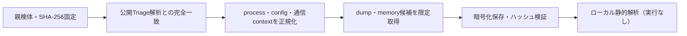

# Triage公開解析・後段取得証跡

## 完全ハッシュ一致

- [260923-yl3mzawcjh](https://tria.ge/260923-yl3mzawcjh): ファミリー候補 `未確定`、評価score `6`

## プロセス・通信

- 観測process: `Explorer.EXE, SecondRunner.exe, chrome.exe, elevation_service.exe, explorer.exe, svchost.exe`
- raw commandは保存せず、command SHA-256と処理patternだけをJSONへ保持します。
- sandbox background trafficは`context_only`であり、C2へ自動昇格しません。

- 取得できませんでした。

## 後段取得物

- `4312d416d708fbe4b4d12461dae8ce31146f4b846a43f6c8e7a0c6a2d83b6ac8` / `memory_image` / 458752 bytes / 親と同一: `false` / 静的解析: `partial`
- `4f032762723c1195b3607faefdcc1cb1bdc7580589947656fd07db5ffb14c8ff` / `memory_image` / 458752 bytes / 親と同一: `false` / 静的解析: `partial`

## 判定境界

Triage由来のfamily、process、config、通信は外部sandbox証跡です。Config extractorが返したendpointはC2候補として扱いますが、静的設定復元またはprocess帰属とprotocol応答が揃うまでは確認済みC2とはしません。取得成果物と検体は実行していません。
