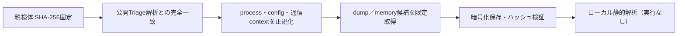

# Triage公開解析・後段取得証跡

## 完全ハッシュ一致

- [260805-r1h4jsak6t](https://tria.ge/260805-r1h4jsak6t): ファミリー候補 `salatstealer`、評価score `10`
- [260801-ftrlkael6t](https://tria.ge/260801-ftrlkael6t): ファミリー候補 `salatstealer`、評価score `10`

## プロセス・通信

- 観測process: `2026-08-01_65eebf6fc72a65284065154d3275562a_cobalt-strike_icedid_njrat_satacom_stealc.exe, 6747147c5ba29975a557d88cd22114478890a0a0a613f36512dcb730e4efe965.exe, Service.exe, cmd.exe, powershell.exe, svchost.exe`
- raw commandは保存せず、command SHA-256と処理patternだけをJSONへ保持しています。
- sandbox background trafficは`context_only`であり、C2へ自動昇格しません。

- 取得できませんでした。

## 二段目成果物

- 取得できませんでした。

## 判定境界

Triage由来のfamily、process、config、通信は外部sandbox証跡です。config extractorが返したendpointはC2候補として扱えますが、
静的設定復元またはprocess帰属とprotocol応答が揃うまでは確認済みC2とはしません。取得成果物と検体は実行していません。
