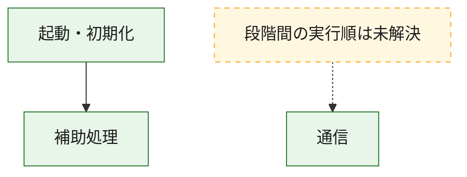
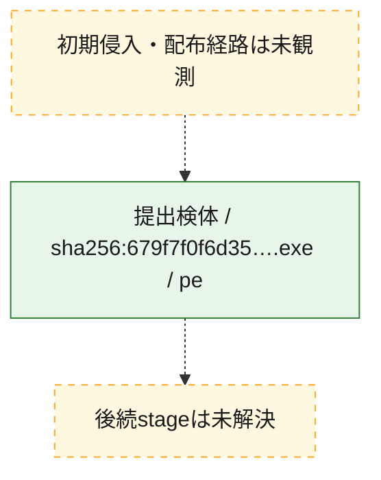
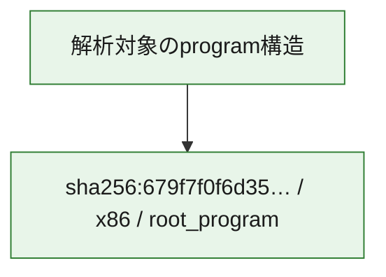

# 全体ロジック：679f7f0f6d3578fbda2c314e504464b6cda98f57c3981b790f7d72d97a0042f4

代表関数の静的証跡から、起動・初期化、通信の処理群を確認しました。

## 読み方

- phaseの掲載順は解析上の整理順です。observed_call_edgesがない段階間の実行順を断定しません。
- 図の実線は静的に観測した関係、点線と黄色のノードは未観測・未解決の関係を示します。
- 図は静的な要約であり、動的実行を再現するものではありません。
- 詳細な関数解説とfingerprintは[STATIC-LOGIC.md](STATIC-LOGIC.md)を参照してください。

## 静的可視化

### 実行フロー

### 感染チェーン

### モジュール関係

## 処理段階

### 1. 起動・初期化

entry pointから初期化と後続処理への移行を確認します。
確度: `confirmed_static_function_evidence`

- `679f7f0f6d3578fbda2c314e504464b6cda98f57c3981b790f7d72d97a0042f4:ghidra:39ca811f0` — 初期化と主要処理への分岐を行う入口関数です。 状態: `succeeded`、選定理由: `entry_point`, `meaningful_symbol_name`, `reviewed_call_centrality:2`, `role:entrypoint`

### 2. 通信

通信初期化、endpoint処理、送受信の役割を確認します。
確度: `confirmed_static_function_evidence`

- `679f7f0f6d3578fbda2c314e504464b6cda98f57c3981b790f7d72d97a0042f4:ghidra:39d7621c0` — 通信初期化、送受信、またはendpoint処理に関係する関数です。 状態: `succeeded`、選定理由: `entry_point`, `meaningful_symbol_name`, `reviewed_call_centrality:3`, `role:network_communication`
- `679f7f0f6d3578fbda2c314e504464b6cda98f57c3981b790f7d72d97a0042f4:ghidra:39d762210` — 通信初期化、送受信、またはendpoint処理に関係する関数です。 状態: `succeeded`、選定理由: `entry_point`, `meaningful_symbol_name`, `reviewed_call_centrality:3`, `role:network_communication`

### 3. 補助処理

主要処理を支える一般内部関数またはlibrary処理を確認します。
確度: `confirmed_static_function_evidence_with_limits`

- `679f7f0f6d3578fbda2c314e504464b6cda98f57c3981b790f7d72d97a0042f4:ghidra:39ca81000` — 検体内部の一般処理を実装する関数です。 状態: `succeeded`、選定理由: `context_representative`, `reviewed_call_centrality:14`
- `679f7f0f6d3578fbda2c314e504464b6cda98f57c3981b790f7d72d97a0042f4:ghidra:39ca812d0` — 検体内部の一般処理を実装する関数です。 状態: `limited_bad_instruction_or_flow`、選定理由: `context_representative`, `reviewed_call_centrality:2`
- `679f7f0f6d3578fbda2c314e504464b6cda98f57c3981b790f7d72d97a0042f4:ghidra:39ca812e0` — 検体内部の一般処理を実装する関数です。 状態: `limited_bad_instruction_or_flow`、選定理由: `context_representative`, `reviewed_call_centrality:2`
- `679f7f0f6d3578fbda2c314e504464b6cda98f57c3981b790f7d72d97a0042f4:ghidra:39ca812f0` — 検体内部の一般処理を実装する関数です。 状態: `succeeded`、選定理由: `context_representative`
- `679f7f0f6d3578fbda2c314e504464b6cda98f57c3981b790f7d72d97a0042f4:ghidra:39ca81300` — 検体内部の一般処理を実装する関数です。 状態: `succeeded`、選定理由: `context_representative`, `reviewed_call_centrality:9`
- `679f7f0f6d3578fbda2c314e504464b6cda98f57c3981b790f7d72d97a0042f4:ghidra:39ca81560` — 検体内部の一般処理を実装する関数です。 状態: `succeeded`、選定理由: `context_representative`, `reviewed_call_centrality:3`
- `679f7f0f6d3578fbda2c314e504464b6cda98f57c3981b790f7d72d97a0042f4:ghidra:39ca815e0` — 検体内部の一般処理を実装する関数です。 状態: `succeeded`、選定理由: `context_representative`, `reviewed_call_centrality:3`
- `679f7f0f6d3578fbda2c314e504464b6cda98f57c3981b790f7d72d97a0042f4:ghidra:39ca81640` — 検体内部の一般処理を実装する関数です。 状態: `succeeded`、選定理由: `context_representative`, `reviewed_call_centrality:3`
- `679f7f0f6d3578fbda2c314e504464b6cda98f57c3981b790f7d72d97a0042f4:ghidra:39ca81740` — 検体内部の一般処理を実装する関数です。 状態: `succeeded`、選定理由: `context_representative`, `reviewed_call_centrality:2`
- `679f7f0f6d3578fbda2c314e504464b6cda98f57c3981b790f7d72d97a0042f4:ghidra:39ca81860` — 検体内部の一般処理を実装する関数です。 状態: `succeeded`、選定理由: `context_representative`, `reviewed_call_centrality:5`
- `679f7f0f6d3578fbda2c314e504464b6cda98f57c3981b790f7d72d97a0042f4:ghidra:39ca81c20` — 検体内部の一般処理を実装する関数です。 状態: `succeeded`、選定理由: `context_representative`, `reviewed_call_centrality:2`
- `679f7f0f6d3578fbda2c314e504464b6cda98f57c3981b790f7d72d97a0042f4:ghidra:39ca81cc0` — 検体内部の一般処理を実装する関数です。 状態: `succeeded`、選定理由: `context_representative`, `reviewed_call_centrality:2`
- `679f7f0f6d3578fbda2c314e504464b6cda98f57c3981b790f7d72d97a0042f4:ghidra:39ca81d60` — 検体内部の一般処理を実装する関数です。 状態: `succeeded`、選定理由: `context_representative`, `reviewed_call_centrality:3`
- `679f7f0f6d3578fbda2c314e504464b6cda98f57c3981b790f7d72d97a0042f4:ghidra:39ca81e40` — 検体内部の一般処理を実装する関数です。 状態: `succeeded`、選定理由: `context_representative`, `reviewed_call_centrality:2`
- `679f7f0f6d3578fbda2c314e504464b6cda98f57c3981b790f7d72d97a0042f4:ghidra:39ca81fa0` — 検体内部の一般処理を実装する関数です。 状態: `succeeded`、選定理由: `context_representative`, `reviewed_call_centrality:2`
- `679f7f0f6d3578fbda2c314e504464b6cda98f57c3981b790f7d72d97a0042f4:ghidra:39ca82000` — 検体内部の一般処理を実装する関数です。 状態: `succeeded`、選定理由: `context_representative`, `reviewed_call_centrality:3`
- `679f7f0f6d3578fbda2c314e504464b6cda98f57c3981b790f7d72d97a0042f4:ghidra:39ca82080` — 検体内部の一般処理を実装する関数です。 状態: `succeeded`、選定理由: `context_representative`, `reviewed_call_centrality:4`
- `679f7f0f6d3578fbda2c314e504464b6cda98f57c3981b790f7d72d97a0042f4:ghidra:39ca82140` — 検体内部の一般処理を実装する関数です。 状態: `succeeded`、選定理由: `context_representative`, `reviewed_call_centrality:4`
- `679f7f0f6d3578fbda2c314e504464b6cda98f57c3981b790f7d72d97a0042f4:ghidra:39ca82240` — 検体内部の一般処理を実装する関数です。 状態: `succeeded`、選定理由: `context_representative`, `reviewed_call_centrality:8`
- `679f7f0f6d3578fbda2c314e504464b6cda98f57c3981b790f7d72d97a0042f4:ghidra:39ca826c0` — 検体内部の一般処理を実装する関数です。 状態: `succeeded`、選定理由: `context_representative`, `reviewed_call_centrality:2`
- `679f7f0f6d3578fbda2c314e504464b6cda98f57c3981b790f7d72d97a0042f4:ghidra:39d762160` — 検体内部の一般処理を実装する関数です。 状態: `succeeded`、選定理由: `entry_point`, `meaningful_symbol_name`, `reviewed_call_centrality:3`
- `679f7f0f6d3578fbda2c314e504464b6cda98f57c3981b790f7d72d97a0042f4:ghidra:39d762260` — 検体内部の一般処理を実装する関数です。 状態: `succeeded`、選定理由: `entry_point`, `meaningful_symbol_name`, `reviewed_call_centrality:3`
- `679f7f0f6d3578fbda2c314e504464b6cda98f57c3981b790f7d72d97a0042f4:ghidra:39d7622b0` — 検体内部の一般処理を実装する関数です。 状態: `succeeded`、選定理由: `entry_point`, `meaningful_symbol_name`, `reviewed_call_centrality:3`
- `679f7f0f6d3578fbda2c314e504464b6cda98f57c3981b790f7d72d97a0042f4:ghidra:39d762300` — 検体内部の一般処理を実装する関数です。 状態: `succeeded`、選定理由: `entry_point`, `meaningful_symbol_name`, `reviewed_call_centrality:3`
- `679f7f0f6d3578fbda2c314e504464b6cda98f57c3981b790f7d72d97a0042f4:ghidra:39d762340` — 検体内部の一般処理を実装する関数です。 状態: `succeeded`、選定理由: `entry_point`, `meaningful_symbol_name`, `reviewed_call_centrality:3`
- `679f7f0f6d3578fbda2c314e504464b6cda98f57c3981b790f7d72d97a0042f4:ghidra:39d762390` — 検体内部の一般処理を実装する関数です。 状態: `succeeded`、選定理由: `entry_point`, `meaningful_symbol_name`, `reviewed_call_centrality:3`
- `679f7f0f6d3578fbda2c314e504464b6cda98f57c3981b790f7d72d97a0042f4:ghidra:39d7623e0` — 検体内部の一般処理を実装する関数です。 状態: `succeeded`、選定理由: `entry_point`, `meaningful_symbol_name`, `reviewed_call_centrality:3`
- `679f7f0f6d3578fbda2c314e504464b6cda98f57c3981b790f7d72d97a0042f4:ghidra:39d7629f0` — compiler生成処理または汎用library処理とみられる関数です。 状態: `succeeded`、選定理由: `entry_point`, `meaningful_symbol_name`, `reviewed_call_centrality:7`
- `679f7f0f6d3578fbda2c314e504464b6cda98f57c3981b790f7d72d97a0042f4:ghidra:39d762a10` — compiler生成処理または汎用library処理とみられる関数です。 状態: `succeeded`、選定理由: `entry_point`, `meaningful_symbol_name`, `reviewed_call_centrality:4`

## 観測したcall関係

- `679f7f0f6d3578fbda2c314e504464b6cda98f57c3981b790f7d72d97a0042f4:ghidra:39ca81000` → `679f7f0f6d3578fbda2c314e504464b6cda98f57c3981b790f7d72d97a0042f4:ghidra:39d762a10` （`support` → `support`）
- `679f7f0f6d3578fbda2c314e504464b6cda98f57c3981b790f7d72d97a0042f4:ghidra:39ca811f0` → `679f7f0f6d3578fbda2c314e504464b6cda98f57c3981b790f7d72d97a0042f4:ghidra:39ca81000` （`startup` → `support`）
- `ghidra-function:14240d7c972138452a4cf79f` → `ghidra-external:811c3e0c767c40d7a918f543` （`unclassified` → `unclassified`）
- `ghidra-function:14240d7c972138452a4cf79f` → `ghidra-external:d06c0bdc2393be5b410fb4af` （`unclassified` → `unclassified`）
- `ghidra-function:2c250d8be3ef5b455db52902` → `ghidra-function:4d886b22255190abe6a09692` （`unclassified` → `unclassified`）
- `ghidra-function:2c250d8be3ef5b455db52902` → `ghidra-function:ab24defcbb408ca4da1a66ba` （`unclassified` → `unclassified`）
- `ghidra-function:2c250d8be3ef5b455db52902` → `ghidra-function:d3a57669b00caf71b2dc70bb` （`unclassified` → `unclassified`）
- `ghidra-function:313112fe097264255b50f442` → `ghidra-function:5dc11b9148e454aeaf660ef2` （`unclassified` → `unclassified`）
- `ghidra-function:313112fe097264255b50f442` → `ghidra-function:94b6e0291e63dce710de6daf` （`unclassified` → `unclassified`）
- `ghidra-function:363a34f0c0d52ea09ed4edcd` → `ghidra-function:4d886b22255190abe6a09692` （`unclassified` → `unclassified`）
- `ghidra-function:363a34f0c0d52ea09ed4edcd` → `ghidra-function:ab24defcbb408ca4da1a66ba` （`unclassified` → `unclassified`）
- `ghidra-function:363a34f0c0d52ea09ed4edcd` → `ghidra-function:d3a57669b00caf71b2dc70bb` （`unclassified` → `unclassified`）
- `ghidra-function:3d739183220704ee82e52ea7` → `ghidra-external:144f6eea19d920ff33125688` （`unclassified` → `unclassified`）
- `ghidra-function:3d739183220704ee82e52ea7` → `ghidra-function:064bc79c1d4e4d2cf30ba30d` （`unclassified` → `unclassified`）
- `ghidra-function:3d739183220704ee82e52ea7` → `ghidra-function:51b0ec2374ec35fdf28098cc` （`unclassified` → `unclassified`）
- `ghidra-function:3d739183220704ee82e52ea7` → `ghidra-function:aba3cf89008d06018a7dd682` （`unclassified` → `unclassified`）
- `ghidra-function:3edb507c92d0ab2c41030efc` → `ghidra-function:4d886b22255190abe6a09692` （`unclassified` → `unclassified`）
- `ghidra-function:3edb507c92d0ab2c41030efc` → `ghidra-function:ab24defcbb408ca4da1a66ba` （`unclassified` → `unclassified`）
- `ghidra-function:3edb507c92d0ab2c41030efc` → `ghidra-function:d3a57669b00caf71b2dc70bb` （`unclassified` → `unclassified`）
- `ghidra-function:54cdd5d5832850510dfef9e0` → `ghidra-function:3234991fdc653598f6b78b5f` （`unclassified` → `unclassified`）
- `ghidra-function:5e1b44a573362c5a00cf6961` → `ghidra-external:811c3e0c767c40d7a918f543` （`unclassified` → `unclassified`）
- `ghidra-function:5e1b44a573362c5a00cf6961` → `ghidra-external:b6837232ff180c94ab2ea5ff` （`unclassified` → `unclassified`）
- `ghidra-function:6514441d43ae0fc8f8d8ab3e` → `ghidra-function:4d886b22255190abe6a09692` （`unclassified` → `unclassified`）
- `ghidra-function:6514441d43ae0fc8f8d8ab3e` → `ghidra-function:ab24defcbb408ca4da1a66ba` （`unclassified` → `unclassified`）
- `ghidra-function:6514441d43ae0fc8f8d8ab3e` → `ghidra-function:d3a57669b00caf71b2dc70bb` （`unclassified` → `unclassified`）
- `ghidra-function:6a9642bb964519a14c383eaa` → `ghidra-external:811c3e0c767c40d7a918f543` （`unclassified` → `unclassified`）
- `ghidra-function:6a9642bb964519a14c383eaa` → `ghidra-function:aba3cf89008d06018a7dd682` （`unclassified` → `unclassified`）
- `ghidra-function:6eabed7cb318eb071cb8a15f` → `ghidra-external:144f6eea19d920ff33125688` （`unclassified` → `unclassified`）
- `ghidra-function:6eabed7cb318eb071cb8a15f` → `ghidra-external:92aa59f0800ff333cc53aaa9` （`unclassified` → `unclassified`）
- `ghidra-function:6eabed7cb318eb071cb8a15f` → `ghidra-function:4d58fd713bbe4c98b31c8ab3` （`unclassified` → `unclassified`）
- `ghidra-function:6eabed7cb318eb071cb8a15f` → `ghidra-function:96cf5634fbe3394ff9456c0a` （`unclassified` → `unclassified`）
- `ghidra-function:6eabed7cb318eb071cb8a15f` → `ghidra-function:ddb96d2197044155fa02b443` （`unclassified` → `unclassified`）
- `ghidra-function:7274384eebbd565fbd11c865` → `ghidra-function:4d886b22255190abe6a09692` （`unclassified` → `unclassified`）
- `ghidra-function:7274384eebbd565fbd11c865` → `ghidra-function:ab24defcbb408ca4da1a66ba` （`unclassified` → `unclassified`）
- `ghidra-function:7274384eebbd565fbd11c865` → `ghidra-function:d3a57669b00caf71b2dc70bb` （`unclassified` → `unclassified`）
- `ghidra-function:7673436ce4e1b7fd3533e57f` → `ghidra-external:811c3e0c767c40d7a918f543` （`unclassified` → `unclassified`）
- `ghidra-function:7673436ce4e1b7fd3533e57f` → `ghidra-external:d06c0bdc2393be5b410fb4af` （`unclassified` → `unclassified`）
- `ghidra-function:7ca87ae8597048593b36c43d` → `ghidra-external:144f6eea19d920ff33125688` （`unclassified` → `unclassified`）
- `ghidra-function:7ca87ae8597048593b36c43d` → `ghidra-external:7459a0e20821693177297404` （`unclassified` → `unclassified`）
- `ghidra-function:7ca87ae8597048593b36c43d` → `ghidra-external:a77d66f341e5868c84a77486` （`unclassified` → `unclassified`）
- `ghidra-function:7ca87ae8597048593b36c43d` → `ghidra-external:d06c0bdc2393be5b410fb4af` （`unclassified` → `unclassified`）
- `ghidra-function:7ca87ae8597048593b36c43d` → `ghidra-function:450b1e9a59efcd294533c2cc` （`unclassified` → `unclassified`）
- `ghidra-function:7ca87ae8597048593b36c43d` → `ghidra-function:4d58fd713bbe4c98b31c8ab3` （`unclassified` → `unclassified`）
- `ghidra-function:7ca87ae8597048593b36c43d` → `ghidra-function:61bfe610e807aea615ce0fea` （`unclassified` → `unclassified`）
- `ghidra-function:7ca87ae8597048593b36c43d` → `ghidra-function:a416da80d0e81011ff266aba` （`unclassified` → `unclassified`）
- `ghidra-function:7dee52a76d9a92f448ca349b` → `ghidra-function:4d886b22255190abe6a09692` （`unclassified` → `unclassified`）
- `ghidra-function:7dee52a76d9a92f448ca349b` → `ghidra-function:ab24defcbb408ca4da1a66ba` （`unclassified` → `unclassified`）
- `ghidra-function:7dee52a76d9a92f448ca349b` → `ghidra-function:d3a57669b00caf71b2dc70bb` （`unclassified` → `unclassified`）
- `ghidra-function:8883e306c4101a82e695688b` → `ghidra-function:3234991fdc653598f6b78b5f` （`unclassified` → `unclassified`）
- `ghidra-function:892fc56aa5c9a640c5ace9ca` → `ghidra-function:4d886b22255190abe6a09692` （`unclassified` → `unclassified`）
- `ghidra-function:892fc56aa5c9a640c5ace9ca` → `ghidra-function:ab24defcbb408ca4da1a66ba` （`unclassified` → `unclassified`）
- `ghidra-function:892fc56aa5c9a640c5ace9ca` → `ghidra-function:d3a57669b00caf71b2dc70bb` （`unclassified` → `unclassified`）
- `ghidra-function:9062897f4946c672da7bdee2` → `ghidra-external:75bd7e4fcfc90710f41b0d32` （`unclassified` → `unclassified`）
- `ghidra-function:9062897f4946c672da7bdee2` → `ghidra-function:1c8a8d69c3f2fe53e38993e8` （`unclassified` → `unclassified`）
- `ghidra-function:91f274bb428a0206755af89c` → `ghidra-external:811c3e0c767c40d7a918f543` （`unclassified` → `unclassified`）
- `ghidra-function:91f274bb428a0206755af89c` → `ghidra-external:d06c0bdc2393be5b410fb4af` （`unclassified` → `unclassified`）
- `ghidra-function:91f274bb428a0206755af89c` → `ghidra-function:aba3cf89008d06018a7dd682` （`unclassified` → `unclassified`）
- `ghidra-function:94b6e0291e63dce710de6daf` → `ghidra-external:0de7ddce86626a44e6a81e60` （`unclassified` → `unclassified`）
- `ghidra-function:94b6e0291e63dce710de6daf` → `ghidra-external:3593f7004e59587d5d74655f` （`unclassified` → `unclassified`）
- `ghidra-function:94b6e0291e63dce710de6daf` → `ghidra-external:45339f89d46ee2139247a291` （`unclassified` → `unclassified`）
- `ghidra-function:94b6e0291e63dce710de6daf` → `ghidra-external:71c8f4eab8759370f8f22d0d` （`unclassified` → `unclassified`）
- `ghidra-function:94b6e0291e63dce710de6daf` → `ghidra-external:7d2a9adad6952401502d7759` （`unclassified` → `unclassified`）
- `ghidra-function:94b6e0291e63dce710de6daf` → `ghidra-external:92e392b46d6ee63b07c47ea7` （`unclassified` → `unclassified`）
- `ghidra-function:94b6e0291e63dce710de6daf` → `ghidra-function:082ee3009d9108253fc67df0` （`unclassified` → `unclassified`）
- `ghidra-function:94b6e0291e63dce710de6daf` → `ghidra-function:19bbd6cbca1b2fefcf0cf2a4` （`unclassified` → `unclassified`）
- `ghidra-function:94b6e0291e63dce710de6daf` → `ghidra-function:5dc11b9148e454aeaf660ef2` （`unclassified` → `unclassified`）
- `ghidra-function:94b6e0291e63dce710de6daf` → `ghidra-function:83ad31d3b2aeb4325ad1e835` （`unclassified` → `unclassified`）
- `ghidra-function:94b6e0291e63dce710de6daf` → `ghidra-function:9062897f4946c672da7bdee2` （`unclassified` → `unclassified`）
- `ghidra-function:94b6e0291e63dce710de6daf` → `ghidra-function:aaa726a6a53c368d22dbdfdc` （`unclassified` → `unclassified`）
- `ghidra-function:a776b5eeee67b23345565d1d` → `ghidra-external:f613f31ab4725abd57a3afb8` （`unclassified` → `unclassified`）
- `ghidra-function:a776b5eeee67b23345565d1d` → `ghidra-function:1c8a8d69c3f2fe53e38993e8` （`unclassified` → `unclassified`）
- `ghidra-function:a776b5eeee67b23345565d1d` → `ghidra-function:1fc20ebe9f93fd60fa415a94` （`unclassified` → `unclassified`）
- `ghidra-function:a776b5eeee67b23345565d1d` → `ghidra-function:31b03219ea0d2588df9c9116` （`unclassified` → `unclassified`）
- `ghidra-function:a776b5eeee67b23345565d1d` → `ghidra-function:8977f06ba4cf655fce47973c` （`unclassified` → `unclassified`）
- `ghidra-function:ad892387c7f4b7365446b98a` → `ghidra-external:811c3e0c767c40d7a918f543` （`unclassified` → `unclassified`）
- `ghidra-function:ad892387c7f4b7365446b98a` → `ghidra-external:b6837232ff180c94ab2ea5ff` （`unclassified` → `unclassified`）
- `ghidra-function:ad892387c7f4b7365446b98a` → `ghidra-external:d06c0bdc2393be5b410fb4af` （`unclassified` → `unclassified`）
- `ghidra-function:b9a0b01892e4fd912ae8326d` → `ghidra-external:811c3e0c767c40d7a918f543` （`unclassified` → `unclassified`）
- `ghidra-function:b9a0b01892e4fd912ae8326d` → `ghidra-external:918c9af81a2254e97d2d9391` （`unclassified` → `unclassified`）
- `ghidra-function:b9a0b01892e4fd912ae8326d` → `ghidra-function:aba3cf89008d06018a7dd682` （`unclassified` → `unclassified`）
- `ghidra-function:d3e35b67c398bf8fcd893bff` → `ghidra-external:811c3e0c767c40d7a918f543` （`unclassified` → `unclassified`）
- `ghidra-function:d3e35b67c398bf8fcd893bff` → `ghidra-external:d06c0bdc2393be5b410fb4af` （`unclassified` → `unclassified`）
- `ghidra-function:d3e35b67c398bf8fcd893bff` → `ghidra-function:aba3cf89008d06018a7dd682` （`unclassified` → `unclassified`）
- `ghidra-function:d4354c0840073c966b85a75f` → `ghidra-function:4d886b22255190abe6a09692` （`unclassified` → `unclassified`）
- `ghidra-function:d4354c0840073c966b85a75f` → `ghidra-function:ab24defcbb408ca4da1a66ba` （`unclassified` → `unclassified`）
- `ghidra-function:d4354c0840073c966b85a75f` → `ghidra-function:d3a57669b00caf71b2dc70bb` （`unclassified` → `unclassified`）
- `ghidra-function:d9a570e5da665410677d80e9` → `ghidra-external:144f6eea19d920ff33125688` （`unclassified` → `unclassified`）
- `ghidra-function:d9a570e5da665410677d80e9` → `ghidra-external:16ad6f8f1d5344b94206a7e8` （`unclassified` → `unclassified`）
- `ghidra-function:d9a570e5da665410677d80e9` → `ghidra-function:5497d67bf446e0cfccb5c3fb` （`unclassified` → `unclassified`）
- `ghidra-function:d9a570e5da665410677d80e9` → `ghidra-function:7947fef96364905747b91216` （`unclassified` → `unclassified`）
- `ghidra-function:d9a570e5da665410677d80e9` → `ghidra-function:b2ff5be33df26b2ab3b298d5` （`unclassified` → `unclassified`）
- `ghidra-function:d9a570e5da665410677d80e9` → `ghidra-function:d0ad56c1c59d420d20a6fcb1` （`unclassified` → `unclassified`）
- `ghidra-function:d9a570e5da665410677d80e9` → `ghidra-function:e866bbeb7f033d10d99ab9db` （`unclassified` → `unclassified`）
- `ghidra-function:d9a570e5da665410677d80e9` → `ghidra-function:f4b976ffca0aebde5ed2ebdc` （`unclassified` → `unclassified`）
- `ghidra-function:d9a570e5da665410677d80e9` → `ghidra-function:fb537f9da8156a6881166e74` （`unclassified` → `unclassified`）
- `ghidra-function:da651594b93a123d98144cce` → `ghidra-external:144f6eea19d920ff33125688` （`unclassified` → `unclassified`）
- `ghidra-function:da651594b93a123d98144cce` → `ghidra-external:6f93a72387eed04921875a44` （`unclassified` → `unclassified`）
- `ghidra-function:da651594b93a123d98144cce` → `ghidra-function:51b0ec2374ec35fdf28098cc` （`unclassified` → `unclassified`）
- `ghidra-function:da651594b93a123d98144cce` → `ghidra-function:aba3cf89008d06018a7dd682` （`unclassified` → `unclassified`）
- `ghidra-function:ec765d4c9ee2808c2211b96d` → `ghidra-external:144f6eea19d920ff33125688` （`unclassified` → `unclassified`）
- `ghidra-function:ec765d4c9ee2808c2211b96d` → `ghidra-function:2aed413a62c7447d018178b6` （`unclassified` → `unclassified`）
- `ghidra-function:ee383be945faf15bae36762c` → `ghidra-external:144f6eea19d920ff33125688` （`unclassified` → `unclassified`）
- `ghidra-function:ee383be945faf15bae36762c` → `ghidra-external:b6410a8112634b57f85c2f1c` （`unclassified` → `unclassified`）
- `ghidra-function:f26f645abd2ffc90be1a6f32` → `ghidra-function:4d886b22255190abe6a09692` （`unclassified` → `unclassified`）
- `ghidra-function:f26f645abd2ffc90be1a6f32` → `ghidra-function:ab24defcbb408ca4da1a66ba` （`unclassified` → `unclassified`）
- `ghidra-function:f26f645abd2ffc90be1a6f32` → `ghidra-function:d3a57669b00caf71b2dc70bb` （`unclassified` → `unclassified`）
- `ghidra-function:fd05b40bff6b0938c9abdd3c` → `ghidra-external:144f6eea19d920ff33125688` （`unclassified` → `unclassified`）
- `ghidra-function:fd05b40bff6b0938c9abdd3c` → `ghidra-external:d06c0bdc2393be5b410fb4af` （`unclassified` → `unclassified`）
- `ghidra-function:fd05b40bff6b0938c9abdd3c` → `ghidra-function:4d58fd713bbe4c98b31c8ab3` （`unclassified` → `unclassified`）

## 解析範囲と制約

- 選定外関数は全体inventoryへ残しますが、関数本体の個別解説対象にはしていません。
- indirect call、難読化、packer、VM、壊れたcontrol flowによりcall関係が欠落する場合があります。
- 文書は静的解析に基づき、検体実行や外部通信による動的確認は行っていません。
