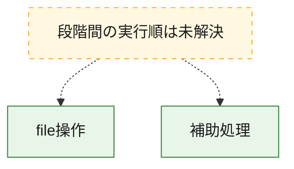
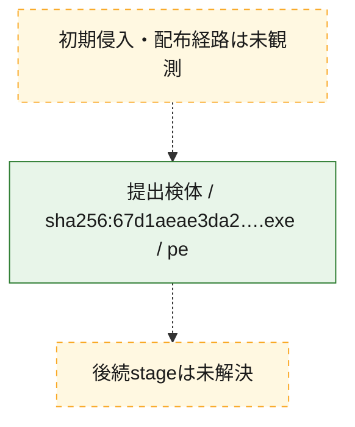
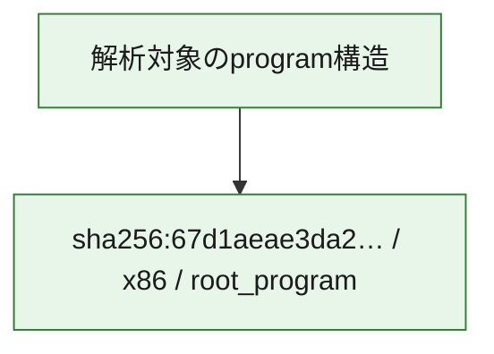

# 全体ロジック：67d1aeae3da2eea072c9f6bec6693a26c797ca372a2c6f2e58b804d9a063f7f8

代表関数の静的証跡から、file操作の処理群を確認しました。

## 読み方

- phaseの掲載順は解析上の整理順です。observed_call_edgesがない段階間の実行順を断定しません。
- 図の実線は静的に観測した関係、点線と黄色のノードは未観測・未解決の関係を示します。
- 図は静的な要約であり、動的実行を再現するものではありません。
- 詳細な関数解説とfingerprintは[STATIC-LOGIC.md](STATIC-LOGIC.md)を参照してください。

## 静的可視化

### 実行フロー

### 感染チェーン

### モジュール関係

## 処理段階

### 1. file操作

fileやdirectoryの作成、読書き、削除を確認します。
確度: `confirmed_static_function_evidence`

- `67d1aeae3da2eea072c9f6bec6693a26c797ca372a2c6f2e58b804d9a063f7f8:ghidra:140024060` — fileまたはdirectoryの読書き・管理に関係する関数です。 状態: `succeeded`、選定理由: `context_representative`, `reviewed_call_centrality:4`, `role:file_operation`
- `67d1aeae3da2eea072c9f6bec6693a26c797ca372a2c6f2e58b804d9a063f7f8:ghidra:140024110` — fileまたはdirectoryの読書き・管理に関係する関数です。 状態: `succeeded`、選定理由: `context_representative`, `reviewed_call_centrality:4`, `role:file_operation`

### 2. 補助処理

主要処理を支える一般内部関数またはlibrary処理を確認します。
確度: `confirmed_static_function_evidence`

- `67d1aeae3da2eea072c9f6bec6693a26c797ca372a2c6f2e58b804d9a063f7f8:ghidra:140001000` — 検体内部の一般処理を実装する関数です。 状態: `succeeded`、選定理由: `context_representative`, `reviewed_call_centrality:3`
- `67d1aeae3da2eea072c9f6bec6693a26c797ca372a2c6f2e58b804d9a063f7f8:ghidra:140001030` — 検体内部の一般処理を実装する関数です。 状態: `succeeded`、選定理由: `context_representative`, `reviewed_call_centrality:5`
- `67d1aeae3da2eea072c9f6bec6693a26c797ca372a2c6f2e58b804d9a063f7f8:ghidra:140001100` — 検体内部の一般処理を実装する関数です。 状態: `succeeded`、選定理由: `context_representative`, `reviewed_call_centrality:4`
- `67d1aeae3da2eea072c9f6bec6693a26c797ca372a2c6f2e58b804d9a063f7f8:ghidra:140001150` — 検体内部の一般処理を実装する関数です。 状態: `succeeded`、選定理由: `context_representative`, `reviewed_call_centrality:4`
- `67d1aeae3da2eea072c9f6bec6693a26c797ca372a2c6f2e58b804d9a063f7f8:ghidra:140001310` — 検体内部の一般処理を実装する関数です。 状態: `succeeded`、選定理由: `context_representative`, `reviewed_call_centrality:4`
- `67d1aeae3da2eea072c9f6bec6693a26c797ca372a2c6f2e58b804d9a063f7f8:ghidra:140001580` — 検体内部の一般処理を実装する関数です。 状態: `succeeded`、選定理由: `context_representative`, `reviewed_call_centrality:3`
- `67d1aeae3da2eea072c9f6bec6693a26c797ca372a2c6f2e58b804d9a063f7f8:ghidra:1400015b0` — 検体内部の一般処理を実装する関数です。 状態: `succeeded`、選定理由: `context_representative`, `reviewed_call_centrality:6`
- `67d1aeae3da2eea072c9f6bec6693a26c797ca372a2c6f2e58b804d9a063f7f8:ghidra:1400016b0` — 検体内部の一般処理を実装する関数です。 状態: `succeeded`、選定理由: `context_representative`, `reviewed_call_centrality:6`
- `67d1aeae3da2eea072c9f6bec6693a26c797ca372a2c6f2e58b804d9a063f7f8:ghidra:1400017b0` — 検体内部の一般処理を実装する関数です。 状態: `succeeded`、選定理由: `context_representative`, `reviewed_call_centrality:7`
- `67d1aeae3da2eea072c9f6bec6693a26c797ca372a2c6f2e58b804d9a063f7f8:ghidra:140002780` — 検体内部の一般処理を実装する関数です。 状態: `succeeded`、選定理由: `context_representative`, `reviewed_call_centrality:7`
- `67d1aeae3da2eea072c9f6bec6693a26c797ca372a2c6f2e58b804d9a063f7f8:ghidra:140002900` — 検体内部の一般処理を実装する関数です。 状態: `succeeded`、選定理由: `context_representative`, `reviewed_call_centrality:11`
- `67d1aeae3da2eea072c9f6bec6693a26c797ca372a2c6f2e58b804d9a063f7f8:ghidra:140004020` — 検体内部の一般処理を実装する関数です。 状態: `succeeded`、選定理由: `context_representative`, `reviewed_call_centrality:6`
- `67d1aeae3da2eea072c9f6bec6693a26c797ca372a2c6f2e58b804d9a063f7f8:ghidra:140023fc0` — 検体内部の一般処理を実装する関数です。 状態: `succeeded`、選定理由: `context_representative`, `reviewed_call_centrality:3`
- `67d1aeae3da2eea072c9f6bec6693a26c797ca372a2c6f2e58b804d9a063f7f8:ghidra:140023ff0` — 検体内部の一般処理を実装する関数です。 状態: `succeeded`、選定理由: `context_representative`, `reviewed_call_centrality:5`
- `67d1aeae3da2eea072c9f6bec6693a26c797ca372a2c6f2e58b804d9a063f7f8:ghidra:1400241d0` — 検体内部の一般処理を実装する関数です。 状態: `succeeded`、選定理由: `context_representative`, `reviewed_call_centrality:3`
- `67d1aeae3da2eea072c9f6bec6693a26c797ca372a2c6f2e58b804d9a063f7f8:ghidra:1400241f0` — 検体内部の一般処理を実装する関数です。 状態: `succeeded`、選定理由: `context_representative`, `reviewed_call_centrality:3`
- `67d1aeae3da2eea072c9f6bec6693a26c797ca372a2c6f2e58b804d9a063f7f8:ghidra:140024230` — 検体内部の一般処理を実装する関数です。 状態: `succeeded`、選定理由: `context_representative`, `reviewed_call_centrality:6`
- `67d1aeae3da2eea072c9f6bec6693a26c797ca372a2c6f2e58b804d9a063f7f8:ghidra:140024440` — 検体内部の一般処理を実装する関数です。 状態: `succeeded`、選定理由: `context_representative`, `reviewed_call_centrality:3`
- `67d1aeae3da2eea072c9f6bec6693a26c797ca372a2c6f2e58b804d9a063f7f8:ghidra:140024460` — 検体内部の一般処理を実装する関数です。 状態: `succeeded`、選定理由: `context_representative`, `reviewed_call_centrality:3`
- `67d1aeae3da2eea072c9f6bec6693a26c797ca372a2c6f2e58b804d9a063f7f8:ghidra:1400244a0` — 検体内部の一般処理を実装する関数です。 状態: `succeeded`、選定理由: `context_representative`, `reviewed_call_centrality:6`
- `67d1aeae3da2eea072c9f6bec6693a26c797ca372a2c6f2e58b804d9a063f7f8:ghidra:1400246a0` — 検体内部の一般処理を実装する関数です。 状態: `succeeded`、選定理由: `context_representative`, `reviewed_call_centrality:3`
- `67d1aeae3da2eea072c9f6bec6693a26c797ca372a2c6f2e58b804d9a063f7f8:ghidra:1400246d0` — 検体内部の一般処理を実装する関数です。 状態: `succeeded`、選定理由: `context_representative`, `reviewed_call_centrality:3`
- `67d1aeae3da2eea072c9f6bec6693a26c797ca372a2c6f2e58b804d9a063f7f8:ghidra:140024700` — 検体内部の一般処理を実装する関数です。 状態: `succeeded`、選定理由: `context_representative`, `reviewed_call_centrality:1`
- `67d1aeae3da2eea072c9f6bec6693a26c797ca372a2c6f2e58b804d9a063f7f8:ghidra:140024780` — 検体内部の一般処理を実装する関数です。 状態: `succeeded`、選定理由: `context_representative`, `reviewed_call_centrality:2`
- `67d1aeae3da2eea072c9f6bec6693a26c797ca372a2c6f2e58b804d9a063f7f8:ghidra:140024800` — 検体内部の一般処理を実装する関数です。 状態: `succeeded`、選定理由: `context_representative`, `reviewed_call_centrality:3`
- `67d1aeae3da2eea072c9f6bec6693a26c797ca372a2c6f2e58b804d9a063f7f8:ghidra:140024820` — 検体内部の一般処理を実装する関数です。 状態: `succeeded`、選定理由: `context_representative`, `reviewed_call_centrality:1`
- `67d1aeae3da2eea072c9f6bec6693a26c797ca372a2c6f2e58b804d9a063f7f8:ghidra:140024860` — 検体内部の一般処理を実装する関数です。 状態: `succeeded`、選定理由: `context_representative`, `reviewed_call_centrality:1`
- `67d1aeae3da2eea072c9f6bec6693a26c797ca372a2c6f2e58b804d9a063f7f8:ghidra:1400248a0` — 検体内部の一般処理を実装する関数です。 状態: `succeeded`、選定理由: `context_representative`, `reviewed_call_centrality:2`
- `67d1aeae3da2eea072c9f6bec6693a26c797ca372a2c6f2e58b804d9a063f7f8:ghidra:140024910` — 検体内部の一般処理を実装する関数です。 状態: `succeeded`、選定理由: `context_representative`, `reviewed_call_centrality:1`
- `67d1aeae3da2eea072c9f6bec6693a26c797ca372a2c6f2e58b804d9a063f7f8:ghidra:14003ecc0` — 検体内部の一般処理を実装する関数です。 状態: `succeeded`、選定理由: `meaningful_symbol_name`

## 観測したcall関係

- 代表関数間で直接解決できた呼出関係はありません。

## 解析範囲と制約

- 選定外関数は全体inventoryへ残しますが、関数本体の個別解説対象にはしていません。
- indirect call、難読化、packer、VM、壊れたcontrol flowによりcall関係が欠落する場合があります。
- 文書は静的解析に基づき、検体実行や外部通信による動的確認は行っていません。
