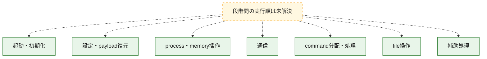
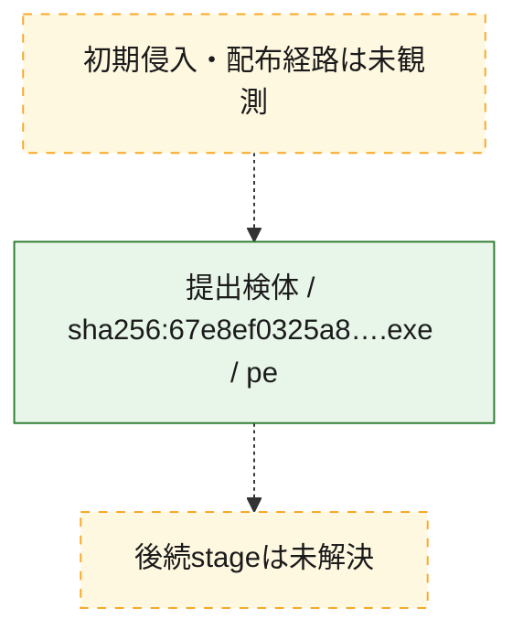
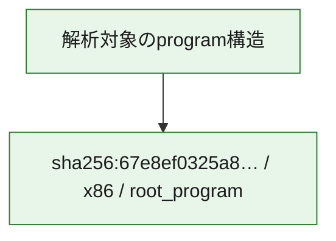

# 全体ロジック：67e8ef0325a8725e9884c0b19ac014f0c3ea497eee1f905187b8d77b25221689

代表関数の静的証跡から、起動・初期化、設定・payload復元、process・memory操作、通信、command分配・処理、file操作の処理群を確認しました。

## 読み方

- phaseの掲載順は解析上の整理順です。observed_call_edgesがない段階間の実行順を断定しません。
- 図の実線は静的に観測した関係、点線と黄色のノードは未観測・未解決の関係を示します。
- 図は静的な要約であり、動的実行を再現するものではありません。
- 詳細な関数解説とfingerprintは[STATIC-LOGIC.md](STATIC-LOGIC.md)を参照してください。

## 静的可視化

### 実行フロー

### 感染チェーン

### モジュール関係

## 処理段階

### 1. 起動・初期化

entry pointから初期化と後続処理への移行を確認します。
確度: `confirmed_static_function_evidence_with_limits`

- `67e8ef0325a8725e9884c0b19ac014f0c3ea497eee1f905187b8d77b25221689:ghidra:1400aa520` — 初期化と主要処理への分岐を行う入口関数です。 状態: `succeeded`、選定理由: `entry_point`, `meaningful_symbol_name`, `probable_go_main_user_code`, `reviewed_call_centrality:4`, `role:entrypoint`
- `67e8ef0325a8725e9884c0b19ac014f0c3ea497eee1f905187b8d77b25221689:ghidra:1400aa8a0` — 初期化と主要処理への分岐を行う入口関数です。 状態: `succeeded`、選定理由: `entry_point`, `meaningful_symbol_name`, `probable_go_main_user_code`, `reviewed_call_centrality:4`, `role:entrypoint`
- `67e8ef0325a8725e9884c0b19ac014f0c3ea497eee1f905187b8d77b25221689:ghidra:1400aa940` — 初期化と主要処理への分岐を行う入口関数です。 状態: `succeeded`、選定理由: `entry_point`, `meaningful_symbol_name`, `probable_go_main_user_code`, `reviewed_call_centrality:18`, `role:entrypoint`
- `67e8ef0325a8725e9884c0b19ac014f0c3ea497eee1f905187b8d77b25221689:ghidra:1400ac120` — 初期化と主要処理への分岐を行う入口関数です。 状態: `succeeded`、選定理由: `entry_point`, `meaningful_symbol_name`, `probable_go_main_user_code`, `reviewed_call_centrality:18`, `role:entrypoint`
- `67e8ef0325a8725e9884c0b19ac014f0c3ea497eee1f905187b8d77b25221689:ghidra:1400ad940` — 初期化と主要処理への分岐を行う入口関数です。 状態: `succeeded`、選定理由: `entry_point`, `meaningful_symbol_name`, `probable_go_main_user_code`, `reviewed_call_centrality:19`, `role:entrypoint`
- `67e8ef0325a8725e9884c0b19ac014f0c3ea497eee1f905187b8d77b25221689:ghidra:1400b6840` — 初期化と主要処理への分岐を行う入口関数です。 状態: `succeeded`、選定理由: `entry_point`, `meaningful_symbol_name`, `probable_go_main_user_code`, `reviewed_call_centrality:19`, `role:entrypoint`
- `67e8ef0325a8725e9884c0b19ac014f0c3ea497eee1f905187b8d77b25221689:ghidra:1400bc780` — 初期化と主要処理への分岐を行う入口関数です。 状態: `succeeded`、選定理由: `entry_point`, `meaningful_symbol_name`, `probable_go_main_user_code`, `reviewed_call_centrality:20`, `role:entrypoint`
- `67e8ef0325a8725e9884c0b19ac014f0c3ea497eee1f905187b8d77b25221689:ghidra:1400c14a0` — 初期化と主要処理への分岐を行う入口関数です。 状態: `succeeded`、選定理由: `entry_point`, `meaningful_symbol_name`, `probable_go_main_user_code`, `reviewed_call_centrality:20`, `role:entrypoint`
- `67e8ef0325a8725e9884c0b19ac014f0c3ea497eee1f905187b8d77b25221689:ghidra:1400c6180` — 初期化と主要処理への分岐を行う入口関数です。 状態: `succeeded`、選定理由: `entry_point`, `meaningful_symbol_name`, `probable_go_main_user_code`, `reviewed_call_centrality:18`, `role:entrypoint`
- `67e8ef0325a8725e9884c0b19ac014f0c3ea497eee1f905187b8d77b25221689:ghidra:1400cda60` — 初期化と主要処理への分岐を行う入口関数です。 状態: `succeeded`、選定理由: `entry_point`, `meaningful_symbol_name`, `probable_go_main_user_code`, `reviewed_call_centrality:28`, `role:entrypoint`
- `67e8ef0325a8725e9884c0b19ac014f0c3ea497eee1f905187b8d77b25221689:ghidra:1400d8740` — 初期化と主要処理への分岐を行う入口関数です。 状態: `succeeded`、選定理由: `entry_point`, `meaningful_symbol_name`, `probable_go_main_user_code`, `reviewed_call_centrality:23`, `role:entrypoint`
- `67e8ef0325a8725e9884c0b19ac014f0c3ea497eee1f905187b8d77b25221689:ghidra:1400dea40` — 初期化と主要処理への分岐を行う入口関数です。 状態: `succeeded`、選定理由: `entry_point`, `meaningful_symbol_name`, `probable_go_main_user_code`, `reviewed_call_centrality:18`, `role:entrypoint`
- `67e8ef0325a8725e9884c0b19ac014f0c3ea497eee1f905187b8d77b25221689:ghidra:1400e9660` — 初期化と主要処理への分岐を行う入口関数です。 状態: `succeeded`、選定理由: `entry_point`, `meaningful_symbol_name`, `probable_go_main_user_code`, `reviewed_call_centrality:18`, `role:entrypoint`
- `67e8ef0325a8725e9884c0b19ac014f0c3ea497eee1f905187b8d77b25221689:ghidra:1400fa100` — 初期化と主要処理への分岐を行う入口関数です。 状態: `succeeded`、選定理由: `entry_point`, `meaningful_symbol_name`, `probable_go_main_user_code`, `reviewed_call_centrality:23`, `role:entrypoint`
- `67e8ef0325a8725e9884c0b19ac014f0c3ea497eee1f905187b8d77b25221689:ghidra:140111440` — 初期化と主要処理への分岐を行う入口関数です。 状態: `succeeded`、選定理由: `entry_point`, `meaningful_symbol_name`, `probable_go_main_user_code`, `reviewed_call_centrality:19`, `role:entrypoint`
- `67e8ef0325a8725e9884c0b19ac014f0c3ea497eee1f905187b8d77b25221689:ghidra:14011ba20` — 初期化と主要処理への分岐を行う入口関数です。 状態: `succeeded`、選定理由: `entry_point`, `meaningful_symbol_name`, `probable_go_main_user_code`, `reviewed_call_centrality:20`, `role:entrypoint`
- `67e8ef0325a8725e9884c0b19ac014f0c3ea497eee1f905187b8d77b25221689:ghidra:140126240` — 初期化と主要処理への分岐を行う入口関数です。 状態: `succeeded`、選定理由: `entry_point`, `meaningful_symbol_name`, `probable_go_main_user_code`, `reviewed_call_centrality:21`, `role:entrypoint`
- `67e8ef0325a8725e9884c0b19ac014f0c3ea497eee1f905187b8d77b25221689:ghidra:140130be0` — 初期化と主要処理への分岐を行う入口関数です。 状態: `succeeded`、選定理由: `entry_point`, `meaningful_symbol_name`, `probable_go_main_user_code`, `reviewed_call_centrality:21`, `role:entrypoint`
- `67e8ef0325a8725e9884c0b19ac014f0c3ea497eee1f905187b8d77b25221689:ghidra:140138600` — 初期化と主要処理への分岐を行う入口関数です。 状態: `succeeded`、選定理由: `entry_point`, `meaningful_symbol_name`, `probable_go_main_user_code`, `reviewed_call_centrality:35`, `role:entrypoint`
- `67e8ef0325a8725e9884c0b19ac014f0c3ea497eee1f905187b8d77b25221689:ghidra:14015c6e0` — 初期化と主要処理への分岐を行う入口関数です。 状態: `succeeded`、選定理由: `entry_point`, `meaningful_symbol_name`, `probable_go_main_user_code`, `reviewed_call_centrality:20`, `role:entrypoint`
- `67e8ef0325a8725e9884c0b19ac014f0c3ea497eee1f905187b8d77b25221689:ghidra:1401626e0` — 初期化と主要処理への分岐を行う入口関数です。 状態: `succeeded`、選定理由: `entry_point`, `meaningful_symbol_name`, `probable_go_main_user_code`, `reviewed_call_centrality:22`, `role:entrypoint`
- `67e8ef0325a8725e9884c0b19ac014f0c3ea497eee1f905187b8d77b25221689:ghidra:140171e20` — 初期化と主要処理への分岐を行う入口関数です。 状態: `failed`、選定理由: `entry_point`, `meaningful_symbol_name`, `probable_go_main_user_code`, `role:entrypoint`
- `67e8ef0325a8725e9884c0b19ac014f0c3ea497eee1f905187b8d77b25221689:ghidra:1401d5960` — 初期化と主要処理への分岐を行う入口関数です。 状態: `succeeded`、選定理由: `entry_point`, `meaningful_symbol_name`, `probable_go_main_user_code`, `reviewed_call_centrality:3`, `role:entrypoint`
- `67e8ef0325a8725e9884c0b19ac014f0c3ea497eee1f905187b8d77b25221689:ghidra:1401d59a0` — 初期化と主要処理への分岐を行う入口関数です。 状態: `succeeded`、選定理由: `entry_point`, `meaningful_symbol_name`, `probable_go_main_user_code`, `reviewed_call_centrality:18`, `role:entrypoint`
- `67e8ef0325a8725e9884c0b19ac014f0c3ea497eee1f905187b8d77b25221689:ghidra:1401dd220` — 初期化と主要処理への分岐を行う入口関数です。 状態: `succeeded`、選定理由: `entry_point`, `meaningful_symbol_name`, `probable_go_main_user_code`, `reviewed_call_centrality:20`, `role:entrypoint`

### 2. 設定・payload復元

設定、resource、payload、暗号化データの復元・変換を確認します。
確度: `confirmed_static_function_evidence`

- `67e8ef0325a8725e9884c0b19ac014f0c3ea497eee1f905187b8d77b25221689:ghidra:1400851e0` — 設定、resource、payloadなどの解析・変換を行う関数です。 状態: `succeeded`、選定理由: `meaningful_symbol_name`, `reviewed_call_centrality:4`, `role:config_or_data_transform`

### 3. process・memory操作

process、thread、module、memory操作と実行移行を確認します。
確度: `confirmed_static_function_evidence`

- `67e8ef0325a8725e9884c0b19ac014f0c3ea497eee1f905187b8d77b25221689:ghidra:1400985c0` — process、thread、module、またはmemory操作に関係する関数です。 状態: `succeeded`、選定理由: `meaningful_symbol_name`, `reviewed_call_centrality:6`, `role:process_or_memory_operation`

### 4. 通信

通信初期化、endpoint処理、送受信の役割を確認します。
確度: `confirmed_static_function_evidence`

- `67e8ef0325a8725e9884c0b19ac014f0c3ea497eee1f905187b8d77b25221689:ghidra:140098ee0` — 通信初期化、送受信、またはendpoint処理に関係する関数です。 状態: `succeeded`、選定理由: `meaningful_symbol_name`, `reviewed_call_centrality:6`, `role:network_communication`

### 5. command分配・処理

受信commandやtaskの解釈、分配、個別handlerへの移行を確認します。
確度: `confirmed_static_function_evidence`

- `67e8ef0325a8725e9884c0b19ac014f0c3ea497eee1f905187b8d77b25221689:ghidra:1400980e0` — commandの解釈、分配、または個別処理を担当する関数です。 状態: `succeeded`、選定理由: `meaningful_symbol_name`, `reviewed_call_centrality:5`, `role:command_dispatch_or_handler`

### 6. file操作

fileやdirectoryの作成、読書き、削除を確認します。
確度: `confirmed_static_function_evidence`

- `67e8ef0325a8725e9884c0b19ac014f0c3ea497eee1f905187b8d77b25221689:ghidra:140098aa0` — fileまたはdirectoryの読書き・管理に関係する関数です。 状態: `succeeded`、選定理由: `meaningful_symbol_name`, `reviewed_call_centrality:6`, `role:file_operation`

### 7. 補助処理

主要処理を支える一般内部関数またはlibrary処理を確認します。
確度: `confirmed_static_function_evidence`

- `67e8ef0325a8725e9884c0b19ac014f0c3ea497eee1f905187b8d77b25221689:ghidra:140001080` — compiler生成処理または汎用library処理とみられる関数です。 状態: `succeeded`、選定理由: `meaningful_symbol_name`, `reviewed_call_centrality:5`
- `67e8ef0325a8725e9884c0b19ac014f0c3ea497eee1f905187b8d77b25221689:ghidra:1400746e0` — 検体内部の一般処理を実装する関数です。 状態: `succeeded`、選定理由: `meaningful_symbol_name`, `reviewed_call_centrality:3`

## 観測したcall関係

- `ghidra-function:0490db946b96822ec13a506c` → `ghidra-external:1f75acde03ad6854caa509c7` （`unclassified` → `unclassified`）
- `ghidra-function:0490db946b96822ec13a506c` → `ghidra-external:2168d0090baa038da046f36b` （`unclassified` → `unclassified`）
- `ghidra-function:0490db946b96822ec13a506c` → `ghidra-external:34fd7f279e439643dfae0c23` （`unclassified` → `unclassified`）
- `ghidra-function:0490db946b96822ec13a506c` → `ghidra-external:51fb93efa1f309e9ca899c0d` （`unclassified` → `unclassified`）
- `ghidra-function:0490db946b96822ec13a506c` → `ghidra-external:57074c309b4f992d30a98841` （`unclassified` → `unclassified`）
- `ghidra-function:0490db946b96822ec13a506c` → `ghidra-external:5c61c3093c1b081d1f1c0b17` （`unclassified` → `unclassified`）
- `ghidra-function:0490db946b96822ec13a506c` → `ghidra-external:6574ce12d614d378fe2822fb` （`unclassified` → `unclassified`）
- `ghidra-function:0490db946b96822ec13a506c` → `ghidra-external:66c8e918de8a15295273dabb` （`unclassified` → `unclassified`）
- `ghidra-function:0490db946b96822ec13a506c` → `ghidra-external:7378997913c55ccd8e3cef4f` （`unclassified` → `unclassified`）
- `ghidra-function:0490db946b96822ec13a506c` → `ghidra-external:764353883d881a3b9a648202` （`unclassified` → `unclassified`）
- `ghidra-function:0490db946b96822ec13a506c` → `ghidra-external:86f8f66938b4073507cdd6a4` （`unclassified` → `unclassified`）
- `ghidra-function:0490db946b96822ec13a506c` → `ghidra-external:89dc342b6c373a3d7bddcffd` （`unclassified` → `unclassified`）
- `ghidra-function:0490db946b96822ec13a506c` → `ghidra-external:96e3754642a739cc4b1bb6e4` （`unclassified` → `unclassified`）
- `ghidra-function:0490db946b96822ec13a506c` → `ghidra-external:9d80c088537ee543d91f932d` （`unclassified` → `unclassified`）
- `ghidra-function:0490db946b96822ec13a506c` → `ghidra-external:ac08796023d1952db4419c0f` （`unclassified` → `unclassified`）
- `ghidra-function:0490db946b96822ec13a506c` → `ghidra-external:c4125519332f87c6016647cc` （`unclassified` → `unclassified`）
- `ghidra-function:0490db946b96822ec13a506c` → `ghidra-external:c59206a9e9d00f2b01470b56` （`unclassified` → `unclassified`）
- `ghidra-function:0490db946b96822ec13a506c` → `ghidra-external:cfbbb63aaede78093051aa03` （`unclassified` → `unclassified`）
- `ghidra-function:0490db946b96822ec13a506c` → `ghidra-external:dfc8a150c0e61840c1c0c6f5` （`unclassified` → `unclassified`）
- `ghidra-function:0490db946b96822ec13a506c` → `ghidra-external:ead0b80e1febaacd4bffc3ed` （`unclassified` → `unclassified`）
- `ghidra-function:0490db946b96822ec13a506c` → `ghidra-external:f1840ce34a66cc9e3e370ad8` （`unclassified` → `unclassified`）
- `ghidra-function:0490db946b96822ec13a506c` → `ghidra-external:fd0f91a2d3b89170cace9a05` （`unclassified` → `unclassified`）
- `ghidra-function:0d97821c1f3c612f5ad00f9f` → `ghidra-external:067cee74e0cef20d84ba290e` （`unclassified` → `unclassified`）
- `ghidra-function:0d97821c1f3c612f5ad00f9f` → `ghidra-external:6c78c73ae07d193f132116f2` （`unclassified` → `unclassified`）
- `ghidra-function:0d97821c1f3c612f5ad00f9f` → `ghidra-external:91e6ad3f732577241a1ebefc` （`unclassified` → `unclassified`）
- `ghidra-function:0d97821c1f3c612f5ad00f9f` → `ghidra-external:cfbbb63aaede78093051aa03` （`unclassified` → `unclassified`）
- `ghidra-function:0d97821c1f3c612f5ad00f9f` → `ghidra-external:e04e5af444eb39d71a38aa83` （`unclassified` → `unclassified`）
- `ghidra-function:0d97821c1f3c612f5ad00f9f` → `ghidra-external:e63e9abf004be49c26703723` （`unclassified` → `unclassified`）
- `ghidra-function:1043d096e9ea9fc16838a2b6` → `ghidra-external:0fef5a914939202fac0370ef` （`unclassified` → `unclassified`）
- `ghidra-function:1043d096e9ea9fc16838a2b6` → `ghidra-external:1f75acde03ad6854caa509c7` （`unclassified` → `unclassified`）
- `ghidra-function:1043d096e9ea9fc16838a2b6` → `ghidra-external:2168d0090baa038da046f36b` （`unclassified` → `unclassified`）
- `ghidra-function:1043d096e9ea9fc16838a2b6` → `ghidra-external:34fd7f279e439643dfae0c23` （`unclassified` → `unclassified`）
- `ghidra-function:1043d096e9ea9fc16838a2b6` → `ghidra-external:51fb93efa1f309e9ca899c0d` （`unclassified` → `unclassified`）
- `ghidra-function:1043d096e9ea9fc16838a2b6` → `ghidra-external:5617e9ca2607b2f70a115614` （`unclassified` → `unclassified`）
- `ghidra-function:1043d096e9ea9fc16838a2b6` → `ghidra-external:57074c309b4f992d30a98841` （`unclassified` → `unclassified`）
- `ghidra-function:1043d096e9ea9fc16838a2b6` → `ghidra-external:5c61c3093c1b081d1f1c0b17` （`unclassified` → `unclassified`）
- `ghidra-function:1043d096e9ea9fc16838a2b6` → `ghidra-external:6574ce12d614d378fe2822fb` （`unclassified` → `unclassified`）
- `ghidra-function:1043d096e9ea9fc16838a2b6` → `ghidra-external:66c8e918de8a15295273dabb` （`unclassified` → `unclassified`）
- `ghidra-function:1043d096e9ea9fc16838a2b6` → `ghidra-external:764353883d881a3b9a648202` （`unclassified` → `unclassified`）
- `ghidra-function:1043d096e9ea9fc16838a2b6` → `ghidra-external:96e3754642a739cc4b1bb6e4` （`unclassified` → `unclassified`）
- `ghidra-function:1043d096e9ea9fc16838a2b6` → `ghidra-external:9d80c088537ee543d91f932d` （`unclassified` → `unclassified`）
- `ghidra-function:1043d096e9ea9fc16838a2b6` → `ghidra-external:aa5ef4db62352235f4c31bc5` （`unclassified` → `unclassified`）
- `ghidra-function:1043d096e9ea9fc16838a2b6` → `ghidra-external:ac08796023d1952db4419c0f` （`unclassified` → `unclassified`）
- `ghidra-function:1043d096e9ea9fc16838a2b6` → `ghidra-external:c59206a9e9d00f2b01470b56` （`unclassified` → `unclassified`）
- `ghidra-function:1043d096e9ea9fc16838a2b6` → `ghidra-external:cfbbb63aaede78093051aa03` （`unclassified` → `unclassified`）
- `ghidra-function:1043d096e9ea9fc16838a2b6` → `ghidra-external:dfc8a150c0e61840c1c0c6f5` （`unclassified` → `unclassified`）
- `ghidra-function:1043d096e9ea9fc16838a2b6` → `ghidra-external:ead0b80e1febaacd4bffc3ed` （`unclassified` → `unclassified`）
- `ghidra-function:1043d096e9ea9fc16838a2b6` → `ghidra-external:f1840ce34a66cc9e3e370ad8` （`unclassified` → `unclassified`）
- `ghidra-function:117c55388983cbdc8c87c36c` → `ghidra-external:1f75acde03ad6854caa509c7` （`unclassified` → `unclassified`）
- `ghidra-function:117c55388983cbdc8c87c36c` → `ghidra-external:2168d0090baa038da046f36b` （`unclassified` → `unclassified`）
- `ghidra-function:117c55388983cbdc8c87c36c` → `ghidra-external:34fd7f279e439643dfae0c23` （`unclassified` → `unclassified`）
- `ghidra-function:117c55388983cbdc8c87c36c` → `ghidra-external:51fb93efa1f309e9ca899c0d` （`unclassified` → `unclassified`）
- `ghidra-function:117c55388983cbdc8c87c36c` → `ghidra-external:57074c309b4f992d30a98841` （`unclassified` → `unclassified`）
- `ghidra-function:117c55388983cbdc8c87c36c` → `ghidra-external:5c61c3093c1b081d1f1c0b17` （`unclassified` → `unclassified`）
- `ghidra-function:117c55388983cbdc8c87c36c` → `ghidra-external:6574ce12d614d378fe2822fb` （`unclassified` → `unclassified`）
- `ghidra-function:117c55388983cbdc8c87c36c` → `ghidra-external:66c8e918de8a15295273dabb` （`unclassified` → `unclassified`）
- `ghidra-function:117c55388983cbdc8c87c36c` → `ghidra-external:764353883d881a3b9a648202` （`unclassified` → `unclassified`）
- `ghidra-function:117c55388983cbdc8c87c36c` → `ghidra-external:86547939d4f8a69136ed29f1` （`unclassified` → `unclassified`）
- `ghidra-function:117c55388983cbdc8c87c36c` → `ghidra-external:96e3754642a739cc4b1bb6e4` （`unclassified` → `unclassified`）
- `ghidra-function:117c55388983cbdc8c87c36c` → `ghidra-external:9d80c088537ee543d91f932d` （`unclassified` → `unclassified`）
- `ghidra-function:117c55388983cbdc8c87c36c` → `ghidra-external:aa5ef4db62352235f4c31bc5` （`unclassified` → `unclassified`）
- `ghidra-function:117c55388983cbdc8c87c36c` → `ghidra-external:ac08796023d1952db4419c0f` （`unclassified` → `unclassified`）
- `ghidra-function:117c55388983cbdc8c87c36c` → `ghidra-external:af51ba979152871aaf025232` （`unclassified` → `unclassified`）
- `ghidra-function:117c55388983cbdc8c87c36c` → `ghidra-external:c59206a9e9d00f2b01470b56` （`unclassified` → `unclassified`）
- `ghidra-function:117c55388983cbdc8c87c36c` → `ghidra-external:cfbbb63aaede78093051aa03` （`unclassified` → `unclassified`）
- `ghidra-function:117c55388983cbdc8c87c36c` → `ghidra-external:dfc8a150c0e61840c1c0c6f5` （`unclassified` → `unclassified`）
- `ghidra-function:117c55388983cbdc8c87c36c` → `ghidra-external:ead0b80e1febaacd4bffc3ed` （`unclassified` → `unclassified`）
- `ghidra-function:117c55388983cbdc8c87c36c` → `ghidra-external:f1840ce34a66cc9e3e370ad8` （`unclassified` → `unclassified`）
- `ghidra-function:18b2631bf35af9489e0b910a` → `ghidra-external:1f75acde03ad6854caa509c7` （`unclassified` → `unclassified`）
- `ghidra-function:18b2631bf35af9489e0b910a` → `ghidra-external:2168d0090baa038da046f36b` （`unclassified` → `unclassified`）
- `ghidra-function:18b2631bf35af9489e0b910a` → `ghidra-external:34fd7f279e439643dfae0c23` （`unclassified` → `unclassified`）
- `ghidra-function:18b2631bf35af9489e0b910a` → `ghidra-external:51fb93efa1f309e9ca899c0d` （`unclassified` → `unclassified`）
- `ghidra-function:18b2631bf35af9489e0b910a` → `ghidra-external:57074c309b4f992d30a98841` （`unclassified` → `unclassified`）
- `ghidra-function:18b2631bf35af9489e0b910a` → `ghidra-external:5c61c3093c1b081d1f1c0b17` （`unclassified` → `unclassified`）
- `ghidra-function:18b2631bf35af9489e0b910a` → `ghidra-external:6574ce12d614d378fe2822fb` （`unclassified` → `unclassified`）
- `ghidra-function:18b2631bf35af9489e0b910a` → `ghidra-external:66c8e918de8a15295273dabb` （`unclassified` → `unclassified`）
- `ghidra-function:18b2631bf35af9489e0b910a` → `ghidra-external:764353883d881a3b9a648202` （`unclassified` → `unclassified`）
- `ghidra-function:18b2631bf35af9489e0b910a` → `ghidra-external:96e3754642a739cc4b1bb6e4` （`unclassified` → `unclassified`）
- `ghidra-function:18b2631bf35af9489e0b910a` → `ghidra-external:9d80c088537ee543d91f932d` （`unclassified` → `unclassified`）
- `ghidra-function:18b2631bf35af9489e0b910a` → `ghidra-external:ac08796023d1952db4419c0f` （`unclassified` → `unclassified`）
- `ghidra-function:18b2631bf35af9489e0b910a` → `ghidra-external:b35af01ad26cdcca76ff87b2` （`unclassified` → `unclassified`）
- `ghidra-function:18b2631bf35af9489e0b910a` → `ghidra-external:bc90987612f23c18b84e7d63` （`unclassified` → `unclassified`）
- `ghidra-function:18b2631bf35af9489e0b910a` → `ghidra-external:c59206a9e9d00f2b01470b56` （`unclassified` → `unclassified`）
- `ghidra-function:18b2631bf35af9489e0b910a` → `ghidra-external:cfbbb63aaede78093051aa03` （`unclassified` → `unclassified`）
- `ghidra-function:18b2631bf35af9489e0b910a` → `ghidra-external:dfc8a150c0e61840c1c0c6f5` （`unclassified` → `unclassified`）
- `ghidra-function:18b2631bf35af9489e0b910a` → `ghidra-external:ead0b80e1febaacd4bffc3ed` （`unclassified` → `unclassified`）
- `ghidra-function:18b2631bf35af9489e0b910a` → `ghidra-external:ef425c59f0df55ba56c89bfc` （`unclassified` → `unclassified`）
- `ghidra-function:18b2631bf35af9489e0b910a` → `ghidra-external:f1840ce34a66cc9e3e370ad8` （`unclassified` → `unclassified`）
- `ghidra-function:1981debe73f3e0d4f0c527a4` → `ghidra-external:0fe8e2dbba18b90fbf9fa0f4` （`unclassified` → `unclassified`）
- `ghidra-function:1981debe73f3e0d4f0c527a4` → `ghidra-external:1f75acde03ad6854caa509c7` （`unclassified` → `unclassified`）
- `ghidra-function:1981debe73f3e0d4f0c527a4` → `ghidra-external:2168d0090baa038da046f36b` （`unclassified` → `unclassified`）
- `ghidra-function:1981debe73f3e0d4f0c527a4` → `ghidra-external:34fd7f279e439643dfae0c23` （`unclassified` → `unclassified`）
- `ghidra-function:1981debe73f3e0d4f0c527a4` → `ghidra-external:51fb93efa1f309e9ca899c0d` （`unclassified` → `unclassified`）
- `ghidra-function:1981debe73f3e0d4f0c527a4` → `ghidra-external:57074c309b4f992d30a98841` （`unclassified` → `unclassified`）
- `ghidra-function:1981debe73f3e0d4f0c527a4` → `ghidra-external:5c61c3093c1b081d1f1c0b17` （`unclassified` → `unclassified`）
- `ghidra-function:1981debe73f3e0d4f0c527a4` → `ghidra-external:6574ce12d614d378fe2822fb` （`unclassified` → `unclassified`）
- `ghidra-function:1981debe73f3e0d4f0c527a4` → `ghidra-external:66c8e918de8a15295273dabb` （`unclassified` → `unclassified`）
- `ghidra-function:1981debe73f3e0d4f0c527a4` → `ghidra-external:764353883d881a3b9a648202` （`unclassified` → `unclassified`）
- `ghidra-function:1981debe73f3e0d4f0c527a4` → `ghidra-external:96e3754642a739cc4b1bb6e4` （`unclassified` → `unclassified`）
- `ghidra-function:1981debe73f3e0d4f0c527a4` → `ghidra-external:9d80c088537ee543d91f932d` （`unclassified` → `unclassified`）
- `ghidra-function:1981debe73f3e0d4f0c527a4` → `ghidra-external:ac08796023d1952db4419c0f` （`unclassified` → `unclassified`）
- `ghidra-function:1981debe73f3e0d4f0c527a4` → `ghidra-external:c59206a9e9d00f2b01470b56` （`unclassified` → `unclassified`）
- `ghidra-function:1981debe73f3e0d4f0c527a4` → `ghidra-external:cfbbb63aaede78093051aa03` （`unclassified` → `unclassified`）
- `ghidra-function:1981debe73f3e0d4f0c527a4` → `ghidra-external:dfc8a150c0e61840c1c0c6f5` （`unclassified` → `unclassified`）
- `ghidra-function:1981debe73f3e0d4f0c527a4` → `ghidra-external:ead0b80e1febaacd4bffc3ed` （`unclassified` → `unclassified`）
- `ghidra-function:1981debe73f3e0d4f0c527a4` → `ghidra-external:f1840ce34a66cc9e3e370ad8` （`unclassified` → `unclassified`）
- `ghidra-function:1a011ee275ca0f8b5045e16a` → `ghidra-external:067cee74e0cef20d84ba290e` （`unclassified` → `unclassified`）
- `ghidra-function:1a011ee275ca0f8b5045e16a` → `ghidra-external:6c78c73ae07d193f132116f2` （`unclassified` → `unclassified`）
- `ghidra-function:1a011ee275ca0f8b5045e16a` → `ghidra-external:91e6ad3f732577241a1ebefc` （`unclassified` → `unclassified`）
- `ghidra-function:1a011ee275ca0f8b5045e16a` → `ghidra-external:cfbbb63aaede78093051aa03` （`unclassified` → `unclassified`）
- `ghidra-function:1a011ee275ca0f8b5045e16a` → `ghidra-external:df55af92e2dab9ec2013f147` （`unclassified` → `unclassified`）
- `ghidra-function:1a011ee275ca0f8b5045e16a` → `ghidra-external:e63e9abf004be49c26703723` （`unclassified` → `unclassified`）
- `ghidra-function:2cd07d4e3582cd6a05f33819` → `ghidra-external:00a8c375ecc34d190dd3c6f2` （`unclassified` → `unclassified`）
- `ghidra-function:2cd07d4e3582cd6a05f33819` → `ghidra-external:136aa40185a29d8306e68c76` （`unclassified` → `unclassified`）
- `ghidra-function:2cd07d4e3582cd6a05f33819` → `ghidra-external:1f75acde03ad6854caa509c7` （`unclassified` → `unclassified`）
- `ghidra-function:2cd07d4e3582cd6a05f33819` → `ghidra-external:2168d0090baa038da046f36b` （`unclassified` → `unclassified`）
- `ghidra-function:2cd07d4e3582cd6a05f33819` → `ghidra-external:25ad136ade53ab00ade29c3d` （`unclassified` → `unclassified`）
- `ghidra-function:2cd07d4e3582cd6a05f33819` → `ghidra-external:346cde85b4331b7ad923de02` （`unclassified` → `unclassified`）
- `ghidra-function:2cd07d4e3582cd6a05f33819` → `ghidra-external:34fd7f279e439643dfae0c23` （`unclassified` → `unclassified`）
- `ghidra-function:2cd07d4e3582cd6a05f33819` → `ghidra-external:44775c2d4887772317b6f677` （`unclassified` → `unclassified`）
- `ghidra-function:2cd07d4e3582cd6a05f33819` → `ghidra-external:51fb93efa1f309e9ca899c0d` （`unclassified` → `unclassified`）
- `ghidra-function:2cd07d4e3582cd6a05f33819` → `ghidra-external:57074c309b4f992d30a98841` （`unclassified` → `unclassified`）
- `ghidra-function:2cd07d4e3582cd6a05f33819` → `ghidra-external:5c61c3093c1b081d1f1c0b17` （`unclassified` → `unclassified`）
- `ghidra-function:2cd07d4e3582cd6a05f33819` → `ghidra-external:6574ce12d614d378fe2822fb` （`unclassified` → `unclassified`）
- `ghidra-function:2cd07d4e3582cd6a05f33819` → `ghidra-external:66c8e918de8a15295273dabb` （`unclassified` → `unclassified`）
- `ghidra-function:2cd07d4e3582cd6a05f33819` → `ghidra-external:69d4811e1c08fe83593e1759` （`unclassified` → `unclassified`）
- `ghidra-function:2cd07d4e3582cd6a05f33819` → `ghidra-external:764353883d881a3b9a648202` （`unclassified` → `unclassified`）
- `ghidra-function:2cd07d4e3582cd6a05f33819` → `ghidra-external:7a2d03a0ed8fe6ae62e8c1c2` （`unclassified` → `unclassified`）
- `ghidra-function:2cd07d4e3582cd6a05f33819` → `ghidra-external:96e3754642a739cc4b1bb6e4` （`unclassified` → `unclassified`）
- `ghidra-function:2cd07d4e3582cd6a05f33819` → `ghidra-external:9d80c088537ee543d91f932d` （`unclassified` → `unclassified`）
- `ghidra-function:2cd07d4e3582cd6a05f33819` → `ghidra-external:ac08796023d1952db4419c0f` （`unclassified` → `unclassified`）
- `ghidra-function:2cd07d4e3582cd6a05f33819` → `ghidra-external:be6c1f3a9eb134ba64bdc1c9` （`unclassified` → `unclassified`）
- `ghidra-function:2cd07d4e3582cd6a05f33819` → `ghidra-external:c0aa55298cbf8e1318313602` （`unclassified` → `unclassified`）
- `ghidra-function:2cd07d4e3582cd6a05f33819` → `ghidra-external:c59206a9e9d00f2b01470b56` （`unclassified` → `unclassified`）
- `ghidra-function:2cd07d4e3582cd6a05f33819` → `ghidra-external:cfbbb63aaede78093051aa03` （`unclassified` → `unclassified`）
- `ghidra-function:2cd07d4e3582cd6a05f33819` → `ghidra-external:dfc8a150c0e61840c1c0c6f5` （`unclassified` → `unclassified`）
- `ghidra-function:2cd07d4e3582cd6a05f33819` → `ghidra-external:ead0b80e1febaacd4bffc3ed` （`unclassified` → `unclassified`）
- `ghidra-function:2cd07d4e3582cd6a05f33819` → `ghidra-external:ef425c59f0df55ba56c89bfc` （`unclassified` → `unclassified`）
- `ghidra-function:2cd07d4e3582cd6a05f33819` → `ghidra-external:f1840ce34a66cc9e3e370ad8` （`unclassified` → `unclassified`）
- `ghidra-function:2cd07d4e3582cd6a05f33819` → `ghidra-external:f9b729441055a4cc9f77e6d9` （`unclassified` → `unclassified`）
- `ghidra-function:2d7394745780b3bc779ae23f` → `ghidra-external:1f75acde03ad6854caa509c7` （`unclassified` → `unclassified`）
- `ghidra-function:2d7394745780b3bc779ae23f` → `ghidra-external:2168d0090baa038da046f36b` （`unclassified` → `unclassified`）
- `ghidra-function:2d7394745780b3bc779ae23f` → `ghidra-external:34fd7f279e439643dfae0c23` （`unclassified` → `unclassified`）
- `ghidra-function:2d7394745780b3bc779ae23f` → `ghidra-external:51fb93efa1f309e9ca899c0d` （`unclassified` → `unclassified`）
- `ghidra-function:2d7394745780b3bc779ae23f` → `ghidra-external:57074c309b4f992d30a98841` （`unclassified` → `unclassified`）
- `ghidra-function:2d7394745780b3bc779ae23f` → `ghidra-external:5c61c3093c1b081d1f1c0b17` （`unclassified` → `unclassified`）
- `ghidra-function:2d7394745780b3bc779ae23f` → `ghidra-external:6574ce12d614d378fe2822fb` （`unclassified` → `unclassified`）
- `ghidra-function:2d7394745780b3bc779ae23f` → `ghidra-external:66c8e918de8a15295273dabb` （`unclassified` → `unclassified`）
- `ghidra-function:2d7394745780b3bc779ae23f` → `ghidra-external:70f8fc524862e4da6051569d` （`unclassified` → `unclassified`）
- `ghidra-function:2d7394745780b3bc779ae23f` → `ghidra-external:764353883d881a3b9a648202` （`unclassified` → `unclassified`）
- `ghidra-function:2d7394745780b3bc779ae23f` → `ghidra-external:96e3754642a739cc4b1bb6e4` （`unclassified` → `unclassified`）
- `ghidra-function:2d7394745780b3bc779ae23f` → `ghidra-external:9d80c088537ee543d91f932d` （`unclassified` → `unclassified`）
- `ghidra-function:2d7394745780b3bc779ae23f` → `ghidra-external:ac08796023d1952db4419c0f` （`unclassified` → `unclassified`）
- `ghidra-function:2d7394745780b3bc779ae23f` → `ghidra-external:af51ba979152871aaf025232` （`unclassified` → `unclassified`）
- `ghidra-function:2d7394745780b3bc779ae23f` → `ghidra-external:c59206a9e9d00f2b01470b56` （`unclassified` → `unclassified`）
- `ghidra-function:2d7394745780b3bc779ae23f` → `ghidra-external:cfbbb63aaede78093051aa03` （`unclassified` → `unclassified`）
- `ghidra-function:2d7394745780b3bc779ae23f` → `ghidra-external:dfc8a150c0e61840c1c0c6f5` （`unclassified` → `unclassified`）
- `ghidra-function:2d7394745780b3bc779ae23f` → `ghidra-external:ead0b80e1febaacd4bffc3ed` （`unclassified` → `unclassified`）
- `ghidra-function:2d7394745780b3bc779ae23f` → `ghidra-external:f1840ce34a66cc9e3e370ad8` （`unclassified` → `unclassified`）
- `ghidra-function:2f43a02ed2dd7308154828d7` → `ghidra-external:0fe8e2dbba18b90fbf9fa0f4` （`unclassified` → `unclassified`）
- `ghidra-function:2f43a02ed2dd7308154828d7` → `ghidra-external:1f75acde03ad6854caa509c7` （`unclassified` → `unclassified`）
- `ghidra-function:2f43a02ed2dd7308154828d7` → `ghidra-external:2168d0090baa038da046f36b` （`unclassified` → `unclassified`）
- `ghidra-function:2f43a02ed2dd7308154828d7` → `ghidra-external:346cde85b4331b7ad923de02` （`unclassified` → `unclassified`）
- `ghidra-function:2f43a02ed2dd7308154828d7` → `ghidra-external:34fd7f279e439643dfae0c23` （`unclassified` → `unclassified`）
- `ghidra-function:2f43a02ed2dd7308154828d7` → `ghidra-external:3d98fefa345ad0b9652bc6ab` （`unclassified` → `unclassified`）
- `ghidra-function:2f43a02ed2dd7308154828d7` → `ghidra-external:44775c2d4887772317b6f677` （`unclassified` → `unclassified`）
- `ghidra-function:2f43a02ed2dd7308154828d7` → `ghidra-external:4a431aa101f8c6f3feabe44b` （`unclassified` → `unclassified`）
- `ghidra-function:2f43a02ed2dd7308154828d7` → `ghidra-external:4a9b3109e80261288fd726b3` （`unclassified` → `unclassified`）
- `ghidra-function:2f43a02ed2dd7308154828d7` → `ghidra-external:51fb93efa1f309e9ca899c0d` （`unclassified` → `unclassified`）
- `ghidra-function:2f43a02ed2dd7308154828d7` → `ghidra-external:57074c309b4f992d30a98841` （`unclassified` → `unclassified`）
- `ghidra-function:2f43a02ed2dd7308154828d7` → `ghidra-external:5c61c3093c1b081d1f1c0b17` （`unclassified` → `unclassified`）
- `ghidra-function:2f43a02ed2dd7308154828d7` → `ghidra-external:6574ce12d614d378fe2822fb` （`unclassified` → `unclassified`）
- `ghidra-function:2f43a02ed2dd7308154828d7` → `ghidra-external:66c8e918de8a15295273dabb` （`unclassified` → `unclassified`）
- `ghidra-function:2f43a02ed2dd7308154828d7` → `ghidra-external:7378997913c55ccd8e3cef4f` （`unclassified` → `unclassified`）
- `ghidra-function:2f43a02ed2dd7308154828d7` → `ghidra-external:764353883d881a3b9a648202` （`unclassified` → `unclassified`）
- `ghidra-function:2f43a02ed2dd7308154828d7` → `ghidra-external:7a2d03a0ed8fe6ae62e8c1c2` （`unclassified` → `unclassified`）
- `ghidra-function:2f43a02ed2dd7308154828d7` → `ghidra-external:7ce6cd1a17bd9a4b05cfeba6` （`unclassified` → `unclassified`）
- `ghidra-function:2f43a02ed2dd7308154828d7` → `ghidra-external:81ca7523b3a61ba340e19804` （`unclassified` → `unclassified`）
- `ghidra-function:2f43a02ed2dd7308154828d7` → `ghidra-external:8f0d2f7a6047658b937f265e` （`unclassified` → `unclassified`）
- `ghidra-function:2f43a02ed2dd7308154828d7` → `ghidra-external:96e3754642a739cc4b1bb6e4` （`unclassified` → `unclassified`）
- `ghidra-function:2f43a02ed2dd7308154828d7` → `ghidra-external:995de94e8578313b29605ce3` （`unclassified` → `unclassified`）
- `ghidra-function:2f43a02ed2dd7308154828d7` → `ghidra-external:9d80c088537ee543d91f932d` （`unclassified` → `unclassified`）
- `ghidra-function:2f43a02ed2dd7308154828d7` → `ghidra-external:a38ede04d91b4844228c2a61` （`unclassified` → `unclassified`）
- `ghidra-function:2f43a02ed2dd7308154828d7` → `ghidra-external:ac08796023d1952db4419c0f` （`unclassified` → `unclassified`）
- `ghidra-function:2f43a02ed2dd7308154828d7` → `ghidra-external:b12290ab7501adae43a822a4` （`unclassified` → `unclassified`）
- `ghidra-function:2f43a02ed2dd7308154828d7` → `ghidra-external:b4b1db20ae4ae038d9e1f528` （`unclassified` → `unclassified`）
- `ghidra-function:2f43a02ed2dd7308154828d7` → `ghidra-external:c59206a9e9d00f2b01470b56` （`unclassified` → `unclassified`）
- `ghidra-function:2f43a02ed2dd7308154828d7` → `ghidra-external:cfbbb63aaede78093051aa03` （`unclassified` → `unclassified`）
- `ghidra-function:2f43a02ed2dd7308154828d7` → `ghidra-external:d4009650568821a8439a90e3` （`unclassified` → `unclassified`）
- `ghidra-function:2f43a02ed2dd7308154828d7` → `ghidra-external:dfc8a150c0e61840c1c0c6f5` （`unclassified` → `unclassified`）
- `ghidra-function:2f43a02ed2dd7308154828d7` → `ghidra-external:ead0b80e1febaacd4bffc3ed` （`unclassified` → `unclassified`）
- `ghidra-function:2f43a02ed2dd7308154828d7` → `ghidra-external:f1840ce34a66cc9e3e370ad8` （`unclassified` → `unclassified`）
- `ghidra-function:2f43a02ed2dd7308154828d7` → `ghidra-external:f48ece1b4d5139218762a27d` （`unclassified` → `unclassified`）
- `ghidra-function:2f43a02ed2dd7308154828d7` → `ghidra-external:f9ed11966bb696f6f33dbdc2` （`unclassified` → `unclassified`）
- `ghidra-function:348047925b0c8bee17902c38` → `ghidra-external:0fe8e2dbba18b90fbf9fa0f4` （`unclassified` → `unclassified`）
- `ghidra-function:348047925b0c8bee17902c38` → `ghidra-external:1f75acde03ad6854caa509c7` （`unclassified` → `unclassified`）
- `ghidra-function:348047925b0c8bee17902c38` → `ghidra-external:2168d0090baa038da046f36b` （`unclassified` → `unclassified`）
- `ghidra-function:348047925b0c8bee17902c38` → `ghidra-external:34fd7f279e439643dfae0c23` （`unclassified` → `unclassified`）
- `ghidra-function:348047925b0c8bee17902c38` → `ghidra-external:44775c2d4887772317b6f677` （`unclassified` → `unclassified`）
- `ghidra-function:348047925b0c8bee17902c38` → `ghidra-external:4a9b3109e80261288fd726b3` （`unclassified` → `unclassified`）
- 残り284件は`static-logic.json`に記録しています。

## 解析範囲と制約

- 選定外関数は全体inventoryへ残しますが、関数本体の個別解説対象にはしていません。
- indirect call、難読化、packer、VM、壊れたcontrol flowによりcall関係が欠落する場合があります。
- 文書は静的解析に基づき、検体実行や外部通信による動的確認は行っていません。
