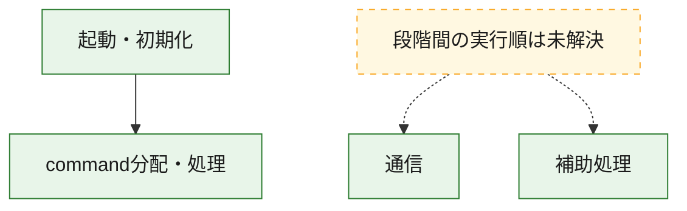
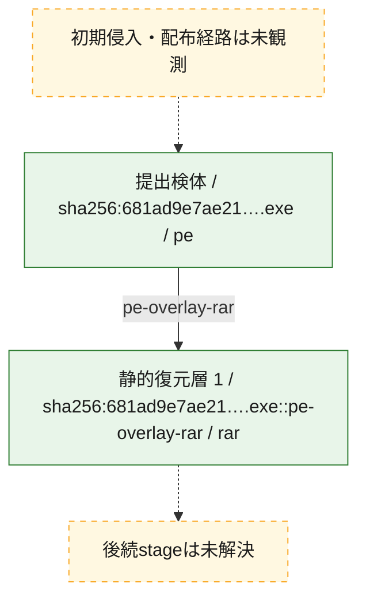
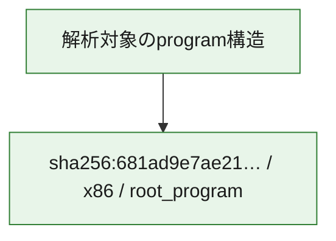

# 全体ロジック：681ad9e7ae2170f726fd99138a5b983ed3f7b31ab957308052afd3657a4782e4

代表関数の静的証跡から、起動・初期化、通信、command分配・処理の処理群を確認しました。

## 読み方

- phaseの掲載順は解析上の整理順です。observed_call_edgesがない段階間の実行順を断定しません。
- 図の実線は静的に観測した関係、点線と黄色のノードは未観測・未解決の関係を示します。
- 図は静的な要約であり、動的実行を再現するものではありません。
- 詳細な関数解説とfingerprintは[STATIC-LOGIC.md](STATIC-LOGIC.md)を参照してください。

## 静的可視化

### 実行フロー

### 感染チェーン

### モジュール関係

## 処理段階

### 1. 起動・初期化

entry pointから初期化と後続処理への移行を確認します。
確度: `confirmed_static_function_evidence`

- `681ad9e7ae2170f726fd99138a5b983ed3f7b31ab957308052afd3657a4782e4:ghidra:140033c00` — 初期化と主要処理への分岐を行う入口関数です。 状態: `succeeded`、選定理由: `entry_point`, `meaningful_symbol_name`, `reviewed_call_centrality:22`, `role:entrypoint`

### 2. 通信

通信初期化、endpoint処理、送受信の役割を確認します。
確度: `confirmed_static_function_evidence_with_limits`

- `681ad9e7ae2170f726fd99138a5b983ed3f7b31ab957308052afd3657a4782e4:ghidra:140030bdd` — 通信初期化、送受信、またはendpoint処理に関係する関数です。 状態: `limited_bad_instruction_or_flow`、選定理由: `meaningful_symbol_name`, `reviewed_call_centrality:1`, `role:network_communication`
- `681ad9e7ae2170f726fd99138a5b983ed3f7b31ab957308052afd3657a4782e4:ghidra:140030e1d` — 通信初期化、送受信、またはendpoint処理に関係する関数です。 状態: `limited_bad_instruction_or_flow`、選定理由: `meaningful_symbol_name`, `reviewed_call_centrality:1`, `role:network_communication`

### 3. command分配・処理

受信commandやtaskの解釈、分配、個別handlerへの移行を確認します。
確度: `confirmed_static_function_evidence_with_limits`

- `681ad9e7ae2170f726fd99138a5b983ed3f7b31ab957308052afd3657a4782e4:ghidra:140030dbd` — commandの解釈、分配、または個別処理を担当する関数です。 状態: `limited_bad_instruction_or_flow`、選定理由: `meaningful_symbol_name`, `reviewed_call_centrality:1`, `role:command_dispatch_or_handler`
- `681ad9e7ae2170f726fd99138a5b983ed3f7b31ab957308052afd3657a4782e4:ghidra:1400311ed` — commandの解釈、分配、または個別処理を担当する関数です。 状態: `limited_bad_instruction_or_flow`、選定理由: `meaningful_symbol_name`, `reviewed_call_centrality:1`, `role:command_dispatch_or_handler`
- `681ad9e7ae2170f726fd99138a5b983ed3f7b31ab957308052afd3657a4782e4:ghidra:14004af00` — commandの解釈、分配、または個別処理を担当する関数です。 状態: `limited_bad_instruction_or_flow`、選定理由: `meaningful_symbol_name`, `reviewed_call_centrality:1`, `role:command_dispatch_or_handler`

### 4. 補助処理

主要処理を支える一般内部関数またはlibrary処理を確認します。
確度: `confirmed_static_function_evidence_with_limits`

- `681ad9e7ae2170f726fd99138a5b983ed3f7b31ab957308052afd3657a4782e4:ghidra:140030be9` — 検体内部の一般処理を実装する関数です。 状態: `limited_bad_instruction_or_flow`、選定理由: `meaningful_symbol_name`, `reviewed_call_centrality:1`
- `681ad9e7ae2170f726fd99138a5b983ed3f7b31ab957308052afd3657a4782e4:ghidra:140030bf5` — 検体内部の一般処理を実装する関数です。 状態: `limited_bad_instruction_or_flow`、選定理由: `meaningful_symbol_name`, `reviewed_call_centrality:1`
- `681ad9e7ae2170f726fd99138a5b983ed3f7b31ab957308052afd3657a4782e4:ghidra:140030c01` — 検体内部の一般処理を実装する関数です。 状態: `limited_bad_instruction_or_flow`、選定理由: `meaningful_symbol_name`, `reviewed_call_centrality:1`
- `681ad9e7ae2170f726fd99138a5b983ed3f7b31ab957308052afd3657a4782e4:ghidra:140030c0d` — 検体内部の一般処理を実装する関数です。 状態: `limited_bad_instruction_or_flow`、選定理由: `meaningful_symbol_name`, `reviewed_call_centrality:1`
- `681ad9e7ae2170f726fd99138a5b983ed3f7b31ab957308052afd3657a4782e4:ghidra:140030c19` — 検体内部の一般処理を実装する関数です。 状態: `limited_bad_instruction_or_flow`、選定理由: `meaningful_symbol_name`, `reviewed_call_centrality:1`
- `681ad9e7ae2170f726fd99138a5b983ed3f7b31ab957308052afd3657a4782e4:ghidra:140030c25` — 検体内部の一般処理を実装する関数です。 状態: `limited_bad_instruction_or_flow`、選定理由: `meaningful_symbol_name`, `reviewed_call_centrality:1`
- `681ad9e7ae2170f726fd99138a5b983ed3f7b31ab957308052afd3657a4782e4:ghidra:140030c31` — 検体内部の一般処理を実装する関数です。 状態: `limited_bad_instruction_or_flow`、選定理由: `meaningful_symbol_name`, `reviewed_call_centrality:1`
- `681ad9e7ae2170f726fd99138a5b983ed3f7b31ab957308052afd3657a4782e4:ghidra:140030c3d` — 検体内部の一般処理を実装する関数です。 状態: `limited_bad_instruction_or_flow`、選定理由: `meaningful_symbol_name`, `reviewed_call_centrality:1`
- `681ad9e7ae2170f726fd99138a5b983ed3f7b31ab957308052afd3657a4782e4:ghidra:140030c49` — 検体内部の一般処理を実装する関数です。 状態: `limited_bad_instruction_or_flow`、選定理由: `meaningful_symbol_name`, `reviewed_call_centrality:1`
- `681ad9e7ae2170f726fd99138a5b983ed3f7b31ab957308052afd3657a4782e4:ghidra:140030c55` — 検体内部の一般処理を実装する関数です。 状態: `limited_bad_instruction_or_flow`、選定理由: `meaningful_symbol_name`, `reviewed_call_centrality:1`
- `681ad9e7ae2170f726fd99138a5b983ed3f7b31ab957308052afd3657a4782e4:ghidra:140030c61` — 検体内部の一般処理を実装する関数です。 状態: `limited_bad_instruction_or_flow`、選定理由: `meaningful_symbol_name`, `reviewed_call_centrality:1`
- `681ad9e7ae2170f726fd99138a5b983ed3f7b31ab957308052afd3657a4782e4:ghidra:140030c6d` — 検体内部の一般処理を実装する関数です。 状態: `limited_bad_instruction_or_flow`、選定理由: `meaningful_symbol_name`, `reviewed_call_centrality:1`
- `681ad9e7ae2170f726fd99138a5b983ed3f7b31ab957308052afd3657a4782e4:ghidra:140030c79` — 検体内部の一般処理を実装する関数です。 状態: `limited_bad_instruction_or_flow`、選定理由: `meaningful_symbol_name`, `reviewed_call_centrality:1`
- `681ad9e7ae2170f726fd99138a5b983ed3f7b31ab957308052afd3657a4782e4:ghidra:140030c85` — 検体内部の一般処理を実装する関数です。 状態: `limited_bad_instruction_or_flow`、選定理由: `meaningful_symbol_name`, `reviewed_call_centrality:1`
- `681ad9e7ae2170f726fd99138a5b983ed3f7b31ab957308052afd3657a4782e4:ghidra:140030c91` — 検体内部の一般処理を実装する関数です。 状態: `limited_bad_instruction_or_flow`、選定理由: `meaningful_symbol_name`, `reviewed_call_centrality:1`
- `681ad9e7ae2170f726fd99138a5b983ed3f7b31ab957308052afd3657a4782e4:ghidra:140030c9d` — 検体内部の一般処理を実装する関数です。 状態: `limited_bad_instruction_or_flow`、選定理由: `meaningful_symbol_name`, `reviewed_call_centrality:1`
- `681ad9e7ae2170f726fd99138a5b983ed3f7b31ab957308052afd3657a4782e4:ghidra:140030ca9` — 検体内部の一般処理を実装する関数です。 状態: `limited_bad_instruction_or_flow`、選定理由: `meaningful_symbol_name`, `reviewed_call_centrality:1`
- `681ad9e7ae2170f726fd99138a5b983ed3f7b31ab957308052afd3657a4782e4:ghidra:140030cb5` — 検体内部の一般処理を実装する関数です。 状態: `limited_bad_instruction_or_flow`、選定理由: `meaningful_symbol_name`, `reviewed_call_centrality:1`
- `681ad9e7ae2170f726fd99138a5b983ed3f7b31ab957308052afd3657a4782e4:ghidra:140030cc1` — 検体内部の一般処理を実装する関数です。 状態: `limited_bad_instruction_or_flow`、選定理由: `meaningful_symbol_name`, `reviewed_call_centrality:1`
- `681ad9e7ae2170f726fd99138a5b983ed3f7b31ab957308052afd3657a4782e4:ghidra:140030ccd` — 検体内部の一般処理を実装する関数です。 状態: `limited_bad_instruction_or_flow`、選定理由: `meaningful_symbol_name`, `reviewed_call_centrality:1`
- `681ad9e7ae2170f726fd99138a5b983ed3f7b31ab957308052afd3657a4782e4:ghidra:140030cd9` — 検体内部の一般処理を実装する関数です。 状態: `limited_bad_instruction_or_flow`、選定理由: `meaningful_symbol_name`, `reviewed_call_centrality:1`
- `681ad9e7ae2170f726fd99138a5b983ed3f7b31ab957308052afd3657a4782e4:ghidra:140030ce5` — 検体内部の一般処理を実装する関数です。 状態: `limited_bad_instruction_or_flow`、選定理由: `meaningful_symbol_name`, `reviewed_call_centrality:1`
- `681ad9e7ae2170f726fd99138a5b983ed3f7b31ab957308052afd3657a4782e4:ghidra:140030cf1` — 検体内部の一般処理を実装する関数です。 状態: `limited_bad_instruction_or_flow`、選定理由: `meaningful_symbol_name`, `reviewed_call_centrality:1`
- `681ad9e7ae2170f726fd99138a5b983ed3f7b31ab957308052afd3657a4782e4:ghidra:140030cfd` — 検体内部の一般処理を実装する関数です。 状態: `limited_bad_instruction_or_flow`、選定理由: `meaningful_symbol_name`, `reviewed_call_centrality:1`
- `681ad9e7ae2170f726fd99138a5b983ed3f7b31ab957308052afd3657a4782e4:ghidra:140030d09` — 検体内部の一般処理を実装する関数です。 状態: `limited_bad_instruction_or_flow`、選定理由: `meaningful_symbol_name`, `reviewed_call_centrality:1`
- `681ad9e7ae2170f726fd99138a5b983ed3f7b31ab957308052afd3657a4782e4:ghidra:140030d15` — 検体内部の一般処理を実装する関数です。 状態: `limited_bad_instruction_or_flow`、選定理由: `meaningful_symbol_name`, `reviewed_call_centrality:1`

## 観測したcall関係

- `681ad9e7ae2170f726fd99138a5b983ed3f7b31ab957308052afd3657a4782e4:ghidra:140033c00` → `681ad9e7ae2170f726fd99138a5b983ed3f7b31ab957308052afd3657a4782e4:ghidra:14004af00` （`startup` → `dispatch`）
- `ghidra-function:0996dbb41693cf5d4ea7d61a` → `ghidra-function:799b611bde97b03217a13d09` （`unclassified` → `unclassified`）
- `ghidra-function:102121eb77f7e9a4fe740514` → `ghidra-function:799b611bde97b03217a13d09` （`unclassified` → `unclassified`）
- `ghidra-function:1c0fde2ca4ffdb8a3ac7df0c` → `ghidra-function:799b611bde97b03217a13d09` （`unclassified` → `unclassified`）
- `ghidra-function:218b0b24852bafae449f6e18` → `ghidra-function:799b611bde97b03217a13d09` （`unclassified` → `unclassified`）
- `ghidra-function:2d6ec2bc7acb61469979af79` → `ghidra-function:799b611bde97b03217a13d09` （`unclassified` → `unclassified`）
- `ghidra-function:2db5fa7caeee06ba6eaf3f12` → `ghidra-function:799b611bde97b03217a13d09` （`unclassified` → `unclassified`）
- `ghidra-function:311b5bac8629c225a08a05d5` → `ghidra-function:799b611bde97b03217a13d09` （`unclassified` → `unclassified`）
- `ghidra-function:3940ff7e9acc829f8d64dbe1` → `ghidra-function:799b611bde97b03217a13d09` （`unclassified` → `unclassified`）
- `ghidra-function:42e269d567d9a3b49ee54b41` → `ghidra-function:799b611bde97b03217a13d09` （`unclassified` → `unclassified`）
- `ghidra-function:4e40e9541a38f6fd7c6cda78` → `ghidra-function:799b611bde97b03217a13d09` （`unclassified` → `unclassified`）
- `ghidra-function:5c7afd46b2075118bcccf8ae` → `ghidra-function:799b611bde97b03217a13d09` （`unclassified` → `unclassified`）
- `ghidra-function:5cb8608fcff9069324b4543e` → `ghidra-external:00fe6d5e42f00d50924ad94f` （`unclassified` → `unclassified`）
- `ghidra-function:5cb8608fcff9069324b4543e` → `ghidra-external:3c8a86241b179b8080cb52df` （`unclassified` → `unclassified`）
- `ghidra-function:5cb8608fcff9069324b4543e` → `ghidra-external:7d375974ba529240d8690acb` （`unclassified` → `unclassified`）
- `ghidra-function:5cb8608fcff9069324b4543e` → `ghidra-external:a386626dad788c76284301fc` （`unclassified` → `unclassified`）
- `ghidra-function:5cb8608fcff9069324b4543e` → `ghidra-external:a6594023bbe37889f312de11` （`unclassified` → `unclassified`）
- `ghidra-function:5cb8608fcff9069324b4543e` → `ghidra-external:b2f93c54682e751c225ac27c` （`unclassified` → `unclassified`）
- `ghidra-function:5cb8608fcff9069324b4543e` → `ghidra-external:bdc7630b2df78b0b1681cdc6` （`unclassified` → `unclassified`）
- `ghidra-function:5cb8608fcff9069324b4543e` → `ghidra-function:01b4f1e5641ed153e3ea966d` （`unclassified` → `unclassified`）
- `ghidra-function:5cb8608fcff9069324b4543e` → `ghidra-function:09a88fbc3a16fd6e961c0a4f` （`unclassified` → `unclassified`）
- `ghidra-function:5cb8608fcff9069324b4543e` → `ghidra-function:341c5b067de9ba4c0dc711ca` （`unclassified` → `unclassified`）
- `ghidra-function:5cb8608fcff9069324b4543e` → `ghidra-function:6db0ed6ab72aa1ad19e79bcb` （`unclassified` → `unclassified`）
- `ghidra-function:5cb8608fcff9069324b4543e` → `ghidra-function:7de31cd21830dd43e9313421` （`unclassified` → `unclassified`）
- `ghidra-function:5cb8608fcff9069324b4543e` → `ghidra-function:82e48869cb62f9159e3af5e6` （`unclassified` → `unclassified`）
- `ghidra-function:5cb8608fcff9069324b4543e` → `ghidra-function:9d9de4ed4cfb5c4fcc3c2be0` （`unclassified` → `unclassified`）
- `ghidra-function:5cb8608fcff9069324b4543e` → `ghidra-function:c9973eecee75388d20816aa8` （`unclassified` → `unclassified`）
- `ghidra-function:5cb8608fcff9069324b4543e` → `ghidra-function:c9cf6b0b25f9a00342656fdb` （`unclassified` → `unclassified`）
- `ghidra-function:5cb8608fcff9069324b4543e` → `ghidra-function:cff0a872706f379e0a7deddc` （`unclassified` → `unclassified`）
- `ghidra-function:5cb8608fcff9069324b4543e` → `ghidra-function:dc84b20c3349f65ff0e321bd` （`unclassified` → `unclassified`）
- `ghidra-function:5cb8608fcff9069324b4543e` → `ghidra-function:e35d1e9a6ec92d13dc31aafe` （`unclassified` → `unclassified`）
- `ghidra-function:5cb8608fcff9069324b4543e` → `ghidra-function:eb3678414f1c24ae2ab9054e` （`unclassified` → `unclassified`）
- `ghidra-function:5cb8608fcff9069324b4543e` → `ghidra-function:f0732119238c0b8acac48ea6` （`unclassified` → `unclassified`）
- `ghidra-function:5cb8608fcff9069324b4543e` → `ghidra-function:f858d20f8b9eb815babe1210` （`unclassified` → `unclassified`）
- `ghidra-function:6791c120cf753e7e14b2babd` → `ghidra-function:799b611bde97b03217a13d09` （`unclassified` → `unclassified`）
- `ghidra-function:7d25a6536311961737a2fd05` → `ghidra-function:799b611bde97b03217a13d09` （`unclassified` → `unclassified`）
- `ghidra-function:7e04b02759fa18a7018c342b` → `ghidra-function:799b611bde97b03217a13d09` （`unclassified` → `unclassified`）
- `ghidra-function:7ee38f667659d1f7d9a6b06f` → `ghidra-function:799b611bde97b03217a13d09` （`unclassified` → `unclassified`）
- `ghidra-function:911298066bc1136f5043c085` → `ghidra-function:799b611bde97b03217a13d09` （`unclassified` → `unclassified`）
- `ghidra-function:9406157f41107eaf85b909b4` → `ghidra-function:799b611bde97b03217a13d09` （`unclassified` → `unclassified`）
- `ghidra-function:9f0f85ce61d1f82428b5deea` → `ghidra-function:799b611bde97b03217a13d09` （`unclassified` → `unclassified`）
- `ghidra-function:a2e55fba59585cf97a0ece8d` → `ghidra-function:799b611bde97b03217a13d09` （`unclassified` → `unclassified`）
- `ghidra-function:ae0c7ac9d9c594bbe2da84ef` → `ghidra-function:799b611bde97b03217a13d09` （`unclassified` → `unclassified`）
- `ghidra-function:b04f016510341051469f3fcd` → `ghidra-function:799b611bde97b03217a13d09` （`unclassified` → `unclassified`）
- `ghidra-function:b3b2c2ab99b9f8fb92c79e0a` → `ghidra-function:799b611bde97b03217a13d09` （`unclassified` → `unclassified`）
- `ghidra-function:b7e758af5a33b272dd86999d` → `ghidra-function:799b611bde97b03217a13d09` （`unclassified` → `unclassified`）
- `ghidra-function:b7f16b2fbd6577c7131acd27` → `ghidra-function:799b611bde97b03217a13d09` （`unclassified` → `unclassified`）
- `ghidra-function:ba1068928d55c800dce650c6` → `ghidra-function:799b611bde97b03217a13d09` （`unclassified` → `unclassified`）
- `ghidra-function:c7343814c1e1ee71608728a9` → `ghidra-function:799b611bde97b03217a13d09` （`unclassified` → `unclassified`）
- `ghidra-function:c8a007db15b2b6bb4027d3b5` → `ghidra-function:799b611bde97b03217a13d09` （`unclassified` → `unclassified`）
- `ghidra-function:d824bc6560e05e04a8e91dd7` → `ghidra-function:799b611bde97b03217a13d09` （`unclassified` → `unclassified`）
- `ghidra-function:f7da89cc9ac302a5cabac421` → `ghidra-function:799b611bde97b03217a13d09` （`unclassified` → `unclassified`）
- `ghidra-function:f93db76d23304de0dca218a7` → `ghidra-function:799b611bde97b03217a13d09` （`unclassified` → `unclassified`）

## 解析範囲と制約

- 選定外関数は全体inventoryへ残しますが、関数本体の個別解説対象にはしていません。
- indirect call、難読化、packer、VM、壊れたcontrol flowによりcall関係が欠落する場合があります。
- 文書は静的解析に基づき、検体実行や外部通信による動的確認は行っていません。
