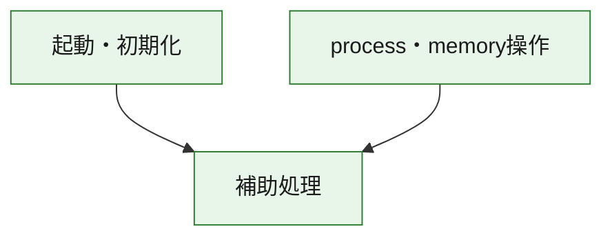
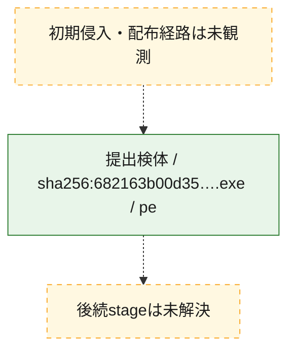
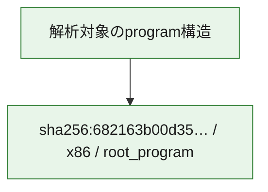

# 全体ロジック：682163b00d351430a44b0ef902e46598215c795e607232c0fae47dfe443c3afd

代表関数の静的証跡から、起動・初期化、process・memory操作の処理群を確認しました。

## 読み方

- phaseの掲載順は解析上の整理順です。observed_call_edgesがない段階間の実行順を断定しません。
- 図の実線は静的に観測した関係、点線と黄色のノードは未観測・未解決の関係を示します。
- 図は静的な要約であり、動的実行を再現するものではありません。
- 詳細な関数解説とfingerprintは[STATIC-LOGIC.md](STATIC-LOGIC.md)を参照してください。

## 静的可視化

### 実行フロー

### 感染チェーン

### モジュール関係

## 処理段階

### 1. 起動・初期化

entry pointから初期化と後続処理への移行を確認します。
確度: `confirmed_static_function_evidence`

- `682163b00d351430a44b0ef902e46598215c795e607232c0fae47dfe443c3afd:ghidra:1400013e0` — 初期化と主要処理への分岐を行う入口関数です。 状態: `succeeded`、選定理由: `entry_point`, `meaningful_symbol_name`, `reviewed_call_centrality:1`, `role:entrypoint`

### 2. process・memory操作

process、thread、module、memory操作と実行移行を確認します。
確度: `confirmed_static_function_evidence`

- `682163b00d351430a44b0ef902e46598215c795e607232c0fae47dfe443c3afd:ghidra:1400102a0` — process、thread、module、またはmemory操作に関係する関数です。 状態: `succeeded`、選定理由: `context_representative`, `reviewed_call_centrality:16`, `role:process_or_memory_operation`
- `682163b00d351430a44b0ef902e46598215c795e607232c0fae47dfe443c3afd:ghidra:140010310` — process、thread、module、またはmemory操作に関係する関数です。 状態: `succeeded`、選定理由: `context_representative`, `reviewed_call_centrality:12`, `role:process_or_memory_operation`

### 3. 補助処理

主要処理を支える一般内部関数またはlibrary処理を確認します。
確度: `confirmed_static_function_evidence_with_limits`

- `682163b00d351430a44b0ef902e46598215c795e607232c0fae47dfe443c3afd:ghidra:140001000` — 検体内部の一般処理を実装する関数です。 状態: `succeeded`、選定理由: `context_representative`
- `682163b00d351430a44b0ef902e46598215c795e607232c0fae47dfe443c3afd:ghidra:140001010` — 検体内部の一般処理を実装する関数です。 状態: `succeeded`、選定理由: `context_representative`, `reviewed_call_centrality:6`
- `682163b00d351430a44b0ef902e46598215c795e607232c0fae47dfe443c3afd:ghidra:140001140` — 検体内部の一般処理を実装する関数です。 状態: `succeeded`、選定理由: `context_representative`, `reviewed_call_centrality:1`
- `682163b00d351430a44b0ef902e46598215c795e607232c0fae47dfe443c3afd:ghidra:140001190` — 検体内部の一般処理を実装する関数です。 状態: `succeeded`、選定理由: `context_representative`, `reviewed_call_centrality:21`
- `682163b00d351430a44b0ef902e46598215c795e607232c0fae47dfe443c3afd:ghidra:140001410` — 検体内部の一般処理を実装する関数です。 状態: `succeeded`、選定理由: `context_representative`, `reviewed_call_centrality:1`
- `682163b00d351430a44b0ef902e46598215c795e607232c0fae47dfe443c3afd:ghidra:140001440` — 検体内部の一般処理を実装する関数です。 状態: `succeeded`、選定理由: `context_representative`, `reviewed_call_centrality:1`
- `682163b00d351430a44b0ef902e46598215c795e607232c0fae47dfe443c3afd:ghidra:140001460` — 検体内部の一般処理を実装する関数です。 状態: `succeeded`、選定理由: `context_representative`, `reviewed_call_centrality:1`
- `682163b00d351430a44b0ef902e46598215c795e607232c0fae47dfe443c3afd:ghidra:140001470` — 検体内部の一般処理を実装する関数です。 状態: `succeeded`、選定理由: `context_representative`
- `682163b00d351430a44b0ef902e46598215c795e607232c0fae47dfe443c3afd:ghidra:14000ffc0` — 検体内部の一般処理を実装する関数です。 状態: `succeeded`、選定理由: `context_representative`
- `682163b00d351430a44b0ef902e46598215c795e607232c0fae47dfe443c3afd:ghidra:140010010` — 検体内部の一般処理を実装する関数です。 状態: `succeeded`、選定理由: `context_representative`, `reviewed_call_centrality:1`
- `682163b00d351430a44b0ef902e46598215c795e607232c0fae47dfe443c3afd:ghidra:140010090` — 検体内部の一般処理を実装する関数です。 状態: `succeeded`、選定理由: `context_representative`, `reviewed_call_centrality:2`
- `682163b00d351430a44b0ef902e46598215c795e607232c0fae47dfe443c3afd:ghidra:1400100b0` — 検体内部の一般処理を実装する関数です。 状態: `succeeded`、選定理由: `context_representative`, `reviewed_call_centrality:1`
- `682163b00d351430a44b0ef902e46598215c795e607232c0fae47dfe443c3afd:ghidra:1400100c0` — compiler生成処理または汎用library処理とみられる関数です。 状態: `succeeded`、選定理由: `entry_point`, `meaningful_symbol_name`, `reviewed_call_centrality:1`
- `682163b00d351430a44b0ef902e46598215c795e607232c0fae47dfe443c3afd:ghidra:1400100f0` — compiler生成処理または汎用library処理とみられる関数です。 状態: `succeeded`、選定理由: `entry_point`, `meaningful_symbol_name`, `reviewed_call_centrality:3`
- `682163b00d351430a44b0ef902e46598215c795e607232c0fae47dfe443c3afd:ghidra:140010180` — 検体内部の一般処理を実装する関数です。 状態: `succeeded`、選定理由: `context_representative`
- `682163b00d351430a44b0ef902e46598215c795e607232c0fae47dfe443c3afd:ghidra:140010190` — 検体内部の一般処理を実装する関数です。 状態: `succeeded`、選定理由: `context_representative`, `reviewed_call_centrality:2`
- `682163b00d351430a44b0ef902e46598215c795e607232c0fae47dfe443c3afd:ghidra:140010290` — 検体内部の一般処理を実装する関数です。 状態: `succeeded`、選定理由: `context_representative`, `reviewed_call_centrality:3`
- `682163b00d351430a44b0ef902e46598215c795e607232c0fae47dfe443c3afd:ghidra:140010480` — 検体内部の一般処理を実装する関数です。 状態: `succeeded`、選定理由: `context_representative`, `reviewed_call_centrality:4`
- `682163b00d351430a44b0ef902e46598215c795e607232c0fae47dfe443c3afd:ghidra:1400107e0` — 検体内部の一般処理を実装する関数です。 状態: `succeeded`、選定理由: `context_representative`
- `682163b00d351430a44b0ef902e46598215c795e607232c0fae47dfe443c3afd:ghidra:140010820` — 検体内部の一般処理を実装する関数です。 状態: `limited_bad_instruction_or_flow`、選定理由: `context_representative`, `reviewed_call_centrality:3`
- `682163b00d351430a44b0ef902e46598215c795e607232c0fae47dfe443c3afd:ghidra:140010830` — 検体内部の一般処理を実装する関数です。 状態: `limited_bad_instruction_or_flow`、選定理由: `context_representative`, `reviewed_call_centrality:2`
- `682163b00d351430a44b0ef902e46598215c795e607232c0fae47dfe443c3afd:ghidra:1400109f0` — 検体内部の一般処理を実装する関数です。 状態: `limited_bad_instruction_or_flow`、選定理由: `context_representative`, `reviewed_call_centrality:9`
- `682163b00d351430a44b0ef902e46598215c795e607232c0fae47dfe443c3afd:ghidra:140010a70` — 検体内部の一般処理を実装する関数です。 状態: `succeeded`、選定理由: `context_representative`, `reviewed_call_centrality:5`
- `682163b00d351430a44b0ef902e46598215c795e607232c0fae47dfe443c3afd:ghidra:140010af0` — 検体内部の一般処理を実装する関数です。 状態: `succeeded`、選定理由: `context_representative`, `reviewed_call_centrality:5`
- `682163b00d351430a44b0ef902e46598215c795e607232c0fae47dfe443c3afd:ghidra:140010b90` — 検体内部の一般処理を実装する関数です。 状態: `succeeded`、選定理由: `context_representative`, `reviewed_call_centrality:9`
- `682163b00d351430a44b0ef902e46598215c795e607232c0fae47dfe443c3afd:ghidra:140010c90` — 検体内部の一般処理を実装する関数です。 状態: `succeeded`、選定理由: `context_representative`
- `682163b00d351430a44b0ef902e46598215c795e607232c0fae47dfe443c3afd:ghidra:140010cc0` — 検体内部の一般処理を実装する関数です。 状態: `succeeded`、選定理由: `context_representative`
- `682163b00d351430a44b0ef902e46598215c795e607232c0fae47dfe443c3afd:ghidra:140010d10` — 検体内部の一般処理を実装する関数です。 状態: `succeeded`、選定理由: `context_representative`, `reviewed_call_centrality:2`
- `682163b00d351430a44b0ef902e46598215c795e607232c0fae47dfe443c3afd:ghidra:140010dc0` — 検体内部の一般処理を実装する関数です。 状態: `succeeded`、選定理由: `context_representative`, `reviewed_call_centrality:2`

## 観測したcall関係

- `682163b00d351430a44b0ef902e46598215c795e607232c0fae47dfe443c3afd:ghidra:140001010` → `682163b00d351430a44b0ef902e46598215c795e607232c0fae47dfe443c3afd:ghidra:1400100b0` （`support` → `support`）
- `682163b00d351430a44b0ef902e46598215c795e607232c0fae47dfe443c3afd:ghidra:140001010` → `682163b00d351430a44b0ef902e46598215c795e607232c0fae47dfe443c3afd:ghidra:140010820` （`support` → `support`）
- `682163b00d351430a44b0ef902e46598215c795e607232c0fae47dfe443c3afd:ghidra:140001190` → `682163b00d351430a44b0ef902e46598215c795e607232c0fae47dfe443c3afd:ghidra:140010090` （`support` → `support`）
- `682163b00d351430a44b0ef902e46598215c795e607232c0fae47dfe443c3afd:ghidra:140001190` → `682163b00d351430a44b0ef902e46598215c795e607232c0fae47dfe443c3afd:ghidra:1400100f0` （`support` → `support`）
- `682163b00d351430a44b0ef902e46598215c795e607232c0fae47dfe443c3afd:ghidra:140001190` → `682163b00d351430a44b0ef902e46598215c795e607232c0fae47dfe443c3afd:ghidra:140010290` （`support` → `support`）
- `682163b00d351430a44b0ef902e46598215c795e607232c0fae47dfe443c3afd:ghidra:140001190` → `682163b00d351430a44b0ef902e46598215c795e607232c0fae47dfe443c3afd:ghidra:140010480` （`support` → `support`）
- `682163b00d351430a44b0ef902e46598215c795e607232c0fae47dfe443c3afd:ghidra:1400013e0` → `682163b00d351430a44b0ef902e46598215c795e607232c0fae47dfe443c3afd:ghidra:140001190` （`startup` → `support`）
- `682163b00d351430a44b0ef902e46598215c795e607232c0fae47dfe443c3afd:ghidra:140001410` → `682163b00d351430a44b0ef902e46598215c795e607232c0fae47dfe443c3afd:ghidra:140001190` （`support` → `support`）
- `682163b00d351430a44b0ef902e46598215c795e607232c0fae47dfe443c3afd:ghidra:1400100c0` → `682163b00d351430a44b0ef902e46598215c795e607232c0fae47dfe443c3afd:ghidra:140010b90` （`support` → `support`）
- `682163b00d351430a44b0ef902e46598215c795e607232c0fae47dfe443c3afd:ghidra:1400100f0` → `682163b00d351430a44b0ef902e46598215c795e607232c0fae47dfe443c3afd:ghidra:140010b90` （`support` → `support`）
- `682163b00d351430a44b0ef902e46598215c795e607232c0fae47dfe443c3afd:ghidra:1400102a0` → `682163b00d351430a44b0ef902e46598215c795e607232c0fae47dfe443c3afd:ghidra:140010dc0` （`execution` → `support`）
- `682163b00d351430a44b0ef902e46598215c795e607232c0fae47dfe443c3afd:ghidra:140010310` → `682163b00d351430a44b0ef902e46598215c795e607232c0fae47dfe443c3afd:ghidra:1400102a0` （`execution` → `execution`）
- `682163b00d351430a44b0ef902e46598215c795e607232c0fae47dfe443c3afd:ghidra:140010310` → `682163b00d351430a44b0ef902e46598215c795e607232c0fae47dfe443c3afd:ghidra:140010dc0` （`execution` → `support`）
- `682163b00d351430a44b0ef902e46598215c795e607232c0fae47dfe443c3afd:ghidra:140010830` → `682163b00d351430a44b0ef902e46598215c795e607232c0fae47dfe443c3afd:ghidra:140010290` （`support` → `support`）
- `682163b00d351430a44b0ef902e46598215c795e607232c0fae47dfe443c3afd:ghidra:140010b90` → `682163b00d351430a44b0ef902e46598215c795e607232c0fae47dfe443c3afd:ghidra:140010290` （`support` → `support`）
- `682163b00d351430a44b0ef902e46598215c795e607232c0fae47dfe443c3afd:ghidra:140010b90` → `682163b00d351430a44b0ef902e46598215c795e607232c0fae47dfe443c3afd:ghidra:1400109f0` （`support` → `support`）
- `ghidra-function:0e2320f47314d34c7e55237b` → `ghidra-external:40518688346ff656ab6ccb1e` （`unclassified` → `unclassified`）
- `ghidra-function:0e2320f47314d34c7e55237b` → `ghidra-external:8baa1a7f5239c0007575b8e8` （`unclassified` → `unclassified`）
- `ghidra-function:0e2320f47314d34c7e55237b` → `ghidra-external:c481de6bbcd10591a8b8a601` （`unclassified` → `unclassified`）
- `ghidra-function:0e2320f47314d34c7e55237b` → `ghidra-external:f46c5ae591a6bcbb28e21c88` （`unclassified` → `unclassified`）
- `ghidra-function:0e2320f47314d34c7e55237b` → `ghidra-external:fb34e69a80a062473639d8aa` （`unclassified` → `unclassified`）
- `ghidra-function:0e2320f47314d34c7e55237b` → `ghidra-function:044dfedf7c352129a6b5747e` （`unclassified` → `unclassified`）
- `ghidra-function:0e2320f47314d34c7e55237b` → `ghidra-function:07ff8b16228186a908f84cac` （`unclassified` → `unclassified`）
- `ghidra-function:0e2320f47314d34c7e55237b` → `ghidra-function:3c5ec738e9efaef6f36fcb29` （`unclassified` → `unclassified`）
- `ghidra-function:0e2320f47314d34c7e55237b` → `ghidra-function:3d6c1500c2f9697839276209` （`unclassified` → `unclassified`）
- `ghidra-function:0e2320f47314d34c7e55237b` → `ghidra-function:9fbbc999d05a0980ef30d704` （`unclassified` → `unclassified`）
- `ghidra-function:0e2320f47314d34c7e55237b` → `ghidra-function:c09636b5e2582480fae83e61` （`unclassified` → `unclassified`）
- `ghidra-function:0e2320f47314d34c7e55237b` → `ghidra-function:e710cf8af1bafe9bd9b922f4` （`unclassified` → `unclassified`）
- `ghidra-function:14d9b32681032bde20ef600b` → `ghidra-function:2f3afc45adcdd5bede279734` （`unclassified` → `unclassified`）
- `ghidra-function:1a45e3145f880c0d00e890f2` → `ghidra-external:c76a6559ffc92bbbdc2fb660` （`unclassified` → `unclassified`）
- `ghidra-function:2eb4ec6169eb2d5bfa5ce04d` → `ghidra-function:f36235d571de04ec31655aeb` （`unclassified` → `unclassified`）
- `ghidra-function:2f9980c20eadbcabda6335da` → `ghidra-external:8baa1a7f5239c0007575b8e8` （`unclassified` → `unclassified`）
- `ghidra-function:2f9980c20eadbcabda6335da` → `ghidra-function:f36235d571de04ec31655aeb` （`unclassified` → `unclassified`）
- `ghidra-function:36f645b0c474a425025eccf5` → `ghidra-external:eb781a4a56f252455ffba178` （`unclassified` → `unclassified`）
- `ghidra-function:36f645b0c474a425025eccf5` → `ghidra-function:3192a25105c84c6cf8a40e22` （`unclassified` → `unclassified`）
- `ghidra-function:36f645b0c474a425025eccf5` → `ghidra-function:491030abbda6fba294ce86d7` （`unclassified` → `unclassified`）
- `ghidra-function:4cc86de42bdfa85691405b22` → `ghidra-external:c76a6559ffc92bbbdc2fb660` （`unclassified` → `unclassified`）
- `ghidra-function:4fd2b373d78c86ec8f1a4519` → `ghidra-function:7850381ad870cf786f2fa554` （`unclassified` → `unclassified`）
- `ghidra-function:51118c47c03faba2adc17648` → `ghidra-function:3192a25105c84c6cf8a40e22` （`unclassified` → `unclassified`）
- `ghidra-function:51118c47c03faba2adc17648` → `ghidra-function:39fb78557c28180375b2f2e4` （`unclassified` → `unclassified`）
- `ghidra-function:51118c47c03faba2adc17648` → `ghidra-function:491030abbda6fba294ce86d7` （`unclassified` → `unclassified`）
- `ghidra-function:51118c47c03faba2adc17648` → `ghidra-function:e710cf8af1bafe9bd9b922f4` （`unclassified` → `unclassified`）
- `ghidra-function:7850381ad870cf786f2fa554` → `ghidra-external:073ca7d90e3f4afc6e6b0fa4` （`unclassified` → `unclassified`）
- `ghidra-function:7850381ad870cf786f2fa554` → `ghidra-external:2669760c75b64c573644f157` （`unclassified` → `unclassified`）
- `ghidra-function:7850381ad870cf786f2fa554` → `ghidra-external:3da91cbb7955b66b994cd602` （`unclassified` → `unclassified`）
- `ghidra-function:7850381ad870cf786f2fa554` → `ghidra-external:6ef7152f78f017238d8ac873` （`unclassified` → `unclassified`）
- `ghidra-function:7850381ad870cf786f2fa554` → `ghidra-external:73295b3652a03514f2d2483d` （`unclassified` → `unclassified`）
- `ghidra-function:7850381ad870cf786f2fa554` → `ghidra-external:79293ff514698befd74052b3` （`unclassified` → `unclassified`）
- `ghidra-function:7850381ad870cf786f2fa554` → `ghidra-external:d7608fce15fbd443e819ee03` （`unclassified` → `unclassified`）
- `ghidra-function:7850381ad870cf786f2fa554` → `ghidra-external:e0118ff4e62cd88a596bfec0` （`unclassified` → `unclassified`）
- `ghidra-function:7850381ad870cf786f2fa554` → `ghidra-external:ebd357a35ef14654a7f6b141` （`unclassified` → `unclassified`）
- `ghidra-function:7850381ad870cf786f2fa554` → `ghidra-external:ed2baf0358f198b015e0f0f5` （`unclassified` → `unclassified`）
- `ghidra-function:7850381ad870cf786f2fa554` → `ghidra-function:0ccbc452821bcd3ac920bdce` （`unclassified` → `unclassified`）
- `ghidra-function:7850381ad870cf786f2fa554` → `ghidra-function:1554d627bbe2047633cc2b52` （`unclassified` → `unclassified`）
- `ghidra-function:7850381ad870cf786f2fa554` → `ghidra-function:2f9980c20eadbcabda6335da` （`unclassified` → `unclassified`）
- `ghidra-function:7850381ad870cf786f2fa554` → `ghidra-function:a16c83fb04e69022b12a0763` （`unclassified` → `unclassified`）
- `ghidra-function:7850381ad870cf786f2fa554` → `ghidra-function:acf35335a6e22cc78fb180d3` （`unclassified` → `unclassified`）
- `ghidra-function:7850381ad870cf786f2fa554` → `ghidra-function:fd74ee85c264b5c3a3c756e9` （`unclassified` → `unclassified`）
- `ghidra-function:7850381ad870cf786f2fa554` → `ghidra-function:fea93d1c676a2f9df5f4ce8c` （`unclassified` → `unclassified`）
- `ghidra-function:a16c83fb04e69022b12a0763` → `ghidra-external:c76a6559ffc92bbbdc2fb660` （`unclassified` → `unclassified`）
- `ghidra-function:a1c4cd30430d1a88513eb08d` → `ghidra-external:204ee5ca374029901067dd13` （`unclassified` → `unclassified`）
- `ghidra-function:a1c4cd30430d1a88513eb08d` → `ghidra-function:3d6c1500c2f9697839276209` （`unclassified` → `unclassified`）
- `ghidra-function:ba13722d5b5b9a67ed24e7f6` → `ghidra-external:38c1f406352cac003a0c3fc2` （`unclassified` → `unclassified`）
- `ghidra-function:cf754158106a1bef74eb9bae` → `ghidra-external:40518688346ff656ab6ccb1e` （`unclassified` → `unclassified`）
- `ghidra-function:cf754158106a1bef74eb9bae` → `ghidra-external:8baa1a7f5239c0007575b8e8` （`unclassified` → `unclassified`）
- `ghidra-function:cf754158106a1bef74eb9bae` → `ghidra-function:044dfedf7c352129a6b5747e` （`unclassified` → `unclassified`）
- `ghidra-function:cf754158106a1bef74eb9bae` → `ghidra-function:07ff8b16228186a908f84cac` （`unclassified` → `unclassified`）
- `ghidra-function:cf754158106a1bef74eb9bae` → `ghidra-function:0e2320f47314d34c7e55237b` （`unclassified` → `unclassified`）
- `ghidra-function:cf754158106a1bef74eb9bae` → `ghidra-function:3c5ec738e9efaef6f36fcb29` （`unclassified` → `unclassified`）
- `ghidra-function:cf754158106a1bef74eb9bae` → `ghidra-function:9fbbc999d05a0980ef30d704` （`unclassified` → `unclassified`）
- `ghidra-function:cf754158106a1bef74eb9bae` → `ghidra-function:c09636b5e2582480fae83e61` （`unclassified` → `unclassified`）
- `ghidra-function:cf754158106a1bef74eb9bae` → `ghidra-function:e710cf8af1bafe9bd9b922f4` （`unclassified` → `unclassified`）
- `ghidra-function:d27aa42bb05be00684ac6965` → `ghidra-external:8984f1063f368abb89117f1c` （`unclassified` → `unclassified`）
- `ghidra-function:d27aa42bb05be00684ac6965` → `ghidra-function:fd74ee85c264b5c3a3c756e9` （`unclassified` → `unclassified`）
- `ghidra-function:d8ae19400b563c4ec37ea930` → `ghidra-external:c76a6559ffc92bbbdc2fb660` （`unclassified` → `unclassified`）
- `ghidra-function:de17a687a811a0cdbe85fa97` → `ghidra-external:10c71a797babb886192e52aa` （`unclassified` → `unclassified`）
- `ghidra-function:de17a687a811a0cdbe85fa97` → `ghidra-external:ebd357a35ef14654a7f6b141` （`unclassified` → `unclassified`）
- `ghidra-function:e8f9ddafbcce2ce3f6f39aa1` → `ghidra-function:7850381ad870cf786f2fa554` （`unclassified` → `unclassified`）
- `ghidra-function:f050968bc95cf460bb20b290` → `ghidra-external:7083fcb8ff86bd9b843112df` （`unclassified` → `unclassified`）
- `ghidra-function:f050968bc95cf460bb20b290` → `ghidra-external:8baa1a7f5239c0007575b8e8` （`unclassified` → `unclassified`）
- `ghidra-function:f050968bc95cf460bb20b290` → `ghidra-function:14d9b32681032bde20ef600b` （`unclassified` → `unclassified`）
- `ghidra-function:f050968bc95cf460bb20b290` → `ghidra-function:8aa8d0ebb2b834deb24bd404` （`unclassified` → `unclassified`）
- `ghidra-function:f050968bc95cf460bb20b290` → `ghidra-function:bf1129c2a8cbb0baccd93337` （`unclassified` → `unclassified`）
- `ghidra-function:f050968bc95cf460bb20b290` → `ghidra-function:d64440138b25585b6c7c80b8` （`unclassified` → `unclassified`）
- `ghidra-function:f36235d571de04ec31655aeb` → `ghidra-external:468824e899d4f981b95a846c` （`unclassified` → `unclassified`）
- `ghidra-function:f36235d571de04ec31655aeb` → `ghidra-function:275a04577eebf050acdb71af` （`unclassified` → `unclassified`）
- `ghidra-function:f36235d571de04ec31655aeb` → `ghidra-function:51118c47c03faba2adc17648` （`unclassified` → `unclassified`）
- `ghidra-function:f36235d571de04ec31655aeb` → `ghidra-function:7d9dffc0b5a64fa287c0d586` （`unclassified` → `unclassified`）
- `ghidra-function:f36235d571de04ec31655aeb` → `ghidra-function:fd74ee85c264b5c3a3c756e9` （`unclassified` → `unclassified`）
- `ghidra-function:f6ac2d0fb586de6b8e83bcb5` → `ghidra-external:468824e899d4f981b95a846c` （`unclassified` → `unclassified`）
- `ghidra-function:f6ac2d0fb586de6b8e83bcb5` → `ghidra-function:3192a25105c84c6cf8a40e22` （`unclassified` → `unclassified`）
- `ghidra-function:f6ac2d0fb586de6b8e83bcb5` → `ghidra-function:491030abbda6fba294ce86d7` （`unclassified` → `unclassified`）
- `ghidra-function:fea93d1c676a2f9df5f4ce8c` → `ghidra-external:40518688346ff656ab6ccb1e` （`unclassified` → `unclassified`）
- `ghidra-function:fea93d1c676a2f9df5f4ce8c` → `ghidra-external:8baa1a7f5239c0007575b8e8` （`unclassified` → `unclassified`）
- `ghidra-function:fea93d1c676a2f9df5f4ce8c` → `ghidra-function:044dfedf7c352129a6b5747e` （`unclassified` → `unclassified`）

## 解析範囲と制約

- 選定外関数は全体inventoryへ残しますが、関数本体の個別解説対象にはしていません。
- indirect call、難読化、packer、VM、壊れたcontrol flowによりcall関係が欠落する場合があります。
- 文書は静的解析に基づき、検体実行や外部通信による動的確認は行っていません。
