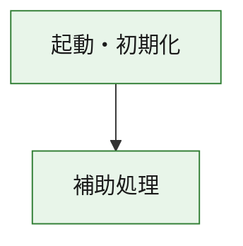
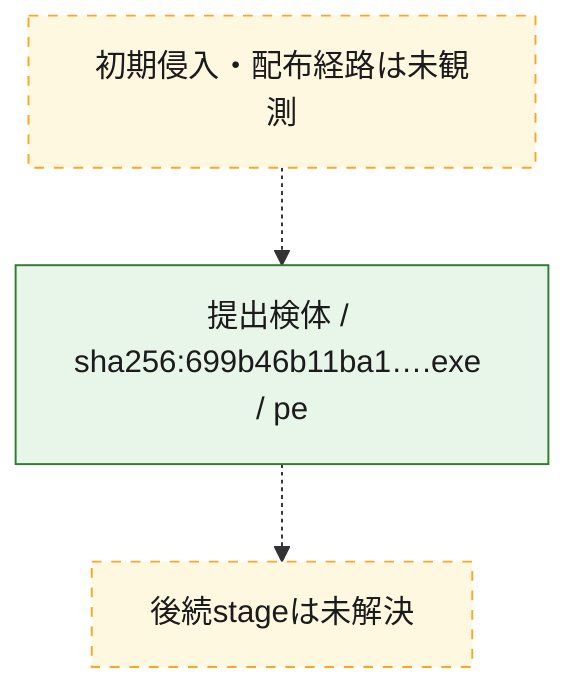
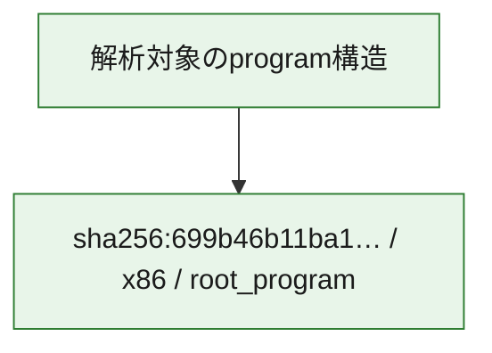

# 全体ロジック：699b46b11ba11d12281faa6e2a0509894f4348b2ee6b66dd3a56ac35c85fda46

代表関数の静的証跡から、起動・初期化の処理群を確認しました。

## 読み方

- phaseの掲載順は解析上の整理順です。observed_call_edgesがない段階間の実行順を断定しません。
- 図の実線は静的に観測した関係、点線と黄色のノードは未観測・未解決の関係を示します。
- 図は静的な要約であり、動的実行を再現するものではありません。
- 詳細な関数解説とfingerprintは[STATIC-LOGIC.md](STATIC-LOGIC.md)を参照してください。

## 静的可視化

### 実行フロー

### 感染チェーン

### モジュール関係

## 処理段階

### 1. 起動・初期化

entry pointから初期化と後続処理への移行を確認します。
確度: `confirmed_static_function_evidence`

- `699b46b11ba11d12281faa6e2a0509894f4348b2ee6b66dd3a56ac35c85fda46:ghidra:180001010` — 初期化と主要処理への分岐を行う入口関数です。 状態: `succeeded`、選定理由: `entry_point`, `meaningful_symbol_name`, `reviewed_call_centrality:22`, `role:entrypoint`, `small_program_complete_context`

### 2. 補助処理

主要処理を支える一般内部関数またはlibrary処理を確認します。
確度: `confirmed_static_function_evidence`

- `699b46b11ba11d12281faa6e2a0509894f4348b2ee6b66dd3a56ac35c85fda46:ghidra:180001240` — 検体内部の一般処理を実装する関数です。 状態: `succeeded`、選定理由: `context_representative`, `reviewed_call_centrality:2`, `small_program_complete_context`
- `699b46b11ba11d12281faa6e2a0509894f4348b2ee6b66dd3a56ac35c85fda46:ghidra:180001350` — 検体内部の一般処理を実装する関数です。 状態: `succeeded`、選定理由: `context_representative`, `reviewed_call_centrality:25`, `small_program_complete_context`
- `699b46b11ba11d12281faa6e2a0509894f4348b2ee6b66dd3a56ac35c85fda46:ghidra:180003780` — 検体内部の一般処理を実装する関数です。 状態: `succeeded`、選定理由: `context_representative`, `reviewed_call_centrality:2`, `small_program_complete_context`
- `699b46b11ba11d12281faa6e2a0509894f4348b2ee6b66dd3a56ac35c85fda46:ghidra:1800038e0` — 検体内部の一般処理を実装する関数です。 状態: `succeeded`、選定理由: `context_representative`, `reviewed_call_centrality:2`, `small_program_complete_context`

## 観測したcall関係

- `699b46b11ba11d12281faa6e2a0509894f4348b2ee6b66dd3a56ac35c85fda46:ghidra:180001010` → `699b46b11ba11d12281faa6e2a0509894f4348b2ee6b66dd3a56ac35c85fda46:ghidra:180001240` （`startup` → `support`）
- `699b46b11ba11d12281faa6e2a0509894f4348b2ee6b66dd3a56ac35c85fda46:ghidra:180001010` → `699b46b11ba11d12281faa6e2a0509894f4348b2ee6b66dd3a56ac35c85fda46:ghidra:180001350` （`startup` → `support`）
- `699b46b11ba11d12281faa6e2a0509894f4348b2ee6b66dd3a56ac35c85fda46:ghidra:180001350` → `699b46b11ba11d12281faa6e2a0509894f4348b2ee6b66dd3a56ac35c85fda46:ghidra:180001240` （`support` → `support`）
- `699b46b11ba11d12281faa6e2a0509894f4348b2ee6b66dd3a56ac35c85fda46:ghidra:180001350` → `699b46b11ba11d12281faa6e2a0509894f4348b2ee6b66dd3a56ac35c85fda46:ghidra:180003780` （`support` → `support`）
- `699b46b11ba11d12281faa6e2a0509894f4348b2ee6b66dd3a56ac35c85fda46:ghidra:180001350` → `699b46b11ba11d12281faa6e2a0509894f4348b2ee6b66dd3a56ac35c85fda46:ghidra:1800038e0` （`support` → `support`）
- `699b46b11ba11d12281faa6e2a0509894f4348b2ee6b66dd3a56ac35c85fda46:ghidra:180003780` → `699b46b11ba11d12281faa6e2a0509894f4348b2ee6b66dd3a56ac35c85fda46:ghidra:1800038e0` （`support` → `support`）
- `ghidra-function:715b8f7aa9f2a8bbe50c21b7` → `ghidra-function:2029770713121d3f7c81db66` （`unclassified` → `unclassified`）
- `ghidra-function:715b8f7aa9f2a8bbe50c21b7` → `ghidra-function:3ddd9ee3300594d8b7076865` （`unclassified` → `unclassified`）
- `ghidra-function:715b8f7aa9f2a8bbe50c21b7` → `ghidra-function:4d45a18eb988c22b10d92361` （`unclassified` → `unclassified`）
- `ghidra-function:715b8f7aa9f2a8bbe50c21b7` → `ghidra-function:57175976517d05043e46d753` （`unclassified` → `unclassified`）
- `ghidra-function:715b8f7aa9f2a8bbe50c21b7` → `ghidra-function:687af7c0c1b3a32045777a8b` （`unclassified` → `unclassified`）
- `ghidra-function:715b8f7aa9f2a8bbe50c21b7` → `ghidra-function:7f75ac9edc796e017d476327` （`unclassified` → `unclassified`）
- `ghidra-function:715b8f7aa9f2a8bbe50c21b7` → `ghidra-function:92a00ed23b4a2310ada5a23d` （`unclassified` → `unclassified`）
- `ghidra-function:715b8f7aa9f2a8bbe50c21b7` → `ghidra-function:a673ac52c47311220be07d2b` （`unclassified` → `unclassified`）
- `ghidra-function:715b8f7aa9f2a8bbe50c21b7` → `ghidra-function:a68adf497ac85819bcc4af07` （`unclassified` → `unclassified`）
- `ghidra-function:715b8f7aa9f2a8bbe50c21b7` → `ghidra-function:dd614f08b20313cb2dc7a0f4` （`unclassified` → `unclassified`）
- `ghidra-function:715b8f7aa9f2a8bbe50c21b7` → `ghidra-function:f6f56e7f7ced14891e6f90f6` （`unclassified` → `unclassified`）
- `ghidra-function:715b8f7aa9f2a8bbe50c21b7` → `ghidra-function:ff8da51139edba4f10c314ca` （`unclassified` → `unclassified`）
- `ghidra-function:92a00ed23b4a2310ada5a23d` → `ghidra-external:0b42f15c6cbde4dc92e751cb` （`unclassified` → `unclassified`）
- `ghidra-function:92a00ed23b4a2310ada5a23d` → `ghidra-external:0dec006787c0fb4eeefc8eed` （`unclassified` → `unclassified`）
- `ghidra-function:92a00ed23b4a2310ada5a23d` → `ghidra-external:0df983d7cfd4f0fcb0783e9e` （`unclassified` → `unclassified`）
- `ghidra-function:92a00ed23b4a2310ada5a23d` → `ghidra-external:18b9f626ed4742b17547cef2` （`unclassified` → `unclassified`）
- `ghidra-function:92a00ed23b4a2310ada5a23d` → `ghidra-external:1ac13a563e41f5f78b2be2ef` （`unclassified` → `unclassified`）
- `ghidra-function:92a00ed23b4a2310ada5a23d` → `ghidra-external:1bdd228a9ef864e5138826c8` （`unclassified` → `unclassified`）
- `ghidra-function:92a00ed23b4a2310ada5a23d` → `ghidra-external:2301ac7528bfe4f1e6625ae9` （`unclassified` → `unclassified`）
- `ghidra-function:92a00ed23b4a2310ada5a23d` → `ghidra-external:3f5bbad9afbd760df8c46961` （`unclassified` → `unclassified`）
- `ghidra-function:92a00ed23b4a2310ada5a23d` → `ghidra-external:5152e42a155b950592ff4430` （`unclassified` → `unclassified`）
- `ghidra-function:92a00ed23b4a2310ada5a23d` → `ghidra-external:55ef227350e81b5ef9db0d9f` （`unclassified` → `unclassified`）
- `ghidra-function:92a00ed23b4a2310ada5a23d` → `ghidra-external:7df6728a15ed531d4cf3464a` （`unclassified` → `unclassified`）
- `ghidra-function:92a00ed23b4a2310ada5a23d` → `ghidra-external:83d63b94800f88f7e4316e6c` （`unclassified` → `unclassified`）
- `ghidra-function:92a00ed23b4a2310ada5a23d` → `ghidra-external:866e74d8a2384c83f427821c` （`unclassified` → `unclassified`）
- `ghidra-function:92a00ed23b4a2310ada5a23d` → `ghidra-external:9b549584359f47cc0ea59b12` （`unclassified` → `unclassified`）
- `ghidra-function:92a00ed23b4a2310ada5a23d` → `ghidra-external:9e09b64c303cb180b7583f87` （`unclassified` → `unclassified`）
- `ghidra-function:92a00ed23b4a2310ada5a23d` → `ghidra-external:a037f64ce727dd34a5bcfe20` （`unclassified` → `unclassified`）
- `ghidra-function:92a00ed23b4a2310ada5a23d` → `ghidra-external:a09d3d9619b1d8b37450f849` （`unclassified` → `unclassified`）
- `ghidra-function:92a00ed23b4a2310ada5a23d` → `ghidra-external:a0dba133d46229cb33627d8d` （`unclassified` → `unclassified`）
- `ghidra-function:92a00ed23b4a2310ada5a23d` → `ghidra-external:ba42592370ce61c8af93a183` （`unclassified` → `unclassified`）
- `ghidra-function:92a00ed23b4a2310ada5a23d` → `ghidra-external:d34c7cfb0ece6a7e617ab3ab` （`unclassified` → `unclassified`）
- `ghidra-function:92a00ed23b4a2310ada5a23d` → `ghidra-external:f90c448b2218b08006be615d` （`unclassified` → `unclassified`）
- `ghidra-function:92a00ed23b4a2310ada5a23d` → `ghidra-function:57175976517d05043e46d753` （`unclassified` → `unclassified`）
- `ghidra-function:92a00ed23b4a2310ada5a23d` → `ghidra-function:f13cdce629b0169c14ba3714` （`unclassified` → `unclassified`）
- `ghidra-function:92a00ed23b4a2310ada5a23d` → `ghidra-function:ff7caa6af4248772e5528475` （`unclassified` → `unclassified`）
- `ghidra-function:ff7caa6af4248772e5528475` → `ghidra-function:f13cdce629b0169c14ba3714` （`unclassified` → `unclassified`）

## 解析範囲と制約

- 選定外関数は全体inventoryへ残しますが、関数本体の個別解説対象にはしていません。
- indirect call、難読化、packer、VM、壊れたcontrol flowによりcall関係が欠落する場合があります。
- 文書は静的解析に基づき、検体実行や外部通信による動的確認は行っていません。
