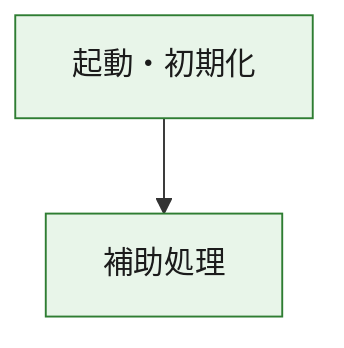
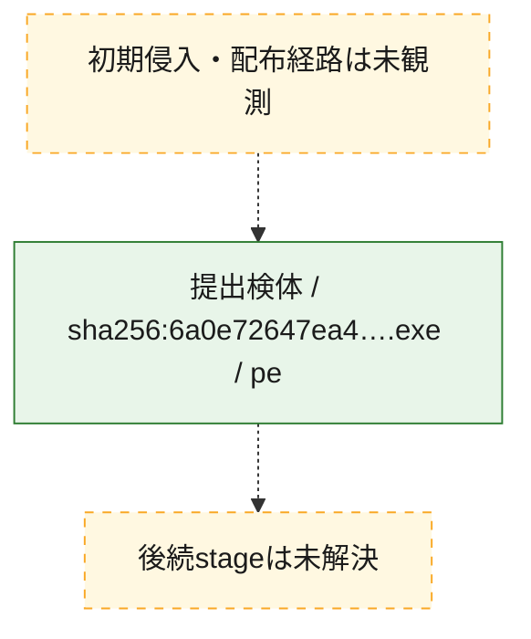
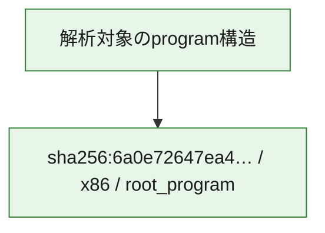

# 全体ロジック：6a0e72647ea431348157befd73b99ff12a325abe689ccfedd86b1b65d6849e8c

代表関数の静的証跡から、起動・初期化の処理群を確認しました。

## 読み方

- phaseの掲載順は解析上の整理順です。observed_call_edgesがない段階間の実行順を断定しません。
- 図の実線は静的に観測した関係、点線と黄色のノードは未観測・未解決の関係を示します。
- 図は静的な要約であり、動的実行を再現するものではありません。
- 詳細な関数解説とfingerprintは[STATIC-LOGIC.md](STATIC-LOGIC.md)を参照してください。

## 静的可視化

### 実行フロー

### 感染チェーン

### モジュール関係

## 処理段階

### 1. 起動・初期化

entry pointから初期化と後続処理への移行を確認します。
確度: `confirmed_static_function_evidence`

- `6a0e72647ea431348157befd73b99ff12a325abe689ccfedd86b1b65d6849e8c:ghidra:180001010` — 初期化と主要処理への分岐を行う入口関数です。 状態: `succeeded`、選定理由: `entry_point`, `meaningful_symbol_name`, `reviewed_call_centrality:22`, `role:entrypoint`, `small_program_complete_context`

### 2. 補助処理

主要処理を支える一般内部関数またはlibrary処理を確認します。
確度: `confirmed_static_function_evidence`

- `6a0e72647ea431348157befd73b99ff12a325abe689ccfedd86b1b65d6849e8c:ghidra:180001240` — 検体内部の一般処理を実装する関数です。 状態: `succeeded`、選定理由: `context_representative`, `reviewed_call_centrality:2`, `small_program_complete_context`
- `6a0e72647ea431348157befd73b99ff12a325abe689ccfedd86b1b65d6849e8c:ghidra:180001350` — 検体内部の一般処理を実装する関数です。 状態: `succeeded`、選定理由: `context_representative`, `reviewed_call_centrality:25`, `small_program_complete_context`
- `6a0e72647ea431348157befd73b99ff12a325abe689ccfedd86b1b65d6849e8c:ghidra:180003780` — 検体内部の一般処理を実装する関数です。 状態: `succeeded`、選定理由: `context_representative`, `reviewed_call_centrality:2`, `small_program_complete_context`
- `6a0e72647ea431348157befd73b99ff12a325abe689ccfedd86b1b65d6849e8c:ghidra:1800038e0` — 検体内部の一般処理を実装する関数です。 状態: `succeeded`、選定理由: `context_representative`, `reviewed_call_centrality:2`, `small_program_complete_context`

## 観測したcall関係

- `6a0e72647ea431348157befd73b99ff12a325abe689ccfedd86b1b65d6849e8c:ghidra:180001010` → `6a0e72647ea431348157befd73b99ff12a325abe689ccfedd86b1b65d6849e8c:ghidra:180001240` （`startup` → `support`）
- `6a0e72647ea431348157befd73b99ff12a325abe689ccfedd86b1b65d6849e8c:ghidra:180001010` → `6a0e72647ea431348157befd73b99ff12a325abe689ccfedd86b1b65d6849e8c:ghidra:180001350` （`startup` → `support`）
- `6a0e72647ea431348157befd73b99ff12a325abe689ccfedd86b1b65d6849e8c:ghidra:180001350` → `6a0e72647ea431348157befd73b99ff12a325abe689ccfedd86b1b65d6849e8c:ghidra:180001240` （`support` → `support`）
- `6a0e72647ea431348157befd73b99ff12a325abe689ccfedd86b1b65d6849e8c:ghidra:180001350` → `6a0e72647ea431348157befd73b99ff12a325abe689ccfedd86b1b65d6849e8c:ghidra:180003780` （`support` → `support`）
- `6a0e72647ea431348157befd73b99ff12a325abe689ccfedd86b1b65d6849e8c:ghidra:180001350` → `6a0e72647ea431348157befd73b99ff12a325abe689ccfedd86b1b65d6849e8c:ghidra:1800038e0` （`support` → `support`）
- `6a0e72647ea431348157befd73b99ff12a325abe689ccfedd86b1b65d6849e8c:ghidra:180003780` → `6a0e72647ea431348157befd73b99ff12a325abe689ccfedd86b1b65d6849e8c:ghidra:1800038e0` （`support` → `support`）
- `ghidra-function:19ba5aa1ed9329e691add399` → `ghidra-external:0236148f36922ef9745f9ac2` （`unclassified` → `unclassified`）
- `ghidra-function:19ba5aa1ed9329e691add399` → `ghidra-external:0529fe157ec4899ef8b91731` （`unclassified` → `unclassified`）
- `ghidra-function:19ba5aa1ed9329e691add399` → `ghidra-external:0c9df0807a91cbe5994dd157` （`unclassified` → `unclassified`）
- `ghidra-function:19ba5aa1ed9329e691add399` → `ghidra-external:2294472cb5695251df06cdd0` （`unclassified` → `unclassified`）
- `ghidra-function:19ba5aa1ed9329e691add399` → `ghidra-external:363827b109090b18f6f5f3b9` （`unclassified` → `unclassified`）
- `ghidra-function:19ba5aa1ed9329e691add399` → `ghidra-external:426b39eaacff4fd8db4ff050` （`unclassified` → `unclassified`）
- `ghidra-function:19ba5aa1ed9329e691add399` → `ghidra-external:48219bf4d5bbcab3ab0c74ca` （`unclassified` → `unclassified`）
- `ghidra-function:19ba5aa1ed9329e691add399` → `ghidra-external:538be1f82d2389980aecb178` （`unclassified` → `unclassified`）
- `ghidra-function:19ba5aa1ed9329e691add399` → `ghidra-external:5acff36350b5a867b32999f4` （`unclassified` → `unclassified`）
- `ghidra-function:19ba5aa1ed9329e691add399` → `ghidra-external:6163eeb4dda1796e37c0a694` （`unclassified` → `unclassified`）
- `ghidra-function:19ba5aa1ed9329e691add399` → `ghidra-external:82e2a0a92ead4676b473b5be` （`unclassified` → `unclassified`）
- `ghidra-function:19ba5aa1ed9329e691add399` → `ghidra-external:854906b419f6647c4105576b` （`unclassified` → `unclassified`）
- `ghidra-function:19ba5aa1ed9329e691add399` → `ghidra-external:8951a0a38ec550a868641aff` （`unclassified` → `unclassified`）
- `ghidra-function:19ba5aa1ed9329e691add399` → `ghidra-external:8cda225b34abf9fab7090d70` （`unclassified` → `unclassified`）
- `ghidra-function:19ba5aa1ed9329e691add399` → `ghidra-external:a105f651f1d17fef9cfc3a4c` （`unclassified` → `unclassified`）
- `ghidra-function:19ba5aa1ed9329e691add399` → `ghidra-external:b22bbad68d77e59700a8d068` （`unclassified` → `unclassified`）
- `ghidra-function:19ba5aa1ed9329e691add399` → `ghidra-external:d956673d2680feee0e0ab385` （`unclassified` → `unclassified`）
- `ghidra-function:19ba5aa1ed9329e691add399` → `ghidra-external:e8a6e33b07f0c2a125196dee` （`unclassified` → `unclassified`）
- `ghidra-function:19ba5aa1ed9329e691add399` → `ghidra-external:f433521a0dd52dcf4a04b337` （`unclassified` → `unclassified`）
- `ghidra-function:19ba5aa1ed9329e691add399` → `ghidra-external:f7aa59aa47b073f767d5b88b` （`unclassified` → `unclassified`）
- `ghidra-function:19ba5aa1ed9329e691add399` → `ghidra-external:fe61203688d25a0cd64ad578` （`unclassified` → `unclassified`）
- `ghidra-function:19ba5aa1ed9329e691add399` → `ghidra-function:340560b67f78a2c1a6f66966` （`unclassified` → `unclassified`）
- `ghidra-function:19ba5aa1ed9329e691add399` → `ghidra-function:4dd3c5ad6c51351562b98fdb` （`unclassified` → `unclassified`）
- `ghidra-function:19ba5aa1ed9329e691add399` → `ghidra-function:da2a36933ece3e5da620e2fc` （`unclassified` → `unclassified`）
- `ghidra-function:4dd3c5ad6c51351562b98fdb` → `ghidra-function:340560b67f78a2c1a6f66966` （`unclassified` → `unclassified`）
- `ghidra-function:d5d87a84aeff9e9cd39705dd` → `ghidra-function:19ba5aa1ed9329e691add399` （`unclassified` → `unclassified`）
- `ghidra-function:d5d87a84aeff9e9cd39705dd` → `ghidra-function:23b767f5b5fc40f35ad48d67` （`unclassified` → `unclassified`）
- `ghidra-function:d5d87a84aeff9e9cd39705dd` → `ghidra-function:295bcd1a250e2cd96f8ed9c3` （`unclassified` → `unclassified`）
- `ghidra-function:d5d87a84aeff9e9cd39705dd` → `ghidra-function:5b777951607c9fc30beae6a6` （`unclassified` → `unclassified`）
- `ghidra-function:d5d87a84aeff9e9cd39705dd` → `ghidra-function:77cf7c32dd8479235ff17a02` （`unclassified` → `unclassified`）
- `ghidra-function:d5d87a84aeff9e9cd39705dd` → `ghidra-function:a52a8d74f58aa45c0a041207` （`unclassified` → `unclassified`）
- `ghidra-function:d5d87a84aeff9e9cd39705dd` → `ghidra-function:c6749d50ad6eeb8ea17796b9` （`unclassified` → `unclassified`）
- `ghidra-function:d5d87a84aeff9e9cd39705dd` → `ghidra-function:da2a36933ece3e5da620e2fc` （`unclassified` → `unclassified`）
- `ghidra-function:d5d87a84aeff9e9cd39705dd` → `ghidra-function:dd1c5efe3107cca5b2bc8459` （`unclassified` → `unclassified`）
- `ghidra-function:d5d87a84aeff9e9cd39705dd` → `ghidra-function:df0bfffa1ffb2e044ad2b29a` （`unclassified` → `unclassified`）
- `ghidra-function:d5d87a84aeff9e9cd39705dd` → `ghidra-function:eff103852528b901c4127e4e` （`unclassified` → `unclassified`）
- `ghidra-function:d5d87a84aeff9e9cd39705dd` → `ghidra-function:fb2ba8ab4bae0c0c4869090c` （`unclassified` → `unclassified`）

## 解析範囲と制約

- 選定外関数は全体inventoryへ残しますが、関数本体の個別解説対象にはしていません。
- indirect call、難読化、packer、VM、壊れたcontrol flowによりcall関係が欠落する場合があります。
- 文書は静的解析に基づき、検体実行や外部通信による動的確認は行っていません。
