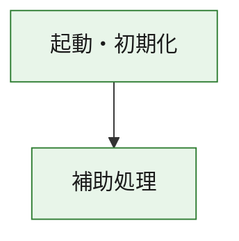
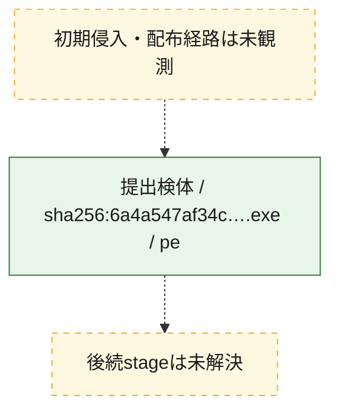
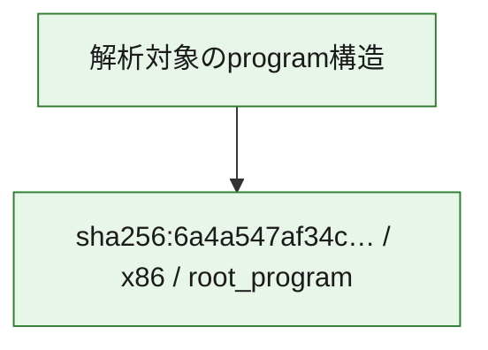

# 全体ロジック：6a4a547af34c7f39d5eada3ee15af2af8f3b4e52b1a1b04abbe9aa51bdcf8bfa

代表関数の静的証跡から、起動・初期化の処理群を確認しました。

## 読み方

- phaseの掲載順は解析上の整理順です。observed_call_edgesがない段階間の実行順を断定しません。
- 図の実線は静的に観測した関係、点線と黄色のノードは未観測・未解決の関係を示します。
- 図は静的な要約であり、動的実行を再現するものではありません。
- 詳細な関数解説とfingerprintは[STATIC-LOGIC.md](STATIC-LOGIC.md)を参照してください。

## 静的可視化

### 実行フロー

### 感染チェーン

### モジュール関係

## 処理段階

### 1. 起動・初期化

entry pointから初期化と後続処理への移行を確認します。
確度: `confirmed_static_function_evidence`

- `6a4a547af34c7f39d5eada3ee15af2af8f3b4e52b1a1b04abbe9aa51bdcf8bfa:ghidra:180001010` — 初期化と主要処理への分岐を行う入口関数です。 状態: `succeeded`、選定理由: `entry_point`, `meaningful_symbol_name`, `reviewed_call_centrality:22`, `role:entrypoint`, `small_program_complete_context`

### 2. 補助処理

主要処理を支える一般内部関数またはlibrary処理を確認します。
確度: `confirmed_static_function_evidence`

- `6a4a547af34c7f39d5eada3ee15af2af8f3b4e52b1a1b04abbe9aa51bdcf8bfa:ghidra:180001240` — 検体内部の一般処理を実装する関数です。 状態: `succeeded`、選定理由: `context_representative`, `reviewed_call_centrality:2`, `small_program_complete_context`
- `6a4a547af34c7f39d5eada3ee15af2af8f3b4e52b1a1b04abbe9aa51bdcf8bfa:ghidra:180001350` — 検体内部の一般処理を実装する関数です。 状態: `succeeded`、選定理由: `context_representative`, `reviewed_call_centrality:25`, `small_program_complete_context`
- `6a4a547af34c7f39d5eada3ee15af2af8f3b4e52b1a1b04abbe9aa51bdcf8bfa:ghidra:180003780` — 検体内部の一般処理を実装する関数です。 状態: `succeeded`、選定理由: `context_representative`, `reviewed_call_centrality:2`, `small_program_complete_context`
- `6a4a547af34c7f39d5eada3ee15af2af8f3b4e52b1a1b04abbe9aa51bdcf8bfa:ghidra:1800038e0` — 検体内部の一般処理を実装する関数です。 状態: `succeeded`、選定理由: `context_representative`, `reviewed_call_centrality:2`, `small_program_complete_context`

## 観測したcall関係

- `6a4a547af34c7f39d5eada3ee15af2af8f3b4e52b1a1b04abbe9aa51bdcf8bfa:ghidra:180001010` → `6a4a547af34c7f39d5eada3ee15af2af8f3b4e52b1a1b04abbe9aa51bdcf8bfa:ghidra:180001240` （`startup` → `support`）
- `6a4a547af34c7f39d5eada3ee15af2af8f3b4e52b1a1b04abbe9aa51bdcf8bfa:ghidra:180001010` → `6a4a547af34c7f39d5eada3ee15af2af8f3b4e52b1a1b04abbe9aa51bdcf8bfa:ghidra:180001350` （`startup` → `support`）
- `6a4a547af34c7f39d5eada3ee15af2af8f3b4e52b1a1b04abbe9aa51bdcf8bfa:ghidra:180001350` → `6a4a547af34c7f39d5eada3ee15af2af8f3b4e52b1a1b04abbe9aa51bdcf8bfa:ghidra:180001240` （`support` → `support`）
- `6a4a547af34c7f39d5eada3ee15af2af8f3b4e52b1a1b04abbe9aa51bdcf8bfa:ghidra:180001350` → `6a4a547af34c7f39d5eada3ee15af2af8f3b4e52b1a1b04abbe9aa51bdcf8bfa:ghidra:180003780` （`support` → `support`）
- `6a4a547af34c7f39d5eada3ee15af2af8f3b4e52b1a1b04abbe9aa51bdcf8bfa:ghidra:180001350` → `6a4a547af34c7f39d5eada3ee15af2af8f3b4e52b1a1b04abbe9aa51bdcf8bfa:ghidra:1800038e0` （`support` → `support`）
- `6a4a547af34c7f39d5eada3ee15af2af8f3b4e52b1a1b04abbe9aa51bdcf8bfa:ghidra:180003780` → `6a4a547af34c7f39d5eada3ee15af2af8f3b4e52b1a1b04abbe9aa51bdcf8bfa:ghidra:1800038e0` （`support` → `support`）
- `ghidra-function:02d3a250215a3b7b54aaa6fc` → `ghidra-external:03c3ff2861d8dbde203ed21c` （`unclassified` → `unclassified`）
- `ghidra-function:02d3a250215a3b7b54aaa6fc` → `ghidra-external:0bca97747df258b2779fba11` （`unclassified` → `unclassified`）
- `ghidra-function:02d3a250215a3b7b54aaa6fc` → `ghidra-external:14a7e2a408bfe8997a674b5d` （`unclassified` → `unclassified`）
- `ghidra-function:02d3a250215a3b7b54aaa6fc` → `ghidra-external:1683ed99983e9efa36e9cdfc` （`unclassified` → `unclassified`）
- `ghidra-function:02d3a250215a3b7b54aaa6fc` → `ghidra-external:2236d4ce1aa605ee9537be4e` （`unclassified` → `unclassified`）
- `ghidra-function:02d3a250215a3b7b54aaa6fc` → `ghidra-external:506fb5feee411b2ef6f709d3` （`unclassified` → `unclassified`）
- `ghidra-function:02d3a250215a3b7b54aaa6fc` → `ghidra-external:5697f00c6436555598ce8bf6` （`unclassified` → `unclassified`）
- `ghidra-function:02d3a250215a3b7b54aaa6fc` → `ghidra-external:5dd7b48e398ca1de8cdf53bf` （`unclassified` → `unclassified`）
- `ghidra-function:02d3a250215a3b7b54aaa6fc` → `ghidra-external:5ed83abdfde956b19c8a4e2f` （`unclassified` → `unclassified`）
- `ghidra-function:02d3a250215a3b7b54aaa6fc` → `ghidra-external:61d21073429df5c363d7f641` （`unclassified` → `unclassified`）
- `ghidra-function:02d3a250215a3b7b54aaa6fc` → `ghidra-external:68623e86a23a746582b9caf1` （`unclassified` → `unclassified`）
- `ghidra-function:02d3a250215a3b7b54aaa6fc` → `ghidra-external:6ce7b6e133e76d6d5ac9c139` （`unclassified` → `unclassified`）
- `ghidra-function:02d3a250215a3b7b54aaa6fc` → `ghidra-external:6e556b8c9591cc2922b3317e` （`unclassified` → `unclassified`）
- `ghidra-function:02d3a250215a3b7b54aaa6fc` → `ghidra-external:8e30b3ccecaa97ff85fb448b` （`unclassified` → `unclassified`）
- `ghidra-function:02d3a250215a3b7b54aaa6fc` → `ghidra-external:91f2e7d73b08a22776c648ae` （`unclassified` → `unclassified`）
- `ghidra-function:02d3a250215a3b7b54aaa6fc` → `ghidra-external:b71e34cce7efd2e24db6525b` （`unclassified` → `unclassified`）
- `ghidra-function:02d3a250215a3b7b54aaa6fc` → `ghidra-external:be277aff75b9732e66141277` （`unclassified` → `unclassified`）
- `ghidra-function:02d3a250215a3b7b54aaa6fc` → `ghidra-external:d582190a27c2035140e18a78` （`unclassified` → `unclassified`）
- `ghidra-function:02d3a250215a3b7b54aaa6fc` → `ghidra-external:e9f8f6386f3c9ad74e137efe` （`unclassified` → `unclassified`）
- `ghidra-function:02d3a250215a3b7b54aaa6fc` → `ghidra-external:f13130b88cb8e380f5fab131` （`unclassified` → `unclassified`）
- `ghidra-function:02d3a250215a3b7b54aaa6fc` → `ghidra-external:fd54742cfc6e8a0bdb9ab0a0` （`unclassified` → `unclassified`）
- `ghidra-function:02d3a250215a3b7b54aaa6fc` → `ghidra-function:06eedfe53a561248d23af4e0` （`unclassified` → `unclassified`）
- `ghidra-function:02d3a250215a3b7b54aaa6fc` → `ghidra-function:4c9f527e5ef98042ac131bd4` （`unclassified` → `unclassified`）
- `ghidra-function:02d3a250215a3b7b54aaa6fc` → `ghidra-function:5ae2c18aecb6a89de9d0c3fb` （`unclassified` → `unclassified`）
- `ghidra-function:4c9f527e5ef98042ac131bd4` → `ghidra-function:5ae2c18aecb6a89de9d0c3fb` （`unclassified` → `unclassified`）
- `ghidra-function:c7268596fbd79d6ed5c5d980` → `ghidra-function:02d3a250215a3b7b54aaa6fc` （`unclassified` → `unclassified`）
- `ghidra-function:c7268596fbd79d6ed5c5d980` → `ghidra-function:06eedfe53a561248d23af4e0` （`unclassified` → `unclassified`）
- `ghidra-function:c7268596fbd79d6ed5c5d980` → `ghidra-function:0f248952e6484067e10b1b32` （`unclassified` → `unclassified`）
- `ghidra-function:c7268596fbd79d6ed5c5d980` → `ghidra-function:1d509d6ca708867c94242992` （`unclassified` → `unclassified`）
- `ghidra-function:c7268596fbd79d6ed5c5d980` → `ghidra-function:35c3ee5862e3a279d202cf2b` （`unclassified` → `unclassified`）
- `ghidra-function:c7268596fbd79d6ed5c5d980` → `ghidra-function:461a06d24236d151987fe6df` （`unclassified` → `unclassified`）
- `ghidra-function:c7268596fbd79d6ed5c5d980` → `ghidra-function:94a3b54ce961561be5220144` （`unclassified` → `unclassified`）
- `ghidra-function:c7268596fbd79d6ed5c5d980` → `ghidra-function:ab0a8e9a615785241c541b2c` （`unclassified` → `unclassified`）
- `ghidra-function:c7268596fbd79d6ed5c5d980` → `ghidra-function:d4a12308a6b3e2ec0ac88c7a` （`unclassified` → `unclassified`）
- `ghidra-function:c7268596fbd79d6ed5c5d980` → `ghidra-function:de1cb3b83c768e719705deaf` （`unclassified` → `unclassified`）
- `ghidra-function:c7268596fbd79d6ed5c5d980` → `ghidra-function:e5edac560c4fea50c12078fe` （`unclassified` → `unclassified`）
- `ghidra-function:c7268596fbd79d6ed5c5d980` → `ghidra-function:e8b5968afb446f0652a48ba7` （`unclassified` → `unclassified`）

## 解析範囲と制約

- 選定外関数は全体inventoryへ残しますが、関数本体の個別解説対象にはしていません。
- indirect call、難読化、packer、VM、壊れたcontrol flowによりcall関係が欠落する場合があります。
- 文書は静的解析に基づき、検体実行や外部通信による動的確認は行っていません。
