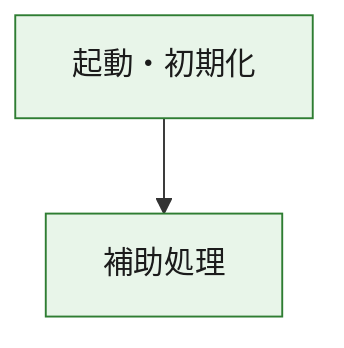
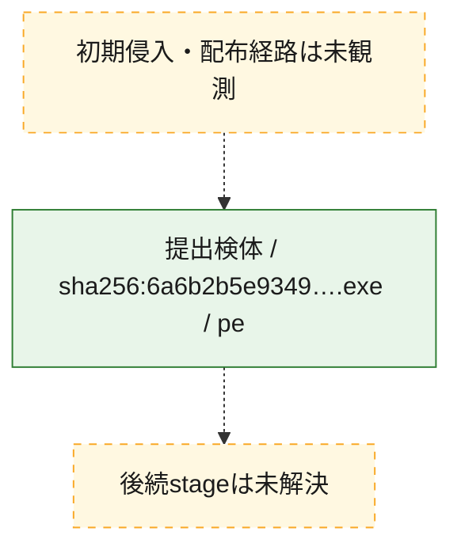
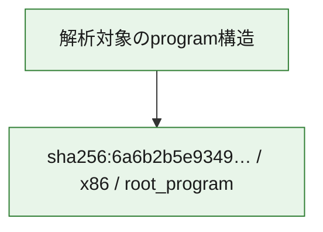

# 全体ロジック：6a6b2b5e9349887e370b97b2c4deb54898ec0736a6793cc4ca4b2620cb96d12b

代表関数の静的証跡から、起動・初期化の処理群を確認しました。

## 読み方

- phaseの掲載順は解析上の整理順です。observed_call_edgesがない段階間の実行順を断定しません。
- 図の実線は静的に観測した関係、点線と黄色のノードは未観測・未解決の関係を示します。
- 図は静的な要約であり、動的実行を再現するものではありません。
- 詳細な関数解説とfingerprintは[STATIC-LOGIC.md](STATIC-LOGIC.md)を参照してください。

## 静的可視化

### 実行フロー

### 感染チェーン

### モジュール関係

## 処理段階

### 1. 起動・初期化

entry pointから初期化と後続処理への移行を確認します。
確度: `confirmed_static_function_evidence`

- `6a6b2b5e9349887e370b97b2c4deb54898ec0736a6793cc4ca4b2620cb96d12b:ghidra:29a8611f0` — 初期化と主要処理への分岐を行う入口関数です。 状態: `succeeded`、選定理由: `entry_point`, `meaningful_symbol_name`, `reviewed_call_centrality:2`, `role:entrypoint`

### 2. 補助処理

主要処理を支える一般内部関数またはlibrary処理を確認します。
確度: `confirmed_static_function_evidence_with_limits`

- `6a6b2b5e9349887e370b97b2c4deb54898ec0736a6793cc4ca4b2620cb96d12b:ghidra:29a861000` — 検体内部の一般処理を実装する関数です。 状態: `succeeded`、選定理由: `context_representative`, `reviewed_call_centrality:14`
- `6a6b2b5e9349887e370b97b2c4deb54898ec0736a6793cc4ca4b2620cb96d12b:ghidra:29a861330` — 検体内部の一般処理を実装する関数です。 状態: `limited_bad_instruction_or_flow`、選定理由: `context_representative`, `reviewed_call_centrality:2`
- `6a6b2b5e9349887e370b97b2c4deb54898ec0736a6793cc4ca4b2620cb96d12b:ghidra:29a861340` — 検体内部の一般処理を実装する関数です。 状態: `limited_bad_instruction_or_flow`、選定理由: `context_representative`, `reviewed_call_centrality:2`
- `6a6b2b5e9349887e370b97b2c4deb54898ec0736a6793cc4ca4b2620cb96d12b:ghidra:29a861350` — 検体内部の一般処理を実装する関数です。 状態: `succeeded`、選定理由: `context_representative`
- `6a6b2b5e9349887e370b97b2c4deb54898ec0736a6793cc4ca4b2620cb96d12b:ghidra:29a882e80` — 検体内部の一般処理を実装する関数です。 状態: `succeeded`、選定理由: `context_representative`, `reviewed_call_centrality:4`
- `6a6b2b5e9349887e370b97b2c4deb54898ec0736a6793cc4ca4b2620cb96d12b:ghidra:29a882f80` — 検体内部の一般処理を実装する関数です。 状態: `succeeded`、選定理由: `context_representative`, `reviewed_call_centrality:4`
- `6a6b2b5e9349887e370b97b2c4deb54898ec0736a6793cc4ca4b2620cb96d12b:ghidra:29a882fe0` — 検体内部の一般処理を実装する関数です。 状態: `succeeded`、選定理由: `context_representative`, `reviewed_call_centrality:7`
- `6a6b2b5e9349887e370b97b2c4deb54898ec0736a6793cc4ca4b2620cb96d12b:ghidra:29a8830c0` — 検体内部の一般処理を実装する関数です。 状態: `succeeded`、選定理由: `context_representative`, `reviewed_call_centrality:1`
- `6a6b2b5e9349887e370b97b2c4deb54898ec0736a6793cc4ca4b2620cb96d12b:ghidra:29a883140` — 検体内部の一般処理を実装する関数です。 状態: `succeeded`、選定理由: `context_representative`, `reviewed_call_centrality:1`
- `6a6b2b5e9349887e370b97b2c4deb54898ec0736a6793cc4ca4b2620cb96d12b:ghidra:29a8831a0` — 検体内部の一般処理を実装する関数です。 状態: `succeeded`、選定理由: `context_representative`, `reviewed_call_centrality:2`
- `6a6b2b5e9349887e370b97b2c4deb54898ec0736a6793cc4ca4b2620cb96d12b:ghidra:29a883210` — 検体内部の一般処理を実装する関数です。 状態: `succeeded`、選定理由: `context_representative`
- `6a6b2b5e9349887e370b97b2c4deb54898ec0736a6793cc4ca4b2620cb96d12b:ghidra:29a883370` — 検体内部の一般処理を実装する関数です。 状態: `succeeded`、選定理由: `context_representative`
- `6a6b2b5e9349887e370b97b2c4deb54898ec0736a6793cc4ca4b2620cb96d12b:ghidra:29a8833a0` — 検体内部の一般処理を実装する関数です。 状態: `succeeded`、選定理由: `context_representative`
- `6a6b2b5e9349887e370b97b2c4deb54898ec0736a6793cc4ca4b2620cb96d12b:ghidra:29a8833e0` — 検体内部の一般処理を実装する関数です。 状態: `succeeded`、選定理由: `context_representative`, `reviewed_call_centrality:4`
- `6a6b2b5e9349887e370b97b2c4deb54898ec0736a6793cc4ca4b2620cb96d12b:ghidra:29a8834c0` — 検体内部の一般処理を実装する関数です。 状態: `succeeded`、選定理由: `context_representative`, `reviewed_call_centrality:1`
- `6a6b2b5e9349887e370b97b2c4deb54898ec0736a6793cc4ca4b2620cb96d12b:ghidra:29a883520` — 検体内部の一般処理を実装する関数です。 状態: `succeeded`、選定理由: `context_representative`
- `6a6b2b5e9349887e370b97b2c4deb54898ec0736a6793cc4ca4b2620cb96d12b:ghidra:29a8835a0` — 検体内部の一般処理を実装する関数です。 状態: `succeeded`、選定理由: `context_representative`
- `6a6b2b5e9349887e370b97b2c4deb54898ec0736a6793cc4ca4b2620cb96d12b:ghidra:29a883600` — 検体内部の一般処理を実装する関数です。 状態: `succeeded`、選定理由: `context_representative`, `reviewed_call_centrality:1`
- `6a6b2b5e9349887e370b97b2c4deb54898ec0736a6793cc4ca4b2620cb96d12b:ghidra:29a8836d0` — 検体内部の一般処理を実装する関数です。 状態: `succeeded`、選定理由: `context_representative`
- `6a6b2b5e9349887e370b97b2c4deb54898ec0736a6793cc4ca4b2620cb96d12b:ghidra:29a8837d0` — 検体内部の一般処理を実装する関数です。 状態: `succeeded`、選定理由: `context_representative`, `reviewed_call_centrality:2`
- `6a6b2b5e9349887e370b97b2c4deb54898ec0736a6793cc4ca4b2620cb96d12b:ghidra:29a883860` — 検体内部の一般処理を実装する関数です。 状態: `succeeded`、選定理由: `context_representative`, `reviewed_call_centrality:6`
- `6a6b2b5e9349887e370b97b2c4deb54898ec0736a6793cc4ca4b2620cb96d12b:ghidra:29a8839b0` — 検体内部の一般処理を実装する関数です。 状態: `succeeded`、選定理由: `context_representative`, `reviewed_call_centrality:6`
- `6a6b2b5e9349887e370b97b2c4deb54898ec0736a6793cc4ca4b2620cb96d12b:ghidra:29a883c20` — 検体内部の一般処理を実装する関数です。 状態: `succeeded`、選定理由: `context_representative`, `reviewed_call_centrality:5`
- `6a6b2b5e9349887e370b97b2c4deb54898ec0736a6793cc4ca4b2620cb96d12b:ghidra:29a883d30` — 検体内部の一般処理を実装する関数です。 状態: `succeeded`、選定理由: `context_representative`, `reviewed_call_centrality:4`
- `6a6b2b5e9349887e370b97b2c4deb54898ec0736a6793cc4ca4b2620cb96d12b:ghidra:29a883fb0` — 検体内部の一般処理を実装する関数です。 状態: `succeeded`、選定理由: `context_representative`, `reviewed_call_centrality:2`
- `6a6b2b5e9349887e370b97b2c4deb54898ec0736a6793cc4ca4b2620cb96d12b:ghidra:29a884050` — 検体内部の一般処理を実装する関数です。 状態: `succeeded`、選定理由: `context_representative`, `reviewed_call_centrality:27`
- `6a6b2b5e9349887e370b97b2c4deb54898ec0736a6793cc4ca4b2620cb96d12b:ghidra:29a884c00` — 検体内部の一般処理を実装する関数です。 状態: `succeeded`、選定理由: `context_representative`, `reviewed_call_centrality:6`
- `6a6b2b5e9349887e370b97b2c4deb54898ec0736a6793cc4ca4b2620cb96d12b:ghidra:29a884d20` — 検体内部の一般処理を実装する関数です。 状態: `succeeded`、選定理由: `context_representative`, `reviewed_call_centrality:4`
- `6a6b2b5e9349887e370b97b2c4deb54898ec0736a6793cc4ca4b2620cb96d12b:ghidra:29a890030` — compiler生成処理または汎用library処理とみられる関数です。 状態: `succeeded`、選定理由: `entry_point`, `meaningful_symbol_name`, `reviewed_call_centrality:7`
- `6a6b2b5e9349887e370b97b2c4deb54898ec0736a6793cc4ca4b2620cb96d12b:ghidra:29a890050` — compiler生成処理または汎用library処理とみられる関数です。 状態: `succeeded`、選定理由: `entry_point`, `meaningful_symbol_name`, `reviewed_call_centrality:4`
- `6a6b2b5e9349887e370b97b2c4deb54898ec0736a6793cc4ca4b2620cb96d12b:ghidra:29a89eb00` — compiler生成処理または汎用library処理とみられる関数です。 状態: `limited_bad_instruction_or_flow`、選定理由: `entry_point`, `meaningful_symbol_name`, `reviewed_call_centrality:12`

## 観測したcall関係

- `6a6b2b5e9349887e370b97b2c4deb54898ec0736a6793cc4ca4b2620cb96d12b:ghidra:29a861000` → `6a6b2b5e9349887e370b97b2c4deb54898ec0736a6793cc4ca4b2620cb96d12b:ghidra:29a890050` （`support` → `support`）
- `6a6b2b5e9349887e370b97b2c4deb54898ec0736a6793cc4ca4b2620cb96d12b:ghidra:29a8611f0` → `6a6b2b5e9349887e370b97b2c4deb54898ec0736a6793cc4ca4b2620cb96d12b:ghidra:29a861000` （`startup` → `support`）
- `6a6b2b5e9349887e370b97b2c4deb54898ec0736a6793cc4ca4b2620cb96d12b:ghidra:29a8830c0` → `6a6b2b5e9349887e370b97b2c4deb54898ec0736a6793cc4ca4b2620cb96d12b:ghidra:29a882fe0` （`support` → `support`）
- `6a6b2b5e9349887e370b97b2c4deb54898ec0736a6793cc4ca4b2620cb96d12b:ghidra:29a8831a0` → `6a6b2b5e9349887e370b97b2c4deb54898ec0736a6793cc4ca4b2620cb96d12b:ghidra:29a882fe0` （`support` → `support`）
- `6a6b2b5e9349887e370b97b2c4deb54898ec0736a6793cc4ca4b2620cb96d12b:ghidra:29a8837d0` → `6a6b2b5e9349887e370b97b2c4deb54898ec0736a6793cc4ca4b2620cb96d12b:ghidra:29a882fe0` （`support` → `support`）
- `6a6b2b5e9349887e370b97b2c4deb54898ec0736a6793cc4ca4b2620cb96d12b:ghidra:29a883860` → `6a6b2b5e9349887e370b97b2c4deb54898ec0736a6793cc4ca4b2620cb96d12b:ghidra:29a882f80` （`support` → `support`）
- `6a6b2b5e9349887e370b97b2c4deb54898ec0736a6793cc4ca4b2620cb96d12b:ghidra:29a883860` → `6a6b2b5e9349887e370b97b2c4deb54898ec0736a6793cc4ca4b2620cb96d12b:ghidra:29a882fe0` （`support` → `support`）
- `6a6b2b5e9349887e370b97b2c4deb54898ec0736a6793cc4ca4b2620cb96d12b:ghidra:29a8839b0` → `6a6b2b5e9349887e370b97b2c4deb54898ec0736a6793cc4ca4b2620cb96d12b:ghidra:29a882f80` （`support` → `support`）
- `6a6b2b5e9349887e370b97b2c4deb54898ec0736a6793cc4ca4b2620cb96d12b:ghidra:29a8839b0` → `6a6b2b5e9349887e370b97b2c4deb54898ec0736a6793cc4ca4b2620cb96d12b:ghidra:29a882fe0` （`support` → `support`）
- `6a6b2b5e9349887e370b97b2c4deb54898ec0736a6793cc4ca4b2620cb96d12b:ghidra:29a883c20` → `6a6b2b5e9349887e370b97b2c4deb54898ec0736a6793cc4ca4b2620cb96d12b:ghidra:29a882f80` （`support` → `support`）
- `6a6b2b5e9349887e370b97b2c4deb54898ec0736a6793cc4ca4b2620cb96d12b:ghidra:29a883c20` → `6a6b2b5e9349887e370b97b2c4deb54898ec0736a6793cc4ca4b2620cb96d12b:ghidra:29a882fe0` （`support` → `support`）
- `6a6b2b5e9349887e370b97b2c4deb54898ec0736a6793cc4ca4b2620cb96d12b:ghidra:29a883d30` → `6a6b2b5e9349887e370b97b2c4deb54898ec0736a6793cc4ca4b2620cb96d12b:ghidra:29a882e80` （`support` → `support`）
- `6a6b2b5e9349887e370b97b2c4deb54898ec0736a6793cc4ca4b2620cb96d12b:ghidra:29a883d30` → `6a6b2b5e9349887e370b97b2c4deb54898ec0736a6793cc4ca4b2620cb96d12b:ghidra:29a883c20` （`support` → `support`）
- `6a6b2b5e9349887e370b97b2c4deb54898ec0736a6793cc4ca4b2620cb96d12b:ghidra:29a883fb0` → `6a6b2b5e9349887e370b97b2c4deb54898ec0736a6793cc4ca4b2620cb96d12b:ghidra:29a882e80` （`support` → `support`）
- `6a6b2b5e9349887e370b97b2c4deb54898ec0736a6793cc4ca4b2620cb96d12b:ghidra:29a883fb0` → `6a6b2b5e9349887e370b97b2c4deb54898ec0736a6793cc4ca4b2620cb96d12b:ghidra:29a883c20` （`support` → `support`）
- `6a6b2b5e9349887e370b97b2c4deb54898ec0736a6793cc4ca4b2620cb96d12b:ghidra:29a884050` → `6a6b2b5e9349887e370b97b2c4deb54898ec0736a6793cc4ca4b2620cb96d12b:ghidra:29a882e80` （`support` → `support`）
- `6a6b2b5e9349887e370b97b2c4deb54898ec0736a6793cc4ca4b2620cb96d12b:ghidra:29a884050` → `6a6b2b5e9349887e370b97b2c4deb54898ec0736a6793cc4ca4b2620cb96d12b:ghidra:29a882f80` （`support` → `support`）
- `6a6b2b5e9349887e370b97b2c4deb54898ec0736a6793cc4ca4b2620cb96d12b:ghidra:29a884050` → `6a6b2b5e9349887e370b97b2c4deb54898ec0736a6793cc4ca4b2620cb96d12b:ghidra:29a882fe0` （`support` → `support`）
- `6a6b2b5e9349887e370b97b2c4deb54898ec0736a6793cc4ca4b2620cb96d12b:ghidra:29a884050` → `6a6b2b5e9349887e370b97b2c4deb54898ec0736a6793cc4ca4b2620cb96d12b:ghidra:29a883140` （`support` → `support`）
- `6a6b2b5e9349887e370b97b2c4deb54898ec0736a6793cc4ca4b2620cb96d12b:ghidra:29a884050` → `6a6b2b5e9349887e370b97b2c4deb54898ec0736a6793cc4ca4b2620cb96d12b:ghidra:29a8831a0` （`support` → `support`）
- `6a6b2b5e9349887e370b97b2c4deb54898ec0736a6793cc4ca4b2620cb96d12b:ghidra:29a884050` → `6a6b2b5e9349887e370b97b2c4deb54898ec0736a6793cc4ca4b2620cb96d12b:ghidra:29a8834c0` （`support` → `support`）
- `6a6b2b5e9349887e370b97b2c4deb54898ec0736a6793cc4ca4b2620cb96d12b:ghidra:29a884050` → `6a6b2b5e9349887e370b97b2c4deb54898ec0736a6793cc4ca4b2620cb96d12b:ghidra:29a8837d0` （`support` → `support`）
- `6a6b2b5e9349887e370b97b2c4deb54898ec0736a6793cc4ca4b2620cb96d12b:ghidra:29a884050` → `6a6b2b5e9349887e370b97b2c4deb54898ec0736a6793cc4ca4b2620cb96d12b:ghidra:29a883c20` （`support` → `support`）
- `6a6b2b5e9349887e370b97b2c4deb54898ec0736a6793cc4ca4b2620cb96d12b:ghidra:29a884050` → `6a6b2b5e9349887e370b97b2c4deb54898ec0736a6793cc4ca4b2620cb96d12b:ghidra:29a883d30` （`support` → `support`）
- `6a6b2b5e9349887e370b97b2c4deb54898ec0736a6793cc4ca4b2620cb96d12b:ghidra:29a884050` → `6a6b2b5e9349887e370b97b2c4deb54898ec0736a6793cc4ca4b2620cb96d12b:ghidra:29a884c00` （`support` → `support`）
- `6a6b2b5e9349887e370b97b2c4deb54898ec0736a6793cc4ca4b2620cb96d12b:ghidra:29a884050` → `6a6b2b5e9349887e370b97b2c4deb54898ec0736a6793cc4ca4b2620cb96d12b:ghidra:29a884d20` （`support` → `support`）
- `6a6b2b5e9349887e370b97b2c4deb54898ec0736a6793cc4ca4b2620cb96d12b:ghidra:29a884c00` → `6a6b2b5e9349887e370b97b2c4deb54898ec0736a6793cc4ca4b2620cb96d12b:ghidra:29a882e80` （`support` → `support`）
- `6a6b2b5e9349887e370b97b2c4deb54898ec0736a6793cc4ca4b2620cb96d12b:ghidra:29a884c00` → `6a6b2b5e9349887e370b97b2c4deb54898ec0736a6793cc4ca4b2620cb96d12b:ghidra:29a884050` （`support` → `support`）
- `6a6b2b5e9349887e370b97b2c4deb54898ec0736a6793cc4ca4b2620cb96d12b:ghidra:29a884d20` → `6a6b2b5e9349887e370b97b2c4deb54898ec0736a6793cc4ca4b2620cb96d12b:ghidra:29a884050` （`support` → `support`）
- `6a6b2b5e9349887e370b97b2c4deb54898ec0736a6793cc4ca4b2620cb96d12b:ghidra:29a884d20` → `6a6b2b5e9349887e370b97b2c4deb54898ec0736a6793cc4ca4b2620cb96d12b:ghidra:29a884c00` （`support` → `support`）
- `ghidra-function:157f30f7db661f4efdb91229` → `ghidra-external:8ef9b605fa61440b27fab506` （`unclassified` → `unclassified`）
- `ghidra-function:157f30f7db661f4efdb91229` → `ghidra-function:24a20b484bdcf0e4ed5e4d55` （`unclassified` → `unclassified`）
- `ghidra-function:157f30f7db661f4efdb91229` → `ghidra-function:449859a857109369d5ee93c4` （`unclassified` → `unclassified`）
- `ghidra-function:157f30f7db661f4efdb91229` → `ghidra-function:4a68214be2d8fe4df338350b` （`unclassified` → `unclassified`）
- `ghidra-function:157f30f7db661f4efdb91229` → `ghidra-function:602f25aaae3170d757bd9e6f` （`unclassified` → `unclassified`）
- `ghidra-function:157f30f7db661f4efdb91229` → `ghidra-function:70c3bb8f9f5776484eaf0918` （`unclassified` → `unclassified`）
- `ghidra-function:1d87d90317fe61f8bd31598e` → `ghidra-external:8ef9b605fa61440b27fab506` （`unclassified` → `unclassified`）
- `ghidra-function:1d87d90317fe61f8bd31598e` → `ghidra-function:24a20b484bdcf0e4ed5e4d55` （`unclassified` → `unclassified`）
- `ghidra-function:1d87d90317fe61f8bd31598e` → `ghidra-function:449859a857109369d5ee93c4` （`unclassified` → `unclassified`）
- `ghidra-function:1d87d90317fe61f8bd31598e` → `ghidra-function:4a68214be2d8fe4df338350b` （`unclassified` → `unclassified`）
- `ghidra-function:1d87d90317fe61f8bd31598e` → `ghidra-function:602f25aaae3170d757bd9e6f` （`unclassified` → `unclassified`）
- `ghidra-function:1d87d90317fe61f8bd31598e` → `ghidra-function:70c3bb8f9f5776484eaf0918` （`unclassified` → `unclassified`）
- `ghidra-function:50ae0f8d5a4d8bd5fd4cb30a` → `ghidra-external:e7835f38759e7f3bcb35d9ac` （`unclassified` → `unclassified`）
- `ghidra-function:50ae0f8d5a4d8bd5fd4cb30a` → `ghidra-function:00c2349b245fcaefff860560` （`unclassified` → `unclassified`）
- `ghidra-function:50ae0f8d5a4d8bd5fd4cb30a` → `ghidra-function:24a20b484bdcf0e4ed5e4d55` （`unclassified` → `unclassified`）
- `ghidra-function:50ae0f8d5a4d8bd5fd4cb30a` → `ghidra-function:f022b676d8efcd730d86f22a` （`unclassified` → `unclassified`）
- `ghidra-function:5ef9f64805877ef39a508d48` → `ghidra-function:449859a857109369d5ee93c4` （`unclassified` → `unclassified`）
- `ghidra-function:6263813db962808dcaf6b9ed` → `ghidra-function:449859a857109369d5ee93c4` （`unclassified` → `unclassified`）
- `ghidra-function:721681b3ed9883ee5c921b7f` → `ghidra-external:41e771f10f73e9183b3316d1` （`unclassified` → `unclassified`）
- `ghidra-function:721681b3ed9883ee5c921b7f` → `ghidra-function:03ff817ee447e6fb24339fea` （`unclassified` → `unclassified`）
- `ghidra-function:721681b3ed9883ee5c921b7f` → `ghidra-function:2494e4f6d1394b778943fa17` （`unclassified` → `unclassified`）
- `ghidra-function:721681b3ed9883ee5c921b7f` → `ghidra-function:3507526996b8a8cc3516034e` （`unclassified` → `unclassified`）
- `ghidra-function:721681b3ed9883ee5c921b7f` → `ghidra-function:490e899ca5ac4c9c5fb18816` （`unclassified` → `unclassified`）
- `ghidra-function:721681b3ed9883ee5c921b7f` → `ghidra-function:81888cbb398cde19186a5ab6` （`unclassified` → `unclassified`）
- `ghidra-function:721681b3ed9883ee5c921b7f` → `ghidra-function:d31f57c9d022f98e204983ec` （`unclassified` → `unclassified`）
- `ghidra-function:721681b3ed9883ee5c921b7f` → `ghidra-function:d75e1d99cc2bf922e7cd7c53` （`unclassified` → `unclassified`）
- `ghidra-function:721681b3ed9883ee5c921b7f` → `ghidra-function:e3b65426009f632ccb1a4618` （`unclassified` → `unclassified`）
- `ghidra-function:7c8c209d7608acee24544a69` → `ghidra-function:00c2349b245fcaefff860560` （`unclassified` → `unclassified`）
- `ghidra-function:7c8c209d7608acee24544a69` → `ghidra-function:bb4bbee8dfd3474e1efcace3` （`unclassified` → `unclassified`）
- `ghidra-function:8e24cf686f4e89068757b4c9` → `ghidra-function:5adcf8c3f4e8c599097fd1ed` （`unclassified` → `unclassified`）
- `ghidra-function:a22c89fa922ca8ea2b061344` → `ghidra-external:e7835f38759e7f3bcb35d9ac` （`unclassified` → `unclassified`）
- `ghidra-function:a22c89fa922ca8ea2b061344` → `ghidra-function:50ae0f8d5a4d8bd5fd4cb30a` （`unclassified` → `unclassified`）
- `ghidra-function:a22c89fa922ca8ea2b061344` → `ghidra-function:f022b676d8efcd730d86f22a` （`unclassified` → `unclassified`）
- `ghidra-function:a54fc6b91155bc62555e2886` → `ghidra-external:1bb04c317b667416fec6e8a9` （`unclassified` → `unclassified`）
- `ghidra-function:a54fc6b91155bc62555e2886` → `ghidra-external:212d35f01e00211a95f7b51d` （`unclassified` → `unclassified`）
- `ghidra-function:a54fc6b91155bc62555e2886` → `ghidra-external:5ad060d540c5502419d756f6` （`unclassified` → `unclassified`）
- `ghidra-function:a54fc6b91155bc62555e2886` → `ghidra-external:a12b07370f89d6dd40badb9a` （`unclassified` → `unclassified`）
- `ghidra-function:a54fc6b91155bc62555e2886` → `ghidra-external:b0eca8137d3b3693fabbebe5` （`unclassified` → `unclassified`）
- `ghidra-function:a54fc6b91155bc62555e2886` → `ghidra-external:b9f230ec0b8cbcae474c2aae` （`unclassified` → `unclassified`）
- `ghidra-function:a54fc6b91155bc62555e2886` → `ghidra-external:c86bc8753b72e5474668b1c1` （`unclassified` → `unclassified`）
- `ghidra-function:a54fc6b91155bc62555e2886` → `ghidra-function:35892001c851987990c18c26` （`unclassified` → `unclassified`）
- `ghidra-function:a54fc6b91155bc62555e2886` → `ghidra-function:5a50c78f9d4780d6edf15ab6` （`unclassified` → `unclassified`）
- `ghidra-function:a54fc6b91155bc62555e2886` → `ghidra-function:896f5d93ac9916e1f8fc274b` （`unclassified` → `unclassified`）
- `ghidra-function:a54fc6b91155bc62555e2886` → `ghidra-function:d4f1240fbad1d11cd63ee712` （`unclassified` → `unclassified`）
- `ghidra-function:a54fc6b91155bc62555e2886` → `ghidra-function:db6b3d6c1d45b1fe7f685c2a` （`unclassified` → `unclassified`）
- `ghidra-function:a7e0299df3d89b146e2277c8` → `ghidra-function:449859a857109369d5ee93c4` （`unclassified` → `unclassified`）
- `ghidra-function:a9985640c30024d1fc4f42e0` → `ghidra-external:4e79e8391060612351916731` （`unclassified` → `unclassified`）
- `ghidra-function:a9985640c30024d1fc4f42e0` → `ghidra-function:00c2349b245fcaefff860560` （`unclassified` → `unclassified`）
- `ghidra-function:a9985640c30024d1fc4f42e0` → `ghidra-function:bb4bbee8dfd3474e1efcace3` （`unclassified` → `unclassified`）
- `ghidra-function:ad3662f29e4a4a2d39634ecf` → `ghidra-external:1ca45c0660f2ba4378b16002` （`unclassified` → `unclassified`）
- `ghidra-function:ad3662f29e4a4a2d39634ecf` → `ghidra-external:41e771f10f73e9183b3316d1` （`unclassified` → `unclassified`）
- `ghidra-function:ad3662f29e4a4a2d39634ecf` → `ghidra-external:8d5e9eb19cd766f95953f365` （`unclassified` → `unclassified`）
- `ghidra-function:ad3662f29e4a4a2d39634ecf` → `ghidra-external:d64519613b46a7ae6b538d55` （`unclassified` → `unclassified`）
- `ghidra-function:bb4bbee8dfd3474e1efcace3` → `ghidra-function:449859a857109369d5ee93c4` （`unclassified` → `unclassified`）
- `ghidra-function:bb4bbee8dfd3474e1efcace3` → `ghidra-function:602f25aaae3170d757bd9e6f` （`unclassified` → `unclassified`）
- `ghidra-function:be6e5bd8aff4b8add021939a` → `ghidra-function:5adcf8c3f4e8c599097fd1ed` （`unclassified` → `unclassified`）
- `ghidra-function:d07a6d74956f01e678d8c6c7` → `ghidra-external:b0eca8137d3b3693fabbebe5` （`unclassified` → `unclassified`）
- `ghidra-function:d07a6d74956f01e678d8c6c7` → `ghidra-function:a54fc6b91155bc62555e2886` （`unclassified` → `unclassified`）
- `ghidra-function:d4f1240fbad1d11cd63ee712` → `ghidra-external:e7835f38759e7f3bcb35d9ac` （`unclassified` → `unclassified`）
- `ghidra-function:d4f1240fbad1d11cd63ee712` → `ghidra-function:2ccc86138dc039e3808421a6` （`unclassified` → `unclassified`）
- `ghidra-function:f022b676d8efcd730d86f22a` → `ghidra-external:6bdb559c44a2713b7f0205d0` （`unclassified` → `unclassified`）
- `ghidra-function:f022b676d8efcd730d86f22a` → `ghidra-external:8ef9b605fa61440b27fab506` （`unclassified` → `unclassified`）
- `ghidra-function:f022b676d8efcd730d86f22a` → `ghidra-function:00c2349b245fcaefff860560` （`unclassified` → `unclassified`）
- `ghidra-function:f022b676d8efcd730d86f22a` → `ghidra-function:0dd94e32786f9667c569b63b` （`unclassified` → `unclassified`）
- `ghidra-function:f022b676d8efcd730d86f22a` → `ghidra-function:24a20b484bdcf0e4ed5e4d55` （`unclassified` → `unclassified`）
- `ghidra-function:f022b676d8efcd730d86f22a` → `ghidra-function:449859a857109369d5ee93c4` （`unclassified` → `unclassified`）
- `ghidra-function:f022b676d8efcd730d86f22a` → `ghidra-function:4a68214be2d8fe4df338350b` （`unclassified` → `unclassified`）
- `ghidra-function:f022b676d8efcd730d86f22a` → `ghidra-function:50ae0f8d5a4d8bd5fd4cb30a` （`unclassified` → `unclassified`）
- `ghidra-function:f022b676d8efcd730d86f22a` → `ghidra-function:5ef9f64805877ef39a508d48` （`unclassified` → `unclassified`）
- `ghidra-function:f022b676d8efcd730d86f22a` → `ghidra-function:602f25aaae3170d757bd9e6f` （`unclassified` → `unclassified`）
- `ghidra-function:f022b676d8efcd730d86f22a` → `ghidra-function:65ad9e743a120a74fd97d8c8` （`unclassified` → `unclassified`）
- `ghidra-function:f022b676d8efcd730d86f22a` → `ghidra-function:70c3bb8f9f5776484eaf0918` （`unclassified` → `unclassified`）
- `ghidra-function:f022b676d8efcd730d86f22a` → `ghidra-function:77bd3cebb13b7f77763864c0` （`unclassified` → `unclassified`）
- `ghidra-function:f022b676d8efcd730d86f22a` → `ghidra-function:7c57e1f9cf91be447bb959c2` （`unclassified` → `unclassified`）
- `ghidra-function:f022b676d8efcd730d86f22a` → `ghidra-function:a22c89fa922ca8ea2b061344` （`unclassified` → `unclassified`）
- `ghidra-function:f022b676d8efcd730d86f22a` → `ghidra-function:a7e0299df3d89b146e2277c8` （`unclassified` → `unclassified`）
- `ghidra-function:f022b676d8efcd730d86f22a` → `ghidra-function:a888c36462b01382ca6c3034` （`unclassified` → `unclassified`）
- `ghidra-function:f022b676d8efcd730d86f22a` → `ghidra-function:a9985640c30024d1fc4f42e0` （`unclassified` → `unclassified`）
- `ghidra-function:f022b676d8efcd730d86f22a` → `ghidra-function:bb4bbee8dfd3474e1efcace3` （`unclassified` → `unclassified`）
- `ghidra-function:f022b676d8efcd730d86f22a` → `ghidra-function:bb4d54b602871d012b81df64` （`unclassified` → `unclassified`）
- `ghidra-function:f022b676d8efcd730d86f22a` → `ghidra-function:d4efd7fd8907cef0b1673420` （`unclassified` → `unclassified`）
- `ghidra-function:f022b676d8efcd730d86f22a` → `ghidra-function:e1677a4edd49e11c5adebbaf` （`unclassified` → `unclassified`）
- `ghidra-function:f022b676d8efcd730d86f22a` → `ghidra-function:e2c38697fb4122addb955a60` （`unclassified` → `unclassified`）
- `ghidra-function:f022b676d8efcd730d86f22a` → `ghidra-function:ef1ffa5ff8e90b05c2f1474f` （`unclassified` → `unclassified`）
- `ghidra-function:f022b676d8efcd730d86f22a` → `ghidra-function:f178648af7ddc147a6e07686` （`unclassified` → `unclassified`）
- `ghidra-function:f2de3ff38c1114a0ebedde43` → `ghidra-external:8d5e9eb19cd766f95953f365` （`unclassified` → `unclassified`）
- `ghidra-function:f2de3ff38c1114a0ebedde43` → `ghidra-function:2ccc86138dc039e3808421a6` （`unclassified` → `unclassified`）
- `ghidra-function:f2de3ff38c1114a0ebedde43` → `ghidra-function:527b7291095cd980cea67b88` （`unclassified` → `unclassified`）
- `ghidra-function:f2de3ff38c1114a0ebedde43` → `ghidra-function:a7bef35d58ad78c71658792a` （`unclassified` → `unclassified`）
- `ghidra-function:f2de3ff38c1114a0ebedde43` → `ghidra-function:b2e10068bcb0a87e63059c86` （`unclassified` → `unclassified`）
- `ghidra-function:feae533d735bb378c58387f1` → `ghidra-external:8ef9b605fa61440b27fab506` （`unclassified` → `unclassified`）

## 解析範囲と制約

- 選定外関数は全体inventoryへ残しますが、関数本体の個別解説対象にはしていません。
- indirect call、難読化、packer、VM、壊れたcontrol flowによりcall関係が欠落する場合があります。
- 文書は静的解析に基づき、検体実行や外部通信による動的確認は行っていません。
