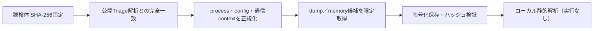

# Triage公開解析・後段取得証跡

## 完全ハッシュ一致

- [260805-sxtxbabl6s](https://tria.ge/260805-sxtxbabl6s): ファミリー候補 `needle_stealer, phorphiex, xmrig`、評価score `10`

## プロセス・通信

- 観測process: `1052123033.exe, 1924511184.exe, 2111219655.exe, 2170140522.exe, 223869192.exe, 2254412573.exe, 2381834878.exe, 2462913093.exe, 2796832103.exe, 3126733492.exe, 3199438879.exe, 3303828625.exe, 3811212450.exe, 3999021643.exe, 4104719196.exe, 909030115.exe, 967918214.exe, 977531553.exe, cmd.exe, dwm.exe, file.exe, sc.exe, sysfrodolv.exe, sysmgnrsv.exe, syswinprdrvc.exe, taskkill.exe`
- raw commandは保存せず、command SHA-256と処理patternだけをJSONへ保持しています。
- sandbox background trafficは`context_only`であり、C2へ自動昇格しません。

- `http://130.12.180.135:3000/api/v2`（sandbox config候補）
- `http://178.16.54.109/c/`（sandbox config候補）
- `http://178.16.54.109/spm/`（sandbox config候補）
- `http://178.16.54.109/spmm/`（sandbox config候補）
- `http://178.16.55.240/`（sandbox config候補）
- `http://178.16.55.240/l/`（sandbox config候補）
- `http://178.16.55.240/nm/`（sandbox config候補）
- `http://178.16.55.240/nmm/`（sandbox config候補）

## 二段目成果物

- `bddbed57dd412c52cb60093dd8bf887f96979f8451933b36e406fa46f290f57c` / `dumped_file` / 18432 bytes / 親と同一: `false` / 静的解析: `partial`
- `ed1d3f69fbbd5576c2ed8dba45ba22c4f6884eb311d4f6e389203846d512ec11` / `dumped_file` / 8744960 bytes / 親と同一: `false` / 静的解析: `partial`

## 判定境界

Triage由来のfamily、process、config、通信は外部sandbox証跡です。config extractorが返したendpointはC2候補として扱えますが、
静的設定復元またはprocess帰属とprotocol応答が揃うまでは確認済みC2とはしません。取得成果物と検体は実行していません。
