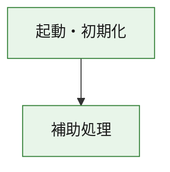
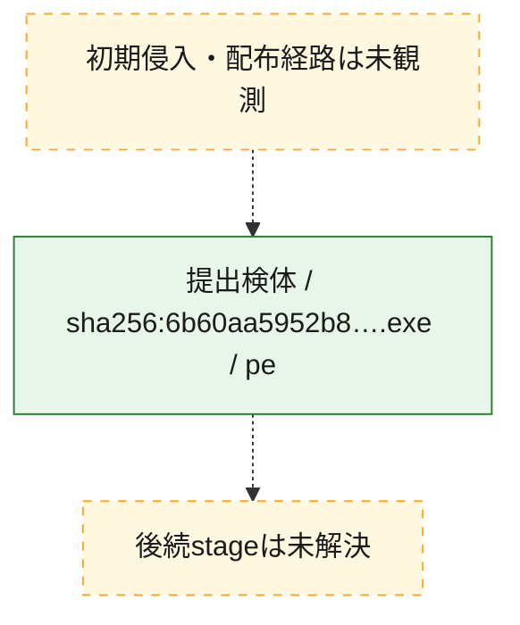
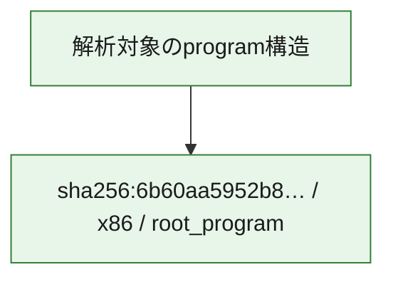

# 全体ロジック：6b60aa5952b87d8a402bf833f3eca4e12007b381c994eaa22802099aa9ed55ac

代表関数の静的証跡から、起動・初期化の処理群を確認しました。

## 読み方

- phaseの掲載順は解析上の整理順です。observed_call_edgesがない段階間の実行順を断定しません。
- 図の実線は静的に観測した関係、点線と黄色のノードは未観測・未解決の関係を示します。
- 図は静的な要約であり、動的実行を再現するものではありません。
- 詳細な関数解説とfingerprintは[STATIC-LOGIC.md](STATIC-LOGIC.md)を参照してください。

## 静的可視化

### 実行フロー

### 感染チェーン

### モジュール関係

## 処理段階

### 1. 起動・初期化

entry pointから初期化と後続処理への移行を確認します。
確度: `confirmed_static_function_evidence`

- `6b60aa5952b87d8a402bf833f3eca4e12007b381c994eaa22802099aa9ed55ac:ghidra:180001010` — 初期化と主要処理への分岐を行う入口関数です。 状態: `succeeded`、選定理由: `entry_point`, `meaningful_symbol_name`, `reviewed_call_centrality:22`, `role:entrypoint`, `small_program_complete_context`

### 2. 補助処理

主要処理を支える一般内部関数またはlibrary処理を確認します。
確度: `confirmed_static_function_evidence`

- `6b60aa5952b87d8a402bf833f3eca4e12007b381c994eaa22802099aa9ed55ac:ghidra:180001240` — 検体内部の一般処理を実装する関数です。 状態: `succeeded`、選定理由: `context_representative`, `reviewed_call_centrality:2`, `small_program_complete_context`
- `6b60aa5952b87d8a402bf833f3eca4e12007b381c994eaa22802099aa9ed55ac:ghidra:180001350` — 検体内部の一般処理を実装する関数です。 状態: `succeeded`、選定理由: `context_representative`, `reviewed_call_centrality:25`, `small_program_complete_context`
- `6b60aa5952b87d8a402bf833f3eca4e12007b381c994eaa22802099aa9ed55ac:ghidra:180003780` — 検体内部の一般処理を実装する関数です。 状態: `succeeded`、選定理由: `context_representative`, `reviewed_call_centrality:2`, `small_program_complete_context`
- `6b60aa5952b87d8a402bf833f3eca4e12007b381c994eaa22802099aa9ed55ac:ghidra:1800038e0` — 検体内部の一般処理を実装する関数です。 状態: `succeeded`、選定理由: `context_representative`, `reviewed_call_centrality:2`, `small_program_complete_context`

## 観測したcall関係

- `6b60aa5952b87d8a402bf833f3eca4e12007b381c994eaa22802099aa9ed55ac:ghidra:180001010` → `6b60aa5952b87d8a402bf833f3eca4e12007b381c994eaa22802099aa9ed55ac:ghidra:180001240` （`startup` → `support`）
- `6b60aa5952b87d8a402bf833f3eca4e12007b381c994eaa22802099aa9ed55ac:ghidra:180001010` → `6b60aa5952b87d8a402bf833f3eca4e12007b381c994eaa22802099aa9ed55ac:ghidra:180001350` （`startup` → `support`）
- `6b60aa5952b87d8a402bf833f3eca4e12007b381c994eaa22802099aa9ed55ac:ghidra:180001350` → `6b60aa5952b87d8a402bf833f3eca4e12007b381c994eaa22802099aa9ed55ac:ghidra:180001240` （`support` → `support`）
- `6b60aa5952b87d8a402bf833f3eca4e12007b381c994eaa22802099aa9ed55ac:ghidra:180001350` → `6b60aa5952b87d8a402bf833f3eca4e12007b381c994eaa22802099aa9ed55ac:ghidra:180003780` （`support` → `support`）
- `6b60aa5952b87d8a402bf833f3eca4e12007b381c994eaa22802099aa9ed55ac:ghidra:180001350` → `6b60aa5952b87d8a402bf833f3eca4e12007b381c994eaa22802099aa9ed55ac:ghidra:1800038e0` （`support` → `support`）
- `6b60aa5952b87d8a402bf833f3eca4e12007b381c994eaa22802099aa9ed55ac:ghidra:180003780` → `6b60aa5952b87d8a402bf833f3eca4e12007b381c994eaa22802099aa9ed55ac:ghidra:1800038e0` （`support` → `support`）
- `ghidra-function:44721d78b013b619d4008c94` → `ghidra-external:0a4d94390b3565b6d9680203` （`unclassified` → `unclassified`）
- `ghidra-function:44721d78b013b619d4008c94` → `ghidra-external:1d112b1f1cae165f8e8c10e9` （`unclassified` → `unclassified`）
- `ghidra-function:44721d78b013b619d4008c94` → `ghidra-external:287c9ee5802881a4cdfa604d` （`unclassified` → `unclassified`）
- `ghidra-function:44721d78b013b619d4008c94` → `ghidra-external:3b2d46655f029d0d74954e00` （`unclassified` → `unclassified`）
- `ghidra-function:44721d78b013b619d4008c94` → `ghidra-external:4890c18ae465edbd67d9dc27` （`unclassified` → `unclassified`）
- `ghidra-function:44721d78b013b619d4008c94` → `ghidra-external:562d7daa6b50d9ad6378a949` （`unclassified` → `unclassified`）
- `ghidra-function:44721d78b013b619d4008c94` → `ghidra-external:56970a2c0c7d692e0b530276` （`unclassified` → `unclassified`）
- `ghidra-function:44721d78b013b619d4008c94` → `ghidra-external:66259e3ef96e1eb2adb35f2e` （`unclassified` → `unclassified`）
- `ghidra-function:44721d78b013b619d4008c94` → `ghidra-external:669bff99a4d62a6ddbfc0add` （`unclassified` → `unclassified`）
- `ghidra-function:44721d78b013b619d4008c94` → `ghidra-external:88659cacd32c6c07fa0718cb` （`unclassified` → `unclassified`）
- `ghidra-function:44721d78b013b619d4008c94` → `ghidra-external:945b7371f335308abe90385d` （`unclassified` → `unclassified`）
- `ghidra-function:44721d78b013b619d4008c94` → `ghidra-external:991e396cfe3c1b7b759e3d9d` （`unclassified` → `unclassified`）
- `ghidra-function:44721d78b013b619d4008c94` → `ghidra-external:9c6ec0cb6cf4f65034445c77` （`unclassified` → `unclassified`）
- `ghidra-function:44721d78b013b619d4008c94` → `ghidra-external:9f33d160bf9e5c450fff1146` （`unclassified` → `unclassified`）
- `ghidra-function:44721d78b013b619d4008c94` → `ghidra-external:a1e6a108d2cf76a2ad99d534` （`unclassified` → `unclassified`）
- `ghidra-function:44721d78b013b619d4008c94` → `ghidra-external:aff4796e480ed43e958e4e21` （`unclassified` → `unclassified`）
- `ghidra-function:44721d78b013b619d4008c94` → `ghidra-external:c1d70261fcca528f9a81ea44` （`unclassified` → `unclassified`）
- `ghidra-function:44721d78b013b619d4008c94` → `ghidra-external:c38b67a42897c89b5a15955c` （`unclassified` → `unclassified`）
- `ghidra-function:44721d78b013b619d4008c94` → `ghidra-external:cbcbcd72b4034d2b21e70d39` （`unclassified` → `unclassified`）
- `ghidra-function:44721d78b013b619d4008c94` → `ghidra-external:dacff7443447731d15008ba1` （`unclassified` → `unclassified`）
- `ghidra-function:44721d78b013b619d4008c94` → `ghidra-external:ede6b043cf3cae8d644e11d1` （`unclassified` → `unclassified`）
- `ghidra-function:44721d78b013b619d4008c94` → `ghidra-function:2616e485d4c1a13da5fd8218` （`unclassified` → `unclassified`）
- `ghidra-function:44721d78b013b619d4008c94` → `ghidra-function:8d399e76e9a141c5d63eb32c` （`unclassified` → `unclassified`）
- `ghidra-function:44721d78b013b619d4008c94` → `ghidra-function:c184efd2b343548ad68fcdbd` （`unclassified` → `unclassified`）
- `ghidra-function:a8d05e166896f064fd86a87f` → `ghidra-function:0b55010900547a4c37a2b004` （`unclassified` → `unclassified`）
- `ghidra-function:a8d05e166896f064fd86a87f` → `ghidra-function:2616e485d4c1a13da5fd8218` （`unclassified` → `unclassified`）
- `ghidra-function:a8d05e166896f064fd86a87f` → `ghidra-function:44721d78b013b619d4008c94` （`unclassified` → `unclassified`）
- `ghidra-function:a8d05e166896f064fd86a87f` → `ghidra-function:623b930a3817162bbab41af6` （`unclassified` → `unclassified`）
- `ghidra-function:a8d05e166896f064fd86a87f` → `ghidra-function:9d3c89fe560283ef524bc93a` （`unclassified` → `unclassified`）
- `ghidra-function:a8d05e166896f064fd86a87f` → `ghidra-function:a4aca80192b6ad1461efc19e` （`unclassified` → `unclassified`）
- `ghidra-function:a8d05e166896f064fd86a87f` → `ghidra-function:a884234c4b4fb2073688502e` （`unclassified` → `unclassified`）
- `ghidra-function:a8d05e166896f064fd86a87f` → `ghidra-function:c62e93310509c57f80224455` （`unclassified` → `unclassified`）
- `ghidra-function:a8d05e166896f064fd86a87f` → `ghidra-function:ca1d20b9057eea8fbc209a83` （`unclassified` → `unclassified`）
- `ghidra-function:a8d05e166896f064fd86a87f` → `ghidra-function:cbfb435419e1674979c9a255` （`unclassified` → `unclassified`）
- `ghidra-function:a8d05e166896f064fd86a87f` → `ghidra-function:dffe8e3d75183ad9388fb8d5` （`unclassified` → `unclassified`）
- `ghidra-function:a8d05e166896f064fd86a87f` → `ghidra-function:f2a01ed68a3e88a24cc44a38` （`unclassified` → `unclassified`）
- `ghidra-function:c184efd2b343548ad68fcdbd` → `ghidra-function:8d399e76e9a141c5d63eb32c` （`unclassified` → `unclassified`）

## 解析範囲と制約

- 選定外関数は全体inventoryへ残しますが、関数本体の個別解説対象にはしていません。
- indirect call、難読化、packer、VM、壊れたcontrol flowによりcall関係が欠落する場合があります。
- 文書は静的解析に基づき、検体実行や外部通信による動的確認は行っていません。
