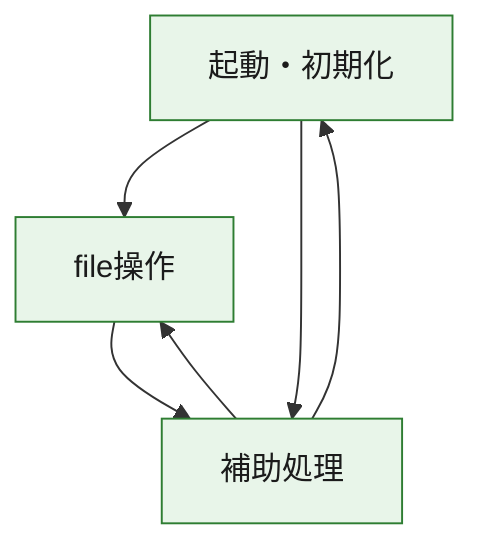
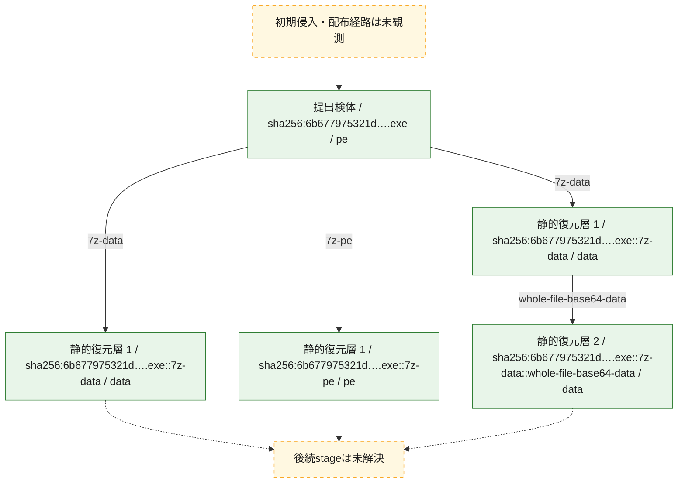
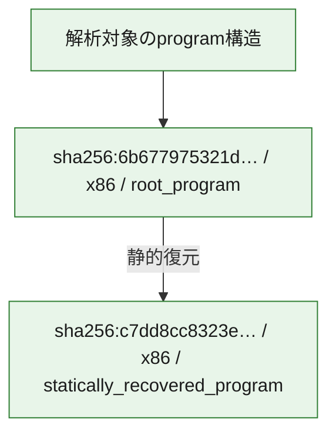

# 全体ロジック：6b677975321dd37920a79dcc2a74ac2c574e45df4b486a3b6a601faea0f87fe0

代表関数の静的証跡から、起動・初期化、file操作の処理群を確認しました。

## 読み方

- phaseの掲載順は解析上の整理順です。observed_call_edgesがない段階間の実行順を断定しません。
- 図の実線は静的に観測した関係、点線と黄色のノードは未観測・未解決の関係を示します。
- 図は静的な要約であり、動的実行を再現するものではありません。
- 詳細な関数解説とfingerprintは[STATIC-LOGIC.md](STATIC-LOGIC.md)を参照してください。

## 静的可視化

### 実行フロー

### 感染チェーン

### モジュール関係

## 処理段階

### 1. 起動・初期化

entry pointから初期化と後続処理への移行を確認します。
確度: `confirmed_static_function_evidence`

- `c7dd8cc8323e295b8821b0e320de208a7e20c068a8be8d03857520451ce9ded7:ghidra:3015d31b6` — 初期化と主要処理への分岐を行う入口関数です。 状態: `succeeded`、選定理由: `entry_point`, `meaningful_symbol_name`, `reviewed_call_centrality:4`, `role:entrypoint`
- `6b677975321dd37920a79dcc2a74ac2c574e45df4b486a3b6a601faea0f87fe0:ghidra:1400043b3` — 初期化と主要処理への分岐を行う入口関数です。 状態: `succeeded`、選定理由: `entry_point`, `meaningful_symbol_name`, `reviewed_call_centrality:74`, `role:entrypoint`

### 2. file操作

fileやdirectoryの作成、読書き、削除を確認します。
確度: `confirmed_static_function_evidence_with_limits`

- `6b677975321dd37920a79dcc2a74ac2c574e45df4b486a3b6a601faea0f87fe0:ghidra:140001627` — fileまたはdirectoryの読書き・管理に関係する関数です。 状態: `failed`、選定理由: `context_representative`, `reviewed_call_centrality:180`, `role:file_operation`
- `6b677975321dd37920a79dcc2a74ac2c574e45df4b486a3b6a601faea0f87fe0:ghidra:140003d67` — fileまたはdirectoryの読書き・管理に関係する関数です。 状態: `succeeded`、選定理由: `context_representative`, `reviewed_call_centrality:5`, `role:file_operation`
- `6b677975321dd37920a79dcc2a74ac2c574e45df4b486a3b6a601faea0f87fe0:ghidra:14000436c` — fileまたはdirectoryの読書き・管理に関係する関数です。 状態: `succeeded`、選定理由: `context_representative`, `reviewed_call_centrality:23`, `role:file_operation`

### 3. 補助処理

主要処理を支える一般内部関数またはlibrary処理を確認します。
確度: `confirmed_static_function_evidence_with_limits`

- `c7dd8cc8323e295b8821b0e320de208a7e20c068a8be8d03857520451ce9ded7:ghidra:3015d1000` — 検体内部の一般処理を実装する関数です。 状態: `succeeded`、選定理由: `context_representative`, `reviewed_call_centrality:1`
- `c7dd8cc8323e295b8821b0e320de208a7e20c068a8be8d03857520451ce9ded7:ghidra:3015d1010` — 検体内部の一般処理を実装する関数です。 状態: `succeeded`、選定理由: `context_representative`, `reviewed_call_centrality:10`
- `c7dd8cc8323e295b8821b0e320de208a7e20c068a8be8d03857520451ce9ded7:ghidra:3015d1200` — 検体内部の一般処理を実装する関数です。 状態: `succeeded`、選定理由: `context_representative`, `reviewed_call_centrality:5`
- `c7dd8cc8323e295b8821b0e320de208a7e20c068a8be8d03857520451ce9ded7:ghidra:3015d1350` — 検体内部の一般処理を実装する関数です。 状態: `succeeded`、選定理由: `context_representative`, `reviewed_call_centrality:5`
- `c7dd8cc8323e295b8821b0e320de208a7e20c068a8be8d03857520451ce9ded7:ghidra:3015d1370` — 検体内部の一般処理を実装する関数です。 状態: `succeeded`、選定理由: `context_representative`, `reviewed_call_centrality:5`
- `c7dd8cc8323e295b8821b0e320de208a7e20c068a8be8d03857520451ce9ded7:ghidra:3015d1380` — 検体内部の一般処理を実装する関数です。 状態: `succeeded`、選定理由: `context_representative`, `reviewed_call_centrality:5`
- `c7dd8cc8323e295b8821b0e320de208a7e20c068a8be8d03857520451ce9ded7:ghidra:3015d1390` — 検体内部の一般処理を実装する関数です。 状態: `succeeded`、選定理由: `context_representative`
- `c7dd8cc8323e295b8821b0e320de208a7e20c068a8be8d03857520451ce9ded7:ghidra:3015d13a0` — 検体内部の一般処理を実装する関数です。 状態: `succeeded`、選定理由: `context_representative`, `reviewed_call_centrality:6`
- `c7dd8cc8323e295b8821b0e320de208a7e20c068a8be8d03857520451ce9ded7:ghidra:3015d13d1` — 検体内部の一般処理を実装する関数です。 状態: `succeeded`、選定理由: `entry_point`, `meaningful_symbol_name`, `reviewed_call_centrality:6`
- `c7dd8cc8323e295b8821b0e320de208a7e20c068a8be8d03857520451ce9ded7:ghidra:3015d13eb` — 検体内部の一般処理を実装する関数です。 状態: `succeeded`、選定理由: `entry_point`, `meaningful_symbol_name`, `reviewed_call_centrality:6`
- `c7dd8cc8323e295b8821b0e320de208a7e20c068a8be8d03857520451ce9ded7:ghidra:3015d1405` — 検体内部の一般処理を実装する関数です。 状態: `limited_bad_instruction_or_flow`、選定理由: `entry_point`, `meaningful_symbol_name`, `reviewed_call_centrality:11`
- `c7dd8cc8323e295b8821b0e320de208a7e20c068a8be8d03857520451ce9ded7:ghidra:3015d14c3` — 検体内部の一般処理を実装する関数です。 状態: `limited_bad_instruction_or_flow`、選定理由: `entry_point`, `meaningful_symbol_name`, `reviewed_call_centrality:9`
- `c7dd8cc8323e295b8821b0e320de208a7e20c068a8be8d03857520451ce9ded7:ghidra:3015d1700` — 検体内部の一般処理を実装する関数です。 状態: `limited_bad_instruction_or_flow`、選定理由: `context_representative`, `reviewed_call_centrality:4`
- `c7dd8cc8323e295b8821b0e320de208a7e20c068a8be8d03857520451ce9ded7:ghidra:3015d1718` — 検体内部の一般処理を実装する関数です。 状態: `limited_bad_instruction_or_flow`、選定理由: `context_representative`, `reviewed_call_centrality:3`
- `c7dd8cc8323e295b8821b0e320de208a7e20c068a8be8d03857520451ce9ded7:ghidra:3015d174d` — 検体内部の一般処理を実装する関数です。 状態: `succeeded`、選定理由: `context_representative`, `reviewed_call_centrality:4`
- `c7dd8cc8323e295b8821b0e320de208a7e20c068a8be8d03857520451ce9ded7:ghidra:3015d1781` — 検体内部の一般処理を実装する関数です。 状態: `succeeded`、選定理由: `context_representative`, `reviewed_call_centrality:11`
- `c7dd8cc8323e295b8821b0e320de208a7e20c068a8be8d03857520451ce9ded7:ghidra:3015d17e4` — 検体内部の一般処理を実装する関数です。 状態: `limited_bad_instruction_or_flow`、選定理由: `context_representative`, `reviewed_call_centrality:6`
- `c7dd8cc8323e295b8821b0e320de208a7e20c068a8be8d03857520451ce9ded7:ghidra:3015d180a` — 検体内部の一般処理を実装する関数です。 状態: `succeeded`、選定理由: `context_representative`, `reviewed_call_centrality:3`
- `c7dd8cc8323e295b8821b0e320de208a7e20c068a8be8d03857520451ce9ded7:ghidra:3015d1844` — 検体内部の一般処理を実装する関数です。 状態: `succeeded`、選定理由: `context_representative`, `reviewed_call_centrality:2`
- `c7dd8cc8323e295b8821b0e320de208a7e20c068a8be8d03857520451ce9ded7:ghidra:3015d191b` — 検体内部の一般処理を実装する関数です。 状態: `succeeded`、選定理由: `context_representative`
- `c7dd8cc8323e295b8821b0e320de208a7e20c068a8be8d03857520451ce9ded7:ghidra:3015d19b7` — 検体内部の一般処理を実装する関数です。 状態: `succeeded`、選定理由: `context_representative`, `reviewed_call_centrality:10`
- `c7dd8cc8323e295b8821b0e320de208a7e20c068a8be8d03857520451ce9ded7:ghidra:3015d19ec` — 検体内部の一般処理を実装する関数です。 状態: `succeeded`、選定理由: `context_representative`, `reviewed_call_centrality:7`
- `c7dd8cc8323e295b8821b0e320de208a7e20c068a8be8d03857520451ce9ded7:ghidra:3015d1a20` — 検体内部の一般処理を実装する関数です。 状態: `succeeded`、選定理由: `context_representative`, `reviewed_call_centrality:2`
- `c7dd8cc8323e295b8821b0e320de208a7e20c068a8be8d03857520451ce9ded7:ghidra:3015d1a45` — 検体内部の一般処理を実装する関数です。 状態: `succeeded`、選定理由: `context_representative`, `reviewed_call_centrality:4`
- `c7dd8cc8323e295b8821b0e320de208a7e20c068a8be8d03857520451ce9ded7:ghidra:3015d1a7a` — 検体内部の一般処理を実装する関数です。 状態: `succeeded`、選定理由: `context_representative`
- `c7dd8cc8323e295b8821b0e320de208a7e20c068a8be8d03857520451ce9ded7:ghidra:3015d1bf2` — 検体内部の一般処理を実装する関数です。 状態: `limited_bad_instruction_or_flow`、選定理由: `entry_point`, `meaningful_symbol_name`, `reviewed_call_centrality:5`
- `c7dd8cc8323e295b8821b0e320de208a7e20c068a8be8d03857520451ce9ded7:ghidra:3015d1c7a` — 検体内部の一般処理を実装する関数です。 状態: `limited_bad_instruction_or_flow`、選定理由: `entry_point`, `meaningful_symbol_name`, `reviewed_call_centrality:5`
- `c7dd8cc8323e295b8821b0e320de208a7e20c068a8be8d03857520451ce9ded7:ghidra:3015d28bd` — 検体内部の一般処理を実装する関数です。 状態: `limited_bad_instruction_or_flow`、選定理由: `entry_point`, `meaningful_symbol_name`, `reviewed_call_centrality:12`
- `c7dd8cc8323e295b8821b0e320de208a7e20c068a8be8d03857520451ce9ded7:ghidra:3015d2fe7` — 検体内部の一般処理を実装する関数です。 状態: `limited_bad_instruction_or_flow`、選定理由: `entry_point`, `meaningful_symbol_name`, `reviewed_call_centrality:15`
- `c7dd8cc8323e295b8821b0e320de208a7e20c068a8be8d03857520451ce9ded7:ghidra:3015d3a70` — compiler生成処理または汎用library処理とみられる関数です。 状態: `succeeded`、選定理由: `entry_point`, `meaningful_symbol_name`, `reviewed_call_centrality:1`
- `c7dd8cc8323e295b8821b0e320de208a7e20c068a8be8d03857520451ce9ded7:ghidra:3015d3aa0` — compiler生成処理または汎用library処理とみられる関数です。 状態: `succeeded`、選定理由: `entry_point`, `meaningful_symbol_name`, `reviewed_call_centrality:3`
- `6b677975321dd37920a79dcc2a74ac2c574e45df4b486a3b6a601faea0f87fe0:ghidra:140001000` — 検体内部の一般処理を実装する関数です。 状態: `limited_bad_instruction_or_flow`、選定理由: `context_representative`, `reviewed_call_centrality:25`
- `6b677975321dd37920a79dcc2a74ac2c574e45df4b486a3b6a601faea0f87fe0:ghidra:140001200` — 検体内部の一般処理を実装する関数です。 状態: `succeeded`、選定理由: `context_representative`, `reviewed_call_centrality:1`
- `6b677975321dd37920a79dcc2a74ac2c574e45df4b486a3b6a601faea0f87fe0:ghidra:140001266` — 検体内部の一般処理を実装する関数です。 状態: `succeeded`、選定理由: `context_representative`, `reviewed_call_centrality:1`
- `6b677975321dd37920a79dcc2a74ac2c574e45df4b486a3b6a601faea0f87fe0:ghidra:140001316` — 検体内部の一般処理を実装する関数です。 状態: `succeeded`、選定理由: `context_representative`, `reviewed_call_centrality:1`
- `6b677975321dd37920a79dcc2a74ac2c574e45df4b486a3b6a601faea0f87fe0:ghidra:14000136c` — 検体内部の一般処理を実装する関数です。 状態: `succeeded`、選定理由: `context_representative`, `reviewed_call_centrality:1`
- `6b677975321dd37920a79dcc2a74ac2c574e45df4b486a3b6a601faea0f87fe0:ghidra:140001410` — 検体内部の一般処理を実装する関数です。 状態: `succeeded`、選定理由: `context_representative`, `reviewed_call_centrality:4`
- `6b677975321dd37920a79dcc2a74ac2c574e45df4b486a3b6a601faea0f87fe0:ghidra:140001466` — 検体内部の一般処理を実装する関数です。 状態: `succeeded`、選定理由: `context_representative`, `reviewed_call_centrality:2`
- `6b677975321dd37920a79dcc2a74ac2c574e45df4b486a3b6a601faea0f87fe0:ghidra:14000148a` — 検体内部の一般処理を実装する関数です。 状態: `succeeded`、選定理由: `context_representative`, `reviewed_call_centrality:10`
- `6b677975321dd37920a79dcc2a74ac2c574e45df4b486a3b6a601faea0f87fe0:ghidra:140001598` — 検体内部の一般処理を実装する関数です。 状態: `succeeded`、選定理由: `context_representative`, `reviewed_call_centrality:3`
- `6b677975321dd37920a79dcc2a74ac2c574e45df4b486a3b6a601faea0f87fe0:ghidra:1400015f4` — 検体内部の一般処理を実装する関数です。 状態: `succeeded`、選定理由: `context_representative`, `reviewed_call_centrality:4`
- `6b677975321dd37920a79dcc2a74ac2c574e45df4b486a3b6a601faea0f87fe0:ghidra:14000161b` — 検体内部の一般処理を実装する関数です。 状態: `succeeded`、選定理由: `context_representative`, `reviewed_call_centrality:8`
- `6b677975321dd37920a79dcc2a74ac2c574e45df4b486a3b6a601faea0f87fe0:ghidra:140003b7f` — 検体内部の一般処理を実装する関数です。 状態: `succeeded`、選定理由: `context_representative`, `reviewed_call_centrality:8`
- `6b677975321dd37920a79dcc2a74ac2c574e45df4b486a3b6a601faea0f87fe0:ghidra:140003c17` — 検体内部の一般処理を実装する関数です。 状態: `succeeded`、選定理由: `context_representative`, `reviewed_call_centrality:4`
- `6b677975321dd37920a79dcc2a74ac2c574e45df4b486a3b6a601faea0f87fe0:ghidra:140003c40` — 検体内部の一般処理を実装する関数です。 状態: `succeeded`、選定理由: `context_representative`, `reviewed_call_centrality:9`
- `6b677975321dd37920a79dcc2a74ac2c574e45df4b486a3b6a601faea0f87fe0:ghidra:140003cd7` — 検体内部の一般処理を実装する関数です。 状態: `limited_bad_instruction_or_flow`、選定理由: `context_representative`, `reviewed_call_centrality:13`
- `6b677975321dd37920a79dcc2a74ac2c574e45df4b486a3b6a601faea0f87fe0:ghidra:140003d79` — 検体内部の一般処理を実装する関数です。 状態: `limited_bad_instruction_or_flow`、選定理由: `context_representative`, `reviewed_call_centrality:5`
- `6b677975321dd37920a79dcc2a74ac2c574e45df4b486a3b6a601faea0f87fe0:ghidra:140003d8f` — 検体内部の一般処理を実装する関数です。 状態: `succeeded`、選定理由: `context_representative`, `reviewed_call_centrality:13`
- `6b677975321dd37920a79dcc2a74ac2c574e45df4b486a3b6a601faea0f87fe0:ghidra:14000400a` — 検体内部の一般処理を実装する関数です。 状態: `succeeded`、選定理由: `context_representative`, `reviewed_call_centrality:24`
- `6b677975321dd37920a79dcc2a74ac2c574e45df4b486a3b6a601faea0f87fe0:ghidra:140004310` — 検体内部の一般処理を実装する関数です。 状態: `succeeded`、選定理由: `context_representative`, `reviewed_call_centrality:10`
- `6b677975321dd37920a79dcc2a74ac2c574e45df4b486a3b6a601faea0f87fe0:ghidra:1400049f0` — 検体内部の一般処理を実装する関数です。 状態: `succeeded`、選定理由: `context_representative`, `reviewed_call_centrality:1`
- `6b677975321dd37920a79dcc2a74ac2c574e45df4b486a3b6a601faea0f87fe0:ghidra:140004a15` — 検体内部の一般処理を実装する関数です。 状態: `succeeded`、選定理由: `context_representative`, `reviewed_call_centrality:6`
- `6b677975321dd37920a79dcc2a74ac2c574e45df4b486a3b6a601faea0f87fe0:ghidra:140004a5f` — 検体内部の一般処理を実装する関数です。 状態: `succeeded`、選定理由: `context_representative`, `reviewed_call_centrality:2`
- `6b677975321dd37920a79dcc2a74ac2c574e45df4b486a3b6a601faea0f87fe0:ghidra:140004a80` — 検体内部の一般処理を実装する関数です。 状態: `succeeded`、選定理由: `context_representative`, `reviewed_call_centrality:3`
- `6b677975321dd37920a79dcc2a74ac2c574e45df4b486a3b6a601faea0f87fe0:ghidra:140004ae0` — 検体内部の一般処理を実装する関数です。 状態: `succeeded`、選定理由: `context_representative`
- `6b677975321dd37920a79dcc2a74ac2c574e45df4b486a3b6a601faea0f87fe0:ghidra:140004b13` — 検体内部の一般処理を実装する関数です。 状態: `succeeded`、選定理由: `context_representative`, `reviewed_call_centrality:4`
- `6b677975321dd37920a79dcc2a74ac2c574e45df4b486a3b6a601faea0f87fe0:ghidra:140004b48` — 検体内部の一般処理を実装する関数です。 状態: `succeeded`、選定理由: `context_representative`, `reviewed_call_centrality:4`
- `6b677975321dd37920a79dcc2a74ac2c574e45df4b486a3b6a601faea0f87fe0:ghidra:140004c2b` — 検体内部の一般処理を実装する関数です。 状態: `limited_bad_instruction_or_flow`、選定理由: `context_representative`, `reviewed_call_centrality:3`
- `6b677975321dd37920a79dcc2a74ac2c574e45df4b486a3b6a601faea0f87fe0:ghidra:140004c47` — 検体内部の一般処理を実装する関数です。 状態: `succeeded`、選定理由: `context_representative`, `reviewed_call_centrality:7`

## 観測したcall関係

- `6b677975321dd37920a79dcc2a74ac2c574e45df4b486a3b6a601faea0f87fe0:ghidra:140001598` → `6b677975321dd37920a79dcc2a74ac2c574e45df4b486a3b6a601faea0f87fe0:ghidra:140001410` （`support` → `support`）
- `6b677975321dd37920a79dcc2a74ac2c574e45df4b486a3b6a601faea0f87fe0:ghidra:140001627` → `6b677975321dd37920a79dcc2a74ac2c574e45df4b486a3b6a601faea0f87fe0:ghidra:140001200` （`file_activity` → `support`）
- `6b677975321dd37920a79dcc2a74ac2c574e45df4b486a3b6a601faea0f87fe0:ghidra:140001627` → `6b677975321dd37920a79dcc2a74ac2c574e45df4b486a3b6a601faea0f87fe0:ghidra:140001266` （`file_activity` → `support`）
- `6b677975321dd37920a79dcc2a74ac2c574e45df4b486a3b6a601faea0f87fe0:ghidra:140001627` → `6b677975321dd37920a79dcc2a74ac2c574e45df4b486a3b6a601faea0f87fe0:ghidra:140001316` （`file_activity` → `support`）
- `6b677975321dd37920a79dcc2a74ac2c574e45df4b486a3b6a601faea0f87fe0:ghidra:140001627` → `6b677975321dd37920a79dcc2a74ac2c574e45df4b486a3b6a601faea0f87fe0:ghidra:14000136c` （`file_activity` → `support`）
- `6b677975321dd37920a79dcc2a74ac2c574e45df4b486a3b6a601faea0f87fe0:ghidra:140001627` → `6b677975321dd37920a79dcc2a74ac2c574e45df4b486a3b6a601faea0f87fe0:ghidra:140001410` （`file_activity` → `support`）
- `6b677975321dd37920a79dcc2a74ac2c574e45df4b486a3b6a601faea0f87fe0:ghidra:140001627` → `6b677975321dd37920a79dcc2a74ac2c574e45df4b486a3b6a601faea0f87fe0:ghidra:140001466` （`file_activity` → `support`）
- `6b677975321dd37920a79dcc2a74ac2c574e45df4b486a3b6a601faea0f87fe0:ghidra:140001627` → `6b677975321dd37920a79dcc2a74ac2c574e45df4b486a3b6a601faea0f87fe0:ghidra:14000148a` （`file_activity` → `support`）
- `6b677975321dd37920a79dcc2a74ac2c574e45df4b486a3b6a601faea0f87fe0:ghidra:140001627` → `6b677975321dd37920a79dcc2a74ac2c574e45df4b486a3b6a601faea0f87fe0:ghidra:140001598` （`file_activity` → `support`）
- `6b677975321dd37920a79dcc2a74ac2c574e45df4b486a3b6a601faea0f87fe0:ghidra:140001627` → `6b677975321dd37920a79dcc2a74ac2c574e45df4b486a3b6a601faea0f87fe0:ghidra:1400015f4` （`file_activity` → `support`）
- `6b677975321dd37920a79dcc2a74ac2c574e45df4b486a3b6a601faea0f87fe0:ghidra:140001627` → `6b677975321dd37920a79dcc2a74ac2c574e45df4b486a3b6a601faea0f87fe0:ghidra:14000161b` （`file_activity` → `support`）
- `6b677975321dd37920a79dcc2a74ac2c574e45df4b486a3b6a601faea0f87fe0:ghidra:140001627` → `6b677975321dd37920a79dcc2a74ac2c574e45df4b486a3b6a601faea0f87fe0:ghidra:140003b7f` （`file_activity` → `support`）
- `6b677975321dd37920a79dcc2a74ac2c574e45df4b486a3b6a601faea0f87fe0:ghidra:140001627` → `6b677975321dd37920a79dcc2a74ac2c574e45df4b486a3b6a601faea0f87fe0:ghidra:140003d67` （`file_activity` → `file_activity`）
- `6b677975321dd37920a79dcc2a74ac2c574e45df4b486a3b6a601faea0f87fe0:ghidra:140001627` → `6b677975321dd37920a79dcc2a74ac2c574e45df4b486a3b6a601faea0f87fe0:ghidra:140003d79` （`file_activity` → `support`）
- `6b677975321dd37920a79dcc2a74ac2c574e45df4b486a3b6a601faea0f87fe0:ghidra:140001627` → `6b677975321dd37920a79dcc2a74ac2c574e45df4b486a3b6a601faea0f87fe0:ghidra:140003d8f` （`file_activity` → `support`）
- `6b677975321dd37920a79dcc2a74ac2c574e45df4b486a3b6a601faea0f87fe0:ghidra:140001627` → `6b677975321dd37920a79dcc2a74ac2c574e45df4b486a3b6a601faea0f87fe0:ghidra:140004a5f` （`file_activity` → `support`）
- `6b677975321dd37920a79dcc2a74ac2c574e45df4b486a3b6a601faea0f87fe0:ghidra:140003b7f` → `6b677975321dd37920a79dcc2a74ac2c574e45df4b486a3b6a601faea0f87fe0:ghidra:1400015f4` （`support` → `support`）
- `6b677975321dd37920a79dcc2a74ac2c574e45df4b486a3b6a601faea0f87fe0:ghidra:140003b7f` → `6b677975321dd37920a79dcc2a74ac2c574e45df4b486a3b6a601faea0f87fe0:ghidra:140001627` （`support` → `file_activity`）
- `6b677975321dd37920a79dcc2a74ac2c574e45df4b486a3b6a601faea0f87fe0:ghidra:140003c17` → `6b677975321dd37920a79dcc2a74ac2c574e45df4b486a3b6a601faea0f87fe0:ghidra:1400015f4` （`support` → `support`）
- `6b677975321dd37920a79dcc2a74ac2c574e45df4b486a3b6a601faea0f87fe0:ghidra:140003c17` → `6b677975321dd37920a79dcc2a74ac2c574e45df4b486a3b6a601faea0f87fe0:ghidra:140001627` （`support` → `file_activity`）
- `6b677975321dd37920a79dcc2a74ac2c574e45df4b486a3b6a601faea0f87fe0:ghidra:140003d8f` → `6b677975321dd37920a79dcc2a74ac2c574e45df4b486a3b6a601faea0f87fe0:ghidra:140003d67` （`support` → `file_activity`）
- `6b677975321dd37920a79dcc2a74ac2c574e45df4b486a3b6a601faea0f87fe0:ghidra:140003d8f` → `6b677975321dd37920a79dcc2a74ac2c574e45df4b486a3b6a601faea0f87fe0:ghidra:140003d79` （`support` → `support`）
- `6b677975321dd37920a79dcc2a74ac2c574e45df4b486a3b6a601faea0f87fe0:ghidra:14000400a` → `6b677975321dd37920a79dcc2a74ac2c574e45df4b486a3b6a601faea0f87fe0:ghidra:140003cd7` （`support` → `support`）
- `6b677975321dd37920a79dcc2a74ac2c574e45df4b486a3b6a601faea0f87fe0:ghidra:14000400a` → `6b677975321dd37920a79dcc2a74ac2c574e45df4b486a3b6a601faea0f87fe0:ghidra:140003d67` （`support` → `file_activity`）
- `6b677975321dd37920a79dcc2a74ac2c574e45df4b486a3b6a601faea0f87fe0:ghidra:14000400a` → `6b677975321dd37920a79dcc2a74ac2c574e45df4b486a3b6a601faea0f87fe0:ghidra:140003d79` （`support` → `support`）
- `6b677975321dd37920a79dcc2a74ac2c574e45df4b486a3b6a601faea0f87fe0:ghidra:14000400a` → `6b677975321dd37920a79dcc2a74ac2c574e45df4b486a3b6a601faea0f87fe0:ghidra:140003d8f` （`support` → `support`）
- `6b677975321dd37920a79dcc2a74ac2c574e45df4b486a3b6a601faea0f87fe0:ghidra:14000436c` → `6b677975321dd37920a79dcc2a74ac2c574e45df4b486a3b6a601faea0f87fe0:ghidra:140004a15` （`file_activity` → `support`）
- `6b677975321dd37920a79dcc2a74ac2c574e45df4b486a3b6a601faea0f87fe0:ghidra:1400043b3` → `6b677975321dd37920a79dcc2a74ac2c574e45df4b486a3b6a601faea0f87fe0:ghidra:140003c17` （`startup` → `support`）
- `6b677975321dd37920a79dcc2a74ac2c574e45df4b486a3b6a601faea0f87fe0:ghidra:1400043b3` → `6b677975321dd37920a79dcc2a74ac2c574e45df4b486a3b6a601faea0f87fe0:ghidra:14000400a` （`startup` → `support`）
- `6b677975321dd37920a79dcc2a74ac2c574e45df4b486a3b6a601faea0f87fe0:ghidra:1400043b3` → `6b677975321dd37920a79dcc2a74ac2c574e45df4b486a3b6a601faea0f87fe0:ghidra:140004310` （`startup` → `support`）
- `6b677975321dd37920a79dcc2a74ac2c574e45df4b486a3b6a601faea0f87fe0:ghidra:1400043b3` → `6b677975321dd37920a79dcc2a74ac2c574e45df4b486a3b6a601faea0f87fe0:ghidra:14000436c` （`startup` → `file_activity`）
- `6b677975321dd37920a79dcc2a74ac2c574e45df4b486a3b6a601faea0f87fe0:ghidra:140004a15` → `6b677975321dd37920a79dcc2a74ac2c574e45df4b486a3b6a601faea0f87fe0:ghidra:1400049f0` （`support` → `support`）
- `6b677975321dd37920a79dcc2a74ac2c574e45df4b486a3b6a601faea0f87fe0:ghidra:140004a80` → `6b677975321dd37920a79dcc2a74ac2c574e45df4b486a3b6a601faea0f87fe0:ghidra:140004a5f` （`support` → `support`）
- `6b677975321dd37920a79dcc2a74ac2c574e45df4b486a3b6a601faea0f87fe0:ghidra:140004b48` → `6b677975321dd37920a79dcc2a74ac2c574e45df4b486a3b6a601faea0f87fe0:ghidra:140004b13` （`support` → `support`）
- `6b677975321dd37920a79dcc2a74ac2c574e45df4b486a3b6a601faea0f87fe0:ghidra:140004c47` → `6b677975321dd37920a79dcc2a74ac2c574e45df4b486a3b6a601faea0f87fe0:ghidra:140003b7f` （`support` → `support`）
- `6b677975321dd37920a79dcc2a74ac2c574e45df4b486a3b6a601faea0f87fe0:ghidra:140004c47` → `6b677975321dd37920a79dcc2a74ac2c574e45df4b486a3b6a601faea0f87fe0:ghidra:140004c2b` （`support` → `support`）
- `c7dd8cc8323e295b8821b0e320de208a7e20c068a8be8d03857520451ce9ded7:ghidra:3015d1010` → `c7dd8cc8323e295b8821b0e320de208a7e20c068a8be8d03857520451ce9ded7:ghidra:3015d3aa0` （`support` → `support`）
- `c7dd8cc8323e295b8821b0e320de208a7e20c068a8be8d03857520451ce9ded7:ghidra:3015d1200` → `c7dd8cc8323e295b8821b0e320de208a7e20c068a8be8d03857520451ce9ded7:ghidra:3015d1010` （`support` → `support`）
- `c7dd8cc8323e295b8821b0e320de208a7e20c068a8be8d03857520451ce9ded7:ghidra:3015d1200` → `c7dd8cc8323e295b8821b0e320de208a7e20c068a8be8d03857520451ce9ded7:ghidra:3015d31b6` （`support` → `startup`）
- `c7dd8cc8323e295b8821b0e320de208a7e20c068a8be8d03857520451ce9ded7:ghidra:3015d1350` → `c7dd8cc8323e295b8821b0e320de208a7e20c068a8be8d03857520451ce9ded7:ghidra:3015d1010` （`support` → `support`）
- `c7dd8cc8323e295b8821b0e320de208a7e20c068a8be8d03857520451ce9ded7:ghidra:3015d1350` → `c7dd8cc8323e295b8821b0e320de208a7e20c068a8be8d03857520451ce9ded7:ghidra:3015d31b6` （`support` → `startup`）
- `c7dd8cc8323e295b8821b0e320de208a7e20c068a8be8d03857520451ce9ded7:ghidra:3015d13a0` → `c7dd8cc8323e295b8821b0e320de208a7e20c068a8be8d03857520451ce9ded7:ghidra:3015d1781` （`support` → `support`）
- `c7dd8cc8323e295b8821b0e320de208a7e20c068a8be8d03857520451ce9ded7:ghidra:3015d13a0` → `c7dd8cc8323e295b8821b0e320de208a7e20c068a8be8d03857520451ce9ded7:ghidra:3015d19b7` （`support` → `support`）
- `c7dd8cc8323e295b8821b0e320de208a7e20c068a8be8d03857520451ce9ded7:ghidra:3015d13d1` → `c7dd8cc8323e295b8821b0e320de208a7e20c068a8be8d03857520451ce9ded7:ghidra:3015d1781` （`support` → `support`）
- `c7dd8cc8323e295b8821b0e320de208a7e20c068a8be8d03857520451ce9ded7:ghidra:3015d13d1` → `c7dd8cc8323e295b8821b0e320de208a7e20c068a8be8d03857520451ce9ded7:ghidra:3015d19b7` （`support` → `support`）
- `c7dd8cc8323e295b8821b0e320de208a7e20c068a8be8d03857520451ce9ded7:ghidra:3015d13eb` → `c7dd8cc8323e295b8821b0e320de208a7e20c068a8be8d03857520451ce9ded7:ghidra:3015d1781` （`support` → `support`）
- `c7dd8cc8323e295b8821b0e320de208a7e20c068a8be8d03857520451ce9ded7:ghidra:3015d13eb` → `c7dd8cc8323e295b8821b0e320de208a7e20c068a8be8d03857520451ce9ded7:ghidra:3015d19b7` （`support` → `support`）
- `c7dd8cc8323e295b8821b0e320de208a7e20c068a8be8d03857520451ce9ded7:ghidra:3015d1405` → `c7dd8cc8323e295b8821b0e320de208a7e20c068a8be8d03857520451ce9ded7:ghidra:3015d174d` （`support` → `support`）
- `c7dd8cc8323e295b8821b0e320de208a7e20c068a8be8d03857520451ce9ded7:ghidra:3015d1405` → `c7dd8cc8323e295b8821b0e320de208a7e20c068a8be8d03857520451ce9ded7:ghidra:3015d1844` （`support` → `support`）
- `c7dd8cc8323e295b8821b0e320de208a7e20c068a8be8d03857520451ce9ded7:ghidra:3015d1405` → `c7dd8cc8323e295b8821b0e320de208a7e20c068a8be8d03857520451ce9ded7:ghidra:3015d19b7` （`support` → `support`）
- `c7dd8cc8323e295b8821b0e320de208a7e20c068a8be8d03857520451ce9ded7:ghidra:3015d1405` → `c7dd8cc8323e295b8821b0e320de208a7e20c068a8be8d03857520451ce9ded7:ghidra:3015d19ec` （`support` → `support`）
- `c7dd8cc8323e295b8821b0e320de208a7e20c068a8be8d03857520451ce9ded7:ghidra:3015d1405` → `c7dd8cc8323e295b8821b0e320de208a7e20c068a8be8d03857520451ce9ded7:ghidra:3015d1a20` （`support` → `support`）
- `c7dd8cc8323e295b8821b0e320de208a7e20c068a8be8d03857520451ce9ded7:ghidra:3015d14c3` → `c7dd8cc8323e295b8821b0e320de208a7e20c068a8be8d03857520451ce9ded7:ghidra:3015d174d` （`support` → `support`）
- `c7dd8cc8323e295b8821b0e320de208a7e20c068a8be8d03857520451ce9ded7:ghidra:3015d14c3` → `c7dd8cc8323e295b8821b0e320de208a7e20c068a8be8d03857520451ce9ded7:ghidra:3015d1781` （`support` → `support`）
- `c7dd8cc8323e295b8821b0e320de208a7e20c068a8be8d03857520451ce9ded7:ghidra:3015d14c3` → `c7dd8cc8323e295b8821b0e320de208a7e20c068a8be8d03857520451ce9ded7:ghidra:3015d17e4` （`support` → `support`）
- `c7dd8cc8323e295b8821b0e320de208a7e20c068a8be8d03857520451ce9ded7:ghidra:3015d14c3` → `c7dd8cc8323e295b8821b0e320de208a7e20c068a8be8d03857520451ce9ded7:ghidra:3015d180a` （`support` → `support`）
- `c7dd8cc8323e295b8821b0e320de208a7e20c068a8be8d03857520451ce9ded7:ghidra:3015d14c3` → `c7dd8cc8323e295b8821b0e320de208a7e20c068a8be8d03857520451ce9ded7:ghidra:3015d1a20` （`support` → `support`）
- `c7dd8cc8323e295b8821b0e320de208a7e20c068a8be8d03857520451ce9ded7:ghidra:3015d1718` → `c7dd8cc8323e295b8821b0e320de208a7e20c068a8be8d03857520451ce9ded7:ghidra:3015d1700` （`support` → `support`）
- `c7dd8cc8323e295b8821b0e320de208a7e20c068a8be8d03857520451ce9ded7:ghidra:3015d17e4` → `c7dd8cc8323e295b8821b0e320de208a7e20c068a8be8d03857520451ce9ded7:ghidra:3015d1700` （`support` → `support`）
- `c7dd8cc8323e295b8821b0e320de208a7e20c068a8be8d03857520451ce9ded7:ghidra:3015d19b7` → `c7dd8cc8323e295b8821b0e320de208a7e20c068a8be8d03857520451ce9ded7:ghidra:3015d174d` （`support` → `support`）
- `c7dd8cc8323e295b8821b0e320de208a7e20c068a8be8d03857520451ce9ded7:ghidra:3015d19b7` → `c7dd8cc8323e295b8821b0e320de208a7e20c068a8be8d03857520451ce9ded7:ghidra:3015d1844` （`support` → `support`）
- `c7dd8cc8323e295b8821b0e320de208a7e20c068a8be8d03857520451ce9ded7:ghidra:3015d19ec` → `c7dd8cc8323e295b8821b0e320de208a7e20c068a8be8d03857520451ce9ded7:ghidra:3015d1781` （`support` → `support`）
- `c7dd8cc8323e295b8821b0e320de208a7e20c068a8be8d03857520451ce9ded7:ghidra:3015d1bf2` → `c7dd8cc8323e295b8821b0e320de208a7e20c068a8be8d03857520451ce9ded7:ghidra:3015d19b7` （`support` → `support`）
- `c7dd8cc8323e295b8821b0e320de208a7e20c068a8be8d03857520451ce9ded7:ghidra:3015d1c7a` → `c7dd8cc8323e295b8821b0e320de208a7e20c068a8be8d03857520451ce9ded7:ghidra:3015d174d` （`support` → `support`）
- `c7dd8cc8323e295b8821b0e320de208a7e20c068a8be8d03857520451ce9ded7:ghidra:3015d1c7a` → `c7dd8cc8323e295b8821b0e320de208a7e20c068a8be8d03857520451ce9ded7:ghidra:3015d19b7` （`support` → `support`）
- `c7dd8cc8323e295b8821b0e320de208a7e20c068a8be8d03857520451ce9ded7:ghidra:3015d1c7a` → `c7dd8cc8323e295b8821b0e320de208a7e20c068a8be8d03857520451ce9ded7:ghidra:3015d19ec` （`support` → `support`）
- `c7dd8cc8323e295b8821b0e320de208a7e20c068a8be8d03857520451ce9ded7:ghidra:3015d28bd` → `c7dd8cc8323e295b8821b0e320de208a7e20c068a8be8d03857520451ce9ded7:ghidra:3015d1781` （`support` → `support`）
- `c7dd8cc8323e295b8821b0e320de208a7e20c068a8be8d03857520451ce9ded7:ghidra:3015d28bd` → `c7dd8cc8323e295b8821b0e320de208a7e20c068a8be8d03857520451ce9ded7:ghidra:3015d19ec` （`support` → `support`）
- `c7dd8cc8323e295b8821b0e320de208a7e20c068a8be8d03857520451ce9ded7:ghidra:3015d2fe7` → `c7dd8cc8323e295b8821b0e320de208a7e20c068a8be8d03857520451ce9ded7:ghidra:3015d1781` （`support` → `support`）
- `c7dd8cc8323e295b8821b0e320de208a7e20c068a8be8d03857520451ce9ded7:ghidra:3015d2fe7` → `c7dd8cc8323e295b8821b0e320de208a7e20c068a8be8d03857520451ce9ded7:ghidra:3015d19ec` （`support` → `support`）
- `ghidra-function:033f5349caf332123b796129` → `ghidra-external:87585402f254052a7a1b0368` （`unclassified` → `unclassified`）
- `ghidra-function:033f5349caf332123b796129` → `ghidra-external:936c989be26fa852732e1900` （`unclassified` → `unclassified`）
- `ghidra-function:033f5349caf332123b796129` → `ghidra-function:0111fabfb19680adcf8ea00f` （`unclassified` → `unclassified`）
- `ghidra-function:033f5349caf332123b796129` → `ghidra-function:0818c440df4b370b4ac8854a` （`unclassified` → `unclassified`）
- `ghidra-function:033f5349caf332123b796129` → `ghidra-function:0829c0566426c8a06bcd03cb` （`unclassified` → `unclassified`）
- `ghidra-function:033f5349caf332123b796129` → `ghidra-function:0a7e531a32ad3072810d7a5c` （`unclassified` → `unclassified`）
- `ghidra-function:033f5349caf332123b796129` → `ghidra-function:1747929428149f7e1317d5fa` （`unclassified` → `unclassified`）
- `ghidra-function:033f5349caf332123b796129` → `ghidra-function:1a6bc9de91cbb873fedc0741` （`unclassified` → `unclassified`）
- `ghidra-function:033f5349caf332123b796129` → `ghidra-function:1f307dc28918f194f9e8af2e` （`unclassified` → `unclassified`）
- `ghidra-function:033f5349caf332123b796129` → `ghidra-function:2597f33bf82024417227829b` （`unclassified` → `unclassified`）
- `ghidra-function:033f5349caf332123b796129` → `ghidra-function:2617be9b123fe067cb373ff6` （`unclassified` → `unclassified`）
- `ghidra-function:033f5349caf332123b796129` → `ghidra-function:29955a9ae26d6487558d0f49` （`unclassified` → `unclassified`）
- `ghidra-function:033f5349caf332123b796129` → `ghidra-function:351f8ea8dbcc4254bc53de4f` （`unclassified` → `unclassified`）
- `ghidra-function:033f5349caf332123b796129` → `ghidra-function:3958836f29aee379c4db38af` （`unclassified` → `unclassified`）
- `ghidra-function:033f5349caf332123b796129` → `ghidra-function:3f38402bbdbc9b86d934ed4d` （`unclassified` → `unclassified`）
- `ghidra-function:033f5349caf332123b796129` → `ghidra-function:40dfd697e08ace94908fe37b` （`unclassified` → `unclassified`）
- `ghidra-function:033f5349caf332123b796129` → `ghidra-function:4af10b1af06821e565ab8099` （`unclassified` → `unclassified`）
- `ghidra-function:033f5349caf332123b796129` → `ghidra-function:4deae519b10cd9678d10c454` （`unclassified` → `unclassified`）
- `ghidra-function:033f5349caf332123b796129` → `ghidra-function:5765658ce4979d8339012e50` （`unclassified` → `unclassified`）
- `ghidra-function:033f5349caf332123b796129` → `ghidra-function:66d13d4660befd465f006c01` （`unclassified` → `unclassified`）
- `ghidra-function:033f5349caf332123b796129` → `ghidra-function:68aeca70213564e4a7478293` （`unclassified` → `unclassified`）
- `ghidra-function:033f5349caf332123b796129` → `ghidra-function:74f3d23e85110421a2915dd5` （`unclassified` → `unclassified`）
- `ghidra-function:033f5349caf332123b796129` → `ghidra-function:77f358edc218b41e7de35ff5` （`unclassified` → `unclassified`）
- `ghidra-function:033f5349caf332123b796129` → `ghidra-function:78e10f6dff41e10120862df5` （`unclassified` → `unclassified`）
- `ghidra-function:033f5349caf332123b796129` → `ghidra-function:7b31bf58cb7c6a6aee6a8c2f` （`unclassified` → `unclassified`）
- `ghidra-function:033f5349caf332123b796129` → `ghidra-function:7d83a1c08b28ea7fc5358f84` （`unclassified` → `unclassified`）
- `ghidra-function:033f5349caf332123b796129` → `ghidra-function:850df670e3d6cbb0fa8296a4` （`unclassified` → `unclassified`）
- `ghidra-function:033f5349caf332123b796129` → `ghidra-function:8752fcfddac6d200814474c7` （`unclassified` → `unclassified`）
- `ghidra-function:033f5349caf332123b796129` → `ghidra-function:8a2fbd5941101e4c3b598eea` （`unclassified` → `unclassified`）
- `ghidra-function:033f5349caf332123b796129` → `ghidra-function:8c977d56378d9c659fdbfdcf` （`unclassified` → `unclassified`）
- `ghidra-function:033f5349caf332123b796129` → `ghidra-function:92c5223a6a730a7f8ffa1ed7` （`unclassified` → `unclassified`）
- `ghidra-function:033f5349caf332123b796129` → `ghidra-function:a58fdc2a70000bb32c17bd52` （`unclassified` → `unclassified`）
- `ghidra-function:033f5349caf332123b796129` → `ghidra-function:a6962abde9239872499ab1fa` （`unclassified` → `unclassified`）
- `ghidra-function:033f5349caf332123b796129` → `ghidra-function:a69883ecf43a42ba379b3db0` （`unclassified` → `unclassified`）
- `ghidra-function:033f5349caf332123b796129` → `ghidra-function:a94927b92547fce941e3cd4f` （`unclassified` → `unclassified`）
- `ghidra-function:033f5349caf332123b796129` → `ghidra-function:b10a4e1607bf10cae71d999b` （`unclassified` → `unclassified`）
- `ghidra-function:033f5349caf332123b796129` → `ghidra-function:b6bfad7e830e9bc3642199e2` （`unclassified` → `unclassified`）
- `ghidra-function:033f5349caf332123b796129` → `ghidra-function:c21119c3503d3d4909cd2726` （`unclassified` → `unclassified`）
- `ghidra-function:033f5349caf332123b796129` → `ghidra-function:c4714737029d2e28583ce451` （`unclassified` → `unclassified`）
- `ghidra-function:033f5349caf332123b796129` → `ghidra-function:cb7d48eb7d9e9395fab6a0ef` （`unclassified` → `unclassified`）
- `ghidra-function:033f5349caf332123b796129` → `ghidra-function:d3506a6697dfcd3fa923e013` （`unclassified` → `unclassified`）
- `ghidra-function:033f5349caf332123b796129` → `ghidra-function:d396486f69482a699c2a3735` （`unclassified` → `unclassified`）
- `ghidra-function:033f5349caf332123b796129` → `ghidra-function:d4ef7e4d057899c8278cb62f` （`unclassified` → `unclassified`）
- `ghidra-function:033f5349caf332123b796129` → `ghidra-function:d88a583619f43158a8a2d0f1` （`unclassified` → `unclassified`）
- `ghidra-function:033f5349caf332123b796129` → `ghidra-function:e19abd57e12265d401314886` （`unclassified` → `unclassified`）
- `ghidra-function:033f5349caf332123b796129` → `ghidra-function:ea07722c6df02467d219a46b` （`unclassified` → `unclassified`）
- `ghidra-function:033f5349caf332123b796129` → `ghidra-function:f2218bc5230ee19c015931f7` （`unclassified` → `unclassified`）
- `ghidra-function:033f5349caf332123b796129` → `ghidra-function:f28ea311e855446994570922` （`unclassified` → `unclassified`）
- `ghidra-function:033f5349caf332123b796129` → `ghidra-function:f643537d87d72634c33eaf50` （`unclassified` → `unclassified`）
- `ghidra-function:04527c88607a92067baf504b` → `ghidra-external:3287304366ddb21d76771db8` （`unclassified` → `unclassified`）
- `ghidra-function:04527c88607a92067baf504b` → `ghidra-external:3969fe501ae055795b9cdc92` （`unclassified` → `unclassified`）
- `ghidra-function:04527c88607a92067baf504b` → `ghidra-external:ac6feedd385c9d068a26befc` （`unclassified` → `unclassified`）
- `ghidra-function:04527c88607a92067baf504b` → `ghidra-external:d928bd66acc5fe7c4778792f` （`unclassified` → `unclassified`）
- `ghidra-function:04527c88607a92067baf504b` → `ghidra-external:fd6dfdd17a283431d6c048c3` （`unclassified` → `unclassified`）
- `ghidra-function:08c5adff93a51140c3d95f4a` → `ghidra-external:10a86f293d332f6cc60c0e27` （`unclassified` → `unclassified`）
- `ghidra-function:08c5adff93a51140c3d95f4a` → `ghidra-external:2ca93b67ca212276b9c83531` （`unclassified` → `unclassified`）
- `ghidra-function:08c5adff93a51140c3d95f4a` → `ghidra-external:47d5972489ac2159dada329b` （`unclassified` → `unclassified`）
- `ghidra-function:08c5adff93a51140c3d95f4a` → `ghidra-external:d11467996f3ebed134ee6542` （`unclassified` → `unclassified`）
- `ghidra-function:08c5adff93a51140c3d95f4a` → `ghidra-function:690777aedbe3f69c62fee62c` （`unclassified` → `unclassified`）
- `ghidra-function:08c5adff93a51140c3d95f4a` → `ghidra-function:c0fa5124d999a92dc908f92c` （`unclassified` → `unclassified`）
- `ghidra-function:08c5adff93a51140c3d95f4a` → `ghidra-function:f6b2fd6714140fe820861087` （`unclassified` → `unclassified`）
- `ghidra-function:0aad5d3792a38ae23211e3e3` → `ghidra-function:1dff9b41ddecd518f574f750` （`unclassified` → `unclassified`）
- `ghidra-function:0b85c8fa0e3def16cc49b6b6` → `ghidra-function:15beeed2548fc45990066e85` （`unclassified` → `unclassified`）
- `ghidra-function:0b85c8fa0e3def16cc49b6b6` → `ghidra-function:e19abd57e12265d401314886` （`unclassified` → `unclassified`）
- `ghidra-function:0eeb1111a5facdb9dce52c96` → `ghidra-function:4b5ff4163a19f41eb5a5d1b2` （`unclassified` → `unclassified`）
- `ghidra-function:0eeb1111a5facdb9dce52c96` → `ghidra-function:4bead5c529a1ce387df4b4e9` （`unclassified` → `unclassified`）
- `ghidra-function:0eeb1111a5facdb9dce52c96` → `ghidra-function:abda1a8be26bb2c683240456` （`unclassified` → `unclassified`）
- `ghidra-function:0eeb1111a5facdb9dce52c96` → `ghidra-function:e3de3b41dfb4f8e8341fac87` （`unclassified` → `unclassified`）
- `ghidra-function:120b6a9e6a50773f576f7501` → `ghidra-function:4bead5c529a1ce387df4b4e9` （`unclassified` → `unclassified`）
- `ghidra-function:120b6a9e6a50773f576f7501` → `ghidra-function:986451da8c12a168d4915233` （`unclassified` → `unclassified`）
- `ghidra-function:17013b86f80660dee0a8ee3c` → `ghidra-function:4b8caf40ff9ccc102211824e` （`unclassified` → `unclassified`）
- `ghidra-function:17013b86f80660dee0a8ee3c` → `ghidra-function:5cba4b3680447ede5d68da86` （`unclassified` → `unclassified`）
- `ghidra-function:1747929428149f7e1317d5fa` → `ghidra-function:003ca51230b1d24f2a63b338` （`unclassified` → `unclassified`）
- `ghidra-function:1747929428149f7e1317d5fa` → `ghidra-function:142f3ac076a476bf110f460e` （`unclassified` → `unclassified`）
- `ghidra-function:1747929428149f7e1317d5fa` → `ghidra-function:17b4943ae3a4b985c7c563f0` （`unclassified` → `unclassified`）
- `ghidra-function:1747929428149f7e1317d5fa` → `ghidra-function:2392eac69eaa1bc975adc35b` （`unclassified` → `unclassified`）
- `ghidra-function:1747929428149f7e1317d5fa` → `ghidra-function:2f6131c3307812ddae98cabd` （`unclassified` → `unclassified`）
- `ghidra-function:1747929428149f7e1317d5fa` → `ghidra-function:4e4be36103943f15f8504f55` （`unclassified` → `unclassified`）
- `ghidra-function:1747929428149f7e1317d5fa` → `ghidra-function:5e438965956c38777391769f` （`unclassified` → `unclassified`）
- `ghidra-function:1747929428149f7e1317d5fa` → `ghidra-function:5f696acaf89f8fb4f3fbfc4d` （`unclassified` → `unclassified`）
- `ghidra-function:1747929428149f7e1317d5fa` → `ghidra-function:66d13d4660befd465f006c01` （`unclassified` → `unclassified`）
- `ghidra-function:1747929428149f7e1317d5fa` → `ghidra-function:687686679c830a9468d3e5ee` （`unclassified` → `unclassified`）
- `ghidra-function:1747929428149f7e1317d5fa` → `ghidra-function:6c4c74bb29494a3d8e9f7bc2` （`unclassified` → `unclassified`）
- `ghidra-function:1747929428149f7e1317d5fa` → `ghidra-function:79ee7f106fca0597288a2e22` （`unclassified` → `unclassified`）
- `ghidra-function:1747929428149f7e1317d5fa` → `ghidra-function:835c14509c7011190590eb41` （`unclassified` → `unclassified`）
- `ghidra-function:1747929428149f7e1317d5fa` → `ghidra-function:ae2f3acb347c99600bd9eba6` （`unclassified` → `unclassified`）
- `ghidra-function:1747929428149f7e1317d5fa` → `ghidra-function:b00bde9ab72e4a573c670f9f` （`unclassified` → `unclassified`）
- `ghidra-function:1747929428149f7e1317d5fa` → `ghidra-function:c4d92f42a7b70e7af4d3fcbd` （`unclassified` → `unclassified`）
- `ghidra-function:17b4943ae3a4b985c7c563f0` → `ghidra-function:2392eac69eaa1bc975adc35b` （`unclassified` → `unclassified`）
- `ghidra-function:17b4943ae3a4b985c7c563f0` → `ghidra-function:3958836f29aee379c4db38af` （`unclassified` → `unclassified`）
- `ghidra-function:17b4943ae3a4b985c7c563f0` → `ghidra-function:3961ede5693a027ea41064cd` （`unclassified` → `unclassified`）
- `ghidra-function:17b4943ae3a4b985c7c563f0` → `ghidra-function:67a2a58254a0e94332a9978f` （`unclassified` → `unclassified`）
- `ghidra-function:17b4943ae3a4b985c7c563f0` → `ghidra-function:6c4c74bb29494a3d8e9f7bc2` （`unclassified` → `unclassified`）
- `ghidra-function:17b4943ae3a4b985c7c563f0` → `ghidra-function:75c19eb13f4ad2588e4571fa` （`unclassified` → `unclassified`）
- `ghidra-function:17b4943ae3a4b985c7c563f0` → `ghidra-function:79ee7f106fca0597288a2e22` （`unclassified` → `unclassified`）
- `ghidra-function:17b4943ae3a4b985c7c563f0` → `ghidra-function:8c3d089a0b52cf9341459cd8` （`unclassified` → `unclassified`）
- `ghidra-function:184a4c0f545954f4fcb809fb` → `ghidra-external:fd6dfdd17a283431d6c048c3` （`unclassified` → `unclassified`）
- `ghidra-function:1b8103ae6457cd79ea00aeb4` → `ghidra-external:936c989be26fa852732e1900` （`unclassified` → `unclassified`）
- `ghidra-function:1b8103ae6457cd79ea00aeb4` → `ghidra-function:5a9a87659e03ff79ca94502c` （`unclassified` → `unclassified`）
- `ghidra-function:1b8103ae6457cd79ea00aeb4` → `ghidra-function:6a3cd3f57500f28780e9fb85` （`unclassified` → `unclassified`）
- `ghidra-function:1b8103ae6457cd79ea00aeb4` → `ghidra-function:730c2833353c623f253a1ff6` （`unclassified` → `unclassified`）
- `ghidra-function:1b8103ae6457cd79ea00aeb4` → `ghidra-function:864fdc747c130c43a5244ee0` （`unclassified` → `unclassified`）
- `ghidra-function:1b8103ae6457cd79ea00aeb4` → `ghidra-function:8663e8edc09df75b84b50f71` （`unclassified` → `unclassified`）
- `ghidra-function:1b8103ae6457cd79ea00aeb4` → `ghidra-function:9c78fa0a39458988da979b3d` （`unclassified` → `unclassified`）
- `ghidra-function:1b8103ae6457cd79ea00aeb4` → `ghidra-function:b6bc14e4fa951414c5edf1b1` （`unclassified` → `unclassified`）
- `ghidra-function:1b8103ae6457cd79ea00aeb4` → `ghidra-function:bdc2eb7aaebd02de8a6b4541` （`unclassified` → `unclassified`）
- `ghidra-function:1b8103ae6457cd79ea00aeb4` → `ghidra-function:ca7be4d1080b261ba167ae7e` （`unclassified` → `unclassified`）
- `ghidra-function:1b8103ae6457cd79ea00aeb4` → `ghidra-function:e2f2e77f0dfeecf3f60555f5` （`unclassified` → `unclassified`）
- `ghidra-function:1b8103ae6457cd79ea00aeb4` → `ghidra-function:e56b7bab95a555ac93ede34a` （`unclassified` → `unclassified`）
- `ghidra-function:1b8103ae6457cd79ea00aeb4` → `ghidra-function:f30c9f62d852d29aa92db119` （`unclassified` → `unclassified`）
- `ghidra-function:24f2f052cada32f9070f5e10` → `ghidra-function:105c57c8d82bd580d8871df0` （`unclassified` → `unclassified`）
- `ghidra-function:24f2f052cada32f9070f5e10` → `ghidra-function:c21119c3503d3d4909cd2726` （`unclassified` → `unclassified`）
- `ghidra-function:24f2f052cada32f9070f5e10` → `ghidra-function:d3506a6697dfcd3fa923e013` （`unclassified` → `unclassified`）
- `ghidra-function:24f2f052cada32f9070f5e10` → `ghidra-function:e19abd57e12265d401314886` （`unclassified` → `unclassified`）
- `ghidra-function:24f2f052cada32f9070f5e10` → `ghidra-function:f8d7521c9336b97cc4c3bd76` （`unclassified` → `unclassified`）
- `ghidra-function:27ed5d66a0bde4c97344fb4c` → `ghidra-external:7585441a635e87e63b77b34e` （`unclassified` → `unclassified`）
- `ghidra-function:27ed5d66a0bde4c97344fb4c` → `ghidra-function:2bbc9f314e9c204326c9c4b9` （`unclassified` → `unclassified`）
- `ghidra-function:27ed5d66a0bde4c97344fb4c` → `ghidra-function:2e098374b8ec5777db633d73` （`unclassified` → `unclassified`）
- `ghidra-function:27ed5d66a0bde4c97344fb4c` → `ghidra-function:422121bb53c353a9b91626a6` （`unclassified` → `unclassified`）
- `ghidra-function:27ed5d66a0bde4c97344fb4c` → `ghidra-function:71daaaeaa14110212ab0ba0a` （`unclassified` → `unclassified`）
- `ghidra-function:27ed5d66a0bde4c97344fb4c` → `ghidra-function:82d6ae23dc811b4be701028f` （`unclassified` → `unclassified`）
- `ghidra-function:27ed5d66a0bde4c97344fb4c` → `ghidra-function:b9cdf533ca281ca17f3bafdd` （`unclassified` → `unclassified`）
- `ghidra-function:27ed5d66a0bde4c97344fb4c` → `ghidra-function:bdd966c16c4779e2711b4627` （`unclassified` → `unclassified`）
- `ghidra-function:27ed5d66a0bde4c97344fb4c` → `ghidra-function:e3de3b41dfb4f8e8341fac87` （`unclassified` → `unclassified`）
- `ghidra-function:27ed5d66a0bde4c97344fb4c` → `ghidra-function:f7ee1b6a657313f82f9cbc89` （`unclassified` → `unclassified`）
- `ghidra-function:27ed5d66a0bde4c97344fb4c` → `ghidra-function:faf1b43b43adbce51d6c8be5` （`unclassified` → `unclassified`）
- `ghidra-function:27ed5d66a0bde4c97344fb4c` → `ghidra-function:fcb68ca15dfdb0d3d31b0165` （`unclassified` → `unclassified`）
- `ghidra-function:27ed5d66a0bde4c97344fb4c` → `ghidra-function:fd28f7395c70db13593e71ce` （`unclassified` → `unclassified`）
- `ghidra-function:2a493db820faba9fc6b6162d` → `ghidra-external:3287304366ddb21d76771db8` （`unclassified` → `unclassified`）
- `ghidra-function:2a493db820faba9fc6b6162d` → `ghidra-external:3969fe501ae055795b9cdc92` （`unclassified` → `unclassified`）
- 残り254件は`static-logic.json`に記録しています。

## 解析範囲と制約

- 選定外関数は全体inventoryへ残しますが、関数本体の個別解説対象にはしていません。
- indirect call、難読化、packer、VM、壊れたcontrol flowによりcall関係が欠落する場合があります。
- 文書は静的解析に基づき、検体実行や外部通信による動的確認は行っていません。
