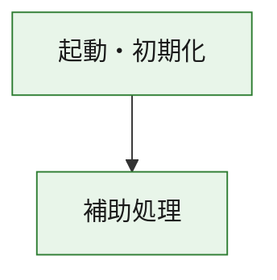
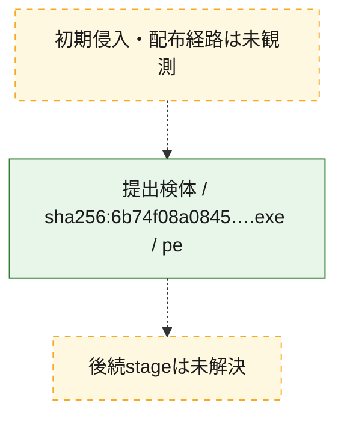
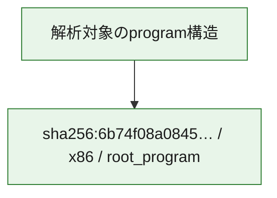

# 全体ロジック：6b74f08a084510ecc7862fc3ff26b6f02209933be2239bbbe279dab2536d0421

代表関数の静的証跡から、起動・初期化の処理群を確認しました。

## 読み方

- phaseの掲載順は解析上の整理順です。observed_call_edgesがない段階間の実行順を断定しません。
- 図の実線は静的に観測した関係、点線と黄色のノードは未観測・未解決の関係を示します。
- 図は静的な要約であり、動的実行を再現するものではありません。
- 詳細な関数解説とfingerprintは[STATIC-LOGIC.md](STATIC-LOGIC.md)を参照してください。

## 静的可視化

### 実行フロー

### 感染チェーン

### モジュール関係

## 処理段階

### 1. 起動・初期化

entry pointから初期化と後続処理への移行を確認します。
確度: `confirmed_static_function_evidence`

- `6b74f08a084510ecc7862fc3ff26b6f02209933be2239bbbe279dab2536d0421:ghidra:180001010` — 初期化と主要処理への分岐を行う入口関数です。 状態: `succeeded`、選定理由: `entry_point`, `meaningful_symbol_name`, `reviewed_call_centrality:22`, `role:entrypoint`, `small_program_complete_context`

### 2. 補助処理

主要処理を支える一般内部関数またはlibrary処理を確認します。
確度: `confirmed_static_function_evidence`

- `6b74f08a084510ecc7862fc3ff26b6f02209933be2239bbbe279dab2536d0421:ghidra:180001240` — 検体内部の一般処理を実装する関数です。 状態: `succeeded`、選定理由: `context_representative`, `reviewed_call_centrality:2`, `small_program_complete_context`
- `6b74f08a084510ecc7862fc3ff26b6f02209933be2239bbbe279dab2536d0421:ghidra:180001350` — 検体内部の一般処理を実装する関数です。 状態: `succeeded`、選定理由: `context_representative`, `reviewed_call_centrality:25`, `small_program_complete_context`
- `6b74f08a084510ecc7862fc3ff26b6f02209933be2239bbbe279dab2536d0421:ghidra:180003780` — 検体内部の一般処理を実装する関数です。 状態: `succeeded`、選定理由: `context_representative`, `reviewed_call_centrality:2`, `small_program_complete_context`
- `6b74f08a084510ecc7862fc3ff26b6f02209933be2239bbbe279dab2536d0421:ghidra:1800038e0` — 検体内部の一般処理を実装する関数です。 状態: `succeeded`、選定理由: `context_representative`, `reviewed_call_centrality:2`, `small_program_complete_context`

## 観測したcall関係

- `6b74f08a084510ecc7862fc3ff26b6f02209933be2239bbbe279dab2536d0421:ghidra:180001010` → `6b74f08a084510ecc7862fc3ff26b6f02209933be2239bbbe279dab2536d0421:ghidra:180001240` （`startup` → `support`）
- `6b74f08a084510ecc7862fc3ff26b6f02209933be2239bbbe279dab2536d0421:ghidra:180001010` → `6b74f08a084510ecc7862fc3ff26b6f02209933be2239bbbe279dab2536d0421:ghidra:180001350` （`startup` → `support`）
- `6b74f08a084510ecc7862fc3ff26b6f02209933be2239bbbe279dab2536d0421:ghidra:180001350` → `6b74f08a084510ecc7862fc3ff26b6f02209933be2239bbbe279dab2536d0421:ghidra:180001240` （`support` → `support`）
- `6b74f08a084510ecc7862fc3ff26b6f02209933be2239bbbe279dab2536d0421:ghidra:180001350` → `6b74f08a084510ecc7862fc3ff26b6f02209933be2239bbbe279dab2536d0421:ghidra:180003780` （`support` → `support`）
- `6b74f08a084510ecc7862fc3ff26b6f02209933be2239bbbe279dab2536d0421:ghidra:180001350` → `6b74f08a084510ecc7862fc3ff26b6f02209933be2239bbbe279dab2536d0421:ghidra:1800038e0` （`support` → `support`）
- `6b74f08a084510ecc7862fc3ff26b6f02209933be2239bbbe279dab2536d0421:ghidra:180003780` → `6b74f08a084510ecc7862fc3ff26b6f02209933be2239bbbe279dab2536d0421:ghidra:1800038e0` （`support` → `support`）
- `ghidra-function:4087a8be92bac37a80cca5ac` → `ghidra-external:1aec892cf5a17784118618e0` （`unclassified` → `unclassified`）
- `ghidra-function:4087a8be92bac37a80cca5ac` → `ghidra-external:2d7988f0071d09bf70059860` （`unclassified` → `unclassified`）
- `ghidra-function:4087a8be92bac37a80cca5ac` → `ghidra-external:32edf5ae9d3caa3865dc5e2e` （`unclassified` → `unclassified`）
- `ghidra-function:4087a8be92bac37a80cca5ac` → `ghidra-external:358c1bd9c3eb00a2459e4519` （`unclassified` → `unclassified`）
- `ghidra-function:4087a8be92bac37a80cca5ac` → `ghidra-external:399f5181da8844660ceb5b86` （`unclassified` → `unclassified`）
- `ghidra-function:4087a8be92bac37a80cca5ac` → `ghidra-external:4f1409d001664bdfcaf096dc` （`unclassified` → `unclassified`）
- `ghidra-function:4087a8be92bac37a80cca5ac` → `ghidra-external:53757c81cc66332f8e0062ba` （`unclassified` → `unclassified`）
- `ghidra-function:4087a8be92bac37a80cca5ac` → `ghidra-external:538fd1bf9c298258588a0820` （`unclassified` → `unclassified`）
- `ghidra-function:4087a8be92bac37a80cca5ac` → `ghidra-external:59855bb5339de879622bd387` （`unclassified` → `unclassified`）
- `ghidra-function:4087a8be92bac37a80cca5ac` → `ghidra-external:7000ef49e7c4147f25b302eb` （`unclassified` → `unclassified`）
- `ghidra-function:4087a8be92bac37a80cca5ac` → `ghidra-external:b2b35a59960ba88bf78c3d09` （`unclassified` → `unclassified`）
- `ghidra-function:4087a8be92bac37a80cca5ac` → `ghidra-external:b6c338114556966939c1bb69` （`unclassified` → `unclassified`）
- `ghidra-function:4087a8be92bac37a80cca5ac` → `ghidra-external:b86ac0a9f3817ecfa133cb11` （`unclassified` → `unclassified`）
- `ghidra-function:4087a8be92bac37a80cca5ac` → `ghidra-external:c9f784b4444cb613a37004a1` （`unclassified` → `unclassified`）
- `ghidra-function:4087a8be92bac37a80cca5ac` → `ghidra-external:caef23ef7907a9d39a76d577` （`unclassified` → `unclassified`）
- `ghidra-function:4087a8be92bac37a80cca5ac` → `ghidra-external:cc176810dc41b886c67c1d61` （`unclassified` → `unclassified`）
- `ghidra-function:4087a8be92bac37a80cca5ac` → `ghidra-external:cd6c70be87725db8b4c8673b` （`unclassified` → `unclassified`）
- `ghidra-function:4087a8be92bac37a80cca5ac` → `ghidra-external:cf502ac803dc3572aef3fa1d` （`unclassified` → `unclassified`）
- `ghidra-function:4087a8be92bac37a80cca5ac` → `ghidra-external:e2c4ec83803163d30e98c5cf` （`unclassified` → `unclassified`）
- `ghidra-function:4087a8be92bac37a80cca5ac` → `ghidra-external:f181037811a03d87b1f63338` （`unclassified` → `unclassified`）
- `ghidra-function:4087a8be92bac37a80cca5ac` → `ghidra-external:ff15b40663a6b042ae597358` （`unclassified` → `unclassified`）
- `ghidra-function:4087a8be92bac37a80cca5ac` → `ghidra-function:2d83530d3a9d3745c84c8195` （`unclassified` → `unclassified`）
- `ghidra-function:4087a8be92bac37a80cca5ac` → `ghidra-function:4d4b64af1ca20af14396bdbd` （`unclassified` → `unclassified`）
- `ghidra-function:4087a8be92bac37a80cca5ac` → `ghidra-function:5d3a2e676d233cf886dd5e45` （`unclassified` → `unclassified`）
- `ghidra-function:5d3a2e676d233cf886dd5e45` → `ghidra-function:4d4b64af1ca20af14396bdbd` （`unclassified` → `unclassified`）
- `ghidra-function:f173e9a1f12fecb8d6746f67` → `ghidra-function:073afadfb67da2221613253a` （`unclassified` → `unclassified`）
- `ghidra-function:f173e9a1f12fecb8d6746f67` → `ghidra-function:2aa6bb48a9e3c2b603c9c0e4` （`unclassified` → `unclassified`）
- `ghidra-function:f173e9a1f12fecb8d6746f67` → `ghidra-function:2d83530d3a9d3745c84c8195` （`unclassified` → `unclassified`）
- `ghidra-function:f173e9a1f12fecb8d6746f67` → `ghidra-function:3bff76218f45d28c35e86239` （`unclassified` → `unclassified`）
- `ghidra-function:f173e9a1f12fecb8d6746f67` → `ghidra-function:4087a8be92bac37a80cca5ac` （`unclassified` → `unclassified`）
- `ghidra-function:f173e9a1f12fecb8d6746f67` → `ghidra-function:86474cb5de9fc9b065b9fb69` （`unclassified` → `unclassified`）
- `ghidra-function:f173e9a1f12fecb8d6746f67` → `ghidra-function:8d3886524792632b20384cd3` （`unclassified` → `unclassified`）
- `ghidra-function:f173e9a1f12fecb8d6746f67` → `ghidra-function:8f219fd0d890d0a58fa2f1e2` （`unclassified` → `unclassified`）
- `ghidra-function:f173e9a1f12fecb8d6746f67` → `ghidra-function:92eb1be806c72ca3ecaf495c` （`unclassified` → `unclassified`）
- `ghidra-function:f173e9a1f12fecb8d6746f67` → `ghidra-function:c0e63033e043c0aedb3fc6cd` （`unclassified` → `unclassified`）
- `ghidra-function:f173e9a1f12fecb8d6746f67` → `ghidra-function:cc7ff5eb59aa3e4df6b88ab7` （`unclassified` → `unclassified`）
- `ghidra-function:f173e9a1f12fecb8d6746f67` → `ghidra-function:eda59cb678deefa8b6c37ac4` （`unclassified` → `unclassified`）

## 解析範囲と制約

- 選定外関数は全体inventoryへ残しますが、関数本体の個別解説対象にはしていません。
- indirect call、難読化、packer、VM、壊れたcontrol flowによりcall関係が欠落する場合があります。
- 文書は静的解析に基づき、検体実行や外部通信による動的確認は行っていません。
