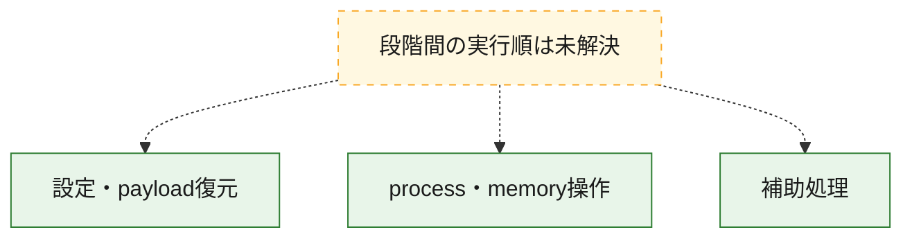
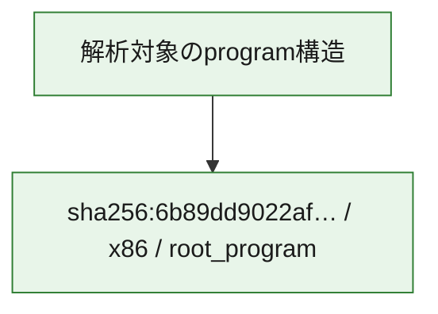

# 全体ロジック：6b89dd9022af219e0dff48934087535dc47824a9921eab7bf8244ae2f0451dc5

代表関数の静的証跡から、設定・payload復元、process・memory操作の処理群を確認しました。

## 読み方

- phaseの掲載順は解析上の整理順です。observed_call_edgesがない段階間の実行順を断定しません。
- 図の実線は静的に観測した関係、点線と黄色のノードは未観測・未解決の関係を示します。
- 図は静的な要約であり、動的実行を再現するものではありません。
- 詳細な関数解説とfingerprintは[STATIC-LOGIC.md](STATIC-LOGIC.md)を参照してください。

## 静的可視化

### 実行フロー

### 感染チェーン

```mermaid
flowchart TD
  chain_initial["初期侵入・配布経路は未観測"]
  chain_01["提出検体 / sha256:6b89dd9022af….dll / pe"]
  chain_02["静的復元層 1 / sha256:6b89dd9022af….dll::pe-resource-opaque / data"]
  chain_03["静的復元層 1 / sha256:6b89dd9022af….dll::pe-resource-opaque / data"]
  chain_04["静的復元層 1 / sha256:6b89dd9022af….dll::pe-resource-opaque / data"]
  chain_05["静的復元層 1 / sha256:6b89dd9022af….dll::pe-resource-opaque / data"]
  chain_06["静的復元層 1 / sha256:6b89dd9022af….dll::pe-resource-opaque / data"]
  chain_07["静的復元層 1 / sha256:6b89dd9022af….dll::pe-resource-opaque / data"]
  chain_08["静的復元層 1 / sha256:6b89dd9022af….dll::pe-resource-opaque / data"]
  chain_09["静的復元層 1 / sha256:6b89dd9022af….dll::pe-resource-opaque / data"]
  chain_10["静的復元層 1 / sha256:6b89dd9022af….dll::pe-resource-opaque / data"]
  chain_11["静的復元層 1 / sha256:6b89dd9022af….dll::pe-resource-opaque / data"]
  chain_12["静的復元層 1 / sha256:6b89dd9022af….dll::pe-resource-opaque / data"]
  chain_13["静的復元層 1 / sha256:6b89dd9022af….dll::pe-resource-opaque / data"]
  chain_14["静的復元層 1 / sha256:6b89dd9022af….dll::pe-resource-opaque / data"]
  chain_15["静的復元層 1 / sha256:6b89dd9022af….dll::pe-resource-opaque / data"]
  chain_16["静的復元層 1 / sha256:6b89dd9022af….dll::pe-resource-opaque / data"]
  chain_01 -->|pe-resource-opaque| chain_02
  chain_01 -->|pe-resource-opaque| chain_03
  chain_01 -->|pe-resource-opaque| chain_04
  chain_01 -->|pe-resource-opaque| chain_05
  chain_01 -->|pe-resource-opaque| chain_06
  chain_01 -->|pe-resource-opaque| chain_07
  chain_01 -->|pe-resource-opaque| chain_08
  chain_01 -->|pe-resource-opaque| chain_09
  chain_01 -->|pe-resource-opaque| chain_10
  chain_01 -->|pe-resource-opaque| chain_11
  chain_01 -->|pe-resource-opaque| chain_12
  chain_01 -->|pe-resource-opaque| chain_13
  chain_01 -->|pe-resource-opaque| chain_14
  chain_01 -->|pe-resource-opaque| chain_15
  chain_01 -->|pe-resource-opaque| chain_16
  chain_initial -.-> chain_01
  chain_more["その他16層はstatic-layers.jsonを参照"]
  chain_02 -.-> chain_more
  chain_03 -.-> chain_more
  chain_04 -.-> chain_more
  chain_05 -.-> chain_more
  chain_06 -.-> chain_more
  chain_07 -.-> chain_more
  chain_08 -.-> chain_more
  chain_09 -.-> chain_more
  chain_10 -.-> chain_more
  chain_11 -.-> chain_more
  chain_12 -.-> chain_more
  chain_13 -.-> chain_more
  chain_14 -.-> chain_more
  chain_15 -.-> chain_more
  chain_16 -.-> chain_more
  class chain_more unresolved
  class chain_01,chain_02,chain_03,chain_04,chain_05,chain_06,chain_07,chain_08,chain_09,chain_10,chain_11,chain_12,chain_13,chain_14,chain_15,chain_16 confirmed
  class chain_initial unresolved
  classDef confirmed fill:#e8f5e9,stroke:#2e7d32,color:#1b1b1b
  classDef unresolved fill:#fff8e1,stroke:#f9a825,color:#1b1b1b,stroke-dasharray:5 5
```

### モジュール関係

## 処理段階

### 1. 設定・payload復元

設定、resource、payload、暗号化データの復元・変換を確認します。
確度: `confirmed_static_function_evidence_with_limits`

- `6b89dd9022af219e0dff48934087535dc47824a9921eab7bf8244ae2f0451dc5:ghidra:00418164` — 設定、resource、payloadなどの解析・変換を行う関数です。 状態: `limited_bad_instruction_or_flow`、選定理由: `meaningful_symbol_name`, `reviewed_call_centrality:2`, `role:config_or_data_transform`

### 2. process・memory操作

process、thread、module、memory操作と実行移行を確認します。
確度: `confirmed_static_function_evidence_with_limits`

- `6b89dd9022af219e0dff48934087535dc47824a9921eab7bf8244ae2f0451dc5:ghidra:00405430` — process、thread、module、またはmemory操作に関係する関数です。 状態: `limited_bad_instruction_or_flow`、選定理由: `meaningful_symbol_name`, `reviewed_call_centrality:1`, `role:process_or_memory_operation`
- `6b89dd9022af219e0dff48934087535dc47824a9921eab7bf8244ae2f0451dc5:ghidra:00417978` — process、thread、module、またはmemory操作に関係する関数です。 状態: `succeeded`、選定理由: `meaningful_symbol_name`, `role:process_or_memory_operation`
- `6b89dd9022af219e0dff48934087535dc47824a9921eab7bf8244ae2f0451dc5:ghidra:00417990` — process、thread、module、またはmemory操作に関係する関数です。 状態: `limited_bad_instruction_or_flow`、選定理由: `meaningful_symbol_name`, `reviewed_call_centrality:1`, `role:process_or_memory_operation`
- `6b89dd9022af219e0dff48934087535dc47824a9921eab7bf8244ae2f0451dc5:ghidra:004181cc` — process、thread、module、またはmemory操作に関係する関数です。 状態: `limited_bad_instruction_or_flow`、選定理由: `meaningful_symbol_name`, `reviewed_call_centrality:5`, `role:process_or_memory_operation`
- `6b89dd9022af219e0dff48934087535dc47824a9921eab7bf8244ae2f0451dc5:ghidra:004181e4` — process、thread、module、またはmemory操作に関係する関数です。 状態: `limited_bad_instruction_or_flow`、選定理由: `meaningful_symbol_name`, `reviewed_call_centrality:7`, `role:process_or_memory_operation`
- `6b89dd9022af219e0dff48934087535dc47824a9921eab7bf8244ae2f0451dc5:ghidra:00609cc0` — process、thread、module、またはmemory操作に関係する関数です。 状態: `failed`、選定理由: `meaningful_symbol_name`, `role:process_or_memory_operation`

### 3. 補助処理

主要処理を支える一般内部関数またはlibrary処理を確認します。
確度: `confirmed_static_function_evidence_with_limits`

- `6b89dd9022af219e0dff48934087535dc47824a9921eab7bf8244ae2f0451dc5:ghidra:004053a8` — 検体内部の一般処理を実装する関数です。 状態: `limited_bad_instruction_or_flow`、選定理由: `meaningful_symbol_name`, `reviewed_call_centrality:4`
- `6b89dd9022af219e0dff48934087535dc47824a9921eab7bf8244ae2f0451dc5:ghidra:00416d30` — 検体内部の一般処理を実装する関数です。 状態: `limited_bad_instruction_or_flow`、選定理由: `meaningful_symbol_name`, `reviewed_call_centrality:5`
- `6b89dd9022af219e0dff48934087535dc47824a9921eab7bf8244ae2f0451dc5:ghidra:00417030` — 検体内部の一般処理を実装する関数です。 状態: `failed`、選定理由: `meaningful_symbol_name`
- `6b89dd9022af219e0dff48934087535dc47824a9921eab7bf8244ae2f0451dc5:ghidra:00417048` — 検体内部の一般処理を実装する関数です。 状態: `failed`、選定理由: `meaningful_symbol_name`
- `6b89dd9022af219e0dff48934087535dc47824a9921eab7bf8244ae2f0451dc5:ghidra:00417090` — 検体内部の一般処理を実装する関数です。 状態: `limited_bad_instruction_or_flow`、選定理由: `meaningful_symbol_name`, `reviewed_call_centrality:1`
- `6b89dd9022af219e0dff48934087535dc47824a9921eab7bf8244ae2f0451dc5:ghidra:004170b0` — 検体内部の一般処理を実装する関数です。 状態: `limited_bad_instruction_or_flow`、選定理由: `meaningful_symbol_name`, `reviewed_call_centrality:17`
- `6b89dd9022af219e0dff48934087535dc47824a9921eab7bf8244ae2f0451dc5:ghidra:00417308` — 検体内部の一般処理を実装する関数です。 状態: `limited_bad_instruction_or_flow`、選定理由: `meaningful_symbol_name`, `reviewed_call_centrality:22`
- `6b89dd9022af219e0dff48934087535dc47824a9921eab7bf8244ae2f0451dc5:ghidra:00417548` — 検体内部の一般処理を実装する関数です。 状態: `limited_bad_instruction_or_flow`、選定理由: `meaningful_symbol_name`, `reviewed_call_centrality:1`
- `6b89dd9022af219e0dff48934087535dc47824a9921eab7bf8244ae2f0451dc5:ghidra:00417708` — 検体内部の一般処理を実装する関数です。 状態: `succeeded`、選定理由: `meaningful_symbol_name`, `reviewed_call_centrality:1`
- `6b89dd9022af219e0dff48934087535dc47824a9921eab7bf8244ae2f0451dc5:ghidra:004179a8` — 検体内部の一般処理を実装する関数です。 状態: `limited_bad_instruction_or_flow`、選定理由: `meaningful_symbol_name`, `reviewed_call_centrality:5`
- `6b89dd9022af219e0dff48934087535dc47824a9921eab7bf8244ae2f0451dc5:ghidra:004179c0` — 検体内部の一般処理を実装する関数です。 状態: `succeeded`、選定理由: `meaningful_symbol_name`
- `6b89dd9022af219e0dff48934087535dc47824a9921eab7bf8244ae2f0451dc5:ghidra:004179d8` — 検体内部の一般処理を実装する関数です。 状態: `limited_bad_instruction_or_flow`、選定理由: `meaningful_symbol_name`, `reviewed_call_centrality:2`
- `6b89dd9022af219e0dff48934087535dc47824a9921eab7bf8244ae2f0451dc5:ghidra:004179f0` — 検体内部の一般処理を実装する関数です。 状態: `limited_bad_instruction_or_flow`、選定理由: `meaningful_symbol_name`, `reviewed_call_centrality:1`
- `6b89dd9022af219e0dff48934087535dc47824a9921eab7bf8244ae2f0451dc5:ghidra:00417af8` — 検体内部の一般処理を実装する関数です。 状態: `failed`、選定理由: `meaningful_symbol_name`
- `6b89dd9022af219e0dff48934087535dc47824a9921eab7bf8244ae2f0451dc5:ghidra:00417d20` — 検体内部の一般処理を実装する関数です。 状態: `limited_bad_instruction_or_flow`、選定理由: `meaningful_symbol_name`, `reviewed_call_centrality:18`
- `6b89dd9022af219e0dff48934087535dc47824a9921eab7bf8244ae2f0451dc5:ghidra:00417e78` — 検体内部の一般処理を実装する関数です。 状態: `limited_bad_instruction_or_flow`、選定理由: `meaningful_symbol_name`, `reviewed_call_centrality:3`
- `6b89dd9022af219e0dff48934087535dc47824a9921eab7bf8244ae2f0451dc5:ghidra:00418134` — 検体内部の一般処理を実装する関数です。 状態: `limited_bad_instruction_or_flow`、選定理由: `meaningful_symbol_name`, `reviewed_call_centrality:2`
- `6b89dd9022af219e0dff48934087535dc47824a9921eab7bf8244ae2f0451dc5:ghidra:0041814c` — 検体内部の一般処理を実装する関数です。 状態: `limited_bad_instruction_or_flow`、選定理由: `meaningful_symbol_name`, `reviewed_call_centrality:6`
- `6b89dd9022af219e0dff48934087535dc47824a9921eab7bf8244ae2f0451dc5:ghidra:0050e9e0` — 検体内部の一般処理を実装する関数です。 状態: `succeeded`、選定理由: `meaningful_symbol_name`
- `6b89dd9022af219e0dff48934087535dc47824a9921eab7bf8244ae2f0451dc5:ghidra:0050f1e8` — 検体内部の一般処理を実装する関数です。 状態: `succeeded`、選定理由: `meaningful_symbol_name`, `reviewed_call_centrality:4`
- `6b89dd9022af219e0dff48934087535dc47824a9921eab7bf8244ae2f0451dc5:ghidra:0053fe50` — 検体内部の一般処理を実装する関数です。 状態: `limited_bad_instruction_or_flow`、選定理由: `meaningful_symbol_name`, `reviewed_call_centrality:6`
- `6b89dd9022af219e0dff48934087535dc47824a9921eab7bf8244ae2f0451dc5:ghidra:0053fe68` — 検体内部の一般処理を実装する関数です。 状態: `limited_bad_instruction_or_flow`、選定理由: `meaningful_symbol_name`, `reviewed_call_centrality:9`
- `6b89dd9022af219e0dff48934087535dc47824a9921eab7bf8244ae2f0451dc5:ghidra:0053fe80` — 検体内部の一般処理を実装する関数です。 状態: `limited_bad_instruction_or_flow`、選定理由: `meaningful_symbol_name`, `reviewed_call_centrality:3`
- `6b89dd9022af219e0dff48934087535dc47824a9921eab7bf8244ae2f0451dc5:ghidra:0053fe98` — 検体内部の一般処理を実装する関数です。 状態: `limited_bad_instruction_or_flow`、選定理由: `meaningful_symbol_name`, `reviewed_call_centrality:10`
- `6b89dd9022af219e0dff48934087535dc47824a9921eab7bf8244ae2f0451dc5:ghidra:0053feb0` — 検体内部の一般処理を実装する関数です。 状態: `limited_bad_instruction_or_flow`、選定理由: `meaningful_symbol_name`, `reviewed_call_centrality:1`

## 観測したcall関係

- 代表関数間で直接解決できた呼出関係はありません。

## 解析範囲と制約

- 選定外関数は全体inventoryへ残しますが、関数本体の個別解説対象にはしていません。
- indirect call、難読化、packer、VM、壊れたcontrol flowによりcall関係が欠落する場合があります。
- 文書は静的解析に基づき、検体実行や外部通信による動的確認は行っていません。
