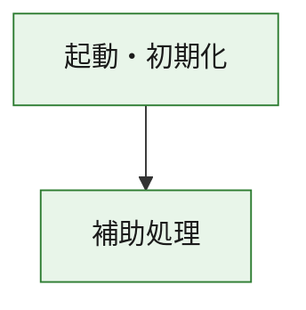
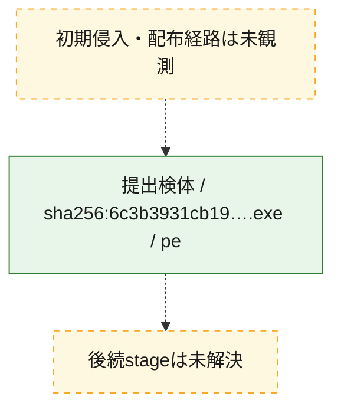
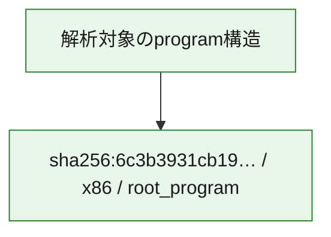

# 全体ロジック：6c3b3931cb190d6340c9de4041e073a42793b15a16120ecbc462318177275ab9

代表関数の静的証跡から、起動・初期化の処理群を確認しました。

## 読み方

- phaseの掲載順は解析上の整理順です。observed_call_edgesがない段階間の実行順を断定しません。
- 図の実線は静的に観測した関係、点線と黄色のノードは未観測・未解決の関係を示します。
- 図は静的な要約であり、動的実行を再現するものではありません。
- 詳細な関数解説とfingerprintは[STATIC-LOGIC.md](STATIC-LOGIC.md)を参照してください。

## 静的可視化

### 実行フロー

### 感染チェーン

### モジュール関係

## 処理段階

### 1. 起動・初期化

entry pointから初期化と後続処理への移行を確認します。
確度: `confirmed_static_function_evidence`

- `6c3b3931cb190d6340c9de4041e073a42793b15a16120ecbc462318177275ab9:ghidra:180001010` — 初期化と主要処理への分岐を行う入口関数です。 状態: `succeeded`、選定理由: `entry_point`, `meaningful_symbol_name`, `reviewed_call_centrality:22`, `role:entrypoint`, `small_program_complete_context`

### 2. 補助処理

主要処理を支える一般内部関数またはlibrary処理を確認します。
確度: `confirmed_static_function_evidence`

- `6c3b3931cb190d6340c9de4041e073a42793b15a16120ecbc462318177275ab9:ghidra:180001240` — 検体内部の一般処理を実装する関数です。 状態: `succeeded`、選定理由: `context_representative`, `reviewed_call_centrality:2`, `small_program_complete_context`
- `6c3b3931cb190d6340c9de4041e073a42793b15a16120ecbc462318177275ab9:ghidra:180001350` — 検体内部の一般処理を実装する関数です。 状態: `succeeded`、選定理由: `context_representative`, `reviewed_call_centrality:25`, `small_program_complete_context`
- `6c3b3931cb190d6340c9de4041e073a42793b15a16120ecbc462318177275ab9:ghidra:180003780` — 検体内部の一般処理を実装する関数です。 状態: `succeeded`、選定理由: `context_representative`, `reviewed_call_centrality:2`, `small_program_complete_context`
- `6c3b3931cb190d6340c9de4041e073a42793b15a16120ecbc462318177275ab9:ghidra:1800038e0` — 検体内部の一般処理を実装する関数です。 状態: `succeeded`、選定理由: `context_representative`, `reviewed_call_centrality:2`, `small_program_complete_context`

## 観測したcall関係

- `6c3b3931cb190d6340c9de4041e073a42793b15a16120ecbc462318177275ab9:ghidra:180001010` → `6c3b3931cb190d6340c9de4041e073a42793b15a16120ecbc462318177275ab9:ghidra:180001240` （`startup` → `support`）
- `6c3b3931cb190d6340c9de4041e073a42793b15a16120ecbc462318177275ab9:ghidra:180001010` → `6c3b3931cb190d6340c9de4041e073a42793b15a16120ecbc462318177275ab9:ghidra:180001350` （`startup` → `support`）
- `6c3b3931cb190d6340c9de4041e073a42793b15a16120ecbc462318177275ab9:ghidra:180001350` → `6c3b3931cb190d6340c9de4041e073a42793b15a16120ecbc462318177275ab9:ghidra:180001240` （`support` → `support`）
- `6c3b3931cb190d6340c9de4041e073a42793b15a16120ecbc462318177275ab9:ghidra:180001350` → `6c3b3931cb190d6340c9de4041e073a42793b15a16120ecbc462318177275ab9:ghidra:180003780` （`support` → `support`）
- `6c3b3931cb190d6340c9de4041e073a42793b15a16120ecbc462318177275ab9:ghidra:180001350` → `6c3b3931cb190d6340c9de4041e073a42793b15a16120ecbc462318177275ab9:ghidra:1800038e0` （`support` → `support`）
- `6c3b3931cb190d6340c9de4041e073a42793b15a16120ecbc462318177275ab9:ghidra:180003780` → `6c3b3931cb190d6340c9de4041e073a42793b15a16120ecbc462318177275ab9:ghidra:1800038e0` （`support` → `support`）
- `ghidra-function:12a30dacfa41209c6988ecd5` → `ghidra-function:0543aad5c03d598ba75752e4` （`unclassified` → `unclassified`）
- `ghidra-function:12a30dacfa41209c6988ecd5` → `ghidra-function:0e1020825e31bee34a1a64ec` （`unclassified` → `unclassified`）
- `ghidra-function:12a30dacfa41209c6988ecd5` → `ghidra-function:166769a6369de8d029e22dc0` （`unclassified` → `unclassified`）
- `ghidra-function:12a30dacfa41209c6988ecd5` → `ghidra-function:216801b8f98ec7e119aa4a35` （`unclassified` → `unclassified`）
- `ghidra-function:12a30dacfa41209c6988ecd5` → `ghidra-function:4ebceb0f67d0e006935a60fd` （`unclassified` → `unclassified`）
- `ghidra-function:12a30dacfa41209c6988ecd5` → `ghidra-function:61f90cb9dd60b0d5ac61d364` （`unclassified` → `unclassified`）
- `ghidra-function:12a30dacfa41209c6988ecd5` → `ghidra-function:69ce2e8b1b6e6f59627cf6fd` （`unclassified` → `unclassified`）
- `ghidra-function:12a30dacfa41209c6988ecd5` → `ghidra-function:766227f88255f46779eed45d` （`unclassified` → `unclassified`）
- `ghidra-function:12a30dacfa41209c6988ecd5` → `ghidra-function:a631ceb33d2ca2969a2902a5` （`unclassified` → `unclassified`）
- `ghidra-function:12a30dacfa41209c6988ecd5` → `ghidra-function:a7f817a50eb0adf9bb6980bc` （`unclassified` → `unclassified`）
- `ghidra-function:12a30dacfa41209c6988ecd5` → `ghidra-function:ecf41649b164d91b697eebf6` （`unclassified` → `unclassified`）
- `ghidra-function:12a30dacfa41209c6988ecd5` → `ghidra-function:f4dddcc20834fcddcf002606` （`unclassified` → `unclassified`）
- `ghidra-function:61f90cb9dd60b0d5ac61d364` → `ghidra-external:1e97169a50574f9b137c5f23` （`unclassified` → `unclassified`）
- `ghidra-function:61f90cb9dd60b0d5ac61d364` → `ghidra-external:22c6a43ba1c666a00fa6eacb` （`unclassified` → `unclassified`）
- `ghidra-function:61f90cb9dd60b0d5ac61d364` → `ghidra-external:24255240ddb23ef67b86f29f` （`unclassified` → `unclassified`）
- `ghidra-function:61f90cb9dd60b0d5ac61d364` → `ghidra-external:32704bf23e059d9a7e09ae71` （`unclassified` → `unclassified`）
- `ghidra-function:61f90cb9dd60b0d5ac61d364` → `ghidra-external:5ceafa0ccb0fe0fe7bf14ec7` （`unclassified` → `unclassified`）
- `ghidra-function:61f90cb9dd60b0d5ac61d364` → `ghidra-external:68b1862518162544a48db018` （`unclassified` → `unclassified`）
- `ghidra-function:61f90cb9dd60b0d5ac61d364` → `ghidra-external:69292779ab6449ffe941eda0` （`unclassified` → `unclassified`）
- `ghidra-function:61f90cb9dd60b0d5ac61d364` → `ghidra-external:6c55f6db4c5954b170460ee4` （`unclassified` → `unclassified`）
- `ghidra-function:61f90cb9dd60b0d5ac61d364` → `ghidra-external:6e903c38e5e358bdb1413ff2` （`unclassified` → `unclassified`）
- `ghidra-function:61f90cb9dd60b0d5ac61d364` → `ghidra-external:7b9cce5f70e474ce32d5d9ca` （`unclassified` → `unclassified`）
- `ghidra-function:61f90cb9dd60b0d5ac61d364` → `ghidra-external:8674e1628f7e09d75f0c8a6d` （`unclassified` → `unclassified`）
- `ghidra-function:61f90cb9dd60b0d5ac61d364` → `ghidra-external:8eb772e57247ea0b285dfd93` （`unclassified` → `unclassified`）
- `ghidra-function:61f90cb9dd60b0d5ac61d364` → `ghidra-external:925541d14359263c0c1bfbdf` （`unclassified` → `unclassified`）
- `ghidra-function:61f90cb9dd60b0d5ac61d364` → `ghidra-external:9eae49ac48051a6d850ed522` （`unclassified` → `unclassified`）
- `ghidra-function:61f90cb9dd60b0d5ac61d364` → `ghidra-external:b3298f1aae9131053cb1b7fa` （`unclassified` → `unclassified`）
- `ghidra-function:61f90cb9dd60b0d5ac61d364` → `ghidra-external:b3aa871b854be8db6dd4333c` （`unclassified` → `unclassified`）
- `ghidra-function:61f90cb9dd60b0d5ac61d364` → `ghidra-external:b993b5fe79cf0120a2043777` （`unclassified` → `unclassified`）
- `ghidra-function:61f90cb9dd60b0d5ac61d364` → `ghidra-external:c6c1f004dd8f859a1779a3e8` （`unclassified` → `unclassified`）
- `ghidra-function:61f90cb9dd60b0d5ac61d364` → `ghidra-external:d78817ca62150f1b6c7a0928` （`unclassified` → `unclassified`）
- `ghidra-function:61f90cb9dd60b0d5ac61d364` → `ghidra-external:d915612f5dfb7d46fcc3a464` （`unclassified` → `unclassified`）
- `ghidra-function:61f90cb9dd60b0d5ac61d364` → `ghidra-external:e1a80e7596b11f663a256627` （`unclassified` → `unclassified`）
- `ghidra-function:61f90cb9dd60b0d5ac61d364` → `ghidra-function:1f50fc111f981dea02323f9c` （`unclassified` → `unclassified`）
- `ghidra-function:61f90cb9dd60b0d5ac61d364` → `ghidra-function:c376867dd92288469c9bfb1f` （`unclassified` → `unclassified`）
- `ghidra-function:61f90cb9dd60b0d5ac61d364` → `ghidra-function:ecf41649b164d91b697eebf6` （`unclassified` → `unclassified`）
- `ghidra-function:c376867dd92288469c9bfb1f` → `ghidra-function:1f50fc111f981dea02323f9c` （`unclassified` → `unclassified`）

## 解析範囲と制約

- 選定外関数は全体inventoryへ残しますが、関数本体の個別解説対象にはしていません。
- indirect call、難読化、packer、VM、壊れたcontrol flowによりcall関係が欠落する場合があります。
- 文書は静的解析に基づき、検体実行や外部通信による動的確認は行っていません。
