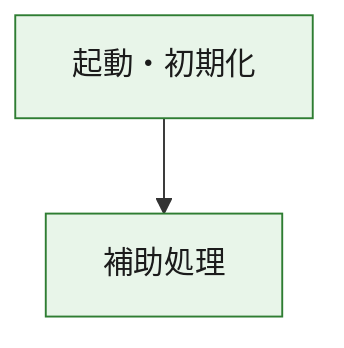
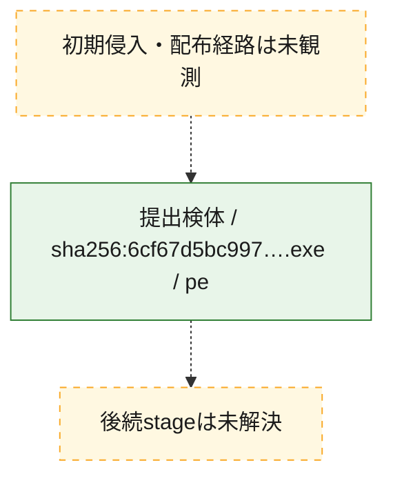
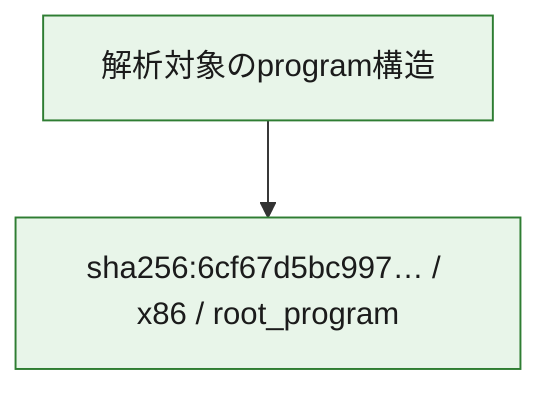

# 全体ロジック：6cf67d5bc9970153926c7b65e1b25c18142ea8185f077cbf43dd57fb6491c421

代表関数の静的証跡から、起動・初期化の処理群を確認しました。

## 読み方

- phaseの掲載順は解析上の整理順です。observed_call_edgesがない段階間の実行順を断定しません。
- 図の実線は静的に観測した関係、点線と黄色のノードは未観測・未解決の関係を示します。
- 図は静的な要約であり、動的実行を再現するものではありません。
- 詳細な関数解説とfingerprintは[STATIC-LOGIC.md](STATIC-LOGIC.md)を参照してください。

## 静的可視化

### 実行フロー

### 感染チェーン

### モジュール関係

## 処理段階

### 1. 起動・初期化

entry pointから初期化と後続処理への移行を確認します。
確度: `confirmed_static_function_evidence`

- `6cf67d5bc9970153926c7b65e1b25c18142ea8185f077cbf43dd57fb6491c421:ghidra:23b0411f0` — 初期化と主要処理への分岐を行う入口関数です。 状態: `succeeded`、選定理由: `entry_point`, `meaningful_symbol_name`, `reviewed_call_centrality:2`, `role:entrypoint`

### 2. 補助処理

主要処理を支える一般内部関数またはlibrary処理を確認します。
確度: `confirmed_static_function_evidence_with_limits`

- `6cf67d5bc9970153926c7b65e1b25c18142ea8185f077cbf43dd57fb6491c421:ghidra:23b041000` — 検体内部の一般処理を実装する関数です。 状態: `succeeded`、選定理由: `context_representative`, `reviewed_call_centrality:14`
- `6cf67d5bc9970153926c7b65e1b25c18142ea8185f077cbf43dd57fb6491c421:ghidra:23b041330` — 検体内部の一般処理を実装する関数です。 状態: `limited_bad_instruction_or_flow`、選定理由: `context_representative`, `reviewed_call_centrality:2`
- `6cf67d5bc9970153926c7b65e1b25c18142ea8185f077cbf43dd57fb6491c421:ghidra:23b041340` — 検体内部の一般処理を実装する関数です。 状態: `limited_bad_instruction_or_flow`、選定理由: `context_representative`, `reviewed_call_centrality:2`
- `6cf67d5bc9970153926c7b65e1b25c18142ea8185f077cbf43dd57fb6491c421:ghidra:23b041350` — 検体内部の一般処理を実装する関数です。 状態: `succeeded`、選定理由: `context_representative`
- `6cf67d5bc9970153926c7b65e1b25c18142ea8185f077cbf43dd57fb6491c421:ghidra:23b062ec0` — 検体内部の一般処理を実装する関数です。 状態: `succeeded`、選定理由: `context_representative`, `reviewed_call_centrality:4`
- `6cf67d5bc9970153926c7b65e1b25c18142ea8185f077cbf43dd57fb6491c421:ghidra:23b062fc0` — 検体内部の一般処理を実装する関数です。 状態: `succeeded`、選定理由: `context_representative`, `reviewed_call_centrality:4`
- `6cf67d5bc9970153926c7b65e1b25c18142ea8185f077cbf43dd57fb6491c421:ghidra:23b063020` — 検体内部の一般処理を実装する関数です。 状態: `succeeded`、選定理由: `context_representative`, `reviewed_call_centrality:7`
- `6cf67d5bc9970153926c7b65e1b25c18142ea8185f077cbf43dd57fb6491c421:ghidra:23b063100` — 検体内部の一般処理を実装する関数です。 状態: `succeeded`、選定理由: `context_representative`, `reviewed_call_centrality:1`
- `6cf67d5bc9970153926c7b65e1b25c18142ea8185f077cbf43dd57fb6491c421:ghidra:23b063180` — 検体内部の一般処理を実装する関数です。 状態: `succeeded`、選定理由: `context_representative`, `reviewed_call_centrality:1`
- `6cf67d5bc9970153926c7b65e1b25c18142ea8185f077cbf43dd57fb6491c421:ghidra:23b0631e0` — 検体内部の一般処理を実装する関数です。 状態: `succeeded`、選定理由: `context_representative`, `reviewed_call_centrality:2`
- `6cf67d5bc9970153926c7b65e1b25c18142ea8185f077cbf43dd57fb6491c421:ghidra:23b063250` — 検体内部の一般処理を実装する関数です。 状態: `succeeded`、選定理由: `context_representative`
- `6cf67d5bc9970153926c7b65e1b25c18142ea8185f077cbf43dd57fb6491c421:ghidra:23b0633b0` — 検体内部の一般処理を実装する関数です。 状態: `succeeded`、選定理由: `context_representative`
- `6cf67d5bc9970153926c7b65e1b25c18142ea8185f077cbf43dd57fb6491c421:ghidra:23b0633e0` — 検体内部の一般処理を実装する関数です。 状態: `succeeded`、選定理由: `context_representative`
- `6cf67d5bc9970153926c7b65e1b25c18142ea8185f077cbf43dd57fb6491c421:ghidra:23b063420` — 検体内部の一般処理を実装する関数です。 状態: `succeeded`、選定理由: `context_representative`, `reviewed_call_centrality:4`
- `6cf67d5bc9970153926c7b65e1b25c18142ea8185f077cbf43dd57fb6491c421:ghidra:23b063500` — 検体内部の一般処理を実装する関数です。 状態: `succeeded`、選定理由: `context_representative`, `reviewed_call_centrality:1`
- `6cf67d5bc9970153926c7b65e1b25c18142ea8185f077cbf43dd57fb6491c421:ghidra:23b063560` — 検体内部の一般処理を実装する関数です。 状態: `succeeded`、選定理由: `context_representative`
- `6cf67d5bc9970153926c7b65e1b25c18142ea8185f077cbf43dd57fb6491c421:ghidra:23b0635e0` — 検体内部の一般処理を実装する関数です。 状態: `succeeded`、選定理由: `context_representative`
- `6cf67d5bc9970153926c7b65e1b25c18142ea8185f077cbf43dd57fb6491c421:ghidra:23b063640` — 検体内部の一般処理を実装する関数です。 状態: `succeeded`、選定理由: `context_representative`, `reviewed_call_centrality:1`
- `6cf67d5bc9970153926c7b65e1b25c18142ea8185f077cbf43dd57fb6491c421:ghidra:23b063710` — 検体内部の一般処理を実装する関数です。 状態: `succeeded`、選定理由: `context_representative`
- `6cf67d5bc9970153926c7b65e1b25c18142ea8185f077cbf43dd57fb6491c421:ghidra:23b063810` — 検体内部の一般処理を実装する関数です。 状態: `succeeded`、選定理由: `context_representative`, `reviewed_call_centrality:2`
- `6cf67d5bc9970153926c7b65e1b25c18142ea8185f077cbf43dd57fb6491c421:ghidra:23b0638a0` — 検体内部の一般処理を実装する関数です。 状態: `succeeded`、選定理由: `context_representative`, `reviewed_call_centrality:6`
- `6cf67d5bc9970153926c7b65e1b25c18142ea8185f077cbf43dd57fb6491c421:ghidra:23b0639f0` — 検体内部の一般処理を実装する関数です。 状態: `succeeded`、選定理由: `context_representative`, `reviewed_call_centrality:6`
- `6cf67d5bc9970153926c7b65e1b25c18142ea8185f077cbf43dd57fb6491c421:ghidra:23b063c60` — 検体内部の一般処理を実装する関数です。 状態: `succeeded`、選定理由: `context_representative`, `reviewed_call_centrality:5`
- `6cf67d5bc9970153926c7b65e1b25c18142ea8185f077cbf43dd57fb6491c421:ghidra:23b063d70` — 検体内部の一般処理を実装する関数です。 状態: `succeeded`、選定理由: `context_representative`, `reviewed_call_centrality:4`
- `6cf67d5bc9970153926c7b65e1b25c18142ea8185f077cbf43dd57fb6491c421:ghidra:23b063ff0` — 検体内部の一般処理を実装する関数です。 状態: `succeeded`、選定理由: `context_representative`, `reviewed_call_centrality:2`
- `6cf67d5bc9970153926c7b65e1b25c18142ea8185f077cbf43dd57fb6491c421:ghidra:23b064090` — 検体内部の一般処理を実装する関数です。 状態: `succeeded`、選定理由: `context_representative`, `reviewed_call_centrality:27`
- `6cf67d5bc9970153926c7b65e1b25c18142ea8185f077cbf43dd57fb6491c421:ghidra:23b064c40` — 検体内部の一般処理を実装する関数です。 状態: `succeeded`、選定理由: `context_representative`, `reviewed_call_centrality:6`
- `6cf67d5bc9970153926c7b65e1b25c18142ea8185f077cbf43dd57fb6491c421:ghidra:23b064d60` — 検体内部の一般処理を実装する関数です。 状態: `succeeded`、選定理由: `context_representative`, `reviewed_call_centrality:4`
- `6cf67d5bc9970153926c7b65e1b25c18142ea8185f077cbf43dd57fb6491c421:ghidra:23b070070` — compiler生成処理または汎用library処理とみられる関数です。 状態: `succeeded`、選定理由: `entry_point`, `meaningful_symbol_name`, `reviewed_call_centrality:7`
- `6cf67d5bc9970153926c7b65e1b25c18142ea8185f077cbf43dd57fb6491c421:ghidra:23b070090` — compiler生成処理または汎用library処理とみられる関数です。 状態: `succeeded`、選定理由: `entry_point`, `meaningful_symbol_name`, `reviewed_call_centrality:4`
- `6cf67d5bc9970153926c7b65e1b25c18142ea8185f077cbf43dd57fb6491c421:ghidra:23b07eb40` — compiler生成処理または汎用library処理とみられる関数です。 状態: `limited_bad_instruction_or_flow`、選定理由: `entry_point`, `meaningful_symbol_name`, `reviewed_call_centrality:12`

## 観測したcall関係

- `6cf67d5bc9970153926c7b65e1b25c18142ea8185f077cbf43dd57fb6491c421:ghidra:23b041000` → `6cf67d5bc9970153926c7b65e1b25c18142ea8185f077cbf43dd57fb6491c421:ghidra:23b070090` （`support` → `support`）
- `6cf67d5bc9970153926c7b65e1b25c18142ea8185f077cbf43dd57fb6491c421:ghidra:23b0411f0` → `6cf67d5bc9970153926c7b65e1b25c18142ea8185f077cbf43dd57fb6491c421:ghidra:23b041000` （`startup` → `support`）
- `6cf67d5bc9970153926c7b65e1b25c18142ea8185f077cbf43dd57fb6491c421:ghidra:23b063100` → `6cf67d5bc9970153926c7b65e1b25c18142ea8185f077cbf43dd57fb6491c421:ghidra:23b063020` （`support` → `support`）
- `6cf67d5bc9970153926c7b65e1b25c18142ea8185f077cbf43dd57fb6491c421:ghidra:23b0631e0` → `6cf67d5bc9970153926c7b65e1b25c18142ea8185f077cbf43dd57fb6491c421:ghidra:23b063020` （`support` → `support`）
- `6cf67d5bc9970153926c7b65e1b25c18142ea8185f077cbf43dd57fb6491c421:ghidra:23b063810` → `6cf67d5bc9970153926c7b65e1b25c18142ea8185f077cbf43dd57fb6491c421:ghidra:23b063020` （`support` → `support`）
- `6cf67d5bc9970153926c7b65e1b25c18142ea8185f077cbf43dd57fb6491c421:ghidra:23b0638a0` → `6cf67d5bc9970153926c7b65e1b25c18142ea8185f077cbf43dd57fb6491c421:ghidra:23b062fc0` （`support` → `support`）
- `6cf67d5bc9970153926c7b65e1b25c18142ea8185f077cbf43dd57fb6491c421:ghidra:23b0638a0` → `6cf67d5bc9970153926c7b65e1b25c18142ea8185f077cbf43dd57fb6491c421:ghidra:23b063020` （`support` → `support`）
- `6cf67d5bc9970153926c7b65e1b25c18142ea8185f077cbf43dd57fb6491c421:ghidra:23b0639f0` → `6cf67d5bc9970153926c7b65e1b25c18142ea8185f077cbf43dd57fb6491c421:ghidra:23b062fc0` （`support` → `support`）
- `6cf67d5bc9970153926c7b65e1b25c18142ea8185f077cbf43dd57fb6491c421:ghidra:23b0639f0` → `6cf67d5bc9970153926c7b65e1b25c18142ea8185f077cbf43dd57fb6491c421:ghidra:23b063020` （`support` → `support`）
- `6cf67d5bc9970153926c7b65e1b25c18142ea8185f077cbf43dd57fb6491c421:ghidra:23b063c60` → `6cf67d5bc9970153926c7b65e1b25c18142ea8185f077cbf43dd57fb6491c421:ghidra:23b062fc0` （`support` → `support`）
- `6cf67d5bc9970153926c7b65e1b25c18142ea8185f077cbf43dd57fb6491c421:ghidra:23b063c60` → `6cf67d5bc9970153926c7b65e1b25c18142ea8185f077cbf43dd57fb6491c421:ghidra:23b063020` （`support` → `support`）
- `6cf67d5bc9970153926c7b65e1b25c18142ea8185f077cbf43dd57fb6491c421:ghidra:23b063d70` → `6cf67d5bc9970153926c7b65e1b25c18142ea8185f077cbf43dd57fb6491c421:ghidra:23b062ec0` （`support` → `support`）
- `6cf67d5bc9970153926c7b65e1b25c18142ea8185f077cbf43dd57fb6491c421:ghidra:23b063d70` → `6cf67d5bc9970153926c7b65e1b25c18142ea8185f077cbf43dd57fb6491c421:ghidra:23b063c60` （`support` → `support`）
- `6cf67d5bc9970153926c7b65e1b25c18142ea8185f077cbf43dd57fb6491c421:ghidra:23b063ff0` → `6cf67d5bc9970153926c7b65e1b25c18142ea8185f077cbf43dd57fb6491c421:ghidra:23b062ec0` （`support` → `support`）
- `6cf67d5bc9970153926c7b65e1b25c18142ea8185f077cbf43dd57fb6491c421:ghidra:23b063ff0` → `6cf67d5bc9970153926c7b65e1b25c18142ea8185f077cbf43dd57fb6491c421:ghidra:23b063c60` （`support` → `support`）
- `6cf67d5bc9970153926c7b65e1b25c18142ea8185f077cbf43dd57fb6491c421:ghidra:23b064090` → `6cf67d5bc9970153926c7b65e1b25c18142ea8185f077cbf43dd57fb6491c421:ghidra:23b062ec0` （`support` → `support`）
- `6cf67d5bc9970153926c7b65e1b25c18142ea8185f077cbf43dd57fb6491c421:ghidra:23b064090` → `6cf67d5bc9970153926c7b65e1b25c18142ea8185f077cbf43dd57fb6491c421:ghidra:23b062fc0` （`support` → `support`）
- `6cf67d5bc9970153926c7b65e1b25c18142ea8185f077cbf43dd57fb6491c421:ghidra:23b064090` → `6cf67d5bc9970153926c7b65e1b25c18142ea8185f077cbf43dd57fb6491c421:ghidra:23b063020` （`support` → `support`）
- `6cf67d5bc9970153926c7b65e1b25c18142ea8185f077cbf43dd57fb6491c421:ghidra:23b064090` → `6cf67d5bc9970153926c7b65e1b25c18142ea8185f077cbf43dd57fb6491c421:ghidra:23b063180` （`support` → `support`）
- `6cf67d5bc9970153926c7b65e1b25c18142ea8185f077cbf43dd57fb6491c421:ghidra:23b064090` → `6cf67d5bc9970153926c7b65e1b25c18142ea8185f077cbf43dd57fb6491c421:ghidra:23b0631e0` （`support` → `support`）
- `6cf67d5bc9970153926c7b65e1b25c18142ea8185f077cbf43dd57fb6491c421:ghidra:23b064090` → `6cf67d5bc9970153926c7b65e1b25c18142ea8185f077cbf43dd57fb6491c421:ghidra:23b063500` （`support` → `support`）
- `6cf67d5bc9970153926c7b65e1b25c18142ea8185f077cbf43dd57fb6491c421:ghidra:23b064090` → `6cf67d5bc9970153926c7b65e1b25c18142ea8185f077cbf43dd57fb6491c421:ghidra:23b063810` （`support` → `support`）
- `6cf67d5bc9970153926c7b65e1b25c18142ea8185f077cbf43dd57fb6491c421:ghidra:23b064090` → `6cf67d5bc9970153926c7b65e1b25c18142ea8185f077cbf43dd57fb6491c421:ghidra:23b063c60` （`support` → `support`）
- `6cf67d5bc9970153926c7b65e1b25c18142ea8185f077cbf43dd57fb6491c421:ghidra:23b064090` → `6cf67d5bc9970153926c7b65e1b25c18142ea8185f077cbf43dd57fb6491c421:ghidra:23b063d70` （`support` → `support`）
- `6cf67d5bc9970153926c7b65e1b25c18142ea8185f077cbf43dd57fb6491c421:ghidra:23b064090` → `6cf67d5bc9970153926c7b65e1b25c18142ea8185f077cbf43dd57fb6491c421:ghidra:23b064c40` （`support` → `support`）
- `6cf67d5bc9970153926c7b65e1b25c18142ea8185f077cbf43dd57fb6491c421:ghidra:23b064090` → `6cf67d5bc9970153926c7b65e1b25c18142ea8185f077cbf43dd57fb6491c421:ghidra:23b064d60` （`support` → `support`）
- `6cf67d5bc9970153926c7b65e1b25c18142ea8185f077cbf43dd57fb6491c421:ghidra:23b064c40` → `6cf67d5bc9970153926c7b65e1b25c18142ea8185f077cbf43dd57fb6491c421:ghidra:23b062ec0` （`support` → `support`）
- `6cf67d5bc9970153926c7b65e1b25c18142ea8185f077cbf43dd57fb6491c421:ghidra:23b064c40` → `6cf67d5bc9970153926c7b65e1b25c18142ea8185f077cbf43dd57fb6491c421:ghidra:23b064090` （`support` → `support`）
- `6cf67d5bc9970153926c7b65e1b25c18142ea8185f077cbf43dd57fb6491c421:ghidra:23b064d60` → `6cf67d5bc9970153926c7b65e1b25c18142ea8185f077cbf43dd57fb6491c421:ghidra:23b064090` （`support` → `support`）
- `6cf67d5bc9970153926c7b65e1b25c18142ea8185f077cbf43dd57fb6491c421:ghidra:23b064d60` → `6cf67d5bc9970153926c7b65e1b25c18142ea8185f077cbf43dd57fb6491c421:ghidra:23b064c40` （`support` → `support`）
- `ghidra-function:0299743d22f6472287c165f6` → `ghidra-external:2de2eadbcad9f9004841680a` （`unclassified` → `unclassified`）
- `ghidra-function:0299743d22f6472287c165f6` → `ghidra-external:439fddceb099a1529ca2f001` （`unclassified` → `unclassified`）
- `ghidra-function:0299743d22f6472287c165f6` → `ghidra-function:17489d08029d8a856dda0fea` （`unclassified` → `unclassified`）
- `ghidra-function:0299743d22f6472287c165f6` → `ghidra-function:1906586ab61e7ab82e6773ef` （`unclassified` → `unclassified`）
- `ghidra-function:0299743d22f6472287c165f6` → `ghidra-function:1c95d18120e39f42bcd60710` （`unclassified` → `unclassified`）
- `ghidra-function:0299743d22f6472287c165f6` → `ghidra-function:267edb354494dd1a1cb28668` （`unclassified` → `unclassified`）
- `ghidra-function:0299743d22f6472287c165f6` → `ghidra-function:38cf45b070fb754249f165f3` （`unclassified` → `unclassified`）
- `ghidra-function:0299743d22f6472287c165f6` → `ghidra-function:40a74626eda67842d8572b4d` （`unclassified` → `unclassified`）
- `ghidra-function:0299743d22f6472287c165f6` → `ghidra-function:426c5a9d18a2617920742e3b` （`unclassified` → `unclassified`）
- `ghidra-function:0299743d22f6472287c165f6` → `ghidra-function:45d556e51474261e9908f6f9` （`unclassified` → `unclassified`）
- `ghidra-function:0299743d22f6472287c165f6` → `ghidra-function:48414edec197bb5b17466bc2` （`unclassified` → `unclassified`）
- `ghidra-function:0299743d22f6472287c165f6` → `ghidra-function:4e1d3a49098475b8f612cbdc` （`unclassified` → `unclassified`）
- `ghidra-function:0299743d22f6472287c165f6` → `ghidra-function:51241224c2323c7e92cd1e6c` （`unclassified` → `unclassified`）
- `ghidra-function:0299743d22f6472287c165f6` → `ghidra-function:533070a48a4cadc461ecbc6d` （`unclassified` → `unclassified`）
- `ghidra-function:0299743d22f6472287c165f6` → `ghidra-function:5a33779ac14b02e6895ca635` （`unclassified` → `unclassified`）
- `ghidra-function:0299743d22f6472287c165f6` → `ghidra-function:6dcf321baa8076a039ba2393` （`unclassified` → `unclassified`）
- `ghidra-function:0299743d22f6472287c165f6` → `ghidra-function:71017bd669112eddab8c79ee` （`unclassified` → `unclassified`）
- `ghidra-function:0299743d22f6472287c165f6` → `ghidra-function:837dd5867a68471968d418f0` （`unclassified` → `unclassified`）
- `ghidra-function:0299743d22f6472287c165f6` → `ghidra-function:88795d8dece4b03792adc9fe` （`unclassified` → `unclassified`）
- `ghidra-function:0299743d22f6472287c165f6` → `ghidra-function:8cc38993022fcb2472d4875a` （`unclassified` → `unclassified`）
- `ghidra-function:0299743d22f6472287c165f6` → `ghidra-function:b067ee5330ff74c73b86ebd0` （`unclassified` → `unclassified`）
- `ghidra-function:0299743d22f6472287c165f6` → `ghidra-function:bbde68c0dc76d9038b057c4e` （`unclassified` → `unclassified`）
- `ghidra-function:0299743d22f6472287c165f6` → `ghidra-function:bcd1b8a3b220ff2b31d4dbf8` （`unclassified` → `unclassified`）
- `ghidra-function:0299743d22f6472287c165f6` → `ghidra-function:d797d1d86613cb9d359f4981` （`unclassified` → `unclassified`）
- `ghidra-function:0299743d22f6472287c165f6` → `ghidra-function:eb1156706859bc6a48a7bda1` （`unclassified` → `unclassified`）
- `ghidra-function:049bdaf756d038bbdfce89b0` → `ghidra-external:41f975f9a67f76dbc58596ad` （`unclassified` → `unclassified`）
- `ghidra-function:049bdaf756d038bbdfce89b0` → `ghidra-function:46896dfb3c7c76889036b380` （`unclassified` → `unclassified`）
- `ghidra-function:049bdaf756d038bbdfce89b0` → `ghidra-function:a38aec2d71e2755c5d351a63` （`unclassified` → `unclassified`）
- `ghidra-function:049bdaf756d038bbdfce89b0` → `ghidra-function:c5a82e8157aa2e8867367ffe` （`unclassified` → `unclassified`）
- `ghidra-function:049bdaf756d038bbdfce89b0` → `ghidra-function:f12a8b03a1ea3d1ad89e9a0c` （`unclassified` → `unclassified`）
- `ghidra-function:1d22abbc0202965dd303621d` → `ghidra-function:d89e8dc71089b4626264a66b` （`unclassified` → `unclassified`）
- `ghidra-function:1ddd6531a1a8a5aa599cea0c` → `ghidra-function:d89e8dc71089b4626264a66b` （`unclassified` → `unclassified`）
- `ghidra-function:344b285b931e71b39c46996a` → `ghidra-function:267edb354494dd1a1cb28668` （`unclassified` → `unclassified`）
- `ghidra-function:344b285b931e71b39c46996a` → `ghidra-function:bcd1b8a3b220ff2b31d4dbf8` （`unclassified` → `unclassified`）
- `ghidra-function:38cf45b070fb754249f165f3` → `ghidra-external:4f52e65ff28fe806d311c7d3` （`unclassified` → `unclassified`）
- `ghidra-function:38cf45b070fb754249f165f3` → `ghidra-function:0299743d22f6472287c165f6` （`unclassified` → `unclassified`）
- `ghidra-function:38cf45b070fb754249f165f3` → `ghidra-function:8cc38993022fcb2472d4875a` （`unclassified` → `unclassified`）
- `ghidra-function:48414edec197bb5b17466bc2` → `ghidra-external:46383144cc0e388e0ef364e5` （`unclassified` → `unclassified`）
- `ghidra-function:48414edec197bb5b17466bc2` → `ghidra-function:267edb354494dd1a1cb28668` （`unclassified` → `unclassified`）
- `ghidra-function:48414edec197bb5b17466bc2` → `ghidra-function:bcd1b8a3b220ff2b31d4dbf8` （`unclassified` → `unclassified`）
- `ghidra-function:4dab776c45c4b6233f624c30` → `ghidra-external:439fddceb099a1529ca2f001` （`unclassified` → `unclassified`）
- `ghidra-function:600778002c3164dd34834e98` → `ghidra-external:e467e0fc5347646613fa47c1` （`unclassified` → `unclassified`）
- `ghidra-function:600778002c3164dd34834e98` → `ghidra-function:074f1028f1a93b0e243a774b` （`unclassified` → `unclassified`）
- `ghidra-function:600778002c3164dd34834e98` → `ghidra-function:07f85192da33187a2736ee23` （`unclassified` → `unclassified`）
- `ghidra-function:600778002c3164dd34834e98` → `ghidra-function:4a35058f67db595e2c1102e3` （`unclassified` → `unclassified`）
- `ghidra-function:600778002c3164dd34834e98` → `ghidra-function:7692d29a40a47cd48cf17c58` （`unclassified` → `unclassified`）
- `ghidra-function:600778002c3164dd34834e98` → `ghidra-function:9a83a7e5d9204f2e03584550` （`unclassified` → `unclassified`）
- `ghidra-function:600778002c3164dd34834e98` → `ghidra-function:c36c05749a36350fd9792d0e` （`unclassified` → `unclassified`）
- `ghidra-function:600778002c3164dd34834e98` → `ghidra-function:ca21ccd64b6e782854369e49` （`unclassified` → `unclassified`）
- `ghidra-function:600778002c3164dd34834e98` → `ghidra-function:ffd5ad6654f22ce2885d0015` （`unclassified` → `unclassified`）
- `ghidra-function:71017bd669112eddab8c79ee` → `ghidra-function:6dcf321baa8076a039ba2393` （`unclassified` → `unclassified`）
- `ghidra-function:7b7c06f7a158de33917f5e58` → `ghidra-external:439fddceb099a1529ca2f001` （`unclassified` → `unclassified`）
- `ghidra-function:7b7c06f7a158de33917f5e58` → `ghidra-function:1906586ab61e7ab82e6773ef` （`unclassified` → `unclassified`）
- `ghidra-function:7b7c06f7a158de33917f5e58` → `ghidra-function:40a74626eda67842d8572b4d` （`unclassified` → `unclassified`）
- `ghidra-function:7b7c06f7a158de33917f5e58` → `ghidra-function:51241224c2323c7e92cd1e6c` （`unclassified` → `unclassified`）
- `ghidra-function:7b7c06f7a158de33917f5e58` → `ghidra-function:5a33779ac14b02e6895ca635` （`unclassified` → `unclassified`）
- `ghidra-function:7b7c06f7a158de33917f5e58` → `ghidra-function:6dcf321baa8076a039ba2393` （`unclassified` → `unclassified`）
- `ghidra-function:7e394036568fb60c5647438e` → `ghidra-external:439fddceb099a1529ca2f001` （`unclassified` → `unclassified`）
- `ghidra-function:7e394036568fb60c5647438e` → `ghidra-function:1906586ab61e7ab82e6773ef` （`unclassified` → `unclassified`）
- `ghidra-function:7e394036568fb60c5647438e` → `ghidra-function:40a74626eda67842d8572b4d` （`unclassified` → `unclassified`）
- `ghidra-function:7e394036568fb60c5647438e` → `ghidra-function:51241224c2323c7e92cd1e6c` （`unclassified` → `unclassified`）
- `ghidra-function:7e394036568fb60c5647438e` → `ghidra-function:5a33779ac14b02e6895ca635` （`unclassified` → `unclassified`）
- `ghidra-function:7e394036568fb60c5647438e` → `ghidra-function:6dcf321baa8076a039ba2393` （`unclassified` → `unclassified`）
- `ghidra-function:8cc38993022fcb2472d4875a` → `ghidra-external:4f52e65ff28fe806d311c7d3` （`unclassified` → `unclassified`）
- `ghidra-function:8cc38993022fcb2472d4875a` → `ghidra-function:0299743d22f6472287c165f6` （`unclassified` → `unclassified`）
- `ghidra-function:8cc38993022fcb2472d4875a` → `ghidra-function:267edb354494dd1a1cb28668` （`unclassified` → `unclassified`）
- `ghidra-function:8cc38993022fcb2472d4875a` → `ghidra-function:5a33779ac14b02e6895ca635` （`unclassified` → `unclassified`）
- `ghidra-function:8eaa60e29b84bdb693b67738` → `ghidra-external:4f52e65ff28fe806d311c7d3` （`unclassified` → `unclassified`）
- `ghidra-function:8eaa60e29b84bdb693b67738` → `ghidra-function:a38aec2d71e2755c5d351a63` （`unclassified` → `unclassified`）
- `ghidra-function:9f1207657d574b2003794029` → `ghidra-external:13693aa8806c449527ed9c42` （`unclassified` → `unclassified`）
- `ghidra-function:9f1207657d574b2003794029` → `ghidra-external:1b11e1a6c6861eda20d95d34` （`unclassified` → `unclassified`）
- `ghidra-function:9f1207657d574b2003794029` → `ghidra-external:41f975f9a67f76dbc58596ad` （`unclassified` → `unclassified`）
- `ghidra-function:9f1207657d574b2003794029` → `ghidra-external:e467e0fc5347646613fa47c1` （`unclassified` → `unclassified`）
- `ghidra-function:bbde68c0dc76d9038b057c4e` → `ghidra-function:6dcf321baa8076a039ba2393` （`unclassified` → `unclassified`）
- `ghidra-function:bcd1b8a3b220ff2b31d4dbf8` → `ghidra-function:1906586ab61e7ab82e6773ef` （`unclassified` → `unclassified`）
- `ghidra-function:bcd1b8a3b220ff2b31d4dbf8` → `ghidra-function:6dcf321baa8076a039ba2393` （`unclassified` → `unclassified`）
- `ghidra-function:c9365d8223a45cdd3b2fdb74` → `ghidra-external:04a5ac06eb954db54d7d9786` （`unclassified` → `unclassified`）
- `ghidra-function:c9365d8223a45cdd3b2fdb74` → `ghidra-external:0615a5bac134679f74423612` （`unclassified` → `unclassified`）
- `ghidra-function:c9365d8223a45cdd3b2fdb74` → `ghidra-external:65f669283103ef857a05e0c2` （`unclassified` → `unclassified`）
- `ghidra-function:c9365d8223a45cdd3b2fdb74` → `ghidra-external:c09368958d34df36ad73d9a4` （`unclassified` → `unclassified`）
- `ghidra-function:c9365d8223a45cdd3b2fdb74` → `ghidra-external:c507bb3a000ab4fbd93b5c42` （`unclassified` → `unclassified`）
- `ghidra-function:c9365d8223a45cdd3b2fdb74` → `ghidra-external:d8b3569611ba12a885f4d9fe` （`unclassified` → `unclassified`）
- `ghidra-function:c9365d8223a45cdd3b2fdb74` → `ghidra-external:ee98a00cc9b723cccf0bdab9` （`unclassified` → `unclassified`）
- `ghidra-function:c9365d8223a45cdd3b2fdb74` → `ghidra-function:606e96905925fd99a94a5b3f` （`unclassified` → `unclassified`）
- `ghidra-function:c9365d8223a45cdd3b2fdb74` → `ghidra-function:7342057546ffc213574722d4` （`unclassified` → `unclassified`）
- `ghidra-function:c9365d8223a45cdd3b2fdb74` → `ghidra-function:8eaa60e29b84bdb693b67738` （`unclassified` → `unclassified`）
- `ghidra-function:c9365d8223a45cdd3b2fdb74` → `ghidra-function:bb5cdf53393f988894a64752` （`unclassified` → `unclassified`）
- `ghidra-function:c9365d8223a45cdd3b2fdb74` → `ghidra-function:cb7420b617d0ce1fad90d7fb` （`unclassified` → `unclassified`）
- `ghidra-function:e256990868cf700f718a65d9` → `ghidra-function:6dcf321baa8076a039ba2393` （`unclassified` → `unclassified`）
- `ghidra-function:e38ffd594210e6c5537e66f8` → `ghidra-external:04a5ac06eb954db54d7d9786` （`unclassified` → `unclassified`）
- `ghidra-function:e38ffd594210e6c5537e66f8` → `ghidra-function:c9365d8223a45cdd3b2fdb74` （`unclassified` → `unclassified`）

## 解析範囲と制約

- 選定外関数は全体inventoryへ残しますが、関数本体の個別解説対象にはしていません。
- indirect call、難読化、packer、VM、壊れたcontrol flowによりcall関係が欠落する場合があります。
- 文書は静的解析に基づき、検体実行や外部通信による動的確認は行っていません。
