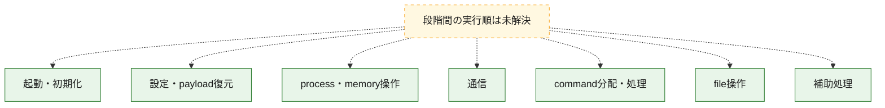
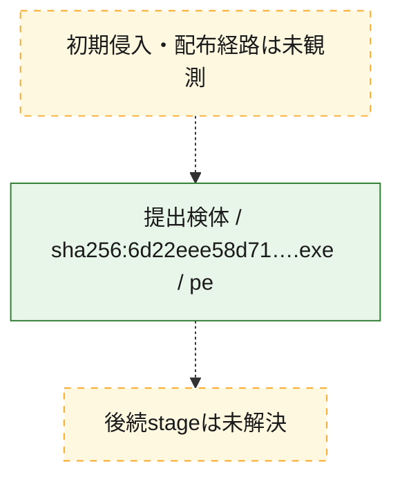
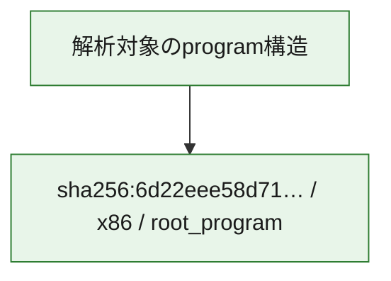

# 全体ロジック：6d22eee58d714dd3eb9551deca209a2b2ac232dc55aa6700da31a7b2e495d089

代表関数の静的証跡から、起動・初期化、設定・payload復元、process・memory操作、通信、command分配・処理、file操作の処理群を確認しました。

## 読み方

- phaseの掲載順は解析上の整理順です。observed_call_edgesがない段階間の実行順を断定しません。
- 図の実線は静的に観測した関係、点線と黄色のノードは未観測・未解決の関係を示します。
- 図は静的な要約であり、動的実行を再現するものではありません。
- 詳細な関数解説とfingerprintは[STATIC-LOGIC.md](STATIC-LOGIC.md)を参照してください。

## 静的可視化

### 実行フロー

### 感染チェーン

### モジュール関係

## 処理段階

### 1. 起動・初期化

entry pointから初期化と後続処理への移行を確認します。
確度: `confirmed_static_function_evidence_with_limits`

- `6d22eee58d714dd3eb9551deca209a2b2ac232dc55aa6700da31a7b2e495d089:ghidra:140131600` — 初期化と主要処理への分岐を行う入口関数です。 状態: `succeeded`、選定理由: `entry_point`, `meaningful_symbol_name`, `probable_go_main_user_code`, `reviewed_call_centrality:5`, `role:entrypoint`
- `6d22eee58d714dd3eb9551deca209a2b2ac232dc55aa6700da31a7b2e495d089:ghidra:1401317c0` — 初期化と主要処理への分岐を行う入口関数です。 状態: `failed`、選定理由: `entry_point`, `meaningful_symbol_name`, `probable_go_main_user_code`, `role:entrypoint`
- `6d22eee58d714dd3eb9551deca209a2b2ac232dc55aa6700da31a7b2e495d089:ghidra:14015c320` — 初期化と主要処理への分岐を行う入口関数です。 状態: `succeeded`、選定理由: `entry_point`, `meaningful_symbol_name`, `probable_go_main_user_code`, `reviewed_call_centrality:23`, `role:entrypoint`
- `6d22eee58d714dd3eb9551deca209a2b2ac232dc55aa6700da31a7b2e495d089:ghidra:14015e560` — 初期化と主要処理への分岐を行う入口関数です。 状態: `succeeded`、選定理由: `entry_point`, `meaningful_symbol_name`, `probable_go_main_user_code`, `reviewed_call_centrality:26`, `role:entrypoint`
- `6d22eee58d714dd3eb9551deca209a2b2ac232dc55aa6700da31a7b2e495d089:ghidra:140162ae0` — 初期化と主要処理への分岐を行う入口関数です。 状態: `succeeded`、選定理由: `entry_point`, `meaningful_symbol_name`, `probable_go_main_user_code`, `reviewed_call_centrality:29`, `role:entrypoint`
- `6d22eee58d714dd3eb9551deca209a2b2ac232dc55aa6700da31a7b2e495d089:ghidra:140174500` — 初期化と主要処理への分岐を行う入口関数です。 状態: `succeeded`、選定理由: `entry_point`, `meaningful_symbol_name`, `probable_go_main_user_code`, `reviewed_call_centrality:26`, `role:entrypoint`
- `6d22eee58d714dd3eb9551deca209a2b2ac232dc55aa6700da31a7b2e495d089:ghidra:140178a20` — 初期化と主要処理への分岐を行う入口関数です。 状態: `succeeded`、選定理由: `entry_point`, `meaningful_symbol_name`, `probable_go_main_user_code`, `reviewed_call_centrality:21`, `role:entrypoint`
- `6d22eee58d714dd3eb9551deca209a2b2ac232dc55aa6700da31a7b2e495d089:ghidra:140182040` — 初期化と主要処理への分岐を行う入口関数です。 状態: `succeeded`、選定理由: `entry_point`, `meaningful_symbol_name`, `probable_go_main_user_code`, `reviewed_call_centrality:24`, `role:entrypoint`
- `6d22eee58d714dd3eb9551deca209a2b2ac232dc55aa6700da31a7b2e495d089:ghidra:140187720` — 初期化と主要処理への分岐を行う入口関数です。 状態: `succeeded`、選定理由: `entry_point`, `meaningful_symbol_name`, `probable_go_main_user_code`, `reviewed_call_centrality:24`, `role:entrypoint`
- `6d22eee58d714dd3eb9551deca209a2b2ac232dc55aa6700da31a7b2e495d089:ghidra:1401952c0` — 初期化と主要処理への分岐を行う入口関数です。 状態: `succeeded`、選定理由: `entry_point`, `meaningful_symbol_name`, `probable_go_main_user_code`, `reviewed_call_centrality:41`, `role:entrypoint`
- `6d22eee58d714dd3eb9551deca209a2b2ac232dc55aa6700da31a7b2e495d089:ghidra:1401b6660` — 初期化と主要処理への分岐を行う入口関数です。 状態: `succeeded`、選定理由: `entry_point`, `meaningful_symbol_name`, `probable_go_main_user_code`, `reviewed_call_centrality:21`, `role:entrypoint`
- `6d22eee58d714dd3eb9551deca209a2b2ac232dc55aa6700da31a7b2e495d089:ghidra:1401beb60` — 初期化と主要処理への分岐を行う入口関数です。 状態: `succeeded`、選定理由: `entry_point`, `meaningful_symbol_name`, `probable_go_main_user_code`, `reviewed_call_centrality:23`, `role:entrypoint`
- `6d22eee58d714dd3eb9551deca209a2b2ac232dc55aa6700da31a7b2e495d089:ghidra:1401c4f40` — 初期化と主要処理への分岐を行う入口関数です。 状態: `succeeded`、選定理由: `entry_point`, `meaningful_symbol_name`, `probable_go_main_user_code`, `reviewed_call_centrality:19`, `role:entrypoint`
- `6d22eee58d714dd3eb9551deca209a2b2ac232dc55aa6700da31a7b2e495d089:ghidra:1401c9140` — 初期化と主要処理への分岐を行う入口関数です。 状態: `succeeded`、選定理由: `entry_point`, `meaningful_symbol_name`, `probable_go_main_user_code`, `reviewed_call_centrality:22`, `role:entrypoint`
- `6d22eee58d714dd3eb9551deca209a2b2ac232dc55aa6700da31a7b2e495d089:ghidra:1401cc2c0` — 初期化と主要処理への分岐を行う入口関数です。 状態: `succeeded`、選定理由: `entry_point`, `meaningful_symbol_name`, `probable_go_main_user_code`, `reviewed_call_centrality:22`, `role:entrypoint`
- `6d22eee58d714dd3eb9551deca209a2b2ac232dc55aa6700da31a7b2e495d089:ghidra:1401d15a0` — 初期化と主要処理への分岐を行う入口関数です。 状態: `succeeded`、選定理由: `entry_point`, `meaningful_symbol_name`, `probable_go_main_user_code`, `reviewed_call_centrality:19`, `role:entrypoint`
- `6d22eee58d714dd3eb9551deca209a2b2ac232dc55aa6700da31a7b2e495d089:ghidra:1401d5760` — 初期化と主要処理への分岐を行う入口関数です。 状態: `succeeded`、選定理由: `entry_point`, `meaningful_symbol_name`, `probable_go_main_user_code`, `reviewed_call_centrality:19`, `role:entrypoint`
- `6d22eee58d714dd3eb9551deca209a2b2ac232dc55aa6700da31a7b2e495d089:ghidra:1401da9c0` — 初期化と主要処理への分岐を行う入口関数です。 状態: `succeeded`、選定理由: `entry_point`, `meaningful_symbol_name`, `probable_go_main_user_code`, `reviewed_call_centrality:21`, `role:entrypoint`
- `6d22eee58d714dd3eb9551deca209a2b2ac232dc55aa6700da31a7b2e495d089:ghidra:1401e1d20` — 初期化と主要処理への分岐を行う入口関数です。 状態: `succeeded`、選定理由: `entry_point`, `meaningful_symbol_name`, `probable_go_main_user_code`, `reviewed_call_centrality:26`, `role:entrypoint`
- `6d22eee58d714dd3eb9551deca209a2b2ac232dc55aa6700da31a7b2e495d089:ghidra:1401e8020` — 初期化と主要処理への分岐を行う入口関数です。 状態: `succeeded`、選定理由: `entry_point`, `meaningful_symbol_name`, `probable_go_main_user_code`, `reviewed_call_centrality:21`, `role:entrypoint`
- `6d22eee58d714dd3eb9551deca209a2b2ac232dc55aa6700da31a7b2e495d089:ghidra:1401ee2e0` — 初期化と主要処理への分岐を行う入口関数です。 状態: `succeeded`、選定理由: `entry_point`, `meaningful_symbol_name`, `probable_go_main_user_code`, `reviewed_call_centrality:20`, `role:entrypoint`
- `6d22eee58d714dd3eb9551deca209a2b2ac232dc55aa6700da31a7b2e495d089:ghidra:1401f4560` — 初期化と主要処理への分岐を行う入口関数です。 状態: `succeeded`、選定理由: `entry_point`, `meaningful_symbol_name`, `probable_go_main_user_code`, `reviewed_call_centrality:23`, `role:entrypoint`
- `6d22eee58d714dd3eb9551deca209a2b2ac232dc55aa6700da31a7b2e495d089:ghidra:140209ee0` — 初期化と主要処理への分岐を行う入口関数です。 状態: `succeeded`、選定理由: `entry_point`, `meaningful_symbol_name`, `probable_go_main_user_code`, `reviewed_call_centrality:21`, `role:entrypoint`
- `6d22eee58d714dd3eb9551deca209a2b2ac232dc55aa6700da31a7b2e495d089:ghidra:1402165c0` — 初期化と主要処理への分岐を行う入口関数です。 状態: `succeeded`、選定理由: `entry_point`, `meaningful_symbol_name`, `probable_go_main_user_code`, `reviewed_call_centrality:19`, `role:entrypoint`
- `6d22eee58d714dd3eb9551deca209a2b2ac232dc55aa6700da31a7b2e495d089:ghidra:14021eb00` — 初期化と主要処理への分岐を行う入口関数です。 状態: `succeeded`、選定理由: `entry_point`, `meaningful_symbol_name`, `probable_go_main_user_code`, `reviewed_call_centrality:20`, `role:entrypoint`

### 2. 設定・payload復元

設定、resource、payload、暗号化データの復元・変換を確認します。
確度: `confirmed_static_function_evidence`

- `6d22eee58d714dd3eb9551deca209a2b2ac232dc55aa6700da31a7b2e495d089:ghidra:140091780` — 設定、resource、payloadなどの解析・変換を行う関数です。 状態: `succeeded`、選定理由: `meaningful_symbol_name`, `reviewed_call_centrality:4`, `role:config_or_data_transform`

### 3. process・memory操作

process、thread、module、memory操作と実行移行を確認します。
確度: `confirmed_static_function_evidence`

- `6d22eee58d714dd3eb9551deca209a2b2ac232dc55aa6700da31a7b2e495d089:ghidra:1400c53c0` — process、thread、module、またはmemory操作に関係する関数です。 状態: `succeeded`、選定理由: `meaningful_symbol_name`, `reviewed_call_centrality:6`, `role:process_or_memory_operation`

### 4. 通信

通信初期化、endpoint処理、送受信の役割を確認します。
確度: `confirmed_static_function_evidence`

- `6d22eee58d714dd3eb9551deca209a2b2ac232dc55aa6700da31a7b2e495d089:ghidra:1400af480` — 通信初期化、送受信、またはendpoint処理に関係する関数です。 状態: `succeeded`、選定理由: `meaningful_symbol_name`, `reviewed_call_centrality:8`, `role:network_communication`

### 5. command分配・処理

受信commandやtaskの解釈、分配、個別handlerへの移行を確認します。
確度: `confirmed_static_function_evidence`

- `6d22eee58d714dd3eb9551deca209a2b2ac232dc55aa6700da31a7b2e495d089:ghidra:1400c4ae0` — commandの解釈、分配、または個別処理を担当する関数です。 状態: `succeeded`、選定理由: `meaningful_symbol_name`, `reviewed_call_centrality:5`, `role:command_dispatch_or_handler`

### 6. file操作

fileやdirectoryの作成、読書き、削除を確認します。
確度: `confirmed_static_function_evidence`

- `6d22eee58d714dd3eb9551deca209a2b2ac232dc55aa6700da31a7b2e495d089:ghidra:1400c5680` — fileまたはdirectoryの読書き・管理に関係する関数です。 状態: `succeeded`、選定理由: `meaningful_symbol_name`, `reviewed_call_centrality:6`, `role:file_operation`

### 7. 補助処理

主要処理を支える一般内部関数またはlibrary処理を確認します。
確度: `confirmed_static_function_evidence`

- `6d22eee58d714dd3eb9551deca209a2b2ac232dc55aa6700da31a7b2e495d089:ghidra:140001080` — compiler生成処理または汎用library処理とみられる関数です。 状態: `succeeded`、選定理由: `meaningful_symbol_name`, `reviewed_call_centrality:9`
- `6d22eee58d714dd3eb9551deca209a2b2ac232dc55aa6700da31a7b2e495d089:ghidra:140079e00` — 検体内部の一般処理を実装する関数です。 状態: `succeeded`、選定理由: `meaningful_symbol_name`, `reviewed_call_centrality:3`

## 観測したcall関係

- `ghidra-function:079091c4b00d2def8bc60292` → `ghidra-external:0461292bcce0366ea9b68fbf` （`unclassified` → `unclassified`）
- `ghidra-function:079091c4b00d2def8bc60292` → `ghidra-external:0c6a62d855e2a6d088b43375` （`unclassified` → `unclassified`）
- `ghidra-function:079091c4b00d2def8bc60292` → `ghidra-external:2666e62e514c44ca04530a11` （`unclassified` → `unclassified`）
- `ghidra-function:079091c4b00d2def8bc60292` → `ghidra-external:35630311d6593a3dd71de7eb` （`unclassified` → `unclassified`）
- `ghidra-function:079091c4b00d2def8bc60292` → `ghidra-external:383c3d42674f3608523aab4d` （`unclassified` → `unclassified`）
- `ghidra-function:079091c4b00d2def8bc60292` → `ghidra-external:3b81d782d2ecda558f98c756` （`unclassified` → `unclassified`）
- `ghidra-function:079091c4b00d2def8bc60292` → `ghidra-external:3d54829c1e04746806859429` （`unclassified` → `unclassified`）
- `ghidra-function:079091c4b00d2def8bc60292` → `ghidra-external:3e8a8d411a3b2a8131b5392d` （`unclassified` → `unclassified`）
- `ghidra-function:079091c4b00d2def8bc60292` → `ghidra-external:47860060a2dc5c0ee4fbf3dc` （`unclassified` → `unclassified`）
- `ghidra-function:079091c4b00d2def8bc60292` → `ghidra-external:4c3bbdf99f8143ec7dafa102` （`unclassified` → `unclassified`）
- `ghidra-function:079091c4b00d2def8bc60292` → `ghidra-external:4d29ed746e7bb711543f0038` （`unclassified` → `unclassified`）
- `ghidra-function:079091c4b00d2def8bc60292` → `ghidra-external:5c039aa366967b3fbda05d07` （`unclassified` → `unclassified`）
- `ghidra-function:079091c4b00d2def8bc60292` → `ghidra-external:611ba11423e6b543e94a9469` （`unclassified` → `unclassified`）
- `ghidra-function:079091c4b00d2def8bc60292` → `ghidra-external:616a64e9116db39b02a52c28` （`unclassified` → `unclassified`）
- `ghidra-function:079091c4b00d2def8bc60292` → `ghidra-external:aae8670c152c3a611f234f67` （`unclassified` → `unclassified`）
- `ghidra-function:079091c4b00d2def8bc60292` → `ghidra-external:b78813f6306fc14b2852938c` （`unclassified` → `unclassified`）
- `ghidra-function:079091c4b00d2def8bc60292` → `ghidra-external:ba17edba586052505762b94d` （`unclassified` → `unclassified`）
- `ghidra-function:079091c4b00d2def8bc60292` → `ghidra-external:db96314038f8daba1ae1f0dd` （`unclassified` → `unclassified`）
- `ghidra-function:079091c4b00d2def8bc60292` → `ghidra-external:dd93e16aac3d700d3f39d313` （`unclassified` → `unclassified`）
- `ghidra-function:079091c4b00d2def8bc60292` → `ghidra-external:e25eebcee096b2279cf620c7` （`unclassified` → `unclassified`）
- `ghidra-function:079091c4b00d2def8bc60292` → `ghidra-external:f659f0bb5cca550ba6cf0d1b` （`unclassified` → `unclassified`）
- `ghidra-function:080b2b3ac533132031498000` → `ghidra-external:0461292bcce0366ea9b68fbf` （`unclassified` → `unclassified`）
- `ghidra-function:080b2b3ac533132031498000` → `ghidra-external:0c6a62d855e2a6d088b43375` （`unclassified` → `unclassified`）
- `ghidra-function:080b2b3ac533132031498000` → `ghidra-external:2666e62e514c44ca04530a11` （`unclassified` → `unclassified`）
- `ghidra-function:080b2b3ac533132031498000` → `ghidra-external:2e6e7e99ac1d206c29242e21` （`unclassified` → `unclassified`）
- `ghidra-function:080b2b3ac533132031498000` → `ghidra-external:35630311d6593a3dd71de7eb` （`unclassified` → `unclassified`）
- `ghidra-function:080b2b3ac533132031498000` → `ghidra-external:3b81d782d2ecda558f98c756` （`unclassified` → `unclassified`）
- `ghidra-function:080b2b3ac533132031498000` → `ghidra-external:3d54829c1e04746806859429` （`unclassified` → `unclassified`）
- `ghidra-function:080b2b3ac533132031498000` → `ghidra-external:3e8a8d411a3b2a8131b5392d` （`unclassified` → `unclassified`）
- `ghidra-function:080b2b3ac533132031498000` → `ghidra-external:47860060a2dc5c0ee4fbf3dc` （`unclassified` → `unclassified`）
- `ghidra-function:080b2b3ac533132031498000` → `ghidra-external:4c3bbdf99f8143ec7dafa102` （`unclassified` → `unclassified`）
- `ghidra-function:080b2b3ac533132031498000` → `ghidra-external:4d29ed746e7bb711543f0038` （`unclassified` → `unclassified`）
- `ghidra-function:080b2b3ac533132031498000` → `ghidra-external:611ba11423e6b543e94a9469` （`unclassified` → `unclassified`）
- `ghidra-function:080b2b3ac533132031498000` → `ghidra-external:616a64e9116db39b02a52c28` （`unclassified` → `unclassified`）
- `ghidra-function:080b2b3ac533132031498000` → `ghidra-external:aae8670c152c3a611f234f67` （`unclassified` → `unclassified`）
- `ghidra-function:080b2b3ac533132031498000` → `ghidra-external:b78813f6306fc14b2852938c` （`unclassified` → `unclassified`）
- `ghidra-function:080b2b3ac533132031498000` → `ghidra-external:db96314038f8daba1ae1f0dd` （`unclassified` → `unclassified`）
- `ghidra-function:080b2b3ac533132031498000` → `ghidra-external:dd93e16aac3d700d3f39d313` （`unclassified` → `unclassified`）
- `ghidra-function:080b2b3ac533132031498000` → `ghidra-external:e25eebcee096b2279cf620c7` （`unclassified` → `unclassified`）
- `ghidra-function:080b2b3ac533132031498000` → `ghidra-external:f659f0bb5cca550ba6cf0d1b` （`unclassified` → `unclassified`）
- `ghidra-function:0ce3138d9f02677a5c0584c1` → `ghidra-external:0461292bcce0366ea9b68fbf` （`unclassified` → `unclassified`）
- `ghidra-function:0ce3138d9f02677a5c0584c1` → `ghidra-external:0c6a62d855e2a6d088b43375` （`unclassified` → `unclassified`）
- `ghidra-function:0ce3138d9f02677a5c0584c1` → `ghidra-external:2666e62e514c44ca04530a11` （`unclassified` → `unclassified`）
- `ghidra-function:0ce3138d9f02677a5c0584c1` → `ghidra-external:3339d0e0451a25e24d09ec68` （`unclassified` → `unclassified`）
- `ghidra-function:0ce3138d9f02677a5c0584c1` → `ghidra-external:35630311d6593a3dd71de7eb` （`unclassified` → `unclassified`）
- `ghidra-function:0ce3138d9f02677a5c0584c1` → `ghidra-external:362c247eb77b0af4307bf726` （`unclassified` → `unclassified`）
- `ghidra-function:0ce3138d9f02677a5c0584c1` → `ghidra-external:3b81d782d2ecda558f98c756` （`unclassified` → `unclassified`）
- `ghidra-function:0ce3138d9f02677a5c0584c1` → `ghidra-external:3d54829c1e04746806859429` （`unclassified` → `unclassified`）
- `ghidra-function:0ce3138d9f02677a5c0584c1` → `ghidra-external:3e8a8d411a3b2a8131b5392d` （`unclassified` → `unclassified`）
- `ghidra-function:0ce3138d9f02677a5c0584c1` → `ghidra-external:47860060a2dc5c0ee4fbf3dc` （`unclassified` → `unclassified`）
- `ghidra-function:0ce3138d9f02677a5c0584c1` → `ghidra-external:4c3bbdf99f8143ec7dafa102` （`unclassified` → `unclassified`）
- `ghidra-function:0ce3138d9f02677a5c0584c1` → `ghidra-external:4d29ed746e7bb711543f0038` （`unclassified` → `unclassified`）
- `ghidra-function:0ce3138d9f02677a5c0584c1` → `ghidra-external:611ba11423e6b543e94a9469` （`unclassified` → `unclassified`）
- `ghidra-function:0ce3138d9f02677a5c0584c1` → `ghidra-external:616a64e9116db39b02a52c28` （`unclassified` → `unclassified`）
- `ghidra-function:0ce3138d9f02677a5c0584c1` → `ghidra-external:7045f8ff881dd3f97c904599` （`unclassified` → `unclassified`）
- `ghidra-function:0ce3138d9f02677a5c0584c1` → `ghidra-external:aae8670c152c3a611f234f67` （`unclassified` → `unclassified`）
- `ghidra-function:0ce3138d9f02677a5c0584c1` → `ghidra-external:b78813f6306fc14b2852938c` （`unclassified` → `unclassified`）
- `ghidra-function:0ce3138d9f02677a5c0584c1` → `ghidra-external:db96314038f8daba1ae1f0dd` （`unclassified` → `unclassified`）
- `ghidra-function:0ce3138d9f02677a5c0584c1` → `ghidra-external:dd93e16aac3d700d3f39d313` （`unclassified` → `unclassified`）
- `ghidra-function:0ce3138d9f02677a5c0584c1` → `ghidra-external:e25eebcee096b2279cf620c7` （`unclassified` → `unclassified`）
- `ghidra-function:0ce3138d9f02677a5c0584c1` → `ghidra-external:f659f0bb5cca550ba6cf0d1b` （`unclassified` → `unclassified`）
- `ghidra-function:0cf45847ef35ec04fc624cfa` → `ghidra-external:0461292bcce0366ea9b68fbf` （`unclassified` → `unclassified`）
- `ghidra-function:0cf45847ef35ec04fc624cfa` → `ghidra-external:0c6a62d855e2a6d088b43375` （`unclassified` → `unclassified`）
- `ghidra-function:0cf45847ef35ec04fc624cfa` → `ghidra-external:22cab29614b0f785c3f211c5` （`unclassified` → `unclassified`）
- `ghidra-function:0cf45847ef35ec04fc624cfa` → `ghidra-external:2666e62e514c44ca04530a11` （`unclassified` → `unclassified`）
- `ghidra-function:0cf45847ef35ec04fc624cfa` → `ghidra-external:35630311d6593a3dd71de7eb` （`unclassified` → `unclassified`）
- `ghidra-function:0cf45847ef35ec04fc624cfa` → `ghidra-external:3859ee023047a6b27d64ef08` （`unclassified` → `unclassified`）
- `ghidra-function:0cf45847ef35ec04fc624cfa` → `ghidra-external:3b81d782d2ecda558f98c756` （`unclassified` → `unclassified`）
- `ghidra-function:0cf45847ef35ec04fc624cfa` → `ghidra-external:3d54829c1e04746806859429` （`unclassified` → `unclassified`）
- `ghidra-function:0cf45847ef35ec04fc624cfa` → `ghidra-external:3e8a8d411a3b2a8131b5392d` （`unclassified` → `unclassified`）
- `ghidra-function:0cf45847ef35ec04fc624cfa` → `ghidra-external:47860060a2dc5c0ee4fbf3dc` （`unclassified` → `unclassified`）
- `ghidra-function:0cf45847ef35ec04fc624cfa` → `ghidra-external:4b20e5fe06c62553a1c1a7dd` （`unclassified` → `unclassified`）
- `ghidra-function:0cf45847ef35ec04fc624cfa` → `ghidra-external:4c3bbdf99f8143ec7dafa102` （`unclassified` → `unclassified`）
- `ghidra-function:0cf45847ef35ec04fc624cfa` → `ghidra-external:4d29ed746e7bb711543f0038` （`unclassified` → `unclassified`）
- `ghidra-function:0cf45847ef35ec04fc624cfa` → `ghidra-external:611ba11423e6b543e94a9469` （`unclassified` → `unclassified`）
- `ghidra-function:0cf45847ef35ec04fc624cfa` → `ghidra-external:616a2610bcb00c4e3c3d54eb` （`unclassified` → `unclassified`）
- `ghidra-function:0cf45847ef35ec04fc624cfa` → `ghidra-external:616a64e9116db39b02a52c28` （`unclassified` → `unclassified`）
- `ghidra-function:0cf45847ef35ec04fc624cfa` → `ghidra-external:6e32815c807b880555e78aa9` （`unclassified` → `unclassified`）
- `ghidra-function:0cf45847ef35ec04fc624cfa` → `ghidra-external:7484dfa8ecc743d0e30acb84` （`unclassified` → `unclassified`）
- `ghidra-function:0cf45847ef35ec04fc624cfa` → `ghidra-external:aae8670c152c3a611f234f67` （`unclassified` → `unclassified`）
- `ghidra-function:0cf45847ef35ec04fc624cfa` → `ghidra-external:b78813f6306fc14b2852938c` （`unclassified` → `unclassified`）
- `ghidra-function:0cf45847ef35ec04fc624cfa` → `ghidra-external:db96314038f8daba1ae1f0dd` （`unclassified` → `unclassified`）
- `ghidra-function:0cf45847ef35ec04fc624cfa` → `ghidra-external:dd93e16aac3d700d3f39d313` （`unclassified` → `unclassified`）
- `ghidra-function:0cf45847ef35ec04fc624cfa` → `ghidra-external:e25eebcee096b2279cf620c7` （`unclassified` → `unclassified`）
- `ghidra-function:0cf45847ef35ec04fc624cfa` → `ghidra-external:f659f0bb5cca550ba6cf0d1b` （`unclassified` → `unclassified`）
- `ghidra-function:154f39110f907d781dc15d12` → `ghidra-external:0461292bcce0366ea9b68fbf` （`unclassified` → `unclassified`）
- `ghidra-function:154f39110f907d781dc15d12` → `ghidra-external:0c6a62d855e2a6d088b43375` （`unclassified` → `unclassified`）
- `ghidra-function:154f39110f907d781dc15d12` → `ghidra-external:1740cb546e00fe69e38239ec` （`unclassified` → `unclassified`）
- `ghidra-function:154f39110f907d781dc15d12` → `ghidra-external:2666e62e514c44ca04530a11` （`unclassified` → `unclassified`）
- `ghidra-function:154f39110f907d781dc15d12` → `ghidra-external:35630311d6593a3dd71de7eb` （`unclassified` → `unclassified`）
- `ghidra-function:154f39110f907d781dc15d12` → `ghidra-external:3b81d782d2ecda558f98c756` （`unclassified` → `unclassified`）
- `ghidra-function:154f39110f907d781dc15d12` → `ghidra-external:3d54829c1e04746806859429` （`unclassified` → `unclassified`）
- `ghidra-function:154f39110f907d781dc15d12` → `ghidra-external:3e8a8d411a3b2a8131b5392d` （`unclassified` → `unclassified`）
- `ghidra-function:154f39110f907d781dc15d12` → `ghidra-external:47860060a2dc5c0ee4fbf3dc` （`unclassified` → `unclassified`）
- `ghidra-function:154f39110f907d781dc15d12` → `ghidra-external:4c1cb530d9ba58fb4c093796` （`unclassified` → `unclassified`）
- `ghidra-function:154f39110f907d781dc15d12` → `ghidra-external:4c3bbdf99f8143ec7dafa102` （`unclassified` → `unclassified`）
- `ghidra-function:154f39110f907d781dc15d12` → `ghidra-external:4d29ed746e7bb711543f0038` （`unclassified` → `unclassified`）
- `ghidra-function:154f39110f907d781dc15d12` → `ghidra-external:611ba11423e6b543e94a9469` （`unclassified` → `unclassified`）
- `ghidra-function:154f39110f907d781dc15d12` → `ghidra-external:616a64e9116db39b02a52c28` （`unclassified` → `unclassified`）
- `ghidra-function:154f39110f907d781dc15d12` → `ghidra-external:82d8027d3f152989bdfd879b` （`unclassified` → `unclassified`）
- `ghidra-function:154f39110f907d781dc15d12` → `ghidra-external:aae8670c152c3a611f234f67` （`unclassified` → `unclassified`）
- `ghidra-function:154f39110f907d781dc15d12` → `ghidra-external:b78813f6306fc14b2852938c` （`unclassified` → `unclassified`）
- `ghidra-function:154f39110f907d781dc15d12` → `ghidra-external:db96314038f8daba1ae1f0dd` （`unclassified` → `unclassified`）
- `ghidra-function:154f39110f907d781dc15d12` → `ghidra-external:dd93e16aac3d700d3f39d313` （`unclassified` → `unclassified`）
- `ghidra-function:154f39110f907d781dc15d12` → `ghidra-external:e25eebcee096b2279cf620c7` （`unclassified` → `unclassified`）
- `ghidra-function:154f39110f907d781dc15d12` → `ghidra-external:f659f0bb5cca550ba6cf0d1b` （`unclassified` → `unclassified`）
- `ghidra-function:16789d2e625268d963e148d8` → `ghidra-external:0461292bcce0366ea9b68fbf` （`unclassified` → `unclassified`）
- `ghidra-function:16789d2e625268d963e148d8` → `ghidra-external:0c6a62d855e2a6d088b43375` （`unclassified` → `unclassified`）
- `ghidra-function:16789d2e625268d963e148d8` → `ghidra-external:1740cb546e00fe69e38239ec` （`unclassified` → `unclassified`）
- `ghidra-function:16789d2e625268d963e148d8` → `ghidra-external:2666e62e514c44ca04530a11` （`unclassified` → `unclassified`）
- `ghidra-function:16789d2e625268d963e148d8` → `ghidra-external:35630311d6593a3dd71de7eb` （`unclassified` → `unclassified`）
- `ghidra-function:16789d2e625268d963e148d8` → `ghidra-external:3b81d782d2ecda558f98c756` （`unclassified` → `unclassified`）
- `ghidra-function:16789d2e625268d963e148d8` → `ghidra-external:3d54829c1e04746806859429` （`unclassified` → `unclassified`）
- `ghidra-function:16789d2e625268d963e148d8` → `ghidra-external:3e8a8d411a3b2a8131b5392d` （`unclassified` → `unclassified`）
- `ghidra-function:16789d2e625268d963e148d8` → `ghidra-external:47860060a2dc5c0ee4fbf3dc` （`unclassified` → `unclassified`）
- `ghidra-function:16789d2e625268d963e148d8` → `ghidra-external:4c3bbdf99f8143ec7dafa102` （`unclassified` → `unclassified`）
- `ghidra-function:16789d2e625268d963e148d8` → `ghidra-external:4d29ed746e7bb711543f0038` （`unclassified` → `unclassified`）
- `ghidra-function:16789d2e625268d963e148d8` → `ghidra-external:611ba11423e6b543e94a9469` （`unclassified` → `unclassified`）
- `ghidra-function:16789d2e625268d963e148d8` → `ghidra-external:616a64e9116db39b02a52c28` （`unclassified` → `unclassified`）
- `ghidra-function:16789d2e625268d963e148d8` → `ghidra-external:832cf4cae74e5d5a90de493a` （`unclassified` → `unclassified`）
- `ghidra-function:16789d2e625268d963e148d8` → `ghidra-external:9c1c62eb00a0dd5910a0c734` （`unclassified` → `unclassified`）
- `ghidra-function:16789d2e625268d963e148d8` → `ghidra-external:aae8670c152c3a611f234f67` （`unclassified` → `unclassified`）
- `ghidra-function:16789d2e625268d963e148d8` → `ghidra-external:b78813f6306fc14b2852938c` （`unclassified` → `unclassified`）
- `ghidra-function:16789d2e625268d963e148d8` → `ghidra-external:db96314038f8daba1ae1f0dd` （`unclassified` → `unclassified`）
- `ghidra-function:16789d2e625268d963e148d8` → `ghidra-external:dd93e16aac3d700d3f39d313` （`unclassified` → `unclassified`）
- `ghidra-function:16789d2e625268d963e148d8` → `ghidra-external:e25eebcee096b2279cf620c7` （`unclassified` → `unclassified`）
- `ghidra-function:16789d2e625268d963e148d8` → `ghidra-external:ec6b546b1de0514c0c6110cd` （`unclassified` → `unclassified`）
- `ghidra-function:16789d2e625268d963e148d8` → `ghidra-external:f659f0bb5cca550ba6cf0d1b` （`unclassified` → `unclassified`）
- `ghidra-function:22e6ba33ab0e40e370fdbb16` → `ghidra-external:0461292bcce0366ea9b68fbf` （`unclassified` → `unclassified`）
- `ghidra-function:22e6ba33ab0e40e370fdbb16` → `ghidra-external:0c6a62d855e2a6d088b43375` （`unclassified` → `unclassified`）
- `ghidra-function:22e6ba33ab0e40e370fdbb16` → `ghidra-external:0e4b5ffbdc516262c2d685d7` （`unclassified` → `unclassified`）
- `ghidra-function:22e6ba33ab0e40e370fdbb16` → `ghidra-external:1740cb546e00fe69e38239ec` （`unclassified` → `unclassified`）
- `ghidra-function:22e6ba33ab0e40e370fdbb16` → `ghidra-external:2666e62e514c44ca04530a11` （`unclassified` → `unclassified`）
- `ghidra-function:22e6ba33ab0e40e370fdbb16` → `ghidra-external:35630311d6593a3dd71de7eb` （`unclassified` → `unclassified`）
- `ghidra-function:22e6ba33ab0e40e370fdbb16` → `ghidra-external:383c3d42674f3608523aab4d` （`unclassified` → `unclassified`）
- `ghidra-function:22e6ba33ab0e40e370fdbb16` → `ghidra-external:3b81d782d2ecda558f98c756` （`unclassified` → `unclassified`）
- `ghidra-function:22e6ba33ab0e40e370fdbb16` → `ghidra-external:3d54829c1e04746806859429` （`unclassified` → `unclassified`）
- `ghidra-function:22e6ba33ab0e40e370fdbb16` → `ghidra-external:3e8a8d411a3b2a8131b5392d` （`unclassified` → `unclassified`）
- `ghidra-function:22e6ba33ab0e40e370fdbb16` → `ghidra-external:47860060a2dc5c0ee4fbf3dc` （`unclassified` → `unclassified`）
- `ghidra-function:22e6ba33ab0e40e370fdbb16` → `ghidra-external:4c3bbdf99f8143ec7dafa102` （`unclassified` → `unclassified`）
- `ghidra-function:22e6ba33ab0e40e370fdbb16` → `ghidra-external:4d29ed746e7bb711543f0038` （`unclassified` → `unclassified`）
- `ghidra-function:22e6ba33ab0e40e370fdbb16` → `ghidra-external:611ba11423e6b543e94a9469` （`unclassified` → `unclassified`）
- `ghidra-function:22e6ba33ab0e40e370fdbb16` → `ghidra-external:616a64e9116db39b02a52c28` （`unclassified` → `unclassified`）
- `ghidra-function:22e6ba33ab0e40e370fdbb16` → `ghidra-external:aae8670c152c3a611f234f67` （`unclassified` → `unclassified`）
- `ghidra-function:22e6ba33ab0e40e370fdbb16` → `ghidra-external:b109a65b0de20abc985a784e` （`unclassified` → `unclassified`）
- `ghidra-function:22e6ba33ab0e40e370fdbb16` → `ghidra-external:b78813f6306fc14b2852938c` （`unclassified` → `unclassified`）
- `ghidra-function:22e6ba33ab0e40e370fdbb16` → `ghidra-external:db96314038f8daba1ae1f0dd` （`unclassified` → `unclassified`）
- `ghidra-function:22e6ba33ab0e40e370fdbb16` → `ghidra-external:dd93e16aac3d700d3f39d313` （`unclassified` → `unclassified`）
- `ghidra-function:22e6ba33ab0e40e370fdbb16` → `ghidra-external:e25eebcee096b2279cf620c7` （`unclassified` → `unclassified`）
- `ghidra-function:22e6ba33ab0e40e370fdbb16` → `ghidra-external:f659f0bb5cca550ba6cf0d1b` （`unclassified` → `unclassified`）
- `ghidra-function:2b041aa8538cdde57cfa7b41` → `ghidra-external:0461292bcce0366ea9b68fbf` （`unclassified` → `unclassified`）
- `ghidra-function:2b041aa8538cdde57cfa7b41` → `ghidra-external:0c6a62d855e2a6d088b43375` （`unclassified` → `unclassified`）
- `ghidra-function:2b041aa8538cdde57cfa7b41` → `ghidra-external:2666e62e514c44ca04530a11` （`unclassified` → `unclassified`）
- `ghidra-function:2b041aa8538cdde57cfa7b41` → `ghidra-external:35630311d6593a3dd71de7eb` （`unclassified` → `unclassified`）
- `ghidra-function:2b041aa8538cdde57cfa7b41` → `ghidra-external:3b81d782d2ecda558f98c756` （`unclassified` → `unclassified`）
- `ghidra-function:2b041aa8538cdde57cfa7b41` → `ghidra-external:3d54829c1e04746806859429` （`unclassified` → `unclassified`）
- `ghidra-function:2b041aa8538cdde57cfa7b41` → `ghidra-external:3e8a8d411a3b2a8131b5392d` （`unclassified` → `unclassified`）
- `ghidra-function:2b041aa8538cdde57cfa7b41` → `ghidra-external:47860060a2dc5c0ee4fbf3dc` （`unclassified` → `unclassified`）
- `ghidra-function:2b041aa8538cdde57cfa7b41` → `ghidra-external:4c3bbdf99f8143ec7dafa102` （`unclassified` → `unclassified`）
- `ghidra-function:2b041aa8538cdde57cfa7b41` → `ghidra-external:4d29ed746e7bb711543f0038` （`unclassified` → `unclassified`）
- `ghidra-function:2b041aa8538cdde57cfa7b41` → `ghidra-external:611ba11423e6b543e94a9469` （`unclassified` → `unclassified`）
- `ghidra-function:2b041aa8538cdde57cfa7b41` → `ghidra-external:616a64e9116db39b02a52c28` （`unclassified` → `unclassified`）
- `ghidra-function:2b041aa8538cdde57cfa7b41` → `ghidra-external:7b1b57171e97ee4128284970` （`unclassified` → `unclassified`）
- `ghidra-function:2b041aa8538cdde57cfa7b41` → `ghidra-external:aae8670c152c3a611f234f67` （`unclassified` → `unclassified`）
- `ghidra-function:2b041aa8538cdde57cfa7b41` → `ghidra-external:b78813f6306fc14b2852938c` （`unclassified` → `unclassified`）
- `ghidra-function:2b041aa8538cdde57cfa7b41` → `ghidra-external:db96314038f8daba1ae1f0dd` （`unclassified` → `unclassified`）
- `ghidra-function:2b041aa8538cdde57cfa7b41` → `ghidra-external:dd93e16aac3d700d3f39d313` （`unclassified` → `unclassified`）
- `ghidra-function:2b041aa8538cdde57cfa7b41` → `ghidra-external:e25eebcee096b2279cf620c7` （`unclassified` → `unclassified`）
- `ghidra-function:2b041aa8538cdde57cfa7b41` → `ghidra-external:f659f0bb5cca550ba6cf0d1b` （`unclassified` → `unclassified`）
- `ghidra-function:32aedfef7e51848acb6223b4` → `ghidra-external:0461292bcce0366ea9b68fbf` （`unclassified` → `unclassified`）
- `ghidra-function:32aedfef7e51848acb6223b4` → `ghidra-external:0c6a62d855e2a6d088b43375` （`unclassified` → `unclassified`）
- `ghidra-function:32aedfef7e51848acb6223b4` → `ghidra-external:2666e62e514c44ca04530a11` （`unclassified` → `unclassified`）
- `ghidra-function:32aedfef7e51848acb6223b4` → `ghidra-external:35630311d6593a3dd71de7eb` （`unclassified` → `unclassified`）
- `ghidra-function:32aedfef7e51848acb6223b4` → `ghidra-external:3b81d782d2ecda558f98c756` （`unclassified` → `unclassified`）
- `ghidra-function:32aedfef7e51848acb6223b4` → `ghidra-external:3d54829c1e04746806859429` （`unclassified` → `unclassified`）
- `ghidra-function:32aedfef7e51848acb6223b4` → `ghidra-external:3e8a8d411a3b2a8131b5392d` （`unclassified` → `unclassified`）
- `ghidra-function:32aedfef7e51848acb6223b4` → `ghidra-external:47860060a2dc5c0ee4fbf3dc` （`unclassified` → `unclassified`）
- `ghidra-function:32aedfef7e51848acb6223b4` → `ghidra-external:4c3bbdf99f8143ec7dafa102` （`unclassified` → `unclassified`）
- `ghidra-function:32aedfef7e51848acb6223b4` → `ghidra-external:4d29ed746e7bb711543f0038` （`unclassified` → `unclassified`）
- `ghidra-function:32aedfef7e51848acb6223b4` → `ghidra-external:5e7c3880e94c14da432d2a5c` （`unclassified` → `unclassified`）
- `ghidra-function:32aedfef7e51848acb6223b4` → `ghidra-external:60066aa37845912a21fcc336` （`unclassified` → `unclassified`）
- `ghidra-function:32aedfef7e51848acb6223b4` → `ghidra-external:611ba11423e6b543e94a9469` （`unclassified` → `unclassified`）
- `ghidra-function:32aedfef7e51848acb6223b4` → `ghidra-external:616a64e9116db39b02a52c28` （`unclassified` → `unclassified`）
- `ghidra-function:32aedfef7e51848acb6223b4` → `ghidra-external:aae8670c152c3a611f234f67` （`unclassified` → `unclassified`）
- `ghidra-function:32aedfef7e51848acb6223b4` → `ghidra-external:b78813f6306fc14b2852938c` （`unclassified` → `unclassified`）
- `ghidra-function:32aedfef7e51848acb6223b4` → `ghidra-external:db96314038f8daba1ae1f0dd` （`unclassified` → `unclassified`）
- `ghidra-function:32aedfef7e51848acb6223b4` → `ghidra-external:dd93e16aac3d700d3f39d313` （`unclassified` → `unclassified`）
- `ghidra-function:32aedfef7e51848acb6223b4` → `ghidra-external:e25eebcee096b2279cf620c7` （`unclassified` → `unclassified`）
- `ghidra-function:32aedfef7e51848acb6223b4` → `ghidra-external:f659f0bb5cca550ba6cf0d1b` （`unclassified` → `unclassified`）
- `ghidra-function:35b563877eb5bef8842aac7f` → `ghidra-external:0461292bcce0366ea9b68fbf` （`unclassified` → `unclassified`）
- `ghidra-function:35b563877eb5bef8842aac7f` → `ghidra-external:0c6a62d855e2a6d088b43375` （`unclassified` → `unclassified`）
- `ghidra-function:35b563877eb5bef8842aac7f` → `ghidra-external:2666e62e514c44ca04530a11` （`unclassified` → `unclassified`）
- `ghidra-function:35b563877eb5bef8842aac7f` → `ghidra-external:35630311d6593a3dd71de7eb` （`unclassified` → `unclassified`）
- `ghidra-function:35b563877eb5bef8842aac7f` → `ghidra-external:3b81d782d2ecda558f98c756` （`unclassified` → `unclassified`）
- `ghidra-function:35b563877eb5bef8842aac7f` → `ghidra-external:3d54829c1e04746806859429` （`unclassified` → `unclassified`）
- `ghidra-function:35b563877eb5bef8842aac7f` → `ghidra-external:3e8a8d411a3b2a8131b5392d` （`unclassified` → `unclassified`）
- `ghidra-function:35b563877eb5bef8842aac7f` → `ghidra-external:47860060a2dc5c0ee4fbf3dc` （`unclassified` → `unclassified`）
- `ghidra-function:35b563877eb5bef8842aac7f` → `ghidra-external:4c1cb530d9ba58fb4c093796` （`unclassified` → `unclassified`）
- `ghidra-function:35b563877eb5bef8842aac7f` → `ghidra-external:4c3bbdf99f8143ec7dafa102` （`unclassified` → `unclassified`）
- `ghidra-function:35b563877eb5bef8842aac7f` → `ghidra-external:4d29ed746e7bb711543f0038` （`unclassified` → `unclassified`）
- 残り376件は`static-logic.json`に記録しています。

## 解析範囲と制約

- 選定外関数は全体inventoryへ残しますが、関数本体の個別解説対象にはしていません。
- indirect call、難読化、packer、VM、壊れたcontrol flowによりcall関係が欠落する場合があります。
- 文書は静的解析に基づき、検体実行や外部通信による動的確認は行っていません。
