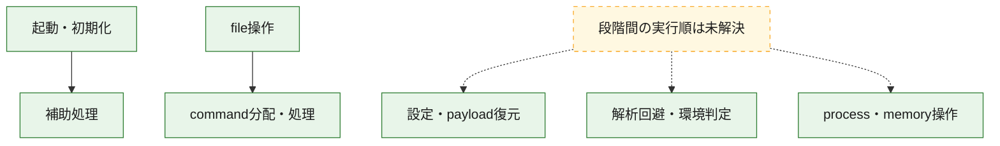
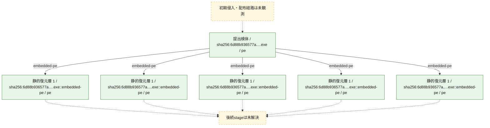
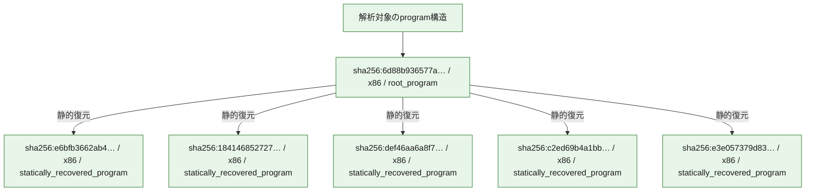

# 全体ロジック：6d88b936577ad83ee53050c6e807dcf312996585ecc3563c29d1c6a7da39f8a9

代表関数の静的証跡から、起動・初期化、設定・payload復元、解析回避・環境判定、process・memory操作、command分配・処理、file操作の処理群を確認しました。

## 読み方

- phaseの掲載順は解析上の整理順です。observed_call_edgesがない段階間の実行順を断定しません。
- 図の実線は静的に観測した関係、点線と黄色のノードは未観測・未解決の関係を示します。
- 図は静的な要約であり、動的実行を再現するものではありません。
- 詳細な関数解説とfingerprintは[STATIC-LOGIC.md](STATIC-LOGIC.md)を参照してください。

## 静的可視化

### 実行フロー

### 感染チェーン

### モジュール関係

## 処理段階

### 1. 起動・初期化

entry pointから初期化と後続処理への移行を確認します。
確度: `confirmed_static_function_evidence`

- `e6bfb3662ab4b1969a73441dbe35c96d51441b6bff8cf1fe7430bd5b246ca605:ghidra:180003e60` — 初期化と主要処理への分岐を行う入口関数です。 状態: `succeeded`、選定理由: `entry_point`, `meaningful_symbol_name`, `reviewed_call_centrality:5`, `role:entrypoint`
- `184146852727a9db4eea06178716bec3cdbb1015c911f6b0f915b184ad7775b2:ghidra:180010460` — 初期化と主要処理への分岐を行う入口関数です。 状態: `succeeded`、選定理由: `entry_point`, `meaningful_symbol_name`, `reviewed_call_centrality:5`, `role:entrypoint`
- `6d88b936577ad83ee53050c6e807dcf312996585ecc3563c29d1c6a7da39f8a9:ghidra:140001008` — 初期化と主要処理への分岐を行う入口関数です。 状態: `succeeded`、選定理由: `entry_point`, `meaningful_symbol_name`, `reviewed_call_centrality:26`, `role:entrypoint`, `small_program_complete_context`
- `6d88b936577ad83ee53050c6e807dcf312996585ecc3563c29d1c6a7da39f8a9:ghidra:1400014d0` — 初期化と主要処理への分岐を行う入口関数です。 状態: `succeeded`、選定理由: `entry_point`, `meaningful_symbol_name`, `reviewed_call_centrality:22`, `role:entrypoint`, `small_program_complete_context`

### 2. 設定・payload復元

設定、resource、payload、暗号化データの復元・変換を確認します。
確度: `confirmed_static_function_evidence_with_limits`

- `def46aa6a8f72f27bafac0c43334419486a4d1dcdb6c479a8ef7034b3e1fa4cb:ghidra:180003320` — 暗号、hash、encoding、または復号処理に関係する関数です。 状態: `limited_bad_instruction_or_flow`、選定理由: `entry_point`, `meaningful_symbol_name`, `reviewed_call_centrality:2`, `role:cryptographic_transform`
- `def46aa6a8f72f27bafac0c43334419486a4d1dcdb6c479a8ef7034b3e1fa4cb:ghidra:180003330` — 暗号、hash、encoding、または復号処理に関係する関数です。 状態: `limited_bad_instruction_or_flow`、選定理由: `entry_point`, `meaningful_symbol_name`, `reviewed_call_centrality:2`, `role:cryptographic_transform`

### 3. 解析回避・環境判定

debugger、sandbox、仮想環境、時間差などの判定を確認します。
確度: `confirmed_static_function_evidence`

- `6d88b936577ad83ee53050c6e807dcf312996585ecc3563c29d1c6a7da39f8a9:ghidra:140001ae0` — debugger、仮想環境、sandbox、または時間差の確認に関係する関数です。 状態: `succeeded`、選定理由: `context_representative`, `reviewed_call_centrality:7`, `role:anti_analysis`, `small_program_complete_context`

### 4. process・memory操作

process、thread、module、memory操作と実行移行を確認します。
確度: `confirmed_static_function_evidence`

- `c2ed69b4a1bb9432c75134e813c70539e27c8c1fe96a784d9be78c874e93d9d5:ghidra:180003890` — process、thread、module、またはmemory操作に関係する関数です。 状態: `succeeded`、選定理由: `entry_point`, `meaningful_symbol_name`, `reviewed_call_centrality:2`, `role:process_or_memory_operation`
- `6d88b936577ad83ee53050c6e807dcf312996585ecc3563c29d1c6a7da39f8a9:ghidra:140001724` — process、thread、module、またはmemory操作に関係する関数です。 状態: `succeeded`、選定理由: `context_representative`, `reviewed_call_centrality:11`, `role:process_or_memory_operation`, `small_program_complete_context`
- `6d88b936577ad83ee53050c6e807dcf312996585ecc3563c29d1c6a7da39f8a9:ghidra:14000184c` — process、thread、module、またはmemory操作に関係する関数です。 状態: `succeeded`、選定理由: `context_representative`, `reviewed_call_centrality:21`, `role:process_or_memory_operation`, `small_program_complete_context`

### 5. command分配・処理

受信commandやtaskの解釈、分配、個別handlerへの移行を確認します。
確度: `confirmed_static_function_evidence_with_limits`

- `e6bfb3662ab4b1969a73441dbe35c96d51441b6bff8cf1fe7430bd5b246ca605:ghidra:180001000` — commandの解釈、分配、または個別処理を担当する関数です。 状態: `succeeded`、選定理由: `context_representative`, `reviewed_call_centrality:4`, `role:command_dispatch_or_handler`
- `e6bfb3662ab4b1969a73441dbe35c96d51441b6bff8cf1fe7430bd5b246ca605:ghidra:180001134` — commandの解釈、分配、または個別処理を担当する関数です。 状態: `succeeded`、選定理由: `context_representative`, `reviewed_call_centrality:8`, `role:command_dispatch_or_handler`
- `e6bfb3662ab4b1969a73441dbe35c96d51441b6bff8cf1fe7430bd5b246ca605:ghidra:180001f2c` — commandの解釈、分配、または個別処理を担当する関数です。 状態: `succeeded`、選定理由: `context_representative`, `reviewed_call_centrality:14`, `role:command_dispatch_or_handler`
- `e6bfb3662ab4b1969a73441dbe35c96d51441b6bff8cf1fe7430bd5b246ca605:ghidra:180004520` — commandの解釈、分配、または個別処理を担当する関数です。 状態: `limited_bad_instruction_or_flow`、選定理由: `meaningful_symbol_name`, `reviewed_call_centrality:3`, `role:command_dispatch_or_handler`
- `184146852727a9db4eea06178716bec3cdbb1015c911f6b0f915b184ad7775b2:ghidra:1800051e0` — commandの解釈、分配、または個別処理を担当する関数です。 状態: `succeeded`、選定理由: `entry_point`, `meaningful_symbol_name`, `reviewed_call_centrality:5`, `role:command_dispatch_or_handler`
- `184146852727a9db4eea06178716bec3cdbb1015c911f6b0f915b184ad7775b2:ghidra:180005330` — commandの解釈、分配、または個別処理を担当する関数です。 状態: `succeeded`、選定理由: `entry_point`, `meaningful_symbol_name`, `reviewed_call_centrality:5`, `role:command_dispatch_or_handler`
- `184146852727a9db4eea06178716bec3cdbb1015c911f6b0f915b184ad7775b2:ghidra:180005700` — commandの解釈、分配、または個別処理を担当する関数です。 状態: `succeeded`、選定理由: `entry_point`, `meaningful_symbol_name`, `reviewed_call_centrality:1`, `role:command_dispatch_or_handler`
- `184146852727a9db4eea06178716bec3cdbb1015c911f6b0f915b184ad7775b2:ghidra:180005710` — commandの解釈、分配、または個別処理を担当する関数です。 状態: `succeeded`、選定理由: `entry_point`, `meaningful_symbol_name`, `reviewed_call_centrality:5`, `role:command_dispatch_or_handler`
- `184146852727a9db4eea06178716bec3cdbb1015c911f6b0f915b184ad7775b2:ghidra:180005730` — commandの解釈、分配、または個別処理を担当する関数です。 状態: `succeeded`、選定理由: `entry_point`, `meaningful_symbol_name`, `reviewed_call_centrality:2`, `role:command_dispatch_or_handler`
- `def46aa6a8f72f27bafac0c43334419486a4d1dcdb6c479a8ef7034b3e1fa4cb:ghidra:1800022d0` — commandの解釈、分配、または個別処理を担当する関数です。 状態: `succeeded`、選定理由: `entry_point`, `meaningful_symbol_name`, `role:command_dispatch_or_handler`
- `c2ed69b4a1bb9432c75134e813c70539e27c8c1fe96a784d9be78c874e93d9d5:ghidra:180010190` — commandの解釈、分配、または個別処理を担当する関数です。 状態: `succeeded`、選定理由: `entry_point`, `meaningful_symbol_name`, `reviewed_call_centrality:6`, `role:command_dispatch_or_handler`
- `c2ed69b4a1bb9432c75134e813c70539e27c8c1fe96a784d9be78c874e93d9d5:ghidra:180010210` — commandの解釈、分配、または個別処理を担当する関数です。 状態: `succeeded`、選定理由: `entry_point`, `meaningful_symbol_name`, `reviewed_call_centrality:5`, `role:command_dispatch_or_handler`
- `c2ed69b4a1bb9432c75134e813c70539e27c8c1fe96a784d9be78c874e93d9d5:ghidra:1800102a0` — commandの解釈、分配、または個別処理を担当する関数です。 状態: `succeeded`、選定理由: `entry_point`, `meaningful_symbol_name`, `reviewed_call_centrality:5`, `role:command_dispatch_or_handler`
- `6d88b936577ad83ee53050c6e807dcf312996585ecc3563c29d1c6a7da39f8a9:ghidra:140001354` — commandの解釈、分配、または個別処理を担当する関数です。 状態: `succeeded`、選定理由: `context_representative`, `reviewed_call_centrality:22`, `role:command_dispatch_or_handler`, `small_program_complete_context`
- `6d88b936577ad83ee53050c6e807dcf312996585ecc3563c29d1c6a7da39f8a9:ghidra:140001a68` — commandの解釈、分配、または個別処理を担当する関数です。 状態: `succeeded`、選定理由: `context_representative`, `reviewed_call_centrality:2`, `role:command_dispatch_or_handler`, `small_program_complete_context`
- `6d88b936577ad83ee53050c6e807dcf312996585ecc3563c29d1c6a7da39f8a9:ghidra:140001aa4` — commandの解釈、分配、または個別処理を担当する関数です。 状態: `succeeded`、選定理由: `context_representative`, `reviewed_call_centrality:1`, `role:command_dispatch_or_handler`, `small_program_complete_context`
- `6d88b936577ad83ee53050c6e807dcf312996585ecc3563c29d1c6a7da39f8a9:ghidra:140001e50` — commandの解釈、分配、または個別処理を担当する関数です。 状態: `limited_bad_instruction_or_flow`、選定理由: `meaningful_symbol_name`, `reviewed_call_centrality:4`, `role:command_dispatch_or_handler`, `small_program_complete_context`

### 6. file操作

fileやdirectoryの作成、読書き、削除を確認します。
確度: `confirmed_static_function_evidence`

- `def46aa6a8f72f27bafac0c43334419486a4d1dcdb6c479a8ef7034b3e1fa4cb:ghidra:180003cb0` — fileまたはdirectoryの読書き・管理に関係する関数です。 状態: `succeeded`、選定理由: `entry_point`, `meaningful_symbol_name`, `reviewed_call_centrality:2`, `role:file_operation`
- `def46aa6a8f72f27bafac0c43334419486a4d1dcdb6c479a8ef7034b3e1fa4cb:ghidra:180003d50` — fileまたはdirectoryの読書き・管理に関係する関数です。 状態: `succeeded`、選定理由: `entry_point`, `meaningful_symbol_name`, `reviewed_call_centrality:3`, `role:file_operation`
- `def46aa6a8f72f27bafac0c43334419486a4d1dcdb6c479a8ef7034b3e1fa4cb:ghidra:180004c20` — fileまたはdirectoryの読書き・管理に関係する関数です。 状態: `succeeded`、選定理由: `entry_point`, `meaningful_symbol_name`, `reviewed_call_centrality:1`, `role:file_operation`
- `def46aa6a8f72f27bafac0c43334419486a4d1dcdb6c479a8ef7034b3e1fa4cb:ghidra:180004c50` — fileまたはdirectoryの読書き・管理に関係する関数です。 状態: `succeeded`、選定理由: `entry_point`, `meaningful_symbol_name`, `reviewed_call_centrality:3`, `role:file_operation`
- `def46aa6a8f72f27bafac0c43334419486a4d1dcdb6c479a8ef7034b3e1fa4cb:ghidra:180005120` — fileまたはdirectoryの読書き・管理に関係する関数です。 状態: `succeeded`、選定理由: `entry_point`, `meaningful_symbol_name`, `reviewed_call_centrality:2`, `role:file_operation`
- `def46aa6a8f72f27bafac0c43334419486a4d1dcdb6c479a8ef7034b3e1fa4cb:ghidra:180006590` — fileまたはdirectoryの読書き・管理に関係する関数です。 状態: `succeeded`、選定理由: `entry_point`, `meaningful_symbol_name`, `reviewed_call_centrality:1`, `role:file_operation`
- `def46aa6a8f72f27bafac0c43334419486a4d1dcdb6c479a8ef7034b3e1fa4cb:ghidra:1800065b0` — fileまたはdirectoryの読書き・管理に関係する関数です。 状態: `succeeded`、選定理由: `entry_point`, `meaningful_symbol_name`, `reviewed_call_centrality:1`, `role:file_operation`
- `def46aa6a8f72f27bafac0c43334419486a4d1dcdb6c479a8ef7034b3e1fa4cb:ghidra:1800065d0` — fileまたはdirectoryの読書き・管理に関係する関数です。 状態: `succeeded`、選定理由: `entry_point`, `meaningful_symbol_name`, `reviewed_call_centrality:1`, `role:file_operation`
- `def46aa6a8f72f27bafac0c43334419486a4d1dcdb6c479a8ef7034b3e1fa4cb:ghidra:1800066f0` — fileまたはdirectoryの読書き・管理に関係する関数です。 状態: `succeeded`、選定理由: `entry_point`, `meaningful_symbol_name`, `reviewed_call_centrality:1`, `role:file_operation`
- `def46aa6a8f72f27bafac0c43334419486a4d1dcdb6c479a8ef7034b3e1fa4cb:ghidra:180006720` — fileまたはdirectoryの読書き・管理に関係する関数です。 状態: `succeeded`、選定理由: `entry_point`, `meaningful_symbol_name`, `reviewed_call_centrality:1`, `role:file_operation`
- `def46aa6a8f72f27bafac0c43334419486a4d1dcdb6c479a8ef7034b3e1fa4cb:ghidra:180006a50` — fileまたはdirectoryの読書き・管理に関係する関数です。 状態: `succeeded`、選定理由: `entry_point`, `meaningful_symbol_name`, `reviewed_call_centrality:1`, `role:file_operation`
- `def46aa6a8f72f27bafac0c43334419486a4d1dcdb6c479a8ef7034b3e1fa4cb:ghidra:180006a70` — fileまたはdirectoryの読書き・管理に関係する関数です。 状態: `succeeded`、選定理由: `entry_point`, `meaningful_symbol_name`, `reviewed_call_centrality:1`, `role:file_operation`
- `def46aa6a8f72f27bafac0c43334419486a4d1dcdb6c479a8ef7034b3e1fa4cb:ghidra:1800082f0` — fileまたはdirectoryの読書き・管理に関係する関数です。 状態: `succeeded`、選定理由: `entry_point`, `meaningful_symbol_name`, `reviewed_call_centrality:1`, `role:file_operation`
- `def46aa6a8f72f27bafac0c43334419486a4d1dcdb6c479a8ef7034b3e1fa4cb:ghidra:180008300` — fileまたはdirectoryの読書き・管理に関係する関数です。 状態: `succeeded`、選定理由: `entry_point`, `meaningful_symbol_name`, `reviewed_call_centrality:1`, `role:file_operation`
- `def46aa6a8f72f27bafac0c43334419486a4d1dcdb6c479a8ef7034b3e1fa4cb:ghidra:180008330` — fileまたはdirectoryの読書き・管理に関係する関数です。 状態: `succeeded`、選定理由: `entry_point`, `meaningful_symbol_name`, `reviewed_call_centrality:1`, `role:file_operation`
- `def46aa6a8f72f27bafac0c43334419486a4d1dcdb6c479a8ef7034b3e1fa4cb:ghidra:1800083e0` — fileまたはdirectoryの読書き・管理に関係する関数です。 状態: `succeeded`、選定理由: `entry_point`, `meaningful_symbol_name`, `reviewed_call_centrality:1`, `role:file_operation`
- `def46aa6a8f72f27bafac0c43334419486a4d1dcdb6c479a8ef7034b3e1fa4cb:ghidra:180008440` — fileまたはdirectoryの読書き・管理に関係する関数です。 状態: `succeeded`、選定理由: `entry_point`, `meaningful_symbol_name`, `reviewed_call_centrality:1`, `role:file_operation`
- `def46aa6a8f72f27bafac0c43334419486a4d1dcdb6c479a8ef7034b3e1fa4cb:ghidra:1800085b0` — fileまたはdirectoryの読書き・管理に関係する関数です。 状態: `succeeded`、選定理由: `entry_point`, `meaningful_symbol_name`, `reviewed_call_centrality:8`, `role:file_operation`
- `def46aa6a8f72f27bafac0c43334419486a4d1dcdb6c479a8ef7034b3e1fa4cb:ghidra:180008a00` — fileまたはdirectoryの読書き・管理に関係する関数です。 状態: `succeeded`、選定理由: `entry_point`, `meaningful_symbol_name`, `reviewed_call_centrality:1`, `role:file_operation`
- `def46aa6a8f72f27bafac0c43334419486a4d1dcdb6c479a8ef7034b3e1fa4cb:ghidra:180008ae0` — fileまたはdirectoryの読書き・管理に関係する関数です。 状態: `succeeded`、選定理由: `entry_point`, `meaningful_symbol_name`, `reviewed_call_centrality:1`, `role:file_operation`
- `def46aa6a8f72f27bafac0c43334419486a4d1dcdb6c479a8ef7034b3e1fa4cb:ghidra:180008b00` — fileまたはdirectoryの読書き・管理に関係する関数です。 状態: `succeeded`、選定理由: `entry_point`, `meaningful_symbol_name`, `reviewed_call_centrality:1`, `role:file_operation`
- `def46aa6a8f72f27bafac0c43334419486a4d1dcdb6c479a8ef7034b3e1fa4cb:ghidra:180008d50` — fileまたはdirectoryの読書き・管理に関係する関数です。 状態: `succeeded`、選定理由: `entry_point`, `meaningful_symbol_name`, `reviewed_call_centrality:1`, `role:file_operation`
- `def46aa6a8f72f27bafac0c43334419486a4d1dcdb6c479a8ef7034b3e1fa4cb:ghidra:180008ed0` — fileまたはdirectoryの読書き・管理に関係する関数です。 状態: `succeeded`、選定理由: `entry_point`, `meaningful_symbol_name`, `reviewed_call_centrality:1`, `role:file_operation`
- `def46aa6a8f72f27bafac0c43334419486a4d1dcdb6c479a8ef7034b3e1fa4cb:ghidra:180008ef0` — fileまたはdirectoryの読書き・管理に関係する関数です。 状態: `succeeded`、選定理由: `entry_point`, `meaningful_symbol_name`, `reviewed_call_centrality:1`, `role:file_operation`
- `def46aa6a8f72f27bafac0c43334419486a4d1dcdb6c479a8ef7034b3e1fa4cb:ghidra:180009100` — fileまたはdirectoryの読書き・管理に関係する関数です。 状態: `succeeded`、選定理由: `entry_point`, `meaningful_symbol_name`, `reviewed_call_centrality:1`, `role:file_operation`
- `def46aa6a8f72f27bafac0c43334419486a4d1dcdb6c479a8ef7034b3e1fa4cb:ghidra:180009110` — fileまたはdirectoryの読書き・管理に関係する関数です。 状態: `succeeded`、選定理由: `entry_point`, `meaningful_symbol_name`, `reviewed_call_centrality:2`, `role:file_operation`
- `def46aa6a8f72f27bafac0c43334419486a4d1dcdb6c479a8ef7034b3e1fa4cb:ghidra:180009140` — fileまたはdirectoryの読書き・管理に関係する関数です。 状態: `succeeded`、選定理由: `entry_point`, `meaningful_symbol_name`, `reviewed_call_centrality:2`, `role:file_operation`
- `def46aa6a8f72f27bafac0c43334419486a4d1dcdb6c479a8ef7034b3e1fa4cb:ghidra:1800093d0` — fileまたはdirectoryの読書き・管理に関係する関数です。 状態: `succeeded`、選定理由: `entry_point`, `meaningful_symbol_name`, `reviewed_call_centrality:2`, `role:file_operation`
- `c2ed69b4a1bb9432c75134e813c70539e27c8c1fe96a784d9be78c874e93d9d5:ghidra:180004b10` — fileまたはdirectoryの読書き・管理に関係する関数です。 状態: `succeeded`、選定理由: `entry_point`, `meaningful_symbol_name`, `reviewed_call_centrality:8`, `role:file_operation`
- `c2ed69b4a1bb9432c75134e813c70539e27c8c1fe96a784d9be78c874e93d9d5:ghidra:180012260` — fileまたはdirectoryの読書き・管理に関係する関数です。 状態: `succeeded`、選定理由: `entry_point`, `meaningful_symbol_name`, `reviewed_call_centrality:7`, `role:file_operation`
- `c2ed69b4a1bb9432c75134e813c70539e27c8c1fe96a784d9be78c874e93d9d5:ghidra:180012da0` — fileまたはdirectoryの読書き・管理に関係する関数です。 状態: `succeeded`、選定理由: `entry_point`, `meaningful_symbol_name`, `reviewed_call_centrality:3`, `role:file_operation`

### 7. 補助処理

主要処理を支える一般内部関数またはlibrary処理を確認します。
確度: `confirmed_static_function_evidence_with_limits`

- `e6bfb3662ab4b1969a73441dbe35c96d51441b6bff8cf1fe7430bd5b246ca605:ghidra:180001074` — 検体内部の一般処理を実装する関数です。 状態: `succeeded`、選定理由: `context_representative`, `reviewed_call_centrality:2`
- `e6bfb3662ab4b1969a73441dbe35c96d51441b6bff8cf1fe7430bd5b246ca605:ghidra:1800010cc` — 検体内部の一般処理を実装する関数です。 状態: `succeeded`、選定理由: `context_representative`, `reviewed_call_centrality:4`
- `e6bfb3662ab4b1969a73441dbe35c96d51441b6bff8cf1fe7430bd5b246ca605:ghidra:180001310` — 検体内部の一般処理を実装する関数です。 状態: `succeeded`、選定理由: `context_representative`, `reviewed_call_centrality:6`
- `e6bfb3662ab4b1969a73441dbe35c96d51441b6bff8cf1fe7430bd5b246ca605:ghidra:1800013d4` — 検体内部の一般処理を実装する関数です。 状態: `succeeded`、選定理由: `context_representative`, `reviewed_call_centrality:6`
- `e6bfb3662ab4b1969a73441dbe35c96d51441b6bff8cf1fe7430bd5b246ca605:ghidra:1800014ac` — 検体内部の一般処理を実装する関数です。 状態: `succeeded`、選定理由: `context_representative`, `reviewed_call_centrality:26`
- `e6bfb3662ab4b1969a73441dbe35c96d51441b6bff8cf1fe7430bd5b246ca605:ghidra:1800019bc` — 検体内部の一般処理を実装する関数です。 状態: `succeeded`、選定理由: `context_representative`, `reviewed_call_centrality:16`
- `e6bfb3662ab4b1969a73441dbe35c96d51441b6bff8cf1fe7430bd5b246ca605:ghidra:180001cc4` — 検体内部の一般処理を実装する関数です。 状態: `succeeded`、選定理由: `context_representative`, `reviewed_call_centrality:3`
- `e6bfb3662ab4b1969a73441dbe35c96d51441b6bff8cf1fe7430bd5b246ca605:ghidra:180001df4` — 検体内部の一般処理を実装する関数です。 状態: `succeeded`、選定理由: `context_representative`, `reviewed_call_centrality:3`
- `e6bfb3662ab4b1969a73441dbe35c96d51441b6bff8cf1fe7430bd5b246ca605:ghidra:1800021c0` — 検体内部の一般処理を実装する関数です。 状態: `succeeded`、選定理由: `context_representative`, `reviewed_call_centrality:3`
- `e6bfb3662ab4b1969a73441dbe35c96d51441b6bff8cf1fe7430bd5b246ca605:ghidra:18000220c` — 検体内部の一般処理を実装する関数です。 状態: `succeeded`、選定理由: `context_representative`, `reviewed_call_centrality:3`
- `e6bfb3662ab4b1969a73441dbe35c96d51441b6bff8cf1fe7430bd5b246ca605:ghidra:180002374` — 検体内部の一般処理を実装する関数です。 状態: `succeeded`、選定理由: `context_representative`, `reviewed_call_centrality:1`
- `e6bfb3662ab4b1969a73441dbe35c96d51441b6bff8cf1fe7430bd5b246ca605:ghidra:1800023d4` — 検体内部の一般処理を実装する関数です。 状態: `succeeded`、選定理由: `context_representative`, `reviewed_call_centrality:1`
- `e6bfb3662ab4b1969a73441dbe35c96d51441b6bff8cf1fe7430bd5b246ca605:ghidra:180002420` — 検体内部の一般処理を実装する関数です。 状態: `succeeded`、選定理由: `context_representative`, `reviewed_call_centrality:2`
- `e6bfb3662ab4b1969a73441dbe35c96d51441b6bff8cf1fe7430bd5b246ca605:ghidra:180002470` — 検体内部の一般処理を実装する関数です。 状態: `succeeded`、選定理由: `context_representative`, `reviewed_call_centrality:11`
- `e6bfb3662ab4b1969a73441dbe35c96d51441b6bff8cf1fe7430bd5b246ca605:ghidra:18000284c` — 検体内部の一般処理を実装する関数です。 状態: `succeeded`、選定理由: `context_representative`, `reviewed_call_centrality:2`
- `e6bfb3662ab4b1969a73441dbe35c96d51441b6bff8cf1fe7430bd5b246ca605:ghidra:1800028d4` — 検体内部の一般処理を実装する関数です。 状態: `succeeded`、選定理由: `context_representative`, `reviewed_call_centrality:2`
- `e6bfb3662ab4b1969a73441dbe35c96d51441b6bff8cf1fe7430bd5b246ca605:ghidra:180002904` — 検体内部の一般処理を実装する関数です。 状態: `succeeded`、選定理由: `context_representative`, `reviewed_call_centrality:16`
- `e6bfb3662ab4b1969a73441dbe35c96d51441b6bff8cf1fe7430bd5b246ca605:ghidra:180002c18` — 検体内部の一般処理を実装する関数です。 状態: `succeeded`、選定理由: `context_representative`, `reviewed_call_centrality:7`
- `e6bfb3662ab4b1969a73441dbe35c96d51441b6bff8cf1fe7430bd5b246ca605:ghidra:180002cf8` — 検体内部の一般処理を実装する関数です。 状態: `succeeded`、選定理由: `context_representative`, `reviewed_call_centrality:3`
- `e6bfb3662ab4b1969a73441dbe35c96d51441b6bff8cf1fe7430bd5b246ca605:ghidra:180002e44` — 検体内部の一般処理を実装する関数です。 状態: `succeeded`、選定理由: `context_representative`, `reviewed_call_centrality:2`
- `e6bfb3662ab4b1969a73441dbe35c96d51441b6bff8cf1fe7430bd5b246ca605:ghidra:180002f14` — 検体内部の一般処理を実装する関数です。 状態: `succeeded`、選定理由: `context_representative`, `reviewed_call_centrality:2`
- `e6bfb3662ab4b1969a73441dbe35c96d51441b6bff8cf1fe7430bd5b246ca605:ghidra:180002fe0` — 検体内部の一般処理を実装する関数です。 状態: `succeeded`、選定理由: `context_representative`
- `e6bfb3662ab4b1969a73441dbe35c96d51441b6bff8cf1fe7430bd5b246ca605:ghidra:180002ff4` — 検体内部の一般処理を実装する関数です。 状態: `succeeded`、選定理由: `context_representative`, `reviewed_call_centrality:8`
- `e6bfb3662ab4b1969a73441dbe35c96d51441b6bff8cf1fe7430bd5b246ca605:ghidra:1800034c0` — 検体内部の一般処理を実装する関数です。 状態: `succeeded`、選定理由: `meaningful_symbol_name`
- `e6bfb3662ab4b1969a73441dbe35c96d51441b6bff8cf1fe7430bd5b246ca605:ghidra:180003d20` — compiler生成処理または汎用library処理とみられる関数です。 状態: `succeeded`、選定理由: `entry_point`, `meaningful_symbol_name`, `reviewed_call_centrality:3`
- `e6bfb3662ab4b1969a73441dbe35c96d51441b6bff8cf1fe7430bd5b246ca605:ghidra:180003fe0` — compiler生成処理または汎用library処理とみられる関数です。 状態: `succeeded`、選定理由: `entry_point`, `meaningful_symbol_name`
- `e6bfb3662ab4b1969a73441dbe35c96d51441b6bff8cf1fe7430bd5b246ca605:ghidra:180003ff0` — compiler生成処理または汎用library処理とみられる関数です。 状態: `succeeded`、選定理由: `entry_point`, `meaningful_symbol_name`
- `184146852727a9db4eea06178716bec3cdbb1015c911f6b0f915b184ad7775b2:ghidra:180001000` — compiler生成処理または汎用library処理とみられる関数です。 状態: `succeeded`、選定理由: `entry_point`, `meaningful_symbol_name`, `reviewed_call_centrality:2`
- `184146852727a9db4eea06178716bec3cdbb1015c911f6b0f915b184ad7775b2:ghidra:180001080` — 検体内部の一般処理を実装する関数です。 状態: `succeeded`、選定理由: `entry_point`, `meaningful_symbol_name`, `reviewed_call_centrality:1`
- `184146852727a9db4eea06178716bec3cdbb1015c911f6b0f915b184ad7775b2:ghidra:1800010b0` — 検体内部の一般処理を実装する関数です。 状態: `succeeded`、選定理由: `entry_point`, `meaningful_symbol_name`
- `184146852727a9db4eea06178716bec3cdbb1015c911f6b0f915b184ad7775b2:ghidra:1800010c0` — compiler生成処理または汎用library処理とみられる関数です。 状態: `succeeded`、選定理由: `entry_point`, `meaningful_symbol_name`, `reviewed_call_centrality:2`
- `184146852727a9db4eea06178716bec3cdbb1015c911f6b0f915b184ad7775b2:ghidra:1800010f0` — compiler生成処理または汎用library処理とみられる関数です。 状態: `succeeded`、選定理由: `entry_point`, `meaningful_symbol_name`, `reviewed_call_centrality:4`
- `184146852727a9db4eea06178716bec3cdbb1015c911f6b0f915b184ad7775b2:ghidra:180001160` — compiler生成処理または汎用library処理とみられる関数です。 状態: `succeeded`、選定理由: `entry_point`, `meaningful_symbol_name`, `reviewed_call_centrality:2`
- `184146852727a9db4eea06178716bec3cdbb1015c911f6b0f915b184ad7775b2:ghidra:1800011d0` — compiler生成処理または汎用library処理とみられる関数です。 状態: `succeeded`、選定理由: `entry_point`, `meaningful_symbol_name`, `reviewed_call_centrality:1`
- `184146852727a9db4eea06178716bec3cdbb1015c911f6b0f915b184ad7775b2:ghidra:1800011f0` — compiler生成処理または汎用library処理とみられる関数です。 状態: `succeeded`、選定理由: `entry_point`, `meaningful_symbol_name`, `reviewed_call_centrality:1`
- `184146852727a9db4eea06178716bec3cdbb1015c911f6b0f915b184ad7775b2:ghidra:180001210` — compiler生成処理または汎用library処理とみられる関数です。 状態: `succeeded`、選定理由: `entry_point`, `meaningful_symbol_name`, `reviewed_call_centrality:1`
- `184146852727a9db4eea06178716bec3cdbb1015c911f6b0f915b184ad7775b2:ghidra:180001230` — compiler生成処理または汎用library処理とみられる関数です。 状態: `succeeded`、選定理由: `entry_point`, `meaningful_symbol_name`, `reviewed_call_centrality:3`
- `184146852727a9db4eea06178716bec3cdbb1015c911f6b0f915b184ad7775b2:ghidra:180001240` — 検体内部の一般処理を実装する関数です。 状態: `succeeded`、選定理由: `entry_point`, `meaningful_symbol_name`, `reviewed_call_centrality:4`
- `184146852727a9db4eea06178716bec3cdbb1015c911f6b0f915b184ad7775b2:ghidra:1800042a0` — compiler生成処理または汎用library処理とみられる関数です。 状態: `succeeded`、選定理由: `entry_point`, `meaningful_symbol_name`, `reviewed_call_centrality:5`
- `184146852727a9db4eea06178716bec3cdbb1015c911f6b0f915b184ad7775b2:ghidra:1800042b0` — compiler生成処理または汎用library処理とみられる関数です。 状態: `succeeded`、選定理由: `entry_point`, `meaningful_symbol_name`, `reviewed_call_centrality:7`
- `184146852727a9db4eea06178716bec3cdbb1015c911f6b0f915b184ad7775b2:ghidra:1800042c0` — compiler生成処理または汎用library処理とみられる関数です。 状態: `succeeded`、選定理由: `entry_point`, `meaningful_symbol_name`, `reviewed_call_centrality:2`
- `184146852727a9db4eea06178716bec3cdbb1015c911f6b0f915b184ad7775b2:ghidra:1800052d0` — 検体内部の一般処理を実装する関数です。 状態: `succeeded`、選定理由: `entry_point`, `meaningful_symbol_name`, `reviewed_call_centrality:1`
- `184146852727a9db4eea06178716bec3cdbb1015c911f6b0f915b184ad7775b2:ghidra:180005300` — 検体内部の一般処理を実装する関数です。 状態: `succeeded`、選定理由: `entry_point`, `meaningful_symbol_name`, `reviewed_call_centrality:1`
- `184146852727a9db4eea06178716bec3cdbb1015c911f6b0f915b184ad7775b2:ghidra:180005350` — 検体内部の一般処理を実装する関数です。 状態: `succeeded`、選定理由: `entry_point`, `meaningful_symbol_name`, `reviewed_call_centrality:1`
- `184146852727a9db4eea06178716bec3cdbb1015c911f6b0f915b184ad7775b2:ghidra:180005740` — 検体内部の一般処理を実装する関数です。 状態: `succeeded`、選定理由: `entry_point`, `meaningful_symbol_name`
- `184146852727a9db4eea06178716bec3cdbb1015c911f6b0f915b184ad7775b2:ghidra:18000eb10` — 検体内部の一般処理を実装する関数です。 状態: `limited_bad_instruction_or_flow`、選定理由: `entry_point`, `meaningful_symbol_name`, `reviewed_call_centrality:2`
- `184146852727a9db4eea06178716bec3cdbb1015c911f6b0f915b184ad7775b2:ghidra:18000eb40` — 検体内部の一般処理を実装する関数です。 状態: `succeeded`、選定理由: `entry_point`, `meaningful_symbol_name`, `reviewed_call_centrality:2`
- `184146852727a9db4eea06178716bec3cdbb1015c911f6b0f915b184ad7775b2:ghidra:18000eb70` — 検体内部の一般処理を実装する関数です。 状態: `succeeded`、選定理由: `entry_point`, `meaningful_symbol_name`, `reviewed_call_centrality:4`
- `184146852727a9db4eea06178716bec3cdbb1015c911f6b0f915b184ad7775b2:ghidra:18000ebf0` — 検体内部の一般処理を実装する関数です。 状態: `succeeded`、選定理由: `entry_point`, `meaningful_symbol_name`, `reviewed_call_centrality:7`
- `184146852727a9db4eea06178716bec3cdbb1015c911f6b0f915b184ad7775b2:ghidra:18000ed20` — 検体内部の一般処理を実装する関数です。 状態: `succeeded`、選定理由: `entry_point`, `meaningful_symbol_name`, `reviewed_call_centrality:8`
- `184146852727a9db4eea06178716bec3cdbb1015c911f6b0f915b184ad7775b2:ghidra:1800101a0` — 検体内部の一般処理を実装する関数です。 状態: `succeeded`、選定理由: `entry_point`, `meaningful_symbol_name`, `reviewed_call_centrality:1`
- `184146852727a9db4eea06178716bec3cdbb1015c911f6b0f915b184ad7775b2:ghidra:1800101e0` — 検体内部の一般処理を実装する関数です。 状態: `succeeded`、選定理由: `entry_point`, `meaningful_symbol_name`, `reviewed_call_centrality:4`
- `184146852727a9db4eea06178716bec3cdbb1015c911f6b0f915b184ad7775b2:ghidra:180011e90` — 検体内部の一般処理を実装する関数です。 状態: `succeeded`、選定理由: `entry_point`, `meaningful_symbol_name`, `reviewed_call_centrality:1`
- `def46aa6a8f72f27bafac0c43334419486a4d1dcdb6c479a8ef7034b3e1fa4cb:ghidra:180002720` — compiler生成処理または汎用library処理とみられる関数です。 状態: `succeeded`、選定理由: `entry_point`, `meaningful_symbol_name`, `reviewed_call_centrality:14`
- `c2ed69b4a1bb9432c75134e813c70539e27c8c1fe96a784d9be78c874e93d9d5:ghidra:180001010` — 検体内部の一般処理を実装する関数です。 状態: `succeeded`、選定理由: `entry_point`, `meaningful_symbol_name`, `reviewed_call_centrality:2`
- `c2ed69b4a1bb9432c75134e813c70539e27c8c1fe96a784d9be78c874e93d9d5:ghidra:180003660` — compiler生成処理または汎用library処理とみられる関数です。 状態: `succeeded`、選定理由: `entry_point`, `meaningful_symbol_name`, `reviewed_call_centrality:5`
- `c2ed69b4a1bb9432c75134e813c70539e27c8c1fe96a784d9be78c874e93d9d5:ghidra:1800038f0` — 検体内部の一般処理を実装する関数です。 状態: `succeeded`、選定理由: `entry_point`, `meaningful_symbol_name`, `reviewed_call_centrality:2`
- `c2ed69b4a1bb9432c75134e813c70539e27c8c1fe96a784d9be78c874e93d9d5:ghidra:1800039b0` — 検体内部の一般処理を実装する関数です。 状態: `succeeded`、選定理由: `entry_point`, `meaningful_symbol_name`, `reviewed_call_centrality:2`
- `c2ed69b4a1bb9432c75134e813c70539e27c8c1fe96a784d9be78c874e93d9d5:ghidra:180006810` — 検体内部の一般処理を実装する関数です。 状態: `succeeded`、選定理由: `entry_point`, `meaningful_symbol_name`, `reviewed_call_centrality:5`
- `c2ed69b4a1bb9432c75134e813c70539e27c8c1fe96a784d9be78c874e93d9d5:ghidra:180006f50` — 検体内部の一般処理を実装する関数です。 状態: `succeeded`、選定理由: `entry_point`, `meaningful_symbol_name`, `reviewed_call_centrality:7`
- `c2ed69b4a1bb9432c75134e813c70539e27c8c1fe96a784d9be78c874e93d9d5:ghidra:1800071c0` — 検体内部の一般処理を実装する関数です。 状態: `succeeded`、選定理由: `entry_point`, `meaningful_symbol_name`, `reviewed_call_centrality:1`
- `c2ed69b4a1bb9432c75134e813c70539e27c8c1fe96a784d9be78c874e93d9d5:ghidra:180007650` — 検体内部の一般処理を実装する関数です。 状態: `succeeded`、選定理由: `entry_point`, `meaningful_symbol_name`, `reviewed_call_centrality:1`
- `c2ed69b4a1bb9432c75134e813c70539e27c8c1fe96a784d9be78c874e93d9d5:ghidra:180007aa0` — 検体内部の一般処理を実装する関数です。 状態: `succeeded`、選定理由: `entry_point`, `meaningful_symbol_name`, `reviewed_call_centrality:1`
- `c2ed69b4a1bb9432c75134e813c70539e27c8c1fe96a784d9be78c874e93d9d5:ghidra:180007dc0` — 検体内部の一般処理を実装する関数です。 状態: `succeeded`、選定理由: `entry_point`, `meaningful_symbol_name`, `reviewed_call_centrality:1`
- `c2ed69b4a1bb9432c75134e813c70539e27c8c1fe96a784d9be78c874e93d9d5:ghidra:180007de0` — 検体内部の一般処理を実装する関数です。 状態: `succeeded`、選定理由: `entry_point`, `meaningful_symbol_name`, `reviewed_call_centrality:1`
- `c2ed69b4a1bb9432c75134e813c70539e27c8c1fe96a784d9be78c874e93d9d5:ghidra:180007e70` — 検体内部の一般処理を実装する関数です。 状態: `succeeded`、選定理由: `entry_point`, `meaningful_symbol_name`, `reviewed_call_centrality:3`
- `c2ed69b4a1bb9432c75134e813c70539e27c8c1fe96a784d9be78c874e93d9d5:ghidra:180007eb0` — 検体内部の一般処理を実装する関数です。 状態: `succeeded`、選定理由: `entry_point`, `meaningful_symbol_name`, `reviewed_call_centrality:3`
- `c2ed69b4a1bb9432c75134e813c70539e27c8c1fe96a784d9be78c874e93d9d5:ghidra:1800082e0` — 検体内部の一般処理を実装する関数です。 状態: `succeeded`、選定理由: `entry_point`, `meaningful_symbol_name`, `reviewed_call_centrality:3`
- `c2ed69b4a1bb9432c75134e813c70539e27c8c1fe96a784d9be78c874e93d9d5:ghidra:180008350` — 検体内部の一般処理を実装する関数です。 状態: `succeeded`、選定理由: `entry_point`, `meaningful_symbol_name`, `reviewed_call_centrality:3`
- `c2ed69b4a1bb9432c75134e813c70539e27c8c1fe96a784d9be78c874e93d9d5:ghidra:180009630` — 検体内部の一般処理を実装する関数です。 状態: `succeeded`、選定理由: `entry_point`, `meaningful_symbol_name`, `reviewed_call_centrality:1`
- `c2ed69b4a1bb9432c75134e813c70539e27c8c1fe96a784d9be78c874e93d9d5:ghidra:1800098e0` — 検体内部の一般処理を実装する関数です。 状態: `succeeded`、選定理由: `entry_point`, `meaningful_symbol_name`, `reviewed_call_centrality:1`
- `c2ed69b4a1bb9432c75134e813c70539e27c8c1fe96a784d9be78c874e93d9d5:ghidra:18000b210` — 検体内部の一般処理を実装する関数です。 状態: `succeeded`、選定理由: `entry_point`, `meaningful_symbol_name`, `reviewed_call_centrality:1`
- `c2ed69b4a1bb9432c75134e813c70539e27c8c1fe96a784d9be78c874e93d9d5:ghidra:18000cf20` — 検体内部の一般処理を実装する関数です。 状態: `succeeded`、選定理由: `entry_point`, `meaningful_symbol_name`, `reviewed_call_centrality:2`
- `c2ed69b4a1bb9432c75134e813c70539e27c8c1fe96a784d9be78c874e93d9d5:ghidra:18000d0d0` — 検体内部の一般処理を実装する関数です。 状態: `succeeded`、選定理由: `entry_point`, `meaningful_symbol_name`, `reviewed_call_centrality:3`
- `c2ed69b4a1bb9432c75134e813c70539e27c8c1fe96a784d9be78c874e93d9d5:ghidra:18000dcc0` — 検体内部の一般処理を実装する関数です。 状態: `succeeded`、選定理由: `entry_point`, `meaningful_symbol_name`, `reviewed_call_centrality:2`
- `c2ed69b4a1bb9432c75134e813c70539e27c8c1fe96a784d9be78c874e93d9d5:ghidra:180010050` — 検体内部の一般処理を実装する関数です。 状態: `succeeded`、選定理由: `entry_point`, `meaningful_symbol_name`, `reviewed_call_centrality:8`
- `c2ed69b4a1bb9432c75134e813c70539e27c8c1fe96a784d9be78c874e93d9d5:ghidra:180010100` — 検体内部の一般処理を実装する関数です。 状態: `succeeded`、選定理由: `entry_point`, `meaningful_symbol_name`, `reviewed_call_centrality:6`
- `c2ed69b4a1bb9432c75134e813c70539e27c8c1fe96a784d9be78c874e93d9d5:ghidra:180011440` — 検体内部の一般処理を実装する関数です。 状態: `succeeded`、選定理由: `entry_point`, `meaningful_symbol_name`, `reviewed_call_centrality:7`
- `c2ed69b4a1bb9432c75134e813c70539e27c8c1fe96a784d9be78c874e93d9d5:ghidra:180012340` — 検体内部の一般処理を実装する関数です。 状態: `limited_bad_instruction_or_flow`、選定理由: `entry_point`, `meaningful_symbol_name`, `reviewed_call_centrality:4`
- `e3e057379d835ecb00d22e525a81a30d4198cc6f342d366ab921a420c5682339:ghidra:180001020` — 検体内部の一般処理を実装する関数です。 状態: `succeeded`、選定理由: `context_representative`
- `e3e057379d835ecb00d22e525a81a30d4198cc6f342d366ab921a420c5682339:ghidra:180001080` — 検体内部の一般処理を実装する関数です。 状態: `succeeded`、選定理由: `context_representative`
- `e3e057379d835ecb00d22e525a81a30d4198cc6f342d366ab921a420c5682339:ghidra:1800010a0` — 検体内部の一般処理を実装する関数です。 状態: `succeeded`、選定理由: `context_representative`
- `e3e057379d835ecb00d22e525a81a30d4198cc6f342d366ab921a420c5682339:ghidra:180001110` — 検体内部の一般処理を実装する関数です。 状態: `succeeded`、選定理由: `context_representative`
- `e3e057379d835ecb00d22e525a81a30d4198cc6f342d366ab921a420c5682339:ghidra:180001120` — 検体内部の一般処理を実装する関数です。 状態: `succeeded`、選定理由: `context_representative`
- `e3e057379d835ecb00d22e525a81a30d4198cc6f342d366ab921a420c5682339:ghidra:180001160` — 検体内部の一般処理を実装する関数です。 状態: `succeeded`、選定理由: `context_representative`
- `e3e057379d835ecb00d22e525a81a30d4198cc6f342d366ab921a420c5682339:ghidra:180001180` — 検体内部の一般処理を実装する関数です。 状態: `succeeded`、選定理由: `context_representative`
- `e3e057379d835ecb00d22e525a81a30d4198cc6f342d366ab921a420c5682339:ghidra:1800011c0` — 検体内部の一般処理を実装する関数です。 状態: `succeeded`、選定理由: `context_representative`
- `e3e057379d835ecb00d22e525a81a30d4198cc6f342d366ab921a420c5682339:ghidra:180001200` — 検体内部の一般処理を実装する関数です。 状態: `succeeded`、選定理由: `context_representative`
- `e3e057379d835ecb00d22e525a81a30d4198cc6f342d366ab921a420c5682339:ghidra:180001220` — 検体内部の一般処理を実装する関数です。 状態: `succeeded`、選定理由: `context_representative`
- `e3e057379d835ecb00d22e525a81a30d4198cc6f342d366ab921a420c5682339:ghidra:180001260` — 検体内部の一般処理を実装する関数です。 状態: `succeeded`、選定理由: `context_representative`
- `e3e057379d835ecb00d22e525a81a30d4198cc6f342d366ab921a420c5682339:ghidra:180001280` — 検体内部の一般処理を実装する関数です。 状態: `succeeded`、選定理由: `context_representative`
- `e3e057379d835ecb00d22e525a81a30d4198cc6f342d366ab921a420c5682339:ghidra:1800012c0` — 検体内部の一般処理を実装する関数です。 状態: `succeeded`、選定理由: `context_representative`
- `e3e057379d835ecb00d22e525a81a30d4198cc6f342d366ab921a420c5682339:ghidra:1800012e0` — 検体内部の一般処理を実装する関数です。 状態: `succeeded`、選定理由: `context_representative`
- `e3e057379d835ecb00d22e525a81a30d4198cc6f342d366ab921a420c5682339:ghidra:180001300` — 検体内部の一般処理を実装する関数です。 状態: `succeeded`、選定理由: `context_representative`
- `e3e057379d835ecb00d22e525a81a30d4198cc6f342d366ab921a420c5682339:ghidra:180001320` — 検体内部の一般処理を実装する関数です。 状態: `succeeded`、選定理由: `context_representative`
- `e3e057379d835ecb00d22e525a81a30d4198cc6f342d366ab921a420c5682339:ghidra:180001340` — 検体内部の一般処理を実装する関数です。 状態: `succeeded`、選定理由: `context_representative`
- `e3e057379d835ecb00d22e525a81a30d4198cc6f342d366ab921a420c5682339:ghidra:180001360` — 検体内部の一般処理を実装する関数です。 状態: `succeeded`、選定理由: `context_representative`
- `e3e057379d835ecb00d22e525a81a30d4198cc6f342d366ab921a420c5682339:ghidra:180001380` — 検体内部の一般処理を実装する関数です。 状態: `succeeded`、選定理由: `context_representative`
- `e3e057379d835ecb00d22e525a81a30d4198cc6f342d366ab921a420c5682339:ghidra:1800013a0` — 検体内部の一般処理を実装する関数です。 状態: `succeeded`、選定理由: `context_representative`
- `e3e057379d835ecb00d22e525a81a30d4198cc6f342d366ab921a420c5682339:ghidra:1800013c0` — 検体内部の一般処理を実装する関数です。 状態: `succeeded`、選定理由: `context_representative`
- `e3e057379d835ecb00d22e525a81a30d4198cc6f342d366ab921a420c5682339:ghidra:1800013e0` — 検体内部の一般処理を実装する関数です。 状態: `succeeded`、選定理由: `context_representative`
- `e3e057379d835ecb00d22e525a81a30d4198cc6f342d366ab921a420c5682339:ghidra:180001440` — 検体内部の一般処理を実装する関数です。 状態: `succeeded`、選定理由: `context_representative`
- `e3e057379d835ecb00d22e525a81a30d4198cc6f342d366ab921a420c5682339:ghidra:180001460` — 検体内部の一般処理を実装する関数です。 状態: `succeeded`、選定理由: `context_representative`
- `e3e057379d835ecb00d22e525a81a30d4198cc6f342d366ab921a420c5682339:ghidra:180001480` — 検体内部の一般処理を実装する関数です。 状態: `succeeded`、選定理由: `context_representative`
- `e3e057379d835ecb00d22e525a81a30d4198cc6f342d366ab921a420c5682339:ghidra:1800014a0` — 検体内部の一般処理を実装する関数です。 状態: `succeeded`、選定理由: `context_representative`
- `e3e057379d835ecb00d22e525a81a30d4198cc6f342d366ab921a420c5682339:ghidra:1800014c0` — 検体内部の一般処理を実装する関数です。 状態: `succeeded`、選定理由: `context_representative`
- `e3e057379d835ecb00d22e525a81a30d4198cc6f342d366ab921a420c5682339:ghidra:1800014e0` — 検体内部の一般処理を実装する関数です。 状態: `succeeded`、選定理由: `context_representative`
- `e3e057379d835ecb00d22e525a81a30d4198cc6f342d366ab921a420c5682339:ghidra:180001500` — 検体内部の一般処理を実装する関数です。 状態: `succeeded`、選定理由: `context_representative`
- `e3e057379d835ecb00d22e525a81a30d4198cc6f342d366ab921a420c5682339:ghidra:180001520` — 検体内部の一般処理を実装する関数です。 状態: `succeeded`、選定理由: `context_representative`
- `e3e057379d835ecb00d22e525a81a30d4198cc6f342d366ab921a420c5682339:ghidra:180001540` — 検体内部の一般処理を実装する関数です。 状態: `succeeded`、選定理由: `context_representative`
- `e3e057379d835ecb00d22e525a81a30d4198cc6f342d366ab921a420c5682339:ghidra:180001580` — 検体内部の一般処理を実装する関数です。 状態: `succeeded`、選定理由: `context_representative`
- `6d88b936577ad83ee53050c6e807dcf312996585ecc3563c29d1c6a7da39f8a9:ghidra:1400011f0` — 検体内部の一般処理を実装する関数です。 状態: `succeeded`、選定理由: `context_representative`, `reviewed_call_centrality:6`, `small_program_complete_context`
- `6d88b936577ad83ee53050c6e807dcf312996585ecc3563c29d1c6a7da39f8a9:ghidra:140001270` — 検体内部の一般処理を実装する関数です。 状態: `succeeded`、選定理由: `context_representative`, `reviewed_call_centrality:20`, `small_program_complete_context`
- `6d88b936577ad83ee53050c6e807dcf312996585ecc3563c29d1c6a7da39f8a9:ghidra:140001328` — 検体内部の一般処理を実装する関数です。 状態: `succeeded`、選定理由: `context_representative`, `reviewed_call_centrality:1`, `small_program_complete_context`
- `6d88b936577ad83ee53050c6e807dcf312996585ecc3563c29d1c6a7da39f8a9:ghidra:140001338` — 検体内部の一般処理を実装する関数です。 状態: `limited_bad_instruction_or_flow`、選定理由: `context_representative`, `reviewed_call_centrality:4`, `small_program_complete_context`
- `6d88b936577ad83ee53050c6e807dcf312996585ecc3563c29d1c6a7da39f8a9:ghidra:1400014e4` — 検体内部の一般処理を実装する関数です。 状態: `succeeded`、選定理由: `context_representative`, `reviewed_call_centrality:5`, `small_program_complete_context`
- `6d88b936577ad83ee53050c6e807dcf312996585ecc3563c29d1c6a7da39f8a9:ghidra:140001520` — 検体内部の一般処理を実装する関数です。 状態: `succeeded`、選定理由: `context_representative`, `reviewed_call_centrality:4`, `small_program_complete_context`
- `6d88b936577ad83ee53050c6e807dcf312996585ecc3563c29d1c6a7da39f8a9:ghidra:14000155c` — 検体内部の一般処理を実装する関数です。 状態: `succeeded`、選定理由: `context_representative`, `reviewed_call_centrality:5`, `small_program_complete_context`
- `6d88b936577ad83ee53050c6e807dcf312996585ecc3563c29d1c6a7da39f8a9:ghidra:1400015e8` — 検体内部の一般処理を実装する関数です。 状態: `succeeded`、選定理由: `context_representative`, `reviewed_call_centrality:4`, `small_program_complete_context`
- `6d88b936577ad83ee53050c6e807dcf312996585ecc3563c29d1c6a7da39f8a9:ghidra:140001680` — 検体内部の一般処理を実装する関数です。 状態: `succeeded`、選定理由: `context_representative`, `reviewed_call_centrality:5`, `small_program_complete_context`
- `6d88b936577ad83ee53050c6e807dcf312996585ecc3563c29d1c6a7da39f8a9:ghidra:1400016a4` — 検体内部の一般処理を実装する関数です。 状態: `succeeded`、選定理由: `context_representative`, `reviewed_call_centrality:3`, `small_program_complete_context`
- `6d88b936577ad83ee53050c6e807dcf312996585ecc3563c29d1c6a7da39f8a9:ghidra:1400016d0` — 検体内部の一般処理を実装する関数です。 状態: `succeeded`、選定理由: `context_representative`, `reviewed_call_centrality:3`, `small_program_complete_context`
- `6d88b936577ad83ee53050c6e807dcf312996585ecc3563c29d1c6a7da39f8a9:ghidra:14000170c` — 検体内部の一般処理を実装する関数です。 状態: `succeeded`、選定理由: `context_representative`, `reviewed_call_centrality:2`, `small_program_complete_context`
- `6d88b936577ad83ee53050c6e807dcf312996585ecc3563c29d1c6a7da39f8a9:ghidra:1400017fc` — 検体内部の一般処理を実装する関数です。 状態: `succeeded`、選定理由: `meaningful_symbol_name`, `reviewed_call_centrality:1`, `small_program_complete_context`
- `6d88b936577ad83ee53050c6e807dcf312996585ecc3563c29d1c6a7da39f8a9:ghidra:140001808` — 検体内部の一般処理を実装する関数です。 状態: `succeeded`、選定理由: `context_representative`, `reviewed_call_centrality:3`, `small_program_complete_context`
- `6d88b936577ad83ee53050c6e807dcf312996585ecc3563c29d1c6a7da39f8a9:ghidra:1400019a0` — 検体内部の一般処理を実装する関数です。 状態: `succeeded`、選定理由: `context_representative`, `reviewed_call_centrality:4`, `small_program_complete_context`
- `6d88b936577ad83ee53050c6e807dcf312996585ecc3563c29d1c6a7da39f8a9:ghidra:140001a04` — 検体内部の一般処理を実装する関数です。 状態: `succeeded`、選定理由: `context_representative`, `reviewed_call_centrality:4`, `small_program_complete_context`
- `6d88b936577ad83ee53050c6e807dcf312996585ecc3563c29d1c6a7da39f8a9:ghidra:140001e70` — 検体内部の一般処理を実装する関数です。 状態: `limited_bad_instruction_or_flow`、選定理由: `context_representative`, `small_program_complete_context`
- `6d88b936577ad83ee53050c6e807dcf312996585ecc3563c29d1c6a7da39f8a9:ghidra:140001e76` — 検体内部の一般処理を実装する関数です。 状態: `succeeded`、選定理由: `context_representative`, `reviewed_call_centrality:1`, `small_program_complete_context`
- `6d88b936577ad83ee53050c6e807dcf312996585ecc3563c29d1c6a7da39f8a9:ghidra:140001e94` — 検体内部の一般処理を実装する関数です。 状態: `succeeded`、選定理由: `context_representative`, `small_program_complete_context`

## 観測したcall関係

- `6d88b936577ad83ee53050c6e807dcf312996585ecc3563c29d1c6a7da39f8a9:ghidra:140001008` → `c2ed69b4a1bb9432c75134e813c70539e27c8c1fe96a784d9be78c874e93d9d5:ghidra:180001010` （`startup` → `support`）
- `def46aa6a8f72f27bafac0c43334419486a4d1dcdb6c479a8ef7034b3e1fa4cb:ghidra:180004c50` → `e6bfb3662ab4b1969a73441dbe35c96d51441b6bff8cf1fe7430bd5b246ca605:ghidra:180004520` （`file_activity` → `dispatch`）
- `def46aa6a8f72f27bafac0c43334419486a4d1dcdb6c479a8ef7034b3e1fa4cb:ghidra:180009110` → `e6bfb3662ab4b1969a73441dbe35c96d51441b6bff8cf1fe7430bd5b246ca605:ghidra:180004520` （`file_activity` → `dispatch`）
- `def46aa6a8f72f27bafac0c43334419486a4d1dcdb6c479a8ef7034b3e1fa4cb:ghidra:180009140` → `e6bfb3662ab4b1969a73441dbe35c96d51441b6bff8cf1fe7430bd5b246ca605:ghidra:180004520` （`file_activity` → `dispatch`）
- `def46aa6a8f72f27bafac0c43334419486a4d1dcdb6c479a8ef7034b3e1fa4cb:ghidra:1800093d0` → `e6bfb3662ab4b1969a73441dbe35c96d51441b6bff8cf1fe7430bd5b246ca605:ghidra:180004520` （`file_activity` → `dispatch`）

## 解析範囲と制約

- 選定外関数は全体inventoryへ残しますが、関数本体の個別解説対象にはしていません。
- indirect call、難読化、packer、VM、壊れたcontrol flowによりcall関係が欠落する場合があります。
- 文書は静的解析に基づき、検体実行や外部通信による動的確認は行っていません。
