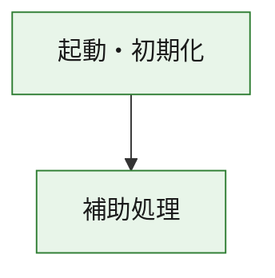
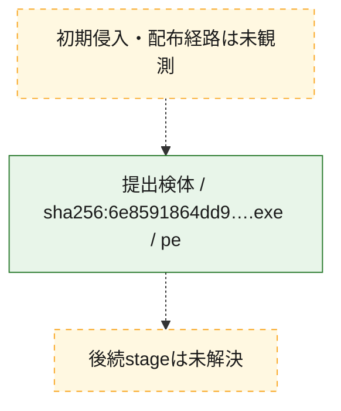
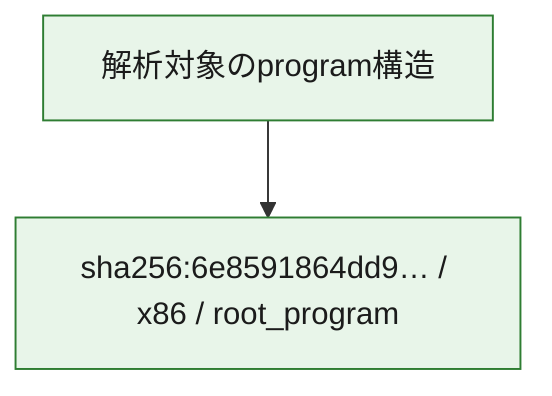

# 全体ロジック：6e8591864dd9d796219ba8319640624c81f79908ce65823a581a9c1d70337aae

代表関数の静的証跡から、起動・初期化の処理群を確認しました。

## 読み方

- phaseの掲載順は解析上の整理順です。observed_call_edgesがない段階間の実行順を断定しません。
- 図の実線は静的に観測した関係、点線と黄色のノードは未観測・未解決の関係を示します。
- 図は静的な要約であり、動的実行を再現するものではありません。
- 詳細な関数解説とfingerprintは[STATIC-LOGIC.md](STATIC-LOGIC.md)を参照してください。

## 静的可視化

### 実行フロー

### 感染チェーン

### モジュール関係

## 処理段階

### 1. 起動・初期化

entry pointから初期化と後続処理への移行を確認します。
確度: `confirmed_static_function_evidence`

- `6e8591864dd9d796219ba8319640624c81f79908ce65823a581a9c1d70337aae:ghidra:180001010` — 初期化と主要処理への分岐を行う入口関数です。 状態: `succeeded`、選定理由: `entry_point`, `meaningful_symbol_name`, `reviewed_call_centrality:22`, `role:entrypoint`, `small_program_complete_context`

### 2. 補助処理

主要処理を支える一般内部関数またはlibrary処理を確認します。
確度: `confirmed_static_function_evidence`

- `6e8591864dd9d796219ba8319640624c81f79908ce65823a581a9c1d70337aae:ghidra:180001240` — 検体内部の一般処理を実装する関数です。 状態: `succeeded`、選定理由: `context_representative`, `reviewed_call_centrality:2`, `small_program_complete_context`
- `6e8591864dd9d796219ba8319640624c81f79908ce65823a581a9c1d70337aae:ghidra:180001350` — 検体内部の一般処理を実装する関数です。 状態: `succeeded`、選定理由: `context_representative`, `reviewed_call_centrality:25`, `small_program_complete_context`
- `6e8591864dd9d796219ba8319640624c81f79908ce65823a581a9c1d70337aae:ghidra:180003780` — 検体内部の一般処理を実装する関数です。 状態: `succeeded`、選定理由: `context_representative`, `reviewed_call_centrality:2`, `small_program_complete_context`
- `6e8591864dd9d796219ba8319640624c81f79908ce65823a581a9c1d70337aae:ghidra:1800038e0` — 検体内部の一般処理を実装する関数です。 状態: `succeeded`、選定理由: `context_representative`, `reviewed_call_centrality:2`, `small_program_complete_context`

## 観測したcall関係

- `6e8591864dd9d796219ba8319640624c81f79908ce65823a581a9c1d70337aae:ghidra:180001010` → `6e8591864dd9d796219ba8319640624c81f79908ce65823a581a9c1d70337aae:ghidra:180001240` （`startup` → `support`）
- `6e8591864dd9d796219ba8319640624c81f79908ce65823a581a9c1d70337aae:ghidra:180001010` → `6e8591864dd9d796219ba8319640624c81f79908ce65823a581a9c1d70337aae:ghidra:180001350` （`startup` → `support`）
- `6e8591864dd9d796219ba8319640624c81f79908ce65823a581a9c1d70337aae:ghidra:180001350` → `6e8591864dd9d796219ba8319640624c81f79908ce65823a581a9c1d70337aae:ghidra:180001240` （`support` → `support`）
- `6e8591864dd9d796219ba8319640624c81f79908ce65823a581a9c1d70337aae:ghidra:180001350` → `6e8591864dd9d796219ba8319640624c81f79908ce65823a581a9c1d70337aae:ghidra:180003780` （`support` → `support`）
- `6e8591864dd9d796219ba8319640624c81f79908ce65823a581a9c1d70337aae:ghidra:180001350` → `6e8591864dd9d796219ba8319640624c81f79908ce65823a581a9c1d70337aae:ghidra:1800038e0` （`support` → `support`）
- `6e8591864dd9d796219ba8319640624c81f79908ce65823a581a9c1d70337aae:ghidra:180003780` → `6e8591864dd9d796219ba8319640624c81f79908ce65823a581a9c1d70337aae:ghidra:1800038e0` （`support` → `support`）
- `ghidra-function:01b206d0017d50b88b59886d` → `ghidra-function:be481c3325f3e7ea7247916f` （`unclassified` → `unclassified`）
- `ghidra-function:0dca3c66596ebec24d16fe27` → `ghidra-external:1091391a0e125f1e4d1b5c14` （`unclassified` → `unclassified`）
- `ghidra-function:0dca3c66596ebec24d16fe27` → `ghidra-external:39da7e8f1245f6755ba3ef56` （`unclassified` → `unclassified`）
- `ghidra-function:0dca3c66596ebec24d16fe27` → `ghidra-external:448687ec1e726b65914f1df3` （`unclassified` → `unclassified`）
- `ghidra-function:0dca3c66596ebec24d16fe27` → `ghidra-external:46a9d8e1566fe07698895c2f` （`unclassified` → `unclassified`）
- `ghidra-function:0dca3c66596ebec24d16fe27` → `ghidra-external:69aff94f5fe71ae0564841b4` （`unclassified` → `unclassified`）
- `ghidra-function:0dca3c66596ebec24d16fe27` → `ghidra-external:74bef01925d6994e7d9ee41c` （`unclassified` → `unclassified`）
- `ghidra-function:0dca3c66596ebec24d16fe27` → `ghidra-external:75e1756358c2dcc44e2a65aa` （`unclassified` → `unclassified`）
- `ghidra-function:0dca3c66596ebec24d16fe27` → `ghidra-external:81c13fbd659cedc9c0feb8fc` （`unclassified` → `unclassified`）
- `ghidra-function:0dca3c66596ebec24d16fe27` → `ghidra-external:8816057d0eab2062b8b2f369` （`unclassified` → `unclassified`）
- `ghidra-function:0dca3c66596ebec24d16fe27` → `ghidra-external:8b743f1e2bad2ba0a5a62c7c` （`unclassified` → `unclassified`）
- `ghidra-function:0dca3c66596ebec24d16fe27` → `ghidra-external:9c85fbd5a30a413584c27b0c` （`unclassified` → `unclassified`）
- `ghidra-function:0dca3c66596ebec24d16fe27` → `ghidra-external:b0e733697c0ff4ffb0725893` （`unclassified` → `unclassified`）
- `ghidra-function:0dca3c66596ebec24d16fe27` → `ghidra-external:b448934c58ca9316d36f351a` （`unclassified` → `unclassified`）
- `ghidra-function:0dca3c66596ebec24d16fe27` → `ghidra-external:b496d8c20d8e98c3603944ba` （`unclassified` → `unclassified`）
- `ghidra-function:0dca3c66596ebec24d16fe27` → `ghidra-external:c23b94284037362d2e562a83` （`unclassified` → `unclassified`）
- `ghidra-function:0dca3c66596ebec24d16fe27` → `ghidra-external:cb705cd4da291c2ea78e6c5e` （`unclassified` → `unclassified`）
- `ghidra-function:0dca3c66596ebec24d16fe27` → `ghidra-external:dc3cbb0bec42de1d72a057e7` （`unclassified` → `unclassified`）
- `ghidra-function:0dca3c66596ebec24d16fe27` → `ghidra-external:e8e80250ff53bdcd5ff60bf4` （`unclassified` → `unclassified`）
- `ghidra-function:0dca3c66596ebec24d16fe27` → `ghidra-external:ecac64e1316858aff756bb26` （`unclassified` → `unclassified`）
- `ghidra-function:0dca3c66596ebec24d16fe27` → `ghidra-external:f9d24e2ed1dce4f361bca4fc` （`unclassified` → `unclassified`）
- `ghidra-function:0dca3c66596ebec24d16fe27` → `ghidra-external:ffa1f5c4abb6f676c1136703` （`unclassified` → `unclassified`）
- `ghidra-function:0dca3c66596ebec24d16fe27` → `ghidra-function:01b206d0017d50b88b59886d` （`unclassified` → `unclassified`）
- `ghidra-function:0dca3c66596ebec24d16fe27` → `ghidra-function:2dace52fbb866bf63507df84` （`unclassified` → `unclassified`）
- `ghidra-function:0dca3c66596ebec24d16fe27` → `ghidra-function:be481c3325f3e7ea7247916f` （`unclassified` → `unclassified`）
- `ghidra-function:21d418c1e20a4a25bcf71417` → `ghidra-function:0dca3c66596ebec24d16fe27` （`unclassified` → `unclassified`）
- `ghidra-function:21d418c1e20a4a25bcf71417` → `ghidra-function:1564824e66eaed5013ad340f` （`unclassified` → `unclassified`）
- `ghidra-function:21d418c1e20a4a25bcf71417` → `ghidra-function:2dace52fbb866bf63507df84` （`unclassified` → `unclassified`）
- `ghidra-function:21d418c1e20a4a25bcf71417` → `ghidra-function:573fb13352d98cef499b6ea0` （`unclassified` → `unclassified`）
- `ghidra-function:21d418c1e20a4a25bcf71417` → `ghidra-function:70834fe72ac1255ccdb36153` （`unclassified` → `unclassified`）
- `ghidra-function:21d418c1e20a4a25bcf71417` → `ghidra-function:807cbee671eb8c1762c08488` （`unclassified` → `unclassified`）
- `ghidra-function:21d418c1e20a4a25bcf71417` → `ghidra-function:857f4348f769f5c407b4ed62` （`unclassified` → `unclassified`）
- `ghidra-function:21d418c1e20a4a25bcf71417` → `ghidra-function:afa3272c323a5e86fc5cfe6c` （`unclassified` → `unclassified`）
- `ghidra-function:21d418c1e20a4a25bcf71417` → `ghidra-function:b194bfc77155e1572db5b362` （`unclassified` → `unclassified`）
- `ghidra-function:21d418c1e20a4a25bcf71417` → `ghidra-function:bf5e74aff305f12331f088a1` （`unclassified` → `unclassified`）
- `ghidra-function:21d418c1e20a4a25bcf71417` → `ghidra-function:e573ec02ffa0191f0aeb512a` （`unclassified` → `unclassified`）
- `ghidra-function:21d418c1e20a4a25bcf71417` → `ghidra-function:e8cebf696ed59e8a047f18ae` （`unclassified` → `unclassified`）

## 解析範囲と制約

- 選定外関数は全体inventoryへ残しますが、関数本体の個別解説対象にはしていません。
- indirect call、難読化、packer、VM、壊れたcontrol flowによりcall関係が欠落する場合があります。
- 文書は静的解析に基づき、検体実行や外部通信による動的確認は行っていません。
