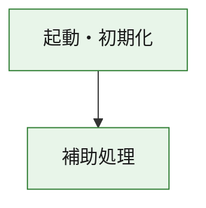
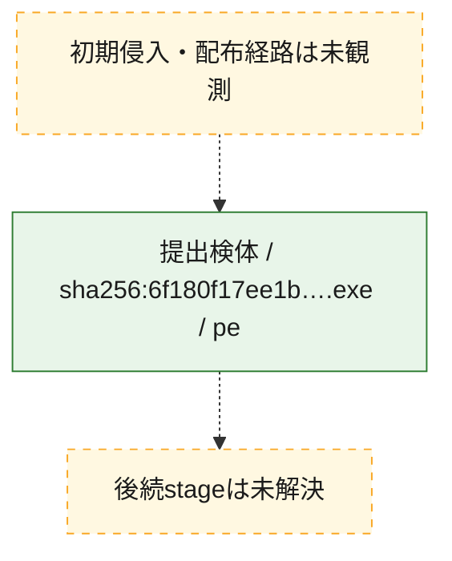
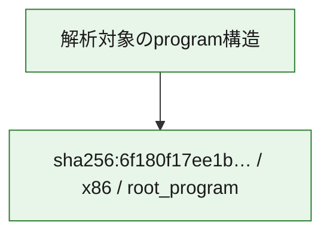

# 全体ロジック：6f180f17ee1b166d30fbb68d61ed54876f565ad5141239f27a1efe2f47e4c92b

代表関数の静的証跡から、起動・初期化の処理群を確認しました。

## 読み方

- phaseの掲載順は解析上の整理順です。observed_call_edgesがない段階間の実行順を断定しません。
- 図の実線は静的に観測した関係、点線と黄色のノードは未観測・未解決の関係を示します。
- 図は静的な要約であり、動的実行を再現するものではありません。
- 詳細な関数解説とfingerprintは[STATIC-LOGIC.md](STATIC-LOGIC.md)を参照してください。

## 静的可視化

### 実行フロー

### 感染チェーン

### モジュール関係

## 処理段階

### 1. 起動・初期化

entry pointから初期化と後続処理への移行を確認します。
確度: `confirmed_static_function_evidence`

- `6f180f17ee1b166d30fbb68d61ed54876f565ad5141239f27a1efe2f47e4c92b:ghidra:180001010` — 初期化と主要処理への分岐を行う入口関数です。 状態: `succeeded`、選定理由: `entry_point`, `meaningful_symbol_name`, `reviewed_call_centrality:22`, `role:entrypoint`, `small_program_complete_context`

### 2. 補助処理

主要処理を支える一般内部関数またはlibrary処理を確認します。
確度: `confirmed_static_function_evidence`

- `6f180f17ee1b166d30fbb68d61ed54876f565ad5141239f27a1efe2f47e4c92b:ghidra:180001240` — 検体内部の一般処理を実装する関数です。 状態: `succeeded`、選定理由: `context_representative`, `reviewed_call_centrality:2`, `small_program_complete_context`
- `6f180f17ee1b166d30fbb68d61ed54876f565ad5141239f27a1efe2f47e4c92b:ghidra:180001350` — 検体内部の一般処理を実装する関数です。 状態: `succeeded`、選定理由: `context_representative`, `reviewed_call_centrality:25`, `small_program_complete_context`
- `6f180f17ee1b166d30fbb68d61ed54876f565ad5141239f27a1efe2f47e4c92b:ghidra:180003780` — 検体内部の一般処理を実装する関数です。 状態: `succeeded`、選定理由: `context_representative`, `reviewed_call_centrality:2`, `small_program_complete_context`
- `6f180f17ee1b166d30fbb68d61ed54876f565ad5141239f27a1efe2f47e4c92b:ghidra:1800038e0` — 検体内部の一般処理を実装する関数です。 状態: `succeeded`、選定理由: `context_representative`, `reviewed_call_centrality:2`, `small_program_complete_context`

## 観測したcall関係

- `6f180f17ee1b166d30fbb68d61ed54876f565ad5141239f27a1efe2f47e4c92b:ghidra:180001010` → `6f180f17ee1b166d30fbb68d61ed54876f565ad5141239f27a1efe2f47e4c92b:ghidra:180001240` （`startup` → `support`）
- `6f180f17ee1b166d30fbb68d61ed54876f565ad5141239f27a1efe2f47e4c92b:ghidra:180001010` → `6f180f17ee1b166d30fbb68d61ed54876f565ad5141239f27a1efe2f47e4c92b:ghidra:180001350` （`startup` → `support`）
- `6f180f17ee1b166d30fbb68d61ed54876f565ad5141239f27a1efe2f47e4c92b:ghidra:180001350` → `6f180f17ee1b166d30fbb68d61ed54876f565ad5141239f27a1efe2f47e4c92b:ghidra:180001240` （`support` → `support`）
- `6f180f17ee1b166d30fbb68d61ed54876f565ad5141239f27a1efe2f47e4c92b:ghidra:180001350` → `6f180f17ee1b166d30fbb68d61ed54876f565ad5141239f27a1efe2f47e4c92b:ghidra:180003780` （`support` → `support`）
- `6f180f17ee1b166d30fbb68d61ed54876f565ad5141239f27a1efe2f47e4c92b:ghidra:180001350` → `6f180f17ee1b166d30fbb68d61ed54876f565ad5141239f27a1efe2f47e4c92b:ghidra:1800038e0` （`support` → `support`）
- `6f180f17ee1b166d30fbb68d61ed54876f565ad5141239f27a1efe2f47e4c92b:ghidra:180003780` → `6f180f17ee1b166d30fbb68d61ed54876f565ad5141239f27a1efe2f47e4c92b:ghidra:1800038e0` （`support` → `support`）
- `ghidra-function:695533950f8603324f4f3793` → `ghidra-function:0b0143ded855c8cb2b1a5559` （`unclassified` → `unclassified`）
- `ghidra-function:695533950f8603324f4f3793` → `ghidra-function:1763d51b72a1a482032802ad` （`unclassified` → `unclassified`）
- `ghidra-function:695533950f8603324f4f3793` → `ghidra-function:331feedb675b00b9d8948f28` （`unclassified` → `unclassified`）
- `ghidra-function:695533950f8603324f4f3793` → `ghidra-function:4081ec3e2dd12fc9f1655dde` （`unclassified` → `unclassified`）
- `ghidra-function:695533950f8603324f4f3793` → `ghidra-function:7a401f9e3af8d7c75935566a` （`unclassified` → `unclassified`）
- `ghidra-function:695533950f8603324f4f3793` → `ghidra-function:8c9178691ea3e4104e7cb43d` （`unclassified` → `unclassified`）
- `ghidra-function:695533950f8603324f4f3793` → `ghidra-function:91576a38eaf90a9ceaa753a7` （`unclassified` → `unclassified`）
- `ghidra-function:695533950f8603324f4f3793` → `ghidra-function:c7f529144c82224c67ac5b81` （`unclassified` → `unclassified`）
- `ghidra-function:695533950f8603324f4f3793` → `ghidra-function:ddcd28446c37e36a7ddc8977` （`unclassified` → `unclassified`）
- `ghidra-function:695533950f8603324f4f3793` → `ghidra-function:ef01af537dd13b0a0572dc79` （`unclassified` → `unclassified`）
- `ghidra-function:695533950f8603324f4f3793` → `ghidra-function:f069d7f24cf7ea2137f5a171` （`unclassified` → `unclassified`）
- `ghidra-function:695533950f8603324f4f3793` → `ghidra-function:f98ebdd68a613388e410e10c` （`unclassified` → `unclassified`）
- `ghidra-function:f98ebdd68a613388e410e10c` → `ghidra-external:03c184b9ce4cdc12108f70e3` （`unclassified` → `unclassified`）
- `ghidra-function:f98ebdd68a613388e410e10c` → `ghidra-external:110273861eb4826fa139c68a` （`unclassified` → `unclassified`）
- `ghidra-function:f98ebdd68a613388e410e10c` → `ghidra-external:24ca95e4d7cd3b2b3f6a8bff` （`unclassified` → `unclassified`）
- `ghidra-function:f98ebdd68a613388e410e10c` → `ghidra-external:2f3bd5a38f7909246ab7ae2f` （`unclassified` → `unclassified`）
- `ghidra-function:f98ebdd68a613388e410e10c` → `ghidra-external:44294b74b868c70b864e92e4` （`unclassified` → `unclassified`）
- `ghidra-function:f98ebdd68a613388e410e10c` → `ghidra-external:478891600cdc9e5de44bc0ee` （`unclassified` → `unclassified`）
- `ghidra-function:f98ebdd68a613388e410e10c` → `ghidra-external:4b06c98ab5c3dba28a9e2e8e` （`unclassified` → `unclassified`）
- `ghidra-function:f98ebdd68a613388e410e10c` → `ghidra-external:4fc2d015dac1a380fdfdf5dd` （`unclassified` → `unclassified`）
- `ghidra-function:f98ebdd68a613388e410e10c` → `ghidra-external:5ed86c416e734c27da5e9ae1` （`unclassified` → `unclassified`）
- `ghidra-function:f98ebdd68a613388e410e10c` → `ghidra-external:5f0d2690703d15634b2a477c` （`unclassified` → `unclassified`）
- `ghidra-function:f98ebdd68a613388e410e10c` → `ghidra-external:870ebe38fb0eccb494f7888b` （`unclassified` → `unclassified`）
- `ghidra-function:f98ebdd68a613388e410e10c` → `ghidra-external:9ca5621990686a5d1e4f5e8a` （`unclassified` → `unclassified`）
- `ghidra-function:f98ebdd68a613388e410e10c` → `ghidra-external:a990e9cf9d02731b4130da0c` （`unclassified` → `unclassified`）
- `ghidra-function:f98ebdd68a613388e410e10c` → `ghidra-external:ae76c213fe17ba8c96f201f5` （`unclassified` → `unclassified`）
- `ghidra-function:f98ebdd68a613388e410e10c` → `ghidra-external:b1bf25ac738a5d3ce8e26c3f` （`unclassified` → `unclassified`）
- `ghidra-function:f98ebdd68a613388e410e10c` → `ghidra-external:d361b2e98a67dac336409278` （`unclassified` → `unclassified`）
- `ghidra-function:f98ebdd68a613388e410e10c` → `ghidra-external:dd38607d1fe06bae3e7ef235` （`unclassified` → `unclassified`）
- `ghidra-function:f98ebdd68a613388e410e10c` → `ghidra-external:e4010d239f6ea1820cd1d481` （`unclassified` → `unclassified`）
- `ghidra-function:f98ebdd68a613388e410e10c` → `ghidra-external:f06e1ad03bfab3a9e0882b0d` （`unclassified` → `unclassified`）
- `ghidra-function:f98ebdd68a613388e410e10c` → `ghidra-external:f46508fc55ed99b8b7497b50` （`unclassified` → `unclassified`）
- `ghidra-function:f98ebdd68a613388e410e10c` → `ghidra-external:fb5eb570b030c727034f7b89` （`unclassified` → `unclassified`）
- `ghidra-function:f98ebdd68a613388e410e10c` → `ghidra-function:cc642306423d04a9bd74f304` （`unclassified` → `unclassified`）
- `ghidra-function:f98ebdd68a613388e410e10c` → `ghidra-function:ddcd28446c37e36a7ddc8977` （`unclassified` → `unclassified`）
- `ghidra-function:f98ebdd68a613388e410e10c` → `ghidra-function:fd292c1235649e0b4cea5afb` （`unclassified` → `unclassified`）
- `ghidra-function:fd292c1235649e0b4cea5afb` → `ghidra-function:cc642306423d04a9bd74f304` （`unclassified` → `unclassified`）

## 解析範囲と制約

- 選定外関数は全体inventoryへ残しますが、関数本体の個別解説対象にはしていません。
- indirect call、難読化、packer、VM、壊れたcontrol flowによりcall関係が欠落する場合があります。
- 文書は静的解析に基づき、検体実行や外部通信による動的確認は行っていません。
