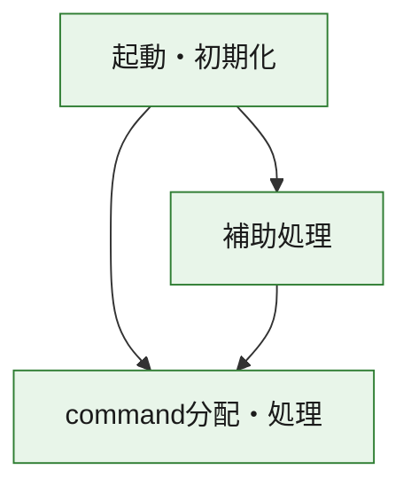
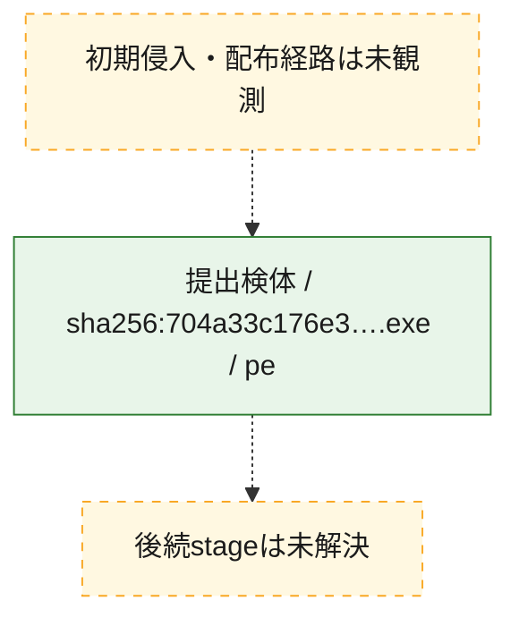
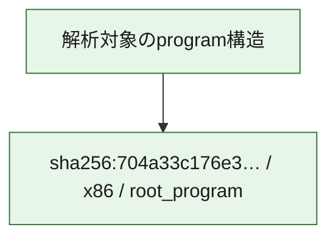

# 全体ロジック：704a33c176e3a63a2a60811683cbf9ef7c60b6befd1d95b02c4e67c2924eec51

代表関数の静的証跡から、起動・初期化、command分配・処理の処理群を確認しました。

## 読み方

- phaseの掲載順は解析上の整理順です。observed_call_edgesがない段階間の実行順を断定しません。
- 図の実線は静的に観測した関係、点線と黄色のノードは未観測・未解決の関係を示します。
- 図は静的な要約であり、動的実行を再現するものではありません。
- 詳細な関数解説とfingerprintは[STATIC-LOGIC.md](STATIC-LOGIC.md)を参照してください。

## 静的可視化

### 実行フロー

### 感染チェーン

### モジュール関係

## 処理段階

### 1. 起動・初期化

entry pointから初期化と後続処理への移行を確認します。
確度: `confirmed_static_function_evidence`

- `704a33c176e3a63a2a60811683cbf9ef7c60b6befd1d95b02c4e67c2924eec51:ghidra:14000e470` — 初期化と主要処理への分岐を行う入口関数です。 状態: `succeeded`、選定理由: `entry_point`, `meaningful_symbol_name`, `reviewed_call_centrality:21`, `role:entrypoint`

### 2. command分配・処理

受信commandやtaskの解釈、分配、個別handlerへの移行を確認します。
確度: `confirmed_static_function_evidence_with_limits`

- `704a33c176e3a63a2a60811683cbf9ef7c60b6befd1d95b02c4e67c2924eec51:ghidra:14002c150` — commandの解釈、分配、または個別処理を担当する関数です。 状態: `limited_bad_instruction_or_flow`、選定理由: `meaningful_symbol_name`, `reviewed_call_centrality:2`, `role:command_dispatch_or_handler`

### 3. 補助処理

主要処理を支える一般内部関数またはlibrary処理を確認します。
確度: `confirmed_static_function_evidence`

- `704a33c176e3a63a2a60811683cbf9ef7c60b6befd1d95b02c4e67c2924eec51:ghidra:140001000` — 検体内部の一般処理を実装する関数です。 状態: `succeeded`、選定理由: `context_representative`, `reviewed_call_centrality:56`
- `704a33c176e3a63a2a60811683cbf9ef7c60b6befd1d95b02c4e67c2924eec51:ghidra:140001040` — 検体内部の一般処理を実装する関数です。 状態: `succeeded`、選定理由: `context_representative`, `reviewed_call_centrality:12`
- `704a33c176e3a63a2a60811683cbf9ef7c60b6befd1d95b02c4e67c2924eec51:ghidra:140001200` — 検体内部の一般処理を実装する関数です。 状態: `succeeded`、選定理由: `context_representative`, `reviewed_call_centrality:7`
- `704a33c176e3a63a2a60811683cbf9ef7c60b6befd1d95b02c4e67c2924eec51:ghidra:140001310` — 検体内部の一般処理を実装する関数です。 状態: `succeeded`、選定理由: `context_representative`, `reviewed_call_centrality:13`
- `704a33c176e3a63a2a60811683cbf9ef7c60b6befd1d95b02c4e67c2924eec51:ghidra:140001550` — 検体内部の一般処理を実装する関数です。 状態: `succeeded`、選定理由: `context_representative`, `reviewed_call_centrality:10`
- `704a33c176e3a63a2a60811683cbf9ef7c60b6befd1d95b02c4e67c2924eec51:ghidra:1400016e0` — 検体内部の一般処理を実装する関数です。 状態: `succeeded`、選定理由: `context_representative`, `reviewed_call_centrality:9`
- `704a33c176e3a63a2a60811683cbf9ef7c60b6befd1d95b02c4e67c2924eec51:ghidra:140001820` — 検体内部の一般処理を実装する関数です。 状態: `succeeded`、選定理由: `context_representative`, `reviewed_call_centrality:2`
- `704a33c176e3a63a2a60811683cbf9ef7c60b6befd1d95b02c4e67c2924eec51:ghidra:1400018a0` — 検体内部の一般処理を実装する関数です。 状態: `succeeded`、選定理由: `context_representative`, `reviewed_call_centrality:8`
- `704a33c176e3a63a2a60811683cbf9ef7c60b6befd1d95b02c4e67c2924eec51:ghidra:1400018f0` — 検体内部の一般処理を実装する関数です。 状態: `succeeded`、選定理由: `context_representative`, `reviewed_call_centrality:14`
- `704a33c176e3a63a2a60811683cbf9ef7c60b6befd1d95b02c4e67c2924eec51:ghidra:140001c00` — 検体内部の一般処理を実装する関数です。 状態: `succeeded`、選定理由: `context_representative`, `reviewed_call_centrality:6`
- `704a33c176e3a63a2a60811683cbf9ef7c60b6befd1d95b02c4e67c2924eec51:ghidra:140001c60` — 検体内部の一般処理を実装する関数です。 状態: `succeeded`、選定理由: `context_representative`, `reviewed_call_centrality:6`
- `704a33c176e3a63a2a60811683cbf9ef7c60b6befd1d95b02c4e67c2924eec51:ghidra:140002590` — 検体内部の一般処理を実装する関数です。 状態: `succeeded`、選定理由: `context_representative`, `reviewed_call_centrality:12`
- `704a33c176e3a63a2a60811683cbf9ef7c60b6befd1d95b02c4e67c2924eec51:ghidra:140002710` — 検体内部の一般処理を実装する関数です。 状態: `succeeded`、選定理由: `context_representative`, `reviewed_call_centrality:8`
- `704a33c176e3a63a2a60811683cbf9ef7c60b6befd1d95b02c4e67c2924eec51:ghidra:140002750` — 検体内部の一般処理を実装する関数です。 状態: `succeeded`、選定理由: `context_representative`, `reviewed_call_centrality:8`
- `704a33c176e3a63a2a60811683cbf9ef7c60b6befd1d95b02c4e67c2924eec51:ghidra:1400027f0` — 検体内部の一般処理を実装する関数です。 状態: `succeeded`、選定理由: `context_representative`, `reviewed_call_centrality:5`
- `704a33c176e3a63a2a60811683cbf9ef7c60b6befd1d95b02c4e67c2924eec51:ghidra:140002850` — 検体内部の一般処理を実装する関数です。 状態: `succeeded`、選定理由: `context_representative`, `reviewed_call_centrality:7`
- `704a33c176e3a63a2a60811683cbf9ef7c60b6befd1d95b02c4e67c2924eec51:ghidra:140002f80` — 検体内部の一般処理を実装する関数です。 状態: `succeeded`、選定理由: `context_representative`, `reviewed_call_centrality:10`
- `704a33c176e3a63a2a60811683cbf9ef7c60b6befd1d95b02c4e67c2924eec51:ghidra:1400030a0` — 検体内部の一般処理を実装する関数です。 状態: `succeeded`、選定理由: `context_representative`, `reviewed_call_centrality:8`
- `704a33c176e3a63a2a60811683cbf9ef7c60b6befd1d95b02c4e67c2924eec51:ghidra:1400030f0` — 検体内部の一般処理を実装する関数です。 状態: `succeeded`、選定理由: `context_representative`, `reviewed_call_centrality:13`
- `704a33c176e3a63a2a60811683cbf9ef7c60b6befd1d95b02c4e67c2924eec51:ghidra:140003220` — 検体内部の一般処理を実装する関数です。 状態: `succeeded`、選定理由: `context_representative`, `reviewed_call_centrality:22`
- `704a33c176e3a63a2a60811683cbf9ef7c60b6befd1d95b02c4e67c2924eec51:ghidra:1400035f0` — 検体内部の一般処理を実装する関数です。 状態: `succeeded`、選定理由: `context_representative`, `reviewed_call_centrality:10`
- `704a33c176e3a63a2a60811683cbf9ef7c60b6befd1d95b02c4e67c2924eec51:ghidra:1400036b0` — 検体内部の一般処理を実装する関数です。 状態: `succeeded`、選定理由: `context_representative`, `reviewed_call_centrality:13`
- `704a33c176e3a63a2a60811683cbf9ef7c60b6befd1d95b02c4e67c2924eec51:ghidra:1400038c0` — 検体内部の一般処理を実装する関数です。 状態: `succeeded`、選定理由: `context_representative`, `reviewed_call_centrality:15`
- `704a33c176e3a63a2a60811683cbf9ef7c60b6befd1d95b02c4e67c2924eec51:ghidra:140003a30` — 検体内部の一般処理を実装する関数です。 状態: `succeeded`、選定理由: `context_representative`, `reviewed_call_centrality:3`
- `704a33c176e3a63a2a60811683cbf9ef7c60b6befd1d95b02c4e67c2924eec51:ghidra:140003ad0` — 検体内部の一般処理を実装する関数です。 状態: `succeeded`、選定理由: `context_representative`, `reviewed_call_centrality:9`
- `704a33c176e3a63a2a60811683cbf9ef7c60b6befd1d95b02c4e67c2924eec51:ghidra:140003b60` — 検体内部の一般処理を実装する関数です。 状態: `succeeded`、選定理由: `context_representative`, `reviewed_call_centrality:3`
- `704a33c176e3a63a2a60811683cbf9ef7c60b6befd1d95b02c4e67c2924eec51:ghidra:140003bc0` — 検体内部の一般処理を実装する関数です。 状態: `succeeded`、選定理由: `context_representative`, `reviewed_call_centrality:13`
- `704a33c176e3a63a2a60811683cbf9ef7c60b6befd1d95b02c4e67c2924eec51:ghidra:140003cc0` — 検体内部の一般処理を実装する関数です。 状態: `succeeded`、選定理由: `context_representative`, `reviewed_call_centrality:10`
- `704a33c176e3a63a2a60811683cbf9ef7c60b6befd1d95b02c4e67c2924eec51:ghidra:140003dc0` — 検体内部の一般処理を実装する関数です。 状態: `succeeded`、選定理由: `context_representative`, `reviewed_call_centrality:15`
- `704a33c176e3a63a2a60811683cbf9ef7c60b6befd1d95b02c4e67c2924eec51:ghidra:140004b40` — 検体内部の一般処理を実装する関数です。 状態: `succeeded`、選定理由: `meaningful_symbol_name`, `reviewed_call_centrality:1`

## 観測したcall関係

- `704a33c176e3a63a2a60811683cbf9ef7c60b6befd1d95b02c4e67c2924eec51:ghidra:140001000` → `704a33c176e3a63a2a60811683cbf9ef7c60b6befd1d95b02c4e67c2924eec51:ghidra:1400018a0` （`support` → `support`）
- `704a33c176e3a63a2a60811683cbf9ef7c60b6befd1d95b02c4e67c2924eec51:ghidra:140001000` → `704a33c176e3a63a2a60811683cbf9ef7c60b6befd1d95b02c4e67c2924eec51:ghidra:1400018f0` （`support` → `support`）
- `704a33c176e3a63a2a60811683cbf9ef7c60b6befd1d95b02c4e67c2924eec51:ghidra:140001000` → `704a33c176e3a63a2a60811683cbf9ef7c60b6befd1d95b02c4e67c2924eec51:ghidra:140001c00` （`support` → `support`）
- `704a33c176e3a63a2a60811683cbf9ef7c60b6befd1d95b02c4e67c2924eec51:ghidra:140001000` → `704a33c176e3a63a2a60811683cbf9ef7c60b6befd1d95b02c4e67c2924eec51:ghidra:140003bc0` （`support` → `support`）
- `704a33c176e3a63a2a60811683cbf9ef7c60b6befd1d95b02c4e67c2924eec51:ghidra:140001000` → `704a33c176e3a63a2a60811683cbf9ef7c60b6befd1d95b02c4e67c2924eec51:ghidra:140004b40` （`support` → `support`）
- `704a33c176e3a63a2a60811683cbf9ef7c60b6befd1d95b02c4e67c2924eec51:ghidra:140001040` → `704a33c176e3a63a2a60811683cbf9ef7c60b6befd1d95b02c4e67c2924eec51:ghidra:140001310` （`support` → `support`）
- `704a33c176e3a63a2a60811683cbf9ef7c60b6befd1d95b02c4e67c2924eec51:ghidra:140001040` → `704a33c176e3a63a2a60811683cbf9ef7c60b6befd1d95b02c4e67c2924eec51:ghidra:140003bc0` （`support` → `support`）
- `704a33c176e3a63a2a60811683cbf9ef7c60b6befd1d95b02c4e67c2924eec51:ghidra:140001040` → `704a33c176e3a63a2a60811683cbf9ef7c60b6befd1d95b02c4e67c2924eec51:ghidra:140003dc0` （`support` → `support`）
- `704a33c176e3a63a2a60811683cbf9ef7c60b6befd1d95b02c4e67c2924eec51:ghidra:140001200` → `704a33c176e3a63a2a60811683cbf9ef7c60b6befd1d95b02c4e67c2924eec51:ghidra:140003dc0` （`support` → `support`）
- `704a33c176e3a63a2a60811683cbf9ef7c60b6befd1d95b02c4e67c2924eec51:ghidra:140001310` → `704a33c176e3a63a2a60811683cbf9ef7c60b6befd1d95b02c4e67c2924eec51:ghidra:140003bc0` （`support` → `support`）
- `704a33c176e3a63a2a60811683cbf9ef7c60b6befd1d95b02c4e67c2924eec51:ghidra:140001550` → `704a33c176e3a63a2a60811683cbf9ef7c60b6befd1d95b02c4e67c2924eec51:ghidra:140001310` （`support` → `support`）
- `704a33c176e3a63a2a60811683cbf9ef7c60b6befd1d95b02c4e67c2924eec51:ghidra:140001550` → `704a33c176e3a63a2a60811683cbf9ef7c60b6befd1d95b02c4e67c2924eec51:ghidra:140003bc0` （`support` → `support`）
- `704a33c176e3a63a2a60811683cbf9ef7c60b6befd1d95b02c4e67c2924eec51:ghidra:140001550` → `704a33c176e3a63a2a60811683cbf9ef7c60b6befd1d95b02c4e67c2924eec51:ghidra:140003dc0` （`support` → `support`）
- `704a33c176e3a63a2a60811683cbf9ef7c60b6befd1d95b02c4e67c2924eec51:ghidra:1400016e0` → `704a33c176e3a63a2a60811683cbf9ef7c60b6befd1d95b02c4e67c2924eec51:ghidra:140001040` （`support` → `support`）
- `704a33c176e3a63a2a60811683cbf9ef7c60b6befd1d95b02c4e67c2924eec51:ghidra:1400016e0` → `704a33c176e3a63a2a60811683cbf9ef7c60b6befd1d95b02c4e67c2924eec51:ghidra:140001200` （`support` → `support`）
- `704a33c176e3a63a2a60811683cbf9ef7c60b6befd1d95b02c4e67c2924eec51:ghidra:1400016e0` → `704a33c176e3a63a2a60811683cbf9ef7c60b6befd1d95b02c4e67c2924eec51:ghidra:140001310` （`support` → `support`）
- `704a33c176e3a63a2a60811683cbf9ef7c60b6befd1d95b02c4e67c2924eec51:ghidra:1400016e0` → `704a33c176e3a63a2a60811683cbf9ef7c60b6befd1d95b02c4e67c2924eec51:ghidra:140003bc0` （`support` → `support`）
- `704a33c176e3a63a2a60811683cbf9ef7c60b6befd1d95b02c4e67c2924eec51:ghidra:1400016e0` → `704a33c176e3a63a2a60811683cbf9ef7c60b6befd1d95b02c4e67c2924eec51:ghidra:140003dc0` （`support` → `support`）
- `704a33c176e3a63a2a60811683cbf9ef7c60b6befd1d95b02c4e67c2924eec51:ghidra:1400018f0` → `704a33c176e3a63a2a60811683cbf9ef7c60b6befd1d95b02c4e67c2924eec51:ghidra:140001c00` （`support` → `support`）
- `704a33c176e3a63a2a60811683cbf9ef7c60b6befd1d95b02c4e67c2924eec51:ghidra:1400018f0` → `704a33c176e3a63a2a60811683cbf9ef7c60b6befd1d95b02c4e67c2924eec51:ghidra:140003bc0` （`support` → `support`）
- `704a33c176e3a63a2a60811683cbf9ef7c60b6befd1d95b02c4e67c2924eec51:ghidra:1400018f0` → `704a33c176e3a63a2a60811683cbf9ef7c60b6befd1d95b02c4e67c2924eec51:ghidra:140003dc0` （`support` → `support`）
- `704a33c176e3a63a2a60811683cbf9ef7c60b6befd1d95b02c4e67c2924eec51:ghidra:140002590` → `704a33c176e3a63a2a60811683cbf9ef7c60b6befd1d95b02c4e67c2924eec51:ghidra:1400027f0` （`support` → `support`）
- `704a33c176e3a63a2a60811683cbf9ef7c60b6befd1d95b02c4e67c2924eec51:ghidra:140002590` → `704a33c176e3a63a2a60811683cbf9ef7c60b6befd1d95b02c4e67c2924eec51:ghidra:140003cc0` （`support` → `support`）
- `704a33c176e3a63a2a60811683cbf9ef7c60b6befd1d95b02c4e67c2924eec51:ghidra:140002750` → `704a33c176e3a63a2a60811683cbf9ef7c60b6befd1d95b02c4e67c2924eec51:ghidra:140001c60` （`support` → `support`）
- `704a33c176e3a63a2a60811683cbf9ef7c60b6befd1d95b02c4e67c2924eec51:ghidra:140002750` → `704a33c176e3a63a2a60811683cbf9ef7c60b6befd1d95b02c4e67c2924eec51:ghidra:140002590` （`support` → `support`）
- `704a33c176e3a63a2a60811683cbf9ef7c60b6befd1d95b02c4e67c2924eec51:ghidra:140002750` → `704a33c176e3a63a2a60811683cbf9ef7c60b6befd1d95b02c4e67c2924eec51:ghidra:140003dc0` （`support` → `support`）
- `704a33c176e3a63a2a60811683cbf9ef7c60b6befd1d95b02c4e67c2924eec51:ghidra:140002850` → `704a33c176e3a63a2a60811683cbf9ef7c60b6befd1d95b02c4e67c2924eec51:ghidra:14002c150` （`support` → `dispatch`）
- `704a33c176e3a63a2a60811683cbf9ef7c60b6befd1d95b02c4e67c2924eec51:ghidra:140002f80` → `704a33c176e3a63a2a60811683cbf9ef7c60b6befd1d95b02c4e67c2924eec51:ghidra:140003cc0` （`support` → `support`）
- `704a33c176e3a63a2a60811683cbf9ef7c60b6befd1d95b02c4e67c2924eec51:ghidra:1400030f0` → `704a33c176e3a63a2a60811683cbf9ef7c60b6befd1d95b02c4e67c2924eec51:ghidra:140002850` （`support` → `support`）
- `704a33c176e3a63a2a60811683cbf9ef7c60b6befd1d95b02c4e67c2924eec51:ghidra:1400030f0` → `704a33c176e3a63a2a60811683cbf9ef7c60b6befd1d95b02c4e67c2924eec51:ghidra:140002f80` （`support` → `support`）
- `704a33c176e3a63a2a60811683cbf9ef7c60b6befd1d95b02c4e67c2924eec51:ghidra:1400030f0` → `704a33c176e3a63a2a60811683cbf9ef7c60b6befd1d95b02c4e67c2924eec51:ghidra:140003dc0` （`support` → `support`）
- `704a33c176e3a63a2a60811683cbf9ef7c60b6befd1d95b02c4e67c2924eec51:ghidra:140003220` → `704a33c176e3a63a2a60811683cbf9ef7c60b6befd1d95b02c4e67c2924eec51:ghidra:1400027f0` （`support` → `support`）
- `704a33c176e3a63a2a60811683cbf9ef7c60b6befd1d95b02c4e67c2924eec51:ghidra:140003220` → `704a33c176e3a63a2a60811683cbf9ef7c60b6befd1d95b02c4e67c2924eec51:ghidra:1400036b0` （`support` → `support`）
- `704a33c176e3a63a2a60811683cbf9ef7c60b6befd1d95b02c4e67c2924eec51:ghidra:1400035f0` → `704a33c176e3a63a2a60811683cbf9ef7c60b6befd1d95b02c4e67c2924eec51:ghidra:140003220` （`support` → `support`）
- `704a33c176e3a63a2a60811683cbf9ef7c60b6befd1d95b02c4e67c2924eec51:ghidra:1400035f0` → `704a33c176e3a63a2a60811683cbf9ef7c60b6befd1d95b02c4e67c2924eec51:ghidra:1400036b0` （`support` → `support`）
- `704a33c176e3a63a2a60811683cbf9ef7c60b6befd1d95b02c4e67c2924eec51:ghidra:1400038c0` → `704a33c176e3a63a2a60811683cbf9ef7c60b6befd1d95b02c4e67c2924eec51:ghidra:1400027f0` （`support` → `support`）
- `704a33c176e3a63a2a60811683cbf9ef7c60b6befd1d95b02c4e67c2924eec51:ghidra:140003a30` → `704a33c176e3a63a2a60811683cbf9ef7c60b6befd1d95b02c4e67c2924eec51:ghidra:1400038c0` （`support` → `support`）
- `704a33c176e3a63a2a60811683cbf9ef7c60b6befd1d95b02c4e67c2924eec51:ghidra:140003bc0` → `704a33c176e3a63a2a60811683cbf9ef7c60b6befd1d95b02c4e67c2924eec51:ghidra:140001c00` （`support` → `support`）
- `704a33c176e3a63a2a60811683cbf9ef7c60b6befd1d95b02c4e67c2924eec51:ghidra:140003bc0` → `704a33c176e3a63a2a60811683cbf9ef7c60b6befd1d95b02c4e67c2924eec51:ghidra:140003ad0` （`support` → `support`）
- `704a33c176e3a63a2a60811683cbf9ef7c60b6befd1d95b02c4e67c2924eec51:ghidra:140003cc0` → `704a33c176e3a63a2a60811683cbf9ef7c60b6befd1d95b02c4e67c2924eec51:ghidra:140003b60` （`support` → `support`）
- `704a33c176e3a63a2a60811683cbf9ef7c60b6befd1d95b02c4e67c2924eec51:ghidra:140003dc0` → `704a33c176e3a63a2a60811683cbf9ef7c60b6befd1d95b02c4e67c2924eec51:ghidra:140001c00` （`support` → `support`）
- `704a33c176e3a63a2a60811683cbf9ef7c60b6befd1d95b02c4e67c2924eec51:ghidra:140003dc0` → `704a33c176e3a63a2a60811683cbf9ef7c60b6befd1d95b02c4e67c2924eec51:ghidra:140003ad0` （`support` → `support`）
- `704a33c176e3a63a2a60811683cbf9ef7c60b6befd1d95b02c4e67c2924eec51:ghidra:14000e470` → `704a33c176e3a63a2a60811683cbf9ef7c60b6befd1d95b02c4e67c2924eec51:ghidra:140001000` （`startup` → `support`）
- `704a33c176e3a63a2a60811683cbf9ef7c60b6befd1d95b02c4e67c2924eec51:ghidra:14000e470` → `704a33c176e3a63a2a60811683cbf9ef7c60b6befd1d95b02c4e67c2924eec51:ghidra:14002c150` （`startup` → `dispatch`）
- `ghidra-function:0256ed8d3bd9b55462d274bc` → `ghidra-external:1ce8f42c49e91acca60c93cf` （`unclassified` → `unclassified`）
- `ghidra-function:0256ed8d3bd9b55462d274bc` → `ghidra-external:27994c2fae401a985d209dbb` （`unclassified` → `unclassified`）
- `ghidra-function:0256ed8d3bd9b55462d274bc` → `ghidra-external:7a13970c515391d98c87f95d` （`unclassified` → `unclassified`）
- `ghidra-function:0256ed8d3bd9b55462d274bc` → `ghidra-external:96add2e51976c27ed02250c9` （`unclassified` → `unclassified`）
- `ghidra-function:0256ed8d3bd9b55462d274bc` → `ghidra-external:a302e824a8e8f77a194f67b2` （`unclassified` → `unclassified`）
- `ghidra-function:0256ed8d3bd9b55462d274bc` → `ghidra-external:aa9a2e58728c560cc07bae17` （`unclassified` → `unclassified`）
- `ghidra-function:0256ed8d3bd9b55462d274bc` → `ghidra-external:b5971f3c67c2bdec06b24c84` （`unclassified` → `unclassified`）
- `ghidra-function:0256ed8d3bd9b55462d274bc` → `ghidra-external:e99653c7e00159ce9441afb5` （`unclassified` → `unclassified`）
- `ghidra-function:0256ed8d3bd9b55462d274bc` → `ghidra-function:17b9b38b22271bcd1d712613` （`unclassified` → `unclassified`）
- `ghidra-function:0256ed8d3bd9b55462d274bc` → `ghidra-function:17f3cb5f31cbcf3c23665c6d` （`unclassified` → `unclassified`）
- `ghidra-function:0256ed8d3bd9b55462d274bc` → `ghidra-function:1b71086e1dc0b23465182f0d` （`unclassified` → `unclassified`）
- `ghidra-function:0256ed8d3bd9b55462d274bc` → `ghidra-function:208abaea615f4f3bc5202a5a` （`unclassified` → `unclassified`）
- `ghidra-function:0256ed8d3bd9b55462d274bc` → `ghidra-function:230f60a01b60e053e8a3d56e` （`unclassified` → `unclassified`）
- `ghidra-function:0256ed8d3bd9b55462d274bc` → `ghidra-function:2a94908291db2fbf6a1cb941` （`unclassified` → `unclassified`）
- `ghidra-function:0256ed8d3bd9b55462d274bc` → `ghidra-function:2b8562f1e9e2f2c65dae6b77` （`unclassified` → `unclassified`）
- `ghidra-function:0256ed8d3bd9b55462d274bc` → `ghidra-function:2cca07c51f4e237eafce2a4d` （`unclassified` → `unclassified`）
- `ghidra-function:0256ed8d3bd9b55462d274bc` → `ghidra-function:325b05fc336f7efc85f6f1d5` （`unclassified` → `unclassified`）
- `ghidra-function:0256ed8d3bd9b55462d274bc` → `ghidra-function:3fdb6b00e2d03111270efb88` （`unclassified` → `unclassified`）
- `ghidra-function:0256ed8d3bd9b55462d274bc` → `ghidra-function:418c8afdb7c34706d2e25209` （`unclassified` → `unclassified`）
- `ghidra-function:0256ed8d3bd9b55462d274bc` → `ghidra-function:4c93883fcadc3b9c3cf9f1f7` （`unclassified` → `unclassified`）
- `ghidra-function:0256ed8d3bd9b55462d274bc` → `ghidra-function:51081be36883a37246f0fc02` （`unclassified` → `unclassified`）
- `ghidra-function:0256ed8d3bd9b55462d274bc` → `ghidra-function:53855ce9c20947be90e54897` （`unclassified` → `unclassified`）
- `ghidra-function:0256ed8d3bd9b55462d274bc` → `ghidra-function:55ae513cb990638aef8c1962` （`unclassified` → `unclassified`）
- `ghidra-function:0256ed8d3bd9b55462d274bc` → `ghidra-function:5f6c6a8634bdd7b128933101` （`unclassified` → `unclassified`）
- `ghidra-function:0256ed8d3bd9b55462d274bc` → `ghidra-function:62882cf407d95fcff72b46d4` （`unclassified` → `unclassified`）
- `ghidra-function:0256ed8d3bd9b55462d274bc` → `ghidra-function:62e2ee41d558f7cfb995719b` （`unclassified` → `unclassified`）
- `ghidra-function:0256ed8d3bd9b55462d274bc` → `ghidra-function:66db2fe1bf2b1f5c954b183f` （`unclassified` → `unclassified`）
- `ghidra-function:0256ed8d3bd9b55462d274bc` → `ghidra-function:6e44880821597204531076ec` （`unclassified` → `unclassified`）
- `ghidra-function:0256ed8d3bd9b55462d274bc` → `ghidra-function:915ccf257d67a5db1593ae21` （`unclassified` → `unclassified`）
- `ghidra-function:0256ed8d3bd9b55462d274bc` → `ghidra-function:921ea3151b78ac993538f15e` （`unclassified` → `unclassified`）
- `ghidra-function:0256ed8d3bd9b55462d274bc` → `ghidra-function:95d1de6cef22341c76eb0f69` （`unclassified` → `unclassified`）
- `ghidra-function:0256ed8d3bd9b55462d274bc` → `ghidra-function:9f91a1dc5434dcd5d97c1adb` （`unclassified` → `unclassified`）
- `ghidra-function:0256ed8d3bd9b55462d274bc` → `ghidra-function:a001157cdb48a1ef8ae07732` （`unclassified` → `unclassified`）
- `ghidra-function:0256ed8d3bd9b55462d274bc` → `ghidra-function:a2cf120b203938f5a3b22903` （`unclassified` → `unclassified`）
- `ghidra-function:0256ed8d3bd9b55462d274bc` → `ghidra-function:a53f8ce1c8d71ad9f265a556` （`unclassified` → `unclassified`）
- `ghidra-function:0256ed8d3bd9b55462d274bc` → `ghidra-function:a5562c3d0550ef6dae1514cf` （`unclassified` → `unclassified`）
- `ghidra-function:0256ed8d3bd9b55462d274bc` → `ghidra-function:a83ccb1d06d5b6e3b2423755` （`unclassified` → `unclassified`）
- `ghidra-function:0256ed8d3bd9b55462d274bc` → `ghidra-function:aacb67632df4a120eb052897` （`unclassified` → `unclassified`）
- `ghidra-function:0256ed8d3bd9b55462d274bc` → `ghidra-function:abf6341749493542817c47ce` （`unclassified` → `unclassified`）
- `ghidra-function:0256ed8d3bd9b55462d274bc` → `ghidra-function:b190ec21f20c6b49f95a038e` （`unclassified` → `unclassified`）
- `ghidra-function:0256ed8d3bd9b55462d274bc` → `ghidra-function:b4bc8fcd7551351a0d7104a0` （`unclassified` → `unclassified`）
- `ghidra-function:0256ed8d3bd9b55462d274bc` → `ghidra-function:ba28d2271e8d30ab1556062a` （`unclassified` → `unclassified`）
- `ghidra-function:0256ed8d3bd9b55462d274bc` → `ghidra-function:c12e0e361154485109eae3e9` （`unclassified` → `unclassified`）
- `ghidra-function:0256ed8d3bd9b55462d274bc` → `ghidra-function:c3eca3dcd33a5b4a5b982e29` （`unclassified` → `unclassified`）
- `ghidra-function:0256ed8d3bd9b55462d274bc` → `ghidra-function:c941197249c89b57bbc0607b` （`unclassified` → `unclassified`）
- `ghidra-function:0256ed8d3bd9b55462d274bc` → `ghidra-function:dace7d8aa5bd706b24c6b745` （`unclassified` → `unclassified`）
- `ghidra-function:0256ed8d3bd9b55462d274bc` → `ghidra-function:e5d0dcca9d1286760a6c5df5` （`unclassified` → `unclassified`）
- `ghidra-function:0256ed8d3bd9b55462d274bc` → `ghidra-function:e87a3d36e082d04fa7905d9e` （`unclassified` → `unclassified`）
- `ghidra-function:0256ed8d3bd9b55462d274bc` → `ghidra-function:eff1455b134c719d3e01c518` （`unclassified` → `unclassified`）
- `ghidra-function:0256ed8d3bd9b55462d274bc` → `ghidra-function:f24cc537d6ebedc18ed98db3` （`unclassified` → `unclassified`）
- `ghidra-function:0256ed8d3bd9b55462d274bc` → `ghidra-function:fad56c55be976b0befffebb2` （`unclassified` → `unclassified`）
- `ghidra-function:17f3cb5f31cbcf3c23665c6d` → `ghidra-external:27994c2fae401a985d209dbb` （`unclassified` → `unclassified`）
- `ghidra-function:17f3cb5f31cbcf3c23665c6d` → `ghidra-external:f73cfe7d791a0b747c8c7002` （`unclassified` → `unclassified`）
- `ghidra-function:17f3cb5f31cbcf3c23665c6d` → `ghidra-function:53855ce9c20947be90e54897` （`unclassified` → `unclassified`）
- `ghidra-function:17f3cb5f31cbcf3c23665c6d` → `ghidra-function:69101101f9b50f30fbf21e6a` （`unclassified` → `unclassified`）
- `ghidra-function:17f3cb5f31cbcf3c23665c6d` → `ghidra-function:730048072df5062250883148` （`unclassified` → `unclassified`）
- `ghidra-function:17f3cb5f31cbcf3c23665c6d` → `ghidra-function:a53f8ce1c8d71ad9f265a556` （`unclassified` → `unclassified`）
- `ghidra-function:17f3cb5f31cbcf3c23665c6d` → `ghidra-function:c12e0e361154485109eae3e9` （`unclassified` → `unclassified`）
- `ghidra-function:1d1e5d821c035fa8e085d7e6` → `ghidra-external:3ba241d6325c350d889d92ec` （`unclassified` → `unclassified`）
- `ghidra-function:1d1e5d821c035fa8e085d7e6` → `ghidra-function:06f16521c71d704ac68d1f5f` （`unclassified` → `unclassified`）
- `ghidra-function:1d1e5d821c035fa8e085d7e6` → `ghidra-function:2b362ec4ee5dcb7428a6671a` （`unclassified` → `unclassified`）
- `ghidra-function:1d1e5d821c035fa8e085d7e6` → `ghidra-function:53855ce9c20947be90e54897` （`unclassified` → `unclassified`）
- `ghidra-function:1d1e5d821c035fa8e085d7e6` → `ghidra-function:8a15ee16d09c0831d2f1d20f` （`unclassified` → `unclassified`）
- `ghidra-function:1d1e5d821c035fa8e085d7e6` → `ghidra-function:a53f8ce1c8d71ad9f265a556` （`unclassified` → `unclassified`）
- `ghidra-function:1d1e5d821c035fa8e085d7e6` → `ghidra-function:aacb67632df4a120eb052897` （`unclassified` → `unclassified`）
- `ghidra-function:1d1e5d821c035fa8e085d7e6` → `ghidra-function:abf6341749493542817c47ce` （`unclassified` → `unclassified`）
- `ghidra-function:1d1e5d821c035fa8e085d7e6` → `ghidra-function:b16c6f4018aa3f7b8855f3a5` （`unclassified` → `unclassified`）
- `ghidra-function:2a94908291db2fbf6a1cb941` → `ghidra-external:cee195ce6e3b34aa798e9f3c` （`unclassified` → `unclassified`）
- `ghidra-function:2a94908291db2fbf6a1cb941` → `ghidra-function:12c72f44671fa35421359e1d` （`unclassified` → `unclassified`）
- `ghidra-function:2a94908291db2fbf6a1cb941` → `ghidra-function:2b362ec4ee5dcb7428a6671a` （`unclassified` → `unclassified`）
- `ghidra-function:2a94908291db2fbf6a1cb941` → `ghidra-function:832116b440258dd1b06d34e6` （`unclassified` → `unclassified`）
- `ghidra-function:2a94908291db2fbf6a1cb941` → `ghidra-function:d134ed6c4f471807cd8798e8` （`unclassified` → `unclassified`）
- `ghidra-function:2ae009b6464d274b26e1ba5f` → `ghidra-external:27994c2fae401a985d209dbb` （`unclassified` → `unclassified`）
- `ghidra-function:2ae009b6464d274b26e1ba5f` → `ghidra-external:f73cfe7d791a0b747c8c7002` （`unclassified` → `unclassified`）
- `ghidra-function:2ae009b6464d274b26e1ba5f` → `ghidra-function:0dccfe04ca55366fdc4387a5` （`unclassified` → `unclassified`）
- `ghidra-function:2ae009b6464d274b26e1ba5f` → `ghidra-function:53855ce9c20947be90e54897` （`unclassified` → `unclassified`）
- `ghidra-function:2ae009b6464d274b26e1ba5f` → `ghidra-function:69101101f9b50f30fbf21e6a` （`unclassified` → `unclassified`）
- `ghidra-function:2ae009b6464d274b26e1ba5f` → `ghidra-function:730048072df5062250883148` （`unclassified` → `unclassified`）
- `ghidra-function:2ae009b6464d274b26e1ba5f` → `ghidra-function:a53f8ce1c8d71ad9f265a556` （`unclassified` → `unclassified`）
- `ghidra-function:2ae009b6464d274b26e1ba5f` → `ghidra-function:c12e0e361154485109eae3e9` （`unclassified` → `unclassified`）
- `ghidra-function:41c5de2c856a2c8180bf6bc1` → `ghidra-external:098310cdea3e5b7acd181fef` （`unclassified` → `unclassified`）
- `ghidra-function:41c5de2c856a2c8180bf6bc1` → `ghidra-function:b4bc8fcd7551351a0d7104a0` （`unclassified` → `unclassified`）
- `ghidra-function:46aa686c2d5499c30ecde5ef` → `ghidra-external:02782111229a550b586528f5` （`unclassified` → `unclassified`）
- `ghidra-function:46aa686c2d5499c30ecde5ef` → `ghidra-external:110b83801b5b6c2bac6af964` （`unclassified` → `unclassified`）
- `ghidra-function:46aa686c2d5499c30ecde5ef` → `ghidra-external:1641938daf521c39572ac87e` （`unclassified` → `unclassified`）
- `ghidra-function:46aa686c2d5499c30ecde5ef` → `ghidra-external:52b455ff3ff011e1d0cf511b` （`unclassified` → `unclassified`）
- `ghidra-function:46aa686c2d5499c30ecde5ef` → `ghidra-external:6054b6394e0226c3e427ab98` （`unclassified` → `unclassified`）
- `ghidra-function:46aa686c2d5499c30ecde5ef` → `ghidra-external:6f7969f07084ddd954c72da7` （`unclassified` → `unclassified`）
- `ghidra-function:46aa686c2d5499c30ecde5ef` → `ghidra-external:c6842c9940cc313e741aa62f` （`unclassified` → `unclassified`）
- `ghidra-function:46aa686c2d5499c30ecde5ef` → `ghidra-external:d4b6f2c5dea030ee71133cf3` （`unclassified` → `unclassified`）
- `ghidra-function:46aa686c2d5499c30ecde5ef` → `ghidra-function:0256ed8d3bd9b55462d274bc` （`unclassified` → `unclassified`）
- `ghidra-function:46aa686c2d5499c30ecde5ef` → `ghidra-function:1d4972c54b6c2405d8b5f6c4` （`unclassified` → `unclassified`）
- `ghidra-function:46aa686c2d5499c30ecde5ef` → `ghidra-function:2aa60bae9fb2092f6ac8f473` （`unclassified` → `unclassified`）
- `ghidra-function:46aa686c2d5499c30ecde5ef` → `ghidra-function:33a4f3dffa426fd3cc735ebf` （`unclassified` → `unclassified`）
- `ghidra-function:46aa686c2d5499c30ecde5ef` → `ghidra-function:3c24375a88bfa82b2ca43def` （`unclassified` → `unclassified`）
- `ghidra-function:46aa686c2d5499c30ecde5ef` → `ghidra-function:42eadb430c0b8e630a30c221` （`unclassified` → `unclassified`）
- `ghidra-function:46aa686c2d5499c30ecde5ef` → `ghidra-function:4e6e4a3113f5bc3604193485` （`unclassified` → `unclassified`）
- `ghidra-function:46aa686c2d5499c30ecde5ef` → `ghidra-function:530a7c998e92ed4e0af9329e` （`unclassified` → `unclassified`）
- `ghidra-function:46aa686c2d5499c30ecde5ef` → `ghidra-function:70e2f62909d7b4bc5d9ae39d` （`unclassified` → `unclassified`）
- `ghidra-function:46aa686c2d5499c30ecde5ef` → `ghidra-function:a1093f7a9df3608622b3481a` （`unclassified` → `unclassified`）
- `ghidra-function:46aa686c2d5499c30ecde5ef` → `ghidra-function:c025014802a9e2f17ff48c6f` （`unclassified` → `unclassified`）
- `ghidra-function:46aa686c2d5499c30ecde5ef` → `ghidra-function:c90c79fd52cf722f9d38a00a` （`unclassified` → `unclassified`）
- `ghidra-function:46aa686c2d5499c30ecde5ef` → `ghidra-function:e53bea54df4f7ce0edd9f1a5` （`unclassified` → `unclassified`）
- `ghidra-function:56cf7041ed27cddfa4df32ad` → `ghidra-function:06f16521c71d704ac68d1f5f` （`unclassified` → `unclassified`）
- `ghidra-function:56cf7041ed27cddfa4df32ad` → `ghidra-function:2b362ec4ee5dcb7428a6671a` （`unclassified` → `unclassified`）
- `ghidra-function:56cf7041ed27cddfa4df32ad` → `ghidra-function:356056379e881dd939a9dac3` （`unclassified` → `unclassified`）
- `ghidra-function:56cf7041ed27cddfa4df32ad` → `ghidra-function:530a7c998e92ed4e0af9329e` （`unclassified` → `unclassified`）
- `ghidra-function:577ab13fbbdf6e459482b953` → `ghidra-function:12c72f44671fa35421359e1d` （`unclassified` → `unclassified`）
- `ghidra-function:577ab13fbbdf6e459482b953` → `ghidra-function:2b362ec4ee5dcb7428a6671a` （`unclassified` → `unclassified`）
- `ghidra-function:577ab13fbbdf6e459482b953` → `ghidra-function:6ae1b5dac61e7370e1891e82` （`unclassified` → `unclassified`）
- `ghidra-function:577ab13fbbdf6e459482b953` → `ghidra-function:832116b440258dd1b06d34e6` （`unclassified` → `unclassified`）
- `ghidra-function:577ab13fbbdf6e459482b953` → `ghidra-function:d134ed6c4f471807cd8798e8` （`unclassified` → `unclassified`）
- `ghidra-function:60dd07ad2c8e03eea77e58bf` → `ghidra-function:357c163cf60d6a1aee462cd2` （`unclassified` → `unclassified`）
- `ghidra-function:60dd07ad2c8e03eea77e58bf` → `ghidra-function:54af4876538679cdebdbe17e` （`unclassified` → `unclassified`）
- `ghidra-function:60dd07ad2c8e03eea77e58bf` → `ghidra-function:5dcd2dd167ab5d060ff48add` （`unclassified` → `unclassified`）
- `ghidra-function:60dd07ad2c8e03eea77e58bf` → `ghidra-function:a53f8ce1c8d71ad9f265a556` （`unclassified` → `unclassified`）
- `ghidra-function:60dd07ad2c8e03eea77e58bf` → `ghidra-function:b42973515651ce525e6c7cef` （`unclassified` → `unclassified`）
- `ghidra-function:60dd07ad2c8e03eea77e58bf` → `ghidra-function:e4e079d151d4d1bf02f1877a` （`unclassified` → `unclassified`）
- `ghidra-function:62882cf407d95fcff72b46d4` → `ghidra-external:aa9fe6f2f9e846701ebabdc3` （`unclassified` → `unclassified`）
- `ghidra-function:62882cf407d95fcff72b46d4` → `ghidra-external:ab27351aec91ca31059ecacb` （`unclassified` → `unclassified`）
- `ghidra-function:62882cf407d95fcff72b46d4` → `ghidra-function:17f3cb5f31cbcf3c23665c6d` （`unclassified` → `unclassified`）
- `ghidra-function:62882cf407d95fcff72b46d4` → `ghidra-function:28b40c7ea59271ce06ba9538` （`unclassified` → `unclassified`）
- `ghidra-function:62882cf407d95fcff72b46d4` → `ghidra-function:2ae009b6464d274b26e1ba5f` （`unclassified` → `unclassified`）
- `ghidra-function:62882cf407d95fcff72b46d4` → `ghidra-function:7da4758a61349716f78a1d0a` （`unclassified` → `unclassified`）
- `ghidra-function:62882cf407d95fcff72b46d4` → `ghidra-function:a53f8ce1c8d71ad9f265a556` （`unclassified` → `unclassified`）
- `ghidra-function:62882cf407d95fcff72b46d4` → `ghidra-function:c12e0e361154485109eae3e9` （`unclassified` → `unclassified`）
- `ghidra-function:62882cf407d95fcff72b46d4` → `ghidra-function:c3eca3dcd33a5b4a5b982e29` （`unclassified` → `unclassified`）
- `ghidra-function:62882cf407d95fcff72b46d4` → `ghidra-function:d134ed6c4f471807cd8798e8` （`unclassified` → `unclassified`）
- `ghidra-function:62882cf407d95fcff72b46d4` → `ghidra-function:e5d0dcca9d1286760a6c5df5` （`unclassified` → `unclassified`）
- `ghidra-function:62882cf407d95fcff72b46d4` → `ghidra-function:e87a3d36e082d04fa7905d9e` （`unclassified` → `unclassified`）
- `ghidra-function:62882cf407d95fcff72b46d4` → `ghidra-function:f36b7f054e9283ed1d29fd57` （`unclassified` → `unclassified`）
- `ghidra-function:672f5c2cae266b168a493d16` → `ghidra-external:81b98cbfeebdb4e22d5169c3` （`unclassified` → `unclassified`）
- `ghidra-function:672f5c2cae266b168a493d16` → `ghidra-function:17f3cb5f31cbcf3c23665c6d` （`unclassified` → `unclassified`）
- `ghidra-function:672f5c2cae266b168a493d16` → `ghidra-function:28b40c7ea59271ce06ba9538` （`unclassified` → `unclassified`）
- `ghidra-function:672f5c2cae266b168a493d16` → `ghidra-function:4fd16edeff1ca860d7ba1077` （`unclassified` → `unclassified`）
- `ghidra-function:672f5c2cae266b168a493d16` → `ghidra-function:53855ce9c20947be90e54897` （`unclassified` → `unclassified`）
- `ghidra-function:672f5c2cae266b168a493d16` → `ghidra-function:7da4758a61349716f78a1d0a` （`unclassified` → `unclassified`）
- `ghidra-function:672f5c2cae266b168a493d16` → `ghidra-function:9a40613d0175580bc674f25c` （`unclassified` → `unclassified`）
- `ghidra-function:672f5c2cae266b168a493d16` → `ghidra-function:a53f8ce1c8d71ad9f265a556` （`unclassified` → `unclassified`）
- `ghidra-function:672f5c2cae266b168a493d16` → `ghidra-function:c13f5d612c9569b4f8d90405` （`unclassified` → `unclassified`）
- `ghidra-function:672f5c2cae266b168a493d16` → `ghidra-function:f84ac10a30d0d8d0f43d6dcb` （`unclassified` → `unclassified`）
- `ghidra-function:6756e681327fcaf6677e3161` → `ghidra-external:aa9a2e58728c560cc07bae17` （`unclassified` → `unclassified`）
- `ghidra-function:6756e681327fcaf6677e3161` → `ghidra-function:111f1b25d34405559e9431f3` （`unclassified` → `unclassified`）
- `ghidra-function:6756e681327fcaf6677e3161` → `ghidra-function:53855ce9c20947be90e54897` （`unclassified` → `unclassified`）
- `ghidra-function:6756e681327fcaf6677e3161` → `ghidra-function:544ec8726cecf2e507903724` （`unclassified` → `unclassified`）
- `ghidra-function:6756e681327fcaf6677e3161` → `ghidra-function:a53f8ce1c8d71ad9f265a556` （`unclassified` → `unclassified`）
- `ghidra-function:6756e681327fcaf6677e3161` → `ghidra-function:b16c6f4018aa3f7b8855f3a5` （`unclassified` → `unclassified`）
- `ghidra-function:6756e681327fcaf6677e3161` → `ghidra-function:c7feac71b5b00dced94f1c81` （`unclassified` → `unclassified`）
- `ghidra-function:6756e681327fcaf6677e3161` → `ghidra-function:c88a8f1611d6d79137c8c209` （`unclassified` → `unclassified`）
- `ghidra-function:6756e681327fcaf6677e3161` → `ghidra-function:d91047895ca68d3b47bcfb27` （`unclassified` → `unclassified`）
- `ghidra-function:6756e681327fcaf6677e3161` → `ghidra-function:ef68988315678280cae34c8b` （`unclassified` → `unclassified`）
- `ghidra-function:7192da114cc05863dfcccf1c` → `ghidra-function:17f3cb5f31cbcf3c23665c6d` （`unclassified` → `unclassified`）
- `ghidra-function:7192da114cc05863dfcccf1c` → `ghidra-function:2ae009b6464d274b26e1ba5f` （`unclassified` → `unclassified`）
- `ghidra-function:7192da114cc05863dfcccf1c` → `ghidra-function:672f5c2cae266b168a493d16` （`unclassified` → `unclassified`）
- `ghidra-function:7192da114cc05863dfcccf1c` → `ghidra-function:8f5b20e07f874a9b0797cb31` （`unclassified` → `unclassified`）
- `ghidra-function:7192da114cc05863dfcccf1c` → `ghidra-function:d134ed6c4f471807cd8798e8` （`unclassified` → `unclassified`）
- 残り103件は`static-logic.json`に記録しています。

## 解析範囲と制約

- 選定外関数は全体inventoryへ残しますが、関数本体の個別解説対象にはしていません。
- indirect call、難読化、packer、VM、壊れたcontrol flowによりcall関係が欠落する場合があります。
- 文書は静的解析に基づき、検体実行や外部通信による動的確認は行っていません。
