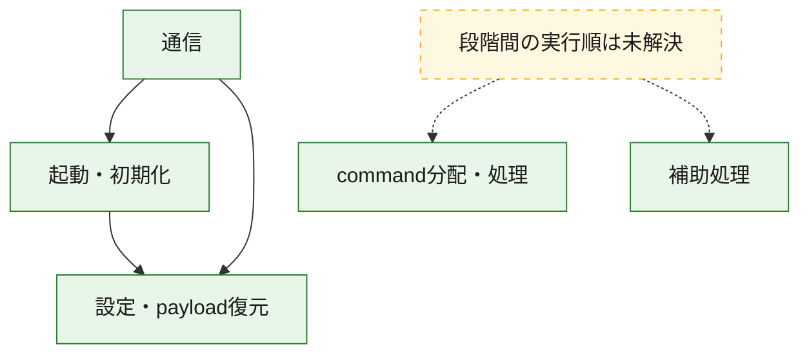
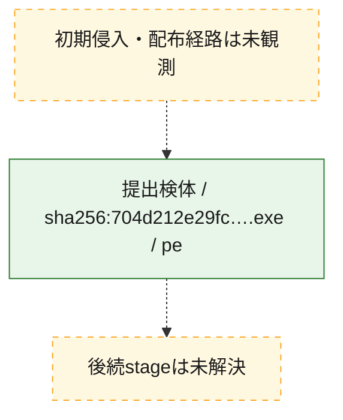
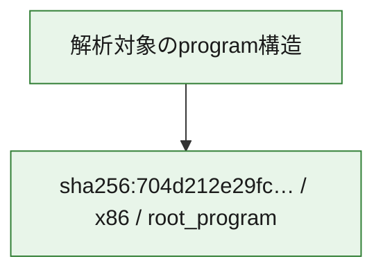

# 全体ロジック：704d212e29fc0e352648faf7997656deff5ce39b9e54c3a9003942266d4bedec

代表関数の静的証跡から、起動・初期化、設定・payload復元、通信、command分配・処理の処理群を確認しました。

## 読み方

- phaseの掲載順は解析上の整理順です。observed_call_edgesがない段階間の実行順を断定しません。
- 図の実線は静的に観測した関係、点線と黄色のノードは未観測・未解決の関係を示します。
- 図は静的な要約であり、動的実行を再現するものではありません。
- 詳細な関数解説とfingerprintは[STATIC-LOGIC.md](STATIC-LOGIC.md)を参照してください。

## 静的可視化

### 実行フロー

### 感染チェーン

### モジュール関係

## 処理段階

### 1. 起動・初期化

entry pointから初期化と後続処理への移行を確認します。
確度: `confirmed_static_function_evidence`

- `704d212e29fc0e352648faf7997656deff5ce39b9e54c3a9003942266d4bedec:ghidra:140009bb7` — 初期化と主要処理への分岐を行う入口関数です。 状態: `succeeded`、選定理由: `entry_point`, `meaningful_symbol_name`, `reviewed_call_centrality:7`, `role:entrypoint`
- `704d212e29fc0e352648faf7997656deff5ce39b9e54c3a9003942266d4bedec:ghidra:140010ed0` — 初期化と主要処理への分岐を行う入口関数です。 状態: `succeeded`、選定理由: `entry_point`, `meaningful_symbol_name`, `probable_go_main_user_code`, `reviewed_call_centrality:23`, `role:entrypoint`

### 2. 設定・payload復元

設定、resource、payload、暗号化データの復元・変換を確認します。
確度: `confirmed_static_function_evidence`

- `704d212e29fc0e352648faf7997656deff5ce39b9e54c3a9003942266d4bedec:ghidra:1400016e1` — 設定、resource、payloadなどの解析・変換を行う関数です。 状態: `succeeded`、選定理由: `meaningful_symbol_name`, `reviewed_call_centrality:1`, `role:config_or_data_transform`
- `704d212e29fc0e352648faf7997656deff5ce39b9e54c3a9003942266d4bedec:ghidra:140001c94` — 設定、resource、payloadなどの解析・変換を行う関数です。 状態: `succeeded`、選定理由: `meaningful_symbol_name`, `reviewed_call_centrality:1`, `role:config_or_data_transform`
- `704d212e29fc0e352648faf7997656deff5ce39b9e54c3a9003942266d4bedec:ghidra:1400022ae` — 暗号、hash、encoding、または復号処理に関係する関数です。 状態: `succeeded`、選定理由: `meaningful_symbol_name`, `reviewed_call_centrality:4`, `role:cryptographic_transform`
- `704d212e29fc0e352648faf7997656deff5ce39b9e54c3a9003942266d4bedec:ghidra:140002ecc` — 暗号、hash、encoding、または復号処理に関係する関数です。 状態: `succeeded`、選定理由: `meaningful_symbol_name`, `reviewed_call_centrality:4`, `role:cryptographic_transform`
- `704d212e29fc0e352648faf7997656deff5ce39b9e54c3a9003942266d4bedec:ghidra:140002fb6` — 暗号、hash、encoding、または復号処理に関係する関数です。 状態: `succeeded`、選定理由: `meaningful_symbol_name`, `reviewed_call_centrality:12`, `role:cryptographic_transform`
- `704d212e29fc0e352648faf7997656deff5ce39b9e54c3a9003942266d4bedec:ghidra:1400031e9` — 設定、resource、payloadなどの解析・変換を行う関数です。 状態: `succeeded`、選定理由: `meaningful_symbol_name`, `reviewed_call_centrality:13`, `role:config_or_data_transform`
- `704d212e29fc0e352648faf7997656deff5ce39b9e54c3a9003942266d4bedec:ghidra:140003c95` — 設定、resource、payloadなどの解析・変換を行う関数です。 状態: `succeeded`、選定理由: `meaningful_symbol_name`, `reviewed_call_centrality:1`, `role:config_or_data_transform`
- `704d212e29fc0e352648faf7997656deff5ce39b9e54c3a9003942266d4bedec:ghidra:140005261` — 設定、resource、payloadなどの解析・変換を行う関数です。 状態: `succeeded`、選定理由: `meaningful_symbol_name`, `reviewed_call_centrality:2`, `role:config_or_data_transform`
- `704d212e29fc0e352648faf7997656deff5ce39b9e54c3a9003942266d4bedec:ghidra:140005dfb` — 暗号、hash、encoding、または復号処理に関係する関数です。 状態: `succeeded`、選定理由: `meaningful_symbol_name`, `reviewed_call_centrality:2`, `role:cryptographic_transform`
- `704d212e29fc0e352648faf7997656deff5ce39b9e54c3a9003942266d4bedec:ghidra:140005f7d` — 設定、resource、payloadなどの解析・変換を行う関数です。 状態: `succeeded`、選定理由: `meaningful_symbol_name`, `reviewed_call_centrality:12`, `role:config_or_data_transform`
- `704d212e29fc0e352648faf7997656deff5ce39b9e54c3a9003942266d4bedec:ghidra:1400064c3` — 設定、resource、payloadなどの解析・変換を行う関数です。 状態: `succeeded`、選定理由: `meaningful_symbol_name`, `reviewed_call_centrality:9`, `role:config_or_data_transform`
- `704d212e29fc0e352648faf7997656deff5ce39b9e54c3a9003942266d4bedec:ghidra:140008307` — 設定、resource、payloadなどの解析・変換を行う関数です。 状態: `succeeded`、選定理由: `meaningful_symbol_name`, `reviewed_call_centrality:1`, `role:config_or_data_transform`
- `704d212e29fc0e352648faf7997656deff5ce39b9e54c3a9003942266d4bedec:ghidra:14000a76a` — 設定、resource、payloadなどの解析・変換を行う関数です。 状態: `succeeded`、選定理由: `meaningful_symbol_name`, `reviewed_call_centrality:7`, `role:config_or_data_transform`

### 3. 通信

通信初期化、endpoint処理、送受信の役割を確認します。
確度: `confirmed_static_function_evidence`

- `704d212e29fc0e352648faf7997656deff5ce39b9e54c3a9003942266d4bedec:ghidra:140005b93` — 通信初期化、送受信、またはendpoint処理に関係する関数です。 状態: `succeeded`、選定理由: `meaningful_symbol_name`, `reviewed_call_centrality:3`, `role:network_communication`
- `704d212e29fc0e352648faf7997656deff5ce39b9e54c3a9003942266d4bedec:ghidra:140006ad1` — 通信初期化、送受信、またはendpoint処理に関係する関数です。 状態: `succeeded`、選定理由: `meaningful_symbol_name`, `reviewed_call_centrality:3`, `role:network_communication`
- `704d212e29fc0e352648faf7997656deff5ce39b9e54c3a9003942266d4bedec:ghidra:140007711` — 通信初期化、送受信、またはendpoint処理に関係する関数です。 状態: `succeeded`、選定理由: `meaningful_symbol_name`, `reviewed_call_centrality:3`, `role:network_communication`
- `704d212e29fc0e352648faf7997656deff5ce39b9e54c3a9003942266d4bedec:ghidra:1400090f9` — 通信初期化、送受信、またはendpoint処理に関係する関数です。 状態: `succeeded`、選定理由: `meaningful_symbol_name`, `reviewed_call_centrality:20`, `role:network_communication`
- `704d212e29fc0e352648faf7997656deff5ce39b9e54c3a9003942266d4bedec:ghidra:140009339` — 通信初期化、送受信、またはendpoint処理に関係する関数です。 状態: `succeeded`、選定理由: `meaningful_symbol_name`, `reviewed_call_centrality:6`, `role:network_communication`
- `704d212e29fc0e352648faf7997656deff5ce39b9e54c3a9003942266d4bedec:ghidra:140009696` — 通信初期化、送受信、またはendpoint処理に関係する関数です。 状態: `succeeded`、選定理由: `meaningful_symbol_name`, `reviewed_call_centrality:3`, `role:network_communication`
- `704d212e29fc0e352648faf7997656deff5ce39b9e54c3a9003942266d4bedec:ghidra:1400096f5` — 通信初期化、送受信、またはendpoint処理に関係する関数です。 状態: `succeeded`、選定理由: `meaningful_symbol_name`, `reviewed_call_centrality:5`, `role:network_communication`
- `704d212e29fc0e352648faf7997656deff5ce39b9e54c3a9003942266d4bedec:ghidra:140009831` — 通信初期化、送受信、またはendpoint処理に関係する関数です。 状態: `succeeded`、選定理由: `meaningful_symbol_name`, `reviewed_call_centrality:10`, `role:network_communication`
- `704d212e29fc0e352648faf7997656deff5ce39b9e54c3a9003942266d4bedec:ghidra:140009fa5` — 通信初期化、送受信、またはendpoint処理に関係する関数です。 状態: `succeeded`、選定理由: `meaningful_symbol_name`, `reviewed_call_centrality:3`, `role:network_communication`
- `704d212e29fc0e352648faf7997656deff5ce39b9e54c3a9003942266d4bedec:ghidra:14000a099` — 通信初期化、送受信、またはendpoint処理に関係する関数です。 状態: `succeeded`、選定理由: `meaningful_symbol_name`, `reviewed_call_centrality:16`, `role:network_communication`
- `704d212e29fc0e352648faf7997656deff5ce39b9e54c3a9003942266d4bedec:ghidra:14000b607` — 通信初期化、送受信、またはendpoint処理に関係する関数です。 状態: `succeeded`、選定理由: `meaningful_symbol_name`, `reviewed_call_centrality:15`, `role:network_communication`
- `704d212e29fc0e352648faf7997656deff5ce39b9e54c3a9003942266d4bedec:ghidra:14000b910` — 通信初期化、送受信、またはendpoint処理に関係する関数です。 状態: `succeeded`、選定理由: `meaningful_symbol_name`, `reviewed_call_centrality:12`, `role:network_communication`

### 4. command分配・処理

受信commandやtaskの解釈、分配、個別handlerへの移行を確認します。
確度: `confirmed_static_function_evidence`

- `704d212e29fc0e352648faf7997656deff5ce39b9e54c3a9003942266d4bedec:ghidra:14000af49` — commandの解釈、分配、または個別処理を担当する関数です。 状態: `succeeded`、選定理由: `meaningful_symbol_name`, `reviewed_call_centrality:5`, `role:command_dispatch_or_handler`
- `704d212e29fc0e352648faf7997656deff5ce39b9e54c3a9003942266d4bedec:ghidra:14000bc5a` — commandの解釈、分配、または個別処理を担当する関数です。 状態: `succeeded`、選定理由: `meaningful_symbol_name`, `reviewed_call_centrality:5`, `role:command_dispatch_or_handler`

### 5. 補助処理

主要処理を支える一般内部関数またはlibrary処理を確認します。
確度: `confirmed_static_function_evidence`

- `704d212e29fc0e352648faf7997656deff5ce39b9e54c3a9003942266d4bedec:ghidra:140001410` — 検体内部の一般処理を実装する関数です。 状態: `succeeded`、選定理由: `entry_point`, `meaningful_symbol_name`, `reviewed_call_centrality:1`
- `704d212e29fc0e352648faf7997656deff5ce39b9e54c3a9003942266d4bedec:ghidra:1400123a0` — compiler生成処理または汎用library処理とみられる関数です。 状態: `succeeded`、選定理由: `entry_point`, `meaningful_symbol_name`, `reviewed_call_centrality:1`
- `704d212e29fc0e352648faf7997656deff5ce39b9e54c3a9003942266d4bedec:ghidra:1400123d0` — compiler生成処理または汎用library処理とみられる関数です。 状態: `succeeded`、選定理由: `entry_point`, `meaningful_symbol_name`, `reviewed_call_centrality:2`

## 観測したcall関係

- `704d212e29fc0e352648faf7997656deff5ce39b9e54c3a9003942266d4bedec:ghidra:140002fb6` → `704d212e29fc0e352648faf7997656deff5ce39b9e54c3a9003942266d4bedec:ghidra:140002ecc` （`configuration` → `configuration`）
- `704d212e29fc0e352648faf7997656deff5ce39b9e54c3a9003942266d4bedec:ghidra:1400031e9` → `704d212e29fc0e352648faf7997656deff5ce39b9e54c3a9003942266d4bedec:ghidra:140002ecc` （`configuration` → `configuration`）
- `704d212e29fc0e352648faf7997656deff5ce39b9e54c3a9003942266d4bedec:ghidra:140005dfb` → `704d212e29fc0e352648faf7997656deff5ce39b9e54c3a9003942266d4bedec:ghidra:1400022ae` （`configuration` → `configuration`）
- `704d212e29fc0e352648faf7997656deff5ce39b9e54c3a9003942266d4bedec:ghidra:1400064c3` → `704d212e29fc0e352648faf7997656deff5ce39b9e54c3a9003942266d4bedec:ghidra:1400031e9` （`configuration` → `configuration`）
- `704d212e29fc0e352648faf7997656deff5ce39b9e54c3a9003942266d4bedec:ghidra:1400064c3` → `704d212e29fc0e352648faf7997656deff5ce39b9e54c3a9003942266d4bedec:ghidra:140005f7d` （`configuration` → `configuration`）
- `704d212e29fc0e352648faf7997656deff5ce39b9e54c3a9003942266d4bedec:ghidra:140006ad1` → `704d212e29fc0e352648faf7997656deff5ce39b9e54c3a9003942266d4bedec:ghidra:140005b93` （`communication` → `communication`）
- `704d212e29fc0e352648faf7997656deff5ce39b9e54c3a9003942266d4bedec:ghidra:140009339` → `704d212e29fc0e352648faf7997656deff5ce39b9e54c3a9003942266d4bedec:ghidra:1400090f9` （`communication` → `communication`）
- `704d212e29fc0e352648faf7997656deff5ce39b9e54c3a9003942266d4bedec:ghidra:140009831` → `704d212e29fc0e352648faf7997656deff5ce39b9e54c3a9003942266d4bedec:ghidra:140002fb6` （`communication` → `configuration`）
- `704d212e29fc0e352648faf7997656deff5ce39b9e54c3a9003942266d4bedec:ghidra:140009831` → `704d212e29fc0e352648faf7997656deff5ce39b9e54c3a9003942266d4bedec:ghidra:140009696` （`communication` → `communication`）
- `704d212e29fc0e352648faf7997656deff5ce39b9e54c3a9003942266d4bedec:ghidra:14000a099` → `704d212e29fc0e352648faf7997656deff5ce39b9e54c3a9003942266d4bedec:ghidra:140009bb7` （`communication` → `startup`）
- `704d212e29fc0e352648faf7997656deff5ce39b9e54c3a9003942266d4bedec:ghidra:14000a099` → `704d212e29fc0e352648faf7997656deff5ce39b9e54c3a9003942266d4bedec:ghidra:140009fa5` （`communication` → `communication`）
- `704d212e29fc0e352648faf7997656deff5ce39b9e54c3a9003942266d4bedec:ghidra:14000b607` → `704d212e29fc0e352648faf7997656deff5ce39b9e54c3a9003942266d4bedec:ghidra:140009339` （`communication` → `communication`）
- `704d212e29fc0e352648faf7997656deff5ce39b9e54c3a9003942266d4bedec:ghidra:14000b607` → `704d212e29fc0e352648faf7997656deff5ce39b9e54c3a9003942266d4bedec:ghidra:1400096f5` （`communication` → `communication`）
- `704d212e29fc0e352648faf7997656deff5ce39b9e54c3a9003942266d4bedec:ghidra:14000b607` → `704d212e29fc0e352648faf7997656deff5ce39b9e54c3a9003942266d4bedec:ghidra:140009831` （`communication` → `communication`）
- `704d212e29fc0e352648faf7997656deff5ce39b9e54c3a9003942266d4bedec:ghidra:14000b607` → `704d212e29fc0e352648faf7997656deff5ce39b9e54c3a9003942266d4bedec:ghidra:14000a099` （`communication` → `communication`）
- `704d212e29fc0e352648faf7997656deff5ce39b9e54c3a9003942266d4bedec:ghidra:14000b910` → `704d212e29fc0e352648faf7997656deff5ce39b9e54c3a9003942266d4bedec:ghidra:14000a099` （`communication` → `communication`）
- `704d212e29fc0e352648faf7997656deff5ce39b9e54c3a9003942266d4bedec:ghidra:14000b910` → `704d212e29fc0e352648faf7997656deff5ce39b9e54c3a9003942266d4bedec:ghidra:14000b607` （`communication` → `communication`）
- `704d212e29fc0e352648faf7997656deff5ce39b9e54c3a9003942266d4bedec:ghidra:140010ed0` → `704d212e29fc0e352648faf7997656deff5ce39b9e54c3a9003942266d4bedec:ghidra:1400064c3` （`startup` → `configuration`）
- `ghidra-function:0641af495f371e7523abee67` → `ghidra-external:2055e1beead7628e5094f66c` （`unclassified` → `unclassified`）
- `ghidra-function:0641af495f371e7523abee67` → `ghidra-function:21dbde67da180f88646510d3` （`unclassified` → `unclassified`）
- `ghidra-function:068854298747b5bc88d5f797` → `ghidra-external:0687dbbf4299bfaeceaababc` （`unclassified` → `unclassified`）
- `ghidra-function:068854298747b5bc88d5f797` → `ghidra-external:1f4b34d595aefb70ab8d85e4` （`unclassified` → `unclassified`）
- `ghidra-function:068854298747b5bc88d5f797` → `ghidra-external:6d63288eaac89a4bf2a6250d` （`unclassified` → `unclassified`）
- `ghidra-function:068854298747b5bc88d5f797` → `ghidra-external:95483458f199278e124f1ae0` （`unclassified` → `unclassified`）
- `ghidra-function:068854298747b5bc88d5f797` → `ghidra-function:49dfd19476694889b5e649cb` （`unclassified` → `unclassified`）
- `ghidra-function:068854298747b5bc88d5f797` → `ghidra-function:74a167c7986d8ec9ce8b8ee9` （`unclassified` → `unclassified`）
- `ghidra-function:07defcf088a710d57c13ceb0` → `ghidra-external:1e7e30e9a7355e81b4d39494` （`unclassified` → `unclassified`）
- `ghidra-function:07defcf088a710d57c13ceb0` → `ghidra-external:87c8cd01b0b21527b079f580` （`unclassified` → `unclassified`）
- `ghidra-function:07defcf088a710d57c13ceb0` → `ghidra-external:e802f7eaadb12c065b9d4588` （`unclassified` → `unclassified`）
- `ghidra-function:07defcf088a710d57c13ceb0` → `ghidra-external:ffd26e9c656b13029ecca59e` （`unclassified` → `unclassified`）
- `ghidra-function:07defcf088a710d57c13ceb0` → `ghidra-function:054973db20d1df5d9c00c4fb` （`unclassified` → `unclassified`）
- `ghidra-function:07defcf088a710d57c13ceb0` → `ghidra-function:1585352732fa1ab28c2f68fe` （`unclassified` → `unclassified`）
- `ghidra-function:07defcf088a710d57c13ceb0` → `ghidra-function:179f52995ff20efa653a7c2a` （`unclassified` → `unclassified`）
- `ghidra-function:07defcf088a710d57c13ceb0` → `ghidra-function:3bdab54d4922882249c62bad` （`unclassified` → `unclassified`）
- `ghidra-function:07defcf088a710d57c13ceb0` → `ghidra-function:40c5a4d84a25564117d1b9cd` （`unclassified` → `unclassified`）
- `ghidra-function:07defcf088a710d57c13ceb0` → `ghidra-function:5ff5874a8ade852a7982d8f9` （`unclassified` → `unclassified`）
- `ghidra-function:07defcf088a710d57c13ceb0` → `ghidra-function:7d954cf79ec33d6d35aed594` （`unclassified` → `unclassified`）
- `ghidra-function:07defcf088a710d57c13ceb0` → `ghidra-function:8cb0b9299b779ff5ee06851e` （`unclassified` → `unclassified`）
- `ghidra-function:07defcf088a710d57c13ceb0` → `ghidra-function:8d775dc7096852034cafd8f3` （`unclassified` → `unclassified`）
- `ghidra-function:07defcf088a710d57c13ceb0` → `ghidra-function:909f60d8ca28022d634b071f` （`unclassified` → `unclassified`）
- `ghidra-function:07defcf088a710d57c13ceb0` → `ghidra-function:9f91c90257df38ed0d28b59c` （`unclassified` → `unclassified`）
- `ghidra-function:07defcf088a710d57c13ceb0` → `ghidra-function:b9efde4895347599638a62fe` （`unclassified` → `unclassified`）
- `ghidra-function:07defcf088a710d57c13ceb0` → `ghidra-function:ba3e7229711a9202520ec542` （`unclassified` → `unclassified`）
- `ghidra-function:07defcf088a710d57c13ceb0` → `ghidra-function:c102a39835c8e7e7b446dfe3` （`unclassified` → `unclassified`）
- `ghidra-function:07defcf088a710d57c13ceb0` → `ghidra-function:df43d03942958d4839d1109e` （`unclassified` → `unclassified`）
- `ghidra-function:07defcf088a710d57c13ceb0` → `ghidra-function:f922af8c25410df5bda3e756` （`unclassified` → `unclassified`）
- `ghidra-function:20d6ca98124d85cef1711ada` → `ghidra-external:e802f7eaadb12c065b9d4588` （`unclassified` → `unclassified`）
- `ghidra-function:20d6ca98124d85cef1711ada` → `ghidra-function:01a39b52d221d465de626c0c` （`unclassified` → `unclassified`）
- `ghidra-function:20d6ca98124d85cef1711ada` → `ghidra-function:10a24f428bf5f09a5f7813a5` （`unclassified` → `unclassified`）
- `ghidra-function:20d6ca98124d85cef1711ada` → `ghidra-function:33f3415201ac3a170922a1de` （`unclassified` → `unclassified`）
- `ghidra-function:31e086688c52b5aa70418a20` → `ghidra-external:02745128b4002bb3bdcc0751` （`unclassified` → `unclassified`）
- `ghidra-function:31e086688c52b5aa70418a20` → `ghidra-external:0687dbbf4299bfaeceaababc` （`unclassified` → `unclassified`）
- `ghidra-function:31e086688c52b5aa70418a20` → `ghidra-external:0a50ee425dec46dfc9c2591f` （`unclassified` → `unclassified`）
- `ghidra-function:31e086688c52b5aa70418a20` → `ghidra-external:3aba09ee95646b964f69a67e` （`unclassified` → `unclassified`）
- `ghidra-function:31e086688c52b5aa70418a20` → `ghidra-external:5026e39f1d5e33fa48df5d68` （`unclassified` → `unclassified`）
- `ghidra-function:31e086688c52b5aa70418a20` → `ghidra-external:548ecd2db724c27b2388f8f2` （`unclassified` → `unclassified`）
- `ghidra-function:31e086688c52b5aa70418a20` → `ghidra-external:9565701672aee028b7549d90` （`unclassified` → `unclassified`）
- `ghidra-function:31e086688c52b5aa70418a20` → `ghidra-external:e802f7eaadb12c065b9d4588` （`unclassified` → `unclassified`）
- `ghidra-function:31e086688c52b5aa70418a20` → `ghidra-function:01a39b52d221d465de626c0c` （`unclassified` → `unclassified`）
- `ghidra-function:31e086688c52b5aa70418a20` → `ghidra-function:068854298747b5bc88d5f797` （`unclassified` → `unclassified`）
- `ghidra-function:31e086688c52b5aa70418a20` → `ghidra-function:576606fd67330bb1eca3afee` （`unclassified` → `unclassified`）
- `ghidra-function:31e086688c52b5aa70418a20` → `ghidra-function:94906aa22607db6b2cb23521` （`unclassified` → `unclassified`）
- `ghidra-function:31e086688c52b5aa70418a20` → `ghidra-function:f060129f938fdeab59e2223a` （`unclassified` → `unclassified`）
- `ghidra-function:33f3415201ac3a170922a1de` → `ghidra-external:1678d4980a0a4f413a89adb6` （`unclassified` → `unclassified`）
- `ghidra-function:33f3415201ac3a170922a1de` → `ghidra-external:16d42a4bf82fe7e36b2bd186` （`unclassified` → `unclassified`）
- `ghidra-function:33f3415201ac3a170922a1de` → `ghidra-external:98d4b176916c73c6c770333b` （`unclassified` → `unclassified`）
- `ghidra-function:33f3415201ac3a170922a1de` → `ghidra-external:a35283c1859ded2c2004c2d6` （`unclassified` → `unclassified`）
- `ghidra-function:33f3415201ac3a170922a1de` → `ghidra-external:e802f7eaadb12c065b9d4588` （`unclassified` → `unclassified`）
- `ghidra-function:33f3415201ac3a170922a1de` → `ghidra-function:0dd745231fd24b7eac2a6f19` （`unclassified` → `unclassified`）
- `ghidra-function:33f3415201ac3a170922a1de` → `ghidra-function:37042b0accc47df80d3775aa` （`unclassified` → `unclassified`）
- `ghidra-function:33f3415201ac3a170922a1de` → `ghidra-function:3bb8db5ca0837804f3a5f23c` （`unclassified` → `unclassified`）
- `ghidra-function:33f3415201ac3a170922a1de` → `ghidra-function:4c7b2385e7ce553e7b165714` （`unclassified` → `unclassified`）
- `ghidra-function:33f3415201ac3a170922a1de` → `ghidra-function:a499440188df79360989faea` （`unclassified` → `unclassified`）
- `ghidra-function:33f3415201ac3a170922a1de` → `ghidra-function:b37d0b82bba7977e8908bd02` （`unclassified` → `unclassified`）
- `ghidra-function:33f3415201ac3a170922a1de` → `ghidra-function:ca4ce4554e6537bbab00823a` （`unclassified` → `unclassified`）
- `ghidra-function:3bdab54d4922882249c62bad` → `ghidra-external:16d42a4bf82fe7e36b2bd186` （`unclassified` → `unclassified`）
- `ghidra-function:3bdab54d4922882249c62bad` → `ghidra-external:3aba09ee95646b964f69a67e` （`unclassified` → `unclassified`）
- `ghidra-function:3bdab54d4922882249c62bad` → `ghidra-external:e802f7eaadb12c065b9d4588` （`unclassified` → `unclassified`）
- `ghidra-function:3bdab54d4922882249c62bad` → `ghidra-function:01a39b52d221d465de626c0c` （`unclassified` → `unclassified`）
- `ghidra-function:3bdab54d4922882249c62bad` → `ghidra-function:10a24f428bf5f09a5f7813a5` （`unclassified` → `unclassified`）
- `ghidra-function:3bdab54d4922882249c62bad` → `ghidra-function:7ece74f4ae80878d8ef36699` （`unclassified` → `unclassified`）
- `ghidra-function:3bdab54d4922882249c62bad` → `ghidra-function:e15433c8a181312105666346` （`unclassified` → `unclassified`）
- `ghidra-function:3c309b96be2d05e6f9a1b1fd` → `ghidra-external:02745128b4002bb3bdcc0751` （`unclassified` → `unclassified`）
- `ghidra-function:3c309b96be2d05e6f9a1b1fd` → `ghidra-external:0687dbbf4299bfaeceaababc` （`unclassified` → `unclassified`）
- `ghidra-function:3c309b96be2d05e6f9a1b1fd` → `ghidra-function:3879b42d90d3f5f6932b617a` （`unclassified` → `unclassified`）
- `ghidra-function:462b27d76955bee3eafa2345` → `ghidra-function:9e311ea89f673618ed9d5b9f` （`unclassified` → `unclassified`）
- `ghidra-function:462b27d76955bee3eafa2345` → `ghidra-function:9fa015e69f0c308da24d7d42` （`unclassified` → `unclassified`）
- `ghidra-function:576606fd67330bb1eca3afee` → `ghidra-external:16d42a4bf82fe7e36b2bd186` （`unclassified` → `unclassified`）
- `ghidra-function:576606fd67330bb1eca3afee` → `ghidra-external:3aba09ee95646b964f69a67e` （`unclassified` → `unclassified`）
- `ghidra-function:5f746dad6022db2b0406c590` → `ghidra-function:83504f72572e3641589726d3` （`unclassified` → `unclassified`）
- `ghidra-function:5f746dad6022db2b0406c590` → `ghidra-function:d90ddaff48cf4284c3353e4d` （`unclassified` → `unclassified`）
- `ghidra-function:6e3c5b11f253f2cc6bd34343` → `ghidra-external:fcfdf66f99f2c8560f29df9d` （`unclassified` → `unclassified`）
- `ghidra-function:7ece74f4ae80878d8ef36699` → `ghidra-external:0687dbbf4299bfaeceaababc` （`unclassified` → `unclassified`）
- `ghidra-function:7ece74f4ae80878d8ef36699` → `ghidra-external:87c8cd01b0b21527b079f580` （`unclassified` → `unclassified`）
- `ghidra-function:7ece74f4ae80878d8ef36699` → `ghidra-external:be5b789f1945c7f6eb4f6bfc` （`unclassified` → `unclassified`）
- `ghidra-function:7ece74f4ae80878d8ef36699` → `ghidra-external:e802f7eaadb12c065b9d4588` （`unclassified` → `unclassified`）
- `ghidra-function:7ece74f4ae80878d8ef36699` → `ghidra-external:ffd26e9c656b13029ecca59e` （`unclassified` → `unclassified`）
- `ghidra-function:7ece74f4ae80878d8ef36699` → `ghidra-function:0a388a568152f79f0cc41acb` （`unclassified` → `unclassified`）
- `ghidra-function:7ece74f4ae80878d8ef36699` → `ghidra-function:2c560c946ccef0f3586e246b` （`unclassified` → `unclassified`）
- `ghidra-function:7ece74f4ae80878d8ef36699` → `ghidra-function:87df4fa121e122ea4665b18d` （`unclassified` → `unclassified`）
- `ghidra-function:7ece74f4ae80878d8ef36699` → `ghidra-function:a0aee389603a652a781ba98c` （`unclassified` → `unclassified`）
- `ghidra-function:7ece74f4ae80878d8ef36699` → `ghidra-function:ad1f23bf7b9631a3e6a11696` （`unclassified` → `unclassified`）
- `ghidra-function:7ece74f4ae80878d8ef36699` → `ghidra-function:c2681aa3afdb27829a7cb031` （`unclassified` → `unclassified`）
- `ghidra-function:8876351e510d727e8eb7ab66` → `ghidra-external:ffd26e9c656b13029ecca59e` （`unclassified` → `unclassified`）
- `ghidra-function:8876351e510d727e8eb7ab66` → `ghidra-function:a62d34220b194cd3c23caeaa` （`unclassified` → `unclassified`）
- `ghidra-function:8876351e510d727e8eb7ab66` → `ghidra-function:f04ef4ef0e871e97b4a1ea6f` （`unclassified` → `unclassified`）
- `ghidra-function:8bbf5043e22a8c48b9af5f0b` → `ghidra-external:3aba09ee95646b964f69a67e` （`unclassified` → `unclassified`）
- `ghidra-function:8bbf5043e22a8c48b9af5f0b` → `ghidra-function:0f968323a2b7fe1459fbe0eb` （`unclassified` → `unclassified`）
- `ghidra-function:8bbf5043e22a8c48b9af5f0b` → `ghidra-function:11300d93737ded2dfcc4fd2a` （`unclassified` → `unclassified`）
- `ghidra-function:8bbf5043e22a8c48b9af5f0b` → `ghidra-function:2c6c82d203ca53377d755ad8` （`unclassified` → `unclassified`）
- `ghidra-function:8bbf5043e22a8c48b9af5f0b` → `ghidra-function:75d56e514cb3218c24f0e1ca` （`unclassified` → `unclassified`）
- `ghidra-function:8bbf5043e22a8c48b9af5f0b` → `ghidra-function:b9efde4895347599638a62fe` （`unclassified` → `unclassified`）
- `ghidra-function:8bbf5043e22a8c48b9af5f0b` → `ghidra-function:c111296119a3a47ad4389f78` （`unclassified` → `unclassified`）
- `ghidra-function:8bbf5043e22a8c48b9af5f0b` → `ghidra-function:f4f1f131dc0fc2b7e30c25fb` （`unclassified` → `unclassified`）
- `ghidra-function:8bbf5043e22a8c48b9af5f0b` → `ghidra-function:fb6981f201a3564c822d0436` （`unclassified` → `unclassified`）
- `ghidra-function:8dd0b35ad3fa761ab3a17f9c` → `ghidra-function:3f2d8f81c5f8a17f2c380e0d` （`unclassified` → `unclassified`）
- `ghidra-function:92aa4d8337df360386e90a1e` → `ghidra-function:e9723db33e4376e1185c5ae4` （`unclassified` → `unclassified`）
- `ghidra-function:a09fecf3b4bfafbff8471877` → `ghidra-function:28bbcfc619b5bd2ebc4acc3a` （`unclassified` → `unclassified`）
- `ghidra-function:a62d34220b194cd3c23caeaa` → `ghidra-function:de629797aed2cac2d48fcd2c` （`unclassified` → `unclassified`）
- `ghidra-function:a62d34220b194cd3c23caeaa` → `ghidra-function:ea2b093fbc52b32e4ccb94c4` （`unclassified` → `unclassified`）
- `ghidra-function:ae86f9138471b98b0a2ba596` → `ghidra-external:0687dbbf4299bfaeceaababc` （`unclassified` → `unclassified`）
- `ghidra-function:ae86f9138471b98b0a2ba596` → `ghidra-external:be5b789f1945c7f6eb4f6bfc` （`unclassified` → `unclassified`）
- `ghidra-function:ae86f9138471b98b0a2ba596` → `ghidra-function:0a388a568152f79f0cc41acb` （`unclassified` → `unclassified`）
- `ghidra-function:ae86f9138471b98b0a2ba596` → `ghidra-function:2c560c946ccef0f3586e246b` （`unclassified` → `unclassified`）
- `ghidra-function:ae86f9138471b98b0a2ba596` → `ghidra-function:ad1f23bf7b9631a3e6a11696` （`unclassified` → `unclassified`）
- `ghidra-function:b94f9b6464351a87cb901ec5` → `ghidra-external:3aba09ee95646b964f69a67e` （`unclassified` → `unclassified`）
- `ghidra-function:b94f9b6464351a87cb901ec5` → `ghidra-function:11300d93737ded2dfcc4fd2a` （`unclassified` → `unclassified`）
- `ghidra-function:b94f9b6464351a87cb901ec5` → `ghidra-function:20d6ca98124d85cef1711ada` （`unclassified` → `unclassified`）
- `ghidra-function:b94f9b6464351a87cb901ec5` → `ghidra-function:2c6c82d203ca53377d755ad8` （`unclassified` → `unclassified`）
- `ghidra-function:b94f9b6464351a87cb901ec5` → `ghidra-function:31e086688c52b5aa70418a20` （`unclassified` → `unclassified`）
- `ghidra-function:b94f9b6464351a87cb901ec5` → `ghidra-function:64e84a823c68ffd005fc36f5` （`unclassified` → `unclassified`）
- `ghidra-function:b94f9b6464351a87cb901ec5` → `ghidra-function:7f79883e4ecf971aa29d136b` （`unclassified` → `unclassified`）
- `ghidra-function:b94f9b6464351a87cb901ec5` → `ghidra-function:8bbf5043e22a8c48b9af5f0b` （`unclassified` → `unclassified`）
- `ghidra-function:b94f9b6464351a87cb901ec5` → `ghidra-function:a499440188df79360989faea` （`unclassified` → `unclassified`）
- `ghidra-function:b94f9b6464351a87cb901ec5` → `ghidra-function:b6ba33d44066464db5eaf92d` （`unclassified` → `unclassified`）
- `ghidra-function:b94f9b6464351a87cb901ec5` → `ghidra-function:b9efde4895347599638a62fe` （`unclassified` → `unclassified`）
- `ghidra-function:b94f9b6464351a87cb901ec5` → `ghidra-function:df46658b7f0c3dd0781d44f4` （`unclassified` → `unclassified`）
- `ghidra-function:b94f9b6464351a87cb901ec5` → `ghidra-function:f4f1f131dc0fc2b7e30c25fb` （`unclassified` → `unclassified`）
- `ghidra-function:c111296119a3a47ad4389f78` → `ghidra-external:9404f09616c040cd86fb506e` （`unclassified` → `unclassified`）
- `ghidra-function:c111296119a3a47ad4389f78` → `ghidra-function:febdbe4232349cb4460c50f5` （`unclassified` → `unclassified`）
- `ghidra-function:c2bd9078b356c853d8abe632` → `ghidra-external:0687dbbf4299bfaeceaababc` （`unclassified` → `unclassified`）
- `ghidra-function:c2bd9078b356c853d8abe632` → `ghidra-external:149b76890472c9214976dc2e` （`unclassified` → `unclassified`）
- `ghidra-function:c2bd9078b356c853d8abe632` → `ghidra-external:1678d4980a0a4f413a89adb6` （`unclassified` → `unclassified`）
- `ghidra-function:c2bd9078b356c853d8abe632` → `ghidra-external:7d16a6a9b303100fe5c4c95f` （`unclassified` → `unclassified`）
- `ghidra-function:c2bd9078b356c853d8abe632` → `ghidra-external:a35283c1859ded2c2004c2d6` （`unclassified` → `unclassified`）
- `ghidra-function:c2bd9078b356c853d8abe632` → `ghidra-external:e802f7eaadb12c065b9d4588` （`unclassified` → `unclassified`）
- `ghidra-function:c2bd9078b356c853d8abe632` → `ghidra-external:fcfdf66f99f2c8560f29df9d` （`unclassified` → `unclassified`）
- `ghidra-function:c8174188942e8e4ed7a55e9e` → `ghidra-external:0687dbbf4299bfaeceaababc` （`unclassified` → `unclassified`）
- `ghidra-function:c8174188942e8e4ed7a55e9e` → `ghidra-external:95483458f199278e124f1ae0` （`unclassified` → `unclassified`）
- `ghidra-function:d01c5a69710cb69995e94661` → `ghidra-function:49756135ad27b50b5748cfc5` （`unclassified` → `unclassified`）
- `ghidra-function:d90ddaff48cf4284c3353e4d` → `ghidra-function:9232515d78a0713eb211bcc9` （`unclassified` → `unclassified`）
- `ghidra-function:d90ddaff48cf4284c3353e4d` → `ghidra-function:f6701a2806f34ab0679f10a7` （`unclassified` → `unclassified`）
- `ghidra-function:d90ddaff48cf4284c3353e4d` → `ghidra-function:f8a30b0c499e24b6325560a3` （`unclassified` → `unclassified`）
- `ghidra-function:dee5d7c02ae30ede2bdd73af` → `ghidra-function:21dbde67da180f88646510d3` （`unclassified` → `unclassified`）
- `ghidra-function:df46658b7f0c3dd0781d44f4` → `ghidra-external:02745128b4002bb3bdcc0751` （`unclassified` → `unclassified`）
- `ghidra-function:df46658b7f0c3dd0781d44f4` → `ghidra-external:318bf019bc537c7813033a9a` （`unclassified` → `unclassified`）
- `ghidra-function:df46658b7f0c3dd0781d44f4` → `ghidra-external:3aba09ee95646b964f69a67e` （`unclassified` → `unclassified`）
- `ghidra-function:df46658b7f0c3dd0781d44f4` → `ghidra-function:c2d836253b982cf5eaea2a5d` （`unclassified` → `unclassified`）
- `ghidra-function:e15433c8a181312105666346` → `ghidra-external:02745128b4002bb3bdcc0751` （`unclassified` → `unclassified`）
- `ghidra-function:e15433c8a181312105666346` → `ghidra-external:0687dbbf4299bfaeceaababc` （`unclassified` → `unclassified`）
- `ghidra-function:e15433c8a181312105666346` → `ghidra-external:074be76f7da27529667e12dc` （`unclassified` → `unclassified`）
- `ghidra-function:e15433c8a181312105666346` → `ghidra-external:3283e0ca9705343cfbf7fe6f` （`unclassified` → `unclassified`）
- `ghidra-function:e15433c8a181312105666346` → `ghidra-external:59fd3ca3b9d710f5291188c8` （`unclassified` → `unclassified`）
- `ghidra-function:e15433c8a181312105666346` → `ghidra-external:a8a556c3a91e566cdeb0bd7c` （`unclassified` → `unclassified`）
- `ghidra-function:e15433c8a181312105666346` → `ghidra-external:ffe8426ebea760589f50bd47` （`unclassified` → `unclassified`）
- `ghidra-function:e15433c8a181312105666346` → `ghidra-function:462b27d76955bee3eafa2345` （`unclassified` → `unclassified`）
- `ghidra-function:e15433c8a181312105666346` → `ghidra-function:9e311ea89f673618ed9d5b9f` （`unclassified` → `unclassified`）
- `ghidra-function:e15433c8a181312105666346` → `ghidra-function:9fa015e69f0c308da24d7d42` （`unclassified` → `unclassified`）
- `ghidra-function:e15433c8a181312105666346` → `ghidra-function:b526caade730cb5872e73326` （`unclassified` → `unclassified`）
- `ghidra-function:e15433c8a181312105666346` → `ghidra-function:d9d4db6659bcc300ef7cdd4a` （`unclassified` → `unclassified`）
- `ghidra-function:eda0b76ffe8ca05e4e978cbf` → `ghidra-external:0687dbbf4299bfaeceaababc` （`unclassified` → `unclassified`）
- `ghidra-function:eda0b76ffe8ca05e4e978cbf` → `ghidra-external:be5b789f1945c7f6eb4f6bfc` （`unclassified` → `unclassified`）
- `ghidra-function:eda0b76ffe8ca05e4e978cbf` → `ghidra-function:0a388a568152f79f0cc41acb` （`unclassified` → `unclassified`）
- `ghidra-function:eda0b76ffe8ca05e4e978cbf` → `ghidra-function:87df4fa121e122ea4665b18d` （`unclassified` → `unclassified`）
- `ghidra-function:eda0b76ffe8ca05e4e978cbf` → `ghidra-function:ad1f23bf7b9631a3e6a11696` （`unclassified` → `unclassified`）
- `ghidra-function:f08c4c38f92261d41c9f30c9` → `ghidra-function:11300d93737ded2dfcc4fd2a` （`unclassified` → `unclassified`）
- `ghidra-function:f08c4c38f92261d41c9f30c9` → `ghidra-function:23fc0b3dfe2b1c2cd0bf5213` （`unclassified` → `unclassified`）
- `ghidra-function:f08c4c38f92261d41c9f30c9` → `ghidra-function:2c6c82d203ca53377d755ad8` （`unclassified` → `unclassified`）
- `ghidra-function:f08c4c38f92261d41c9f30c9` → `ghidra-function:31e086688c52b5aa70418a20` （`unclassified` → `unclassified`）
- `ghidra-function:f08c4c38f92261d41c9f30c9` → `ghidra-function:52c4ece958757e7a822c2c9c` （`unclassified` → `unclassified`）
- `ghidra-function:f08c4c38f92261d41c9f30c9` → `ghidra-function:8e28a91343a340926961c7a4` （`unclassified` → `unclassified`）
- `ghidra-function:f08c4c38f92261d41c9f30c9` → `ghidra-function:90b2dce51ddf012904aeeb22` （`unclassified` → `unclassified`）
- `ghidra-function:f08c4c38f92261d41c9f30c9` → `ghidra-function:a5ff1cf8d84b8e058ff922e4` （`unclassified` → `unclassified`）
- `ghidra-function:f08c4c38f92261d41c9f30c9` → `ghidra-function:b6ba33d44066464db5eaf92d` （`unclassified` → `unclassified`）
- `ghidra-function:f08c4c38f92261d41c9f30c9` → `ghidra-function:b94f9b6464351a87cb901ec5` （`unclassified` → `unclassified`）
- `ghidra-function:f08c4c38f92261d41c9f30c9` → `ghidra-function:b9efde4895347599638a62fe` （`unclassified` → `unclassified`）
- `ghidra-function:f08c4c38f92261d41c9f30c9` → `ghidra-function:f4f1f131dc0fc2b7e30c25fb` （`unclassified` → `unclassified`）
- `ghidra-function:fb6981f201a3564c822d0436` → `ghidra-external:02745128b4002bb3bdcc0751` （`unclassified` → `unclassified`）
- `ghidra-function:fb6981f201a3564c822d0436` → `ghidra-external:3283e0ca9705343cfbf7fe6f` （`unclassified` → `unclassified`）
- `ghidra-function:fb6981f201a3564c822d0436` → `ghidra-external:59fd3ca3b9d710f5291188c8` （`unclassified` → `unclassified`）
- `ghidra-function:fb6981f201a3564c822d0436` → `ghidra-external:a8a556c3a91e566cdeb0bd7c` （`unclassified` → `unclassified`）
- `ghidra-function:fb6981f201a3564c822d0436` → `ghidra-external:ffe8426ebea760589f50bd47` （`unclassified` → `unclassified`）
- `ghidra-function:fb6981f201a3564c822d0436` → `ghidra-function:462b27d76955bee3eafa2345` （`unclassified` → `unclassified`）
- `ghidra-function:fb6981f201a3564c822d0436` → `ghidra-function:9e311ea89f673618ed9d5b9f` （`unclassified` → `unclassified`）
- `ghidra-function:fb6981f201a3564c822d0436` → `ghidra-function:9f91c90257df38ed0d28b59c` （`unclassified` → `unclassified`）
- `ghidra-function:fb6981f201a3564c822d0436` → `ghidra-function:9fa015e69f0c308da24d7d42` （`unclassified` → `unclassified`）
- `ghidra-function:fb6981f201a3564c822d0436` → `ghidra-function:b526caade730cb5872e73326` （`unclassified` → `unclassified`）
- `ghidra-function:fb6981f201a3564c822d0436` → `ghidra-function:d9d4db6659bcc300ef7cdd4a` （`unclassified` → `unclassified`）

## 解析範囲と制約

- 選定外関数は全体inventoryへ残しますが、関数本体の個別解説対象にはしていません。
- indirect call、難読化、packer、VM、壊れたcontrol flowによりcall関係が欠落する場合があります。
- 文書は静的解析に基づき、検体実行や外部通信による動的確認は行っていません。
