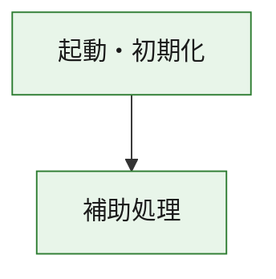
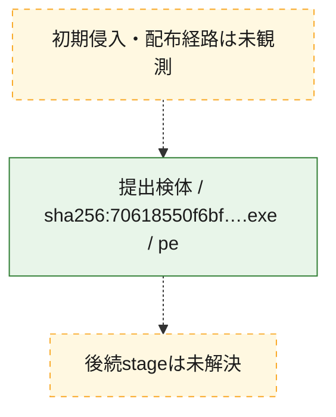
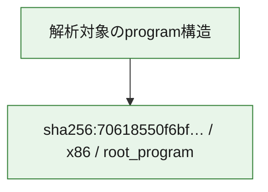

# 全体ロジック：70618550f6bffc42399f2e29129410d04a247e24e50783c7098f61d57b9c9a5e

代表関数の静的証跡から、起動・初期化の処理群を確認しました。

## 読み方

- phaseの掲載順は解析上の整理順です。observed_call_edgesがない段階間の実行順を断定しません。
- 図の実線は静的に観測した関係、点線と黄色のノードは未観測・未解決の関係を示します。
- 図は静的な要約であり、動的実行を再現するものではありません。
- 詳細な関数解説とfingerprintは[STATIC-LOGIC.md](STATIC-LOGIC.md)を参照してください。

## 静的可視化

### 実行フロー

### 感染チェーン

### モジュール関係

## 処理段階

### 1. 起動・初期化

entry pointから初期化と後続処理への移行を確認します。
確度: `confirmed_static_function_evidence`

- `70618550f6bffc42399f2e29129410d04a247e24e50783c7098f61d57b9c9a5e:ghidra:180001010` — 初期化と主要処理への分岐を行う入口関数です。 状態: `succeeded`、選定理由: `entry_point`, `meaningful_symbol_name`, `reviewed_call_centrality:22`, `role:entrypoint`, `small_program_complete_context`

### 2. 補助処理

主要処理を支える一般内部関数またはlibrary処理を確認します。
確度: `confirmed_static_function_evidence`

- `70618550f6bffc42399f2e29129410d04a247e24e50783c7098f61d57b9c9a5e:ghidra:180001240` — 検体内部の一般処理を実装する関数です。 状態: `succeeded`、選定理由: `context_representative`, `reviewed_call_centrality:2`, `small_program_complete_context`
- `70618550f6bffc42399f2e29129410d04a247e24e50783c7098f61d57b9c9a5e:ghidra:180001350` — 検体内部の一般処理を実装する関数です。 状態: `succeeded`、選定理由: `context_representative`, `reviewed_call_centrality:25`, `small_program_complete_context`
- `70618550f6bffc42399f2e29129410d04a247e24e50783c7098f61d57b9c9a5e:ghidra:180003780` — 検体内部の一般処理を実装する関数です。 状態: `succeeded`、選定理由: `context_representative`, `reviewed_call_centrality:2`, `small_program_complete_context`
- `70618550f6bffc42399f2e29129410d04a247e24e50783c7098f61d57b9c9a5e:ghidra:1800038e0` — 検体内部の一般処理を実装する関数です。 状態: `succeeded`、選定理由: `context_representative`, `reviewed_call_centrality:2`, `small_program_complete_context`

## 観測したcall関係

- `70618550f6bffc42399f2e29129410d04a247e24e50783c7098f61d57b9c9a5e:ghidra:180001010` → `70618550f6bffc42399f2e29129410d04a247e24e50783c7098f61d57b9c9a5e:ghidra:180001240` （`startup` → `support`）
- `70618550f6bffc42399f2e29129410d04a247e24e50783c7098f61d57b9c9a5e:ghidra:180001010` → `70618550f6bffc42399f2e29129410d04a247e24e50783c7098f61d57b9c9a5e:ghidra:180001350` （`startup` → `support`）
- `70618550f6bffc42399f2e29129410d04a247e24e50783c7098f61d57b9c9a5e:ghidra:180001350` → `70618550f6bffc42399f2e29129410d04a247e24e50783c7098f61d57b9c9a5e:ghidra:180001240` （`support` → `support`）
- `70618550f6bffc42399f2e29129410d04a247e24e50783c7098f61d57b9c9a5e:ghidra:180001350` → `70618550f6bffc42399f2e29129410d04a247e24e50783c7098f61d57b9c9a5e:ghidra:180003780` （`support` → `support`）
- `70618550f6bffc42399f2e29129410d04a247e24e50783c7098f61d57b9c9a5e:ghidra:180001350` → `70618550f6bffc42399f2e29129410d04a247e24e50783c7098f61d57b9c9a5e:ghidra:1800038e0` （`support` → `support`）
- `70618550f6bffc42399f2e29129410d04a247e24e50783c7098f61d57b9c9a5e:ghidra:180003780` → `70618550f6bffc42399f2e29129410d04a247e24e50783c7098f61d57b9c9a5e:ghidra:1800038e0` （`support` → `support`）
- `ghidra-function:54a993a84d18dd6d2b57eb4b` → `ghidra-function:07010c9a8477e841fad242b7` （`unclassified` → `unclassified`）
- `ghidra-function:54a993a84d18dd6d2b57eb4b` → `ghidra-function:221a8549eff9a19fced6df96` （`unclassified` → `unclassified`）
- `ghidra-function:54a993a84d18dd6d2b57eb4b` → `ghidra-function:3fd816a3550921145fb003fb` （`unclassified` → `unclassified`）
- `ghidra-function:54a993a84d18dd6d2b57eb4b` → `ghidra-function:439aff97ce2abdc55bf2a9da` （`unclassified` → `unclassified`）
- `ghidra-function:54a993a84d18dd6d2b57eb4b` → `ghidra-function:46475f0e1ae844bcfa7bf496` （`unclassified` → `unclassified`）
- `ghidra-function:54a993a84d18dd6d2b57eb4b` → `ghidra-function:48d34039c73924258a79cc9d` （`unclassified` → `unclassified`）
- `ghidra-function:54a993a84d18dd6d2b57eb4b` → `ghidra-function:8183013a2d54370e66d8eae3` （`unclassified` → `unclassified`）
- `ghidra-function:54a993a84d18dd6d2b57eb4b` → `ghidra-function:973b99dda62a05e3b4adeca6` （`unclassified` → `unclassified`）
- `ghidra-function:54a993a84d18dd6d2b57eb4b` → `ghidra-function:9d012588e00b6a5f00f3e82f` （`unclassified` → `unclassified`）
- `ghidra-function:54a993a84d18dd6d2b57eb4b` → `ghidra-function:ee56d00c62eafeafdc46d6e3` （`unclassified` → `unclassified`）
- `ghidra-function:54a993a84d18dd6d2b57eb4b` → `ghidra-function:f065eab4815182f4792c3395` （`unclassified` → `unclassified`）
- `ghidra-function:54a993a84d18dd6d2b57eb4b` → `ghidra-function:fac46d540397d1fef4b7a3f3` （`unclassified` → `unclassified`）
- `ghidra-function:cad8471efffc9a7bb041ab26` → `ghidra-function:f55cfa911c7c90e6ee010622` （`unclassified` → `unclassified`）
- `ghidra-function:f065eab4815182f4792c3395` → `ghidra-external:060008d5273e6d9a38238d51` （`unclassified` → `unclassified`）
- `ghidra-function:f065eab4815182f4792c3395` → `ghidra-external:076f5e6b0e04c3c476e8705d` （`unclassified` → `unclassified`）
- `ghidra-function:f065eab4815182f4792c3395` → `ghidra-external:0ad008ef2596b554a5928200` （`unclassified` → `unclassified`）
- `ghidra-function:f065eab4815182f4792c3395` → `ghidra-external:13d6d1240532d2d33e3ae77e` （`unclassified` → `unclassified`）
- `ghidra-function:f065eab4815182f4792c3395` → `ghidra-external:20eef65a7281bf990bebc243` （`unclassified` → `unclassified`）
- `ghidra-function:f065eab4815182f4792c3395` → `ghidra-external:3521f7393983a2dea49348a2` （`unclassified` → `unclassified`）
- `ghidra-function:f065eab4815182f4792c3395` → `ghidra-external:3d7271ffeee21748c794c71c` （`unclassified` → `unclassified`）
- `ghidra-function:f065eab4815182f4792c3395` → `ghidra-external:41fc0f7a84000b147f638a50` （`unclassified` → `unclassified`）
- `ghidra-function:f065eab4815182f4792c3395` → `ghidra-external:4c21602375fcdbd3df0fce16` （`unclassified` → `unclassified`）
- `ghidra-function:f065eab4815182f4792c3395` → `ghidra-external:53e4b5ba41981dd61e4f2037` （`unclassified` → `unclassified`）
- `ghidra-function:f065eab4815182f4792c3395` → `ghidra-external:59e4b9fd83c372365d211d18` （`unclassified` → `unclassified`）
- `ghidra-function:f065eab4815182f4792c3395` → `ghidra-external:5ac10a7bbe7c081e958f07a7` （`unclassified` → `unclassified`）
- `ghidra-function:f065eab4815182f4792c3395` → `ghidra-external:5e9a78969aba93711bacfe4b` （`unclassified` → `unclassified`）
- `ghidra-function:f065eab4815182f4792c3395` → `ghidra-external:85b6866e5db063bf7db918fb` （`unclassified` → `unclassified`）
- `ghidra-function:f065eab4815182f4792c3395` → `ghidra-external:8b09b99cc2ad96fadd13a539` （`unclassified` → `unclassified`）
- `ghidra-function:f065eab4815182f4792c3395` → `ghidra-external:974c1717590ef3e78553cd07` （`unclassified` → `unclassified`）
- `ghidra-function:f065eab4815182f4792c3395` → `ghidra-external:a0e6b2e530e34e6c71a88eb9` （`unclassified` → `unclassified`）
- `ghidra-function:f065eab4815182f4792c3395` → `ghidra-external:b59890572911fbd47bbb70a4` （`unclassified` → `unclassified`）
- `ghidra-function:f065eab4815182f4792c3395` → `ghidra-external:dd127a617360263abe2ab452` （`unclassified` → `unclassified`）
- `ghidra-function:f065eab4815182f4792c3395` → `ghidra-external:e1d3d9c76fae113f3cda7456` （`unclassified` → `unclassified`）
- `ghidra-function:f065eab4815182f4792c3395` → `ghidra-external:f827c394c415fcae28306407` （`unclassified` → `unclassified`）
- `ghidra-function:f065eab4815182f4792c3395` → `ghidra-function:46475f0e1ae844bcfa7bf496` （`unclassified` → `unclassified`）
- `ghidra-function:f065eab4815182f4792c3395` → `ghidra-function:cad8471efffc9a7bb041ab26` （`unclassified` → `unclassified`）
- `ghidra-function:f065eab4815182f4792c3395` → `ghidra-function:f55cfa911c7c90e6ee010622` （`unclassified` → `unclassified`）

## 解析範囲と制約

- 選定外関数は全体inventoryへ残しますが、関数本体の個別解説対象にはしていません。
- indirect call、難読化、packer、VM、壊れたcontrol flowによりcall関係が欠落する場合があります。
- 文書は静的解析に基づき、検体実行や外部通信による動的確認は行っていません。
