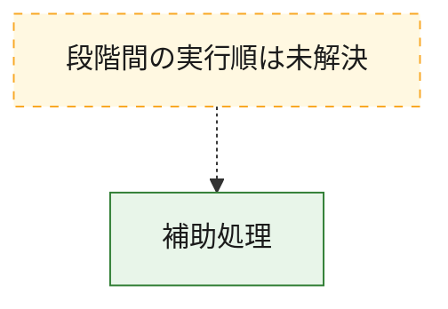
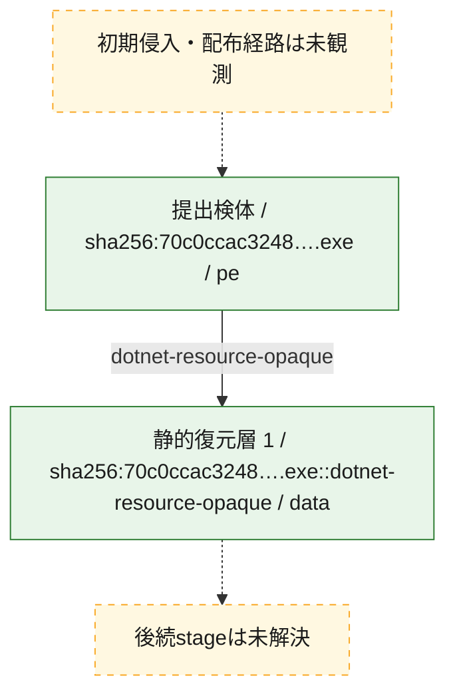
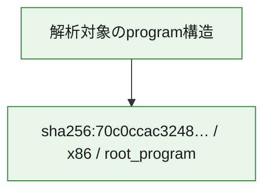

# 全体ロジック：70c0ccac3248ade2286752d2ca5e709bf14df458ce37171dea4392e5fc6c0535

代表関数から主要なmalware処理段階を自動分類できませんでした。

## 読み方

- phaseの掲載順は解析上の整理順です。observed_call_edgesがない段階間の実行順を断定しません。
- 図の実線は静的に観測した関係、点線と黄色のノードは未観測・未解決の関係を示します。
- 図は静的な要約であり、動的実行を再現するものではありません。
- 詳細な関数解説とfingerprintは[STATIC-LOGIC.md](STATIC-LOGIC.md)を参照してください。

## 静的可視化

### 実行フロー

### 感染チェーン

### モジュール関係

## 処理段階

### 1. 補助処理

主要処理を支える一般内部関数またはlibrary処理を確認します。
確度: `confirmed_static_function_evidence`

- `70c0ccac3248ade2286752d2ca5e709bf14df458ce37171dea4392e5fc6c0535:cil:0x0600000e` — 検体内部の一般処理を実装する関数です。 状態: `succeeded`、選定理由: `large_function:instructions=164`, `reviewed_call_centrality:28`
- `70c0ccac3248ade2286752d2ca5e709bf14df458ce37171dea4392e5fc6c0535:cil:0x06000069` — compiler生成処理または汎用library処理とみられる関数です。 状態: `succeeded`、選定理由: `reviewed_call_centrality:22`
- `70c0ccac3248ade2286752d2ca5e709bf14df458ce37171dea4392e5fc6c0535:cil:0x06000079` — 検体内部の一般処理を実装する関数です。 状態: `succeeded`、選定理由: `large_function:instructions=1118`, `reviewed_call_centrality:70`
- `70c0ccac3248ade2286752d2ca5e709bf14df458ce37171dea4392e5fc6c0535:cil:0x0600007d` — 検体内部の一般処理を実装する関数です。 状態: `succeeded`、選定理由: `large_function:instructions=101`, `reviewed_call_centrality:36`
- `70c0ccac3248ade2286752d2ca5e709bf14df458ce37171dea4392e5fc6c0535:cil:0x06000081` — 検体内部の一般処理を実装する関数です。 状態: `succeeded`、選定理由: `large_function:instructions=113`, `reviewed_call_centrality:36`
- `70c0ccac3248ade2286752d2ca5e709bf14df458ce37171dea4392e5fc6c0535:cil:0x06000082` — 検体内部の一般処理を実装する関数です。 状態: `succeeded`、選定理由: `large_function:instructions=247`, `reviewed_call_centrality:40`
- `70c0ccac3248ade2286752d2ca5e709bf14df458ce37171dea4392e5fc6c0535:cil:0x06000089` — 検体内部の一般処理を実装する関数です。 状態: `succeeded`、選定理由: `large_function:instructions=229`, `reviewed_call_centrality:34`
- `70c0ccac3248ade2286752d2ca5e709bf14df458ce37171dea4392e5fc6c0535:cil:0x0600008c` — 検体内部の一般処理を実装する関数です。 状態: `succeeded`、選定理由: `large_function:instructions=6322`, `reviewed_call_centrality:512`
- `70c0ccac3248ade2286752d2ca5e709bf14df458ce37171dea4392e5fc6c0535:cil:0x0600012f` — 検体内部の一般処理を実装する関数です。 状態: `succeeded`、選定理由: `large_function:instructions=148`, `reviewed_call_centrality:30`
- `70c0ccac3248ade2286752d2ca5e709bf14df458ce37171dea4392e5fc6c0535:cil:0x06000131` — 検体内部の一般処理を実装する関数です。 状態: `succeeded`、選定理由: `large_function:instructions=542`, `reviewed_call_centrality:92`
- `70c0ccac3248ade2286752d2ca5e709bf14df458ce37171dea4392e5fc6c0535:cil:0x06000135` — 検体内部の一般処理を実装する関数です。 状態: `succeeded`、選定理由: `large_function:instructions=4661`, `reviewed_call_centrality:416`
- `70c0ccac3248ade2286752d2ca5e709bf14df458ce37171dea4392e5fc6c0535:cil:0x060001ad` — 検体内部の一般処理を実装する関数です。 状態: `succeeded`、選定理由: `large_function:instructions=285`, `reviewed_call_centrality:26`
- `70c0ccac3248ade2286752d2ca5e709bf14df458ce37171dea4392e5fc6c0535:cil:0x060001af` — 検体内部の一般処理を実装する関数です。 状態: `succeeded`、選定理由: `large_function:instructions=199`, `reviewed_call_centrality:38`
- `70c0ccac3248ade2286752d2ca5e709bf14df458ce37171dea4392e5fc6c0535:cil:0x060001b1` — 検体内部の一般処理を実装する関数です。 状態: `succeeded`、選定理由: `large_function:instructions=114`, `reviewed_call_centrality:38`
- `70c0ccac3248ade2286752d2ca5e709bf14df458ce37171dea4392e5fc6c0535:cil:0x060001bd` — 検体内部の一般処理を実装する関数です。 状態: `succeeded`、選定理由: `large_function:instructions=210`, `reviewed_call_centrality:44`
- `70c0ccac3248ade2286752d2ca5e709bf14df458ce37171dea4392e5fc6c0535:cil:0x060001be` — 検体内部の一般処理を実装する関数です。 状態: `succeeded`、選定理由: `large_function:instructions=183`, `reviewed_call_centrality:46`
- `70c0ccac3248ade2286752d2ca5e709bf14df458ce37171dea4392e5fc6c0535:cil:0x060001c1` — 検体内部の一般処理を実装する関数です。 状態: `succeeded`、選定理由: `large_function:instructions=194`, `reviewed_call_centrality:54`
- `70c0ccac3248ade2286752d2ca5e709bf14df458ce37171dea4392e5fc6c0535:cil:0x060001c4` — 検体内部の一般処理を実装する関数です。 状態: `succeeded`、選定理由: `large_function:instructions=762`, `reviewed_call_centrality:88`
- `70c0ccac3248ade2286752d2ca5e709bf14df458ce37171dea4392e5fc6c0535:cil:0x060001c6` — 検体内部の一般処理を実装する関数です。 状態: `succeeded`、選定理由: `large_function:instructions=215`, `reviewed_call_centrality:38`
- `70c0ccac3248ade2286752d2ca5e709bf14df458ce37171dea4392e5fc6c0535:cil:0x060001c8` — 検体内部の一般処理を実装する関数です。 状態: `succeeded`、選定理由: `large_function:instructions=235`, `reviewed_call_centrality:52`
- `70c0ccac3248ade2286752d2ca5e709bf14df458ce37171dea4392e5fc6c0535:cil:0x060001cd` — 検体内部の一般処理を実装する関数です。 状態: `succeeded`、選定理由: `large_function:instructions=275`, `reviewed_call_centrality:34`
- `70c0ccac3248ade2286752d2ca5e709bf14df458ce37171dea4392e5fc6c0535:cil:0x06000201` — 検体内部の一般処理を実装する関数です。 状態: `succeeded`、選定理由: `large_function:instructions=298`, `reviewed_call_centrality:48`
- `70c0ccac3248ade2286752d2ca5e709bf14df458ce37171dea4392e5fc6c0535:cil:0x06000217` — 検体内部の一般処理を実装する関数です。 状態: `succeeded`、選定理由: `large_function:instructions=4037`, `reviewed_call_centrality:406`
- `70c0ccac3248ade2286752d2ca5e709bf14df458ce37171dea4392e5fc6c0535:cil:0x06000288` — 検体内部の一般処理を実装する関数です。 状態: `succeeded`、選定理由: `large_function:instructions=99`, `reviewed_call_centrality:32`
- `70c0ccac3248ade2286752d2ca5e709bf14df458ce37171dea4392e5fc6c0535:cil:0x0600028a` — 検体内部の一般処理を実装する関数です。 状態: `succeeded`、選定理由: `large_function:instructions=377`, `reviewed_call_centrality:42`
- `70c0ccac3248ade2286752d2ca5e709bf14df458ce37171dea4392e5fc6c0535:cil:0x0600028c` — 検体内部の一般処理を実装する関数です。 状態: `succeeded`、選定理由: `large_function:instructions=166`, `reviewed_call_centrality:36`
- `70c0ccac3248ade2286752d2ca5e709bf14df458ce37171dea4392e5fc6c0535:cil:0x0600028f` — 検体内部の一般処理を実装する関数です。 状態: `succeeded`、選定理由: `large_function:instructions=373`, `reviewed_call_centrality:60`
- `70c0ccac3248ade2286752d2ca5e709bf14df458ce37171dea4392e5fc6c0535:cil:0x06000292` — 検体内部の一般処理を実装する関数です。 状態: `succeeded`、選定理由: `large_function:instructions=71`, `reviewed_call_centrality:32`
- `70c0ccac3248ade2286752d2ca5e709bf14df458ce37171dea4392e5fc6c0535:cil:0x06000293` — 検体内部の一般処理を実装する関数です。 状態: `succeeded`、選定理由: `large_function:instructions=126`, `reviewed_call_centrality:28`
- `70c0ccac3248ade2286752d2ca5e709bf14df458ce37171dea4392e5fc6c0535:cil:0x06000296` — 検体内部の一般処理を実装する関数です。 状態: `succeeded`、選定理由: `large_function:instructions=179`, `reviewed_call_centrality:28`
- `70c0ccac3248ade2286752d2ca5e709bf14df458ce37171dea4392e5fc6c0535:cil:0x0600029c` — 検体内部の一般処理を実装する関数です。 状態: `succeeded`、選定理由: `large_function:instructions=588`, `reviewed_call_centrality:54`
- `70c0ccac3248ade2286752d2ca5e709bf14df458ce37171dea4392e5fc6c0535:cil:0x0600029d` — 検体内部の一般処理を実装する関数です。 状態: `succeeded`、選定理由: `large_function:instructions=371`, `reviewed_call_centrality:58`

## 観測したcall関係

- 代表関数間で直接解決できた呼出関係はありません。

## 解析範囲と制約

- 選定外関数は全体inventoryへ残しますが、関数本体の個別解説対象にはしていません。
- indirect call、難読化、packer、VM、壊れたcontrol flowによりcall関係が欠落する場合があります。
- 文書は静的解析に基づき、検体実行や外部通信による動的確認は行っていません。
