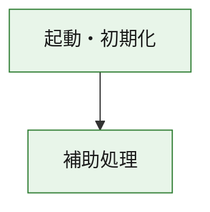
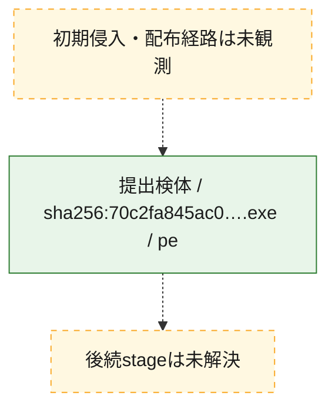
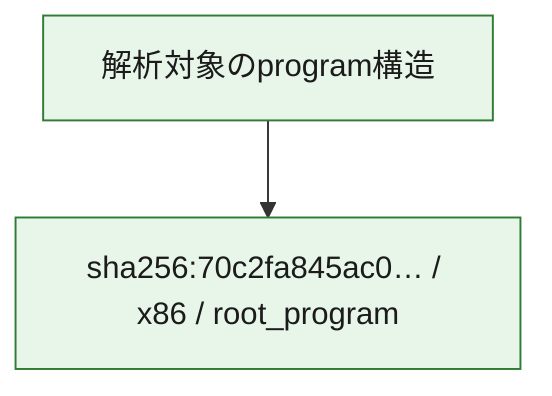

# 全体ロジック：70c2fa845ac0791b6281ef1107e9f0c6bc33c582e8c36087f8d3e921ad8ac772

代表関数の静的証跡から、起動・初期化の処理群を確認しました。

## 読み方

- phaseの掲載順は解析上の整理順です。observed_call_edgesがない段階間の実行順を断定しません。
- 図の実線は静的に観測した関係、点線と黄色のノードは未観測・未解決の関係を示します。
- 図は静的な要約であり、動的実行を再現するものではありません。
- 詳細な関数解説とfingerprintは[STATIC-LOGIC.md](STATIC-LOGIC.md)を参照してください。

## 静的可視化

### 実行フロー

### 感染チェーン

### モジュール関係

## 処理段階

### 1. 起動・初期化

entry pointから初期化と後続処理への移行を確認します。
確度: `confirmed_static_function_evidence`

- `70c2fa845ac0791b6281ef1107e9f0c6bc33c582e8c36087f8d3e921ad8ac772:ghidra:180001010` — 初期化と主要処理への分岐を行う入口関数です。 状態: `succeeded`、選定理由: `entry_point`, `meaningful_symbol_name`, `reviewed_call_centrality:22`, `role:entrypoint`, `small_program_complete_context`

### 2. 補助処理

主要処理を支える一般内部関数またはlibrary処理を確認します。
確度: `confirmed_static_function_evidence`

- `70c2fa845ac0791b6281ef1107e9f0c6bc33c582e8c36087f8d3e921ad8ac772:ghidra:180001240` — 検体内部の一般処理を実装する関数です。 状態: `succeeded`、選定理由: `context_representative`, `reviewed_call_centrality:2`, `small_program_complete_context`
- `70c2fa845ac0791b6281ef1107e9f0c6bc33c582e8c36087f8d3e921ad8ac772:ghidra:180001350` — 検体内部の一般処理を実装する関数です。 状態: `succeeded`、選定理由: `context_representative`, `reviewed_call_centrality:25`, `small_program_complete_context`
- `70c2fa845ac0791b6281ef1107e9f0c6bc33c582e8c36087f8d3e921ad8ac772:ghidra:180003780` — 検体内部の一般処理を実装する関数です。 状態: `succeeded`、選定理由: `context_representative`, `reviewed_call_centrality:2`, `small_program_complete_context`
- `70c2fa845ac0791b6281ef1107e9f0c6bc33c582e8c36087f8d3e921ad8ac772:ghidra:1800038e0` — 検体内部の一般処理を実装する関数です。 状態: `succeeded`、選定理由: `context_representative`, `reviewed_call_centrality:2`, `small_program_complete_context`

## 観測したcall関係

- `70c2fa845ac0791b6281ef1107e9f0c6bc33c582e8c36087f8d3e921ad8ac772:ghidra:180001010` → `70c2fa845ac0791b6281ef1107e9f0c6bc33c582e8c36087f8d3e921ad8ac772:ghidra:180001240` （`startup` → `support`）
- `70c2fa845ac0791b6281ef1107e9f0c6bc33c582e8c36087f8d3e921ad8ac772:ghidra:180001010` → `70c2fa845ac0791b6281ef1107e9f0c6bc33c582e8c36087f8d3e921ad8ac772:ghidra:180001350` （`startup` → `support`）
- `70c2fa845ac0791b6281ef1107e9f0c6bc33c582e8c36087f8d3e921ad8ac772:ghidra:180001350` → `70c2fa845ac0791b6281ef1107e9f0c6bc33c582e8c36087f8d3e921ad8ac772:ghidra:180001240` （`support` → `support`）
- `70c2fa845ac0791b6281ef1107e9f0c6bc33c582e8c36087f8d3e921ad8ac772:ghidra:180001350` → `70c2fa845ac0791b6281ef1107e9f0c6bc33c582e8c36087f8d3e921ad8ac772:ghidra:180003780` （`support` → `support`）
- `70c2fa845ac0791b6281ef1107e9f0c6bc33c582e8c36087f8d3e921ad8ac772:ghidra:180001350` → `70c2fa845ac0791b6281ef1107e9f0c6bc33c582e8c36087f8d3e921ad8ac772:ghidra:1800038e0` （`support` → `support`）
- `70c2fa845ac0791b6281ef1107e9f0c6bc33c582e8c36087f8d3e921ad8ac772:ghidra:180003780` → `70c2fa845ac0791b6281ef1107e9f0c6bc33c582e8c36087f8d3e921ad8ac772:ghidra:1800038e0` （`support` → `support`）
- `ghidra-function:0005d84e13dcf085b84cd503` → `ghidra-function:d8bc12b438e8d885f0b3a356` （`unclassified` → `unclassified`）
- `ghidra-function:b34665605f771030b42a10d5` → `ghidra-external:0067fdc5a1b2d1947a070a63` （`unclassified` → `unclassified`）
- `ghidra-function:b34665605f771030b42a10d5` → `ghidra-external:131d1ba31d4c4cb4f0192795` （`unclassified` → `unclassified`）
- `ghidra-function:b34665605f771030b42a10d5` → `ghidra-external:25b442ab837cc0418f80ca52` （`unclassified` → `unclassified`）
- `ghidra-function:b34665605f771030b42a10d5` → `ghidra-external:2d630d9a76d93f9017b567c2` （`unclassified` → `unclassified`）
- `ghidra-function:b34665605f771030b42a10d5` → `ghidra-external:2fdde1193a563baeefccb5f9` （`unclassified` → `unclassified`）
- `ghidra-function:b34665605f771030b42a10d5` → `ghidra-external:44146fdc78f2e30a81cf2fe1` （`unclassified` → `unclassified`）
- `ghidra-function:b34665605f771030b42a10d5` → `ghidra-external:5308e4c4f35e8358c1a43d63` （`unclassified` → `unclassified`）
- `ghidra-function:b34665605f771030b42a10d5` → `ghidra-external:6a2377e48c389bd104a4555a` （`unclassified` → `unclassified`）
- `ghidra-function:b34665605f771030b42a10d5` → `ghidra-external:73ce299f18ecbc549dc2fa1e` （`unclassified` → `unclassified`）
- `ghidra-function:b34665605f771030b42a10d5` → `ghidra-external:8cfdd326dd81275e26729052` （`unclassified` → `unclassified`）
- `ghidra-function:b34665605f771030b42a10d5` → `ghidra-external:991ebecea4274c22c851cc6b` （`unclassified` → `unclassified`）
- `ghidra-function:b34665605f771030b42a10d5` → `ghidra-external:9c10f9ff667b7242a4450739` （`unclassified` → `unclassified`）
- `ghidra-function:b34665605f771030b42a10d5` → `ghidra-external:bf41fd95e48ed51b7bed8443` （`unclassified` → `unclassified`）
- `ghidra-function:b34665605f771030b42a10d5` → `ghidra-external:c065cc991262ec4ce303fc81` （`unclassified` → `unclassified`）
- `ghidra-function:b34665605f771030b42a10d5` → `ghidra-external:c6e6a3f3d2d75c4dd89f1310` （`unclassified` → `unclassified`）
- `ghidra-function:b34665605f771030b42a10d5` → `ghidra-external:cd55f34e71770f9e9991b25f` （`unclassified` → `unclassified`）
- `ghidra-function:b34665605f771030b42a10d5` → `ghidra-external:d4318a15cd45b7f5b09fad36` （`unclassified` → `unclassified`）
- `ghidra-function:b34665605f771030b42a10d5` → `ghidra-external:da8ff1929f625f023de3c07c` （`unclassified` → `unclassified`）
- `ghidra-function:b34665605f771030b42a10d5` → `ghidra-external:e60e49d7bff8efc80f85a60f` （`unclassified` → `unclassified`）
- `ghidra-function:b34665605f771030b42a10d5` → `ghidra-external:eac5da1ae71fdedfe03e0ad0` （`unclassified` → `unclassified`）
- `ghidra-function:b34665605f771030b42a10d5` → `ghidra-external:f3be01594860bf104bee2cd8` （`unclassified` → `unclassified`）
- `ghidra-function:b34665605f771030b42a10d5` → `ghidra-function:0005d84e13dcf085b84cd503` （`unclassified` → `unclassified`）
- `ghidra-function:b34665605f771030b42a10d5` → `ghidra-function:0130c71816dc00335edba594` （`unclassified` → `unclassified`）
- `ghidra-function:b34665605f771030b42a10d5` → `ghidra-function:d8bc12b438e8d885f0b3a356` （`unclassified` → `unclassified`）
- `ghidra-function:c4fcc78eb7e0b71bf0b66fb3` → `ghidra-function:0130c71816dc00335edba594` （`unclassified` → `unclassified`）
- `ghidra-function:c4fcc78eb7e0b71bf0b66fb3` → `ghidra-function:115b3c4a716f8376707d3f3e` （`unclassified` → `unclassified`）
- `ghidra-function:c4fcc78eb7e0b71bf0b66fb3` → `ghidra-function:2b8f0d55992fc84b0d153edf` （`unclassified` → `unclassified`）
- `ghidra-function:c4fcc78eb7e0b71bf0b66fb3` → `ghidra-function:351d29f016cbb155b3f37566` （`unclassified` → `unclassified`）
- `ghidra-function:c4fcc78eb7e0b71bf0b66fb3` → `ghidra-function:426761e1dde8a59c3bd08fde` （`unclassified` → `unclassified`）
- `ghidra-function:c4fcc78eb7e0b71bf0b66fb3` → `ghidra-function:43edf0f9fd15574fd26c28ad` （`unclassified` → `unclassified`）
- `ghidra-function:c4fcc78eb7e0b71bf0b66fb3` → `ghidra-function:700425f9c83e1f7989ad21bf` （`unclassified` → `unclassified`）
- `ghidra-function:c4fcc78eb7e0b71bf0b66fb3` → `ghidra-function:947402420484c3658d8195dd` （`unclassified` → `unclassified`）
- `ghidra-function:c4fcc78eb7e0b71bf0b66fb3` → `ghidra-function:969b7e0c90ccb27ac6e3da07` （`unclassified` → `unclassified`）
- `ghidra-function:c4fcc78eb7e0b71bf0b66fb3` → `ghidra-function:996e003c37b6aa6b8e2adfd8` （`unclassified` → `unclassified`）
- `ghidra-function:c4fcc78eb7e0b71bf0b66fb3` → `ghidra-function:ac6c9a0c03821058b5503b14` （`unclassified` → `unclassified`）
- `ghidra-function:c4fcc78eb7e0b71bf0b66fb3` → `ghidra-function:b34665605f771030b42a10d5` （`unclassified` → `unclassified`）

## 解析範囲と制約

- 選定外関数は全体inventoryへ残しますが、関数本体の個別解説対象にはしていません。
- indirect call、難読化、packer、VM、壊れたcontrol flowによりcall関係が欠落する場合があります。
- 文書は静的解析に基づき、検体実行や外部通信による動的確認は行っていません。
