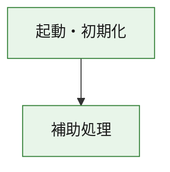
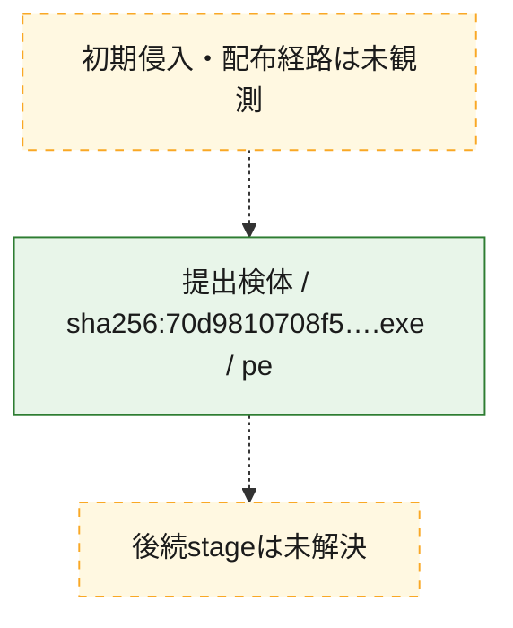
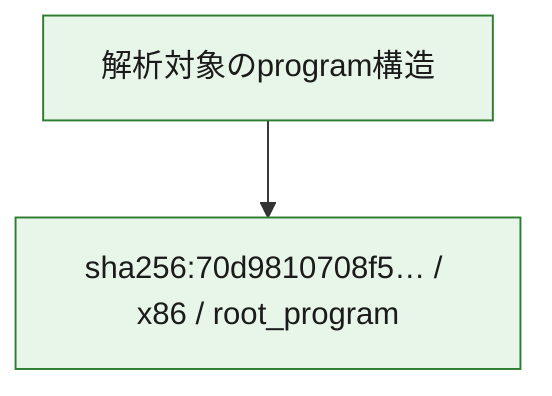

# 全体ロジック：70d9810708f58102ffd823222a2f9e818cdc814fbc6d8682a73052daa859999a

代表関数の静的証跡から、起動・初期化の処理群を確認しました。

## 読み方

- phaseの掲載順は解析上の整理順です。observed_call_edgesがない段階間の実行順を断定しません。
- 図の実線は静的に観測した関係、点線と黄色のノードは未観測・未解決の関係を示します。
- 図は静的な要約であり、動的実行を再現するものではありません。
- 詳細な関数解説とfingerprintは[STATIC-LOGIC.md](STATIC-LOGIC.md)を参照してください。

## 静的可視化

### 実行フロー

### 感染チェーン

### モジュール関係

## 処理段階

### 1. 起動・初期化

entry pointから初期化と後続処理への移行を確認します。
確度: `confirmed_static_function_evidence`

- `70d9810708f58102ffd823222a2f9e818cdc814fbc6d8682a73052daa859999a:ghidra:180001010` — 初期化と主要処理への分岐を行う入口関数です。 状態: `succeeded`、選定理由: `entry_point`, `meaningful_symbol_name`, `reviewed_call_centrality:22`, `role:entrypoint`, `small_program_complete_context`

### 2. 補助処理

主要処理を支える一般内部関数またはlibrary処理を確認します。
確度: `confirmed_static_function_evidence`

- `70d9810708f58102ffd823222a2f9e818cdc814fbc6d8682a73052daa859999a:ghidra:180001240` — 検体内部の一般処理を実装する関数です。 状態: `succeeded`、選定理由: `context_representative`, `reviewed_call_centrality:2`, `small_program_complete_context`
- `70d9810708f58102ffd823222a2f9e818cdc814fbc6d8682a73052daa859999a:ghidra:180001350` — 検体内部の一般処理を実装する関数です。 状態: `succeeded`、選定理由: `context_representative`, `reviewed_call_centrality:25`, `small_program_complete_context`
- `70d9810708f58102ffd823222a2f9e818cdc814fbc6d8682a73052daa859999a:ghidra:180003780` — 検体内部の一般処理を実装する関数です。 状態: `succeeded`、選定理由: `context_representative`, `reviewed_call_centrality:2`, `small_program_complete_context`
- `70d9810708f58102ffd823222a2f9e818cdc814fbc6d8682a73052daa859999a:ghidra:1800038e0` — 検体内部の一般処理を実装する関数です。 状態: `succeeded`、選定理由: `context_representative`, `reviewed_call_centrality:2`, `small_program_complete_context`

## 観測したcall関係

- `70d9810708f58102ffd823222a2f9e818cdc814fbc6d8682a73052daa859999a:ghidra:180001010` → `70d9810708f58102ffd823222a2f9e818cdc814fbc6d8682a73052daa859999a:ghidra:180001240` （`startup` → `support`）
- `70d9810708f58102ffd823222a2f9e818cdc814fbc6d8682a73052daa859999a:ghidra:180001010` → `70d9810708f58102ffd823222a2f9e818cdc814fbc6d8682a73052daa859999a:ghidra:180001350` （`startup` → `support`）
- `70d9810708f58102ffd823222a2f9e818cdc814fbc6d8682a73052daa859999a:ghidra:180001350` → `70d9810708f58102ffd823222a2f9e818cdc814fbc6d8682a73052daa859999a:ghidra:180001240` （`support` → `support`）
- `70d9810708f58102ffd823222a2f9e818cdc814fbc6d8682a73052daa859999a:ghidra:180001350` → `70d9810708f58102ffd823222a2f9e818cdc814fbc6d8682a73052daa859999a:ghidra:180003780` （`support` → `support`）
- `70d9810708f58102ffd823222a2f9e818cdc814fbc6d8682a73052daa859999a:ghidra:180001350` → `70d9810708f58102ffd823222a2f9e818cdc814fbc6d8682a73052daa859999a:ghidra:1800038e0` （`support` → `support`）
- `70d9810708f58102ffd823222a2f9e818cdc814fbc6d8682a73052daa859999a:ghidra:180003780` → `70d9810708f58102ffd823222a2f9e818cdc814fbc6d8682a73052daa859999a:ghidra:1800038e0` （`support` → `support`）
- `ghidra-function:6c45b40cd6c4311515719319` → `ghidra-function:1231096a9cdcc9fe76b0edaf` （`unclassified` → `unclassified`）
- `ghidra-function:6c45b40cd6c4311515719319` → `ghidra-function:306552c4c4112d2b347d733c` （`unclassified` → `unclassified`）
- `ghidra-function:6c45b40cd6c4311515719319` → `ghidra-function:37b4598d7f841c72b28f5777` （`unclassified` → `unclassified`）
- `ghidra-function:6c45b40cd6c4311515719319` → `ghidra-function:6a3dad26af6e500f255a53df` （`unclassified` → `unclassified`）
- `ghidra-function:6c45b40cd6c4311515719319` → `ghidra-function:7cab8cdd579e65e534cbc76c` （`unclassified` → `unclassified`）
- `ghidra-function:6c45b40cd6c4311515719319` → `ghidra-function:9d310f388981d10caae4a64c` （`unclassified` → `unclassified`）
- `ghidra-function:6c45b40cd6c4311515719319` → `ghidra-function:aae348b39ba8d58575f34b3d` （`unclassified` → `unclassified`）
- `ghidra-function:6c45b40cd6c4311515719319` → `ghidra-function:c82aabae7bb601fbebe18310` （`unclassified` → `unclassified`）
- `ghidra-function:6c45b40cd6c4311515719319` → `ghidra-function:cf14fd416e297c2041378b11` （`unclassified` → `unclassified`）
- `ghidra-function:6c45b40cd6c4311515719319` → `ghidra-function:cf9cb26983927bf49901bbb2` （`unclassified` → `unclassified`）
- `ghidra-function:6c45b40cd6c4311515719319` → `ghidra-function:d7eec61a4a57a3e012bd7d0f` （`unclassified` → `unclassified`）
- `ghidra-function:6c45b40cd6c4311515719319` → `ghidra-function:db07ab70073aaf3c7e66edd0` （`unclassified` → `unclassified`）
- `ghidra-function:b5b777ef6a1555d1a47851c6` → `ghidra-function:823c3f22397ab6e9361cb301` （`unclassified` → `unclassified`）
- `ghidra-function:db07ab70073aaf3c7e66edd0` → `ghidra-external:03d9a8a68715663df13e99b1` （`unclassified` → `unclassified`）
- `ghidra-function:db07ab70073aaf3c7e66edd0` → `ghidra-external:0914c6c43397b2335ea60d8f` （`unclassified` → `unclassified`）
- `ghidra-function:db07ab70073aaf3c7e66edd0` → `ghidra-external:4358a71222b23f026c41c493` （`unclassified` → `unclassified`）
- `ghidra-function:db07ab70073aaf3c7e66edd0` → `ghidra-external:4e678382e9eb610c3e14301d` （`unclassified` → `unclassified`）
- `ghidra-function:db07ab70073aaf3c7e66edd0` → `ghidra-external:52071511362ece3d01e6b494` （`unclassified` → `unclassified`）
- `ghidra-function:db07ab70073aaf3c7e66edd0` → `ghidra-external:547f6a3c477631038b8494cc` （`unclassified` → `unclassified`）
- `ghidra-function:db07ab70073aaf3c7e66edd0` → `ghidra-external:558ff2af9a1ac826f3727527` （`unclassified` → `unclassified`）
- `ghidra-function:db07ab70073aaf3c7e66edd0` → `ghidra-external:58f38edf17770fcc851a06d0` （`unclassified` → `unclassified`）
- `ghidra-function:db07ab70073aaf3c7e66edd0` → `ghidra-external:6b2aa4be76dbf8d3add0ccd0` （`unclassified` → `unclassified`）
- `ghidra-function:db07ab70073aaf3c7e66edd0` → `ghidra-external:6ff75e35151eafbfe8c5ed42` （`unclassified` → `unclassified`）
- `ghidra-function:db07ab70073aaf3c7e66edd0` → `ghidra-external:7dd06935f8f327c8387f57cb` （`unclassified` → `unclassified`）
- `ghidra-function:db07ab70073aaf3c7e66edd0` → `ghidra-external:7e896656a1dfcf4085b3d706` （`unclassified` → `unclassified`）
- `ghidra-function:db07ab70073aaf3c7e66edd0` → `ghidra-external:82586831df6b10e123e16459` （`unclassified` → `unclassified`）
- `ghidra-function:db07ab70073aaf3c7e66edd0` → `ghidra-external:83902af62cb8d40616ba66f9` （`unclassified` → `unclassified`）
- `ghidra-function:db07ab70073aaf3c7e66edd0` → `ghidra-external:92379b32924111b18a8cd839` （`unclassified` → `unclassified`）
- `ghidra-function:db07ab70073aaf3c7e66edd0` → `ghidra-external:a0f81256dd4215b40746810f` （`unclassified` → `unclassified`）
- `ghidra-function:db07ab70073aaf3c7e66edd0` → `ghidra-external:ad3adbb913317951dce7d2c5` （`unclassified` → `unclassified`）
- `ghidra-function:db07ab70073aaf3c7e66edd0` → `ghidra-external:b0c45796ffba27c1d204f82e` （`unclassified` → `unclassified`）
- `ghidra-function:db07ab70073aaf3c7e66edd0` → `ghidra-external:b32f86fe4c3fd91acf4508df` （`unclassified` → `unclassified`）
- `ghidra-function:db07ab70073aaf3c7e66edd0` → `ghidra-external:b88cde5cf9d1bd16788b2ee7` （`unclassified` → `unclassified`）
- `ghidra-function:db07ab70073aaf3c7e66edd0` → `ghidra-external:e7778dfb15f8edd8c6754741` （`unclassified` → `unclassified`）
- `ghidra-function:db07ab70073aaf3c7e66edd0` → `ghidra-function:823c3f22397ab6e9361cb301` （`unclassified` → `unclassified`）
- `ghidra-function:db07ab70073aaf3c7e66edd0` → `ghidra-function:b5b777ef6a1555d1a47851c6` （`unclassified` → `unclassified`）
- `ghidra-function:db07ab70073aaf3c7e66edd0` → `ghidra-function:cf14fd416e297c2041378b11` （`unclassified` → `unclassified`）

## 解析範囲と制約

- 選定外関数は全体inventoryへ残しますが、関数本体の個別解説対象にはしていません。
- indirect call、難読化、packer、VM、壊れたcontrol flowによりcall関係が欠落する場合があります。
- 文書は静的解析に基づき、検体実行や外部通信による動的確認は行っていません。
