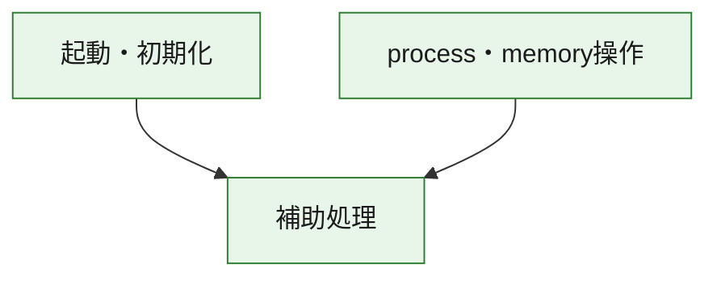
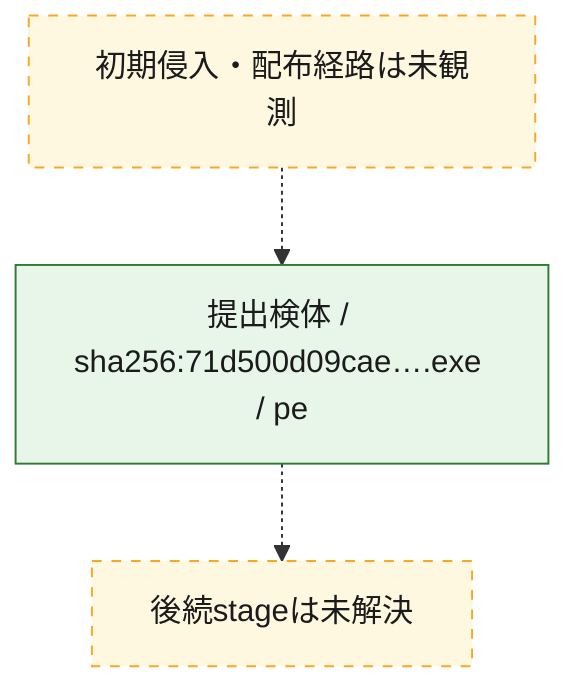
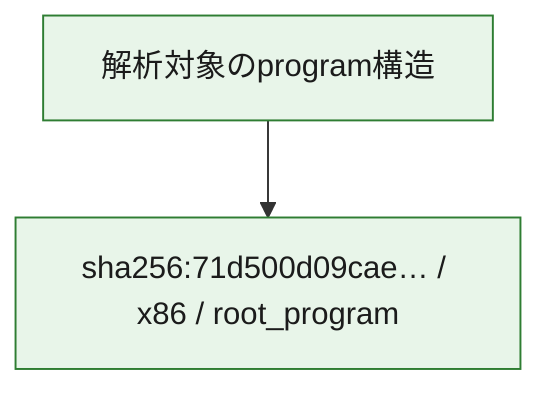

# 全体ロジック：71d500d09cae94e70cc9936817c8ff832744d7620f2f4ba4b0c095a44723b3ca

代表関数の静的証跡から、起動・初期化、process・memory操作の処理群を確認しました。

## 読み方

- phaseの掲載順は解析上の整理順です。observed_call_edgesがない段階間の実行順を断定しません。
- 図の実線は静的に観測した関係、点線と黄色のノードは未観測・未解決の関係を示します。
- 図は静的な要約であり、動的実行を再現するものではありません。
- 詳細な関数解説とfingerprintは[STATIC-LOGIC.md](STATIC-LOGIC.md)を参照してください。

## 静的可視化

### 実行フロー

### 感染チェーン

### モジュール関係

## 処理段階

### 1. 起動・初期化

entry pointから初期化と後続処理への移行を確認します。
確度: `confirmed_static_function_evidence`

- `71d500d09cae94e70cc9936817c8ff832744d7620f2f4ba4b0c095a44723b3ca:ghidra:140001410` — 初期化と主要処理への分岐を行う入口関数です。 状態: `succeeded`、選定理由: `entry_point`, `meaningful_symbol_name`, `reviewed_call_centrality:1`, `role:entrypoint`

### 2. process・memory操作

process、thread、module、memory操作と実行移行を確認します。
確度: `confirmed_static_function_evidence`

- `71d500d09cae94e70cc9936817c8ff832744d7620f2f4ba4b0c095a44723b3ca:ghidra:14000ab60` — process、thread、module、またはmemory操作に関係する関数です。 状態: `succeeded`、選定理由: `context_representative`, `reviewed_call_centrality:16`, `role:process_or_memory_operation`
- `71d500d09cae94e70cc9936817c8ff832744d7620f2f4ba4b0c095a44723b3ca:ghidra:14000abd0` — process、thread、module、またはmemory操作に関係する関数です。 状態: `succeeded`、選定理由: `context_representative`, `reviewed_call_centrality:12`, `role:process_or_memory_operation`

### 3. 補助処理

主要処理を支える一般内部関数またはlibrary処理を確認します。
確度: `confirmed_static_function_evidence_with_limits`

- `71d500d09cae94e70cc9936817c8ff832744d7620f2f4ba4b0c095a44723b3ca:ghidra:140001000` — 検体内部の一般処理を実装する関数です。 状態: `succeeded`、選定理由: `context_representative`
- `71d500d09cae94e70cc9936817c8ff832744d7620f2f4ba4b0c095a44723b3ca:ghidra:140001010` — 検体内部の一般処理を実装する関数です。 状態: `succeeded`、選定理由: `context_representative`, `reviewed_call_centrality:6`
- `71d500d09cae94e70cc9936817c8ff832744d7620f2f4ba4b0c095a44723b3ca:ghidra:140001140` — 検体内部の一般処理を実装する関数です。 状態: `succeeded`、選定理由: `context_representative`, `reviewed_call_centrality:1`
- `71d500d09cae94e70cc9936817c8ff832744d7620f2f4ba4b0c095a44723b3ca:ghidra:140001190` — 検体内部の一般処理を実装する関数です。 状態: `succeeded`、選定理由: `context_representative`, `reviewed_call_centrality:21`
- `71d500d09cae94e70cc9936817c8ff832744d7620f2f4ba4b0c095a44723b3ca:ghidra:1400013e0` — 検体内部の一般処理を実装する関数です。 状態: `succeeded`、選定理由: `context_representative`, `reviewed_call_centrality:1`
- `71d500d09cae94e70cc9936817c8ff832744d7620f2f4ba4b0c095a44723b3ca:ghidra:140001440` — 検体内部の一般処理を実装する関数です。 状態: `succeeded`、選定理由: `context_representative`, `reviewed_call_centrality:1`
- `71d500d09cae94e70cc9936817c8ff832744d7620f2f4ba4b0c095a44723b3ca:ghidra:140001460` — 検体内部の一般処理を実装する関数です。 状態: `succeeded`、選定理由: `context_representative`, `reviewed_call_centrality:1`
- `71d500d09cae94e70cc9936817c8ff832744d7620f2f4ba4b0c095a44723b3ca:ghidra:140001470` — 検体内部の一般処理を実装する関数です。 状態: `succeeded`、選定理由: `context_representative`
- `71d500d09cae94e70cc9936817c8ff832744d7620f2f4ba4b0c095a44723b3ca:ghidra:14000a880` — 検体内部の一般処理を実装する関数です。 状態: `succeeded`、選定理由: `context_representative`
- `71d500d09cae94e70cc9936817c8ff832744d7620f2f4ba4b0c095a44723b3ca:ghidra:14000a8d0` — 検体内部の一般処理を実装する関数です。 状態: `succeeded`、選定理由: `context_representative`, `reviewed_call_centrality:1`
- `71d500d09cae94e70cc9936817c8ff832744d7620f2f4ba4b0c095a44723b3ca:ghidra:14000a950` — 検体内部の一般処理を実装する関数です。 状態: `succeeded`、選定理由: `context_representative`, `reviewed_call_centrality:2`
- `71d500d09cae94e70cc9936817c8ff832744d7620f2f4ba4b0c095a44723b3ca:ghidra:14000a970` — 検体内部の一般処理を実装する関数です。 状態: `succeeded`、選定理由: `context_representative`, `reviewed_call_centrality:1`
- `71d500d09cae94e70cc9936817c8ff832744d7620f2f4ba4b0c095a44723b3ca:ghidra:14000a980` — compiler生成処理または汎用library処理とみられる関数です。 状態: `succeeded`、選定理由: `entry_point`, `meaningful_symbol_name`, `reviewed_call_centrality:1`
- `71d500d09cae94e70cc9936817c8ff832744d7620f2f4ba4b0c095a44723b3ca:ghidra:14000a9b0` — compiler生成処理または汎用library処理とみられる関数です。 状態: `succeeded`、選定理由: `entry_point`, `meaningful_symbol_name`, `reviewed_call_centrality:3`
- `71d500d09cae94e70cc9936817c8ff832744d7620f2f4ba4b0c095a44723b3ca:ghidra:14000aa40` — 検体内部の一般処理を実装する関数です。 状態: `succeeded`、選定理由: `context_representative`
- `71d500d09cae94e70cc9936817c8ff832744d7620f2f4ba4b0c095a44723b3ca:ghidra:14000aa50` — 検体内部の一般処理を実装する関数です。 状態: `succeeded`、選定理由: `context_representative`, `reviewed_call_centrality:2`
- `71d500d09cae94e70cc9936817c8ff832744d7620f2f4ba4b0c095a44723b3ca:ghidra:14000ab50` — 検体内部の一般処理を実装する関数です。 状態: `succeeded`、選定理由: `context_representative`, `reviewed_call_centrality:3`
- `71d500d09cae94e70cc9936817c8ff832744d7620f2f4ba4b0c095a44723b3ca:ghidra:14000ad40` — 検体内部の一般処理を実装する関数です。 状態: `succeeded`、選定理由: `context_representative`, `reviewed_call_centrality:4`
- `71d500d09cae94e70cc9936817c8ff832744d7620f2f4ba4b0c095a44723b3ca:ghidra:14000b0a0` — 検体内部の一般処理を実装する関数です。 状態: `succeeded`、選定理由: `context_representative`
- `71d500d09cae94e70cc9936817c8ff832744d7620f2f4ba4b0c095a44723b3ca:ghidra:14000b0e0` — 検体内部の一般処理を実装する関数です。 状態: `limited_bad_instruction_or_flow`、選定理由: `context_representative`, `reviewed_call_centrality:3`
- `71d500d09cae94e70cc9936817c8ff832744d7620f2f4ba4b0c095a44723b3ca:ghidra:14000b0f0` — 検体内部の一般処理を実装する関数です。 状態: `limited_bad_instruction_or_flow`、選定理由: `context_representative`, `reviewed_call_centrality:2`
- `71d500d09cae94e70cc9936817c8ff832744d7620f2f4ba4b0c095a44723b3ca:ghidra:14000b2b0` — 検体内部の一般処理を実装する関数です。 状態: `limited_bad_instruction_or_flow`、選定理由: `context_representative`, `reviewed_call_centrality:9`
- `71d500d09cae94e70cc9936817c8ff832744d7620f2f4ba4b0c095a44723b3ca:ghidra:14000b330` — 検体内部の一般処理を実装する関数です。 状態: `succeeded`、選定理由: `context_representative`, `reviewed_call_centrality:5`
- `71d500d09cae94e70cc9936817c8ff832744d7620f2f4ba4b0c095a44723b3ca:ghidra:14000b3b0` — 検体内部の一般処理を実装する関数です。 状態: `succeeded`、選定理由: `context_representative`, `reviewed_call_centrality:5`
- `71d500d09cae94e70cc9936817c8ff832744d7620f2f4ba4b0c095a44723b3ca:ghidra:14000b450` — 検体内部の一般処理を実装する関数です。 状態: `succeeded`、選定理由: `context_representative`, `reviewed_call_centrality:9`
- `71d500d09cae94e70cc9936817c8ff832744d7620f2f4ba4b0c095a44723b3ca:ghidra:14000b550` — 検体内部の一般処理を実装する関数です。 状態: `succeeded`、選定理由: `context_representative`
- `71d500d09cae94e70cc9936817c8ff832744d7620f2f4ba4b0c095a44723b3ca:ghidra:14000b580` — 検体内部の一般処理を実装する関数です。 状態: `succeeded`、選定理由: `context_representative`
- `71d500d09cae94e70cc9936817c8ff832744d7620f2f4ba4b0c095a44723b3ca:ghidra:14000b5d0` — 検体内部の一般処理を実装する関数です。 状態: `succeeded`、選定理由: `context_representative`, `reviewed_call_centrality:2`
- `71d500d09cae94e70cc9936817c8ff832744d7620f2f4ba4b0c095a44723b3ca:ghidra:14000b680` — 検体内部の一般処理を実装する関数です。 状態: `succeeded`、選定理由: `context_representative`, `reviewed_call_centrality:2`

## 観測したcall関係

- `71d500d09cae94e70cc9936817c8ff832744d7620f2f4ba4b0c095a44723b3ca:ghidra:140001010` → `71d500d09cae94e70cc9936817c8ff832744d7620f2f4ba4b0c095a44723b3ca:ghidra:14000a970` （`support` → `support`）
- `71d500d09cae94e70cc9936817c8ff832744d7620f2f4ba4b0c095a44723b3ca:ghidra:140001010` → `71d500d09cae94e70cc9936817c8ff832744d7620f2f4ba4b0c095a44723b3ca:ghidra:14000b0e0` （`support` → `support`）
- `71d500d09cae94e70cc9936817c8ff832744d7620f2f4ba4b0c095a44723b3ca:ghidra:140001190` → `71d500d09cae94e70cc9936817c8ff832744d7620f2f4ba4b0c095a44723b3ca:ghidra:14000a950` （`support` → `support`）
- `71d500d09cae94e70cc9936817c8ff832744d7620f2f4ba4b0c095a44723b3ca:ghidra:140001190` → `71d500d09cae94e70cc9936817c8ff832744d7620f2f4ba4b0c095a44723b3ca:ghidra:14000a9b0` （`support` → `support`）
- `71d500d09cae94e70cc9936817c8ff832744d7620f2f4ba4b0c095a44723b3ca:ghidra:140001190` → `71d500d09cae94e70cc9936817c8ff832744d7620f2f4ba4b0c095a44723b3ca:ghidra:14000ab50` （`support` → `support`）
- `71d500d09cae94e70cc9936817c8ff832744d7620f2f4ba4b0c095a44723b3ca:ghidra:140001190` → `71d500d09cae94e70cc9936817c8ff832744d7620f2f4ba4b0c095a44723b3ca:ghidra:14000ad40` （`support` → `support`）
- `71d500d09cae94e70cc9936817c8ff832744d7620f2f4ba4b0c095a44723b3ca:ghidra:1400013e0` → `71d500d09cae94e70cc9936817c8ff832744d7620f2f4ba4b0c095a44723b3ca:ghidra:140001190` （`support` → `support`）
- `71d500d09cae94e70cc9936817c8ff832744d7620f2f4ba4b0c095a44723b3ca:ghidra:140001410` → `71d500d09cae94e70cc9936817c8ff832744d7620f2f4ba4b0c095a44723b3ca:ghidra:140001190` （`startup` → `support`）
- `71d500d09cae94e70cc9936817c8ff832744d7620f2f4ba4b0c095a44723b3ca:ghidra:14000a980` → `71d500d09cae94e70cc9936817c8ff832744d7620f2f4ba4b0c095a44723b3ca:ghidra:14000b450` （`support` → `support`）
- `71d500d09cae94e70cc9936817c8ff832744d7620f2f4ba4b0c095a44723b3ca:ghidra:14000a9b0` → `71d500d09cae94e70cc9936817c8ff832744d7620f2f4ba4b0c095a44723b3ca:ghidra:14000b450` （`support` → `support`）
- `71d500d09cae94e70cc9936817c8ff832744d7620f2f4ba4b0c095a44723b3ca:ghidra:14000ab60` → `71d500d09cae94e70cc9936817c8ff832744d7620f2f4ba4b0c095a44723b3ca:ghidra:14000b680` （`execution` → `support`）
- `71d500d09cae94e70cc9936817c8ff832744d7620f2f4ba4b0c095a44723b3ca:ghidra:14000abd0` → `71d500d09cae94e70cc9936817c8ff832744d7620f2f4ba4b0c095a44723b3ca:ghidra:14000ab60` （`execution` → `execution`）
- `71d500d09cae94e70cc9936817c8ff832744d7620f2f4ba4b0c095a44723b3ca:ghidra:14000abd0` → `71d500d09cae94e70cc9936817c8ff832744d7620f2f4ba4b0c095a44723b3ca:ghidra:14000b680` （`execution` → `support`）
- `71d500d09cae94e70cc9936817c8ff832744d7620f2f4ba4b0c095a44723b3ca:ghidra:14000b0f0` → `71d500d09cae94e70cc9936817c8ff832744d7620f2f4ba4b0c095a44723b3ca:ghidra:14000ab50` （`support` → `support`）
- `71d500d09cae94e70cc9936817c8ff832744d7620f2f4ba4b0c095a44723b3ca:ghidra:14000b450` → `71d500d09cae94e70cc9936817c8ff832744d7620f2f4ba4b0c095a44723b3ca:ghidra:14000ab50` （`support` → `support`）
- `71d500d09cae94e70cc9936817c8ff832744d7620f2f4ba4b0c095a44723b3ca:ghidra:14000b450` → `71d500d09cae94e70cc9936817c8ff832744d7620f2f4ba4b0c095a44723b3ca:ghidra:14000b2b0` （`support` → `support`）
- `ghidra-function:00ed5a0ceaee0adee5fdb9a5` → `ghidra-external:c68fe4b0f37f338766a7a3f3` （`unclassified` → `unclassified`）
- `ghidra-function:079853532e42a6cd6d0f5b0d` → `ghidra-external:f72347ede9402662ea917774` （`unclassified` → `unclassified`）
- `ghidra-function:079853532e42a6cd6d0f5b0d` → `ghidra-function:fde91ab2ccfa56659f5b3fae` （`unclassified` → `unclassified`）
- `ghidra-function:123320cdc36783675571924d` → `ghidra-external:91b1e738061a47b94a55edd0` （`unclassified` → `unclassified`）
- `ghidra-function:123320cdc36783675571924d` → `ghidra-external:cb276f08195d7b0badae1e40` （`unclassified` → `unclassified`）
- `ghidra-function:123320cdc36783675571924d` → `ghidra-function:b02e307e8fcc1298ae23c4a2` （`unclassified` → `unclassified`）
- `ghidra-function:123320cdc36783675571924d` → `ghidra-function:c464186a2cfdf689f36aa1c3` （`unclassified` → `unclassified`）
- `ghidra-function:123320cdc36783675571924d` → `ghidra-function:d162b809d973b4fe656ab2ce` （`unclassified` → `unclassified`）
- `ghidra-function:123320cdc36783675571924d` → `ghidra-function:e69f33f8cad2ee57b972cce2` （`unclassified` → `unclassified`）
- `ghidra-function:13f57f0fa15e8bc3a877b219` → `ghidra-external:ecfe1c1620c083a2d0a3bb00` （`unclassified` → `unclassified`）
- `ghidra-function:13f57f0fa15e8bc3a877b219` → `ghidra-function:26677f2d7ff2e3338e67ba5b` （`unclassified` → `unclassified`）
- `ghidra-function:13f57f0fa15e8bc3a877b219` → `ghidra-function:47cd4d21bd17c79af224d2c3` （`unclassified` → `unclassified`）
- `ghidra-function:2429829ae6e866a8ebfd2027` → `ghidra-function:26677f2d7ff2e3338e67ba5b` （`unclassified` → `unclassified`）
- `ghidra-function:2429829ae6e866a8ebfd2027` → `ghidra-function:3e6351ce1b3c512b5ebac23b` （`unclassified` → `unclassified`）
- `ghidra-function:2429829ae6e866a8ebfd2027` → `ghidra-function:47cd4d21bd17c79af224d2c3` （`unclassified` → `unclassified`）
- `ghidra-function:2429829ae6e866a8ebfd2027` → `ghidra-function:8209d847d5a781ecb42a947d` （`unclassified` → `unclassified`）
- `ghidra-function:4ca3b494c1d570495480b24b` → `ghidra-external:c68fe4b0f37f338766a7a3f3` （`unclassified` → `unclassified`）
- `ghidra-function:557d55aaf0ed173782e3469f` → `ghidra-external:276d6397a6457c2c670bd2a5` （`unclassified` → `unclassified`）
- `ghidra-function:557d55aaf0ed173782e3469f` → `ghidra-function:6afab018e8313e4212b82445` （`unclassified` → `unclassified`）
- `ghidra-function:55ac9916b01f5fb5b3492907` → `ghidra-external:1a13f367cb13aee555a8bb62` （`unclassified` → `unclassified`）
- `ghidra-function:55ac9916b01f5fb5b3492907` → `ghidra-external:23f7fc0976f9ce72b6eb023f` （`unclassified` → `unclassified`）
- `ghidra-function:55ac9916b01f5fb5b3492907` → `ghidra-external:2a4ecf68997a00f84f762e94` （`unclassified` → `unclassified`）
- `ghidra-function:55ac9916b01f5fb5b3492907` → `ghidra-external:48fdffe659dafbf79542b6b6` （`unclassified` → `unclassified`）
- `ghidra-function:55ac9916b01f5fb5b3492907` → `ghidra-external:533d87ab8bd66ffc00604b47` （`unclassified` → `unclassified`）
- `ghidra-function:55ac9916b01f5fb5b3492907` → `ghidra-external:55f109b57acfcfeea3106494` （`unclassified` → `unclassified`）
- `ghidra-function:55ac9916b01f5fb5b3492907` → `ghidra-external:8e2fdbd7386e0a7ec6b55b5a` （`unclassified` → `unclassified`）
- `ghidra-function:55ac9916b01f5fb5b3492907` → `ghidra-external:9130376d55315bebaf93582f` （`unclassified` → `unclassified`）
- `ghidra-function:55ac9916b01f5fb5b3492907` → `ghidra-external:c973c0afcd29f471e3db21d7` （`unclassified` → `unclassified`）
- `ghidra-function:55ac9916b01f5fb5b3492907` → `ghidra-external:cb2cd980ee4460210bd04a10` （`unclassified` → `unclassified`）
- `ghidra-function:55ac9916b01f5fb5b3492907` → `ghidra-function:00ed5a0ceaee0adee5fdb9a5` （`unclassified` → `unclassified`）
- `ghidra-function:55ac9916b01f5fb5b3492907` → `ghidra-function:0e20b574d091e89f8a0386a5` （`unclassified` → `unclassified`）
- `ghidra-function:55ac9916b01f5fb5b3492907` → `ghidra-function:6afab018e8313e4212b82445` （`unclassified` → `unclassified`）
- `ghidra-function:55ac9916b01f5fb5b3492907` → `ghidra-function:7571063e6e1752ae531b822a` （`unclassified` → `unclassified`）
- `ghidra-function:55ac9916b01f5fb5b3492907` → `ghidra-function:9e309159b238ba9a183aba80` （`unclassified` → `unclassified`）
- `ghidra-function:55ac9916b01f5fb5b3492907` → `ghidra-function:b8b69c90ad5bb837c693fdfd` （`unclassified` → `unclassified`）
- `ghidra-function:55ac9916b01f5fb5b3492907` → `ghidra-function:ff6497677cb538b7518b92ad` （`unclassified` → `unclassified`）
- `ghidra-function:5759cf322a36106dd6e870f4` → `ghidra-function:aec5539e9de7a88e199ac597` （`unclassified` → `unclassified`）
- `ghidra-function:5a1483c2f377c0bb4aefd4e3` → `ghidra-external:263108ac3106b6b5aa2f8fc2` （`unclassified` → `unclassified`）
- `ghidra-function:5a1483c2f377c0bb4aefd4e3` → `ghidra-external:9130376d55315bebaf93582f` （`unclassified` → `unclassified`）
- `ghidra-function:694cd332561ab538a884c54c` → `ghidra-function:55ac9916b01f5fb5b3492907` （`unclassified` → `unclassified`）
- `ghidra-function:6b9213902fd6dfc5ed0a4116` → `ghidra-external:c68fe4b0f37f338766a7a3f3` （`unclassified` → `unclassified`）
- `ghidra-function:7571063e6e1752ae531b822a` → `ghidra-external:cb276f08195d7b0badae1e40` （`unclassified` → `unclassified`）
- `ghidra-function:7571063e6e1752ae531b822a` → `ghidra-function:aec5539e9de7a88e199ac597` （`unclassified` → `unclassified`）
- `ghidra-function:7fdcea73d437a0465deb4347` → `ghidra-external:a2cc06ebed93628fedf07925` （`unclassified` → `unclassified`）
- `ghidra-function:7fdcea73d437a0465deb4347` → `ghidra-function:26677f2d7ff2e3338e67ba5b` （`unclassified` → `unclassified`）
- `ghidra-function:7fdcea73d437a0465deb4347` → `ghidra-function:47cd4d21bd17c79af224d2c3` （`unclassified` → `unclassified`）
- `ghidra-function:9a2b3cb0660faadc248d3cc3` → `ghidra-external:c68fe4b0f37f338766a7a3f3` （`unclassified` → `unclassified`）
- `ghidra-function:a67886e2b61f5ff151b843b3` → `ghidra-function:55ac9916b01f5fb5b3492907` （`unclassified` → `unclassified`）
- `ghidra-function:aec5539e9de7a88e199ac597` → `ghidra-external:ecfe1c1620c083a2d0a3bb00` （`unclassified` → `unclassified`）
- `ghidra-function:aec5539e9de7a88e199ac597` → `ghidra-function:2429829ae6e866a8ebfd2027` （`unclassified` → `unclassified`）
- `ghidra-function:aec5539e9de7a88e199ac597` → `ghidra-function:6756aa31b4694617b3a5382f` （`unclassified` → `unclassified`）
- `ghidra-function:aec5539e9de7a88e199ac597` → `ghidra-function:6afab018e8313e4212b82445` （`unclassified` → `unclassified`）
- `ghidra-function:aec5539e9de7a88e199ac597` → `ghidra-function:8f54f6a80c583c40d3e54edd` （`unclassified` → `unclassified`）
- `ghidra-function:b02e307e8fcc1298ae23c4a2` → `ghidra-function:1516f5e5f08df2ff348d3068` （`unclassified` → `unclassified`）
- `ghidra-function:b8b69c90ad5bb837c693fdfd` → `ghidra-external:02918a192cbd12b4b566fa1d` （`unclassified` → `unclassified`）
- `ghidra-function:b8b69c90ad5bb837c693fdfd` → `ghidra-external:cb276f08195d7b0badae1e40` （`unclassified` → `unclassified`）
- `ghidra-function:b8b69c90ad5bb837c693fdfd` → `ghidra-function:cc5b30f5dac07b4f2951ed96` （`unclassified` → `unclassified`）
- `ghidra-function:d6c1040f9998be9cb0b50ddb` → `ghidra-external:a5ba8206f3931a2f1bf67985` （`unclassified` → `unclassified`）
- `ghidra-function:f171888d83e7703177ccc6b9` → `ghidra-external:02918a192cbd12b4b566fa1d` （`unclassified` → `unclassified`）
- `ghidra-function:f171888d83e7703177ccc6b9` → `ghidra-external:cb276f08195d7b0badae1e40` （`unclassified` → `unclassified`）
- `ghidra-function:f171888d83e7703177ccc6b9` → `ghidra-function:08cbb1266ee7c61a468066e5` （`unclassified` → `unclassified`）
- `ghidra-function:f171888d83e7703177ccc6b9` → `ghidra-function:3e6351ce1b3c512b5ebac23b` （`unclassified` → `unclassified`）
- `ghidra-function:f171888d83e7703177ccc6b9` → `ghidra-function:507a156984d266e13e4d6b0e` （`unclassified` → `unclassified`）
- `ghidra-function:f171888d83e7703177ccc6b9` → `ghidra-function:591308f79364d2ceb5babadd` （`unclassified` → `unclassified`）
- `ghidra-function:f171888d83e7703177ccc6b9` → `ghidra-function:87ee5ef2d0a0784c9a7915a3` （`unclassified` → `unclassified`）
- `ghidra-function:f171888d83e7703177ccc6b9` → `ghidra-function:cc5b30f5dac07b4f2951ed96` （`unclassified` → `unclassified`）
- `ghidra-function:f171888d83e7703177ccc6b9` → `ghidra-function:fd5b9173b56c983e2187ea37` （`unclassified` → `unclassified`）
- `ghidra-function:fd5b9173b56c983e2187ea37` → `ghidra-external:02918a192cbd12b4b566fa1d` （`unclassified` → `unclassified`）
- `ghidra-function:fd5b9173b56c983e2187ea37` → `ghidra-external:b62ed6b343f612dec622954c` （`unclassified` → `unclassified`）
- `ghidra-function:fd5b9173b56c983e2187ea37` → `ghidra-external:cb276f08195d7b0badae1e40` （`unclassified` → `unclassified`）
- `ghidra-function:fd5b9173b56c983e2187ea37` → `ghidra-external:d9afa26e13c438b74b43f4d9` （`unclassified` → `unclassified`）
- `ghidra-function:fd5b9173b56c983e2187ea37` → `ghidra-external:fb5d8b7de31a28f5f6202364` （`unclassified` → `unclassified`）
- `ghidra-function:fd5b9173b56c983e2187ea37` → `ghidra-function:08cbb1266ee7c61a468066e5` （`unclassified` → `unclassified`）
- `ghidra-function:fd5b9173b56c983e2187ea37` → `ghidra-function:3e6351ce1b3c512b5ebac23b` （`unclassified` → `unclassified`）
- `ghidra-function:fd5b9173b56c983e2187ea37` → `ghidra-function:507a156984d266e13e4d6b0e` （`unclassified` → `unclassified`）
- `ghidra-function:fd5b9173b56c983e2187ea37` → `ghidra-function:591308f79364d2ceb5babadd` （`unclassified` → `unclassified`）
- `ghidra-function:fd5b9173b56c983e2187ea37` → `ghidra-function:87ee5ef2d0a0784c9a7915a3` （`unclassified` → `unclassified`）
- `ghidra-function:fd5b9173b56c983e2187ea37` → `ghidra-function:cc5b30f5dac07b4f2951ed96` （`unclassified` → `unclassified`）
- `ghidra-function:fd5b9173b56c983e2187ea37` → `ghidra-function:fde91ab2ccfa56659f5b3fae` （`unclassified` → `unclassified`）

## 解析範囲と制約

- 選定外関数は全体inventoryへ残しますが、関数本体の個別解説対象にはしていません。
- indirect call、難読化、packer、VM、壊れたcontrol flowによりcall関係が欠落する場合があります。
- 文書は静的解析に基づき、検体実行や外部通信による動的確認は行っていません。
