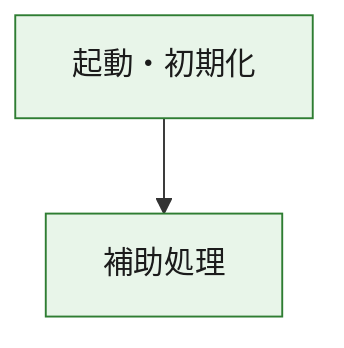
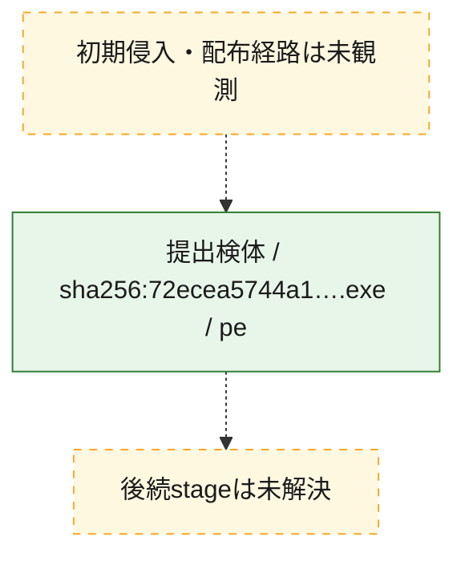
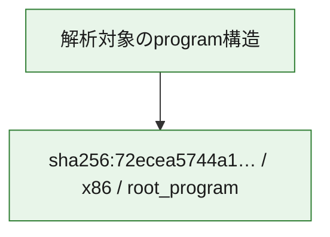

# 全体ロジック：72ecea5744a1bbb356b46f71ca42717f037b5ede82267a62b8e383d3706a56c3

代表関数の静的証跡から、起動・初期化の処理群を確認しました。

## 読み方

- phaseの掲載順は解析上の整理順です。observed_call_edgesがない段階間の実行順を断定しません。
- 図の実線は静的に観測した関係、点線と黄色のノードは未観測・未解決の関係を示します。
- 図は静的な要約であり、動的実行を再現するものではありません。
- 詳細な関数解説とfingerprintは[STATIC-LOGIC.md](STATIC-LOGIC.md)を参照してください。

## 静的可視化

### 実行フロー

### 感染チェーン

### モジュール関係

## 処理段階

### 1. 起動・初期化

entry pointから初期化と後続処理への移行を確認します。
確度: `confirmed_static_function_evidence`

- `72ecea5744a1bbb356b46f71ca42717f037b5ede82267a62b8e383d3706a56c3:ghidra:180001010` — 初期化と主要処理への分岐を行う入口関数です。 状態: `succeeded`、選定理由: `entry_point`, `meaningful_symbol_name`, `reviewed_call_centrality:22`, `role:entrypoint`, `small_program_complete_context`

### 2. 補助処理

主要処理を支える一般内部関数またはlibrary処理を確認します。
確度: `confirmed_static_function_evidence`

- `72ecea5744a1bbb356b46f71ca42717f037b5ede82267a62b8e383d3706a56c3:ghidra:180001240` — 検体内部の一般処理を実装する関数です。 状態: `succeeded`、選定理由: `context_representative`, `reviewed_call_centrality:2`, `small_program_complete_context`
- `72ecea5744a1bbb356b46f71ca42717f037b5ede82267a62b8e383d3706a56c3:ghidra:180001350` — 検体内部の一般処理を実装する関数です。 状態: `succeeded`、選定理由: `context_representative`, `reviewed_call_centrality:25`, `small_program_complete_context`
- `72ecea5744a1bbb356b46f71ca42717f037b5ede82267a62b8e383d3706a56c3:ghidra:180003780` — 検体内部の一般処理を実装する関数です。 状態: `succeeded`、選定理由: `context_representative`, `reviewed_call_centrality:2`, `small_program_complete_context`
- `72ecea5744a1bbb356b46f71ca42717f037b5ede82267a62b8e383d3706a56c3:ghidra:1800038e0` — 検体内部の一般処理を実装する関数です。 状態: `succeeded`、選定理由: `context_representative`, `reviewed_call_centrality:2`, `small_program_complete_context`

## 観測したcall関係

- `72ecea5744a1bbb356b46f71ca42717f037b5ede82267a62b8e383d3706a56c3:ghidra:180001010` → `72ecea5744a1bbb356b46f71ca42717f037b5ede82267a62b8e383d3706a56c3:ghidra:180001240` （`startup` → `support`）
- `72ecea5744a1bbb356b46f71ca42717f037b5ede82267a62b8e383d3706a56c3:ghidra:180001010` → `72ecea5744a1bbb356b46f71ca42717f037b5ede82267a62b8e383d3706a56c3:ghidra:180001350` （`startup` → `support`）
- `72ecea5744a1bbb356b46f71ca42717f037b5ede82267a62b8e383d3706a56c3:ghidra:180001350` → `72ecea5744a1bbb356b46f71ca42717f037b5ede82267a62b8e383d3706a56c3:ghidra:180001240` （`support` → `support`）
- `72ecea5744a1bbb356b46f71ca42717f037b5ede82267a62b8e383d3706a56c3:ghidra:180001350` → `72ecea5744a1bbb356b46f71ca42717f037b5ede82267a62b8e383d3706a56c3:ghidra:180003780` （`support` → `support`）
- `72ecea5744a1bbb356b46f71ca42717f037b5ede82267a62b8e383d3706a56c3:ghidra:180001350` → `72ecea5744a1bbb356b46f71ca42717f037b5ede82267a62b8e383d3706a56c3:ghidra:1800038e0` （`support` → `support`）
- `72ecea5744a1bbb356b46f71ca42717f037b5ede82267a62b8e383d3706a56c3:ghidra:180003780` → `72ecea5744a1bbb356b46f71ca42717f037b5ede82267a62b8e383d3706a56c3:ghidra:1800038e0` （`support` → `support`）
- `ghidra-function:0bd1354531859db2d1e353c8` → `ghidra-function:791b6a0ea3c817507c985cdf` （`unclassified` → `unclassified`）
- `ghidra-function:4f64beb103ff12da41de3e30` → `ghidra-function:43be564edaf4d0a499d12512` （`unclassified` → `unclassified`）
- `ghidra-function:4f64beb103ff12da41de3e30` → `ghidra-function:4dbd0f89a9edef9613cdff0c` （`unclassified` → `unclassified`）
- `ghidra-function:4f64beb103ff12da41de3e30` → `ghidra-function:53093f5ea60d46bc1e069c19` （`unclassified` → `unclassified`）
- `ghidra-function:4f64beb103ff12da41de3e30` → `ghidra-function:530fcebe33366452e63b4c29` （`unclassified` → `unclassified`）
- `ghidra-function:4f64beb103ff12da41de3e30` → `ghidra-function:56a858191310a35724346623` （`unclassified` → `unclassified`）
- `ghidra-function:4f64beb103ff12da41de3e30` → `ghidra-function:5b4e6f4bc579d47de3ac84ae` （`unclassified` → `unclassified`）
- `ghidra-function:4f64beb103ff12da41de3e30` → `ghidra-function:7a096720c93bb9dfd8ff6e21` （`unclassified` → `unclassified`）
- `ghidra-function:4f64beb103ff12da41de3e30` → `ghidra-function:86d0f1a355090f67ceed6003` （`unclassified` → `unclassified`）
- `ghidra-function:4f64beb103ff12da41de3e30` → `ghidra-function:a32384a3d6e2a12e08587476` （`unclassified` → `unclassified`）
- `ghidra-function:4f64beb103ff12da41de3e30` → `ghidra-function:eb3b8765a77e5406172eb15c` （`unclassified` → `unclassified`）
- `ghidra-function:4f64beb103ff12da41de3e30` → `ghidra-function:ebd1a43c24624a777440ae2c` （`unclassified` → `unclassified`）
- `ghidra-function:4f64beb103ff12da41de3e30` → `ghidra-function:f0d5879ec377f98fc9fe258a` （`unclassified` → `unclassified`）
- `ghidra-function:ebd1a43c24624a777440ae2c` → `ghidra-external:0e42f243279d5ca05dee5e0c` （`unclassified` → `unclassified`）
- `ghidra-function:ebd1a43c24624a777440ae2c` → `ghidra-external:10adbd61574fbcce41cab70c` （`unclassified` → `unclassified`）
- `ghidra-function:ebd1a43c24624a777440ae2c` → `ghidra-external:16b0462e79065b133feeaa53` （`unclassified` → `unclassified`）
- `ghidra-function:ebd1a43c24624a777440ae2c` → `ghidra-external:178ae3a321db442e7355fade` （`unclassified` → `unclassified`）
- `ghidra-function:ebd1a43c24624a777440ae2c` → `ghidra-external:3165bff9fd24fc92923587e2` （`unclassified` → `unclassified`）
- `ghidra-function:ebd1a43c24624a777440ae2c` → `ghidra-external:3f4a4b7bf134d26aa6aeffd4` （`unclassified` → `unclassified`）
- `ghidra-function:ebd1a43c24624a777440ae2c` → `ghidra-external:4937aa8b1264c81f42402e58` （`unclassified` → `unclassified`）
- `ghidra-function:ebd1a43c24624a777440ae2c` → `ghidra-external:5678372057a0d0229a1b8e6a` （`unclassified` → `unclassified`）
- `ghidra-function:ebd1a43c24624a777440ae2c` → `ghidra-external:5b666bca5ba5a0e5cb1af65f` （`unclassified` → `unclassified`）
- `ghidra-function:ebd1a43c24624a777440ae2c` → `ghidra-external:5d81d57dcfa83777f97ce19f` （`unclassified` → `unclassified`）
- `ghidra-function:ebd1a43c24624a777440ae2c` → `ghidra-external:622f3ff43bc6c091958f40fd` （`unclassified` → `unclassified`）
- `ghidra-function:ebd1a43c24624a777440ae2c` → `ghidra-external:6d0c884110f06815177e56a0` （`unclassified` → `unclassified`）
- `ghidra-function:ebd1a43c24624a777440ae2c` → `ghidra-external:78e688e857f559238eb47b22` （`unclassified` → `unclassified`）
- `ghidra-function:ebd1a43c24624a777440ae2c` → `ghidra-external:9e44c756feef409a2eab2277` （`unclassified` → `unclassified`）
- `ghidra-function:ebd1a43c24624a777440ae2c` → `ghidra-external:b52e521b5e53682aa8ad65e9` （`unclassified` → `unclassified`）
- `ghidra-function:ebd1a43c24624a777440ae2c` → `ghidra-external:baa32174c2d5457a3d3faf6e` （`unclassified` → `unclassified`）
- `ghidra-function:ebd1a43c24624a777440ae2c` → `ghidra-external:c7f302f167f7f94284bade54` （`unclassified` → `unclassified`）
- `ghidra-function:ebd1a43c24624a777440ae2c` → `ghidra-external:ce98285a696f75c361f2de64` （`unclassified` → `unclassified`）
- `ghidra-function:ebd1a43c24624a777440ae2c` → `ghidra-external:d551a8a925511bb12c5d28b3` （`unclassified` → `unclassified`）
- `ghidra-function:ebd1a43c24624a777440ae2c` → `ghidra-external:d8323198df76d601e85548d0` （`unclassified` → `unclassified`）
- `ghidra-function:ebd1a43c24624a777440ae2c` → `ghidra-external:fce7042f07d7da238a731687` （`unclassified` → `unclassified`）
- `ghidra-function:ebd1a43c24624a777440ae2c` → `ghidra-function:0bd1354531859db2d1e353c8` （`unclassified` → `unclassified`）
- `ghidra-function:ebd1a43c24624a777440ae2c` → `ghidra-function:4dbd0f89a9edef9613cdff0c` （`unclassified` → `unclassified`）
- `ghidra-function:ebd1a43c24624a777440ae2c` → `ghidra-function:791b6a0ea3c817507c985cdf` （`unclassified` → `unclassified`）

## 解析範囲と制約

- 選定外関数は全体inventoryへ残しますが、関数本体の個別解説対象にはしていません。
- indirect call、難読化、packer、VM、壊れたcontrol flowによりcall関係が欠落する場合があります。
- 文書は静的解析に基づき、検体実行や外部通信による動的確認は行っていません。
