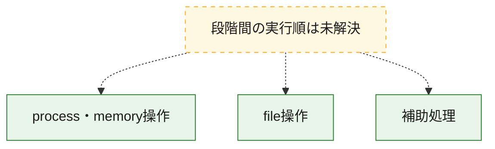
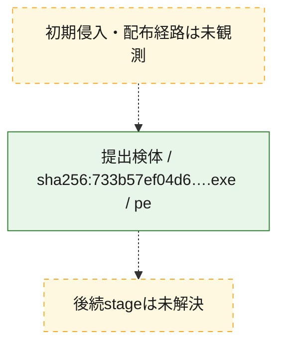
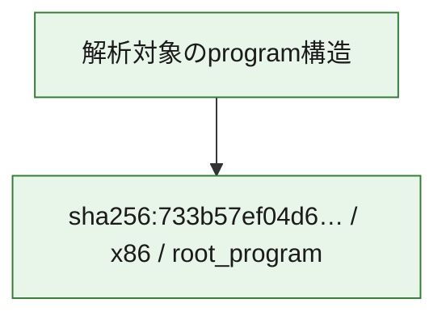

# 全体ロジック：733b57ef04d63ab738e68c524d0af085e3b507b451748278e19958096e183684

代表関数の静的証跡から、process・memory操作、file操作の処理群を確認しました。

## 読み方

- phaseの掲載順は解析上の整理順です。observed_call_edgesがない段階間の実行順を断定しません。
- 図の実線は静的に観測した関係、点線と黄色のノードは未観測・未解決の関係を示します。
- 図は静的な要約であり、動的実行を再現するものではありません。
- 詳細な関数解説とfingerprintは[STATIC-LOGIC.md](STATIC-LOGIC.md)を参照してください。

## 静的可視化

### 実行フロー

### 感染チェーン

### モジュール関係

## 処理段階

### 1. process・memory操作

process、thread、module、memory操作と実行移行を確認します。
確度: `confirmed_static_function_evidence_with_limits`

- `733b57ef04d63ab738e68c524d0af085e3b507b451748278e19958096e183684:ghidra:00425780` — process、thread、module、またはmemory操作に関係する関数です。 状態: `limited_bad_instruction_or_flow`、選定理由: `entry_point`, `meaningful_symbol_name`, `reviewed_call_centrality:3`, `role:process_or_memory_operation`

### 2. file操作

fileやdirectoryの作成、読書き、削除を確認します。
確度: `confirmed_static_function_evidence`

- `733b57ef04d63ab738e68c524d0af085e3b507b451748278e19958096e183684:ghidra:0040798c` — fileまたはdirectoryの読書き・管理に関係する関数です。 状態: `succeeded`、選定理由: `context_representative`, `reviewed_call_centrality:4`, `role:file_operation`

### 3. 補助処理

主要処理を支える一般内部関数またはlibrary処理を確認します。
確度: `confirmed_static_function_evidence`

- `733b57ef04d63ab738e68c524d0af085e3b507b451748278e19958096e183684:ghidra:00407534` — 検体内部の一般処理を実装する関数です。 状態: `succeeded`、選定理由: `context_representative`, `reviewed_call_centrality:9`
- `733b57ef04d63ab738e68c524d0af085e3b507b451748278e19958096e183684:ghidra:00407630` — 検体内部の一般処理を実装する関数です。 状態: `succeeded`、選定理由: `context_representative`, `reviewed_call_centrality:12`
- `733b57ef04d63ab738e68c524d0af085e3b507b451748278e19958096e183684:ghidra:00407704` — 検体内部の一般処理を実装する関数です。 状態: `succeeded`、選定理由: `context_representative`, `reviewed_call_centrality:9`
- `733b57ef04d63ab738e68c524d0af085e3b507b451748278e19958096e183684:ghidra:004077c4` — 検体内部の一般処理を実装する関数です。 状態: `succeeded`、選定理由: `context_representative`, `reviewed_call_centrality:12`
- `733b57ef04d63ab738e68c524d0af085e3b507b451748278e19958096e183684:ghidra:00407824` — 検体内部の一般処理を実装する関数です。 状態: `succeeded`、選定理由: `context_representative`, `reviewed_call_centrality:6`
- `733b57ef04d63ab738e68c524d0af085e3b507b451748278e19958096e183684:ghidra:00407848` — 検体内部の一般処理を実装する関数です。 状態: `succeeded`、選定理由: `context_representative`, `reviewed_call_centrality:5`
- `733b57ef04d63ab738e68c524d0af085e3b507b451748278e19958096e183684:ghidra:004078a0` — 検体内部の一般処理を実装する関数です。 状態: `succeeded`、選定理由: `context_representative`, `reviewed_call_centrality:2`
- `733b57ef04d63ab738e68c524d0af085e3b507b451748278e19958096e183684:ghidra:00407924` — 検体内部の一般処理を実装する関数です。 状態: `succeeded`、選定理由: `context_representative`, `reviewed_call_centrality:1`
- `733b57ef04d63ab738e68c524d0af085e3b507b451748278e19958096e183684:ghidra:004079d8` — 検体内部の一般処理を実装する関数です。 状態: `succeeded`、選定理由: `context_representative`, `reviewed_call_centrality:3`
- `733b57ef04d63ab738e68c524d0af085e3b507b451748278e19958096e183684:ghidra:00407a54` — 検体内部の一般処理を実装する関数です。 状態: `succeeded`、選定理由: `context_representative`, `reviewed_call_centrality:2`
- `733b57ef04d63ab738e68c524d0af085e3b507b451748278e19958096e183684:ghidra:00407af8` — 検体内部の一般処理を実装する関数です。 状態: `succeeded`、選定理由: `context_representative`, `reviewed_call_centrality:3`
- `733b57ef04d63ab738e68c524d0af085e3b507b451748278e19958096e183684:ghidra:00407b68` — 検体内部の一般処理を実装する関数です。 状態: `succeeded`、選定理由: `context_representative`, `reviewed_call_centrality:2`
- `733b57ef04d63ab738e68c524d0af085e3b507b451748278e19958096e183684:ghidra:00407c0c` — 検体内部の一般処理を実装する関数です。 状態: `succeeded`、選定理由: `context_representative`, `reviewed_call_centrality:4`
- `733b57ef04d63ab738e68c524d0af085e3b507b451748278e19958096e183684:ghidra:00407cb4` — 検体内部の一般処理を実装する関数です。 状態: `succeeded`、選定理由: `context_representative`, `reviewed_call_centrality:4`
- `733b57ef04d63ab738e68c524d0af085e3b507b451748278e19958096e183684:ghidra:00407d48` — 検体内部の一般処理を実装する関数です。 状態: `succeeded`、選定理由: `context_representative`, `reviewed_call_centrality:1`
- `733b57ef04d63ab738e68c524d0af085e3b507b451748278e19958096e183684:ghidra:00407da0` — 検体内部の一般処理を実装する関数です。 状態: `succeeded`、選定理由: `context_representative`, `reviewed_call_centrality:3`
- `733b57ef04d63ab738e68c524d0af085e3b507b451748278e19958096e183684:ghidra:00407e14` — 検体内部の一般処理を実装する関数です。 状態: `succeeded`、選定理由: `context_representative`
- `733b57ef04d63ab738e68c524d0af085e3b507b451748278e19958096e183684:ghidra:00407e64` — 検体内部の一般処理を実装する関数です。 状態: `succeeded`、選定理由: `context_representative`, `reviewed_call_centrality:2`
- `733b57ef04d63ab738e68c524d0af085e3b507b451748278e19958096e183684:ghidra:004080ac` — 検体内部の一般処理を実装する関数です。 状態: `succeeded`、選定理由: `context_representative`
- `733b57ef04d63ab738e68c524d0af085e3b507b451748278e19958096e183684:ghidra:00408114` — 検体内部の一般処理を実装する関数です。 状態: `succeeded`、選定理由: `context_representative`, `reviewed_call_centrality:3`
- `733b57ef04d63ab738e68c524d0af085e3b507b451748278e19958096e183684:ghidra:004082ec` — 検体内部の一般処理を実装する関数です。 状態: `succeeded`、選定理由: `context_representative`, `reviewed_call_centrality:3`
- `733b57ef04d63ab738e68c524d0af085e3b507b451748278e19958096e183684:ghidra:004084bc` — 検体内部の一般処理を実装する関数です。 状態: `succeeded`、選定理由: `context_representative`, `reviewed_call_centrality:3`
- `733b57ef04d63ab738e68c524d0af085e3b507b451748278e19958096e183684:ghidra:004085f8` — 検体内部の一般処理を実装する関数です。 状態: `succeeded`、選定理由: `context_representative`, `reviewed_call_centrality:4`
- `733b57ef04d63ab738e68c524d0af085e3b507b451748278e19958096e183684:ghidra:0040873c` — 検体内部の一般処理を実装する関数です。 状態: `succeeded`、選定理由: `context_representative`
- `733b57ef04d63ab738e68c524d0af085e3b507b451748278e19958096e183684:ghidra:00408828` — 検体内部の一般処理を実装する関数です。 状態: `succeeded`、選定理由: `context_representative`, `reviewed_call_centrality:2`
- `733b57ef04d63ab738e68c524d0af085e3b507b451748278e19958096e183684:ghidra:00408898` — 検体内部の一般処理を実装する関数です。 状態: `succeeded`、選定理由: `context_representative`, `reviewed_call_centrality:2`
- `733b57ef04d63ab738e68c524d0af085e3b507b451748278e19958096e183684:ghidra:00408904` — 検体内部の一般処理を実装する関数です。 状態: `succeeded`、選定理由: `context_representative`, `reviewed_call_centrality:1`
- `733b57ef04d63ab738e68c524d0af085e3b507b451748278e19958096e183684:ghidra:00408928` — 検体内部の一般処理を実装する関数です。 状態: `succeeded`、選定理由: `context_representative`, `reviewed_call_centrality:1`
- `733b57ef04d63ab738e68c524d0af085e3b507b451748278e19958096e183684:ghidra:0040894c` — 検体内部の一般処理を実装する関数です。 状態: `succeeded`、選定理由: `context_representative`, `reviewed_call_centrality:4`
- `733b57ef04d63ab738e68c524d0af085e3b507b451748278e19958096e183684:ghidra:004089a0` — 検体内部の一般処理を実装する関数です。 状態: `succeeded`、選定理由: `context_representative`, `reviewed_call_centrality:4`

## 観測したcall関係

- 代表関数間で直接解決できた呼出関係はありません。

## 解析範囲と制約

- 選定外関数は全体inventoryへ残しますが、関数本体の個別解説対象にはしていません。
- indirect call、難読化、packer、VM、壊れたcontrol flowによりcall関係が欠落する場合があります。
- 文書は静的解析に基づき、検体実行や外部通信による動的確認は行っていません。
