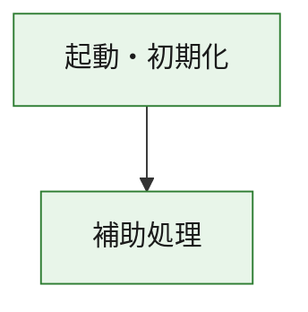
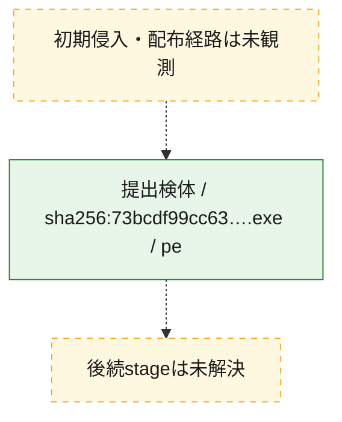
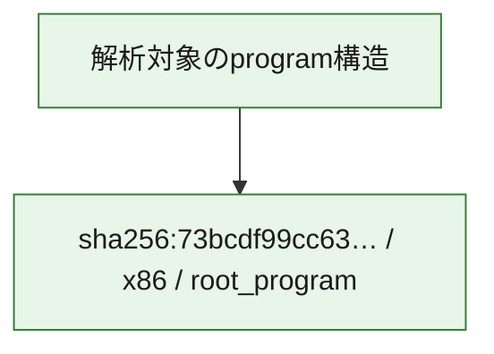

# 全体ロジック：73bcdf99cc6352ce1a63a9c4bce382b36912c5ccfd96ff75e0b75c1f8968b7c9

代表関数の静的証跡から、起動・初期化の処理群を確認しました。

## 読み方

- phaseの掲載順は解析上の整理順です。observed_call_edgesがない段階間の実行順を断定しません。
- 図の実線は静的に観測した関係、点線と黄色のノードは未観測・未解決の関係を示します。
- 図は静的な要約であり、動的実行を再現するものではありません。
- 詳細な関数解説とfingerprintは[STATIC-LOGIC.md](STATIC-LOGIC.md)を参照してください。

## 静的可視化

### 実行フロー

### 感染チェーン

### モジュール関係

## 処理段階

### 1. 起動・初期化

entry pointから初期化と後続処理への移行を確認します。
確度: `confirmed_static_function_evidence`

- `73bcdf99cc6352ce1a63a9c4bce382b36912c5ccfd96ff75e0b75c1f8968b7c9:ghidra:180001010` — 初期化と主要処理への分岐を行う入口関数です。 状態: `succeeded`、選定理由: `entry_point`, `meaningful_symbol_name`, `reviewed_call_centrality:22`, `role:entrypoint`, `small_program_complete_context`

### 2. 補助処理

主要処理を支える一般内部関数またはlibrary処理を確認します。
確度: `confirmed_static_function_evidence`

- `73bcdf99cc6352ce1a63a9c4bce382b36912c5ccfd96ff75e0b75c1f8968b7c9:ghidra:180001240` — 検体内部の一般処理を実装する関数です。 状態: `succeeded`、選定理由: `context_representative`, `reviewed_call_centrality:2`, `small_program_complete_context`
- `73bcdf99cc6352ce1a63a9c4bce382b36912c5ccfd96ff75e0b75c1f8968b7c9:ghidra:180001350` — 検体内部の一般処理を実装する関数です。 状態: `succeeded`、選定理由: `context_representative`, `reviewed_call_centrality:25`, `small_program_complete_context`
- `73bcdf99cc6352ce1a63a9c4bce382b36912c5ccfd96ff75e0b75c1f8968b7c9:ghidra:180003780` — 検体内部の一般処理を実装する関数です。 状態: `succeeded`、選定理由: `context_representative`, `reviewed_call_centrality:2`, `small_program_complete_context`
- `73bcdf99cc6352ce1a63a9c4bce382b36912c5ccfd96ff75e0b75c1f8968b7c9:ghidra:1800038e0` — 検体内部の一般処理を実装する関数です。 状態: `succeeded`、選定理由: `context_representative`, `reviewed_call_centrality:2`, `small_program_complete_context`

## 観測したcall関係

- `73bcdf99cc6352ce1a63a9c4bce382b36912c5ccfd96ff75e0b75c1f8968b7c9:ghidra:180001010` → `73bcdf99cc6352ce1a63a9c4bce382b36912c5ccfd96ff75e0b75c1f8968b7c9:ghidra:180001240` （`startup` → `support`）
- `73bcdf99cc6352ce1a63a9c4bce382b36912c5ccfd96ff75e0b75c1f8968b7c9:ghidra:180001010` → `73bcdf99cc6352ce1a63a9c4bce382b36912c5ccfd96ff75e0b75c1f8968b7c9:ghidra:180001350` （`startup` → `support`）
- `73bcdf99cc6352ce1a63a9c4bce382b36912c5ccfd96ff75e0b75c1f8968b7c9:ghidra:180001350` → `73bcdf99cc6352ce1a63a9c4bce382b36912c5ccfd96ff75e0b75c1f8968b7c9:ghidra:180001240` （`support` → `support`）
- `73bcdf99cc6352ce1a63a9c4bce382b36912c5ccfd96ff75e0b75c1f8968b7c9:ghidra:180001350` → `73bcdf99cc6352ce1a63a9c4bce382b36912c5ccfd96ff75e0b75c1f8968b7c9:ghidra:180003780` （`support` → `support`）
- `73bcdf99cc6352ce1a63a9c4bce382b36912c5ccfd96ff75e0b75c1f8968b7c9:ghidra:180001350` → `73bcdf99cc6352ce1a63a9c4bce382b36912c5ccfd96ff75e0b75c1f8968b7c9:ghidra:1800038e0` （`support` → `support`）
- `73bcdf99cc6352ce1a63a9c4bce382b36912c5ccfd96ff75e0b75c1f8968b7c9:ghidra:180003780` → `73bcdf99cc6352ce1a63a9c4bce382b36912c5ccfd96ff75e0b75c1f8968b7c9:ghidra:1800038e0` （`support` → `support`）
- `ghidra-function:6ea79c5397f1734a57b6d01e` → `ghidra-external:0aced6cd9adbc96d340fae42` （`unclassified` → `unclassified`）
- `ghidra-function:6ea79c5397f1734a57b6d01e` → `ghidra-external:0cce9f24bb6967ac5268845d` （`unclassified` → `unclassified`）
- `ghidra-function:6ea79c5397f1734a57b6d01e` → `ghidra-external:1e1360db4ee64af5b31fdef3` （`unclassified` → `unclassified`）
- `ghidra-function:6ea79c5397f1734a57b6d01e` → `ghidra-external:1f9d969064eeb833ce294474` （`unclassified` → `unclassified`）
- `ghidra-function:6ea79c5397f1734a57b6d01e` → `ghidra-external:1fd4d47ea0399f0be7c62383` （`unclassified` → `unclassified`）
- `ghidra-function:6ea79c5397f1734a57b6d01e` → `ghidra-external:41e2f3ae9bd473bd5359e59f` （`unclassified` → `unclassified`）
- `ghidra-function:6ea79c5397f1734a57b6d01e` → `ghidra-external:4257cbb0c232adbd110c2dee` （`unclassified` → `unclassified`）
- `ghidra-function:6ea79c5397f1734a57b6d01e` → `ghidra-external:536cd7cb77bd89910792f39b` （`unclassified` → `unclassified`）
- `ghidra-function:6ea79c5397f1734a57b6d01e` → `ghidra-external:59b5353144711516f951b3a7` （`unclassified` → `unclassified`）
- `ghidra-function:6ea79c5397f1734a57b6d01e` → `ghidra-external:667f51fcbb6210ae0dd952d6` （`unclassified` → `unclassified`）
- `ghidra-function:6ea79c5397f1734a57b6d01e` → `ghidra-external:92927e7fb421df5f6bd7b459` （`unclassified` → `unclassified`）
- `ghidra-function:6ea79c5397f1734a57b6d01e` → `ghidra-external:b4f3b221ea8142c481018032` （`unclassified` → `unclassified`）
- `ghidra-function:6ea79c5397f1734a57b6d01e` → `ghidra-external:be2e31269faa0ee9060b2757` （`unclassified` → `unclassified`）
- `ghidra-function:6ea79c5397f1734a57b6d01e` → `ghidra-external:cdc7b0fbafbabfdee1183179` （`unclassified` → `unclassified`）
- `ghidra-function:6ea79c5397f1734a57b6d01e` → `ghidra-external:d84d24ce27985d1003b66aa0` （`unclassified` → `unclassified`）
- `ghidra-function:6ea79c5397f1734a57b6d01e` → `ghidra-external:d9c8e3e54cc4e20ad5d8fe78` （`unclassified` → `unclassified`）
- `ghidra-function:6ea79c5397f1734a57b6d01e` → `ghidra-external:d9fdc3a8ff9d763b6b4d1d0b` （`unclassified` → `unclassified`）
- `ghidra-function:6ea79c5397f1734a57b6d01e` → `ghidra-external:dbe3f30b13e6f453f41e229e` （`unclassified` → `unclassified`）
- `ghidra-function:6ea79c5397f1734a57b6d01e` → `ghidra-external:f2f9366d5b671d7a3e95df98` （`unclassified` → `unclassified`）
- `ghidra-function:6ea79c5397f1734a57b6d01e` → `ghidra-external:f464c5e0181ff0a395ebc221` （`unclassified` → `unclassified`）
- `ghidra-function:6ea79c5397f1734a57b6d01e` → `ghidra-external:f6c539f1bf9dfe60cc7bdbd8` （`unclassified` → `unclassified`）
- `ghidra-function:6ea79c5397f1734a57b6d01e` → `ghidra-function:00a3096a2838bf9a070b04b9` （`unclassified` → `unclassified`）
- `ghidra-function:6ea79c5397f1734a57b6d01e` → `ghidra-function:c365c99b09c1154f22857c7b` （`unclassified` → `unclassified`）
- `ghidra-function:6ea79c5397f1734a57b6d01e` → `ghidra-function:f3c26c3f23688926aa5cf86b` （`unclassified` → `unclassified`）
- `ghidra-function:aaac93a07591e1b6e0372799` → `ghidra-function:00a3096a2838bf9a070b04b9` （`unclassified` → `unclassified`）
- `ghidra-function:aaac93a07591e1b6e0372799` → `ghidra-function:05de1c5b0291994c6f50e250` （`unclassified` → `unclassified`）
- `ghidra-function:aaac93a07591e1b6e0372799` → `ghidra-function:1cb87a157a9acb179942a53d` （`unclassified` → `unclassified`）
- `ghidra-function:aaac93a07591e1b6e0372799` → `ghidra-function:63d62dfa3695c9149ce3b388` （`unclassified` → `unclassified`）
- `ghidra-function:aaac93a07591e1b6e0372799` → `ghidra-function:6ea79c5397f1734a57b6d01e` （`unclassified` → `unclassified`）
- `ghidra-function:aaac93a07591e1b6e0372799` → `ghidra-function:73f670b155fe35a10c6e300c` （`unclassified` → `unclassified`）
- `ghidra-function:aaac93a07591e1b6e0372799` → `ghidra-function:9b20c40dc409966bdaf4054e` （`unclassified` → `unclassified`）
- `ghidra-function:aaac93a07591e1b6e0372799` → `ghidra-function:aec638af9374dd0af2990775` （`unclassified` → `unclassified`）
- `ghidra-function:aaac93a07591e1b6e0372799` → `ghidra-function:c038b8fadf0ac703ec3b4f19` （`unclassified` → `unclassified`）
- `ghidra-function:aaac93a07591e1b6e0372799` → `ghidra-function:cab47cd37441667df01515c9` （`unclassified` → `unclassified`）
- `ghidra-function:aaac93a07591e1b6e0372799` → `ghidra-function:ce5edce7f80b5ffe325e475e` （`unclassified` → `unclassified`）
- `ghidra-function:aaac93a07591e1b6e0372799` → `ghidra-function:eb2115dda356ac3fa2c6370d` （`unclassified` → `unclassified`）
- `ghidra-function:c365c99b09c1154f22857c7b` → `ghidra-function:f3c26c3f23688926aa5cf86b` （`unclassified` → `unclassified`）

## 解析範囲と制約

- 選定外関数は全体inventoryへ残しますが、関数本体の個別解説対象にはしていません。
- indirect call、難読化、packer、VM、壊れたcontrol flowによりcall関係が欠落する場合があります。
- 文書は静的解析に基づき、検体実行や外部通信による動的確認は行っていません。
