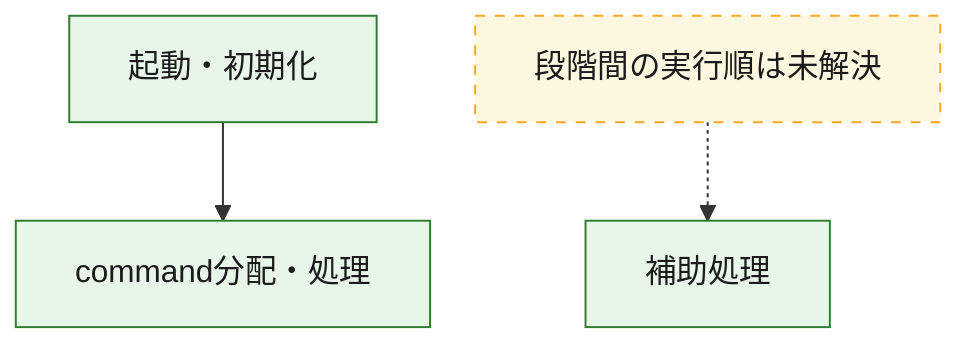
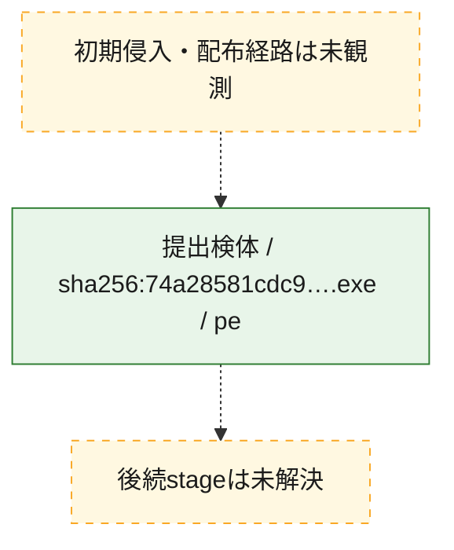
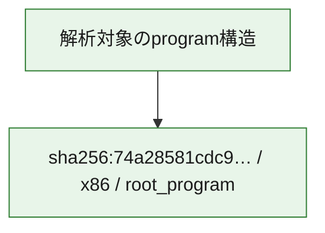

# 全体ロジック：74a28581cdc96b69d58c1b2f640c2f3c6932d11eb4b53fb5bf9cf2e89ac30dd4

代表関数の静的証跡から、起動・初期化、command分配・処理の処理群を確認しました。

## 読み方

- phaseの掲載順は解析上の整理順です。observed_call_edgesがない段階間の実行順を断定しません。
- 図の実線は静的に観測した関係、点線と黄色のノードは未観測・未解決の関係を示します。
- 図は静的な要約であり、動的実行を再現するものではありません。
- 詳細な関数解説とfingerprintは[STATIC-LOGIC.md](STATIC-LOGIC.md)を参照してください。

## 静的可視化

### 実行フロー

### 感染チェーン

### モジュール関係

## 処理段階

### 1. 起動・初期化

entry pointから初期化と後続処理への移行を確認します。
確度: `confirmed_static_function_evidence`

- `74a28581cdc96b69d58c1b2f640c2f3c6932d11eb4b53fb5bf9cf2e89ac30dd4:ghidra:14000c070` — 初期化と主要処理への分岐を行う入口関数です。 状態: `succeeded`、選定理由: `entry_point`, `meaningful_symbol_name`, `reviewed_call_centrality:22`, `role:entrypoint`

### 2. command分配・処理

受信commandやtaskの解釈、分配、個別handlerへの移行を確認します。
確度: `confirmed_static_function_evidence_with_limits`

- `74a28581cdc96b69d58c1b2f640c2f3c6932d11eb4b53fb5bf9cf2e89ac30dd4:ghidra:140018d90` — commandの解釈、分配、または個別処理を担当する関数です。 状態: `limited_bad_instruction_or_flow`、選定理由: `meaningful_symbol_name`, `reviewed_call_centrality:1`, `role:command_dispatch_or_handler`

### 3. 補助処理

主要処理を支える一般内部関数またはlibrary処理を確認します。
確度: `confirmed_static_function_evidence_with_limits`

- `74a28581cdc96b69d58c1b2f640c2f3c6932d11eb4b53fb5bf9cf2e89ac30dd4:ghidra:140001000` — 検体内部の一般処理を実装する関数です。 状態: `succeeded`、選定理由: `context_representative`, `reviewed_call_centrality:1`
- `74a28581cdc96b69d58c1b2f640c2f3c6932d11eb4b53fb5bf9cf2e89ac30dd4:ghidra:1400010c0` — 検体内部の一般処理を実装する関数です。 状態: `limited_bad_instruction_or_flow`、選定理由: `context_representative`, `reviewed_call_centrality:1`
- `74a28581cdc96b69d58c1b2f640c2f3c6932d11eb4b53fb5bf9cf2e89ac30dd4:ghidra:140001360` — 検体内部の一般処理を実装する関数です。 状態: `succeeded`、選定理由: `context_representative`, `reviewed_call_centrality:3`
- `74a28581cdc96b69d58c1b2f640c2f3c6932d11eb4b53fb5bf9cf2e89ac30dd4:ghidra:1400013a0` — 検体内部の一般処理を実装する関数です。 状態: `succeeded`、選定理由: `context_representative`, `reviewed_call_centrality:1`
- `74a28581cdc96b69d58c1b2f640c2f3c6932d11eb4b53fb5bf9cf2e89ac30dd4:ghidra:1400017c0` — 検体内部の一般処理を実装する関数です。 状態: `succeeded`、選定理由: `context_representative`
- `74a28581cdc96b69d58c1b2f640c2f3c6932d11eb4b53fb5bf9cf2e89ac30dd4:ghidra:140001840` — 検体内部の一般処理を実装する関数です。 状態: `succeeded`、選定理由: `context_representative`
- `74a28581cdc96b69d58c1b2f640c2f3c6932d11eb4b53fb5bf9cf2e89ac30dd4:ghidra:140001880` — 検体内部の一般処理を実装する関数です。 状態: `succeeded`、選定理由: `context_representative`, `reviewed_call_centrality:4`
- `74a28581cdc96b69d58c1b2f640c2f3c6932d11eb4b53fb5bf9cf2e89ac30dd4:ghidra:140001940` — 検体内部の一般処理を実装する関数です。 状態: `succeeded`、選定理由: `context_representative`, `reviewed_call_centrality:2`
- `74a28581cdc96b69d58c1b2f640c2f3c6932d11eb4b53fb5bf9cf2e89ac30dd4:ghidra:1400019c0` — 検体内部の一般処理を実装する関数です。 状態: `limited_bad_instruction_or_flow`、選定理由: `context_representative`, `reviewed_call_centrality:4`
- `74a28581cdc96b69d58c1b2f640c2f3c6932d11eb4b53fb5bf9cf2e89ac30dd4:ghidra:140001a40` — 検体内部の一般処理を実装する関数です。 状態: `succeeded`、選定理由: `context_representative`, `reviewed_call_centrality:2`
- `74a28581cdc96b69d58c1b2f640c2f3c6932d11eb4b53fb5bf9cf2e89ac30dd4:ghidra:140001ac0` — 検体内部の一般処理を実装する関数です。 状態: `limited_bad_instruction_or_flow`、選定理由: `context_representative`, `reviewed_call_centrality:7`
- `74a28581cdc96b69d58c1b2f640c2f3c6932d11eb4b53fb5bf9cf2e89ac30dd4:ghidra:140001af0` — 検体内部の一般処理を実装する関数です。 状態: `succeeded`、選定理由: `context_representative`, `reviewed_call_centrality:1`
- `74a28581cdc96b69d58c1b2f640c2f3c6932d11eb4b53fb5bf9cf2e89ac30dd4:ghidra:140001b80` — 検体内部の一般処理を実装する関数です。 状態: `succeeded`、選定理由: `context_representative`, `reviewed_call_centrality:2`
- `74a28581cdc96b69d58c1b2f640c2f3c6932d11eb4b53fb5bf9cf2e89ac30dd4:ghidra:140001bc0` — 検体内部の一般処理を実装する関数です。 状態: `succeeded`、選定理由: `context_representative`, `reviewed_call_centrality:7`
- `74a28581cdc96b69d58c1b2f640c2f3c6932d11eb4b53fb5bf9cf2e89ac30dd4:ghidra:140001ca0` — 検体内部の一般処理を実装する関数です。 状態: `limited_bad_instruction_or_flow`、選定理由: `context_representative`, `reviewed_call_centrality:6`
- `74a28581cdc96b69d58c1b2f640c2f3c6932d11eb4b53fb5bf9cf2e89ac30dd4:ghidra:140002800` — 検体内部の一般処理を実装する関数です。 状態: `succeeded`、選定理由: `context_representative`
- `74a28581cdc96b69d58c1b2f640c2f3c6932d11eb4b53fb5bf9cf2e89ac30dd4:ghidra:140002850` — 検体内部の一般処理を実装する関数です。 状態: `limited_bad_instruction_or_flow`、選定理由: `context_representative`, `reviewed_call_centrality:11`
- `74a28581cdc96b69d58c1b2f640c2f3c6932d11eb4b53fb5bf9cf2e89ac30dd4:ghidra:1400028a0` — 検体内部の一般処理を実装する関数です。 状態: `limited_bad_instruction_or_flow`、選定理由: `context_representative`, `reviewed_call_centrality:1`
- `74a28581cdc96b69d58c1b2f640c2f3c6932d11eb4b53fb5bf9cf2e89ac30dd4:ghidra:140002a10` — 検体内部の一般処理を実装する関数です。 状態: `succeeded`、選定理由: `context_representative`, `reviewed_call_centrality:2`
- `74a28581cdc96b69d58c1b2f640c2f3c6932d11eb4b53fb5bf9cf2e89ac30dd4:ghidra:140002a50` — 検体内部の一般処理を実装する関数です。 状態: `succeeded`、選定理由: `context_representative`, `reviewed_call_centrality:2`
- `74a28581cdc96b69d58c1b2f640c2f3c6932d11eb4b53fb5bf9cf2e89ac30dd4:ghidra:140002a80` — 検体内部の一般処理を実装する関数です。 状態: `succeeded`、選定理由: `context_representative`, `reviewed_call_centrality:2`
- `74a28581cdc96b69d58c1b2f640c2f3c6932d11eb4b53fb5bf9cf2e89ac30dd4:ghidra:140002b00` — 検体内部の一般処理を実装する関数です。 状態: `limited_bad_instruction_or_flow`、選定理由: `context_representative`, `reviewed_call_centrality:6`
- `74a28581cdc96b69d58c1b2f640c2f3c6932d11eb4b53fb5bf9cf2e89ac30dd4:ghidra:140002e80` — 検体内部の一般処理を実装する関数です。 状態: `succeeded`、選定理由: `context_representative`, `reviewed_call_centrality:3`
- `74a28581cdc96b69d58c1b2f640c2f3c6932d11eb4b53fb5bf9cf2e89ac30dd4:ghidra:1400040a0` — 検体内部の一般処理を実装する関数です。 状態: `limited_bad_instruction_or_flow`、選定理由: `context_representative`, `reviewed_call_centrality:11`
- `74a28581cdc96b69d58c1b2f640c2f3c6932d11eb4b53fb5bf9cf2e89ac30dd4:ghidra:140004380` — 検体内部の一般処理を実装する関数です。 状態: `succeeded`、選定理由: `context_representative`, `reviewed_call_centrality:2`
- `74a28581cdc96b69d58c1b2f640c2f3c6932d11eb4b53fb5bf9cf2e89ac30dd4:ghidra:1400043a0` — 検体内部の一般処理を実装する関数です。 状態: `limited_bad_instruction_or_flow`、選定理由: `context_representative`, `reviewed_call_centrality:1`
- `74a28581cdc96b69d58c1b2f640c2f3c6932d11eb4b53fb5bf9cf2e89ac30dd4:ghidra:1400047c0` — 検体内部の一般処理を実装する関数です。 状態: `succeeded`、選定理由: `context_representative`, `reviewed_call_centrality:1`
- `74a28581cdc96b69d58c1b2f640c2f3c6932d11eb4b53fb5bf9cf2e89ac30dd4:ghidra:140004800` — 検体内部の一般処理を実装する関数です。 状態: `limited_bad_instruction_or_flow`、選定理由: `context_representative`, `reviewed_call_centrality:8`
- `74a28581cdc96b69d58c1b2f640c2f3c6932d11eb4b53fb5bf9cf2e89ac30dd4:ghidra:140009b80` — compiler生成処理または汎用library処理とみられる関数です。 状態: `succeeded`、選定理由: `entry_point`, `meaningful_symbol_name`, `reviewed_call_centrality:2`
- `74a28581cdc96b69d58c1b2f640c2f3c6932d11eb4b53fb5bf9cf2e89ac30dd4:ghidra:14000c6a0` — 検体内部の一般処理を実装する関数です。 状態: `succeeded`、選定理由: `meaningful_symbol_name`

## 観測したcall関係

- `74a28581cdc96b69d58c1b2f640c2f3c6932d11eb4b53fb5bf9cf2e89ac30dd4:ghidra:140001360` → `74a28581cdc96b69d58c1b2f640c2f3c6932d11eb4b53fb5bf9cf2e89ac30dd4:ghidra:140001880` （`support` → `support`）
- `74a28581cdc96b69d58c1b2f640c2f3c6932d11eb4b53fb5bf9cf2e89ac30dd4:ghidra:1400013a0` → `74a28581cdc96b69d58c1b2f640c2f3c6932d11eb4b53fb5bf9cf2e89ac30dd4:ghidra:140001360` （`support` → `support`）
- `74a28581cdc96b69d58c1b2f640c2f3c6932d11eb4b53fb5bf9cf2e89ac30dd4:ghidra:140001b80` → `74a28581cdc96b69d58c1b2f640c2f3c6932d11eb4b53fb5bf9cf2e89ac30dd4:ghidra:140001880` （`support` → `support`）
- `74a28581cdc96b69d58c1b2f640c2f3c6932d11eb4b53fb5bf9cf2e89ac30dd4:ghidra:140002a10` → `74a28581cdc96b69d58c1b2f640c2f3c6932d11eb4b53fb5bf9cf2e89ac30dd4:ghidra:140001880` （`support` → `support`）
- `74a28581cdc96b69d58c1b2f640c2f3c6932d11eb4b53fb5bf9cf2e89ac30dd4:ghidra:140002b00` → `74a28581cdc96b69d58c1b2f640c2f3c6932d11eb4b53fb5bf9cf2e89ac30dd4:ghidra:140001ac0` （`support` → `support`）
- `74a28581cdc96b69d58c1b2f640c2f3c6932d11eb4b53fb5bf9cf2e89ac30dd4:ghidra:140004800` → `74a28581cdc96b69d58c1b2f640c2f3c6932d11eb4b53fb5bf9cf2e89ac30dd4:ghidra:140001ac0` （`support` → `support`）
- `74a28581cdc96b69d58c1b2f640c2f3c6932d11eb4b53fb5bf9cf2e89ac30dd4:ghidra:140009b80` → `74a28581cdc96b69d58c1b2f640c2f3c6932d11eb4b53fb5bf9cf2e89ac30dd4:ghidra:140001ac0` （`support` → `support`）
- `74a28581cdc96b69d58c1b2f640c2f3c6932d11eb4b53fb5bf9cf2e89ac30dd4:ghidra:14000c070` → `74a28581cdc96b69d58c1b2f640c2f3c6932d11eb4b53fb5bf9cf2e89ac30dd4:ghidra:140018d90` （`startup` → `dispatch`）
- `ghidra-function:07a00317b5c8832b853aa618` → `ghidra-external:5009f51f5376f6b5e3ab81fa` （`unclassified` → `unclassified`）
- `ghidra-function:07a00317b5c8832b853aa618` → `ghidra-external:58e76d9831e62d1da1e635c7` （`unclassified` → `unclassified`）
- `ghidra-function:0c26e8dd343a819c667a289d` → `ghidra-external:58e76d9831e62d1da1e635c7` （`unclassified` → `unclassified`）
- `ghidra-function:0c26e8dd343a819c667a289d` → `ghidra-function:722b514bd3a510a12a85cf5f` （`unclassified` → `unclassified`）
- `ghidra-function:0f501fe8085aed6f0e3e2c87` → `ghidra-external:2aa0a39670dbb1a3242851b4` （`unclassified` → `unclassified`）
- `ghidra-function:0f501fe8085aed6f0e3e2c87` → `ghidra-external:da288d2d5c1a1f549910e0bc` （`unclassified` → `unclassified`）
- `ghidra-function:0f501fe8085aed6f0e3e2c87` → `ghidra-external:ee7a3fc334d93c94a6d6f5b2` （`unclassified` → `unclassified`）
- `ghidra-function:0f501fe8085aed6f0e3e2c87` → `ghidra-function:6b47e04973ab8ec5ca453a18` （`unclassified` → `unclassified`）
- `ghidra-function:0f501fe8085aed6f0e3e2c87` → `ghidra-function:9363efcb9f5b44a8fa4a6143` （`unclassified` → `unclassified`）
- `ghidra-function:0f501fe8085aed6f0e3e2c87` → `ghidra-function:994c3582fbc352291bac7527` （`unclassified` → `unclassified`）
- `ghidra-function:20b7132f67251133c06a654c` → `ghidra-external:4025c1e3dbea20522d5173d6` （`unclassified` → `unclassified`）
- `ghidra-function:35116fce5b34ff565434025f` → `ghidra-external:a7134c466dc790b9daa7ec3d` （`unclassified` → `unclassified`）
- `ghidra-function:43e82b5075015ea5a9b6ffd9` → `ghidra-external:58e76d9831e62d1da1e635c7` （`unclassified` → `unclassified`）
- `ghidra-function:43e82b5075015ea5a9b6ffd9` → `ghidra-function:6b47e04973ab8ec5ca453a18` （`unclassified` → `unclassified`）
- `ghidra-function:474b2026abe40e356cba6788` → `ghidra-external:3181800f484f432288129029` （`unclassified` → `unclassified`）
- `ghidra-function:474b2026abe40e356cba6788` → `ghidra-external:4c572bc2d75eaa18b8c97431` （`unclassified` → `unclassified`）
- `ghidra-function:474b2026abe40e356cba6788` → `ghidra-external:636b08d0d331767d6db8f051` （`unclassified` → `unclassified`）
- `ghidra-function:474b2026abe40e356cba6788` → `ghidra-external:86c4edab0b4c661dacd4deea` （`unclassified` → `unclassified`）
- `ghidra-function:474b2026abe40e356cba6788` → `ghidra-external:ace29b8713070559bd925147` （`unclassified` → `unclassified`）
- `ghidra-function:474b2026abe40e356cba6788` → `ghidra-external:cb42ae4bdb6b5d7e899f8f88` （`unclassified` → `unclassified`）
- `ghidra-function:474b2026abe40e356cba6788` → `ghidra-external:f21d4c6f8924b4aa44bd5266` （`unclassified` → `unclassified`）
- `ghidra-function:4f4194c2da7d8e234e3f8875` → `ghidra-external:58e76d9831e62d1da1e635c7` （`unclassified` → `unclassified`）
- `ghidra-function:599912aa5713ccc7f99c8d3a` → `ghidra-external:58e76d9831e62d1da1e635c7` （`unclassified` → `unclassified`）
- `ghidra-function:599912aa5713ccc7f99c8d3a` → `ghidra-function:35116fce5b34ff565434025f` （`unclassified` → `unclassified`）
- `ghidra-function:59a4ed090a1d1e4affc78ef8` → `ghidra-external:45024074f0c022c70a7a010d` （`unclassified` → `unclassified`）
- `ghidra-function:5f6cff6942ca2d27638e09b4` → `ghidra-external:2aa0a39670dbb1a3242851b4` （`unclassified` → `unclassified`）
- `ghidra-function:5f6cff6942ca2d27638e09b4` → `ghidra-external:3ca75d093848bf7060c338de` （`unclassified` → `unclassified`）
- `ghidra-function:5f6cff6942ca2d27638e09b4` → `ghidra-external:58e76d9831e62d1da1e635c7` （`unclassified` → `unclassified`）
- `ghidra-function:5f6cff6942ca2d27638e09b4` → `ghidra-external:88e1fe8e2f8f7d7c37ad13bd` （`unclassified` → `unclassified`）
- `ghidra-function:5f6cff6942ca2d27638e09b4` → `ghidra-external:bd3f99159174d21a350cd739` （`unclassified` → `unclassified`）
- `ghidra-function:5f6cff6942ca2d27638e09b4` → `ghidra-external:d333af98528554dccb61dfb4` （`unclassified` → `unclassified`）
- `ghidra-function:5f6cff6942ca2d27638e09b4` → `ghidra-external:da288d2d5c1a1f549910e0bc` （`unclassified` → `unclassified`）
- `ghidra-function:5f6cff6942ca2d27638e09b4` → `ghidra-external:efd36a82f506a0ac8a74dc92` （`unclassified` → `unclassified`）
- `ghidra-function:5f6cff6942ca2d27638e09b4` → `ghidra-external:f06a835271953db8352d561c` （`unclassified` → `unclassified`）
- `ghidra-function:5f6cff6942ca2d27638e09b4` → `ghidra-external:f59c798a22109d8c054492b8` （`unclassified` → `unclassified`）
- `ghidra-function:5f6cff6942ca2d27638e09b4` → `ghidra-function:57e20c9b4037bfe34d8e2be6` （`unclassified` → `unclassified`）
- `ghidra-function:664fcdce39fb7d8bda3c28ef` → `ghidra-external:170d461e54a5c72b5496ae73` （`unclassified` → `unclassified`）
- `ghidra-function:664fcdce39fb7d8bda3c28ef` → `ghidra-external:27bf7a4898d7ec0b53718e0c` （`unclassified` → `unclassified`）
- `ghidra-function:664fcdce39fb7d8bda3c28ef` → `ghidra-external:2e0b6604733536e7908fe084` （`unclassified` → `unclassified`）
- `ghidra-function:664fcdce39fb7d8bda3c28ef` → `ghidra-external:46d96a845fc69eb1590a0abf` （`unclassified` → `unclassified`）
- `ghidra-function:664fcdce39fb7d8bda3c28ef` → `ghidra-external:b3ef662b971e1754ba791ac4` （`unclassified` → `unclassified`）
- `ghidra-function:664fcdce39fb7d8bda3c28ef` → `ghidra-external:bd3f99159174d21a350cd739` （`unclassified` → `unclassified`）
- `ghidra-function:664fcdce39fb7d8bda3c28ef` → `ghidra-external:cadf7fd5db6e3a97697bb642` （`unclassified` → `unclassified`）
- `ghidra-function:664fcdce39fb7d8bda3c28ef` → `ghidra-external:d128dbe3dd03678de4dc2d2f` （`unclassified` → `unclassified`）
- `ghidra-function:664fcdce39fb7d8bda3c28ef` → `ghidra-external:d76e7446d3b12cf930d5078b` （`unclassified` → `unclassified`）
- `ghidra-function:664fcdce39fb7d8bda3c28ef` → `ghidra-function:02931700c87fa101f9652229` （`unclassified` → `unclassified`）
- `ghidra-function:664fcdce39fb7d8bda3c28ef` → `ghidra-function:092d63410d2261426ec5eadd` （`unclassified` → `unclassified`）
- `ghidra-function:664fcdce39fb7d8bda3c28ef` → `ghidra-function:4ac69dde00829f1befde4386` （`unclassified` → `unclassified`）
- `ghidra-function:664fcdce39fb7d8bda3c28ef` → `ghidra-function:54c005eadece22c4420d6ba4` （`unclassified` → `unclassified`）
- `ghidra-function:664fcdce39fb7d8bda3c28ef` → `ghidra-function:554e1b6daff824e37cb3bcd9` （`unclassified` → `unclassified`）
- `ghidra-function:664fcdce39fb7d8bda3c28ef` → `ghidra-function:5d4f920cee40bb264b811fba` （`unclassified` → `unclassified`）
- `ghidra-function:664fcdce39fb7d8bda3c28ef` → `ghidra-function:78638197ecf24e85ecc78d3a` （`unclassified` → `unclassified`）
- `ghidra-function:664fcdce39fb7d8bda3c28ef` → `ghidra-function:7bbb6120d89fc3901612888d` （`unclassified` → `unclassified`）
- `ghidra-function:664fcdce39fb7d8bda3c28ef` → `ghidra-function:80cbcca4e5b3b6dd4e520352` （`unclassified` → `unclassified`）
- `ghidra-function:664fcdce39fb7d8bda3c28ef` → `ghidra-function:95f5f50ab808c6eb031c5305` （`unclassified` → `unclassified`）
- `ghidra-function:664fcdce39fb7d8bda3c28ef` → `ghidra-function:c68a33aa564bf9d6783bdd67` （`unclassified` → `unclassified`）
- `ghidra-function:664fcdce39fb7d8bda3c28ef` → `ghidra-function:ccf6129e7f343b0f7ac65917` （`unclassified` → `unclassified`）
- `ghidra-function:664fcdce39fb7d8bda3c28ef` → `ghidra-function:fd6b0e9dc29b452bc9abd99f` （`unclassified` → `unclassified`）
- `ghidra-function:67694b853010cccc17eddf9c` → `ghidra-external:58e76d9831e62d1da1e635c7` （`unclassified` → `unclassified`）
- `ghidra-function:6b47e04973ab8ec5ca453a18` → `ghidra-function:9363efcb9f5b44a8fa4a6143` （`unclassified` → `unclassified`）
- `ghidra-function:6b47e04973ab8ec5ca453a18` → `ghidra-function:994c3582fbc352291bac7527` （`unclassified` → `unclassified`）
- `ghidra-function:6eb3f6c614b2c502085ebf0f` → `ghidra-external:58e76d9831e62d1da1e635c7` （`unclassified` → `unclassified`）
- `ghidra-function:6eb3f6c614b2c502085ebf0f` → `ghidra-function:35116fce5b34ff565434025f` （`unclassified` → `unclassified`）
- `ghidra-function:736a732f43d18825bb9dffc3` → `ghidra-external:58e76d9831e62d1da1e635c7` （`unclassified` → `unclassified`）
- `ghidra-function:736a732f43d18825bb9dffc3` → `ghidra-external:a17b51d35169a9c6ce87615a` （`unclassified` → `unclassified`）
- `ghidra-function:736a732f43d18825bb9dffc3` → `ghidra-function:0eb4b40fb4879d30142e3087` （`unclassified` → `unclassified`）
- `ghidra-function:736a732f43d18825bb9dffc3` → `ghidra-function:319b0558dae80ee40639e70b` （`unclassified` → `unclassified`）
- `ghidra-function:75ee8f9e778c016b2be4bc16` → `ghidra-external:a799f617c374090f459e044d` （`unclassified` → `unclassified`）
- `ghidra-function:7ec45889538d34dd2b016770` → `ghidra-external:58e76d9831e62d1da1e635c7` （`unclassified` → `unclassified`）
- `ghidra-function:8ce80d66b1d6579bb1ede7ad` → `ghidra-function:60bb6d037fde0be1ba038fb2` （`unclassified` → `unclassified`）
- `ghidra-function:8ce80d66b1d6579bb1ede7ad` → `ghidra-function:722b514bd3a510a12a85cf5f` （`unclassified` → `unclassified`）
- `ghidra-function:a0f43df0a9b36cd9555116cf` → `ghidra-external:58e76d9831e62d1da1e635c7` （`unclassified` → `unclassified`）
- `ghidra-function:a0f43df0a9b36cd9555116cf` → `ghidra-external:a7134c466dc790b9daa7ec3d` （`unclassified` → `unclassified`）
- `ghidra-function:a0f43df0a9b36cd9555116cf` → `ghidra-external:f168971cd9fc467a43ddb55f` （`unclassified` → `unclassified`）
- `ghidra-function:a670cc2d3af5ad078333abfb` → `ghidra-external:2aa0a39670dbb1a3242851b4` （`unclassified` → `unclassified`）
- `ghidra-function:a670cc2d3af5ad078333abfb` → `ghidra-external:3ca75d093848bf7060c338de` （`unclassified` → `unclassified`）
- `ghidra-function:a670cc2d3af5ad078333abfb` → `ghidra-external:58e76d9831e62d1da1e635c7` （`unclassified` → `unclassified`）
- `ghidra-function:a670cc2d3af5ad078333abfb` → `ghidra-external:88e1fe8e2f8f7d7c37ad13bd` （`unclassified` → `unclassified`）
- `ghidra-function:a670cc2d3af5ad078333abfb` → `ghidra-external:bd3f99159174d21a350cd739` （`unclassified` → `unclassified`）
- `ghidra-function:a670cc2d3af5ad078333abfb` → `ghidra-external:d333af98528554dccb61dfb4` （`unclassified` → `unclassified`）
- `ghidra-function:a670cc2d3af5ad078333abfb` → `ghidra-external:da288d2d5c1a1f549910e0bc` （`unclassified` → `unclassified`）
- `ghidra-function:a670cc2d3af5ad078333abfb` → `ghidra-external:ee7a3fc334d93c94a6d6f5b2` （`unclassified` → `unclassified`）
- `ghidra-function:a670cc2d3af5ad078333abfb` → `ghidra-external:f06a835271953db8352d561c` （`unclassified` → `unclassified`）
- `ghidra-function:a670cc2d3af5ad078333abfb` → `ghidra-external:f59c798a22109d8c054492b8` （`unclassified` → `unclassified`）
- `ghidra-function:a670cc2d3af5ad078333abfb` → `ghidra-function:57e20c9b4037bfe34d8e2be6` （`unclassified` → `unclassified`）
- `ghidra-function:be090c4b0f0379237bde3d2f` → `ghidra-function:31d11d9cb29ecade0c7dc2a2` （`unclassified` → `unclassified`）
- `ghidra-function:c519cbbd738d839d7cb045d3` → `ghidra-external:ee7a3fc334d93c94a6d6f5b2` （`unclassified` → `unclassified`）
- `ghidra-function:c519cbbd738d839d7cb045d3` → `ghidra-function:6b47e04973ab8ec5ca453a18` （`unclassified` → `unclassified`）
- `ghidra-function:c519cbbd738d839d7cb045d3` → `ghidra-function:9363efcb9f5b44a8fa4a6143` （`unclassified` → `unclassified`）
- `ghidra-function:c519cbbd738d839d7cb045d3` → `ghidra-function:994c3582fbc352291bac7527` （`unclassified` → `unclassified`）
- `ghidra-function:ca9aa68b4bf547e52b99abed` → `ghidra-function:232429d8ad0071f980322013` （`unclassified` → `unclassified`）
- `ghidra-function:ca9aa68b4bf547e52b99abed` → `ghidra-function:b3e0dc101634b897a01bc569` （`unclassified` → `unclassified`）
- `ghidra-function:d1e89b217787ef9a8c69fc61` → `ghidra-function:7bb3a62b49c3d7498abe02b9` （`unclassified` → `unclassified`）
- `ghidra-function:ddcbb760ac1790737a06ec61` → `ghidra-external:58e76d9831e62d1da1e635c7` （`unclassified` → `unclassified`）
- `ghidra-function:ddcbb760ac1790737a06ec61` → `ghidra-function:35116fce5b34ff565434025f` （`unclassified` → `unclassified`）
- `ghidra-function:deb395d132dac948d1a3a844` → `ghidra-function:6eb3f6c614b2c502085ebf0f` （`unclassified` → `unclassified`）

## 解析範囲と制約

- 選定外関数は全体inventoryへ残しますが、関数本体の個別解説対象にはしていません。
- indirect call、難読化、packer、VM、壊れたcontrol flowによりcall関係が欠落する場合があります。
- 文書は静的解析に基づき、検体実行や外部通信による動的確認は行っていません。
