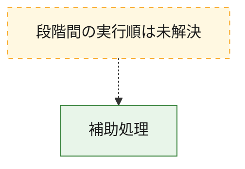
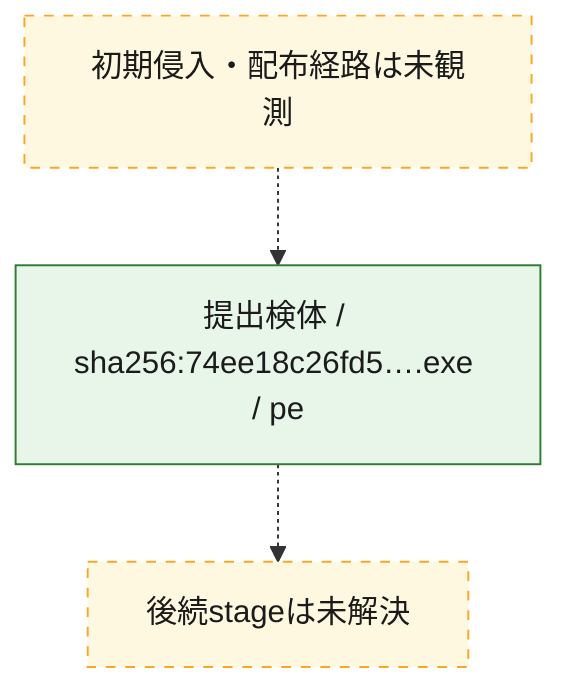
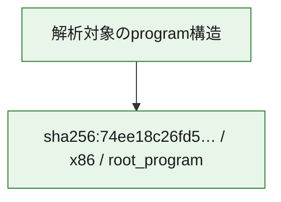

# 全体ロジック：74ee18c26fd53f4e8a8bff1072fbe87b75e89cd53dc7412bd89b5136b37e9635

代表関数から主要なmalware処理段階を自動分類できませんでした。

## 読み方

- phaseの掲載順は解析上の整理順です。observed_call_edgesがない段階間の実行順を断定しません。
- 図の実線は静的に観測した関係、点線と黄色のノードは未観測・未解決の関係を示します。
- 図は静的な要約であり、動的実行を再現するものではありません。
- 詳細な関数解説とfingerprintは[STATIC-LOGIC.md](STATIC-LOGIC.md)を参照してください。

## 静的可視化

### 実行フロー

### 感染チェーン

### モジュール関係

## 処理段階

### 1. 補助処理

主要処理を支える一般内部関数またはlibrary処理を確認します。
確度: `confirmed_static_function_evidence_with_limits`

- `74ee18c26fd53f4e8a8bff1072fbe87b75e89cd53dc7412bd89b5136b37e9635:ghidra:140001510` — 検体内部の一般処理を実装する関数です。 状態: `limited_bad_instruction_or_flow`、選定理由: `context_representative`, `reviewed_call_centrality:1`
- `74ee18c26fd53f4e8a8bff1072fbe87b75e89cd53dc7412bd89b5136b37e9635:ghidra:140001628` — 検体内部の一般処理を実装する関数です。 状態: `limited_bad_instruction_or_flow`、選定理由: `context_representative`, `reviewed_call_centrality:1`
- `74ee18c26fd53f4e8a8bff1072fbe87b75e89cd53dc7412bd89b5136b37e9635:ghidra:14000170c` — 検体内部の一般処理を実装する関数です。 状態: `limited_bad_instruction_or_flow`、選定理由: `context_representative`, `reviewed_call_centrality:1`
- `74ee18c26fd53f4e8a8bff1072fbe87b75e89cd53dc7412bd89b5136b37e9635:ghidra:1400019d0` — 検体内部の一般処理を実装する関数です。 状態: `limited_bad_instruction_or_flow`、選定理由: `context_representative`, `reviewed_call_centrality:1`
- `74ee18c26fd53f4e8a8bff1072fbe87b75e89cd53dc7412bd89b5136b37e9635:ghidra:140001b24` — 検体内部の一般処理を実装する関数です。 状態: `limited_bad_instruction_or_flow`、選定理由: `context_representative`, `reviewed_call_centrality:1`
- `74ee18c26fd53f4e8a8bff1072fbe87b75e89cd53dc7412bd89b5136b37e9635:ghidra:140001fb4` — 検体内部の一般処理を実装する関数です。 状態: `limited_bad_instruction_or_flow`、選定理由: `context_representative`, `reviewed_call_centrality:1`
- `74ee18c26fd53f4e8a8bff1072fbe87b75e89cd53dc7412bd89b5136b37e9635:ghidra:14000204c` — 検体内部の一般処理を実装する関数です。 状態: `limited_bad_instruction_or_flow`、選定理由: `context_representative`, `reviewed_call_centrality:1`
- `74ee18c26fd53f4e8a8bff1072fbe87b75e89cd53dc7412bd89b5136b37e9635:ghidra:1400020e0` — 検体内部の一般処理を実装する関数です。 状態: `limited_bad_instruction_or_flow`、選定理由: `context_representative`, `reviewed_call_centrality:1`
- `74ee18c26fd53f4e8a8bff1072fbe87b75e89cd53dc7412bd89b5136b37e9635:ghidra:140002194` — 検体内部の一般処理を実装する関数です。 状態: `limited_bad_instruction_or_flow`、選定理由: `context_representative`, `reviewed_call_centrality:1`
- `74ee18c26fd53f4e8a8bff1072fbe87b75e89cd53dc7412bd89b5136b37e9635:ghidra:1400025c4` — 検体内部の一般処理を実装する関数です。 状態: `limited_bad_instruction_or_flow`、選定理由: `context_representative`, `reviewed_call_centrality:1`
- `74ee18c26fd53f4e8a8bff1072fbe87b75e89cd53dc7412bd89b5136b37e9635:ghidra:14000277c` — 検体内部の一般処理を実装する関数です。 状態: `limited_bad_instruction_or_flow`、選定理由: `context_representative`, `reviewed_call_centrality:1`
- `74ee18c26fd53f4e8a8bff1072fbe87b75e89cd53dc7412bd89b5136b37e9635:ghidra:140002864` — 検体内部の一般処理を実装する関数です。 状態: `limited_bad_instruction_or_flow`、選定理由: `context_representative`, `reviewed_call_centrality:1`
- `74ee18c26fd53f4e8a8bff1072fbe87b75e89cd53dc7412bd89b5136b37e9635:ghidra:1400028ec` — 検体内部の一般処理を実装する関数です。 状態: `limited_bad_instruction_or_flow`、選定理由: `context_representative`, `reviewed_call_centrality:1`
- `74ee18c26fd53f4e8a8bff1072fbe87b75e89cd53dc7412bd89b5136b37e9635:ghidra:140002b5c` — 検体内部の一般処理を実装する関数です。 状態: `limited_bad_instruction_or_flow`、選定理由: `context_representative`, `reviewed_call_centrality:1`
- `74ee18c26fd53f4e8a8bff1072fbe87b75e89cd53dc7412bd89b5136b37e9635:ghidra:140002e40` — 検体内部の一般処理を実装する関数です。 状態: `limited_bad_instruction_or_flow`、選定理由: `context_representative`, `reviewed_call_centrality:1`
- `74ee18c26fd53f4e8a8bff1072fbe87b75e89cd53dc7412bd89b5136b37e9635:ghidra:1400032fc` — 検体内部の一般処理を実装する関数です。 状態: `limited_bad_instruction_or_flow`、選定理由: `context_representative`, `reviewed_call_centrality:1`
- `74ee18c26fd53f4e8a8bff1072fbe87b75e89cd53dc7412bd89b5136b37e9635:ghidra:140003470` — 検体内部の一般処理を実装する関数です。 状態: `limited_bad_instruction_or_flow`、選定理由: `context_representative`, `reviewed_call_centrality:1`
- `74ee18c26fd53f4e8a8bff1072fbe87b75e89cd53dc7412bd89b5136b37e9635:ghidra:14000360c` — 検体内部の一般処理を実装する関数です。 状態: `limited_bad_instruction_or_flow`、選定理由: `context_representative`, `reviewed_call_centrality:1`
- `74ee18c26fd53f4e8a8bff1072fbe87b75e89cd53dc7412bd89b5136b37e9635:ghidra:14000410c` — 検体内部の一般処理を実装する関数です。 状態: `limited_bad_instruction_or_flow`、選定理由: `context_representative`, `reviewed_call_centrality:1`
- `74ee18c26fd53f4e8a8bff1072fbe87b75e89cd53dc7412bd89b5136b37e9635:ghidra:140004300` — 検体内部の一般処理を実装する関数です。 状態: `limited_bad_instruction_or_flow`、選定理由: `context_representative`, `reviewed_call_centrality:1`
- `74ee18c26fd53f4e8a8bff1072fbe87b75e89cd53dc7412bd89b5136b37e9635:ghidra:140004520` — 検体内部の一般処理を実装する関数です。 状態: `limited_bad_instruction_or_flow`、選定理由: `context_representative`, `reviewed_call_centrality:1`
- `74ee18c26fd53f4e8a8bff1072fbe87b75e89cd53dc7412bd89b5136b37e9635:ghidra:140004e38` — 検体内部の一般処理を実装する関数です。 状態: `limited_bad_instruction_or_flow`、選定理由: `context_representative`, `reviewed_call_centrality:1`
- `74ee18c26fd53f4e8a8bff1072fbe87b75e89cd53dc7412bd89b5136b37e9635:ghidra:140005038` — 検体内部の一般処理を実装する関数です。 状態: `limited_bad_instruction_or_flow`、選定理由: `context_representative`, `reviewed_call_centrality:1`
- `74ee18c26fd53f4e8a8bff1072fbe87b75e89cd53dc7412bd89b5136b37e9635:ghidra:1400051c8` — 検体内部の一般処理を実装する関数です。 状態: `limited_bad_instruction_or_flow`、選定理由: `context_representative`, `reviewed_call_centrality:1`
- `74ee18c26fd53f4e8a8bff1072fbe87b75e89cd53dc7412bd89b5136b37e9635:ghidra:1400053ec` — 検体内部の一般処理を実装する関数です。 状態: `limited_bad_instruction_or_flow`、選定理由: `context_representative`, `reviewed_call_centrality:1`
- `74ee18c26fd53f4e8a8bff1072fbe87b75e89cd53dc7412bd89b5136b37e9635:ghidra:140005630` — 検体内部の一般処理を実装する関数です。 状態: `limited_bad_instruction_or_flow`、選定理由: `context_representative`, `reviewed_call_centrality:1`
- `74ee18c26fd53f4e8a8bff1072fbe87b75e89cd53dc7412bd89b5136b37e9635:ghidra:140005788` — 検体内部の一般処理を実装する関数です。 状態: `limited_bad_instruction_or_flow`、選定理由: `context_representative`, `reviewed_call_centrality:1`
- `74ee18c26fd53f4e8a8bff1072fbe87b75e89cd53dc7412bd89b5136b37e9635:ghidra:140005988` — 検体内部の一般処理を実装する関数です。 状態: `limited_bad_instruction_or_flow`、選定理由: `context_representative`, `reviewed_call_centrality:1`
- `74ee18c26fd53f4e8a8bff1072fbe87b75e89cd53dc7412bd89b5136b37e9635:ghidra:1400059f8` — 検体内部の一般処理を実装する関数です。 状態: `limited_bad_instruction_or_flow`、選定理由: `context_representative`, `reviewed_call_centrality:1`
- `74ee18c26fd53f4e8a8bff1072fbe87b75e89cd53dc7412bd89b5136b37e9635:ghidra:140005bb8` — 検体内部の一般処理を実装する関数です。 状態: `limited_bad_instruction_or_flow`、選定理由: `context_representative`, `reviewed_call_centrality:1`
- `74ee18c26fd53f4e8a8bff1072fbe87b75e89cd53dc7412bd89b5136b37e9635:ghidra:140005c18` — 検体内部の一般処理を実装する関数です。 状態: `limited_bad_instruction_or_flow`、選定理由: `context_representative`, `reviewed_call_centrality:1`
- `74ee18c26fd53f4e8a8bff1072fbe87b75e89cd53dc7412bd89b5136b37e9635:ghidra:140005d24` — 検体内部の一般処理を実装する関数です。 状態: `limited_bad_instruction_or_flow`、選定理由: `context_representative`, `reviewed_call_centrality:1`

## 観測したcall関係

- 代表関数間で直接解決できた呼出関係はありません。

## 解析範囲と制約

- 選定外関数は全体inventoryへ残しますが、関数本体の個別解説対象にはしていません。
- indirect call、難読化、packer、VM、壊れたcontrol flowによりcall関係が欠落する場合があります。
- 文書は静的解析に基づき、検体実行や外部通信による動的確認は行っていません。
