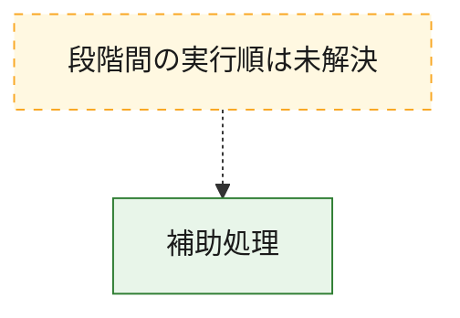
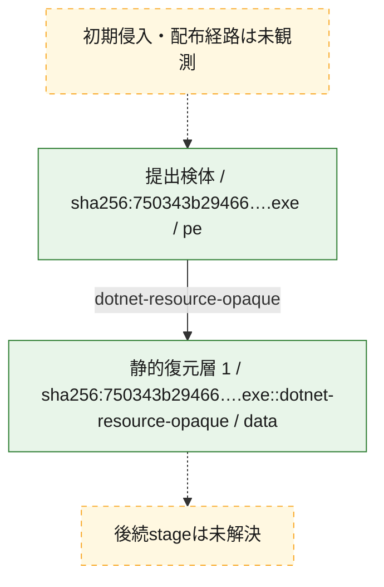
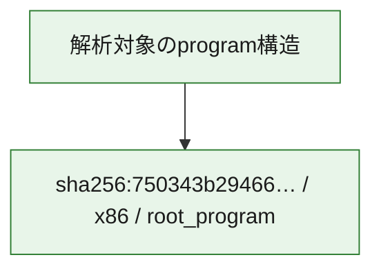

# 全体ロジック：750343b29466f6258ae1d26c00fcbd3e98f2000d80eb9d2ad9496e9fda5c422f

代表関数から主要なmalware処理段階を自動分類できませんでした。

## 読み方

- phaseの掲載順は解析上の整理順です。observed_call_edgesがない段階間の実行順を断定しません。
- 図の実線は静的に観測した関係、点線と黄色のノードは未観測・未解決の関係を示します。
- 図は静的な要約であり、動的実行を再現するものではありません。
- 詳細な関数解説とfingerprintは[STATIC-LOGIC.md](STATIC-LOGIC.md)を参照してください。

## 静的可視化

### 実行フロー

### 感染チェーン

### モジュール関係

## 処理段階

### 1. 補助処理

主要処理を支える一般内部関数またはlibrary処理を確認します。
確度: `confirmed_static_function_evidence`

- `750343b29466f6258ae1d26c00fcbd3e98f2000d80eb9d2ad9496e9fda5c422f:cil:0x0600000a` — 検体内部の一般処理を実装する関数です。 状態: `succeeded`、選定理由: `large_function:instructions=170`, `reviewed_call_centrality:28`
- `750343b29466f6258ae1d26c00fcbd3e98f2000d80eb9d2ad9496e9fda5c422f:cil:0x0600002d` — 検体内部の一般処理を実装する関数です。 状態: `succeeded`、選定理由: `large_function:instructions=3219`, `reviewed_call_centrality:434`
- `750343b29466f6258ae1d26c00fcbd3e98f2000d80eb9d2ad9496e9fda5c422f:cil:0x060000fa` — 検体内部の一般処理を実装する関数です。 状態: `succeeded`、選定理由: `large_function:instructions=112`, `reviewed_call_centrality:34`
- `750343b29466f6258ae1d26c00fcbd3e98f2000d80eb9d2ad9496e9fda5c422f:cil:0x060000fb` — 検体内部の一般処理を実装する関数です。 状態: `succeeded`、選定理由: `large_function:instructions=338`, `reviewed_call_centrality:64`
- `750343b29466f6258ae1d26c00fcbd3e98f2000d80eb9d2ad9496e9fda5c422f:cil:0x060000fc` — 検体内部の一般処理を実装する関数です。 状態: `succeeded`、選定理由: `large_function:instructions=300`, `reviewed_call_centrality:24`
- `750343b29466f6258ae1d26c00fcbd3e98f2000d80eb9d2ad9496e9fda5c422f:cil:0x060000fe` — 検体内部の一般処理を実装する関数です。 状態: `succeeded`、選定理由: `large_function:instructions=324`, `reviewed_call_centrality:134`
- `750343b29466f6258ae1d26c00fcbd3e98f2000d80eb9d2ad9496e9fda5c422f:cil:0x06000100` — 検体内部の一般処理を実装する関数です。 状態: `succeeded`、選定理由: `large_function:instructions=86`, `reviewed_call_centrality:28`
- `750343b29466f6258ae1d26c00fcbd3e98f2000d80eb9d2ad9496e9fda5c422f:cil:0x06000102` — 検体内部の一般処理を実装する関数です。 状態: `succeeded`、選定理由: `large_function:instructions=236`, `reviewed_call_centrality:26`
- `750343b29466f6258ae1d26c00fcbd3e98f2000d80eb9d2ad9496e9fda5c422f:cil:0x06000103` — 検体内部の一般処理を実装する関数です。 状態: `succeeded`、選定理由: `large_function:instructions=265`, `reviewed_call_centrality:36`
- `750343b29466f6258ae1d26c00fcbd3e98f2000d80eb9d2ad9496e9fda5c422f:cil:0x06000104` — 検体内部の一般処理を実装する関数です。 状態: `succeeded`、選定理由: `large_function:instructions=451`, `reviewed_call_centrality:68`
- `750343b29466f6258ae1d26c00fcbd3e98f2000d80eb9d2ad9496e9fda5c422f:cil:0x06000105` — 検体内部の一般処理を実装する関数です。 状態: `succeeded`、選定理由: `large_function:instructions=299`, `reviewed_call_centrality:42`
- `750343b29466f6258ae1d26c00fcbd3e98f2000d80eb9d2ad9496e9fda5c422f:cil:0x0600010a` — 検体内部の一般処理を実装する関数です。 状態: `succeeded`、選定理由: `large_function:instructions=101`, `reviewed_call_centrality:26`
- `750343b29466f6258ae1d26c00fcbd3e98f2000d80eb9d2ad9496e9fda5c422f:cil:0x0600010b` — 検体内部の一般処理を実装する関数です。 状態: `succeeded`、選定理由: `large_function:instructions=72`, `reviewed_call_centrality:30`
- `750343b29466f6258ae1d26c00fcbd3e98f2000d80eb9d2ad9496e9fda5c422f:cil:0x0600011f` — 検体内部の一般処理を実装する関数です。 状態: `succeeded`、選定理由: `large_function:instructions=163`, `reviewed_call_centrality:24`
- `750343b29466f6258ae1d26c00fcbd3e98f2000d80eb9d2ad9496e9fda5c422f:cil:0x06000162` — 検体内部の一般処理を実装する関数です。 状態: `succeeded`、選定理由: `large_function:instructions=240`, `reviewed_call_centrality:42`
- `750343b29466f6258ae1d26c00fcbd3e98f2000d80eb9d2ad9496e9fda5c422f:cil:0x06000174` — 検体内部の一般処理を実装する関数です。 状態: `succeeded`、選定理由: `large_function:instructions=2495`, `reviewed_call_centrality:286`
- `750343b29466f6258ae1d26c00fcbd3e98f2000d80eb9d2ad9496e9fda5c422f:cil:0x060001d6` — 検体内部の一般処理を実装する関数です。 状態: `succeeded`、選定理由: `large_function:instructions=230`, `reviewed_call_centrality:32`
- `750343b29466f6258ae1d26c00fcbd3e98f2000d80eb9d2ad9496e9fda5c422f:cil:0x060001d8` — 検体内部の一般処理を実装する関数です。 状態: `succeeded`、選定理由: `large_function:instructions=123`, `reviewed_call_centrality:32`
- `750343b29466f6258ae1d26c00fcbd3e98f2000d80eb9d2ad9496e9fda5c422f:cil:0x060001db` — 検体内部の一般処理を実装する関数です。 状態: `succeeded`、選定理由: `large_function:instructions=107`, `reviewed_call_centrality:24`
- `750343b29466f6258ae1d26c00fcbd3e98f2000d80eb9d2ad9496e9fda5c422f:cil:0x060001dc` — 検体内部の一般処理を実装する関数です。 状態: `succeeded`、選定理由: `large_function:instructions=155`, `reviewed_call_centrality:54`
- `750343b29466f6258ae1d26c00fcbd3e98f2000d80eb9d2ad9496e9fda5c422f:cil:0x060001dd` — 検体内部の一般処理を実装する関数です。 状態: `succeeded`、選定理由: `large_function:instructions=143`, `reviewed_call_centrality:24`
- `750343b29466f6258ae1d26c00fcbd3e98f2000d80eb9d2ad9496e9fda5c422f:cil:0x060001de` — 検体内部の一般処理を実装する関数です。 状態: `succeeded`、選定理由: `large_function:instructions=851`, `reviewed_call_centrality:108`
- `750343b29466f6258ae1d26c00fcbd3e98f2000d80eb9d2ad9496e9fda5c422f:cil:0x060001df` — 検体内部の一般処理を実装する関数です。 状態: `succeeded`、選定理由: `large_function:instructions=331`, `reviewed_call_centrality:46`
- `750343b29466f6258ae1d26c00fcbd3e98f2000d80eb9d2ad9496e9fda5c422f:cil:0x060001e6` — 検体内部の一般処理を実装する関数です。 状態: `succeeded`、選定理由: `large_function:instructions=290`, `reviewed_call_centrality:58`
- `750343b29466f6258ae1d26c00fcbd3e98f2000d80eb9d2ad9496e9fda5c422f:cil:0x060001e7` — 検体内部の一般処理を実装する関数です。 状態: `succeeded`、選定理由: `large_function:instructions=237`, `reviewed_call_centrality:46`
- `750343b29466f6258ae1d26c00fcbd3e98f2000d80eb9d2ad9496e9fda5c422f:cil:0x06000207` — compiler生成処理または汎用library処理とみられる関数です。 状態: `succeeded`、選定理由: `reviewed_call_centrality:20`
- `750343b29466f6258ae1d26c00fcbd3e98f2000d80eb9d2ad9496e9fda5c422f:cil:0x0600021c` — 検体内部の一般処理を実装する関数です。 状態: `succeeded`、選定理由: `large_function:instructions=177`, `reviewed_call_centrality:40`
- `750343b29466f6258ae1d26c00fcbd3e98f2000d80eb9d2ad9496e9fda5c422f:cil:0x0600025d` — 検体内部の一般処理を実装する関数です。 状態: `succeeded`、選定理由: `large_function:instructions=3768`, `reviewed_call_centrality:366`
- `750343b29466f6258ae1d26c00fcbd3e98f2000d80eb9d2ad9496e9fda5c422f:cil:0x060002f0` — 検体内部の一般処理を実装する関数です。 状態: `succeeded`、選定理由: `large_function:instructions=205`, `reviewed_call_centrality:36`
- `750343b29466f6258ae1d26c00fcbd3e98f2000d80eb9d2ad9496e9fda5c422f:cil:0x060002f2` — 検体内部の一般処理を実装する関数です。 状態: `succeeded`、選定理由: `large_function:instructions=84`, `reviewed_call_centrality:32`
- `750343b29466f6258ae1d26c00fcbd3e98f2000d80eb9d2ad9496e9fda5c422f:cil:0x060002f3` — 検体内部の一般処理を実装する関数です。 状態: `succeeded`、選定理由: `large_function:instructions=384`, `reviewed_call_centrality:52`
- `750343b29466f6258ae1d26c00fcbd3e98f2000d80eb9d2ad9496e9fda5c422f:cil:0x060002f6` — 検体内部の一般処理を実装する関数です。 状態: `succeeded`、選定理由: `large_function:instructions=220`, `reviewed_call_centrality:30`

## 観測したcall関係

- 代表関数間で直接解決できた呼出関係はありません。

## 解析範囲と制約

- 選定外関数は全体inventoryへ残しますが、関数本体の個別解説対象にはしていません。
- indirect call、難読化、packer、VM、壊れたcontrol flowによりcall関係が欠落する場合があります。
- 文書は静的解析に基づき、検体実行や外部通信による動的確認は行っていません。
