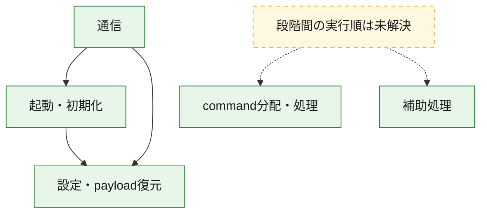
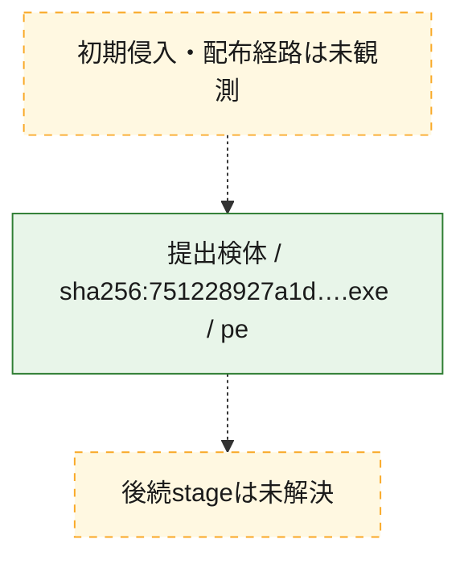
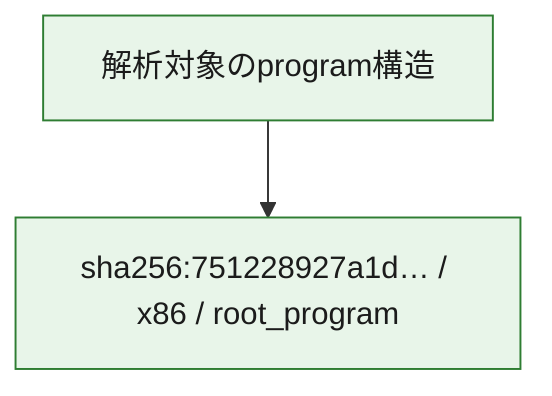

# 全体ロジック：751228927a1d5deba6410ff74d8868cfeb0de27dd43617d09d44bbbfe7d75f1d

代表関数の静的証跡から、起動・初期化、設定・payload復元、通信、command分配・処理の処理群を確認しました。

## 読み方

- phaseの掲載順は解析上の整理順です。observed_call_edgesがない段階間の実行順を断定しません。
- 図の実線は静的に観測した関係、点線と黄色のノードは未観測・未解決の関係を示します。
- 図は静的な要約であり、動的実行を再現するものではありません。
- 詳細な関数解説とfingerprintは[STATIC-LOGIC.md](STATIC-LOGIC.md)を参照してください。

## 静的可視化

### 実行フロー

### 感染チェーン

### モジュール関係

## 処理段階

### 1. 起動・初期化

entry pointから初期化と後続処理への移行を確認します。
確度: `confirmed_static_function_evidence`

- `751228927a1d5deba6410ff74d8868cfeb0de27dd43617d09d44bbbfe7d75f1d:ghidra:140009ae7` — 初期化と主要処理への分岐を行う入口関数です。 状態: `succeeded`、選定理由: `entry_point`, `meaningful_symbol_name`, `reviewed_call_centrality:7`, `role:entrypoint`
- `751228927a1d5deba6410ff74d8868cfeb0de27dd43617d09d44bbbfe7d75f1d:ghidra:14000fe94` — 初期化と主要処理への分岐を行う入口関数です。 状態: `succeeded`、選定理由: `entry_point`, `meaningful_symbol_name`, `probable_go_main_user_code`, `reviewed_call_centrality:23`, `role:entrypoint`

### 2. 設定・payload復元

設定、resource、payload、暗号化データの復元・変換を確認します。
確度: `confirmed_static_function_evidence`

- `751228927a1d5deba6410ff74d8868cfeb0de27dd43617d09d44bbbfe7d75f1d:ghidra:1400016e1` — 設定、resource、payloadなどの解析・変換を行う関数です。 状態: `succeeded`、選定理由: `meaningful_symbol_name`, `reviewed_call_centrality:1`, `role:config_or_data_transform`
- `751228927a1d5deba6410ff74d8868cfeb0de27dd43617d09d44bbbfe7d75f1d:ghidra:140001c94` — 設定、resource、payloadなどの解析・変換を行う関数です。 状態: `succeeded`、選定理由: `meaningful_symbol_name`, `reviewed_call_centrality:1`, `role:config_or_data_transform`
- `751228927a1d5deba6410ff74d8868cfeb0de27dd43617d09d44bbbfe7d75f1d:ghidra:1400022ae` — 暗号、hash、encoding、または復号処理に関係する関数です。 状態: `succeeded`、選定理由: `meaningful_symbol_name`, `reviewed_call_centrality:4`, `role:cryptographic_transform`
- `751228927a1d5deba6410ff74d8868cfeb0de27dd43617d09d44bbbfe7d75f1d:ghidra:140002ecc` — 暗号、hash、encoding、または復号処理に関係する関数です。 状態: `succeeded`、選定理由: `meaningful_symbol_name`, `reviewed_call_centrality:4`, `role:cryptographic_transform`
- `751228927a1d5deba6410ff74d8868cfeb0de27dd43617d09d44bbbfe7d75f1d:ghidra:140002fb6` — 暗号、hash、encoding、または復号処理に関係する関数です。 状態: `succeeded`、選定理由: `meaningful_symbol_name`, `reviewed_call_centrality:12`, `role:cryptographic_transform`
- `751228927a1d5deba6410ff74d8868cfeb0de27dd43617d09d44bbbfe7d75f1d:ghidra:1400031e9` — 設定、resource、payloadなどの解析・変換を行う関数です。 状態: `succeeded`、選定理由: `meaningful_symbol_name`, `reviewed_call_centrality:13`, `role:config_or_data_transform`
- `751228927a1d5deba6410ff74d8868cfeb0de27dd43617d09d44bbbfe7d75f1d:ghidra:140003c95` — 設定、resource、payloadなどの解析・変換を行う関数です。 状態: `succeeded`、選定理由: `meaningful_symbol_name`, `reviewed_call_centrality:1`, `role:config_or_data_transform`
- `751228927a1d5deba6410ff74d8868cfeb0de27dd43617d09d44bbbfe7d75f1d:ghidra:140005261` — 設定、resource、payloadなどの解析・変換を行う関数です。 状態: `succeeded`、選定理由: `meaningful_symbol_name`, `reviewed_call_centrality:2`, `role:config_or_data_transform`
- `751228927a1d5deba6410ff74d8868cfeb0de27dd43617d09d44bbbfe7d75f1d:ghidra:140005dfb` — 暗号、hash、encoding、または復号処理に関係する関数です。 状態: `succeeded`、選定理由: `meaningful_symbol_name`, `reviewed_call_centrality:2`, `role:cryptographic_transform`
- `751228927a1d5deba6410ff74d8868cfeb0de27dd43617d09d44bbbfe7d75f1d:ghidra:140005f7d` — 設定、resource、payloadなどの解析・変換を行う関数です。 状態: `succeeded`、選定理由: `meaningful_symbol_name`, `reviewed_call_centrality:12`, `role:config_or_data_transform`
- `751228927a1d5deba6410ff74d8868cfeb0de27dd43617d09d44bbbfe7d75f1d:ghidra:1400064c3` — 設定、resource、payloadなどの解析・変換を行う関数です。 状態: `succeeded`、選定理由: `meaningful_symbol_name`, `reviewed_call_centrality:9`, `role:config_or_data_transform`
- `751228927a1d5deba6410ff74d8868cfeb0de27dd43617d09d44bbbfe7d75f1d:ghidra:140008237` — 設定、resource、payloadなどの解析・変換を行う関数です。 状態: `succeeded`、選定理由: `meaningful_symbol_name`, `reviewed_call_centrality:1`, `role:config_or_data_transform`
- `751228927a1d5deba6410ff74d8868cfeb0de27dd43617d09d44bbbfe7d75f1d:ghidra:14000a69a` — 設定、resource、payloadなどの解析・変換を行う関数です。 状態: `succeeded`、選定理由: `meaningful_symbol_name`, `reviewed_call_centrality:7`, `role:config_or_data_transform`

### 3. 通信

通信初期化、endpoint処理、送受信の役割を確認します。
確度: `confirmed_static_function_evidence`

- `751228927a1d5deba6410ff74d8868cfeb0de27dd43617d09d44bbbfe7d75f1d:ghidra:140005b93` — 通信初期化、送受信、またはendpoint処理に関係する関数です。 状態: `succeeded`、選定理由: `meaningful_symbol_name`, `reviewed_call_centrality:3`, `role:network_communication`
- `751228927a1d5deba6410ff74d8868cfeb0de27dd43617d09d44bbbfe7d75f1d:ghidra:140006a82` — 通信初期化、送受信、またはendpoint処理に関係する関数です。 状態: `succeeded`、選定理由: `meaningful_symbol_name`, `reviewed_call_centrality:3`, `role:network_communication`
- `751228927a1d5deba6410ff74d8868cfeb0de27dd43617d09d44bbbfe7d75f1d:ghidra:1400076c2` — 通信初期化、送受信、またはendpoint処理に関係する関数です。 状態: `succeeded`、選定理由: `meaningful_symbol_name`, `reviewed_call_centrality:3`, `role:network_communication`
- `751228927a1d5deba6410ff74d8868cfeb0de27dd43617d09d44bbbfe7d75f1d:ghidra:140009029` — 通信初期化、送受信、またはendpoint処理に関係する関数です。 状態: `succeeded`、選定理由: `meaningful_symbol_name`, `reviewed_call_centrality:20`, `role:network_communication`
- `751228927a1d5deba6410ff74d8868cfeb0de27dd43617d09d44bbbfe7d75f1d:ghidra:140009269` — 通信初期化、送受信、またはendpoint処理に関係する関数です。 状態: `succeeded`、選定理由: `meaningful_symbol_name`, `reviewed_call_centrality:5`, `role:network_communication`
- `751228927a1d5deba6410ff74d8868cfeb0de27dd43617d09d44bbbfe7d75f1d:ghidra:1400095c6` — 通信初期化、送受信、またはendpoint処理に関係する関数です。 状態: `succeeded`、選定理由: `meaningful_symbol_name`, `reviewed_call_centrality:3`, `role:network_communication`
- `751228927a1d5deba6410ff74d8868cfeb0de27dd43617d09d44bbbfe7d75f1d:ghidra:140009625` — 通信初期化、送受信、またはendpoint処理に関係する関数です。 状態: `succeeded`、選定理由: `meaningful_symbol_name`, `reviewed_call_centrality:4`, `role:network_communication`
- `751228927a1d5deba6410ff74d8868cfeb0de27dd43617d09d44bbbfe7d75f1d:ghidra:140009761` — 通信初期化、送受信、またはendpoint処理に関係する関数です。 状態: `succeeded`、選定理由: `meaningful_symbol_name`, `reviewed_call_centrality:9`, `role:network_communication`
- `751228927a1d5deba6410ff74d8868cfeb0de27dd43617d09d44bbbfe7d75f1d:ghidra:140009ed5` — 通信初期化、送受信、またはendpoint処理に関係する関数です。 状態: `succeeded`、選定理由: `meaningful_symbol_name`, `reviewed_call_centrality:3`, `role:network_communication`
- `751228927a1d5deba6410ff74d8868cfeb0de27dd43617d09d44bbbfe7d75f1d:ghidra:140009fc9` — 通信初期化、送受信、またはendpoint処理に関係する関数です。 状態: `succeeded`、選定理由: `meaningful_symbol_name`, `reviewed_call_centrality:15`, `role:network_communication`
- `751228927a1d5deba6410ff74d8868cfeb0de27dd43617d09d44bbbfe7d75f1d:ghidra:14000b537` — 通信初期化、送受信、またはendpoint処理に関係する関数です。 状態: `succeeded`、選定理由: `meaningful_symbol_name`, `reviewed_call_centrality:11`, `role:network_communication`

### 4. command分配・処理

受信commandやtaskの解釈、分配、個別handlerへの移行を確認します。
確度: `confirmed_static_function_evidence`

- `751228927a1d5deba6410ff74d8868cfeb0de27dd43617d09d44bbbfe7d75f1d:ghidra:14000ae79` — commandの解釈、分配、または個別処理を担当する関数です。 状態: `succeeded`、選定理由: `meaningful_symbol_name`, `reviewed_call_centrality:5`, `role:command_dispatch_or_handler`
- `751228927a1d5deba6410ff74d8868cfeb0de27dd43617d09d44bbbfe7d75f1d:ghidra:14000b6f4` — commandの解釈、分配、または個別処理を担当する関数です。 状態: `succeeded`、選定理由: `meaningful_symbol_name`, `reviewed_call_centrality:5`, `role:command_dispatch_or_handler`
- `751228927a1d5deba6410ff74d8868cfeb0de27dd43617d09d44bbbfe7d75f1d:ghidra:14000bafb` — commandの解釈、分配、または個別処理を担当する関数です。 状態: `succeeded`、選定理由: `meaningful_symbol_name`, `reviewed_call_centrality:7`, `role:command_dispatch_or_handler`

### 5. 補助処理

主要処理を支える一般内部関数またはlibrary処理を確認します。
確度: `confirmed_static_function_evidence`

- `751228927a1d5deba6410ff74d8868cfeb0de27dd43617d09d44bbbfe7d75f1d:ghidra:140001410` — 検体内部の一般処理を実装する関数です。 状態: `succeeded`、選定理由: `entry_point`, `meaningful_symbol_name`, `reviewed_call_centrality:1`
- `751228927a1d5deba6410ff74d8868cfeb0de27dd43617d09d44bbbfe7d75f1d:ghidra:140010630` — compiler生成処理または汎用library処理とみられる関数です。 状態: `succeeded`、選定理由: `entry_point`, `meaningful_symbol_name`, `reviewed_call_centrality:1`
- `751228927a1d5deba6410ff74d8868cfeb0de27dd43617d09d44bbbfe7d75f1d:ghidra:140010660` — compiler生成処理または汎用library処理とみられる関数です。 状態: `succeeded`、選定理由: `entry_point`, `meaningful_symbol_name`, `reviewed_call_centrality:2`

## 観測したcall関係

- `751228927a1d5deba6410ff74d8868cfeb0de27dd43617d09d44bbbfe7d75f1d:ghidra:140002fb6` → `751228927a1d5deba6410ff74d8868cfeb0de27dd43617d09d44bbbfe7d75f1d:ghidra:140002ecc` （`configuration` → `configuration`）
- `751228927a1d5deba6410ff74d8868cfeb0de27dd43617d09d44bbbfe7d75f1d:ghidra:1400031e9` → `751228927a1d5deba6410ff74d8868cfeb0de27dd43617d09d44bbbfe7d75f1d:ghidra:140002ecc` （`configuration` → `configuration`）
- `751228927a1d5deba6410ff74d8868cfeb0de27dd43617d09d44bbbfe7d75f1d:ghidra:140005dfb` → `751228927a1d5deba6410ff74d8868cfeb0de27dd43617d09d44bbbfe7d75f1d:ghidra:1400022ae` （`configuration` → `configuration`）
- `751228927a1d5deba6410ff74d8868cfeb0de27dd43617d09d44bbbfe7d75f1d:ghidra:1400064c3` → `751228927a1d5deba6410ff74d8868cfeb0de27dd43617d09d44bbbfe7d75f1d:ghidra:1400031e9` （`configuration` → `configuration`）
- `751228927a1d5deba6410ff74d8868cfeb0de27dd43617d09d44bbbfe7d75f1d:ghidra:1400064c3` → `751228927a1d5deba6410ff74d8868cfeb0de27dd43617d09d44bbbfe7d75f1d:ghidra:140005f7d` （`configuration` → `configuration`）
- `751228927a1d5deba6410ff74d8868cfeb0de27dd43617d09d44bbbfe7d75f1d:ghidra:140006a82` → `751228927a1d5deba6410ff74d8868cfeb0de27dd43617d09d44bbbfe7d75f1d:ghidra:140005b93` （`communication` → `communication`）
- `751228927a1d5deba6410ff74d8868cfeb0de27dd43617d09d44bbbfe7d75f1d:ghidra:140009269` → `751228927a1d5deba6410ff74d8868cfeb0de27dd43617d09d44bbbfe7d75f1d:ghidra:140009029` （`communication` → `communication`）
- `751228927a1d5deba6410ff74d8868cfeb0de27dd43617d09d44bbbfe7d75f1d:ghidra:140009761` → `751228927a1d5deba6410ff74d8868cfeb0de27dd43617d09d44bbbfe7d75f1d:ghidra:140002fb6` （`communication` → `configuration`）
- `751228927a1d5deba6410ff74d8868cfeb0de27dd43617d09d44bbbfe7d75f1d:ghidra:140009761` → `751228927a1d5deba6410ff74d8868cfeb0de27dd43617d09d44bbbfe7d75f1d:ghidra:1400095c6` （`communication` → `communication`）
- `751228927a1d5deba6410ff74d8868cfeb0de27dd43617d09d44bbbfe7d75f1d:ghidra:140009fc9` → `751228927a1d5deba6410ff74d8868cfeb0de27dd43617d09d44bbbfe7d75f1d:ghidra:140009ae7` （`communication` → `startup`）
- `751228927a1d5deba6410ff74d8868cfeb0de27dd43617d09d44bbbfe7d75f1d:ghidra:140009fc9` → `751228927a1d5deba6410ff74d8868cfeb0de27dd43617d09d44bbbfe7d75f1d:ghidra:140009ed5` （`communication` → `communication`）
- `751228927a1d5deba6410ff74d8868cfeb0de27dd43617d09d44bbbfe7d75f1d:ghidra:14000b537` → `751228927a1d5deba6410ff74d8868cfeb0de27dd43617d09d44bbbfe7d75f1d:ghidra:140009fc9` （`communication` → `communication`）
- `751228927a1d5deba6410ff74d8868cfeb0de27dd43617d09d44bbbfe7d75f1d:ghidra:14000fe94` → `751228927a1d5deba6410ff74d8868cfeb0de27dd43617d09d44bbbfe7d75f1d:ghidra:1400064c3` （`startup` → `configuration`）
- `ghidra-function:1b8c88ffcc25f5b818dd398f` → `ghidra-external:0441eaf0d6ee141d71df0719` （`unclassified` → `unclassified`）
- `ghidra-function:1b8c88ffcc25f5b818dd398f` → `ghidra-external:16fbca5952a98b4c0dac0f45` （`unclassified` → `unclassified`）
- `ghidra-function:1b8c88ffcc25f5b818dd398f` → `ghidra-external:2c129c5e60f783c702f66d54` （`unclassified` → `unclassified`）
- `ghidra-function:1b8c88ffcc25f5b818dd398f` → `ghidra-function:660736ff8f757fb58faa01f0` （`unclassified` → `unclassified`）
- `ghidra-function:1b8c88ffcc25f5b818dd398f` → `ghidra-function:8eed8b7e75b6150ce4b85b10` （`unclassified` → `unclassified`）
- `ghidra-function:1b8c88ffcc25f5b818dd398f` → `ghidra-function:d8d96d30db37877a870525dd` （`unclassified` → `unclassified`）
- `ghidra-function:1b8c88ffcc25f5b818dd398f` → `ghidra-function:f8e652915fb253987f6e51d4` （`unclassified` → `unclassified`）
- `ghidra-function:1ec0ce9ca13c8a8d5467ec33` → `ghidra-external:22999245bef1377e32b32575` （`unclassified` → `unclassified`）
- `ghidra-function:1ec0ce9ca13c8a8d5467ec33` → `ghidra-external:546d484323fe34f22476bdb3` （`unclassified` → `unclassified`）
- `ghidra-function:252d9e82e665f7d345ca09c7` → `ghidra-function:e1b19c8158227f873d2f3e54` （`unclassified` → `unclassified`）
- `ghidra-function:32fb19d807362af013286c32` → `ghidra-external:0441eaf0d6ee141d71df0719` （`unclassified` → `unclassified`）
- `ghidra-function:32fb19d807362af013286c32` → `ghidra-external:2c129c5e60f783c702f66d54` （`unclassified` → `unclassified`）
- `ghidra-function:32fb19d807362af013286c32` → `ghidra-external:3de9d3235ff278572fa8fe33` （`unclassified` → `unclassified`）
- `ghidra-function:32fb19d807362af013286c32` → `ghidra-external:a6f177711e17a5837f1a4d03` （`unclassified` → `unclassified`）
- `ghidra-function:32fb19d807362af013286c32` → `ghidra-external:d1d01d3f43b0daed2d0e6d1c` （`unclassified` → `unclassified`）
- `ghidra-function:32fb19d807362af013286c32` → `ghidra-function:06405113160e358a14e6afab` （`unclassified` → `unclassified`）
- `ghidra-function:32fb19d807362af013286c32` → `ghidra-function:1039eccc872ca1f929e5716e` （`unclassified` → `unclassified`）
- `ghidra-function:32fb19d807362af013286c32` → `ghidra-function:1b8b3588a07fa103e09ed34d` （`unclassified` → `unclassified`）
- `ghidra-function:32fb19d807362af013286c32` → `ghidra-function:268d452edd06a8c40aaab66a` （`unclassified` → `unclassified`）
- `ghidra-function:32fb19d807362af013286c32` → `ghidra-function:4a22e65c9567a6f4e01a59bf` （`unclassified` → `unclassified`）
- `ghidra-function:32fb19d807362af013286c32` → `ghidra-function:5d24e05a495844573febfb6a` （`unclassified` → `unclassified`）
- `ghidra-function:32fb19d807362af013286c32` → `ghidra-function:d5fe6e9d19ddece2a8894ab4` （`unclassified` → `unclassified`）
- `ghidra-function:3ba9922b0dc647ad5d04c8a4` → `ghidra-function:9fae46ca51e3cc60faaf9c67` （`unclassified` → `unclassified`）
- `ghidra-function:3ca9aa636ce3b50d6b6d7e00` → `ghidra-external:bad09f838b62b8decdb86d7a` （`unclassified` → `unclassified`）
- `ghidra-function:3ca9aa636ce3b50d6b6d7e00` → `ghidra-function:9fae46ca51e3cc60faaf9c67` （`unclassified` → `unclassified`）
- `ghidra-function:464ce481507f52265d00669f` → `ghidra-function:78dfe2de34c7dc07a5f4b6cd` （`unclassified` → `unclassified`）
- `ghidra-function:51a340ee2d6e6c11c339f47d` → `ghidra-external:0441eaf0d6ee141d71df0719` （`unclassified` → `unclassified`）
- `ghidra-function:51a340ee2d6e6c11c339f47d` → `ghidra-external:16fbca5952a98b4c0dac0f45` （`unclassified` → `unclassified`）
- `ghidra-function:524dcc6455e79da8b3352894` → `ghidra-external:2160024c1e0cac306185b723` （`unclassified` → `unclassified`）
- `ghidra-function:660736ff8f757fb58faa01f0` → `ghidra-external:375e47caccba752709023318` （`unclassified` → `unclassified`）
- `ghidra-function:660736ff8f757fb58faa01f0` → `ghidra-external:499676494ee47b0f4b4dca44` （`unclassified` → `unclassified`）
- `ghidra-function:660736ff8f757fb58faa01f0` → `ghidra-external:546d484323fe34f22476bdb3` （`unclassified` → `unclassified`）
- `ghidra-function:660736ff8f757fb58faa01f0` → `ghidra-external:71788e80bbb9f3f05a0a7617` （`unclassified` → `unclassified`）
- `ghidra-function:660736ff8f757fb58faa01f0` → `ghidra-external:8a154907039d4de1ab1fa232` （`unclassified` → `unclassified`）
- `ghidra-function:660736ff8f757fb58faa01f0` → `ghidra-external:a66771cce502319b8af1b9c8` （`unclassified` → `unclassified`）
- `ghidra-function:660736ff8f757fb58faa01f0` → `ghidra-external:b5bdc732e35fe4d17d85c269` （`unclassified` → `unclassified`）
- `ghidra-function:660736ff8f757fb58faa01f0` → `ghidra-function:77710d057b40fb059d7d9bb1` （`unclassified` → `unclassified`）
- `ghidra-function:660736ff8f757fb58faa01f0` → `ghidra-function:bc4912baea8601d3b63312f4` （`unclassified` → `unclassified`）
- `ghidra-function:660736ff8f757fb58faa01f0` → `ghidra-function:ce2ac008134d5fa0c8c7b926` （`unclassified` → `unclassified`）
- `ghidra-function:660736ff8f757fb58faa01f0` → `ghidra-function:e2ad3cdc2c68676d0ff9684a` （`unclassified` → `unclassified`）
- `ghidra-function:660736ff8f757fb58faa01f0` → `ghidra-function:ef11cf37acd94a810136b6bf` （`unclassified` → `unclassified`）
- `ghidra-function:665e89b9837e5674e2df4832` → `ghidra-function:9e04a89654b9ca4e32481897` （`unclassified` → `unclassified`）
- `ghidra-function:6c742512a466ffd950064c03` → `ghidra-external:32e37edbf5202558b85eb652` （`unclassified` → `unclassified`）
- `ghidra-function:6c742512a466ffd950064c03` → `ghidra-function:4bb6724e523e1a946ca68953` （`unclassified` → `unclassified`）
- `ghidra-function:6da237fdbd8a9bc957cd6e7a` → `ghidra-external:16fbca5952a98b4c0dac0f45` （`unclassified` → `unclassified`）
- `ghidra-function:6da237fdbd8a9bc957cd6e7a` → `ghidra-external:499676494ee47b0f4b4dca44` （`unclassified` → `unclassified`）
- `ghidra-function:6da237fdbd8a9bc957cd6e7a` → `ghidra-external:4dccd520780cb82e26d4a229` （`unclassified` → `unclassified`）
- `ghidra-function:6da237fdbd8a9bc957cd6e7a` → `ghidra-function:6a74411d74d398511fa9d893` （`unclassified` → `unclassified`）
- `ghidra-function:7dc41f25de4859ea27350fe5` → `ghidra-function:185294ba94b304a362f07d04` （`unclassified` → `unclassified`）
- `ghidra-function:7dc41f25de4859ea27350fe5` → `ghidra-function:1ce59db1f54a63df11e73364` （`unclassified` → `unclassified`）
- `ghidra-function:7dc41f25de4859ea27350fe5` → `ghidra-function:2ad2dc96e9b14b3285e066a6` （`unclassified` → `unclassified`）
- `ghidra-function:7dc41f25de4859ea27350fe5` → `ghidra-function:4f2944aaeda1aa0af275cb53` （`unclassified` → `unclassified`）
- `ghidra-function:7dc41f25de4859ea27350fe5` → `ghidra-function:5dbf0120c144289f4c424863` （`unclassified` → `unclassified`）
- `ghidra-function:7dc41f25de4859ea27350fe5` → `ghidra-function:5fcd623eec2638d1acd6a597` （`unclassified` → `unclassified`）
- `ghidra-function:7dc41f25de4859ea27350fe5` → `ghidra-function:8475b9a981e3577f3fbf2663` （`unclassified` → `unclassified`）
- `ghidra-function:7dc41f25de4859ea27350fe5` → `ghidra-function:b08aa76e6909b761b722eab3` （`unclassified` → `unclassified`）
- `ghidra-function:7dc41f25de4859ea27350fe5` → `ghidra-function:b3bb523b3d5dc5dc50e807c1` （`unclassified` → `unclassified`）
- `ghidra-function:7dc41f25de4859ea27350fe5` → `ghidra-function:cc0ec4211e51d292d776b67d` （`unclassified` → `unclassified`）
- `ghidra-function:7dc41f25de4859ea27350fe5` → `ghidra-function:dfffb590008852d0f39eb302` （`unclassified` → `unclassified`）
- `ghidra-function:9c5de5d9b6cb9a0accf8672e` → `ghidra-function:65dccc23780ce5214c51aa96` （`unclassified` → `unclassified`）
- `ghidra-function:9c5de5d9b6cb9a0accf8672e` → `ghidra-function:9cfa531c0223932484e329a0` （`unclassified` → `unclassified`）
- `ghidra-function:9cfa531c0223932484e329a0` → `ghidra-function:51b130aa8930845515be23fa` （`unclassified` → `unclassified`）
- `ghidra-function:9cfa531c0223932484e329a0` → `ghidra-function:665cd5917e0e79b29b5a544b` （`unclassified` → `unclassified`）
- `ghidra-function:9cfa531c0223932484e329a0` → `ghidra-function:acb7dcf961df74434bd43db1` （`unclassified` → `unclassified`）
- `ghidra-function:aab7afbed9147238f55ef3ea` → `ghidra-external:2160024c1e0cac306185b723` （`unclassified` → `unclassified`）
- `ghidra-function:aab7afbed9147238f55ef3ea` → `ghidra-external:2c129c5e60f783c702f66d54` （`unclassified` → `unclassified`）
- `ghidra-function:aab7afbed9147238f55ef3ea` → `ghidra-external:3de9d3235ff278572fa8fe33` （`unclassified` → `unclassified`）
- `ghidra-function:aab7afbed9147238f55ef3ea` → `ghidra-external:546d484323fe34f22476bdb3` （`unclassified` → `unclassified`）
- `ghidra-function:aab7afbed9147238f55ef3ea` → `ghidra-external:5e237c931440a0dba4f7412e` （`unclassified` → `unclassified`）
- `ghidra-function:aab7afbed9147238f55ef3ea` → `ghidra-external:a6f177711e17a5837f1a4d03` （`unclassified` → `unclassified`）
- `ghidra-function:aab7afbed9147238f55ef3ea` → `ghidra-external:a8db3796109f61f1069a07f7` （`unclassified` → `unclassified`）
- `ghidra-function:af47f3ce97514e0c95552bc5` → `ghidra-external:22999245bef1377e32b32575` （`unclassified` → `unclassified`）
- `ghidra-function:af47f3ce97514e0c95552bc5` → `ghidra-external:546d484323fe34f22476bdb3` （`unclassified` → `unclassified`）
- `ghidra-function:af47f3ce97514e0c95552bc5` → `ghidra-external:f8756a046985675fae6659cf` （`unclassified` → `unclassified`）
- `ghidra-function:af47f3ce97514e0c95552bc5` → `ghidra-external:faf2ebc80238fc0769181fbe` （`unclassified` → `unclassified`）
- `ghidra-function:af47f3ce97514e0c95552bc5` → `ghidra-function:3f3a1f99dced755a0173dfc4` （`unclassified` → `unclassified`）
- `ghidra-function:af47f3ce97514e0c95552bc5` → `ghidra-function:fb25c19b62ed53503ad7f91a` （`unclassified` → `unclassified`）
- `ghidra-function:b3bb523b3d5dc5dc50e807c1` → `ghidra-external:16fbca5952a98b4c0dac0f45` （`unclassified` → `unclassified`）
- `ghidra-function:b3bb523b3d5dc5dc50e807c1` → `ghidra-external:2c129c5e60f783c702f66d54` （`unclassified` → `unclassified`）
- `ghidra-function:b3bb523b3d5dc5dc50e807c1` → `ghidra-external:499676494ee47b0f4b4dca44` （`unclassified` → `unclassified`）
- `ghidra-function:b3bb523b3d5dc5dc50e807c1` → `ghidra-external:4cfc6c2fb9084e2127cf4b85` （`unclassified` → `unclassified`）
- `ghidra-function:b3bb523b3d5dc5dc50e807c1` → `ghidra-external:4ff152ce58fc395edebca4af` （`unclassified` → `unclassified`）
- `ghidra-function:b3bb523b3d5dc5dc50e807c1` → `ghidra-external:546d484323fe34f22476bdb3` （`unclassified` → `unclassified`）
- `ghidra-function:b3bb523b3d5dc5dc50e807c1` → `ghidra-external:bd25f4e4b128406a96d6d99a` （`unclassified` → `unclassified`）
- `ghidra-function:b3bb523b3d5dc5dc50e807c1` → `ghidra-external:f2a3ab50e50d0eaa3ecf1f57` （`unclassified` → `unclassified`）
- `ghidra-function:b3bb523b3d5dc5dc50e807c1` → `ghidra-function:3fbc4df62f7ee7ebd8040318` （`unclassified` → `unclassified`）
- `ghidra-function:b3bb523b3d5dc5dc50e807c1` → `ghidra-function:51a340ee2d6e6c11c339f47d` （`unclassified` → `unclassified`）
- `ghidra-function:b3bb523b3d5dc5dc50e807c1` → `ghidra-function:5aae55754a91f4a6d677df1a` （`unclassified` → `unclassified`）
- `ghidra-function:b3bb523b3d5dc5dc50e807c1` → `ghidra-function:af47f3ce97514e0c95552bc5` （`unclassified` → `unclassified`）
- `ghidra-function:b3bb523b3d5dc5dc50e807c1` → `ghidra-function:d8d96d30db37877a870525dd` （`unclassified` → `unclassified`）
- `ghidra-function:b437e613ab3355ef34dbe38f` → `ghidra-external:423dc380d3934972ccf2822e` （`unclassified` → `unclassified`）
- `ghidra-function:b437e613ab3355ef34dbe38f` → `ghidra-external:546d484323fe34f22476bdb3` （`unclassified` → `unclassified`）
- `ghidra-function:b437e613ab3355ef34dbe38f` → `ghidra-function:41151e17f1207696be3a8c01` （`unclassified` → `unclassified`）
- `ghidra-function:b437e613ab3355ef34dbe38f` → `ghidra-function:54c21ad9bbb99e19f83837a1` （`unclassified` → `unclassified`）
- `ghidra-function:b437e613ab3355ef34dbe38f` → `ghidra-function:8fa02c89647a083e8d1ab70b` （`unclassified` → `unclassified`）
- `ghidra-function:b64c9e33793be7f65010fcdc` → `ghidra-function:68f3d5da7ae7520d8272c1c7` （`unclassified` → `unclassified`）
- `ghidra-function:b8ca0c04e8b69e59f6805009` → `ghidra-external:2c129c5e60f783c702f66d54` （`unclassified` → `unclassified`）
- `ghidra-function:b8ca0c04e8b69e59f6805009` → `ghidra-external:49c36168aea16b90e018ecd4` （`unclassified` → `unclassified`）
- `ghidra-function:b8ca0c04e8b69e59f6805009` → `ghidra-external:ca2e64e98972d42b40e21511` （`unclassified` → `unclassified`）
- `ghidra-function:b8ca0c04e8b69e59f6805009` → `ghidra-external:ce4126e359c5a0f2d9737258` （`unclassified` → `unclassified`）
- `ghidra-function:b8ca0c04e8b69e59f6805009` → `ghidra-function:024aeeb6e73e7ac69a34c564` （`unclassified` → `unclassified`）
- `ghidra-function:b8ca0c04e8b69e59f6805009` → `ghidra-function:185294ba94b304a362f07d04` （`unclassified` → `unclassified`）
- `ghidra-function:b8ca0c04e8b69e59f6805009` → `ghidra-function:1b8c88ffcc25f5b818dd398f` （`unclassified` → `unclassified`）
- `ghidra-function:b8ca0c04e8b69e59f6805009` → `ghidra-function:2cba8de86a9c60f195567431` （`unclassified` → `unclassified`）
- `ghidra-function:b8ca0c04e8b69e59f6805009` → `ghidra-function:5b2f9ec136a433726d9545b3` （`unclassified` → `unclassified`）
- `ghidra-function:b8ca0c04e8b69e59f6805009` → `ghidra-function:868443f559f7a40999c0db6d` （`unclassified` → `unclassified`）
- `ghidra-function:b8ca0c04e8b69e59f6805009` → `ghidra-function:a1cd261e83cc1013b14e1cd5` （`unclassified` → `unclassified`）
- `ghidra-function:b8ca0c04e8b69e59f6805009` → `ghidra-function:a840e5aee4608ff6f21b08ad` （`unclassified` → `unclassified`）
- `ghidra-function:b8ca0c04e8b69e59f6805009` → `ghidra-function:af6b9f46e7f71738840a6f2b` （`unclassified` → `unclassified`）
- `ghidra-function:b8ca0c04e8b69e59f6805009` → `ghidra-function:c1a48fad21b2a69f41f09d30` （`unclassified` → `unclassified`）
- `ghidra-function:b8ca0c04e8b69e59f6805009` → `ghidra-function:c8b3ed3af3fe7f72ebcb6aab` （`unclassified` → `unclassified`）
- `ghidra-function:b8ca0c04e8b69e59f6805009` → `ghidra-function:d5b791260a5df54b87c60a63` （`unclassified` → `unclassified`）
- `ghidra-function:b8ca0c04e8b69e59f6805009` → `ghidra-function:d81be69989006ae233fc0a72` （`unclassified` → `unclassified`）
- `ghidra-function:b8ca0c04e8b69e59f6805009` → `ghidra-function:de06fa2e9aab875dae085fef` （`unclassified` → `unclassified`）
- `ghidra-function:b8ca0c04e8b69e59f6805009` → `ghidra-function:e79e9c9fb78715252ac7a6b8` （`unclassified` → `unclassified`）
- `ghidra-function:b8ca0c04e8b69e59f6805009` → `ghidra-function:efae3396b1f4f1ac0dfa0055` （`unclassified` → `unclassified`）
- `ghidra-function:bbf4f88398f048e63e115239` → `ghidra-function:185294ba94b304a362f07d04` （`unclassified` → `unclassified`）
- `ghidra-function:bbf4f88398f048e63e115239` → `ghidra-function:1ce59db1f54a63df11e73364` （`unclassified` → `unclassified`）
- `ghidra-function:bbf4f88398f048e63e115239` → `ghidra-function:2ad2dc96e9b14b3285e066a6` （`unclassified` → `unclassified`）
- `ghidra-function:bbf4f88398f048e63e115239` → `ghidra-function:5fcd623eec2638d1acd6a597` （`unclassified` → `unclassified`）
- `ghidra-function:bbf4f88398f048e63e115239` → `ghidra-function:7af0d78dd80c675ce7993b6f` （`unclassified` → `unclassified`）
- `ghidra-function:bbf4f88398f048e63e115239` → `ghidra-function:8475b9a981e3577f3fbf2663` （`unclassified` → `unclassified`）
- `ghidra-function:bbf4f88398f048e63e115239` → `ghidra-function:cc0ec4211e51d292d776b67d` （`unclassified` → `unclassified`）
- `ghidra-function:bc4912baea8601d3b63312f4` → `ghidra-function:ce2ac008134d5fa0c8c7b926` （`unclassified` → `unclassified`）
- `ghidra-function:bc4912baea8601d3b63312f4` → `ghidra-function:ef11cf37acd94a810136b6bf` （`unclassified` → `unclassified`）
- `ghidra-function:be8f50fd441e1eb670689900` → `ghidra-external:16fbca5952a98b4c0dac0f45` （`unclassified` → `unclassified`）
- `ghidra-function:be8f50fd441e1eb670689900` → `ghidra-function:185294ba94b304a362f07d04` （`unclassified` → `unclassified`）
- `ghidra-function:be8f50fd441e1eb670689900` → `ghidra-function:1ce59db1f54a63df11e73364` （`unclassified` → `unclassified`）
- `ghidra-function:be8f50fd441e1eb670689900` → `ghidra-function:1e82ae921d499a5255e5cf10` （`unclassified` → `unclassified`）
- `ghidra-function:be8f50fd441e1eb670689900` → `ghidra-function:525a413dccb4f883a99e430e` （`unclassified` → `unclassified`）
- `ghidra-function:be8f50fd441e1eb670689900` → `ghidra-function:5fcd623eec2638d1acd6a597` （`unclassified` → `unclassified`）
- `ghidra-function:be8f50fd441e1eb670689900` → `ghidra-function:6c742512a466ffd950064c03` （`unclassified` → `unclassified`）
- `ghidra-function:be8f50fd441e1eb670689900` → `ghidra-function:cc0ec4211e51d292d776b67d` （`unclassified` → `unclassified`）
- `ghidra-function:be8f50fd441e1eb670689900` → `ghidra-function:e8a5cf2438e932401ff17b34` （`unclassified` → `unclassified`）
- `ghidra-function:c4f72da136638b9dbfd8f87f` → `ghidra-external:499676494ee47b0f4b4dca44` （`unclassified` → `unclassified`）
- `ghidra-function:c4f72da136638b9dbfd8f87f` → `ghidra-external:546d484323fe34f22476bdb3` （`unclassified` → `unclassified`）
- `ghidra-function:c4f72da136638b9dbfd8f87f` → `ghidra-function:f5bb8ef5e89a6df3861f77ce` （`unclassified` → `unclassified`）
- `ghidra-function:c8c01c876fdb8fe87c123ac3` → `ghidra-external:ce4126e359c5a0f2d9737258` （`unclassified` → `unclassified`）
- `ghidra-function:c8c01c876fdb8fe87c123ac3` → `ghidra-function:bdd30ecf0d72fd000cac29d8` （`unclassified` → `unclassified`）
- `ghidra-function:c8c01c876fdb8fe87c123ac3` → `ghidra-function:f0f400702cc3622bcf17530b` （`unclassified` → `unclassified`）
- `ghidra-function:d5346931eb6384ff923730e2` → `ghidra-external:423dc380d3934972ccf2822e` （`unclassified` → `unclassified`）
- `ghidra-function:d5346931eb6384ff923730e2` → `ghidra-external:546d484323fe34f22476bdb3` （`unclassified` → `unclassified`）
- `ghidra-function:d5346931eb6384ff923730e2` → `ghidra-function:54c21ad9bbb99e19f83837a1` （`unclassified` → `unclassified`）
- `ghidra-function:d5346931eb6384ff923730e2` → `ghidra-function:8fa02c89647a083e8d1ab70b` （`unclassified` → `unclassified`）
- `ghidra-function:d5346931eb6384ff923730e2` → `ghidra-function:a03f14cadab053b6a6091b59` （`unclassified` → `unclassified`）
- `ghidra-function:e8a5cf2438e932401ff17b34` → `ghidra-external:499676494ee47b0f4b4dca44` （`unclassified` → `unclassified`）
- `ghidra-function:e8a5cf2438e932401ff17b34` → `ghidra-external:71788e80bbb9f3f05a0a7617` （`unclassified` → `unclassified`）
- `ghidra-function:e8a5cf2438e932401ff17b34` → `ghidra-external:8a154907039d4de1ab1fa232` （`unclassified` → `unclassified`）
- `ghidra-function:e8a5cf2438e932401ff17b34` → `ghidra-external:a66771cce502319b8af1b9c8` （`unclassified` → `unclassified`）
- `ghidra-function:e8a5cf2438e932401ff17b34` → `ghidra-external:b5bdc732e35fe4d17d85c269` （`unclassified` → `unclassified`）
- `ghidra-function:e8a5cf2438e932401ff17b34` → `ghidra-function:77710d057b40fb059d7d9bb1` （`unclassified` → `unclassified`）
- `ghidra-function:e8a5cf2438e932401ff17b34` → `ghidra-function:bc4912baea8601d3b63312f4` （`unclassified` → `unclassified`）
- `ghidra-function:e8a5cf2438e932401ff17b34` → `ghidra-function:ce2ac008134d5fa0c8c7b926` （`unclassified` → `unclassified`）
- `ghidra-function:e8a5cf2438e932401ff17b34` → `ghidra-function:de06fa2e9aab875dae085fef` （`unclassified` → `unclassified`）
- `ghidra-function:e8a5cf2438e932401ff17b34` → `ghidra-function:e2ad3cdc2c68676d0ff9684a` （`unclassified` → `unclassified`）
- `ghidra-function:e8a5cf2438e932401ff17b34` → `ghidra-function:ef11cf37acd94a810136b6bf` （`unclassified` → `unclassified`）
- `ghidra-function:f0f400702cc3622bcf17530b` → `ghidra-function:60290c76867b4969f550ae67` （`unclassified` → `unclassified`）
- `ghidra-function:f0f400702cc3622bcf17530b` → `ghidra-function:cc8d79a034a35772d5153d98` （`unclassified` → `unclassified`）
- `ghidra-function:f8e652915fb253987f6e51d4` → `ghidra-external:2c129c5e60f783c702f66d54` （`unclassified` → `unclassified`）
- `ghidra-function:f8e652915fb253987f6e51d4` → `ghidra-external:423dc380d3934972ccf2822e` （`unclassified` → `unclassified`）
- `ghidra-function:f8e652915fb253987f6e51d4` → `ghidra-external:49c36168aea16b90e018ecd4` （`unclassified` → `unclassified`）
- `ghidra-function:f8e652915fb253987f6e51d4` → `ghidra-external:546d484323fe34f22476bdb3` （`unclassified` → `unclassified`）
- `ghidra-function:f8e652915fb253987f6e51d4` → `ghidra-external:ce4126e359c5a0f2d9737258` （`unclassified` → `unclassified`）
- `ghidra-function:f8e652915fb253987f6e51d4` → `ghidra-function:41151e17f1207696be3a8c01` （`unclassified` → `unclassified`）
- `ghidra-function:f8e652915fb253987f6e51d4` → `ghidra-function:54c21ad9bbb99e19f83837a1` （`unclassified` → `unclassified`）
- `ghidra-function:f8e652915fb253987f6e51d4` → `ghidra-function:60beab7d72506be06f0540eb` （`unclassified` → `unclassified`）
- `ghidra-function:f8e652915fb253987f6e51d4` → `ghidra-function:8fa02c89647a083e8d1ab70b` （`unclassified` → `unclassified`）
- `ghidra-function:f8e652915fb253987f6e51d4` → `ghidra-function:a03f14cadab053b6a6091b59` （`unclassified` → `unclassified`）
- `ghidra-function:f8e652915fb253987f6e51d4` → `ghidra-function:bae6407b890d27c0291caee2` （`unclassified` → `unclassified`）
- `ghidra-function:f93bcb4ab2b57f20afd9e015` → `ghidra-external:2c129c5e60f783c702f66d54` （`unclassified` → `unclassified`）
- `ghidra-function:f93bcb4ab2b57f20afd9e015` → `ghidra-function:32fb19d807362af013286c32` （`unclassified` → `unclassified`）
- `ghidra-function:f93bcb4ab2b57f20afd9e015` → `ghidra-function:8eed8b7e75b6150ce4b85b10` （`unclassified` → `unclassified`）
- `ghidra-function:f93bcb4ab2b57f20afd9e015` → `ghidra-function:d8d96d30db37877a870525dd` （`unclassified` → `unclassified`）

## 解析範囲と制約

- 選定外関数は全体inventoryへ残しますが、関数本体の個別解説対象にはしていません。
- indirect call、難読化、packer、VM、壊れたcontrol flowによりcall関係が欠落する場合があります。
- 文書は静的解析に基づき、検体実行や外部通信による動的確認は行っていません。
