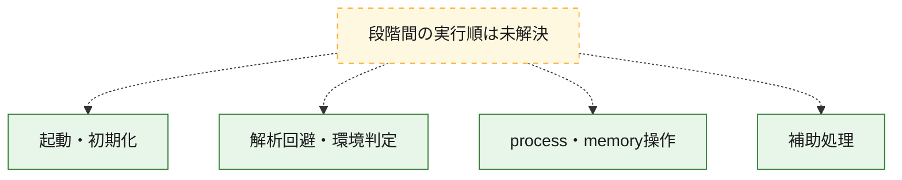
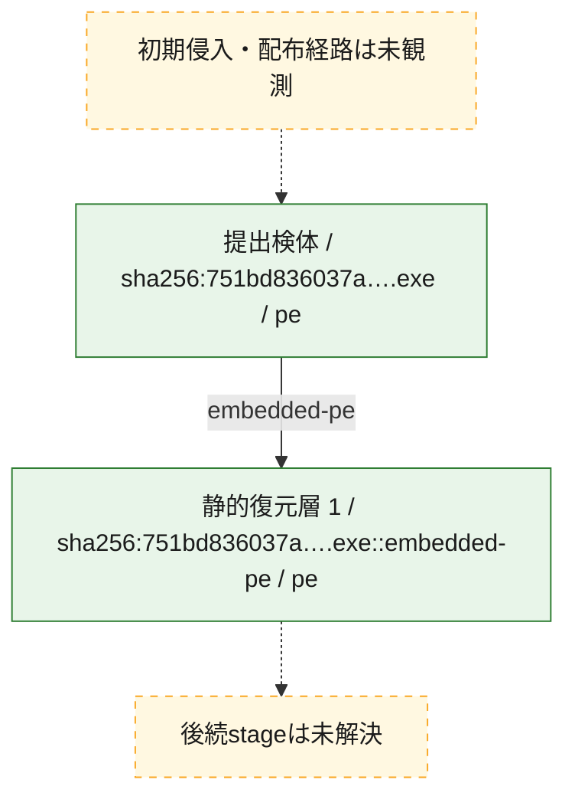
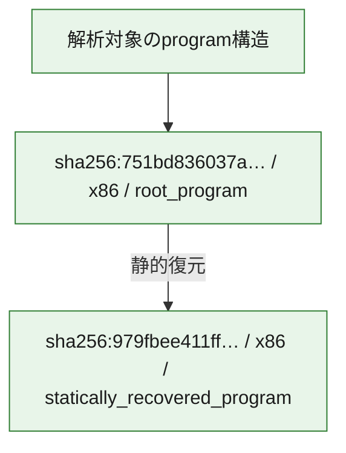

# 全体ロジック：751bd836037a38f9edf5e4dc20174c2b53ec843082c732d63742287633b5c615

代表関数の静的証跡から、起動・初期化、解析回避・環境判定、process・memory操作の処理群を確認しました。

## 読み方

- phaseの掲載順は解析上の整理順です。observed_call_edgesがない段階間の実行順を断定しません。
- 図の実線は静的に観測した関係、点線と黄色のノードは未観測・未解決の関係を示します。
- 図は静的な要約であり、動的実行を再現するものではありません。
- 詳細な関数解説とfingerprintは[STATIC-LOGIC.md](STATIC-LOGIC.md)を参照してください。

## 静的可視化

### 実行フロー

### 感染チェーン

### モジュール関係

## 処理段階

### 1. 起動・初期化

entry pointから初期化と後続処理への移行を確認します。
確度: `confirmed_static_function_evidence`

- `751bd836037a38f9edf5e4dc20174c2b53ec843082c732d63742287633b5c615:ghidra:1400013e0` — 初期化と主要処理への分岐を行う入口関数です。 状態: `succeeded`、選定理由: `entry_point`, `meaningful_symbol_name`, `reviewed_call_centrality:1`, `role:entrypoint`

### 2. 解析回避・環境判定

debugger、sandbox、仮想環境、時間差などの判定を確認します。
確度: `confirmed_static_function_evidence`

- `751bd836037a38f9edf5e4dc20174c2b53ec843082c732d63742287633b5c615:ghidra:140001190` — debugger、仮想環境、sandbox、または時間差の確認に関係する関数です。 状態: `succeeded`、選定理由: `context_representative`, `reviewed_call_centrality:21`, `role:anti_analysis`

### 3. process・memory操作

process、thread、module、memory操作と実行移行を確認します。
確度: `confirmed_static_function_evidence`

- `751bd836037a38f9edf5e4dc20174c2b53ec843082c732d63742287633b5c615:ghidra:1400014b0` — process、thread、module、またはmemory操作に関係する関数です。 状態: `succeeded`、選定理由: `context_representative`, `reviewed_call_centrality:19`, `role:process_or_memory_operation`

### 4. 補助処理

主要処理を支える一般内部関数またはlibrary処理を確認します。
確度: `confirmed_static_function_evidence_with_limits`

- `979fbee411ff6f853c1535cdd48b356c0e6328a9e83b2a799829bfec4cce182c:ghidra:140001000` — 検体内部の一般処理を実装する関数です。 状態: `limited_bad_instruction_or_flow`、選定理由: `context_representative`, `reviewed_call_centrality:1`
- `979fbee411ff6f853c1535cdd48b356c0e6328a9e83b2a799829bfec4cce182c:ghidra:1400010f0` — 検体内部の一般処理を実装する関数です。 状態: `limited_bad_instruction_or_flow`、選定理由: `context_representative`, `reviewed_call_centrality:1`
- `979fbee411ff6f853c1535cdd48b356c0e6328a9e83b2a799829bfec4cce182c:ghidra:140001140` — 検体内部の一般処理を実装する関数です。 状態: `limited_bad_instruction_or_flow`、選定理由: `context_representative`, `reviewed_call_centrality:1`
- `979fbee411ff6f853c1535cdd48b356c0e6328a9e83b2a799829bfec4cce182c:ghidra:140001160` — 検体内部の一般処理を実装する関数です。 状態: `limited_bad_instruction_or_flow`、選定理由: `context_representative`, `reviewed_call_centrality:1`
- `979fbee411ff6f853c1535cdd48b356c0e6328a9e83b2a799829bfec4cce182c:ghidra:140001350` — 検体内部の一般処理を実装する関数です。 状態: `limited_bad_instruction_or_flow`、選定理由: `context_representative`, `reviewed_call_centrality:1`
- `979fbee411ff6f853c1535cdd48b356c0e6328a9e83b2a799829bfec4cce182c:ghidra:140001370` — 検体内部の一般処理を実装する関数です。 状態: `limited_bad_instruction_or_flow`、選定理由: `context_representative`, `reviewed_call_centrality:1`
- `979fbee411ff6f853c1535cdd48b356c0e6328a9e83b2a799829bfec4cce182c:ghidra:140001600` — 検体内部の一般処理を実装する関数です。 状態: `limited_bad_instruction_or_flow`、選定理由: `context_representative`, `reviewed_call_centrality:1`
- `979fbee411ff6f853c1535cdd48b356c0e6328a9e83b2a799829bfec4cce182c:ghidra:140001650` — 検体内部の一般処理を実装する関数です。 状態: `limited_bad_instruction_or_flow`、選定理由: `context_representative`, `reviewed_call_centrality:1`
- `979fbee411ff6f853c1535cdd48b356c0e6328a9e83b2a799829bfec4cce182c:ghidra:1400016c0` — 検体内部の一般処理を実装する関数です。 状態: `limited_bad_instruction_or_flow`、選定理由: `context_representative`, `reviewed_call_centrality:1`
- `979fbee411ff6f853c1535cdd48b356c0e6328a9e83b2a799829bfec4cce182c:ghidra:140001760` — compiler生成処理または汎用library処理とみられる関数です。 状態: `limited_bad_instruction_or_flow`、選定理由: `entry_point`, `meaningful_symbol_name`, `reviewed_call_centrality:1`
- `979fbee411ff6f853c1535cdd48b356c0e6328a9e83b2a799829bfec4cce182c:ghidra:1400017e0` — compiler生成処理または汎用library処理とみられる関数です。 状態: `limited_bad_instruction_or_flow`、選定理由: `entry_point`, `meaningful_symbol_name`, `reviewed_call_centrality:1`
- `979fbee411ff6f853c1535cdd48b356c0e6328a9e83b2a799829bfec4cce182c:ghidra:140001800` — 検体内部の一般処理を実装する関数です。 状態: `limited_bad_instruction_or_flow`、選定理由: `context_representative`, `reviewed_call_centrality:1`
- `979fbee411ff6f853c1535cdd48b356c0e6328a9e83b2a799829bfec4cce182c:ghidra:140001880` — 検体内部の一般処理を実装する関数です。 状態: `limited_bad_instruction_or_flow`、選定理由: `context_representative`, `reviewed_call_centrality:1`
- `979fbee411ff6f853c1535cdd48b356c0e6328a9e83b2a799829bfec4cce182c:ghidra:140001ba0` — 検体内部の一般処理を実装する関数です。 状態: `limited_bad_instruction_or_flow`、選定理由: `context_representative`, `reviewed_call_centrality:1`
- `979fbee411ff6f853c1535cdd48b356c0e6328a9e83b2a799829bfec4cce182c:ghidra:140001d40` — 検体内部の一般処理を実装する関数です。 状態: `limited_bad_instruction_or_flow`、選定理由: `context_representative`, `reviewed_call_centrality:1`
- `979fbee411ff6f853c1535cdd48b356c0e6328a9e83b2a799829bfec4cce182c:ghidra:140001db0` — 検体内部の一般処理を実装する関数です。 状態: `limited_bad_instruction_or_flow`、選定理由: `context_representative`, `reviewed_call_centrality:1`
- `979fbee411ff6f853c1535cdd48b356c0e6328a9e83b2a799829bfec4cce182c:ghidra:140001e10` — 検体内部の一般処理を実装する関数です。 状態: `limited_bad_instruction_or_flow`、選定理由: `context_representative`, `reviewed_call_centrality:1`
- `979fbee411ff6f853c1535cdd48b356c0e6328a9e83b2a799829bfec4cce182c:ghidra:140001fd0` — 検体内部の一般処理を実装する関数です。 状態: `limited_bad_instruction_or_flow`、選定理由: `context_representative`, `reviewed_call_centrality:1`
- `979fbee411ff6f853c1535cdd48b356c0e6328a9e83b2a799829bfec4cce182c:ghidra:140002050` — 検体内部の一般処理を実装する関数です。 状態: `limited_bad_instruction_or_flow`、選定理由: `context_representative`, `reviewed_call_centrality:1`
- `979fbee411ff6f853c1535cdd48b356c0e6328a9e83b2a799829bfec4cce182c:ghidra:1400020e0` — 検体内部の一般処理を実装する関数です。 状態: `limited_bad_instruction_or_flow`、選定理由: `context_representative`, `reviewed_call_centrality:1`
- `979fbee411ff6f853c1535cdd48b356c0e6328a9e83b2a799829bfec4cce182c:ghidra:140002290` — 検体内部の一般処理を実装する関数です。 状態: `limited_bad_instruction_or_flow`、選定理由: `context_representative`, `reviewed_call_centrality:1`
- `979fbee411ff6f853c1535cdd48b356c0e6328a9e83b2a799829bfec4cce182c:ghidra:140002320` — 検体内部の一般処理を実装する関数です。 状態: `limited_bad_instruction_or_flow`、選定理由: `context_representative`, `reviewed_call_centrality:1`
- `979fbee411ff6f853c1535cdd48b356c0e6328a9e83b2a799829bfec4cce182c:ghidra:140002590` — 検体内部の一般処理を実装する関数です。 状態: `limited_bad_instruction_or_flow`、選定理由: `context_representative`, `reviewed_call_centrality:1`
- `979fbee411ff6f853c1535cdd48b356c0e6328a9e83b2a799829bfec4cce182c:ghidra:140002690` — 検体内部の一般処理を実装する関数です。 状態: `limited_bad_instruction_or_flow`、選定理由: `context_representative`, `reviewed_call_centrality:1`
- `979fbee411ff6f853c1535cdd48b356c0e6328a9e83b2a799829bfec4cce182c:ghidra:140002df0` — 検体内部の一般処理を実装する関数です。 状態: `limited_bad_instruction_or_flow`、選定理由: `context_representative`, `reviewed_call_centrality:1`
- `979fbee411ff6f853c1535cdd48b356c0e6328a9e83b2a799829bfec4cce182c:ghidra:140002f70` — 検体内部の一般処理を実装する関数です。 状態: `limited_bad_instruction_or_flow`、選定理由: `context_representative`, `reviewed_call_centrality:1`
- `979fbee411ff6f853c1535cdd48b356c0e6328a9e83b2a799829bfec4cce182c:ghidra:1400031e0` — 検体内部の一般処理を実装する関数です。 状態: `limited_bad_instruction_or_flow`、選定理由: `context_representative`, `reviewed_call_centrality:1`
- `979fbee411ff6f853c1535cdd48b356c0e6328a9e83b2a799829bfec4cce182c:ghidra:140003350` — 検体内部の一般処理を実装する関数です。 状態: `limited_bad_instruction_or_flow`、選定理由: `context_representative`, `reviewed_call_centrality:1`
- `979fbee411ff6f853c1535cdd48b356c0e6328a9e83b2a799829bfec4cce182c:ghidra:1400038e0` — 検体内部の一般処理を実装する関数です。 状態: `limited_bad_instruction_or_flow`、選定理由: `context_representative`, `reviewed_call_centrality:1`
- `979fbee411ff6f853c1535cdd48b356c0e6328a9e83b2a799829bfec4cce182c:ghidra:1400039b0` — 検体内部の一般処理を実装する関数です。 状態: `limited_bad_instruction_or_flow`、選定理由: `context_representative`, `reviewed_call_centrality:1`
- `979fbee411ff6f853c1535cdd48b356c0e6328a9e83b2a799829bfec4cce182c:ghidra:140003c20` — 検体内部の一般処理を実装する関数です。 状態: `limited_bad_instruction_or_flow`、選定理由: `context_representative`, `reviewed_call_centrality:1`
- `979fbee411ff6f853c1535cdd48b356c0e6328a9e83b2a799829bfec4cce182c:ghidra:1402c5000` — 検体内部の一般処理を実装する関数です。 状態: `limited_bad_instruction_or_flow`、選定理由: `meaningful_symbol_name`, `reviewed_call_centrality:1`
- `751bd836037a38f9edf5e4dc20174c2b53ec843082c732d63742287633b5c615:ghidra:140001000` — 検体内部の一般処理を実装する関数です。 状態: `succeeded`、選定理由: `context_representative`
- `751bd836037a38f9edf5e4dc20174c2b53ec843082c732d63742287633b5c615:ghidra:140001010` — 検体内部の一般処理を実装する関数です。 状態: `succeeded`、選定理由: `context_representative`, `reviewed_call_centrality:6`
- `751bd836037a38f9edf5e4dc20174c2b53ec843082c732d63742287633b5c615:ghidra:140001140` — 検体内部の一般処理を実装する関数です。 状態: `succeeded`、選定理由: `context_representative`, `reviewed_call_centrality:1`
- `751bd836037a38f9edf5e4dc20174c2b53ec843082c732d63742287633b5c615:ghidra:140001410` — 検体内部の一般処理を実装する関数です。 状態: `succeeded`、選定理由: `context_representative`, `reviewed_call_centrality:1`
- `751bd836037a38f9edf5e4dc20174c2b53ec843082c732d63742287633b5c615:ghidra:140001440` — 検体内部の一般処理を実装する関数です。 状態: `succeeded`、選定理由: `context_representative`, `reviewed_call_centrality:1`
- `751bd836037a38f9edf5e4dc20174c2b53ec843082c732d63742287633b5c615:ghidra:140001460` — 検体内部の一般処理を実装する関数です。 状態: `succeeded`、選定理由: `context_representative`, `reviewed_call_centrality:1`
- `751bd836037a38f9edf5e4dc20174c2b53ec843082c732d63742287633b5c615:ghidra:140001470` — 検体内部の一般処理を実装する関数です。 状態: `succeeded`、選定理由: `context_representative`
- `751bd836037a38f9edf5e4dc20174c2b53ec843082c732d63742287633b5c615:ghidra:140001480` — 検体内部の一般処理を実装する関数です。 状態: `succeeded`、選定理由: `context_representative`, `reviewed_call_centrality:2`
- `751bd836037a38f9edf5e4dc20174c2b53ec843082c732d63742287633b5c615:ghidra:140001880` — 検体内部の一般処理を実装する関数です。 状態: `succeeded`、選定理由: `context_representative`
- `751bd836037a38f9edf5e4dc20174c2b53ec843082c732d63742287633b5c615:ghidra:1400018d0` — 検体内部の一般処理を実装する関数です。 状態: `succeeded`、選定理由: `context_representative`, `reviewed_call_centrality:1`
- `751bd836037a38f9edf5e4dc20174c2b53ec843082c732d63742287633b5c615:ghidra:140001950` — 検体内部の一般処理を実装する関数です。 状態: `succeeded`、選定理由: `context_representative`, `reviewed_call_centrality:2`
- `751bd836037a38f9edf5e4dc20174c2b53ec843082c732d63742287633b5c615:ghidra:140001970` — 検体内部の一般処理を実装する関数です。 状態: `succeeded`、選定理由: `context_representative`, `reviewed_call_centrality:1`
- `751bd836037a38f9edf5e4dc20174c2b53ec843082c732d63742287633b5c615:ghidra:140001980` — compiler生成処理または汎用library処理とみられる関数です。 状態: `succeeded`、選定理由: `entry_point`, `meaningful_symbol_name`, `reviewed_call_centrality:1`
- `751bd836037a38f9edf5e4dc20174c2b53ec843082c732d63742287633b5c615:ghidra:1400019b0` — compiler生成処理または汎用library処理とみられる関数です。 状態: `succeeded`、選定理由: `entry_point`, `meaningful_symbol_name`, `reviewed_call_centrality:3`
- `751bd836037a38f9edf5e4dc20174c2b53ec843082c732d63742287633b5c615:ghidra:140001a40` — 検体内部の一般処理を実装する関数です。 状態: `succeeded`、選定理由: `context_representative`
- `751bd836037a38f9edf5e4dc20174c2b53ec843082c732d63742287633b5c615:ghidra:140001a50` — 検体内部の一般処理を実装する関数です。 状態: `succeeded`、選定理由: `context_representative`, `reviewed_call_centrality:2`
- `751bd836037a38f9edf5e4dc20174c2b53ec843082c732d63742287633b5c615:ghidra:140001b50` — 検体内部の一般処理を実装する関数です。 状態: `succeeded`、選定理由: `context_representative`, `reviewed_call_centrality:3`
- `751bd836037a38f9edf5e4dc20174c2b53ec843082c732d63742287633b5c615:ghidra:140001b60` — 検体内部の一般処理を実装する関数です。 状態: `succeeded`、選定理由: `context_representative`, `reviewed_call_centrality:16`
- `751bd836037a38f9edf5e4dc20174c2b53ec843082c732d63742287633b5c615:ghidra:140001bd0` — 検体内部の一般処理を実装する関数です。 状態: `succeeded`、選定理由: `context_representative`, `reviewed_call_centrality:12`
- `751bd836037a38f9edf5e4dc20174c2b53ec843082c732d63742287633b5c615:ghidra:140001d40` — 検体内部の一般処理を実装する関数です。 状態: `succeeded`、選定理由: `context_representative`, `reviewed_call_centrality:4`
- `751bd836037a38f9edf5e4dc20174c2b53ec843082c732d63742287633b5c615:ghidra:1400020a0` — 検体内部の一般処理を実装する関数です。 状態: `succeeded`、選定理由: `context_representative`
- `751bd836037a38f9edf5e4dc20174c2b53ec843082c732d63742287633b5c615:ghidra:1400020e0` — 検体内部の一般処理を実装する関数です。 状態: `limited_bad_instruction_or_flow`、選定理由: `context_representative`, `reviewed_call_centrality:3`
- `751bd836037a38f9edf5e4dc20174c2b53ec843082c732d63742287633b5c615:ghidra:1400020f0` — 検体内部の一般処理を実装する関数です。 状態: `limited_bad_instruction_or_flow`、選定理由: `context_representative`, `reviewed_call_centrality:2`
- `751bd836037a38f9edf5e4dc20174c2b53ec843082c732d63742287633b5c615:ghidra:1400022b0` — 検体内部の一般処理を実装する関数です。 状態: `limited_bad_instruction_or_flow`、選定理由: `context_representative`, `reviewed_call_centrality:9`
- `751bd836037a38f9edf5e4dc20174c2b53ec843082c732d63742287633b5c615:ghidra:140002330` — 検体内部の一般処理を実装する関数です。 状態: `succeeded`、選定理由: `context_representative`, `reviewed_call_centrality:5`
- `751bd836037a38f9edf5e4dc20174c2b53ec843082c732d63742287633b5c615:ghidra:1400023b0` — 検体内部の一般処理を実装する関数です。 状態: `succeeded`、選定理由: `context_representative`, `reviewed_call_centrality:5`
- `751bd836037a38f9edf5e4dc20174c2b53ec843082c732d63742287633b5c615:ghidra:140002450` — 検体内部の一般処理を実装する関数です。 状態: `succeeded`、選定理由: `context_representative`, `reviewed_call_centrality:9`
- `751bd836037a38f9edf5e4dc20174c2b53ec843082c732d63742287633b5c615:ghidra:140002550` — 検体内部の一般処理を実装する関数です。 状態: `succeeded`、選定理由: `context_representative`
- `751bd836037a38f9edf5e4dc20174c2b53ec843082c732d63742287633b5c615:ghidra:140002580` — 検体内部の一般処理を実装する関数です。 状態: `succeeded`、選定理由: `context_representative`

## 観測したcall関係

- 代表関数間で直接解決できた呼出関係はありません。

## 解析範囲と制約

- 選定外関数は全体inventoryへ残しますが、関数本体の個別解説対象にはしていません。
- indirect call、難読化、packer、VM、壊れたcontrol flowによりcall関係が欠落する場合があります。
- 文書は静的解析に基づき、検体実行や外部通信による動的確認は行っていません。
