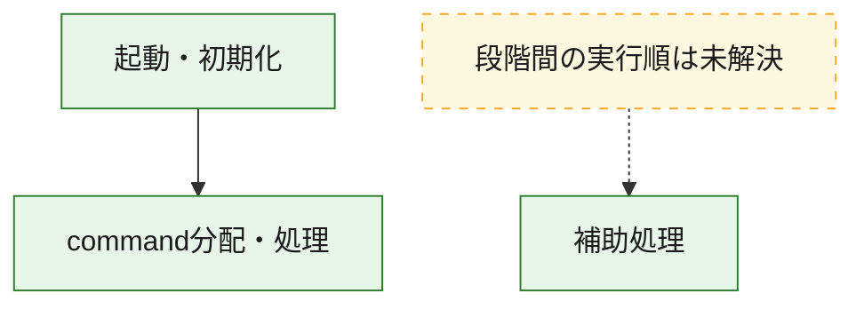
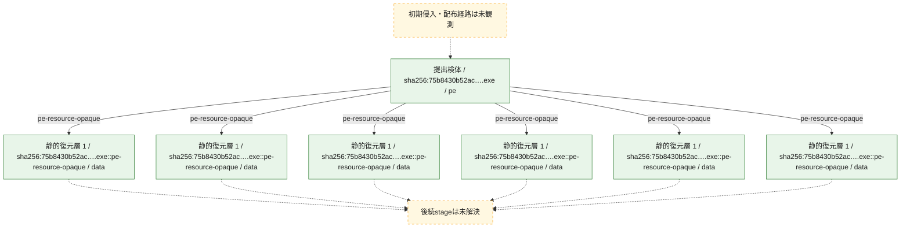
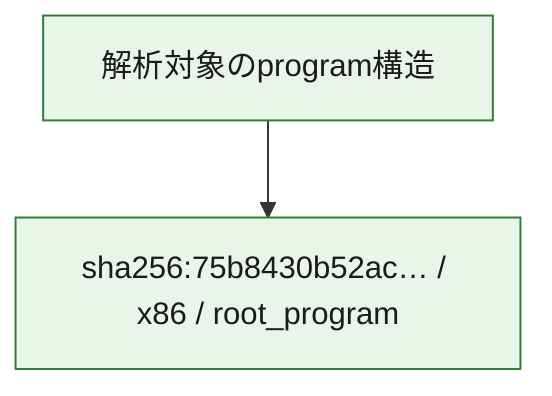

# 全体ロジック：75b8430b52ac04cddde0c1564f6ca13b7412bf26008a58c400c1502144a3f461

代表関数の静的証跡から、起動・初期化、command分配・処理の処理群を確認しました。

## 読み方

- phaseの掲載順は解析上の整理順です。observed_call_edgesがない段階間の実行順を断定しません。
- 図の実線は静的に観測した関係、点線と黄色のノードは未観測・未解決の関係を示します。
- 図は静的な要約であり、動的実行を再現するものではありません。
- 詳細な関数解説とfingerprintは[STATIC-LOGIC.md](STATIC-LOGIC.md)を参照してください。

## 静的可視化

### 実行フロー

### 感染チェーン

### モジュール関係

## 処理段階

### 1. 起動・初期化

entry pointから初期化と後続処理への移行を確認します。
確度: `confirmed_static_function_evidence`

- `75b8430b52ac04cddde0c1564f6ca13b7412bf26008a58c400c1502144a3f461:ghidra:140001860` — 初期化と主要処理への分岐を行う入口関数です。 状態: `succeeded`、選定理由: `entry_point`, `meaningful_symbol_name`, `reviewed_call_centrality:2`, `role:entrypoint`
- `75b8430b52ac04cddde0c1564f6ca13b7412bf26008a58c400c1502144a3f461:ghidra:1401ead30` — 初期化と主要処理への分岐を行う入口関数です。 状態: `succeeded`、選定理由: `entry_point`, `meaningful_symbol_name`, `reviewed_call_centrality:22`, `role:entrypoint`

### 2. command分配・処理

受信commandやtaskの解釈、分配、個別handlerへの移行を確認します。
確度: `confirmed_static_function_evidence_with_limits`

- `75b8430b52ac04cddde0c1564f6ca13b7412bf26008a58c400c1502144a3f461:ghidra:1402bcfc0` — commandの解釈、分配、または個別処理を担当する関数です。 状態: `limited_bad_instruction_or_flow`、選定理由: `meaningful_symbol_name`, `reviewed_call_centrality:1`, `role:command_dispatch_or_handler`

### 3. 補助処理

主要処理を支える一般内部関数またはlibrary処理を確認します。
確度: `confirmed_static_function_evidence_with_limits`

- `75b8430b52ac04cddde0c1564f6ca13b7412bf26008a58c400c1502144a3f461:ghidra:140001020` — 検体内部の一般処理を実装する関数です。 状態: `succeeded`、選定理由: `context_representative`, `reviewed_call_centrality:2`
- `75b8430b52ac04cddde0c1564f6ca13b7412bf26008a58c400c1502144a3f461:ghidra:140001040` — 検体内部の一般処理を実装する関数です。 状態: `succeeded`、選定理由: `context_representative`, `reviewed_call_centrality:2`
- `75b8430b52ac04cddde0c1564f6ca13b7412bf26008a58c400c1502144a3f461:ghidra:1400010b0` — 検体内部の一般処理を実装する関数です。 状態: `succeeded`、選定理由: `context_representative`, `reviewed_call_centrality:2`
- `75b8430b52ac04cddde0c1564f6ca13b7412bf26008a58c400c1502144a3f461:ghidra:1400010d0` — 検体内部の一般処理を実装する関数です。 状態: `succeeded`、選定理由: `context_representative`, `reviewed_call_centrality:3`
- `75b8430b52ac04cddde0c1564f6ca13b7412bf26008a58c400c1502144a3f461:ghidra:1400011b0` — 検体内部の一般処理を実装する関数です。 状態: `succeeded`、選定理由: `context_representative`, `reviewed_call_centrality:2`
- `75b8430b52ac04cddde0c1564f6ca13b7412bf26008a58c400c1502144a3f461:ghidra:140001200` — 検体内部の一般処理を実装する関数です。 状態: `succeeded`、選定理由: `context_representative`, `reviewed_call_centrality:2`
- `75b8430b52ac04cddde0c1564f6ca13b7412bf26008a58c400c1502144a3f461:ghidra:140001220` — 検体内部の一般処理を実装する関数です。 状態: `succeeded`、選定理由: `context_representative`, `reviewed_call_centrality:2`
- `75b8430b52ac04cddde0c1564f6ca13b7412bf26008a58c400c1502144a3f461:ghidra:1400012e0` — 検体内部の一般処理を実装する関数です。 状態: `succeeded`、選定理由: `context_representative`, `reviewed_call_centrality:2`
- `75b8430b52ac04cddde0c1564f6ca13b7412bf26008a58c400c1502144a3f461:ghidra:140001320` — 検体内部の一般処理を実装する関数です。 状態: `succeeded`、選定理由: `context_representative`, `reviewed_call_centrality:2`
- `75b8430b52ac04cddde0c1564f6ca13b7412bf26008a58c400c1502144a3f461:ghidra:1400013a0` — 検体内部の一般処理を実装する関数です。 状態: `succeeded`、選定理由: `context_representative`, `reviewed_call_centrality:2`
- `75b8430b52ac04cddde0c1564f6ca13b7412bf26008a58c400c1502144a3f461:ghidra:1400013d0` — 検体内部の一般処理を実装する関数です。 状態: `succeeded`、選定理由: `context_representative`, `reviewed_call_centrality:2`
- `75b8430b52ac04cddde0c1564f6ca13b7412bf26008a58c400c1502144a3f461:ghidra:140001460` — 検体内部の一般処理を実装する関数です。 状態: `succeeded`、選定理由: `context_representative`, `reviewed_call_centrality:4`
- `75b8430b52ac04cddde0c1564f6ca13b7412bf26008a58c400c1502144a3f461:ghidra:1400015b0` — 検体内部の一般処理を実装する関数です。 状態: `succeeded`、選定理由: `context_representative`, `reviewed_call_centrality:2`
- `75b8430b52ac04cddde0c1564f6ca13b7412bf26008a58c400c1502144a3f461:ghidra:140001620` — 検体内部の一般処理を実装する関数です。 状態: `succeeded`、選定理由: `context_representative`, `reviewed_call_centrality:2`
- `75b8430b52ac04cddde0c1564f6ca13b7412bf26008a58c400c1502144a3f461:ghidra:140001670` — 検体内部の一般処理を実装する関数です。 状態: `succeeded`、選定理由: `context_representative`, `reviewed_call_centrality:3`
- `75b8430b52ac04cddde0c1564f6ca13b7412bf26008a58c400c1502144a3f461:ghidra:14000175c` — 検体内部の一般処理を実装する関数です。 状態: `succeeded`、選定理由: `context_representative`, `reviewed_call_centrality:2`
- `75b8430b52ac04cddde0c1564f6ca13b7412bf26008a58c400c1502144a3f461:ghidra:140001788` — 検体内部の一般処理を実装する関数です。 状態: `succeeded`、選定理由: `context_representative`, `reviewed_call_centrality:2`
- `75b8430b52ac04cddde0c1564f6ca13b7412bf26008a58c400c1502144a3f461:ghidra:1400017b0` — 検体内部の一般処理を実装する関数です。 状態: `succeeded`、選定理由: `context_representative`, `reviewed_call_centrality:3`
- `75b8430b52ac04cddde0c1564f6ca13b7412bf26008a58c400c1502144a3f461:ghidra:140001810` — 検体内部の一般処理を実装する関数です。 状態: `succeeded`、選定理由: `context_representative`, `reviewed_call_centrality:2`
- `75b8430b52ac04cddde0c1564f6ca13b7412bf26008a58c400c1502144a3f461:ghidra:140001880` — 検体内部の一般処理を実装する関数です。 状態: `limited_bad_instruction_or_flow`、選定理由: `entry_point`, `meaningful_symbol_name`, `reviewed_call_centrality:6`
- `75b8430b52ac04cddde0c1564f6ca13b7412bf26008a58c400c1502144a3f461:ghidra:1400019d0` — 検体内部の一般処理を実装する関数です。 状態: `succeeded`、選定理由: `context_representative`, `reviewed_call_centrality:1`
- `75b8430b52ac04cddde0c1564f6ca13b7412bf26008a58c400c1502144a3f461:ghidra:140001a10` — 検体内部の一般処理を実装する関数です。 状態: `succeeded`、選定理由: `context_representative`, `reviewed_call_centrality:1`
- `75b8430b52ac04cddde0c1564f6ca13b7412bf26008a58c400c1502144a3f461:ghidra:140001a70` — 検体内部の一般処理を実装する関数です。 状態: `succeeded`、選定理由: `context_representative`, `reviewed_call_centrality:1`
- `75b8430b52ac04cddde0c1564f6ca13b7412bf26008a58c400c1502144a3f461:ghidra:140001ad0` — 検体内部の一般処理を実装する関数です。 状態: `succeeded`、選定理由: `context_representative`, `reviewed_call_centrality:1`
- `75b8430b52ac04cddde0c1564f6ca13b7412bf26008a58c400c1502144a3f461:ghidra:140001b00` — 検体内部の一般処理を実装する関数です。 状態: `succeeded`、選定理由: `context_representative`, `reviewed_call_centrality:1`
- `75b8430b52ac04cddde0c1564f6ca13b7412bf26008a58c400c1502144a3f461:ghidra:140001b20` — 検体内部の一般処理を実装する関数です。 状態: `succeeded`、選定理由: `context_representative`, `reviewed_call_centrality:3`
- `75b8430b52ac04cddde0c1564f6ca13b7412bf26008a58c400c1502144a3f461:ghidra:140001b90` — 検体内部の一般処理を実装する関数です。 状態: `succeeded`、選定理由: `context_representative`, `reviewed_call_centrality:2`
- `75b8430b52ac04cddde0c1564f6ca13b7412bf26008a58c400c1502144a3f461:ghidra:140001c10` — 検体内部の一般処理を実装する関数です。 状態: `succeeded`、選定理由: `context_representative`, `reviewed_call_centrality:2`
- `75b8430b52ac04cddde0c1564f6ca13b7412bf26008a58c400c1502144a3f461:ghidra:1401eb07c` — 検体内部の一般処理を実装する関数です。 状態: `succeeded`、選定理由: `meaningful_symbol_name`

## 観測したcall関係

- `75b8430b52ac04cddde0c1564f6ca13b7412bf26008a58c400c1502144a3f461:ghidra:1401ead30` → `75b8430b52ac04cddde0c1564f6ca13b7412bf26008a58c400c1502144a3f461:ghidra:1402bcfc0` （`startup` → `dispatch`）
- `ghidra-function:073f06d815bd7ef1df8d23d7` → `ghidra-function:835b012d586035b388e06511` （`unclassified` → `unclassified`）
- `ghidra-function:073f06d815bd7ef1df8d23d7` → `ghidra-function:a0f2ef00752f7271558a3410` （`unclassified` → `unclassified`）
- `ghidra-function:073f06d815bd7ef1df8d23d7` → `ghidra-function:ef967bd8d23bebf8edca2987` （`unclassified` → `unclassified`）
- `ghidra-function:0c0053c872c80c008c0c8831` → `ghidra-function:881d862fa380a8868cb2acf8` （`unclassified` → `unclassified`）
- `ghidra-function:0c0053c872c80c008c0c8831` → `ghidra-function:a0f2ef00752f7271558a3410` （`unclassified` → `unclassified`）
- `ghidra-function:0f3691632f6597da0cdc680b` → `ghidra-external:009928808ea81985a14260e7` （`unclassified` → `unclassified`）
- `ghidra-function:0f3691632f6597da0cdc680b` → `ghidra-function:9e557ed10aca43fb5c9da9a8` （`unclassified` → `unclassified`）
- `ghidra-function:177472dd4c9c6a814b03392d` → `ghidra-function:1bf13dda878ea67ad26a3f2d` （`unclassified` → `unclassified`）
- `ghidra-function:177472dd4c9c6a814b03392d` → `ghidra-function:a0f2ef00752f7271558a3410` （`unclassified` → `unclassified`）
- `ghidra-function:1c13b223d23fcfbf39a46cd7` → `ghidra-function:945e4b0254f794582228a00c` （`unclassified` → `unclassified`）
- `ghidra-function:1c13b223d23fcfbf39a46cd7` → `ghidra-function:a0f2ef00752f7271558a3410` （`unclassified` → `unclassified`）
- `ghidra-function:1c13b223d23fcfbf39a46cd7` → `ghidra-function:b68c616e7b7a330bed579c03` （`unclassified` → `unclassified`）
- `ghidra-function:1c13b223d23fcfbf39a46cd7` → `ghidra-function:bf4ce20868f4204b025297b6` （`unclassified` → `unclassified`）
- `ghidra-function:1c915e1902bed7c0117547ab` → `ghidra-function:881d862fa380a8868cb2acf8` （`unclassified` → `unclassified`）
- `ghidra-function:1c915e1902bed7c0117547ab` → `ghidra-function:a0f2ef00752f7271558a3410` （`unclassified` → `unclassified`）
- `ghidra-function:1f79af8edb2f8444a08064d2` → `ghidra-function:835b012d586035b388e06511` （`unclassified` → `unclassified`）
- `ghidra-function:1f79af8edb2f8444a08064d2` → `ghidra-function:a0f2ef00752f7271558a3410` （`unclassified` → `unclassified`）
- `ghidra-function:2005f412c6fc0205223856b2` → `ghidra-function:835b012d586035b388e06511` （`unclassified` → `unclassified`）
- `ghidra-function:2005f412c6fc0205223856b2` → `ghidra-function:a0f2ef00752f7271558a3410` （`unclassified` → `unclassified`）
- `ghidra-function:213a775d911a3eb5a902bb42` → `ghidra-external:009928808ea81985a14260e7` （`unclassified` → `unclassified`）
- `ghidra-function:2afc2c6b276cbb6e1bbd4ab0` → `ghidra-function:881d862fa380a8868cb2acf8` （`unclassified` → `unclassified`）
- `ghidra-function:2afc2c6b276cbb6e1bbd4ab0` → `ghidra-function:a0f2ef00752f7271558a3410` （`unclassified` → `unclassified`）
- `ghidra-function:381fca5c1f990931d45b2d46` → `ghidra-external:634f9b2a91bb2820953fb280` （`unclassified` → `unclassified`）
- `ghidra-function:381fca5c1f990931d45b2d46` → `ghidra-external:9456968745d432ee67b1dd30` （`unclassified` → `unclassified`）
- `ghidra-function:381fca5c1f990931d45b2d46` → `ghidra-function:9c8f2bc82abcf7139d71ab7e` （`unclassified` → `unclassified`）
- `ghidra-function:381fca5c1f990931d45b2d46` → `ghidra-function:a45b6f7ffb76f1af361654d8` （`unclassified` → `unclassified`）
- `ghidra-function:381fca5c1f990931d45b2d46` → `ghidra-function:c015d8cdaf138a679c8c600d` （`unclassified` → `unclassified`）
- `ghidra-function:3e0ad199f7bb09b74f1810a6` → `ghidra-external:009928808ea81985a14260e7` （`unclassified` → `unclassified`）
- `ghidra-function:3e0ad199f7bb09b74f1810a6` → `ghidra-external:5b3727c3776a20053ca96d74` （`unclassified` → `unclassified`）
- `ghidra-function:3e0ad199f7bb09b74f1810a6` → `ghidra-external:6a8c3396bbd64d747f812680` （`unclassified` → `unclassified`）
- `ghidra-function:3e573523339b0f4e635a57e7` → `ghidra-function:30f3c486faabf882e99bac3b` （`unclassified` → `unclassified`）
- `ghidra-function:47031f6b5b1d562fed31aea8` → `ghidra-function:881d862fa380a8868cb2acf8` （`unclassified` → `unclassified`）
- `ghidra-function:47031f6b5b1d562fed31aea8` → `ghidra-function:a0f2ef00752f7271558a3410` （`unclassified` → `unclassified`）
- `ghidra-function:543f7b9ba297c5a49f3bba01` → `ghidra-external:009928808ea81985a14260e7` （`unclassified` → `unclassified`）
- `ghidra-function:543f7b9ba297c5a49f3bba01` → `ghidra-function:9e557ed10aca43fb5c9da9a8` （`unclassified` → `unclassified`）
- `ghidra-function:55108574d36adf52e11e3f6a` → `ghidra-function:a0f2ef00752f7271558a3410` （`unclassified` → `unclassified`）
- `ghidra-function:55108574d36adf52e11e3f6a` → `ghidra-function:c81632074eff5ab6ccc0c729` （`unclassified` → `unclassified`）
- `ghidra-function:6b9c86b6de86c99aee43f1b8` → `ghidra-function:704dad224ec009652ca19245` （`unclassified` → `unclassified`）
- `ghidra-function:6b9c86b6de86c99aee43f1b8` → `ghidra-function:83696673c0231a4b6a477873` （`unclassified` → `unclassified`）
- `ghidra-function:821acba312a10110f34daff9` → `ghidra-function:4de1482f4cedca91a53ba94e` （`unclassified` → `unclassified`）
- `ghidra-function:84014d86464e10404e7b46d8` → `ghidra-function:835b012d586035b388e06511` （`unclassified` → `unclassified`）
- `ghidra-function:84014d86464e10404e7b46d8` → `ghidra-function:a0f2ef00752f7271558a3410` （`unclassified` → `unclassified`）
- `ghidra-function:9f5af86cf94714b4d0efc869` → `ghidra-function:83696673c0231a4b6a477873` （`unclassified` → `unclassified`）
- `ghidra-function:a0f275ccfe90066af587169a` → `ghidra-function:cf0a9b3c3b391b09a5fdb3b8` （`unclassified` → `unclassified`）
- `ghidra-function:abca3015cecfe3aa8c78e9f4` → `ghidra-external:07373d9b93b10c4084b12633` （`unclassified` → `unclassified`）
- `ghidra-function:abca3015cecfe3aa8c78e9f4` → `ghidra-external:55c8988cd3693fe394237fa3` （`unclassified` → `unclassified`）
- `ghidra-function:abca3015cecfe3aa8c78e9f4` → `ghidra-external:5646b70d760637f7b8038858` （`unclassified` → `unclassified`）
- `ghidra-function:abca3015cecfe3aa8c78e9f4` → `ghidra-external:71911cb0c4a65960962c9e82` （`unclassified` → `unclassified`）
- `ghidra-function:abca3015cecfe3aa8c78e9f4` → `ghidra-external:995a7270a51db0c81dd2242c` （`unclassified` → `unclassified`）
- `ghidra-function:abca3015cecfe3aa8c78e9f4` → `ghidra-external:b3b0337efacd41de089bf44c` （`unclassified` → `unclassified`）
- `ghidra-function:abca3015cecfe3aa8c78e9f4` → `ghidra-external:cbc8df9b84f7bea8bf9fe2ab` （`unclassified` → `unclassified`）
- `ghidra-function:abca3015cecfe3aa8c78e9f4` → `ghidra-function:0122f946de1356d1b0e3197b` （`unclassified` → `unclassified`）
- `ghidra-function:abca3015cecfe3aa8c78e9f4` → `ghidra-function:0e93472d7bcbcf9585cb1d55` （`unclassified` → `unclassified`）
- `ghidra-function:abca3015cecfe3aa8c78e9f4` → `ghidra-function:0ed8b1f5595a65b31f95af59` （`unclassified` → `unclassified`）
- `ghidra-function:abca3015cecfe3aa8c78e9f4` → `ghidra-function:2de56a2dd69f4ab749ffe47a` （`unclassified` → `unclassified`）
- `ghidra-function:abca3015cecfe3aa8c78e9f4` → `ghidra-function:2f498f88851452bf004fab04` （`unclassified` → `unclassified`）
- `ghidra-function:abca3015cecfe3aa8c78e9f4` → `ghidra-function:5c54ade2c1ffa19fbf011cd9` （`unclassified` → `unclassified`）
- `ghidra-function:abca3015cecfe3aa8c78e9f4` → `ghidra-function:704dad224ec009652ca19245` （`unclassified` → `unclassified`）
- `ghidra-function:abca3015cecfe3aa8c78e9f4` → `ghidra-function:8b286c17cd905e8d4ec97919` （`unclassified` → `unclassified`）
- `ghidra-function:abca3015cecfe3aa8c78e9f4` → `ghidra-function:8e40ddd8e56792525988ef27` （`unclassified` → `unclassified`）
- `ghidra-function:abca3015cecfe3aa8c78e9f4` → `ghidra-function:b38b6705931e17eae7672dc8` （`unclassified` → `unclassified`）
- `ghidra-function:abca3015cecfe3aa8c78e9f4` → `ghidra-function:d6c6ae291dfdc5cd5159c694` （`unclassified` → `unclassified`）
- `ghidra-function:abca3015cecfe3aa8c78e9f4` → `ghidra-function:e3c8cdfe05b543afc828cda7` （`unclassified` → `unclassified`）
- `ghidra-function:abca3015cecfe3aa8c78e9f4` → `ghidra-function:e77e16c1b5f2e05b2eeaae2e` （`unclassified` → `unclassified`）
- `ghidra-function:abca3015cecfe3aa8c78e9f4` → `ghidra-function:e85ab95f035bb7e1fd7c7ee5` （`unclassified` → `unclassified`）
- `ghidra-function:abca3015cecfe3aa8c78e9f4` → `ghidra-function:e9561be46324d457a88aa02e` （`unclassified` → `unclassified`）
- `ghidra-function:b832e429e7fe3ac567e9211d` → `ghidra-function:881d862fa380a8868cb2acf8` （`unclassified` → `unclassified`）
- `ghidra-function:b832e429e7fe3ac567e9211d` → `ghidra-function:a0f2ef00752f7271558a3410` （`unclassified` → `unclassified`）
- `ghidra-function:ba1512c9c920cc805bc318fd` → `ghidra-function:835b012d586035b388e06511` （`unclassified` → `unclassified`）
- `ghidra-function:ba1512c9c920cc805bc318fd` → `ghidra-function:a0f2ef00752f7271558a3410` （`unclassified` → `unclassified`）
- `ghidra-function:cba97e78972c5a6f32f3b909` → `ghidra-function:835b012d586035b388e06511` （`unclassified` → `unclassified`）
- `ghidra-function:cba97e78972c5a6f32f3b909` → `ghidra-function:a0f2ef00752f7271558a3410` （`unclassified` → `unclassified`）
- `ghidra-function:cba97e78972c5a6f32f3b909` → `ghidra-function:e62e42fd5ddb26940bdda648` （`unclassified` → `unclassified`）
- `ghidra-function:d01c5137487a533a7efb808e` → `ghidra-function:835b012d586035b388e06511` （`unclassified` → `unclassified`）
- `ghidra-function:d01c5137487a533a7efb808e` → `ghidra-function:a0f2ef00752f7271558a3410` （`unclassified` → `unclassified`）
- `ghidra-function:dc08a6d040af252b7b6acbe8` → `ghidra-function:1bf13dda878ea67ad26a3f2d` （`unclassified` → `unclassified`）
- `ghidra-function:dc08a6d040af252b7b6acbe8` → `ghidra-function:a0f2ef00752f7271558a3410` （`unclassified` → `unclassified`）
- `ghidra-function:f47abce418b48116281c178e` → `ghidra-function:34ced970b7f40778bd951076` （`unclassified` → `unclassified`）
- `ghidra-function:f718bbe5fe31fd989d5df479` → `ghidra-function:4de1482f4cedca91a53ba94e` （`unclassified` → `unclassified`）
- `ghidra-function:ffa5db934fad4945d0022688` → `ghidra-function:09e80ed65e4b656fd0c0c2d4` （`unclassified` → `unclassified`）

## 解析範囲と制約

- 選定外関数は全体inventoryへ残しますが、関数本体の個別解説対象にはしていません。
- indirect call、難読化、packer、VM、壊れたcontrol flowによりcall関係が欠落する場合があります。
- 文書は静的解析に基づき、検体実行や外部通信による動的確認は行っていません。
