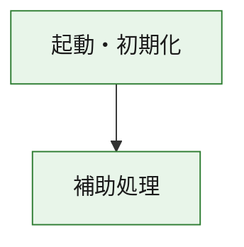
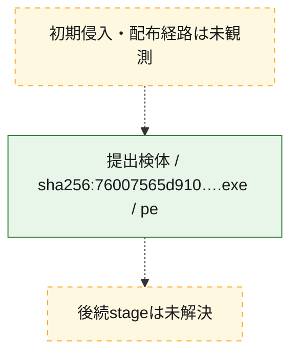
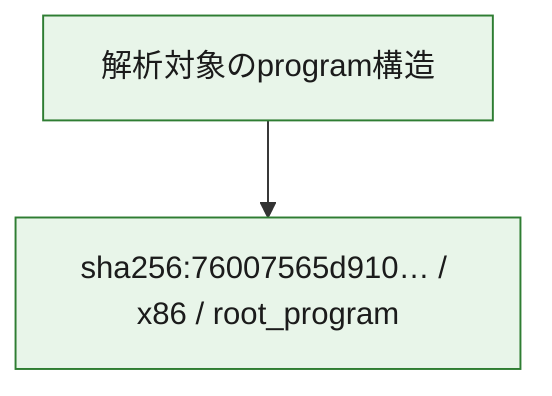

# 全体ロジック：76007565d910f28b4dfedbf6982dc56afadfa7e3c22cea25d3dd03dd7efbfbd3

代表関数の静的証跡から、起動・初期化の処理群を確認しました。

## 読み方

- phaseの掲載順は解析上の整理順です。observed_call_edgesがない段階間の実行順を断定しません。
- 図の実線は静的に観測した関係、点線と黄色のノードは未観測・未解決の関係を示します。
- 図は静的な要約であり、動的実行を再現するものではありません。
- 詳細な関数解説とfingerprintは[STATIC-LOGIC.md](STATIC-LOGIC.md)を参照してください。

## 静的可視化

### 実行フロー

### 感染チェーン

### モジュール関係

## 処理段階

### 1. 起動・初期化

entry pointから初期化と後続処理への移行を確認します。
確度: `confirmed_static_function_evidence`

- `76007565d910f28b4dfedbf6982dc56afadfa7e3c22cea25d3dd03dd7efbfbd3:ghidra:2d24311f0` — 初期化と主要処理への分岐を行う入口関数です。 状態: `succeeded`、選定理由: `entry_point`, `meaningful_symbol_name`, `reviewed_call_centrality:2`, `role:entrypoint`

### 2. 補助処理

主要処理を支える一般内部関数またはlibrary処理を確認します。
確度: `confirmed_static_function_evidence_with_limits`

- `76007565d910f28b4dfedbf6982dc56afadfa7e3c22cea25d3dd03dd7efbfbd3:ghidra:2d2431000` — 検体内部の一般処理を実装する関数です。 状態: `succeeded`、選定理由: `context_representative`, `reviewed_call_centrality:14`
- `76007565d910f28b4dfedbf6982dc56afadfa7e3c22cea25d3dd03dd7efbfbd3:ghidra:2d2431330` — 検体内部の一般処理を実装する関数です。 状態: `limited_bad_instruction_or_flow`、選定理由: `context_representative`, `reviewed_call_centrality:2`
- `76007565d910f28b4dfedbf6982dc56afadfa7e3c22cea25d3dd03dd7efbfbd3:ghidra:2d2431340` — 検体内部の一般処理を実装する関数です。 状態: `limited_bad_instruction_or_flow`、選定理由: `context_representative`, `reviewed_call_centrality:2`
- `76007565d910f28b4dfedbf6982dc56afadfa7e3c22cea25d3dd03dd7efbfbd3:ghidra:2d2431350` — 検体内部の一般処理を実装する関数です。 状態: `succeeded`、選定理由: `context_representative`
- `76007565d910f28b4dfedbf6982dc56afadfa7e3c22cea25d3dd03dd7efbfbd3:ghidra:2d2452e80` — 検体内部の一般処理を実装する関数です。 状態: `succeeded`、選定理由: `context_representative`, `reviewed_call_centrality:4`
- `76007565d910f28b4dfedbf6982dc56afadfa7e3c22cea25d3dd03dd7efbfbd3:ghidra:2d2452f80` — 検体内部の一般処理を実装する関数です。 状態: `succeeded`、選定理由: `context_representative`, `reviewed_call_centrality:4`
- `76007565d910f28b4dfedbf6982dc56afadfa7e3c22cea25d3dd03dd7efbfbd3:ghidra:2d2452fe0` — 検体内部の一般処理を実装する関数です。 状態: `succeeded`、選定理由: `context_representative`, `reviewed_call_centrality:7`
- `76007565d910f28b4dfedbf6982dc56afadfa7e3c22cea25d3dd03dd7efbfbd3:ghidra:2d24530c0` — 検体内部の一般処理を実装する関数です。 状態: `succeeded`、選定理由: `context_representative`, `reviewed_call_centrality:1`
- `76007565d910f28b4dfedbf6982dc56afadfa7e3c22cea25d3dd03dd7efbfbd3:ghidra:2d2453140` — 検体内部の一般処理を実装する関数です。 状態: `succeeded`、選定理由: `context_representative`, `reviewed_call_centrality:1`
- `76007565d910f28b4dfedbf6982dc56afadfa7e3c22cea25d3dd03dd7efbfbd3:ghidra:2d24531a0` — 検体内部の一般処理を実装する関数です。 状態: `succeeded`、選定理由: `context_representative`, `reviewed_call_centrality:2`
- `76007565d910f28b4dfedbf6982dc56afadfa7e3c22cea25d3dd03dd7efbfbd3:ghidra:2d2453210` — 検体内部の一般処理を実装する関数です。 状態: `succeeded`、選定理由: `context_representative`
- `76007565d910f28b4dfedbf6982dc56afadfa7e3c22cea25d3dd03dd7efbfbd3:ghidra:2d2453370` — 検体内部の一般処理を実装する関数です。 状態: `succeeded`、選定理由: `context_representative`
- `76007565d910f28b4dfedbf6982dc56afadfa7e3c22cea25d3dd03dd7efbfbd3:ghidra:2d24533a0` — 検体内部の一般処理を実装する関数です。 状態: `succeeded`、選定理由: `context_representative`
- `76007565d910f28b4dfedbf6982dc56afadfa7e3c22cea25d3dd03dd7efbfbd3:ghidra:2d24533e0` — 検体内部の一般処理を実装する関数です。 状態: `succeeded`、選定理由: `context_representative`, `reviewed_call_centrality:4`
- `76007565d910f28b4dfedbf6982dc56afadfa7e3c22cea25d3dd03dd7efbfbd3:ghidra:2d24534c0` — 検体内部の一般処理を実装する関数です。 状態: `succeeded`、選定理由: `context_representative`, `reviewed_call_centrality:1`
- `76007565d910f28b4dfedbf6982dc56afadfa7e3c22cea25d3dd03dd7efbfbd3:ghidra:2d2453520` — 検体内部の一般処理を実装する関数です。 状態: `succeeded`、選定理由: `context_representative`
- `76007565d910f28b4dfedbf6982dc56afadfa7e3c22cea25d3dd03dd7efbfbd3:ghidra:2d24535a0` — 検体内部の一般処理を実装する関数です。 状態: `succeeded`、選定理由: `context_representative`
- `76007565d910f28b4dfedbf6982dc56afadfa7e3c22cea25d3dd03dd7efbfbd3:ghidra:2d2453600` — 検体内部の一般処理を実装する関数です。 状態: `succeeded`、選定理由: `context_representative`, `reviewed_call_centrality:1`
- `76007565d910f28b4dfedbf6982dc56afadfa7e3c22cea25d3dd03dd7efbfbd3:ghidra:2d24536d0` — 検体内部の一般処理を実装する関数です。 状態: `succeeded`、選定理由: `context_representative`
- `76007565d910f28b4dfedbf6982dc56afadfa7e3c22cea25d3dd03dd7efbfbd3:ghidra:2d24537d0` — 検体内部の一般処理を実装する関数です。 状態: `succeeded`、選定理由: `context_representative`, `reviewed_call_centrality:2`
- `76007565d910f28b4dfedbf6982dc56afadfa7e3c22cea25d3dd03dd7efbfbd3:ghidra:2d2453860` — 検体内部の一般処理を実装する関数です。 状態: `succeeded`、選定理由: `context_representative`, `reviewed_call_centrality:6`
- `76007565d910f28b4dfedbf6982dc56afadfa7e3c22cea25d3dd03dd7efbfbd3:ghidra:2d24539b0` — 検体内部の一般処理を実装する関数です。 状態: `succeeded`、選定理由: `context_representative`, `reviewed_call_centrality:6`
- `76007565d910f28b4dfedbf6982dc56afadfa7e3c22cea25d3dd03dd7efbfbd3:ghidra:2d2453c20` — 検体内部の一般処理を実装する関数です。 状態: `succeeded`、選定理由: `context_representative`, `reviewed_call_centrality:5`
- `76007565d910f28b4dfedbf6982dc56afadfa7e3c22cea25d3dd03dd7efbfbd3:ghidra:2d2453d30` — 検体内部の一般処理を実装する関数です。 状態: `succeeded`、選定理由: `context_representative`, `reviewed_call_centrality:4`
- `76007565d910f28b4dfedbf6982dc56afadfa7e3c22cea25d3dd03dd7efbfbd3:ghidra:2d2453fb0` — 検体内部の一般処理を実装する関数です。 状態: `succeeded`、選定理由: `context_representative`, `reviewed_call_centrality:2`
- `76007565d910f28b4dfedbf6982dc56afadfa7e3c22cea25d3dd03dd7efbfbd3:ghidra:2d2454050` — 検体内部の一般処理を実装する関数です。 状態: `succeeded`、選定理由: `context_representative`, `reviewed_call_centrality:27`
- `76007565d910f28b4dfedbf6982dc56afadfa7e3c22cea25d3dd03dd7efbfbd3:ghidra:2d2454c00` — 検体内部の一般処理を実装する関数です。 状態: `succeeded`、選定理由: `context_representative`, `reviewed_call_centrality:6`
- `76007565d910f28b4dfedbf6982dc56afadfa7e3c22cea25d3dd03dd7efbfbd3:ghidra:2d2454d20` — 検体内部の一般処理を実装する関数です。 状態: `succeeded`、選定理由: `context_representative`, `reviewed_call_centrality:4`
- `76007565d910f28b4dfedbf6982dc56afadfa7e3c22cea25d3dd03dd7efbfbd3:ghidra:2d2460030` — compiler生成処理または汎用library処理とみられる関数です。 状態: `succeeded`、選定理由: `entry_point`, `meaningful_symbol_name`, `reviewed_call_centrality:7`
- `76007565d910f28b4dfedbf6982dc56afadfa7e3c22cea25d3dd03dd7efbfbd3:ghidra:2d2460050` — compiler生成処理または汎用library処理とみられる関数です。 状態: `succeeded`、選定理由: `entry_point`, `meaningful_symbol_name`, `reviewed_call_centrality:4`
- `76007565d910f28b4dfedbf6982dc56afadfa7e3c22cea25d3dd03dd7efbfbd3:ghidra:2d246eb00` — compiler生成処理または汎用library処理とみられる関数です。 状態: `limited_bad_instruction_or_flow`、選定理由: `entry_point`, `meaningful_symbol_name`, `reviewed_call_centrality:12`

## 観測したcall関係

- `76007565d910f28b4dfedbf6982dc56afadfa7e3c22cea25d3dd03dd7efbfbd3:ghidra:2d2431000` → `76007565d910f28b4dfedbf6982dc56afadfa7e3c22cea25d3dd03dd7efbfbd3:ghidra:2d2460050` （`support` → `support`）
- `76007565d910f28b4dfedbf6982dc56afadfa7e3c22cea25d3dd03dd7efbfbd3:ghidra:2d24311f0` → `76007565d910f28b4dfedbf6982dc56afadfa7e3c22cea25d3dd03dd7efbfbd3:ghidra:2d2431000` （`startup` → `support`）
- `76007565d910f28b4dfedbf6982dc56afadfa7e3c22cea25d3dd03dd7efbfbd3:ghidra:2d24530c0` → `76007565d910f28b4dfedbf6982dc56afadfa7e3c22cea25d3dd03dd7efbfbd3:ghidra:2d2452fe0` （`support` → `support`）
- `76007565d910f28b4dfedbf6982dc56afadfa7e3c22cea25d3dd03dd7efbfbd3:ghidra:2d24531a0` → `76007565d910f28b4dfedbf6982dc56afadfa7e3c22cea25d3dd03dd7efbfbd3:ghidra:2d2452fe0` （`support` → `support`）
- `76007565d910f28b4dfedbf6982dc56afadfa7e3c22cea25d3dd03dd7efbfbd3:ghidra:2d24537d0` → `76007565d910f28b4dfedbf6982dc56afadfa7e3c22cea25d3dd03dd7efbfbd3:ghidra:2d2452fe0` （`support` → `support`）
- `76007565d910f28b4dfedbf6982dc56afadfa7e3c22cea25d3dd03dd7efbfbd3:ghidra:2d2453860` → `76007565d910f28b4dfedbf6982dc56afadfa7e3c22cea25d3dd03dd7efbfbd3:ghidra:2d2452f80` （`support` → `support`）
- `76007565d910f28b4dfedbf6982dc56afadfa7e3c22cea25d3dd03dd7efbfbd3:ghidra:2d2453860` → `76007565d910f28b4dfedbf6982dc56afadfa7e3c22cea25d3dd03dd7efbfbd3:ghidra:2d2452fe0` （`support` → `support`）
- `76007565d910f28b4dfedbf6982dc56afadfa7e3c22cea25d3dd03dd7efbfbd3:ghidra:2d24539b0` → `76007565d910f28b4dfedbf6982dc56afadfa7e3c22cea25d3dd03dd7efbfbd3:ghidra:2d2452f80` （`support` → `support`）
- `76007565d910f28b4dfedbf6982dc56afadfa7e3c22cea25d3dd03dd7efbfbd3:ghidra:2d24539b0` → `76007565d910f28b4dfedbf6982dc56afadfa7e3c22cea25d3dd03dd7efbfbd3:ghidra:2d2452fe0` （`support` → `support`）
- `76007565d910f28b4dfedbf6982dc56afadfa7e3c22cea25d3dd03dd7efbfbd3:ghidra:2d2453c20` → `76007565d910f28b4dfedbf6982dc56afadfa7e3c22cea25d3dd03dd7efbfbd3:ghidra:2d2452f80` （`support` → `support`）
- `76007565d910f28b4dfedbf6982dc56afadfa7e3c22cea25d3dd03dd7efbfbd3:ghidra:2d2453c20` → `76007565d910f28b4dfedbf6982dc56afadfa7e3c22cea25d3dd03dd7efbfbd3:ghidra:2d2452fe0` （`support` → `support`）
- `76007565d910f28b4dfedbf6982dc56afadfa7e3c22cea25d3dd03dd7efbfbd3:ghidra:2d2453d30` → `76007565d910f28b4dfedbf6982dc56afadfa7e3c22cea25d3dd03dd7efbfbd3:ghidra:2d2452e80` （`support` → `support`）
- `76007565d910f28b4dfedbf6982dc56afadfa7e3c22cea25d3dd03dd7efbfbd3:ghidra:2d2453d30` → `76007565d910f28b4dfedbf6982dc56afadfa7e3c22cea25d3dd03dd7efbfbd3:ghidra:2d2453c20` （`support` → `support`）
- `76007565d910f28b4dfedbf6982dc56afadfa7e3c22cea25d3dd03dd7efbfbd3:ghidra:2d2453fb0` → `76007565d910f28b4dfedbf6982dc56afadfa7e3c22cea25d3dd03dd7efbfbd3:ghidra:2d2452e80` （`support` → `support`）
- `76007565d910f28b4dfedbf6982dc56afadfa7e3c22cea25d3dd03dd7efbfbd3:ghidra:2d2453fb0` → `76007565d910f28b4dfedbf6982dc56afadfa7e3c22cea25d3dd03dd7efbfbd3:ghidra:2d2453c20` （`support` → `support`）
- `76007565d910f28b4dfedbf6982dc56afadfa7e3c22cea25d3dd03dd7efbfbd3:ghidra:2d2454050` → `76007565d910f28b4dfedbf6982dc56afadfa7e3c22cea25d3dd03dd7efbfbd3:ghidra:2d2452e80` （`support` → `support`）
- `76007565d910f28b4dfedbf6982dc56afadfa7e3c22cea25d3dd03dd7efbfbd3:ghidra:2d2454050` → `76007565d910f28b4dfedbf6982dc56afadfa7e3c22cea25d3dd03dd7efbfbd3:ghidra:2d2452f80` （`support` → `support`）
- `76007565d910f28b4dfedbf6982dc56afadfa7e3c22cea25d3dd03dd7efbfbd3:ghidra:2d2454050` → `76007565d910f28b4dfedbf6982dc56afadfa7e3c22cea25d3dd03dd7efbfbd3:ghidra:2d2452fe0` （`support` → `support`）
- `76007565d910f28b4dfedbf6982dc56afadfa7e3c22cea25d3dd03dd7efbfbd3:ghidra:2d2454050` → `76007565d910f28b4dfedbf6982dc56afadfa7e3c22cea25d3dd03dd7efbfbd3:ghidra:2d2453140` （`support` → `support`）
- `76007565d910f28b4dfedbf6982dc56afadfa7e3c22cea25d3dd03dd7efbfbd3:ghidra:2d2454050` → `76007565d910f28b4dfedbf6982dc56afadfa7e3c22cea25d3dd03dd7efbfbd3:ghidra:2d24531a0` （`support` → `support`）
- `76007565d910f28b4dfedbf6982dc56afadfa7e3c22cea25d3dd03dd7efbfbd3:ghidra:2d2454050` → `76007565d910f28b4dfedbf6982dc56afadfa7e3c22cea25d3dd03dd7efbfbd3:ghidra:2d24534c0` （`support` → `support`）
- `76007565d910f28b4dfedbf6982dc56afadfa7e3c22cea25d3dd03dd7efbfbd3:ghidra:2d2454050` → `76007565d910f28b4dfedbf6982dc56afadfa7e3c22cea25d3dd03dd7efbfbd3:ghidra:2d24537d0` （`support` → `support`）
- `76007565d910f28b4dfedbf6982dc56afadfa7e3c22cea25d3dd03dd7efbfbd3:ghidra:2d2454050` → `76007565d910f28b4dfedbf6982dc56afadfa7e3c22cea25d3dd03dd7efbfbd3:ghidra:2d2453c20` （`support` → `support`）
- `76007565d910f28b4dfedbf6982dc56afadfa7e3c22cea25d3dd03dd7efbfbd3:ghidra:2d2454050` → `76007565d910f28b4dfedbf6982dc56afadfa7e3c22cea25d3dd03dd7efbfbd3:ghidra:2d2453d30` （`support` → `support`）
- `76007565d910f28b4dfedbf6982dc56afadfa7e3c22cea25d3dd03dd7efbfbd3:ghidra:2d2454050` → `76007565d910f28b4dfedbf6982dc56afadfa7e3c22cea25d3dd03dd7efbfbd3:ghidra:2d2454c00` （`support` → `support`）
- `76007565d910f28b4dfedbf6982dc56afadfa7e3c22cea25d3dd03dd7efbfbd3:ghidra:2d2454050` → `76007565d910f28b4dfedbf6982dc56afadfa7e3c22cea25d3dd03dd7efbfbd3:ghidra:2d2454d20` （`support` → `support`）
- `76007565d910f28b4dfedbf6982dc56afadfa7e3c22cea25d3dd03dd7efbfbd3:ghidra:2d2454c00` → `76007565d910f28b4dfedbf6982dc56afadfa7e3c22cea25d3dd03dd7efbfbd3:ghidra:2d2452e80` （`support` → `support`）
- `76007565d910f28b4dfedbf6982dc56afadfa7e3c22cea25d3dd03dd7efbfbd3:ghidra:2d2454c00` → `76007565d910f28b4dfedbf6982dc56afadfa7e3c22cea25d3dd03dd7efbfbd3:ghidra:2d2454050` （`support` → `support`）
- `76007565d910f28b4dfedbf6982dc56afadfa7e3c22cea25d3dd03dd7efbfbd3:ghidra:2d2454d20` → `76007565d910f28b4dfedbf6982dc56afadfa7e3c22cea25d3dd03dd7efbfbd3:ghidra:2d2454050` （`support` → `support`）
- `76007565d910f28b4dfedbf6982dc56afadfa7e3c22cea25d3dd03dd7efbfbd3:ghidra:2d2454d20` → `76007565d910f28b4dfedbf6982dc56afadfa7e3c22cea25d3dd03dd7efbfbd3:ghidra:2d2454c00` （`support` → `support`）
- `ghidra-function:0e3553b3075219890f66a4e1` → `ghidra-external:e7791d4e2a28e8d57dda2a0d` （`unclassified` → `unclassified`）
- `ghidra-function:0e3553b3075219890f66a4e1` → `ghidra-function:f8f505b0c500e611834edf73` （`unclassified` → `unclassified`）
- `ghidra-function:0f19dc82b21d7583b23048c8` → `ghidra-function:dc193625583a6b6b7f3bc1bb` （`unclassified` → `unclassified`）
- `ghidra-function:16ca4942465dc8ad11da3443` → `ghidra-external:f873c210f415dbbcdbbd0265` （`unclassified` → `unclassified`）
- `ghidra-function:16ca4942465dc8ad11da3443` → `ghidra-function:3b8efdb6f64fb30d485b6999` （`unclassified` → `unclassified`）
- `ghidra-function:16ca4942465dc8ad11da3443` → `ghidra-function:7b4d57814f443ab8d2499fda` （`unclassified` → `unclassified`）
- `ghidra-function:16ca4942465dc8ad11da3443` → `ghidra-function:f0fa2092540346d517df0533` （`unclassified` → `unclassified`）
- `ghidra-function:1790490a7f52693c9d730d29` → `ghidra-external:1b823a2d1ed4ae8ef6c89430` （`unclassified` → `unclassified`）
- `ghidra-function:1790490a7f52693c9d730d29` → `ghidra-external:6ba7547e9ef84135ec071105` （`unclassified` → `unclassified`）
- `ghidra-function:1790490a7f52693c9d730d29` → `ghidra-external:c35ec2956ceb07bdf7f86e76` （`unclassified` → `unclassified`）
- `ghidra-function:1790490a7f52693c9d730d29` → `ghidra-external:fb6f116483f57ec3f0811fcd` （`unclassified` → `unclassified`）
- `ghidra-function:17f094af36c39bc310d4431a` → `ghidra-external:1b823a2d1ed4ae8ef6c89430` （`unclassified` → `unclassified`）
- `ghidra-function:17f094af36c39bc310d4431a` → `ghidra-function:03ec7d2479e17707e623e817` （`unclassified` → `unclassified`）
- `ghidra-function:17f094af36c39bc310d4431a` → `ghidra-function:25c9b86156797de24979d479` （`unclassified` → `unclassified`）
- `ghidra-function:17f094af36c39bc310d4431a` → `ghidra-function:41aa6227c92fc745fb86a53b` （`unclassified` → `unclassified`）
- `ghidra-function:17f094af36c39bc310d4431a` → `ghidra-function:484888b9d177bd60ae7dfa1a` （`unclassified` → `unclassified`）
- `ghidra-function:17f094af36c39bc310d4431a` → `ghidra-function:b6a02aac61dd2c5e15e3947b` （`unclassified` → `unclassified`）
- `ghidra-function:17f094af36c39bc310d4431a` → `ghidra-function:b8a11b6624e02594744d0a27` （`unclassified` → `unclassified`）
- `ghidra-function:17f094af36c39bc310d4431a` → `ghidra-function:cc8e25c59032ed2c51f09d69` （`unclassified` → `unclassified`）
- `ghidra-function:17f094af36c39bc310d4431a` → `ghidra-function:ee4d54fa27e69b6115e06474` （`unclassified` → `unclassified`）
- `ghidra-function:19221a3dd2cb06a3df7a788d` → `ghidra-function:dc193625583a6b6b7f3bc1bb` （`unclassified` → `unclassified`）
- `ghidra-function:33a819f395261d6d109eb2e1` → `ghidra-function:f45698d1ba0aca7367928347` （`unclassified` → `unclassified`）
- `ghidra-function:60fd66266525dd0e0e071b5a` → `ghidra-external:6ba7547e9ef84135ec071105` （`unclassified` → `unclassified`）
- `ghidra-function:60fd66266525dd0e0e071b5a` → `ghidra-function:7c568681c34667aec5f18477` （`unclassified` → `unclassified`）
- `ghidra-function:60fd66266525dd0e0e071b5a` → `ghidra-function:ca40ffa5c14b6c43f95b2e83` （`unclassified` → `unclassified`）
- `ghidra-function:60fd66266525dd0e0e071b5a` → `ghidra-function:e6217a0c45f58465e4f9fadc` （`unclassified` → `unclassified`）
- `ghidra-function:60fd66266525dd0e0e071b5a` → `ghidra-function:f4779f5de61cc3c6bd502e9e` （`unclassified` → `unclassified`）
- `ghidra-function:88119bbcfe7203ff083315dd` → `ghidra-external:f873c210f415dbbcdbbd0265` （`unclassified` → `unclassified`）
- `ghidra-function:88119bbcfe7203ff083315dd` → `ghidra-function:f4779f5de61cc3c6bd502e9e` （`unclassified` → `unclassified`）
- `ghidra-function:98d294b3bc3e4160bb3debbc` → `ghidra-function:f45698d1ba0aca7367928347` （`unclassified` → `unclassified`）
- `ghidra-function:a0f558fb8f7b164800abddb0` → `ghidra-function:3f667357666c9b1f6a482bb1` （`unclassified` → `unclassified`）
- `ghidra-function:a0f558fb8f7b164800abddb0` → `ghidra-function:f45698d1ba0aca7367928347` （`unclassified` → `unclassified`）
- `ghidra-function:a2789fd2efd1d9142d934e04` → `ghidra-external:59adba7d3c4674236e01d213` （`unclassified` → `unclassified`）
- `ghidra-function:a2789fd2efd1d9142d934e04` → `ghidra-function:0d3dc6d32fbcd8a4e7161b11` （`unclassified` → `unclassified`）
- `ghidra-function:a2789fd2efd1d9142d934e04` → `ghidra-function:3b8efdb6f64fb30d485b6999` （`unclassified` → `unclassified`）
- `ghidra-function:a2789fd2efd1d9142d934e04` → `ghidra-function:3f667357666c9b1f6a482bb1` （`unclassified` → `unclassified`）
- `ghidra-function:a2789fd2efd1d9142d934e04` → `ghidra-function:770d8e66b37997d2655bbaa6` （`unclassified` → `unclassified`）
- `ghidra-function:a2789fd2efd1d9142d934e04` → `ghidra-function:f45698d1ba0aca7367928347` （`unclassified` → `unclassified`）
- `ghidra-function:a312a48d0f347e3a85f39503` → `ghidra-external:f873c210f415dbbcdbbd0265` （`unclassified` → `unclassified`）
- `ghidra-function:a312a48d0f347e3a85f39503` → `ghidra-function:16ca4942465dc8ad11da3443` （`unclassified` → `unclassified`）
- `ghidra-function:a312a48d0f347e3a85f39503` → `ghidra-function:f0fa2092540346d517df0533` （`unclassified` → `unclassified`）
- `ghidra-function:a3e4ebcf26601bbd396e1615` → `ghidra-function:7b4d57814f443ab8d2499fda` （`unclassified` → `unclassified`）
- `ghidra-function:a3e4ebcf26601bbd396e1615` → `ghidra-function:a0f558fb8f7b164800abddb0` （`unclassified` → `unclassified`）
- `ghidra-function:aa1fc6069c905528ceab622a` → `ghidra-external:07b8316839e4b37beeeefae5` （`unclassified` → `unclassified`）
- `ghidra-function:aa1fc6069c905528ceab622a` → `ghidra-function:7b4d57814f443ab8d2499fda` （`unclassified` → `unclassified`）
- `ghidra-function:aa1fc6069c905528ceab622a` → `ghidra-function:a0f558fb8f7b164800abddb0` （`unclassified` → `unclassified`）
- `ghidra-function:aec6adbeb2229061ed6fd375` → `ghidra-function:f45698d1ba0aca7367928347` （`unclassified` → `unclassified`）
- `ghidra-function:cd564fbab6995c501b7d1c9e` → `ghidra-external:59adba7d3c4674236e01d213` （`unclassified` → `unclassified`）
- `ghidra-function:cd564fbab6995c501b7d1c9e` → `ghidra-function:0d3dc6d32fbcd8a4e7161b11` （`unclassified` → `unclassified`）
- `ghidra-function:cd564fbab6995c501b7d1c9e` → `ghidra-function:3b8efdb6f64fb30d485b6999` （`unclassified` → `unclassified`）
- `ghidra-function:cd564fbab6995c501b7d1c9e` → `ghidra-function:3f667357666c9b1f6a482bb1` （`unclassified` → `unclassified`）
- `ghidra-function:cd564fbab6995c501b7d1c9e` → `ghidra-function:770d8e66b37997d2655bbaa6` （`unclassified` → `unclassified`）
- `ghidra-function:cd564fbab6995c501b7d1c9e` → `ghidra-function:f45698d1ba0aca7367928347` （`unclassified` → `unclassified`）
- `ghidra-function:e052af4fe1ef535dd4ae15cf` → `ghidra-external:59adba7d3c4674236e01d213` （`unclassified` → `unclassified`）
- `ghidra-function:f0fa2092540346d517df0533` → `ghidra-external:318d511c8b5a34f37e42e980` （`unclassified` → `unclassified`）
- `ghidra-function:f0fa2092540346d517df0533` → `ghidra-external:59adba7d3c4674236e01d213` （`unclassified` → `unclassified`）
- `ghidra-function:f0fa2092540346d517df0533` → `ghidra-function:04d5d781e406dafd3db1c4fb` （`unclassified` → `unclassified`）
- `ghidra-function:f0fa2092540346d517df0533` → `ghidra-function:0d3dc6d32fbcd8a4e7161b11` （`unclassified` → `unclassified`）
- `ghidra-function:f0fa2092540346d517df0533` → `ghidra-function:160e2154cc3f017bd59fc669` （`unclassified` → `unclassified`）
- `ghidra-function:f0fa2092540346d517df0533` → `ghidra-function:16ca4942465dc8ad11da3443` （`unclassified` → `unclassified`）
- `ghidra-function:f0fa2092540346d517df0533` → `ghidra-function:2c4e94edfc04a75f910d87d2` （`unclassified` → `unclassified`）
- `ghidra-function:f0fa2092540346d517df0533` → `ghidra-function:3b8efdb6f64fb30d485b6999` （`unclassified` → `unclassified`）
- `ghidra-function:f0fa2092540346d517df0533` → `ghidra-function:3f667357666c9b1f6a482bb1` （`unclassified` → `unclassified`）
- `ghidra-function:f0fa2092540346d517df0533` → `ghidra-function:498af81d9290331d1a5ddfe9` （`unclassified` → `unclassified`）
- `ghidra-function:f0fa2092540346d517df0533` → `ghidra-function:69f49287879f7953d86e65bf` （`unclassified` → `unclassified`）
- `ghidra-function:f0fa2092540346d517df0533` → `ghidra-function:75d452b7d29626473a9a33bf` （`unclassified` → `unclassified`）
- `ghidra-function:f0fa2092540346d517df0533` → `ghidra-function:770d8e66b37997d2655bbaa6` （`unclassified` → `unclassified`）
- `ghidra-function:f0fa2092540346d517df0533` → `ghidra-function:7b4d57814f443ab8d2499fda` （`unclassified` → `unclassified`）
- `ghidra-function:f0fa2092540346d517df0533` → `ghidra-function:85dac54e7a8f1ebf60d3ee4d` （`unclassified` → `unclassified`）
- `ghidra-function:f0fa2092540346d517df0533` → `ghidra-function:98d294b3bc3e4160bb3debbc` （`unclassified` → `unclassified`）
- `ghidra-function:f0fa2092540346d517df0533` → `ghidra-function:a0f558fb8f7b164800abddb0` （`unclassified` → `unclassified`）
- `ghidra-function:f0fa2092540346d517df0533` → `ghidra-function:a312a48d0f347e3a85f39503` （`unclassified` → `unclassified`）
- `ghidra-function:f0fa2092540346d517df0533` → `ghidra-function:aa1fc6069c905528ceab622a` （`unclassified` → `unclassified`）
- `ghidra-function:f0fa2092540346d517df0533` → `ghidra-function:aec6adbeb2229061ed6fd375` （`unclassified` → `unclassified`）
- `ghidra-function:f0fa2092540346d517df0533` → `ghidra-function:b99c09e5a358ce222a9eac18` （`unclassified` → `unclassified`）
- `ghidra-function:f0fa2092540346d517df0533` → `ghidra-function:c12eb5013ec4ec86f803c0fb` （`unclassified` → `unclassified`）
- `ghidra-function:f0fa2092540346d517df0533` → `ghidra-function:dfec8f9557b7048a804dba30` （`unclassified` → `unclassified`）
- `ghidra-function:f0fa2092540346d517df0533` → `ghidra-function:e33adab305bffe6ee28847c9` （`unclassified` → `unclassified`）
- `ghidra-function:f0fa2092540346d517df0533` → `ghidra-function:f45698d1ba0aca7367928347` （`unclassified` → `unclassified`）
- `ghidra-function:f8f505b0c500e611834edf73` → `ghidra-external:125e589b4a612d42ec2b8a30` （`unclassified` → `unclassified`）
- `ghidra-function:f8f505b0c500e611834edf73` → `ghidra-external:546bf64d7ef57faa20bdfbcd` （`unclassified` → `unclassified`）
- `ghidra-function:f8f505b0c500e611834edf73` → `ghidra-external:874ca35f470e573b024611a8` （`unclassified` → `unclassified`）
- `ghidra-function:f8f505b0c500e611834edf73` → `ghidra-external:9101d41cc4f5363e577e9cd0` （`unclassified` → `unclassified`）
- `ghidra-function:f8f505b0c500e611834edf73` → `ghidra-external:c9decb6c2ab64faa24267da6` （`unclassified` → `unclassified`）
- `ghidra-function:f8f505b0c500e611834edf73` → `ghidra-external:cb4ba2cce33a213dc4dc24e1` （`unclassified` → `unclassified`）
- `ghidra-function:f8f505b0c500e611834edf73` → `ghidra-external:e7791d4e2a28e8d57dda2a0d` （`unclassified` → `unclassified`）
- `ghidra-function:f8f505b0c500e611834edf73` → `ghidra-function:0da01f8adf408b221cc41a10` （`unclassified` → `unclassified`）
- `ghidra-function:f8f505b0c500e611834edf73` → `ghidra-function:3d883a8c701217795eb410f1` （`unclassified` → `unclassified`）
- `ghidra-function:f8f505b0c500e611834edf73` → `ghidra-function:88119bbcfe7203ff083315dd` （`unclassified` → `unclassified`）
- `ghidra-function:f8f505b0c500e611834edf73` → `ghidra-function:93cd97bc97738fbab55fee24` （`unclassified` → `unclassified`）
- `ghidra-function:f8f505b0c500e611834edf73` → `ghidra-function:b834f3fe1827e0dee1124ea0` （`unclassified` → `unclassified`）

## 解析範囲と制約

- 選定外関数は全体inventoryへ残しますが、関数本体の個別解説対象にはしていません。
- indirect call、難読化、packer、VM、壊れたcontrol flowによりcall関係が欠落する場合があります。
- 文書は静的解析に基づき、検体実行や外部通信による動的確認は行っていません。
