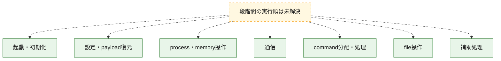
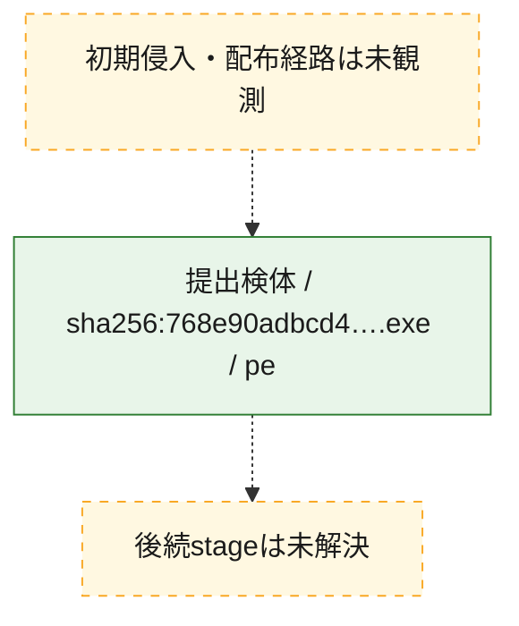
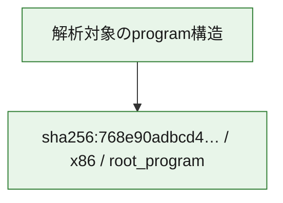

# 全体ロジック：768e90adbcd48bb7c8f2f577aa84167b3fd90b62a568a64e2f20518628de799c

代表関数の静的証跡から、起動・初期化、設定・payload復元、process・memory操作、通信、command分配・処理、file操作の処理群を確認しました。

## 読み方

- phaseの掲載順は解析上の整理順です。observed_call_edgesがない段階間の実行順を断定しません。
- 図の実線は静的に観測した関係、点線と黄色のノードは未観測・未解決の関係を示します。
- 図は静的な要約であり、動的実行を再現するものではありません。
- 詳細な関数解説とfingerprintは[STATIC-LOGIC.md](STATIC-LOGIC.md)を参照してください。

## 静的可視化

### 実行フロー

### 感染チェーン

### モジュール関係

## 処理段階

### 1. 起動・初期化

entry pointから初期化と後続処理への移行を確認します。
確度: `confirmed_static_function_evidence_with_limits`

- `768e90adbcd48bb7c8f2f577aa84167b3fd90b62a568a64e2f20518628de799c:ghidra:140287d40` — 初期化と主要処理への分岐を行う入口関数です。 状態: `failed`、選定理由: `entry_point`, `meaningful_symbol_name`, `probable_go_main_user_code`, `reviewed_call_centrality:40`, `role:entrypoint`
- `768e90adbcd48bb7c8f2f577aa84167b3fd90b62a568a64e2f20518628de799c:ghidra:14028a080` — 初期化と主要処理への分岐を行う入口関数です。 状態: `succeeded`、選定理由: `entry_point`, `meaningful_symbol_name`, `probable_go_main_user_code`, `reviewed_call_centrality:15`, `role:entrypoint`
- `768e90adbcd48bb7c8f2f577aa84167b3fd90b62a568a64e2f20518628de799c:ghidra:14028a720` — 初期化と主要処理への分岐を行う入口関数です。 状態: `succeeded`、選定理由: `entry_point`, `meaningful_symbol_name`, `probable_go_main_user_code`, `reviewed_call_centrality:4`, `role:entrypoint`
- `768e90adbcd48bb7c8f2f577aa84167b3fd90b62a568a64e2f20518628de799c:ghidra:14028a880` — 初期化と主要処理への分岐を行う入口関数です。 状態: `succeeded`、選定理由: `entry_point`, `meaningful_symbol_name`, `probable_go_main_user_code`, `reviewed_call_centrality:9`, `role:entrypoint`
- `768e90adbcd48bb7c8f2f577aa84167b3fd90b62a568a64e2f20518628de799c:ghidra:14028aba0` — 初期化と主要処理への分岐を行う入口関数です。 状態: `succeeded`、選定理由: `entry_point`, `meaningful_symbol_name`, `probable_go_main_user_code`, `reviewed_call_centrality:2`, `role:entrypoint`
- `768e90adbcd48bb7c8f2f577aa84167b3fd90b62a568a64e2f20518628de799c:ghidra:14028abe0` — 初期化と主要処理への分岐を行う入口関数です。 状態: `succeeded`、選定理由: `entry_point`, `meaningful_symbol_name`, `probable_go_main_user_code`, `reviewed_call_centrality:12`, `role:entrypoint`
- `768e90adbcd48bb7c8f2f577aa84167b3fd90b62a568a64e2f20518628de799c:ghidra:14028b040` — 初期化と主要処理への分岐を行う入口関数です。 状態: `succeeded`、選定理由: `entry_point`, `meaningful_symbol_name`, `probable_go_main_user_code`, `reviewed_call_centrality:3`, `role:entrypoint`
- `768e90adbcd48bb7c8f2f577aa84167b3fd90b62a568a64e2f20518628de799c:ghidra:14028b080` — 初期化と主要処理への分岐を行う入口関数です。 状態: `succeeded`、選定理由: `entry_point`, `meaningful_symbol_name`, `probable_go_main_user_code`, `reviewed_call_centrality:6`, `role:entrypoint`
- `768e90adbcd48bb7c8f2f577aa84167b3fd90b62a568a64e2f20518628de799c:ghidra:14028b200` — 初期化と主要処理への分岐を行う入口関数です。 状態: `succeeded`、選定理由: `entry_point`, `meaningful_symbol_name`, `probable_go_main_user_code`, `reviewed_call_centrality:13`, `role:entrypoint`
- `768e90adbcd48bb7c8f2f577aa84167b3fd90b62a568a64e2f20518628de799c:ghidra:14028b620` — 初期化と主要処理への分岐を行う入口関数です。 状態: `succeeded`、選定理由: `entry_point`, `meaningful_symbol_name`, `probable_go_main_user_code`, `reviewed_call_centrality:11`, `role:entrypoint`
- `768e90adbcd48bb7c8f2f577aa84167b3fd90b62a568a64e2f20518628de799c:ghidra:14028b9e0` — 初期化と主要処理への分岐を行う入口関数です。 状態: `succeeded`、選定理由: `entry_point`, `meaningful_symbol_name`, `probable_go_main_user_code`, `reviewed_call_centrality:12`, `role:entrypoint`
- `768e90adbcd48bb7c8f2f577aa84167b3fd90b62a568a64e2f20518628de799c:ghidra:14028c0a0` — 初期化と主要処理への分岐を行う入口関数です。 状態: `succeeded`、選定理由: `entry_point`, `meaningful_symbol_name`, `probable_go_main_user_code`, `reviewed_call_centrality:2`, `role:entrypoint`

### 2. 設定・payload復元

設定、resource、payload、暗号化データの復元・変換を確認します。
確度: `confirmed_static_function_evidence`

- `768e90adbcd48bb7c8f2f577aa84167b3fd90b62a568a64e2f20518628de799c:ghidra:140093540` — 設定、resource、payloadなどの解析・変換を行う関数です。 状態: `succeeded`、選定理由: `meaningful_symbol_name`, `reviewed_call_centrality:4`, `role:config_or_data_transform`
- `768e90adbcd48bb7c8f2f577aa84167b3fd90b62a568a64e2f20518628de799c:ghidra:1400936a0` — 設定、resource、payloadなどの解析・変換を行う関数です。 状態: `succeeded`、選定理由: `meaningful_symbol_name`, `reviewed_call_centrality:4`, `role:config_or_data_transform`
- `768e90adbcd48bb7c8f2f577aa84167b3fd90b62a568a64e2f20518628de799c:ghidra:140093800` — 設定、resource、payloadなどの解析・変換を行う関数です。 状態: `succeeded`、選定理由: `meaningful_symbol_name`, `reviewed_call_centrality:4`, `role:config_or_data_transform`
- `768e90adbcd48bb7c8f2f577aa84167b3fd90b62a568a64e2f20518628de799c:ghidra:140093940` — 設定、resource、payloadなどの解析・変換を行う関数です。 状態: `succeeded`、選定理由: `meaningful_symbol_name`, `reviewed_call_centrality:5`, `role:config_or_data_transform`
- `768e90adbcd48bb7c8f2f577aa84167b3fd90b62a568a64e2f20518628de799c:ghidra:1400a3e60` — 設定、resource、payloadなどの解析・変換を行う関数です。 状態: `succeeded`、選定理由: `meaningful_symbol_name`, `reviewed_call_centrality:5`, `role:config_or_data_transform`
- `768e90adbcd48bb7c8f2f577aa84167b3fd90b62a568a64e2f20518628de799c:ghidra:1400ab0e0` — 設定、resource、payloadなどの解析・変換を行う関数です。 状態: `succeeded`、選定理由: `meaningful_symbol_name`, `reviewed_call_centrality:5`, `role:config_or_data_transform`
- `768e90adbcd48bb7c8f2f577aa84167b3fd90b62a568a64e2f20518628de799c:ghidra:1400ca6a0` — 暗号、hash、encoding、または復号処理に関係する関数です。 状態: `succeeded`、選定理由: `meaningful_symbol_name`, `reviewed_call_centrality:4`, `role:cryptographic_transform`

### 3. process・memory操作

process、thread、module、memory操作と実行移行を確認します。
確度: `confirmed_static_function_evidence`

- `768e90adbcd48bb7c8f2f577aa84167b3fd90b62a568a64e2f20518628de799c:ghidra:1400ab300` — process、thread、module、またはmemory操作に関係する関数です。 状態: `succeeded`、選定理由: `meaningful_symbol_name`, `reviewed_call_centrality:6`, `role:process_or_memory_operation`
- `768e90adbcd48bb7c8f2f577aa84167b3fd90b62a568a64e2f20518628de799c:ghidra:1400ac920` — process、thread、module、またはmemory操作に関係する関数です。 状態: `succeeded`、選定理由: `meaningful_symbol_name`, `reviewed_call_centrality:6`, `role:process_or_memory_operation`

### 4. 通信

通信初期化、endpoint処理、送受信の役割を確認します。
確度: `confirmed_static_function_evidence`

- `768e90adbcd48bb7c8f2f577aa84167b3fd90b62a568a64e2f20518628de799c:ghidra:1400aa3c0` — 通信初期化、送受信、またはendpoint処理に関係する関数です。 状態: `succeeded`、選定理由: `meaningful_symbol_name`, `reviewed_call_centrality:3`, `role:network_communication`
- `768e90adbcd48bb7c8f2f577aa84167b3fd90b62a568a64e2f20518628de799c:ghidra:1400aa4c0` — 通信初期化、送受信、またはendpoint処理に関係する関数です。 状態: `succeeded`、選定理由: `meaningful_symbol_name`, `reviewed_call_centrality:3`, `role:network_communication`
- `768e90adbcd48bb7c8f2f577aa84167b3fd90b62a568a64e2f20518628de799c:ghidra:1400aa6c0` — 通信初期化、送受信、またはendpoint処理に関係する関数です。 状態: `succeeded`、選定理由: `meaningful_symbol_name`, `reviewed_call_centrality:3`, `role:network_communication`
- `768e90adbcd48bb7c8f2f577aa84167b3fd90b62a568a64e2f20518628de799c:ghidra:1400aa720` — 通信初期化、送受信、またはendpoint処理に関係する関数です。 状態: `succeeded`、選定理由: `meaningful_symbol_name`, `reviewed_call_centrality:4`, `role:network_communication`
- `768e90adbcd48bb7c8f2f577aa84167b3fd90b62a568a64e2f20518628de799c:ghidra:1400aa820` — 通信初期化、送受信、またはendpoint処理に関係する関数です。 状態: `succeeded`、選定理由: `meaningful_symbol_name`, `reviewed_call_centrality:7`, `role:network_communication`

### 5. command分配・処理

受信commandやtaskの解釈、分配、個別handlerへの移行を確認します。
確度: `confirmed_static_function_evidence`

- `768e90adbcd48bb7c8f2f577aa84167b3fd90b62a568a64e2f20518628de799c:ghidra:1400ad2c0` — commandの解釈、分配、または個別処理を担当する関数です。 状態: `succeeded`、選定理由: `meaningful_symbol_name`, `reviewed_call_centrality:5`, `role:command_dispatch_or_handler`

### 6. file操作

fileやdirectoryの作成、読書き、削除を確認します。
確度: `confirmed_static_function_evidence`

- `768e90adbcd48bb7c8f2f577aa84167b3fd90b62a568a64e2f20518628de799c:ghidra:1400aa980` — fileまたはdirectoryの読書き・管理に関係する関数です。 状態: `succeeded`、選定理由: `meaningful_symbol_name`, `reviewed_call_centrality:5`, `role:file_operation`
- `768e90adbcd48bb7c8f2f577aa84167b3fd90b62a568a64e2f20518628de799c:ghidra:1400ac520` — fileまたはdirectoryの読書き・管理に関係する関数です。 状態: `succeeded`、選定理由: `meaningful_symbol_name`, `reviewed_call_centrality:7`, `role:file_operation`
- `768e90adbcd48bb7c8f2f577aa84167b3fd90b62a568a64e2f20518628de799c:ghidra:1400ac620` — fileまたはdirectoryの読書き・管理に関係する関数です。 状態: `succeeded`、選定理由: `meaningful_symbol_name`, `reviewed_call_centrality:7`, `role:file_operation`

### 7. 補助処理

主要処理を支える一般内部関数またはlibrary処理を確認します。
確度: `confirmed_static_function_evidence`

- `768e90adbcd48bb7c8f2f577aa84167b3fd90b62a568a64e2f20518628de799c:ghidra:140001080` — compiler生成処理または汎用library処理とみられる関数です。 状態: `succeeded`、選定理由: `meaningful_symbol_name`, `reviewed_call_centrality:5`
- `768e90adbcd48bb7c8f2f577aa84167b3fd90b62a568a64e2f20518628de799c:ghidra:14007cbc0` — 検体内部の一般処理を実装する関数です。 状態: `succeeded`、選定理由: `meaningful_symbol_name`, `reviewed_call_centrality:3`

## 観測したcall関係

- `ghidra-function:0b81bb22cee8179272a4e8eb` → `ghidra-external:92349cd557070e1ef4cd2dd4` （`unclassified` → `unclassified`）
- `ghidra-function:0b81bb22cee8179272a4e8eb` → `ghidra-external:a7517a8812d5f03c78fffc34` （`unclassified` → `unclassified`）
- `ghidra-function:0b81bb22cee8179272a4e8eb` → `ghidra-external:ae0e6e3f685223a6807a0bbe` （`unclassified` → `unclassified`）
- `ghidra-function:0b81bb22cee8179272a4e8eb` → `ghidra-external:cbb42eb2c93f5bbaf2136756` （`unclassified` → `unclassified`）
- `ghidra-function:10a828af679401a28e6e4d80` → `ghidra-external:9d06bf7f57ecd5fd444fb557` （`unclassified` → `unclassified`）
- `ghidra-function:10a828af679401a28e6e4d80` → `ghidra-external:f5bf2641acc400abd9453bda` （`unclassified` → `unclassified`）
- `ghidra-function:32c75ce835b3911733bfd2ee` → `ghidra-external:00fd98ac1290aa5c8f01a074` （`unclassified` → `unclassified`）
- `ghidra-function:32c75ce835b3911733bfd2ee` → `ghidra-external:4802f8922c96881f0665e4ea` （`unclassified` → `unclassified`）
- `ghidra-function:32c75ce835b3911733bfd2ee` → `ghidra-external:4b3af77ab0adafbb1bb71c85` （`unclassified` → `unclassified`）
- `ghidra-function:32c75ce835b3911733bfd2ee` → `ghidra-external:a5448836dbc18fb7f0beee39` （`unclassified` → `unclassified`）
- `ghidra-function:466dcf39e335b44304f45a55` → `ghidra-external:1a3367010bd6760f0b13e691` （`unclassified` → `unclassified`）
- `ghidra-function:466dcf39e335b44304f45a55` → `ghidra-external:1ed23224d71b90b266f3ef43` （`unclassified` → `unclassified`）
- `ghidra-function:466dcf39e335b44304f45a55` → `ghidra-external:269e9611b638071b9807db1b` （`unclassified` → `unclassified`）
- `ghidra-function:466dcf39e335b44304f45a55` → `ghidra-external:3126bf1426d12d29c76d0a3b` （`unclassified` → `unclassified`）
- `ghidra-function:466dcf39e335b44304f45a55` → `ghidra-external:4b3af77ab0adafbb1bb71c85` （`unclassified` → `unclassified`）
- `ghidra-function:466dcf39e335b44304f45a55` → `ghidra-external:94a2d45cfefe1bf08de5eacf` （`unclassified` → `unclassified`）
- `ghidra-function:466dcf39e335b44304f45a55` → `ghidra-external:f88a637780900e00bd296372` （`unclassified` → `unclassified`）
- `ghidra-function:47be1cc063221c9bb728c2cf` → `ghidra-external:ae0e6e3f685223a6807a0bbe` （`unclassified` → `unclassified`）
- `ghidra-function:47be1cc063221c9bb728c2cf` → `ghidra-external:c07cdfc2a0b39a59085adfc8` （`unclassified` → `unclassified`）
- `ghidra-function:47be1cc063221c9bb728c2cf` → `ghidra-external:cbb42eb2c93f5bbaf2136756` （`unclassified` → `unclassified`）
- `ghidra-function:47be1cc063221c9bb728c2cf` → `ghidra-external:db195a146c80284b289b255c` （`unclassified` → `unclassified`）
- `ghidra-function:51c6a57800e3d433b28174c3` → `ghidra-external:4b3af77ab0adafbb1bb71c85` （`unclassified` → `unclassified`）
- `ghidra-function:51c6a57800e3d433b28174c3` → `ghidra-external:880e146da6b94d8e79eb3d3a` （`unclassified` → `unclassified`）
- `ghidra-function:51c6a57800e3d433b28174c3` → `ghidra-external:c089b7869fed2d0ea200522f` （`unclassified` → `unclassified`）
- `ghidra-function:60f6da2f17ceab0652b71695` → `ghidra-external:0a6a593b8cc8742daac5d4a5` （`unclassified` → `unclassified`）
- `ghidra-function:60f6da2f17ceab0652b71695` → `ghidra-external:1928ee573d37b5eac28829a2` （`unclassified` → `unclassified`）
- `ghidra-function:60f6da2f17ceab0652b71695` → `ghidra-external:4802f8922c96881f0665e4ea` （`unclassified` → `unclassified`）
- `ghidra-function:60f6da2f17ceab0652b71695` → `ghidra-external:4b3af77ab0adafbb1bb71c85` （`unclassified` → `unclassified`）
- `ghidra-function:60f6da2f17ceab0652b71695` → `ghidra-external:6f4ca4f8a0d6c59b86ba2aae` （`unclassified` → `unclassified`）
- `ghidra-function:60f6da2f17ceab0652b71695` → `ghidra-external:83a78e836e061b5240287af4` （`unclassified` → `unclassified`）
- `ghidra-function:60f6da2f17ceab0652b71695` → `ghidra-external:acd1a0b8a76c2bf69826765c` （`unclassified` → `unclassified`）
- `ghidra-function:60f6da2f17ceab0652b71695` → `ghidra-external:bc8d11fefbdf29869c1b3aba` （`unclassified` → `unclassified`）
- `ghidra-function:60f6da2f17ceab0652b71695` → `ghidra-external:de5a2b0e12624f46082048e7` （`unclassified` → `unclassified`）
- `ghidra-function:6aadd2f762095e0a3848c167` → `ghidra-external:00fd98ac1290aa5c8f01a074` （`unclassified` → `unclassified`）
- `ghidra-function:6aadd2f762095e0a3848c167` → `ghidra-external:0a6a593b8cc8742daac5d4a5` （`unclassified` → `unclassified`）
- `ghidra-function:6aadd2f762095e0a3848c167` → `ghidra-external:188bbcd43d76dcd9104b254d` （`unclassified` → `unclassified`）
- `ghidra-function:6aadd2f762095e0a3848c167` → `ghidra-external:1928ee573d37b5eac28829a2` （`unclassified` → `unclassified`）
- `ghidra-function:6aadd2f762095e0a3848c167` → `ghidra-external:224b54ec4c79a087f2906a23` （`unclassified` → `unclassified`）
- `ghidra-function:6aadd2f762095e0a3848c167` → `ghidra-external:2476ff99d15c9b88e74e80ed` （`unclassified` → `unclassified`）
- `ghidra-function:6aadd2f762095e0a3848c167` → `ghidra-external:269e9611b638071b9807db1b` （`unclassified` → `unclassified`）
- `ghidra-function:6aadd2f762095e0a3848c167` → `ghidra-external:2835e2001a1ed46d29b5c911` （`unclassified` → `unclassified`）
- `ghidra-function:6aadd2f762095e0a3848c167` → `ghidra-external:312f3683b95136e8b77dce62` （`unclassified` → `unclassified`）
- `ghidra-function:6aadd2f762095e0a3848c167` → `ghidra-external:32218b2ee8fa5bb6e3dadc8a` （`unclassified` → `unclassified`）
- `ghidra-function:6aadd2f762095e0a3848c167` → `ghidra-external:3703505de05e5c1c6acb6cd4` （`unclassified` → `unclassified`）
- `ghidra-function:6aadd2f762095e0a3848c167` → `ghidra-external:47fe9d864051e113252aea6b` （`unclassified` → `unclassified`）
- `ghidra-function:6aadd2f762095e0a3848c167` → `ghidra-external:4802f8922c96881f0665e4ea` （`unclassified` → `unclassified`）
- `ghidra-function:6aadd2f762095e0a3848c167` → `ghidra-external:49aecbd309ff8d26d7376b4b` （`unclassified` → `unclassified`）
- `ghidra-function:6aadd2f762095e0a3848c167` → `ghidra-external:4b3af77ab0adafbb1bb71c85` （`unclassified` → `unclassified`）
- `ghidra-function:6aadd2f762095e0a3848c167` → `ghidra-external:4e8e4a19364c602e61e750ff` （`unclassified` → `unclassified`）
- `ghidra-function:6aadd2f762095e0a3848c167` → `ghidra-external:571035b2c99e82ae9e0056b0` （`unclassified` → `unclassified`）
- `ghidra-function:6aadd2f762095e0a3848c167` → `ghidra-external:5f647c19a6562f9fedf7b792` （`unclassified` → `unclassified`）
- `ghidra-function:6aadd2f762095e0a3848c167` → `ghidra-external:66e9af51b4a632509958eb03` （`unclassified` → `unclassified`）
- `ghidra-function:6aadd2f762095e0a3848c167` → `ghidra-external:696c9204bca3b7ab76725364` （`unclassified` → `unclassified`）
- `ghidra-function:6aadd2f762095e0a3848c167` → `ghidra-external:7c80b46462cd9f9b4448dac4` （`unclassified` → `unclassified`）
- `ghidra-function:6aadd2f762095e0a3848c167` → `ghidra-external:80142e933166a13fc5139a19` （`unclassified` → `unclassified`）
- `ghidra-function:6aadd2f762095e0a3848c167` → `ghidra-external:80f8c39052a11dec4f743373` （`unclassified` → `unclassified`）
- `ghidra-function:6aadd2f762095e0a3848c167` → `ghidra-external:88aef8750f8f0f059c677e79` （`unclassified` → `unclassified`）
- `ghidra-function:6aadd2f762095e0a3848c167` → `ghidra-external:8cc2218826f429913c3df249` （`unclassified` → `unclassified`）
- `ghidra-function:6aadd2f762095e0a3848c167` → `ghidra-external:96a2fc12206c64239a847a12` （`unclassified` → `unclassified`）
- `ghidra-function:6aadd2f762095e0a3848c167` → `ghidra-external:9a5c4095e1e370c7034c87fc` （`unclassified` → `unclassified`）
- `ghidra-function:6aadd2f762095e0a3848c167` → `ghidra-external:9b1983b0c20f81d5df4c694f` （`unclassified` → `unclassified`）
- `ghidra-function:6aadd2f762095e0a3848c167` → `ghidra-external:9c530cd2a54f844332accc9c` （`unclassified` → `unclassified`）
- `ghidra-function:6aadd2f762095e0a3848c167` → `ghidra-external:a2e69f9d9d90ac0502f321fd` （`unclassified` → `unclassified`）
- `ghidra-function:6aadd2f762095e0a3848c167` → `ghidra-external:a7517a8812d5f03c78fffc34` （`unclassified` → `unclassified`）
- `ghidra-function:6aadd2f762095e0a3848c167` → `ghidra-external:ab7caa7fd724abf853a46ea4` （`unclassified` → `unclassified`）
- `ghidra-function:6aadd2f762095e0a3848c167` → `ghidra-external:af75c330b1fc70684aae8135` （`unclassified` → `unclassified`）
- `ghidra-function:6aadd2f762095e0a3848c167` → `ghidra-external:c82890ae7893ef5ee546b51a` （`unclassified` → `unclassified`）
- `ghidra-function:6aadd2f762095e0a3848c167` → `ghidra-external:cbb42eb2c93f5bbaf2136756` （`unclassified` → `unclassified`）
- `ghidra-function:6aadd2f762095e0a3848c167` → `ghidra-external:db6711c50234a8a45323a79d` （`unclassified` → `unclassified`）
- `ghidra-function:6aadd2f762095e0a3848c167` → `ghidra-external:ee91816effb96772f8c8b782` （`unclassified` → `unclassified`）
- `ghidra-function:6aadd2f762095e0a3848c167` → `ghidra-external:f625edcc00f25f1c6ebc7605` （`unclassified` → `unclassified`）
- `ghidra-function:6aadd2f762095e0a3848c167` → `ghidra-external:f93adaa6ac7d7bd1749b2b0a` （`unclassified` → `unclassified`）
- `ghidra-function:6aadd2f762095e0a3848c167` → `ghidra-external:f982a4be44cf93afc433cb0f` （`unclassified` → `unclassified`）
- `ghidra-function:6c3de3580b759afced3fcbe0` → `ghidra-external:46a9985db41855acb5688133` （`unclassified` → `unclassified`）
- `ghidra-function:6c3de3580b759afced3fcbe0` → `ghidra-external:9d06bf7f57ecd5fd444fb557` （`unclassified` → `unclassified`）
- `ghidra-function:6e2fe507116f7baf24a3655d` → `ghidra-external:0013952a30b1ec2bc3e99655` （`unclassified` → `unclassified`）
- `ghidra-function:6e2fe507116f7baf24a3655d` → `ghidra-external:0a6a593b8cc8742daac5d4a5` （`unclassified` → `unclassified`）
- `ghidra-function:6e2fe507116f7baf24a3655d` → `ghidra-external:1928ee573d37b5eac28829a2` （`unclassified` → `unclassified`）
- `ghidra-function:6e2fe507116f7baf24a3655d` → `ghidra-external:312f3683b95136e8b77dce62` （`unclassified` → `unclassified`）
- `ghidra-function:6e2fe507116f7baf24a3655d` → `ghidra-external:4b3af77ab0adafbb1bb71c85` （`unclassified` → `unclassified`）
- `ghidra-function:6e2fe507116f7baf24a3655d` → `ghidra-external:4e8e4a19364c602e61e750ff` （`unclassified` → `unclassified`）
- `ghidra-function:6e2fe507116f7baf24a3655d` → `ghidra-external:579146e50fb1ff11b53674b8` （`unclassified` → `unclassified`）
- `ghidra-function:6e2fe507116f7baf24a3655d` → `ghidra-external:686378f7409dcc5847581377` （`unclassified` → `unclassified`）
- `ghidra-function:6e2fe507116f7baf24a3655d` → `ghidra-external:8671f2933927d1d05445f525` （`unclassified` → `unclassified`）
- `ghidra-function:6e2fe507116f7baf24a3655d` → `ghidra-external:88aef8750f8f0f059c677e79` （`unclassified` → `unclassified`）
- `ghidra-function:6e2fe507116f7baf24a3655d` → `ghidra-external:aa4350e30aa75f6a8b419282` （`unclassified` → `unclassified`）
- `ghidra-function:6f4b43af6b0e44a9653a6eb2` → `ghidra-external:0a6a593b8cc8742daac5d4a5` （`unclassified` → `unclassified`）
- `ghidra-function:6f4b43af6b0e44a9653a6eb2` → `ghidra-external:0b0d7eeb91f6148124ef5c84` （`unclassified` → `unclassified`）
- `ghidra-function:6f4b43af6b0e44a9653a6eb2` → `ghidra-external:1928ee573d37b5eac28829a2` （`unclassified` → `unclassified`）
- `ghidra-function:6f4b43af6b0e44a9653a6eb2` → `ghidra-external:4802f8922c96881f0665e4ea` （`unclassified` → `unclassified`）
- `ghidra-function:6f4b43af6b0e44a9653a6eb2` → `ghidra-external:4b3af77ab0adafbb1bb71c85` （`unclassified` → `unclassified`）
- `ghidra-function:6f4b43af6b0e44a9653a6eb2` → `ghidra-external:c089b7869fed2d0ea200522f` （`unclassified` → `unclassified`）
- `ghidra-function:6f4b43af6b0e44a9653a6eb2` → `ghidra-external:e8e32fc2fde9bacb60d0c04a` （`unclassified` → `unclassified`）
- `ghidra-function:71b228cd5012f68bf7d68c94` → `ghidra-external:4b3af77ab0adafbb1bb71c85` （`unclassified` → `unclassified`）
- `ghidra-function:71b228cd5012f68bf7d68c94` → `ghidra-external:92349cd557070e1ef4cd2dd4` （`unclassified` → `unclassified`）
- `ghidra-function:71b228cd5012f68bf7d68c94` → `ghidra-external:abafd4fbdaad6685c7905470` （`unclassified` → `unclassified`）
- `ghidra-function:71b228cd5012f68bf7d68c94` → `ghidra-external:cbb42eb2c93f5bbaf2136756` （`unclassified` → `unclassified`）
- `ghidra-function:82eac56d4ee9c2bdffab38e9` → `ghidra-external:0013952a30b1ec2bc3e99655` （`unclassified` → `unclassified`）
- `ghidra-function:82eac56d4ee9c2bdffab38e9` → `ghidra-external:312f3683b95136e8b77dce62` （`unclassified` → `unclassified`）
- `ghidra-function:82eac56d4ee9c2bdffab38e9` → `ghidra-external:3703505de05e5c1c6acb6cd4` （`unclassified` → `unclassified`）
- `ghidra-function:82eac56d4ee9c2bdffab38e9` → `ghidra-external:425ee8ae4d57938aef972af4` （`unclassified` → `unclassified`）
- `ghidra-function:82eac56d4ee9c2bdffab38e9` → `ghidra-external:4b3af77ab0adafbb1bb71c85` （`unclassified` → `unclassified`）
- `ghidra-function:82eac56d4ee9c2bdffab38e9` → `ghidra-external:5f647c19a6562f9fedf7b792` （`unclassified` → `unclassified`）
- `ghidra-function:82eac56d4ee9c2bdffab38e9` → `ghidra-external:88aef8750f8f0f059c677e79` （`unclassified` → `unclassified`）
- `ghidra-function:82eac56d4ee9c2bdffab38e9` → `ghidra-external:9b1983b0c20f81d5df4c694f` （`unclassified` → `unclassified`）
- `ghidra-function:82eac56d4ee9c2bdffab38e9` → `ghidra-external:aa4350e30aa75f6a8b419282` （`unclassified` → `unclassified`）
- `ghidra-function:82eac56d4ee9c2bdffab38e9` → `ghidra-external:c5c9090a3d55126e2ad1f976` （`unclassified` → `unclassified`）
- `ghidra-function:82eac56d4ee9c2bdffab38e9` → `ghidra-external:cbb42eb2c93f5bbaf2136756` （`unclassified` → `unclassified`）
- `ghidra-function:82eac56d4ee9c2bdffab38e9` → `ghidra-external:f5cb0a256a07a35596581107` （`unclassified` → `unclassified`）
- `ghidra-function:8960add13202da2485960257` → `ghidra-external:15210ce814b9cb5204bae869` （`unclassified` → `unclassified`）
- `ghidra-function:8960add13202da2485960257` → `ghidra-external:3126bf1426d12d29c76d0a3b` （`unclassified` → `unclassified`）
- `ghidra-function:8960add13202da2485960257` → `ghidra-external:4b3af77ab0adafbb1bb71c85` （`unclassified` → `unclassified`）
- `ghidra-function:8960add13202da2485960257` → `ghidra-external:ad8c5a9f1509ceffc78bd1e9` （`unclassified` → `unclassified`）
- `ghidra-function:8960add13202da2485960257` → `ghidra-external:cbb42eb2c93f5bbaf2136756` （`unclassified` → `unclassified`）
- `ghidra-function:8e2be27922108759194110b6` → `ghidra-external:2a2f562ff0f5fb85d7c47c2a` （`unclassified` → `unclassified`）
- `ghidra-function:8e2be27922108759194110b6` → `ghidra-external:4b3af77ab0adafbb1bb71c85` （`unclassified` → `unclassified`）
- `ghidra-function:8e2be27922108759194110b6` → `ghidra-external:aa4350e30aa75f6a8b419282` （`unclassified` → `unclassified`）
- `ghidra-function:8e2be27922108759194110b6` → `ghidra-external:cbb42eb2c93f5bbaf2136756` （`unclassified` → `unclassified`）
- `ghidra-function:8e2be27922108759194110b6` → `ghidra-external:f5e5477c4b146e1eda485675` （`unclassified` → `unclassified`）
- `ghidra-function:8ff2024177ba927c4612fe29` → `ghidra-external:1928ee573d37b5eac28829a2` （`unclassified` → `unclassified`）
- `ghidra-function:8ff2024177ba927c4612fe29` → `ghidra-external:2476ff99d15c9b88e74e80ed` （`unclassified` → `unclassified`）
- `ghidra-function:8ff2024177ba927c4612fe29` → `ghidra-external:269e9611b638071b9807db1b` （`unclassified` → `unclassified`）
- `ghidra-function:8ff2024177ba927c4612fe29` → `ghidra-external:2fdb89e6b77cfc773ad9ce65` （`unclassified` → `unclassified`）
- `ghidra-function:8ff2024177ba927c4612fe29` → `ghidra-external:346bd99d5d1882ec5fd07e56` （`unclassified` → `unclassified`）
- `ghidra-function:8ff2024177ba927c4612fe29` → `ghidra-external:4b3af77ab0adafbb1bb71c85` （`unclassified` → `unclassified`）
- `ghidra-function:8ff2024177ba927c4612fe29` → `ghidra-external:546deee89404996a61ae6421` （`unclassified` → `unclassified`）
- `ghidra-function:8ff2024177ba927c4612fe29` → `ghidra-external:80f8c39052a11dec4f743373` （`unclassified` → `unclassified`）
- `ghidra-function:8ff2024177ba927c4612fe29` → `ghidra-external:88aef8750f8f0f059c677e79` （`unclassified` → `unclassified`）
- `ghidra-function:8ff2024177ba927c4612fe29` → `ghidra-external:96a2fc12206c64239a847a12` （`unclassified` → `unclassified`）
- `ghidra-function:8ff2024177ba927c4612fe29` → `ghidra-external:c5c9090a3d55126e2ad1f976` （`unclassified` → `unclassified`）
- `ghidra-function:8ff2024177ba927c4612fe29` → `ghidra-external:e056aa240bfd9e8632cb39f0` （`unclassified` → `unclassified`）
- `ghidra-function:8ff2024177ba927c4612fe29` → `ghidra-external:f625edcc00f25f1c6ebc7605` （`unclassified` → `unclassified`）
- `ghidra-function:9110f382b17efb0d39947190` → `ghidra-external:1897f1ecdc352bdc8fead432` （`unclassified` → `unclassified`）
- `ghidra-function:9110f382b17efb0d39947190` → `ghidra-external:949252b358c2781e956fc178` （`unclassified` → `unclassified`）
- `ghidra-function:9110f382b17efb0d39947190` → `ghidra-external:a5107e003ad670694e0bef71` （`unclassified` → `unclassified`）
- `ghidra-function:96fdf6af213de923ee954304` → `ghidra-external:0a6a593b8cc8742daac5d4a5` （`unclassified` → `unclassified`）
- `ghidra-function:96fdf6af213de923ee954304` → `ghidra-external:1928ee573d37b5eac28829a2` （`unclassified` → `unclassified`）
- `ghidra-function:96fdf6af213de923ee954304` → `ghidra-external:269e9611b638071b9807db1b` （`unclassified` → `unclassified`）
- `ghidra-function:96fdf6af213de923ee954304` → `ghidra-external:27d9ddeb32148461edeb1c6d` （`unclassified` → `unclassified`）
- `ghidra-function:96fdf6af213de923ee954304` → `ghidra-external:3126bf1426d12d29c76d0a3b` （`unclassified` → `unclassified`）
- `ghidra-function:96fdf6af213de923ee954304` → `ghidra-external:3134b3d8e8200f46b591b1ad` （`unclassified` → `unclassified`）
- `ghidra-function:96fdf6af213de923ee954304` → `ghidra-external:4b3af77ab0adafbb1bb71c85` （`unclassified` → `unclassified`）
- `ghidra-function:96fdf6af213de923ee954304` → `ghidra-external:7c80b46462cd9f9b4448dac4` （`unclassified` → `unclassified`）
- `ghidra-function:96fdf6af213de923ee954304` → `ghidra-external:8cd2518302bf9148d90f649e` （`unclassified` → `unclassified`）
- `ghidra-function:96fdf6af213de923ee954304` → `ghidra-external:de5a2b0e12624f46082048e7` （`unclassified` → `unclassified`）
- `ghidra-function:96fdf6af213de923ee954304` → `ghidra-external:fa0c7f773e1cd4e5d53562ad` （`unclassified` → `unclassified`）
- `ghidra-function:96fdf6af213de923ee954304` → `ghidra-external:fea2fe0d02db6618fcfd726d` （`unclassified` → `unclassified`）
- `ghidra-function:9ffbec0a4bb8a2acb7a3c5de` → `ghidra-external:075d67daefa299ada58d90cc` （`unclassified` → `unclassified`）
- `ghidra-function:9ffbec0a4bb8a2acb7a3c5de` → `ghidra-external:4b3af77ab0adafbb1bb71c85` （`unclassified` → `unclassified`）
- `ghidra-function:9ffbec0a4bb8a2acb7a3c5de` → `ghidra-external:aa4350e30aa75f6a8b419282` （`unclassified` → `unclassified`）
- `ghidra-function:9ffbec0a4bb8a2acb7a3c5de` → `ghidra-external:cbb42eb2c93f5bbaf2136756` （`unclassified` → `unclassified`）
- `ghidra-function:9ffbec0a4bb8a2acb7a3c5de` → `ghidra-external:d0088546e5647666747cd1fe` （`unclassified` → `unclassified`）
- `ghidra-function:a64a48d1914ed902bc07df5c` → `ghidra-external:502ae7ef369a0dc217c6b7d2` （`unclassified` → `unclassified`）
- `ghidra-function:a64a48d1914ed902bc07df5c` → `ghidra-external:77370b9808d3f282b79ae1c1` （`unclassified` → `unclassified`）
- `ghidra-function:a64a48d1914ed902bc07df5c` → `ghidra-external:9d06bf7f57ecd5fd444fb557` （`unclassified` → `unclassified`）
- `ghidra-function:ae5adb65ff62952beb4f2f84` → `ghidra-external:1a3367010bd6760f0b13e691` （`unclassified` → `unclassified`）
- `ghidra-function:ae5adb65ff62952beb4f2f84` → `ghidra-external:1ed23224d71b90b266f3ef43` （`unclassified` → `unclassified`）
- `ghidra-function:ae5adb65ff62952beb4f2f84` → `ghidra-external:269e9611b638071b9807db1b` （`unclassified` → `unclassified`）
- `ghidra-function:ae5adb65ff62952beb4f2f84` → `ghidra-external:3d15840be81ad6194d2b49fa` （`unclassified` → `unclassified`）
- `ghidra-function:ae5adb65ff62952beb4f2f84` → `ghidra-external:4b3af77ab0adafbb1bb71c85` （`unclassified` → `unclassified`）
- `ghidra-function:ae5adb65ff62952beb4f2f84` → `ghidra-external:f88a637780900e00bd296372` （`unclassified` → `unclassified`）
- `ghidra-function:bac75e2c2ebcbf5c19d2b676` → `ghidra-external:1a3367010bd6760f0b13e691` （`unclassified` → `unclassified`）
- `ghidra-function:bac75e2c2ebcbf5c19d2b676` → `ghidra-external:1ed23224d71b90b266f3ef43` （`unclassified` → `unclassified`）
- `ghidra-function:bac75e2c2ebcbf5c19d2b676` → `ghidra-external:4b3af77ab0adafbb1bb71c85` （`unclassified` → `unclassified`）
- `ghidra-function:bac75e2c2ebcbf5c19d2b676` → `ghidra-external:7073a69a861f20bea6cd1348` （`unclassified` → `unclassified`）
- `ghidra-function:bac75e2c2ebcbf5c19d2b676` → `ghidra-external:f88a637780900e00bd296372` （`unclassified` → `unclassified`）
- `ghidra-function:bd83e5a0381122cfa769edf5` → `ghidra-external:1a3367010bd6760f0b13e691` （`unclassified` → `unclassified`）
- `ghidra-function:bd83e5a0381122cfa769edf5` → `ghidra-external:1ed23224d71b90b266f3ef43` （`unclassified` → `unclassified`）
- `ghidra-function:bd83e5a0381122cfa769edf5` → `ghidra-external:254f43ba745a069c919efb72` （`unclassified` → `unclassified`）
- `ghidra-function:bd83e5a0381122cfa769edf5` → `ghidra-external:269e9611b638071b9807db1b` （`unclassified` → `unclassified`）
- `ghidra-function:bd83e5a0381122cfa769edf5` → `ghidra-external:3126bf1426d12d29c76d0a3b` （`unclassified` → `unclassified`）
- `ghidra-function:bd83e5a0381122cfa769edf5` → `ghidra-external:4b3af77ab0adafbb1bb71c85` （`unclassified` → `unclassified`）
- `ghidra-function:bd83e5a0381122cfa769edf5` → `ghidra-external:f88a637780900e00bd296372` （`unclassified` → `unclassified`）
- `ghidra-function:bfd23c63a84b1d78f315f149` → `ghidra-external:42edc5afa8d21f2bcbb5f95a` （`unclassified` → `unclassified`）
- `ghidra-function:bfd23c63a84b1d78f315f149` → `ghidra-external:4b3af77ab0adafbb1bb71c85` （`unclassified` → `unclassified`）
- `ghidra-function:bfd23c63a84b1d78f315f149` → `ghidra-external:dc34708e59b79d594f45682a` （`unclassified` → `unclassified`）
- `ghidra-function:c5d20e6840e70fd9ba032d5a` → `ghidra-external:4b3af77ab0adafbb1bb71c85` （`unclassified` → `unclassified`）
- `ghidra-function:c5d20e6840e70fd9ba032d5a` → `ghidra-external:69829808c49bf0eea3c1e8da` （`unclassified` → `unclassified`）
- `ghidra-function:c5d20e6840e70fd9ba032d5a` → `ghidra-external:c1b011d4ec5b12a8bec89521` （`unclassified` → `unclassified`）
- `ghidra-function:d0bad6179ed316441d56e94c` → `ghidra-external:4b3af77ab0adafbb1bb71c85` （`unclassified` → `unclassified`）
- `ghidra-function:d0bad6179ed316441d56e94c` → `ghidra-external:6578e9df85a19dd67f9260ff` （`unclassified` → `unclassified`）
- `ghidra-function:d0bad6179ed316441d56e94c` → `ghidra-external:686378f7409dcc5847581377` （`unclassified` → `unclassified`）
- `ghidra-function:d0bad6179ed316441d56e94c` → `ghidra-external:80142e933166a13fc5139a19` （`unclassified` → `unclassified`）
- `ghidra-function:d0bad6179ed316441d56e94c` → `ghidra-external:9b1983b0c20f81d5df4c694f` （`unclassified` → `unclassified`）
- `ghidra-function:d0bad6179ed316441d56e94c` → `ghidra-external:ca0a23267243a762db55d980` （`unclassified` → `unclassified`）
- `ghidra-function:d18d0b33139098bbd29a77df` → `ghidra-external:00fd98ac1290aa5c8f01a074` （`unclassified` → `unclassified`）
- `ghidra-function:d18d0b33139098bbd29a77df` → `ghidra-external:2476ff99d15c9b88e74e80ed` （`unclassified` → `unclassified`）
- `ghidra-function:d18d0b33139098bbd29a77df` → `ghidra-external:3799b0dfdc560740ea17b638` （`unclassified` → `unclassified`）
- `ghidra-function:d18d0b33139098bbd29a77df` → `ghidra-external:4802f8922c96881f0665e4ea` （`unclassified` → `unclassified`）
- `ghidra-function:d18d0b33139098bbd29a77df` → `ghidra-external:4b3af77ab0adafbb1bb71c85` （`unclassified` → `unclassified`）
- `ghidra-function:d18d0b33139098bbd29a77df` → `ghidra-external:5f647c19a6562f9fedf7b792` （`unclassified` → `unclassified`）
- `ghidra-function:d18d0b33139098bbd29a77df` → `ghidra-external:6578e9df85a19dd67f9260ff` （`unclassified` → `unclassified`）
- `ghidra-function:d18d0b33139098bbd29a77df` → `ghidra-external:7347270465c0ccad0a4f5f9d` （`unclassified` → `unclassified`）
- `ghidra-function:d18d0b33139098bbd29a77df` → `ghidra-external:80142e933166a13fc5139a19` （`unclassified` → `unclassified`）
- `ghidra-function:d18d0b33139098bbd29a77df` → `ghidra-external:9b1983b0c20f81d5df4c694f` （`unclassified` → `unclassified`）
- `ghidra-function:d18d0b33139098bbd29a77df` → `ghidra-external:9c530cd2a54f844332accc9c` （`unclassified` → `unclassified`）
- `ghidra-function:d18d0b33139098bbd29a77df` → `ghidra-external:ac558a5f0b40dc5af5df679e` （`unclassified` → `unclassified`）
- `ghidra-function:d18d0b33139098bbd29a77df` → `ghidra-external:acd1a0b8a76c2bf69826765c` （`unclassified` → `unclassified`）
- `ghidra-function:d18d0b33139098bbd29a77df` → `ghidra-external:b2a08bc0d3fa3b3903bc11a3` （`unclassified` → `unclassified`）
- `ghidra-function:d18d0b33139098bbd29a77df` → `ghidra-external:f5cb0a256a07a35596581107` （`unclassified` → `unclassified`）
- 残り24件は`static-logic.json`に記録しています。

## 解析範囲と制約

- 選定外関数は全体inventoryへ残しますが、関数本体の個別解説対象にはしていません。
- indirect call、難読化、packer、VM、壊れたcontrol flowによりcall関係が欠落する場合があります。
- 文書は静的解析に基づき、検体実行や外部通信による動的確認は行っていません。
