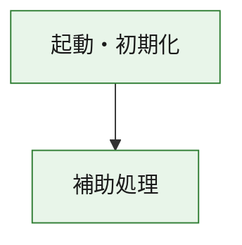
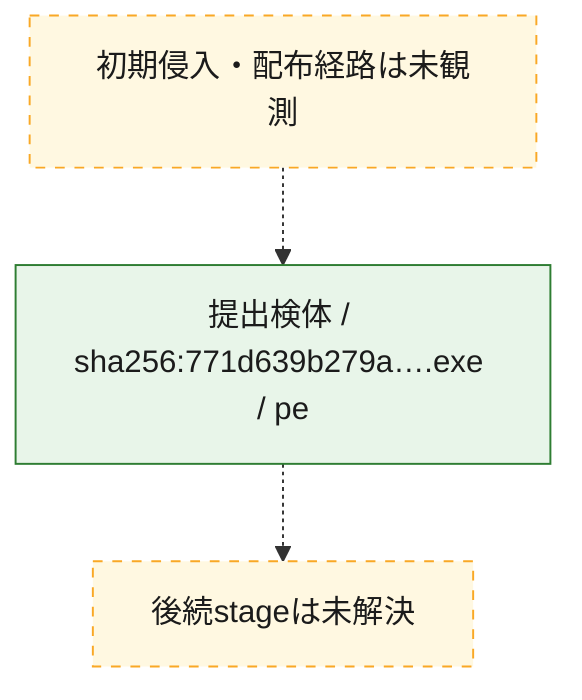
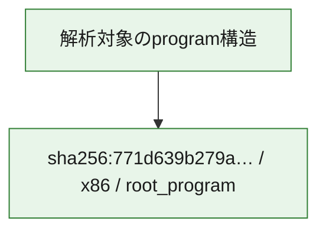

# 全体ロジック：771d639b279a0ade8088f703ec4d5eed8a65fba3addfc318fa8babf053175db2

代表関数の静的証跡から、起動・初期化の処理群を確認しました。

## 読み方

- phaseの掲載順は解析上の整理順です。observed_call_edgesがない段階間の実行順を断定しません。
- 図の実線は静的に観測した関係、点線と黄色のノードは未観測・未解決の関係を示します。
- 図は静的な要約であり、動的実行を再現するものではありません。
- 詳細な関数解説とfingerprintは[STATIC-LOGIC.md](STATIC-LOGIC.md)を参照してください。

## 静的可視化

### 実行フロー

### 感染チェーン

### モジュール関係

## 処理段階

### 1. 起動・初期化

entry pointから初期化と後続処理への移行を確認します。
確度: `confirmed_static_function_evidence`

- `771d639b279a0ade8088f703ec4d5eed8a65fba3addfc318fa8babf053175db2:ghidra:180001010` — 初期化と主要処理への分岐を行う入口関数です。 状態: `succeeded`、選定理由: `entry_point`, `meaningful_symbol_name`, `reviewed_call_centrality:22`, `role:entrypoint`, `small_program_complete_context`

### 2. 補助処理

主要処理を支える一般内部関数またはlibrary処理を確認します。
確度: `confirmed_static_function_evidence`

- `771d639b279a0ade8088f703ec4d5eed8a65fba3addfc318fa8babf053175db2:ghidra:180001240` — 検体内部の一般処理を実装する関数です。 状態: `succeeded`、選定理由: `context_representative`, `reviewed_call_centrality:2`, `small_program_complete_context`
- `771d639b279a0ade8088f703ec4d5eed8a65fba3addfc318fa8babf053175db2:ghidra:180001350` — 検体内部の一般処理を実装する関数です。 状態: `succeeded`、選定理由: `context_representative`, `reviewed_call_centrality:25`, `small_program_complete_context`
- `771d639b279a0ade8088f703ec4d5eed8a65fba3addfc318fa8babf053175db2:ghidra:180003780` — 検体内部の一般処理を実装する関数です。 状態: `succeeded`、選定理由: `context_representative`, `reviewed_call_centrality:2`, `small_program_complete_context`
- `771d639b279a0ade8088f703ec4d5eed8a65fba3addfc318fa8babf053175db2:ghidra:1800038e0` — 検体内部の一般処理を実装する関数です。 状態: `succeeded`、選定理由: `context_representative`, `reviewed_call_centrality:2`, `small_program_complete_context`

## 観測したcall関係

- `771d639b279a0ade8088f703ec4d5eed8a65fba3addfc318fa8babf053175db2:ghidra:180001010` → `771d639b279a0ade8088f703ec4d5eed8a65fba3addfc318fa8babf053175db2:ghidra:180001240` （`startup` → `support`）
- `771d639b279a0ade8088f703ec4d5eed8a65fba3addfc318fa8babf053175db2:ghidra:180001010` → `771d639b279a0ade8088f703ec4d5eed8a65fba3addfc318fa8babf053175db2:ghidra:180001350` （`startup` → `support`）
- `771d639b279a0ade8088f703ec4d5eed8a65fba3addfc318fa8babf053175db2:ghidra:180001350` → `771d639b279a0ade8088f703ec4d5eed8a65fba3addfc318fa8babf053175db2:ghidra:180001240` （`support` → `support`）
- `771d639b279a0ade8088f703ec4d5eed8a65fba3addfc318fa8babf053175db2:ghidra:180001350` → `771d639b279a0ade8088f703ec4d5eed8a65fba3addfc318fa8babf053175db2:ghidra:180003780` （`support` → `support`）
- `771d639b279a0ade8088f703ec4d5eed8a65fba3addfc318fa8babf053175db2:ghidra:180001350` → `771d639b279a0ade8088f703ec4d5eed8a65fba3addfc318fa8babf053175db2:ghidra:1800038e0` （`support` → `support`）
- `771d639b279a0ade8088f703ec4d5eed8a65fba3addfc318fa8babf053175db2:ghidra:180003780` → `771d639b279a0ade8088f703ec4d5eed8a65fba3addfc318fa8babf053175db2:ghidra:1800038e0` （`support` → `support`）
- `ghidra-function:52e8cbee630725822a55f6a4` → `ghidra-function:8d05d84a80932527c1bab2d0` （`unclassified` → `unclassified`）
- `ghidra-function:8d986b4598930ef6c60762ac` → `ghidra-function:009cb054942475f409279389` （`unclassified` → `unclassified`）
- `ghidra-function:8d986b4598930ef6c60762ac` → `ghidra-function:099e8858ba182a738bbcda2a` （`unclassified` → `unclassified`）
- `ghidra-function:8d986b4598930ef6c60762ac` → `ghidra-function:1d250e045522bc901bcc9ba4` （`unclassified` → `unclassified`）
- `ghidra-function:8d986b4598930ef6c60762ac` → `ghidra-function:250b149f4a526f32be36f38b` （`unclassified` → `unclassified`）
- `ghidra-function:8d986b4598930ef6c60762ac` → `ghidra-function:5029f564d016c57a17935043` （`unclassified` → `unclassified`）
- `ghidra-function:8d986b4598930ef6c60762ac` → `ghidra-function:76eec3b42067a9bb295cbfd2` （`unclassified` → `unclassified`）
- `ghidra-function:8d986b4598930ef6c60762ac` → `ghidra-function:87fa282cf12dd9a07ffc124f` （`unclassified` → `unclassified`）
- `ghidra-function:8d986b4598930ef6c60762ac` → `ghidra-function:8b618a1f7f6a2841ef0dfae4` （`unclassified` → `unclassified`）
- `ghidra-function:8d986b4598930ef6c60762ac` → `ghidra-function:97eb5dde8442d5c5e2a0369e` （`unclassified` → `unclassified`）
- `ghidra-function:8d986b4598930ef6c60762ac` → `ghidra-function:da8ee166bfaf6e2dfd25aff2` （`unclassified` → `unclassified`）
- `ghidra-function:8d986b4598930ef6c60762ac` → `ghidra-function:fac1dd46f3f3242a56fe138f` （`unclassified` → `unclassified`）
- `ghidra-function:8d986b4598930ef6c60762ac` → `ghidra-function:fc5d52517f6f729eeb6cd958` （`unclassified` → `unclassified`）
- `ghidra-function:97eb5dde8442d5c5e2a0369e` → `ghidra-external:2631d8a3a08dd5826e0d94e6` （`unclassified` → `unclassified`）
- `ghidra-function:97eb5dde8442d5c5e2a0369e` → `ghidra-external:265585662c0129a4ff660ce2` （`unclassified` → `unclassified`）
- `ghidra-function:97eb5dde8442d5c5e2a0369e` → `ghidra-external:2e8bac3eb873988cd4c8d157` （`unclassified` → `unclassified`）
- `ghidra-function:97eb5dde8442d5c5e2a0369e` → `ghidra-external:3e1c8fe46f57c12d4e34ebe3` （`unclassified` → `unclassified`）
- `ghidra-function:97eb5dde8442d5c5e2a0369e` → `ghidra-external:45599606c016cdef21a2fcdd` （`unclassified` → `unclassified`）
- `ghidra-function:97eb5dde8442d5c5e2a0369e` → `ghidra-external:59a90602251393f2798d9082` （`unclassified` → `unclassified`）
- `ghidra-function:97eb5dde8442d5c5e2a0369e` → `ghidra-external:68ac8283fa220e261a6ef780` （`unclassified` → `unclassified`）
- `ghidra-function:97eb5dde8442d5c5e2a0369e` → `ghidra-external:6c0ce014456a6f90c0acf9c1` （`unclassified` → `unclassified`）
- `ghidra-function:97eb5dde8442d5c5e2a0369e` → `ghidra-external:6c0cf28d263d44de47216ba5` （`unclassified` → `unclassified`）
- `ghidra-function:97eb5dde8442d5c5e2a0369e` → `ghidra-external:6f0aea617b177cb99d352fce` （`unclassified` → `unclassified`）
- `ghidra-function:97eb5dde8442d5c5e2a0369e` → `ghidra-external:95ef8b325a596186189560ea` （`unclassified` → `unclassified`）
- `ghidra-function:97eb5dde8442d5c5e2a0369e` → `ghidra-external:9bb86c45b7b1e909621e6715` （`unclassified` → `unclassified`）
- `ghidra-function:97eb5dde8442d5c5e2a0369e` → `ghidra-external:9dbeb63c1f376fa86d8303e2` （`unclassified` → `unclassified`）
- `ghidra-function:97eb5dde8442d5c5e2a0369e` → `ghidra-external:bf0174818b74597a46ff1acb` （`unclassified` → `unclassified`）
- `ghidra-function:97eb5dde8442d5c5e2a0369e` → `ghidra-external:c6a8b80d0f88b75fdef5e2cf` （`unclassified` → `unclassified`）
- `ghidra-function:97eb5dde8442d5c5e2a0369e` → `ghidra-external:d113e5eabed310336886bc76` （`unclassified` → `unclassified`）
- `ghidra-function:97eb5dde8442d5c5e2a0369e` → `ghidra-external:d478475afc459f78d60c3766` （`unclassified` → `unclassified`）
- `ghidra-function:97eb5dde8442d5c5e2a0369e` → `ghidra-external:d6c287286d9f94b96b35a1b0` （`unclassified` → `unclassified`）
- `ghidra-function:97eb5dde8442d5c5e2a0369e` → `ghidra-external:e1fb27e4a73d408edc41b217` （`unclassified` → `unclassified`）
- `ghidra-function:97eb5dde8442d5c5e2a0369e` → `ghidra-external:f205d263409047770322fe89` （`unclassified` → `unclassified`）
- `ghidra-function:97eb5dde8442d5c5e2a0369e` → `ghidra-external:ff1c34ec0db17317f42a941f` （`unclassified` → `unclassified`）
- `ghidra-function:97eb5dde8442d5c5e2a0369e` → `ghidra-function:52e8cbee630725822a55f6a4` （`unclassified` → `unclassified`）
- `ghidra-function:97eb5dde8442d5c5e2a0369e` → `ghidra-function:8d05d84a80932527c1bab2d0` （`unclassified` → `unclassified`）
- `ghidra-function:97eb5dde8442d5c5e2a0369e` → `ghidra-function:fc5d52517f6f729eeb6cd958` （`unclassified` → `unclassified`）

## 解析範囲と制約

- 選定外関数は全体inventoryへ残しますが、関数本体の個別解説対象にはしていません。
- indirect call、難読化、packer、VM、壊れたcontrol flowによりcall関係が欠落する場合があります。
- 文書は静的解析に基づき、検体実行や外部通信による動的確認は行っていません。
