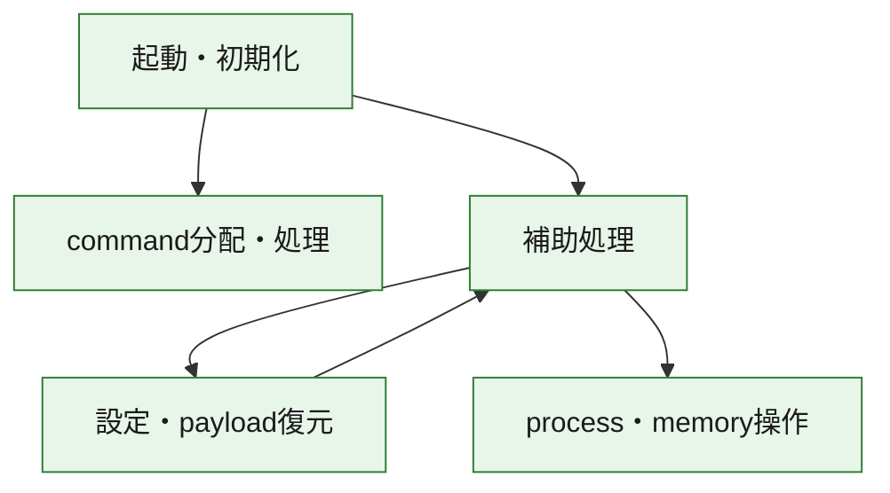
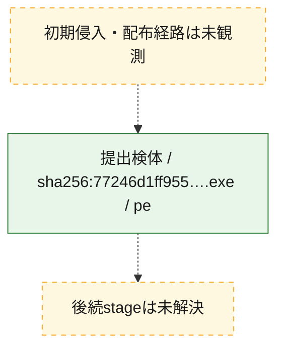
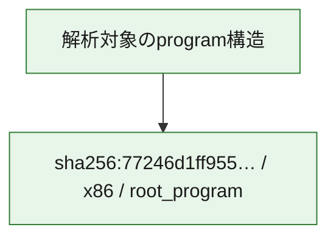

# 全体ロジック：77246d1ff9553fbc339a1c77bbdb9e0996b755b9e6689e65810962591537c3ad

代表関数の静的証跡から、起動・初期化、設定・payload復元、process・memory操作、command分配・処理の処理群を確認しました。

## 読み方

- phaseの掲載順は解析上の整理順です。observed_call_edgesがない段階間の実行順を断定しません。
- 図の実線は静的に観測した関係、点線と黄色のノードは未観測・未解決の関係を示します。
- 図は静的な要約であり、動的実行を再現するものではありません。
- 詳細な関数解説とfingerprintは[STATIC-LOGIC.md](STATIC-LOGIC.md)を参照してください。

## 静的可視化

### 実行フロー

### 感染チェーン

### モジュール関係

## 処理段階

### 1. 起動・初期化

entry pointから初期化と後続処理への移行を確認します。
確度: `confirmed_static_function_evidence`

- `77246d1ff9553fbc339a1c77bbdb9e0996b755b9e6689e65810962591537c3ad:ghidra:140006be0` — 初期化と主要処理への分岐を行う入口関数です。 状態: `succeeded`、選定理由: `entry_point`, `meaningful_symbol_name`, `reviewed_call_centrality:22`, `role:entrypoint`

### 2. 設定・payload復元

設定、resource、payload、暗号化データの復元・変換を確認します。
確度: `confirmed_static_function_evidence`

- `77246d1ff9553fbc339a1c77bbdb9e0996b755b9e6689e65810962591537c3ad:ghidra:140001470` — 暗号、hash、encoding、または復号処理に関係する関数です。 状態: `succeeded`、選定理由: `context_representative`, `reviewed_call_centrality:17`, `role:cryptographic_transform`

### 3. process・memory操作

process、thread、module、memory操作と実行移行を確認します。
確度: `confirmed_static_function_evidence`

- `77246d1ff9553fbc339a1c77bbdb9e0996b755b9e6689e65810962591537c3ad:ghidra:140001d30` — process、thread、module、またはmemory操作に関係する関数です。 状態: `succeeded`、選定理由: `context_representative`, `reviewed_call_centrality:27`, `role:process_or_memory_operation`

### 4. command分配・処理

受信commandやtaskの解釈、分配、個別handlerへの移行を確認します。
確度: `confirmed_static_function_evidence_with_limits`

- `77246d1ff9553fbc339a1c77bbdb9e0996b755b9e6689e65810962591537c3ad:ghidra:140007560` — commandの解釈、分配、または個別処理を担当する関数です。 状態: `limited_bad_instruction_or_flow`、選定理由: `meaningful_symbol_name`, `reviewed_call_centrality:1`, `role:command_dispatch_or_handler`

### 5. 補助処理

主要処理を支える一般内部関数またはlibrary処理を確認します。
確度: `confirmed_static_function_evidence_with_limits`

- `77246d1ff9553fbc339a1c77bbdb9e0996b755b9e6689e65810962591537c3ad:ghidra:140001000` — 検体内部の一般処理を実装する関数です。 状態: `succeeded`、選定理由: `context_representative`, `reviewed_call_centrality:1`
- `77246d1ff9553fbc339a1c77bbdb9e0996b755b9e6689e65810962591537c3ad:ghidra:140001060` — 検体内部の一般処理を実装する関数です。 状態: `succeeded`、選定理由: `context_representative`, `reviewed_call_centrality:2`
- `77246d1ff9553fbc339a1c77bbdb9e0996b755b9e6689e65810962591537c3ad:ghidra:1400010c0` — 検体内部の一般処理を実装する関数です。 状態: `succeeded`、選定理由: `context_representative`, `reviewed_call_centrality:3`
- `77246d1ff9553fbc339a1c77bbdb9e0996b755b9e6689e65810962591537c3ad:ghidra:140001160` — 検体内部の一般処理を実装する関数です。 状態: `succeeded`、選定理由: `context_representative`, `reviewed_call_centrality:5`
- `77246d1ff9553fbc339a1c77bbdb9e0996b755b9e6689e65810962591537c3ad:ghidra:140001180` — 検体内部の一般処理を実装する関数です。 状態: `succeeded`、選定理由: `context_representative`, `reviewed_call_centrality:2`
- `77246d1ff9553fbc339a1c77bbdb9e0996b755b9e6689e65810962591537c3ad:ghidra:1400011c0` — 検体内部の一般処理を実装する関数です。 状態: `succeeded`、選定理由: `context_representative`, `reviewed_call_centrality:2`
- `77246d1ff9553fbc339a1c77bbdb9e0996b755b9e6689e65810962591537c3ad:ghidra:140001200` — 検体内部の一般処理を実装する関数です。 状態: `succeeded`、選定理由: `context_representative`, `reviewed_call_centrality:2`
- `77246d1ff9553fbc339a1c77bbdb9e0996b755b9e6689e65810962591537c3ad:ghidra:140001220` — 検体内部の一般処理を実装する関数です。 状態: `limited_bad_instruction_or_flow`、選定理由: `context_representative`, `reviewed_call_centrality:4`
- `77246d1ff9553fbc339a1c77bbdb9e0996b755b9e6689e65810962591537c3ad:ghidra:140001260` — 検体内部の一般処理を実装する関数です。 状態: `succeeded`、選定理由: `context_representative`, `reviewed_call_centrality:10`
- `77246d1ff9553fbc339a1c77bbdb9e0996b755b9e6689e65810962591537c3ad:ghidra:1400019b0` — 検体内部の一般処理を実装する関数です。 状態: `succeeded`、選定理由: `context_representative`, `reviewed_call_centrality:10`
- `77246d1ff9553fbc339a1c77bbdb9e0996b755b9e6689e65810962591537c3ad:ghidra:140002810` — 検体内部の一般処理を実装する関数です。 状態: `succeeded`、選定理由: `context_representative`, `reviewed_call_centrality:2`
- `77246d1ff9553fbc339a1c77bbdb9e0996b755b9e6689e65810962591537c3ad:ghidra:1400028c0` — 検体内部の一般処理を実装する関数です。 状態: `succeeded`、選定理由: `context_representative`, `reviewed_call_centrality:4`
- `77246d1ff9553fbc339a1c77bbdb9e0996b755b9e6689e65810962591537c3ad:ghidra:140002a00` — 検体内部の一般処理を実装する関数です。 状態: `succeeded`、選定理由: `context_representative`, `reviewed_call_centrality:3`
- `77246d1ff9553fbc339a1c77bbdb9e0996b755b9e6689e65810962591537c3ad:ghidra:140002af0` — 検体内部の一般処理を実装する関数です。 状態: `succeeded`、選定理由: `context_representative`, `reviewed_call_centrality:6`
- `77246d1ff9553fbc339a1c77bbdb9e0996b755b9e6689e65810962591537c3ad:ghidra:140002bd0` — 検体内部の一般処理を実装する関数です。 状態: `succeeded`、選定理由: `context_representative`, `reviewed_call_centrality:11`
- `77246d1ff9553fbc339a1c77bbdb9e0996b755b9e6689e65810962591537c3ad:ghidra:140002d30` — 検体内部の一般処理を実装する関数です。 状態: `succeeded`、選定理由: `context_representative`, `reviewed_call_centrality:11`
- `77246d1ff9553fbc339a1c77bbdb9e0996b755b9e6689e65810962591537c3ad:ghidra:140002f40` — 検体内部の一般処理を実装する関数です。 状態: `succeeded`、選定理由: `context_representative`, `reviewed_call_centrality:12`
- `77246d1ff9553fbc339a1c77bbdb9e0996b755b9e6689e65810962591537c3ad:ghidra:140002fc0` — 検体内部の一般処理を実装する関数です。 状態: `succeeded`、選定理由: `context_representative`, `reviewed_call_centrality:11`
- `77246d1ff9553fbc339a1c77bbdb9e0996b755b9e6689e65810962591537c3ad:ghidra:140003170` — 検体内部の一般処理を実装する関数です。 状態: `succeeded`、選定理由: `context_representative`, `reviewed_call_centrality:10`
- `77246d1ff9553fbc339a1c77bbdb9e0996b755b9e6689e65810962591537c3ad:ghidra:140003220` — 検体内部の一般処理を実装する関数です。 状態: `succeeded`、選定理由: `context_representative`, `reviewed_call_centrality:11`
- `77246d1ff9553fbc339a1c77bbdb9e0996b755b9e6689e65810962591537c3ad:ghidra:140003290` — 検体内部の一般処理を実装する関数です。 状態: `succeeded`、選定理由: `context_representative`, `reviewed_call_centrality:5`
- `77246d1ff9553fbc339a1c77bbdb9e0996b755b9e6689e65810962591537c3ad:ghidra:140003480` — 検体内部の一般処理を実装する関数です。 状態: `succeeded`、選定理由: `context_representative`, `reviewed_call_centrality:14`
- `77246d1ff9553fbc339a1c77bbdb9e0996b755b9e6689e65810962591537c3ad:ghidra:140003580` — 検体内部の一般処理を実装する関数です。 状態: `succeeded`、選定理由: `context_representative`, `reviewed_call_centrality:12`
- `77246d1ff9553fbc339a1c77bbdb9e0996b755b9e6689e65810962591537c3ad:ghidra:140003660` — 検体内部の一般処理を実装する関数です。 状態: `succeeded`、選定理由: `context_representative`, `reviewed_call_centrality:7`
- `77246d1ff9553fbc339a1c77bbdb9e0996b755b9e6689e65810962591537c3ad:ghidra:140003800` — 検体内部の一般処理を実装する関数です。 状態: `succeeded`、選定理由: `context_representative`, `reviewed_call_centrality:13`
- `77246d1ff9553fbc339a1c77bbdb9e0996b755b9e6689e65810962591537c3ad:ghidra:140003e10` — 検体内部の一般処理を実装する関数です。 状態: `succeeded`、選定理由: `context_representative`, `reviewed_call_centrality:23`
- `77246d1ff9553fbc339a1c77bbdb9e0996b755b9e6689e65810962591537c3ad:ghidra:1400047c0` — 検体内部の一般処理を実装する関数です。 状態: `succeeded`、選定理由: `context_representative`, `reviewed_call_centrality:2`
- `77246d1ff9553fbc339a1c77bbdb9e0996b755b9e6689e65810962591537c3ad:ghidra:140006c60` — 検体内部の一般処理を実装する関数です。 状態: `succeeded`、選定理由: `meaningful_symbol_name`

## 観測したcall関係

- `77246d1ff9553fbc339a1c77bbdb9e0996b755b9e6689e65810962591537c3ad:ghidra:140001470` → `77246d1ff9553fbc339a1c77bbdb9e0996b755b9e6689e65810962591537c3ad:ghidra:140001160` （`configuration` → `support`）
- `77246d1ff9553fbc339a1c77bbdb9e0996b755b9e6689e65810962591537c3ad:ghidra:140001470` → `77246d1ff9553fbc339a1c77bbdb9e0996b755b9e6689e65810962591537c3ad:ghidra:140001260` （`configuration` → `support`）
- `77246d1ff9553fbc339a1c77bbdb9e0996b755b9e6689e65810962591537c3ad:ghidra:1400019b0` → `77246d1ff9553fbc339a1c77bbdb9e0996b755b9e6689e65810962591537c3ad:ghidra:140001160` （`support` → `support`）
- `77246d1ff9553fbc339a1c77bbdb9e0996b755b9e6689e65810962591537c3ad:ghidra:140003220` → `77246d1ff9553fbc339a1c77bbdb9e0996b755b9e6689e65810962591537c3ad:ghidra:140002810` （`support` → `support`）
- `77246d1ff9553fbc339a1c77bbdb9e0996b755b9e6689e65810962591537c3ad:ghidra:140003480` → `77246d1ff9553fbc339a1c77bbdb9e0996b755b9e6689e65810962591537c3ad:ghidra:1400028c0` （`support` → `support`）
- `77246d1ff9553fbc339a1c77bbdb9e0996b755b9e6689e65810962591537c3ad:ghidra:140003660` → `77246d1ff9553fbc339a1c77bbdb9e0996b755b9e6689e65810962591537c3ad:ghidra:140002a00` （`support` → `support`）
- `77246d1ff9553fbc339a1c77bbdb9e0996b755b9e6689e65810962591537c3ad:ghidra:140003800` → `77246d1ff9553fbc339a1c77bbdb9e0996b755b9e6689e65810962591537c3ad:ghidra:140002810` （`support` → `support`）
- `77246d1ff9553fbc339a1c77bbdb9e0996b755b9e6689e65810962591537c3ad:ghidra:140003800` → `77246d1ff9553fbc339a1c77bbdb9e0996b755b9e6689e65810962591537c3ad:ghidra:1400028c0` （`support` → `support`）
- `77246d1ff9553fbc339a1c77bbdb9e0996b755b9e6689e65810962591537c3ad:ghidra:140003800` → `77246d1ff9553fbc339a1c77bbdb9e0996b755b9e6689e65810962591537c3ad:ghidra:140002a00` （`support` → `support`）
- `77246d1ff9553fbc339a1c77bbdb9e0996b755b9e6689e65810962591537c3ad:ghidra:140003e10` → `77246d1ff9553fbc339a1c77bbdb9e0996b755b9e6689e65810962591537c3ad:ghidra:140001470` （`support` → `configuration`）
- `77246d1ff9553fbc339a1c77bbdb9e0996b755b9e6689e65810962591537c3ad:ghidra:140003e10` → `77246d1ff9553fbc339a1c77bbdb9e0996b755b9e6689e65810962591537c3ad:ghidra:1400019b0` （`support` → `support`）
- `77246d1ff9553fbc339a1c77bbdb9e0996b755b9e6689e65810962591537c3ad:ghidra:140003e10` → `77246d1ff9553fbc339a1c77bbdb9e0996b755b9e6689e65810962591537c3ad:ghidra:140001d30` （`support` → `execution`）
- `77246d1ff9553fbc339a1c77bbdb9e0996b755b9e6689e65810962591537c3ad:ghidra:140003e10` → `77246d1ff9553fbc339a1c77bbdb9e0996b755b9e6689e65810962591537c3ad:ghidra:140002af0` （`support` → `support`）
- `77246d1ff9553fbc339a1c77bbdb9e0996b755b9e6689e65810962591537c3ad:ghidra:140006be0` → `77246d1ff9553fbc339a1c77bbdb9e0996b755b9e6689e65810962591537c3ad:ghidra:140003e10` （`startup` → `support`）
- `77246d1ff9553fbc339a1c77bbdb9e0996b755b9e6689e65810962591537c3ad:ghidra:140006be0` → `77246d1ff9553fbc339a1c77bbdb9e0996b755b9e6689e65810962591537c3ad:ghidra:140007560` （`startup` → `dispatch`）
- `ghidra-function:0c49bbe58547599c5229f69c` → `ghidra-external:1945056091db0be6f336308f` （`unclassified` → `unclassified`）
- `ghidra-function:0c49bbe58547599c5229f69c` → `ghidra-external:414e746623d128febecad5b1` （`unclassified` → `unclassified`）
- `ghidra-function:0c49bbe58547599c5229f69c` → `ghidra-external:48ccc530d65ecb38e7d9b7fc` （`unclassified` → `unclassified`）
- `ghidra-function:0c49bbe58547599c5229f69c` → `ghidra-external:66a929055983f57273c0946f` （`unclassified` → `unclassified`）
- `ghidra-function:0c49bbe58547599c5229f69c` → `ghidra-external:80f2c4816422160e3cd70581` （`unclassified` → `unclassified`）
- `ghidra-function:0c49bbe58547599c5229f69c` → `ghidra-external:86a855a0fe912dfa812e046a` （`unclassified` → `unclassified`）
- `ghidra-function:0c49bbe58547599c5229f69c` → `ghidra-external:c67ac2839564c1de09e503cb` （`unclassified` → `unclassified`）
- `ghidra-function:0c49bbe58547599c5229f69c` → `ghidra-external:e28c387cc2889f390e416b17` （`unclassified` → `unclassified`）
- `ghidra-function:0c49bbe58547599c5229f69c` → `ghidra-external:ea9e6266023960c396b19e8f` （`unclassified` → `unclassified`）
- `ghidra-function:0c49bbe58547599c5229f69c` → `ghidra-function:8bcefb24a2e3b65844cb19ee` （`unclassified` → `unclassified`）
- `ghidra-function:0c49bbe58547599c5229f69c` → `ghidra-function:fda5d62389f9dfd80edc598a` （`unclassified` → `unclassified`）
- `ghidra-function:0ef86f274a70a569707c0514` → `ghidra-external:1945056091db0be6f336308f` （`unclassified` → `unclassified`）
- `ghidra-function:0ef86f274a70a569707c0514` → `ghidra-external:414e746623d128febecad5b1` （`unclassified` → `unclassified`）
- `ghidra-function:0ef86f274a70a569707c0514` → `ghidra-external:48ccc530d65ecb38e7d9b7fc` （`unclassified` → `unclassified`）
- `ghidra-function:0ef86f274a70a569707c0514` → `ghidra-external:66a929055983f57273c0946f` （`unclassified` → `unclassified`）
- `ghidra-function:0ef86f274a70a569707c0514` → `ghidra-external:80f2c4816422160e3cd70581` （`unclassified` → `unclassified`）
- `ghidra-function:0ef86f274a70a569707c0514` → `ghidra-external:86a855a0fe912dfa812e046a` （`unclassified` → `unclassified`）
- `ghidra-function:0ef86f274a70a569707c0514` → `ghidra-external:c67ac2839564c1de09e503cb` （`unclassified` → `unclassified`）
- `ghidra-function:0ef86f274a70a569707c0514` → `ghidra-external:e28c387cc2889f390e416b17` （`unclassified` → `unclassified`）
- `ghidra-function:0ef86f274a70a569707c0514` → `ghidra-external:ea9e6266023960c396b19e8f` （`unclassified` → `unclassified`）
- `ghidra-function:0ef86f274a70a569707c0514` → `ghidra-function:47238a51e2a0f08d909b8fed` （`unclassified` → `unclassified`）
- `ghidra-function:0ef86f274a70a569707c0514` → `ghidra-function:fda5d62389f9dfd80edc598a` （`unclassified` → `unclassified`）
- `ghidra-function:19c8ebc2267eec8ba1c4c5e6` → `ghidra-external:b7e8670f71f9c87b37a7a92d` （`unclassified` → `unclassified`）
- `ghidra-function:29b6d86bcaceed2f220ee70f` → `ghidra-external:225f2ebbc0c2b44e6ef98998` （`unclassified` → `unclassified`）
- `ghidra-function:29b6d86bcaceed2f220ee70f` → `ghidra-external:867ed1ad6d0f466db2997ad3` （`unclassified` → `unclassified`）
- `ghidra-function:29b6d86bcaceed2f220ee70f` → `ghidra-external:a562ef36e17b902c0b5c1378` （`unclassified` → `unclassified`）
- `ghidra-function:29b6d86bcaceed2f220ee70f` → `ghidra-external:e72e92499a16f43a601d30c4` （`unclassified` → `unclassified`）
- `ghidra-function:29b6d86bcaceed2f220ee70f` → `ghidra-function:066b134f921e1484efbd1fff` （`unclassified` → `unclassified`）
- `ghidra-function:29b6d86bcaceed2f220ee70f` → `ghidra-function:082cd804659966ae181899dd` （`unclassified` → `unclassified`）
- `ghidra-function:29b6d86bcaceed2f220ee70f` → `ghidra-function:0c282815cc888a5d658f9f88` （`unclassified` → `unclassified`）
- `ghidra-function:29b6d86bcaceed2f220ee70f` → `ghidra-function:2fdbf950ed7802ca1e9102e0` （`unclassified` → `unclassified`）
- `ghidra-function:29b6d86bcaceed2f220ee70f` → `ghidra-function:40ecad0d4b3b052fca2d9f0c` （`unclassified` → `unclassified`）
- `ghidra-function:29b6d86bcaceed2f220ee70f` → `ghidra-function:4d0609e03757a20f4da0aa05` （`unclassified` → `unclassified`）
- `ghidra-function:29b6d86bcaceed2f220ee70f` → `ghidra-function:69224f7974649826138b3b3a` （`unclassified` → `unclassified`）
- `ghidra-function:29b6d86bcaceed2f220ee70f` → `ghidra-function:75315dbd82b21a89914fabbe` （`unclassified` → `unclassified`）
- `ghidra-function:29b6d86bcaceed2f220ee70f` → `ghidra-function:89107d9e6adb9040d379298b` （`unclassified` → `unclassified`）
- `ghidra-function:29b6d86bcaceed2f220ee70f` → `ghidra-function:8db020d69288cdf493fa45de` （`unclassified` → `unclassified`）
- `ghidra-function:29b6d86bcaceed2f220ee70f` → `ghidra-function:9710f2c4df8a048263a6550c` （`unclassified` → `unclassified`）
- `ghidra-function:29b6d86bcaceed2f220ee70f` → `ghidra-function:a5ee73d58e5a07180c81edbb` （`unclassified` → `unclassified`）
- `ghidra-function:29b6d86bcaceed2f220ee70f` → `ghidra-function:ab6b14c131134448f38c3bb2` （`unclassified` → `unclassified`）
- `ghidra-function:29b6d86bcaceed2f220ee70f` → `ghidra-function:b96de36b00aa9b58ef02c642` （`unclassified` → `unclassified`）
- `ghidra-function:29b6d86bcaceed2f220ee70f` → `ghidra-function:e7c6a48861243e410c6d55e1` （`unclassified` → `unclassified`）
- `ghidra-function:29b6d86bcaceed2f220ee70f` → `ghidra-function:fda5d62389f9dfd80edc598a` （`unclassified` → `unclassified`）
- `ghidra-function:2c3e9d96e781a53eab423187` → `ghidra-external:031f501d422778ea8a76291b` （`unclassified` → `unclassified`）
- `ghidra-function:2c3e9d96e781a53eab423187` → `ghidra-external:1945056091db0be6f336308f` （`unclassified` → `unclassified`）
- `ghidra-function:2c3e9d96e781a53eab423187` → `ghidra-external:414e746623d128febecad5b1` （`unclassified` → `unclassified`）
- `ghidra-function:2c3e9d96e781a53eab423187` → `ghidra-external:48ccc530d65ecb38e7d9b7fc` （`unclassified` → `unclassified`）
- `ghidra-function:2c3e9d96e781a53eab423187` → `ghidra-external:66a929055983f57273c0946f` （`unclassified` → `unclassified`）
- `ghidra-function:2c3e9d96e781a53eab423187` → `ghidra-external:80f2c4816422160e3cd70581` （`unclassified` → `unclassified`）
- `ghidra-function:2c3e9d96e781a53eab423187` → `ghidra-external:a562ef36e17b902c0b5c1378` （`unclassified` → `unclassified`）
- `ghidra-function:2c3e9d96e781a53eab423187` → `ghidra-external:c6359c79bb214a35bb62aeaf` （`unclassified` → `unclassified`）
- `ghidra-function:2c3e9d96e781a53eab423187` → `ghidra-external:c67ac2839564c1de09e503cb` （`unclassified` → `unclassified`）
- `ghidra-function:2c3e9d96e781a53eab423187` → `ghidra-external:e28c387cc2889f390e416b17` （`unclassified` → `unclassified`）
- `ghidra-function:2c3e9d96e781a53eab423187` → `ghidra-external:ea9e6266023960c396b19e8f` （`unclassified` → `unclassified`）
- `ghidra-function:2c3e9d96e781a53eab423187` → `ghidra-function:36e243d48be05f45cc3068d3` （`unclassified` → `unclassified`）
- `ghidra-function:2c3e9d96e781a53eab423187` → `ghidra-function:8bcefb24a2e3b65844cb19ee` （`unclassified` → `unclassified`）
- `ghidra-function:2c3e9d96e781a53eab423187` → `ghidra-function:fda5d62389f9dfd80edc598a` （`unclassified` → `unclassified`）
- `ghidra-function:2fdbf950ed7802ca1e9102e0` → `ghidra-external:225f2ebbc0c2b44e6ef98998` （`unclassified` → `unclassified`）
- `ghidra-function:2fdbf950ed7802ca1e9102e0` → `ghidra-external:867ed1ad6d0f466db2997ad3` （`unclassified` → `unclassified`）
- `ghidra-function:2fdbf950ed7802ca1e9102e0` → `ghidra-external:e72e92499a16f43a601d30c4` （`unclassified` → `unclassified`）
- `ghidra-function:2fdbf950ed7802ca1e9102e0` → `ghidra-function:30afdd20b501501fe4bd1227` （`unclassified` → `unclassified`）
- `ghidra-function:2fdbf950ed7802ca1e9102e0` → `ghidra-function:4d0609e03757a20f4da0aa05` （`unclassified` → `unclassified`）
- `ghidra-function:2fdbf950ed7802ca1e9102e0` → `ghidra-function:75315dbd82b21a89914fabbe` （`unclassified` → `unclassified`）
- `ghidra-function:2fdbf950ed7802ca1e9102e0` → `ghidra-function:ce678c588c78accf86acd734` （`unclassified` → `unclassified`）
- `ghidra-function:2fdbf950ed7802ca1e9102e0` → `ghidra-function:dbbf882f8b22ea9f790ac3fc` （`unclassified` → `unclassified`）
- `ghidra-function:2fdbf950ed7802ca1e9102e0` → `ghidra-function:e4e7e79853c0a7e2e861057f` （`unclassified` → `unclassified`）
- `ghidra-function:36e243d48be05f45cc3068d3` → `ghidra-external:d81b42cf02c9eb79dc7668c4` （`unclassified` → `unclassified`）
- `ghidra-function:36e243d48be05f45cc3068d3` → `ghidra-function:8bcefb24a2e3b65844cb19ee` （`unclassified` → `unclassified`）
- `ghidra-function:4684234f956a83b0ec36460e` → `ghidra-function:953fc3d5f6c41dffabe162b5` （`unclassified` → `unclassified`）
- `ghidra-function:4684234f956a83b0ec36460e` → `ghidra-function:b0eb7766665a70360a084811` （`unclassified` → `unclassified`）
- `ghidra-function:53eb26a9fa513c8973b5d7ff` → `ghidra-function:93df3cf53641da6c0fa6ef03` （`unclassified` → `unclassified`）
- `ghidra-function:5b3c0f1686d587174034fa37` → `ghidra-external:1945056091db0be6f336308f` （`unclassified` → `unclassified`）
- `ghidra-function:5b3c0f1686d587174034fa37` → `ghidra-external:414e746623d128febecad5b1` （`unclassified` → `unclassified`）
- `ghidra-function:5b3c0f1686d587174034fa37` → `ghidra-external:48ccc530d65ecb38e7d9b7fc` （`unclassified` → `unclassified`）
- `ghidra-function:5b3c0f1686d587174034fa37` → `ghidra-external:66a929055983f57273c0946f` （`unclassified` → `unclassified`）
- `ghidra-function:5b3c0f1686d587174034fa37` → `ghidra-external:80f2c4816422160e3cd70581` （`unclassified` → `unclassified`）
- `ghidra-function:5b3c0f1686d587174034fa37` → `ghidra-external:86a855a0fe912dfa812e046a` （`unclassified` → `unclassified`）
- `ghidra-function:5b3c0f1686d587174034fa37` → `ghidra-external:a562ef36e17b902c0b5c1378` （`unclassified` → `unclassified`）
- `ghidra-function:5b3c0f1686d587174034fa37` → `ghidra-external:c67ac2839564c1de09e503cb` （`unclassified` → `unclassified`）
- `ghidra-function:5b3c0f1686d587174034fa37` → `ghidra-external:e28c387cc2889f390e416b17` （`unclassified` → `unclassified`）
- `ghidra-function:5b3c0f1686d587174034fa37` → `ghidra-external:ea9e6266023960c396b19e8f` （`unclassified` → `unclassified`）
- `ghidra-function:5b3c0f1686d587174034fa37` → `ghidra-function:8bcefb24a2e3b65844cb19ee` （`unclassified` → `unclassified`）
- `ghidra-function:5b3c0f1686d587174034fa37` → `ghidra-function:fda5d62389f9dfd80edc598a` （`unclassified` → `unclassified`）
- `ghidra-function:5cb685fb77f650bedde289b5` → `ghidra-external:225f2ebbc0c2b44e6ef98998` （`unclassified` → `unclassified`）
- `ghidra-function:5cb685fb77f650bedde289b5` → `ghidra-external:86a855a0fe912dfa812e046a` （`unclassified` → `unclassified`）
- `ghidra-function:5cb685fb77f650bedde289b5` → `ghidra-external:e72e92499a16f43a601d30c4` （`unclassified` → `unclassified`）
- `ghidra-function:5cb685fb77f650bedde289b5` → `ghidra-function:75315dbd82b21a89914fabbe` （`unclassified` → `unclassified`）
- `ghidra-function:5cb685fb77f650bedde289b5` → `ghidra-function:8bcefb24a2e3b65844cb19ee` （`unclassified` → `unclassified`）
- `ghidra-function:5cb685fb77f650bedde289b5` → `ghidra-function:98b1b20519e0bcda294cdf67` （`unclassified` → `unclassified`）
- `ghidra-function:5cb685fb77f650bedde289b5` → `ghidra-function:fda5d62389f9dfd80edc598a` （`unclassified` → `unclassified`）
- `ghidra-function:69224f7974649826138b3b3a` → `ghidra-external:225f2ebbc0c2b44e6ef98998` （`unclassified` → `unclassified`）
- `ghidra-function:69224f7974649826138b3b3a` → `ghidra-external:d81b42cf02c9eb79dc7668c4` （`unclassified` → `unclassified`）
- `ghidra-function:69224f7974649826138b3b3a` → `ghidra-function:40ecad0d4b3b052fca2d9f0c` （`unclassified` → `unclassified`）
- `ghidra-function:69224f7974649826138b3b3a` → `ghidra-function:4d0609e03757a20f4da0aa05` （`unclassified` → `unclassified`）
- `ghidra-function:69224f7974649826138b3b3a` → `ghidra-function:fda5d62389f9dfd80edc598a` （`unclassified` → `unclassified`）
- `ghidra-function:6c7859c0429ca7007c5a67fe` → `ghidra-external:225f2ebbc0c2b44e6ef98998` （`unclassified` → `unclassified`）
- `ghidra-function:6c7859c0429ca7007c5a67fe` → `ghidra-external:e72e92499a16f43a601d30c4` （`unclassified` → `unclassified`）
- `ghidra-function:8038695e652fc85fdf8e9693` → `ghidra-external:57164c0d9957ef8a6e4e3052` （`unclassified` → `unclassified`）
- `ghidra-function:8038695e652fc85fdf8e9693` → `ghidra-external:86a855a0fe912dfa812e046a` （`unclassified` → `unclassified`）
- `ghidra-function:8038695e652fc85fdf8e9693` → `ghidra-external:fdcc5b3feb3f8b62046e17a9` （`unclassified` → `unclassified`）
- `ghidra-function:8038695e652fc85fdf8e9693` → `ghidra-function:8bcefb24a2e3b65844cb19ee` （`unclassified` → `unclassified`）
- `ghidra-function:8038695e652fc85fdf8e9693` → `ghidra-function:fda5d62389f9dfd80edc598a` （`unclassified` → `unclassified`）
- `ghidra-function:8a0f14ab97b65467ec715157` → `ghidra-function:93df3cf53641da6c0fa6ef03` （`unclassified` → `unclassified`）
- `ghidra-function:8db020d69288cdf493fa45de` → `ghidra-external:225f2ebbc0c2b44e6ef98998` （`unclassified` → `unclassified`）
- `ghidra-function:8db020d69288cdf493fa45de` → `ghidra-external:8d2520646b9040eb1ba93c8e` （`unclassified` → `unclassified`）
- `ghidra-function:8db020d69288cdf493fa45de` → `ghidra-external:d81b42cf02c9eb79dc7668c4` （`unclassified` → `unclassified`）
- `ghidra-function:8db020d69288cdf493fa45de` → `ghidra-external:e72e92499a16f43a601d30c4` （`unclassified` → `unclassified`）
- `ghidra-function:8db020d69288cdf493fa45de` → `ghidra-external:ed9849d6044947137a469683` （`unclassified` → `unclassified`）
- `ghidra-function:8db020d69288cdf493fa45de` → `ghidra-function:1b1f12ca6156e3a20b06f053` （`unclassified` → `unclassified`）
- `ghidra-function:8db020d69288cdf493fa45de` → `ghidra-function:1c30e57d5b1c83bf82b32cc7` （`unclassified` → `unclassified`）
- `ghidra-function:8db020d69288cdf493fa45de` → `ghidra-function:4d0609e03757a20f4da0aa05` （`unclassified` → `unclassified`）
- `ghidra-function:8db020d69288cdf493fa45de` → `ghidra-function:75315dbd82b21a89914fabbe` （`unclassified` → `unclassified`）
- `ghidra-function:8db020d69288cdf493fa45de` → `ghidra-function:953fc3d5f6c41dffabe162b5` （`unclassified` → `unclassified`）
- `ghidra-function:8db020d69288cdf493fa45de` → `ghidra-function:b0eb7766665a70360a084811` （`unclassified` → `unclassified`）
- `ghidra-function:8db020d69288cdf493fa45de` → `ghidra-function:dbbf882f8b22ea9f790ac3fc` （`unclassified` → `unclassified`）
- `ghidra-function:8db020d69288cdf493fa45de` → `ghidra-function:dedafafc8637e290598f5b56` （`unclassified` → `unclassified`）
- `ghidra-function:98b1b20519e0bcda294cdf67` → `ghidra-function:a054f9a145b2bdfaaf58adcd` （`unclassified` → `unclassified`）
- `ghidra-function:9b499c0cd30533ef488f2b0f` → `ghidra-function:93df3cf53641da6c0fa6ef03` （`unclassified` → `unclassified`）
- `ghidra-function:ab6b14c131134448f38c3bb2` → `ghidra-external:225f2ebbc0c2b44e6ef98998` （`unclassified` → `unclassified`）
- `ghidra-function:ab6b14c131134448f38c3bb2` → `ghidra-external:338c32d8a499717576a408fd` （`unclassified` → `unclassified`）
- `ghidra-function:ab6b14c131134448f38c3bb2` → `ghidra-external:80f2c4816422160e3cd70581` （`unclassified` → `unclassified`）
- `ghidra-function:ab6b14c131134448f38c3bb2` → `ghidra-external:867ed1ad6d0f466db2997ad3` （`unclassified` → `unclassified`）
- `ghidra-function:ab6b14c131134448f38c3bb2` → `ghidra-external:c949ae1111f360fde6914cce` （`unclassified` → `unclassified`）
- `ghidra-function:ab6b14c131134448f38c3bb2` → `ghidra-external:d81b42cf02c9eb79dc7668c4` （`unclassified` → `unclassified`）
- `ghidra-function:ab6b14c131134448f38c3bb2` → `ghidra-external:e72e92499a16f43a601d30c4` （`unclassified` → `unclassified`）
- `ghidra-function:ab6b14c131134448f38c3bb2` → `ghidra-external:ed9849d6044947137a469683` （`unclassified` → `unclassified`）
- `ghidra-function:ab6b14c131134448f38c3bb2` → `ghidra-function:094bc6712af5d4cfb3b62308` （`unclassified` → `unclassified`）
- `ghidra-function:ab6b14c131134448f38c3bb2` → `ghidra-function:387564bffd2de97fecb1ccda` （`unclassified` → `unclassified`）
- `ghidra-function:ab6b14c131134448f38c3bb2` → `ghidra-function:3c00ecb59b9e693b5f89fe08` （`unclassified` → `unclassified`）
- `ghidra-function:ab6b14c131134448f38c3bb2` → `ghidra-function:476b6f87f85ee17f69cb2a0b` （`unclassified` → `unclassified`）
- `ghidra-function:ab6b14c131134448f38c3bb2` → `ghidra-function:75315dbd82b21a89914fabbe` （`unclassified` → `unclassified`）
- `ghidra-function:ab6b14c131134448f38c3bb2` → `ghidra-function:880b580261a381b4cc0fe580` （`unclassified` → `unclassified`）
- `ghidra-function:ab6b14c131134448f38c3bb2` → `ghidra-function:99f2b53100da5abd997d13ee` （`unclassified` → `unclassified`）
- `ghidra-function:ab6b14c131134448f38c3bb2` → `ghidra-function:b8bf8525b6ff29e73decbc3e` （`unclassified` → `unclassified`）
- `ghidra-function:ab6b14c131134448f38c3bb2` → `ghidra-function:f543f5667c5075556eb29b36` （`unclassified` → `unclassified`）
- `ghidra-function:ab6b14c131134448f38c3bb2` → `ghidra-function:fea33d3cf78cd2ec66727b02` （`unclassified` → `unclassified`）
- `ghidra-function:ab6b14c131134448f38c3bb2` → `ghidra-function:fffcd3d6ddcc058dc2d11561` （`unclassified` → `unclassified`）
- `ghidra-function:ac8d250f6c206a4229a4ad60` → `ghidra-external:1945056091db0be6f336308f` （`unclassified` → `unclassified`）
- `ghidra-function:ac8d250f6c206a4229a4ad60` → `ghidra-external:414e746623d128febecad5b1` （`unclassified` → `unclassified`）
- `ghidra-function:ac8d250f6c206a4229a4ad60` → `ghidra-external:48ccc530d65ecb38e7d9b7fc` （`unclassified` → `unclassified`）
- `ghidra-function:ac8d250f6c206a4229a4ad60` → `ghidra-external:66a929055983f57273c0946f` （`unclassified` → `unclassified`）
- `ghidra-function:ac8d250f6c206a4229a4ad60` → `ghidra-external:80f2c4816422160e3cd70581` （`unclassified` → `unclassified`）
- `ghidra-function:ac8d250f6c206a4229a4ad60` → `ghidra-external:8f78aa57b6a3b82a417cf36f` （`unclassified` → `unclassified`）
- `ghidra-function:ac8d250f6c206a4229a4ad60` → `ghidra-external:a562ef36e17b902c0b5c1378` （`unclassified` → `unclassified`）
- `ghidra-function:ac8d250f6c206a4229a4ad60` → `ghidra-external:c67ac2839564c1de09e503cb` （`unclassified` → `unclassified`）
- `ghidra-function:ac8d250f6c206a4229a4ad60` → `ghidra-external:e28c387cc2889f390e416b17` （`unclassified` → `unclassified`）
- `ghidra-function:ac8d250f6c206a4229a4ad60` → `ghidra-external:ea9e6266023960c396b19e8f` （`unclassified` → `unclassified`）
- `ghidra-function:ac8d250f6c206a4229a4ad60` → `ghidra-function:8bcefb24a2e3b65844cb19ee` （`unclassified` → `unclassified`）
- `ghidra-function:ac8d250f6c206a4229a4ad60` → `ghidra-function:fda5d62389f9dfd80edc598a` （`unclassified` → `unclassified`）
- `ghidra-function:b6216861fad0bbc989c30891` → `ghidra-external:6fddef57267348f22acf69d1` （`unclassified` → `unclassified`）
- `ghidra-function:b6216861fad0bbc989c30891` → `ghidra-external:e72e92499a16f43a601d30c4` （`unclassified` → `unclassified`）
- `ghidra-function:bab937337090216c44f3adf0` → `ghidra-external:1945056091db0be6f336308f` （`unclassified` → `unclassified`）
- `ghidra-function:bab937337090216c44f3adf0` → `ghidra-external:414e746623d128febecad5b1` （`unclassified` → `unclassified`）
- `ghidra-function:bab937337090216c44f3adf0` → `ghidra-external:48ccc530d65ecb38e7d9b7fc` （`unclassified` → `unclassified`）
- `ghidra-function:bab937337090216c44f3adf0` → `ghidra-external:66a929055983f57273c0946f` （`unclassified` → `unclassified`）
- `ghidra-function:bab937337090216c44f3adf0` → `ghidra-external:80f2c4816422160e3cd70581` （`unclassified` → `unclassified`）
- `ghidra-function:bab937337090216c44f3adf0` → `ghidra-external:86a855a0fe912dfa812e046a` （`unclassified` → `unclassified`）
- `ghidra-function:bab937337090216c44f3adf0` → `ghidra-external:c67ac2839564c1de09e503cb` （`unclassified` → `unclassified`）
- `ghidra-function:bab937337090216c44f3adf0` → `ghidra-external:e28c387cc2889f390e416b17` （`unclassified` → `unclassified`）
- `ghidra-function:bab937337090216c44f3adf0` → `ghidra-external:ea9e6266023960c396b19e8f` （`unclassified` → `unclassified`）
- `ghidra-function:bab937337090216c44f3adf0` → `ghidra-function:fda5d62389f9dfd80edc598a` （`unclassified` → `unclassified`）
- `ghidra-function:c6cde07dbc72fd37de1f7c58` → `ghidra-external:225f2ebbc0c2b44e6ef98998` （`unclassified` → `unclassified`）
- `ghidra-function:c6cde07dbc72fd37de1f7c58` → `ghidra-function:d398f388aca154c53e6fc775` （`unclassified` → `unclassified`）
- `ghidra-function:cd5c7e00d9024a10202e42ea` → `ghidra-external:031f501d422778ea8a76291b` （`unclassified` → `unclassified`）
- `ghidra-function:cd5c7e00d9024a10202e42ea` → `ghidra-external:225f2ebbc0c2b44e6ef98998` （`unclassified` → `unclassified`）
- `ghidra-function:cd5c7e00d9024a10202e42ea` → `ghidra-external:86a855a0fe912dfa812e046a` （`unclassified` → `unclassified`）
- `ghidra-function:cd5c7e00d9024a10202e42ea` → `ghidra-external:8f78aa57b6a3b82a417cf36f` （`unclassified` → `unclassified`）
- `ghidra-function:cd5c7e00d9024a10202e42ea` → `ghidra-external:a562ef36e17b902c0b5c1378` （`unclassified` → `unclassified`）
- `ghidra-function:cd5c7e00d9024a10202e42ea` → `ghidra-external:c6359c79bb214a35bb62aeaf` （`unclassified` → `unclassified`）
- `ghidra-function:cd5c7e00d9024a10202e42ea` → `ghidra-external:e72e92499a16f43a601d30c4` （`unclassified` → `unclassified`）
- `ghidra-function:cd5c7e00d9024a10202e42ea` → `ghidra-function:36e243d48be05f45cc3068d3` （`unclassified` → `unclassified`）
- `ghidra-function:cd5c7e00d9024a10202e42ea` → `ghidra-function:47238a51e2a0f08d909b8fed` （`unclassified` → `unclassified`）
- `ghidra-function:cd5c7e00d9024a10202e42ea` → `ghidra-function:75315dbd82b21a89914fabbe` （`unclassified` → `unclassified`）
- `ghidra-function:cd5c7e00d9024a10202e42ea` → `ghidra-function:8bcefb24a2e3b65844cb19ee` （`unclassified` → `unclassified`）
- `ghidra-function:cd5c7e00d9024a10202e42ea` → `ghidra-function:98b1b20519e0bcda294cdf67` （`unclassified` → `unclassified`）
- `ghidra-function:cd5c7e00d9024a10202e42ea` → `ghidra-function:fda5d62389f9dfd80edc598a` （`unclassified` → `unclassified`）
- `ghidra-function:d15bd1322ce5b7ff981698a0` → `ghidra-external:1945056091db0be6f336308f` （`unclassified` → `unclassified`）
- `ghidra-function:d15bd1322ce5b7ff981698a0` → `ghidra-external:414e746623d128febecad5b1` （`unclassified` → `unclassified`）
- `ghidra-function:d15bd1322ce5b7ff981698a0` → `ghidra-external:48ccc530d65ecb38e7d9b7fc` （`unclassified` → `unclassified`）
- `ghidra-function:d15bd1322ce5b7ff981698a0` → `ghidra-external:66a929055983f57273c0946f` （`unclassified` → `unclassified`）
- `ghidra-function:d15bd1322ce5b7ff981698a0` → `ghidra-external:80f2c4816422160e3cd70581` （`unclassified` → `unclassified`）
- `ghidra-function:d15bd1322ce5b7ff981698a0` → `ghidra-external:86a855a0fe912dfa812e046a` （`unclassified` → `unclassified`）
- `ghidra-function:d15bd1322ce5b7ff981698a0` → `ghidra-external:c67ac2839564c1de09e503cb` （`unclassified` → `unclassified`）
- `ghidra-function:d15bd1322ce5b7ff981698a0` → `ghidra-external:e28c387cc2889f390e416b17` （`unclassified` → `unclassified`）
- `ghidra-function:d15bd1322ce5b7ff981698a0` → `ghidra-external:ea9e6266023960c396b19e8f` （`unclassified` → `unclassified`）
- 残り43件は`static-logic.json`に記録しています。

## 解析範囲と制約

- 選定外関数は全体inventoryへ残しますが、関数本体の個別解説対象にはしていません。
- indirect call、難読化、packer、VM、壊れたcontrol flowによりcall関係が欠落する場合があります。
- 文書は静的解析に基づき、検体実行や外部通信による動的確認は行っていません。
